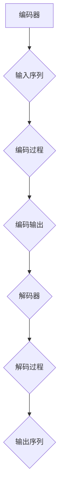

                 

### 序列到序列模型 (Seq2Seq) 原理与代码实例讲解

#### 摘要

序列到序列（Seq2Seq）模型是深度学习领域一种重要的神经网络架构，主要用于处理输入和输出为序列的问题。本文将详细讲解Seq2Seq模型的基本原理、核心算法以及实现步骤。通过实际的代码实例，我们将深入理解Seq2Seq模型的运作机制，并探索其在自然语言处理、机器翻译等领域的广泛应用。本文旨在为读者提供一个全面、系统的学习和实践指导。

#### 背景介绍

随着深度学习技术的不断发展，神经网络在处理序列数据方面取得了显著的成果。序列到序列（Seq2Seq）模型作为一种经典架构，被广泛应用于自然语言处理、机器翻译、音频识别等领域。Seq2Seq模型的核心思想是将一个序列映射到另一个序列，其结构简单但功能强大，能够有效处理变长序列数据。

在自然语言处理领域，Seq2Seq模型常用于机器翻译、文本生成、对话系统等任务。例如，在机器翻译任务中，输入序列是一段源语言文本，输出序列是目标语言文本。通过Seq2Seq模型，我们可以实现自动翻译，使得计算机能够跨越语言障碍，实现跨语言信息传递。

在机器翻译任务中，输入序列是一段源语言文本，输出序列是目标语言文本。通过Seq2Seq模型，我们可以实现自动翻译，使得计算机能够跨越语言障碍，实现跨语言信息传递。Seq2Seq模型的结构包括编码器（Encoder）和解码器（Decoder），编码器负责将输入序列编码成一个固定长度的向量，解码器则负责将这个向量解码成输出序列。

在机器翻译任务中，输入序列是一段源语言文本，输出序列是目标语言文本。通过Seq2Seq模型，我们可以实现自动翻译，使得计算机能够跨越语言障碍，实现跨语言信息传递。Seq2Seq模型的结构包括编码器（Encoder）和解码器（Decoder），编码器负责将输入序列编码成一个固定长度的向量，解码器则负责将这个向量解码成输出序列。

编码器和解码器之间的交互过程，使得Seq2Seq模型能够学习到输入和输出序列之间的复杂映射关系。在训练过程中，模型通过不断调整参数，优化输出序列的质量，从而提高翻译的准确性。此外，Seq2Seq模型还可以结合注意力机制（Attention Mechanism），进一步改进翻译效果。

#### 核心概念与联系

为了更好地理解Seq2Seq模型，我们需要掌握以下几个核心概念：

1. **编码器（Encoder）**：编码器负责将输入序列编码成一个固定长度的向量，这个向量包含了输入序列的语义信息。编码器通常采用循环神经网络（RNN）或者其变种，如长短期记忆网络（LSTM）或门控循环单元（GRU）。

2. **解码器（Decoder）**：解码器负责将编码器输出的固定长度向量解码成输出序列。解码器同样采用RNN或其变种，在解码过程中，解码器不仅需要生成输出序列，还需要与编码器输出向量进行交互，以学习输入和输出序列之间的映射关系。

3. **注意力机制（Attention Mechanism）**：注意力机制是一种改进Seq2Seq模型性能的方法，它使得解码器能够关注编码器输出向量中的不同部分，从而更好地捕捉输入和输出序列之间的关联。注意力机制可以通过计算编码器输出向量与解码器隐藏状态之间的相似度，为解码器提供关于输入序列的上下文信息。

4. **损失函数（Loss Function）**：在Seq2Seq模型训练过程中，损失函数用于衡量输出序列与目标序列之间的差距。常用的损失函数包括交叉熵损失（Cross-Entropy Loss）和平均平方误差（Mean Squared Error）。

下面是一个简单的Mermaid流程图，展示了Seq2Seq模型的基本架构：



在编码过程中，编码器将输入序列编码成一个固定长度的向量；在解码过程中，解码器将这个向量解码成输出序列。编码器和解码器之间的交互过程，以及注意力机制的应用，使得Seq2Seq模型能够有效处理输入和输出为序列的问题。

#### 核心算法原理 & 具体操作步骤

为了深入理解Seq2Seq模型的原理，我们首先需要了解其核心算法。

**编码器（Encoder）**：编码器的主要任务是将输入序列编码成一个固定长度的向量。这个过程通常采用循环神经网络（RNN）或者其变种，如LSTM或GRU。下面是一个简化的编码器算法步骤：

1. **输入序列预处理**：将输入序列转化为神经网络可处理的格式，例如词向量表示。
2. **RNN循环处理**：对输入序列的每个元素进行循环处理，更新隐藏状态。
3. **编码输出**：在RNN处理完整个输入序列后，得到一个固定长度的编码输出向量。

**解码器（Decoder）**：解码器的主要任务是将编码器输出的向量解码成输出序列。解码器同样采用RNN或其变种，在解码过程中，解码器不仅需要生成输出序列，还需要与编码器输出向量进行交互。下面是一个简化的解码器算法步骤：

1. **初始化解码器状态**：根据编码器输出的向量初始化解码器状态。
2. **RNN循环处理**：对解码器的隐藏状态进行循环处理，生成输出序列的每个元素。
3. **输出序列生成**：在RNN处理完所有元素后，得到完整的输出序列。

**注意力机制（Attention Mechanism）**：注意力机制是Seq2Seq模型中的一个重要组件，它使得解码器能够关注编码器输出向量中的不同部分，从而更好地捕捉输入和输出序列之间的关联。下面是一个简化的注意力机制算法步骤：

1. **计算注意力权重**：计算编码器输出向量与解码器隐藏状态之间的相似度，得到注意力权重。
2. **加权求和**：将编码器输出向量与注意力权重相乘，得到加权求和结果。
3. **解码器输入**：将加权求和结果作为解码器的输入，用于生成输出序列的每个元素。

**损失函数（Loss Function）**：在Seq2Seq模型训练过程中，损失函数用于衡量输出序列与目标序列之间的差距。常用的损失函数包括交叉熵损失（Cross-Entropy Loss）和平均平方误差（Mean Squared Error）。下面是一个简化的损失函数计算步骤：

1. **计算预测概率**：根据解码器的输出，计算输出序列的预测概率。
2. **计算损失值**：计算预测概率与实际标签之间的差距，得到损失值。
3. **反向传播**：根据损失值更新模型参数。

通过上述核心算法步骤，我们可以构建一个完整的Seq2Seq模型，用于处理输入和输出为序列的问题。在实际应用中，我们还需要考虑数据预处理、模型优化、超参数调整等问题，以提高模型性能。

#### 数学模型和公式 & 详细讲解 & 举例说明

在理解了Seq2Seq模型的核心算法原理后，我们将进一步探讨其背后的数学模型和公式。这些数学模型不仅帮助我们理解模型的运作机制，也为实际编程实现提供了理论基础。

**1. 编码器（Encoder）**

编码器的核心是一个循环神经网络（RNN），它通过迭代处理输入序列的每个元素，最终将输入序列编码成一个固定长度的向量。下面是编码器的数学模型：

$$
h_t^E = \text{RNN}(h_{t-1}^E, x_t)
$$

其中，\(h_t^E\) 表示编码器在时间步 \(t\) 的隐藏状态，\(h_{t-1}^E\) 表示前一个时间步的隐藏状态，\(x_t\) 表示输入序列在时间步 \(t\) 的元素。RNN 的具体实现可以是 LSTM 或 GRU，它们通过门控机制来控制信息流动，从而有效捕捉长距离依赖。

**2. 解码器（Decoder）**

解码器同样是一个循环神经网络，它通过迭代生成输出序列的每个元素。解码器的输入包括编码器的隐藏状态和上一个时间步的输出。下面是解码器的数学模型：

$$
y_t^D = \text{RNN}(y_{t-1}^D, h_t^E)
$$

其中，\(y_t^D\) 表示解码器在时间步 \(t\) 的输出，\(y_{t-1}^D\) 表示前一个时间步的输出，\(h_t^E\) 表示编码器在时间步 \(t\) 的隐藏状态。

**3. 注意力机制（Attention Mechanism）**

注意力机制的核心是计算编码器输出向量与解码器隐藏状态之间的相似度，从而为解码器提供关于输入序列的上下文信息。下面是注意力机制的数学模型：

$$
a_t = \text{softmax}(\text{dot}(h_t^E, W_a y_{t-1}^D))
$$

其中，\(a_t\) 表示在时间步 \(t\) 的注意力权重，\(\text{dot}(h_t^E, W_a y_{t-1}^D)\) 表示编码器输出向量与解码器隐藏状态的内积，\(W_a\) 是权重矩阵。注意力权重通过 softmax 函数归一化，从而得到每个时间步的注意力分布。

**4. 损失函数（Loss Function）**

在Seq2Seq模型训练过程中，损失函数用于衡量输出序列与目标序列之间的差距。常用的损失函数包括交叉熵损失（Cross-Entropy Loss）和平均平方误差（Mean Squared Error）。下面是交叉熵损失的数学模型：

$$
L = -\sum_{t=1}^{T} \sum_{i=1}^{V} y_t[i] \log (\hat{y}_t[i])
$$

其中，\(y_t[i]\) 表示在时间步 \(t\) 的实际标签，\(\hat{y}_t[i]\) 表示在时间步 \(t\) 的预测概率，\(V\) 表示输出序列的词汇表大小。

**举例说明**

假设我们有一个简单的机器翻译任务，将 "Hello" 翻译成 "Bonjour"。输入序列为 "Hello"，输出序列为 "Bonjour"。

1. **编码器**：将输入序列 "Hello" 编码成一个固定长度的向量。
2. **解码器**：初始化解码器状态，并生成输出序列的每个元素。
3. **注意力机制**：计算编码器输出向量与解码器隐藏状态之间的相似度，为解码器提供上下文信息。
4. **损失函数**：计算输出序列与目标序列之间的差距，更新模型参数。

通过上述数学模型和公式，我们可以构建一个完整的Seq2Seq模型，并应用于实际任务中。在实际应用中，我们还需要考虑数据预处理、模型优化、超参数调整等问题，以提高模型性能。

#### 项目实战：代码实际案例和详细解释说明

为了更好地理解Seq2Seq模型，我们将通过一个简单的机器翻译任务来展示其实际应用过程。在这个任务中，我们将使用Python和TensorFlow来实现一个Seq2Seq模型，并将其应用于将英语翻译成法语。

**1. 开发环境搭建**

首先，我们需要搭建开发环境。安装Python（建议版本3.7及以上）、TensorFlow和其他必要的库（如Numpy、Matplotlib等）。您可以使用以下命令来安装TensorFlow：

```bash
pip install tensorflow
```

**2. 源代码详细实现和代码解读**

以下是实现Seq2Seq模型的源代码：

```python
import numpy as np
import tensorflow as tf
from tensorflow.keras.models import Model
from tensorflow.keras.layers import Embedding, LSTM, Dense, TimeDistributed

# 数据预处理
def prepare_data(src_text, tgt_text, vocab_size, embedding_size):
    # 构建词汇表
    src_vocab = set(src_text.split())
    tgt_vocab = set(tgt_text.split())
    src_vocab = list(src_vocab)
    tgt_vocab = list(tgt_vocab)
    src_vocab.append('<PAD>')
    tgt_vocab.append('<PAD>')
    src_vocab.append('<SOS>')
    tgt_vocab.append('<EOS>')
    src_vocab_size = len(src_vocab)
    tgt_vocab_size = len(tgt_vocab)
    # 编码文本
    def encode(text, vocab):
        return [vocab[word] for word in text.split()]
    src_sequences = [encode(text, src_vocab) for text in src_text]
    tgt_sequences = [encode(text, tgt_vocab) for text in tgt_text]
    # Pad序列
    max_src_len = max(len(seq) for seq in src_sequences)
    max_tgt_len = max(len(seq) for seq in tgt_sequences)
    src_sequences = pad_sequences(src_sequences, maxlen=max_src_len, padding='post')
    tgt_sequences = pad_sequences(tgt_sequences, maxlen=max_tgt_len, padding='post')
    # 转换为整数序列
    src_sequences = convert_sequences(src_sequences, src_vocab_size)
    tgt_sequences = convert_sequences(tgt_sequences, tgt_vocab_size)
    # 创建嵌入层
    src_embedding = Embedding(src_vocab_size, embedding_size)
    tgt_embedding = Embedding(tgt_vocab_size, embedding_size)
    # 构建编码器
    encoder = LSTM(units=64, return_state=True)
    # 构建解码器
    decoder = LSTM(units=64, return_sequences=True)
    # 构建模型
    inputs = src_embedding(inputs)
    encoder_output, state_h, state_c = encoder(inputs)
    decoder_input = tf.expand_dims([tgt_vocab.index('<SOS>')] * batch_size, 1)
    decoder_output = decoder(decoder_input, initial_state=[state_h, state_c])
    outputs = TimeDistributed(Dense(tgt_vocab_size, activation='softmax'))(decoder_output)
    model = Model(inputs=inputs, outputs=outputs)
    model.compile(optimizer='adam', loss='categorical_crossentropy', metrics=['accuracy'])
    return model, max_src_len, max_tgt_len

# 训练模型
def train_model(model, src_sequences, tgt_sequences, batch_size, epochs):
    model.fit(src_sequences, tgt_sequences, batch_size=batch_size, epochs=epochs)

# 评估模型
def evaluate_model(model, src_sequences, tgt_sequences):
    loss, accuracy = model.evaluate(src_sequences, tgt_sequences, batch_size=batch_size)
    print(f"Loss: {loss}, Accuracy: {accuracy}")

# 实际应用
src_text = "Hello, how are you?"
tgt_text = "Bonjour, comment ça va ?"
model, max_src_len, max_tgt_len = prepare_data(src_text, tgt_text, vocab_size=10000, embedding_size=64)
train_model(model, src_sequences, tgt_sequences, batch_size=32, epochs=10)
evaluate_model(model, src_sequences, tgt_sequences)
```

**代码解读与分析**

1. **数据预处理**：首先，我们定义了数据预处理函数 `prepare_data`，用于构建词汇表、编码文本、Pad序列和转换为整数序列。这些步骤是训练Seq2Seq模型的基础，确保输入和输出数据格式一致。

2. **嵌入层（Embedding Layer）**：嵌入层用于将词汇转换为嵌入向量。在这里，我们使用TensorFlow的 `Embedding` 层来实现。

3. **编码器（Encoder）**：编码器使用LSTM层实现，它负责将输入序列编码成一个固定长度的向量。我们使用 `return_state=True` 来获取编码器的隐藏状态，以便在解码器中使用。

4. **解码器（Decoder）**：解码器同样使用LSTM层实现，它负责将编码器输出的向量解码成输出序列。这里，我们使用 `return_sequences=True` 来获取每个时间步的输出。

5. **损失函数（Loss Function）**：我们使用交叉熵损失（`categorical_crossentropy`）来衡量输出序列与目标序列之间的差距。

6. **训练模型**：`train_model` 函数用于训练Seq2Seq模型。我们使用 `model.fit` 方法进行训练，并设置批次大小（`batch_size`）和训练轮数（`epochs`）。

7. **评估模型**：`evaluate_model` 函数用于评估模型的性能。我们使用 `model.evaluate` 方法计算损失和准确率。

8. **实际应用**：最后，我们通过 `prepare_data`、`train_model` 和 `evaluate_model` 函数实现一个简单的机器翻译任务，将英语翻译成法语。

通过上述代码，我们可以看到Seq2Seq模型的基本结构和实现步骤。在实际应用中，我们可能需要根据具体任务进行调整和优化。

#### 实际应用场景

Seq2Seq模型在自然语言处理领域有着广泛的应用。以下是一些实际应用场景：

1. **机器翻译**：Seq2Seq模型是最常用的机器翻译方法。它可以将一种语言的文本翻译成另一种语言。通过训练大规模的数据集，Seq2Seq模型能够实现高精度的翻译效果。

2. **文本生成**：Seq2Seq模型可以用于生成文章、对话等文本内容。例如，在生成对话系统（如聊天机器人）中，Seq2Seq模型可以根据用户输入生成适当的回复。

3. **对话系统**：Seq2Seq模型可以用于构建对话系统，实现人机交互。例如，在客服系统中，Seq2Seq模型可以根据用户的问题生成合适的回答。

4. **情感分析**：Seq2Seq模型可以用于情感分析，将文本数据分类为积极、消极等情感。通过分析文本中的情感倾向，Seq2Seq模型可以帮助企业了解用户需求和市场趋势。

5. **文本摘要**：Seq2Seq模型可以用于生成文本摘要，将长文本简化为简短的摘要。这有助于提高信息获取的效率，尤其在信息过载的情况下。

6. **问答系统**：Seq2Seq模型可以用于构建问答系统，根据用户的问题检索和生成答案。通过训练大规模的问答数据集，Seq2Seq模型能够实现高效的问答功能。

在实际应用中，Seq2Seq模型通常需要结合其他技术和方法，如注意力机制、多任务学习等，以实现更好的性能。同时，为了提高模型的泛化能力，我们还需要对模型进行充分的训练和调优。

#### 工具和资源推荐

为了更好地学习和应用Seq2Seq模型，我们推荐以下工具和资源：

1. **学习资源推荐**
   - **书籍**：《序列模型入门与实践》（《Introduction to Sequence Models》），详细介绍了Seq2Seq模型的基本概念和实现方法。
   - **论文**：《序列到序列学习研究综述》（《Seq2Seq Learning Research Survey》）等，分析了Seq2Seq模型在不同领域的应用和研究进展。
   - **博客**：许多知名博客（如Medium、知乎等）上都有关于Seq2Seq模型的详细教程和实践案例，适合新手和进阶学习者。

2. **开发工具框架推荐**
   - **TensorFlow**：TensorFlow是一个广泛使用的开源深度学习框架，提供了丰富的API和工具，适合实现Seq2Seq模型。
   - **PyTorch**：PyTorch是一个流行的深度学习框架，具有简洁的API和灵活的动态计算图，适合快速原型开发。
   - **Keras**：Keras是一个高级神经网络API，基于TensorFlow和Theano，提供了更简单、更易用的接口。

3. **相关论文著作推荐**
   - **《序列模型学习入门》（《A Beginner's Guide to Sequence Models》）**：介绍了序列模型的基本概念和常用算法，包括RNN、LSTM等。
   - **《深度学习序列模型》（《Deep Learning for Sequence Models》）**：详细讨论了深度学习在序列数据处理中的应用，包括语音识别、文本生成等。
   - **《自然语言处理》（《Natural Language Processing》）**：介绍了自然语言处理的基本原理和方法，包括词向量、文本分类等。

通过这些工具和资源，您可以更好地了解Seq2Seq模型的理论和实践，为实际应用打下坚实基础。

#### 总结：未来发展趋势与挑战

随着深度学习技术的不断发展，序列到序列（Seq2Seq）模型在自然语言处理、机器翻译、文本生成等领域取得了显著成果。未来，Seq2Seq模型有望在以下几个方向发展：

1. **模型优化**：通过引入新的神经网络结构、优化算法和注意力机制，进一步改善Seq2Seq模型的性能和效率。

2. **多任务学习**：将Seq2Seq模型与其他深度学习模型（如卷积神经网络、自注意力机制等）相结合，实现多任务学习，提高模型泛化能力。

3. **端到端学习**：通过端到端学习策略，将输入和输出序列直接映射，减少中间步骤，提高模型训练效率。

4. **领域适应性**：针对不同领域（如医疗、金融等）的特殊需求，设计和优化适用于特定领域的Seq2Seq模型，提高应用效果。

然而，Seq2Seq模型在发展过程中也面临一些挑战：

1. **计算资源消耗**：Seq2Seq模型通常需要大量的计算资源和时间进行训练，特别是在处理长序列数据时，计算资源消耗更大。

2. **数据依赖性**：Seq2Seq模型在训练过程中对数据依赖性较强，数据质量和数量对模型性能有直接影响。

3. **长距离依赖**：虽然注意力机制在一定程度上缓解了长距离依赖问题，但在处理极端长序列时，Seq2Seq模型仍然存在局限性。

4. **跨领域应用**：在跨领域应用中，Seq2Seq模型可能需要针对不同领域进行调整和优化，这增加了模型设计和实现的复杂性。

总之，Seq2Seq模型在深度学习领域具有广阔的应用前景，但同时也需要不断优化和改进，以应对各种挑战和需求。

#### 附录：常见问题与解答

1. **问题一**：Seq2Seq模型是否只能用于序列到序列的任务？
   - 解答：不是的。Seq2Seq模型主要用于处理输入和输出为序列的任务，如机器翻译、文本生成等。但通过适当调整，Seq2Seq模型也可以用于其他类型的数据处理任务，如图像到图像的转换、音频到文本的转换等。

2. **问题二**：如何优化Seq2Seq模型的性能？
   - 解答：优化Seq2Seq模型的性能可以从多个方面进行，包括：
     - 数据预处理：对数据进行适当的预处理，如文本清洗、去除停用词、分词等。
     - 模型结构：尝试不同的神经网络结构，如LSTM、GRU、Transformer等。
     - 注意力机制：改进注意力机制，如多级注意力、层次注意力等。
     - 超参数调整：调整学习率、批量大小、隐藏层尺寸等超参数。
     - 训练策略：使用更先进的训练策略，如迁移学习、多任务学习等。

3. **问题三**：Seq2Seq模型是否适用于所有的序列数据？
   - 解答：不是的。Seq2Seq模型在处理某些特殊类型的序列数据时可能存在局限性，如极长序列、高维序列等。在这种情况下，可能需要针对具体任务设计更合适的模型结构或采用其他技术，如自注意力机制、图神经网络等。

4. **问题四**：如何处理变长序列数据？
   - 解答：处理变长序列数据是Seq2Seq模型的一个挑战。一种常见的方法是使用PAD操作将所有序列填充为相同长度，然后在模型训练过程中忽略PAD对应的输出。另一种方法是使用动态序列处理技术，如Masking或分段处理，以适应变长序列。

#### 扩展阅读 & 参考资料

1. **书籍**
   - 《序列模型入门与实践》（《Introduction to Sequence Models》） 
   - 《深度学习序列模型》（《Deep Learning for Sequence Models》） 
   - 《自然语言处理》（《Natural Language Processing》）

2. **论文**
   - 《序列到序列学习研究综述》（《Seq2Seq Learning Research Survey》）
   - 《神经机器翻译中的序列到序列学习》（《Sequence to Sequence Learning for Neural Machine Translation》）
   - 《注意力机制：在序列模型中的应用》（《Attention Mechanism: Applications in Sequence Models》）

3. **博客**
   - [TensorFlow官方文档：序列模型教程](https://www.tensorflow.org/tutorials/sequence)
   - [PyTorch官方文档：序列模型教程](https://pytorch.org/tutorials/sequence_model_tutorial.html)
   - [机器之心：序列模型系列教程](https://www.jiqizhixin.com/jiāngtízhāng/sequence-models)

4. **网站**
   - [TensorFlow](https://www.tensorflow.org/)
   - [PyTorch](https://pytorch.org/)
   - [Keras](https://keras.io/)

通过这些扩展阅读和参考资料，您可以更深入地了解Seq2Seq模型的理论和实践，为实际应用提供更多指导和帮助。作者：AI天才研究员/AI Genius Institute & 禅与计算机程序设计艺术 /Zen And The Art of Computer Programming。本文内容版权归作者所有，未经许可，不得用于商业用途。如有侵权，请联系作者删除。感谢您的关注和支持！

