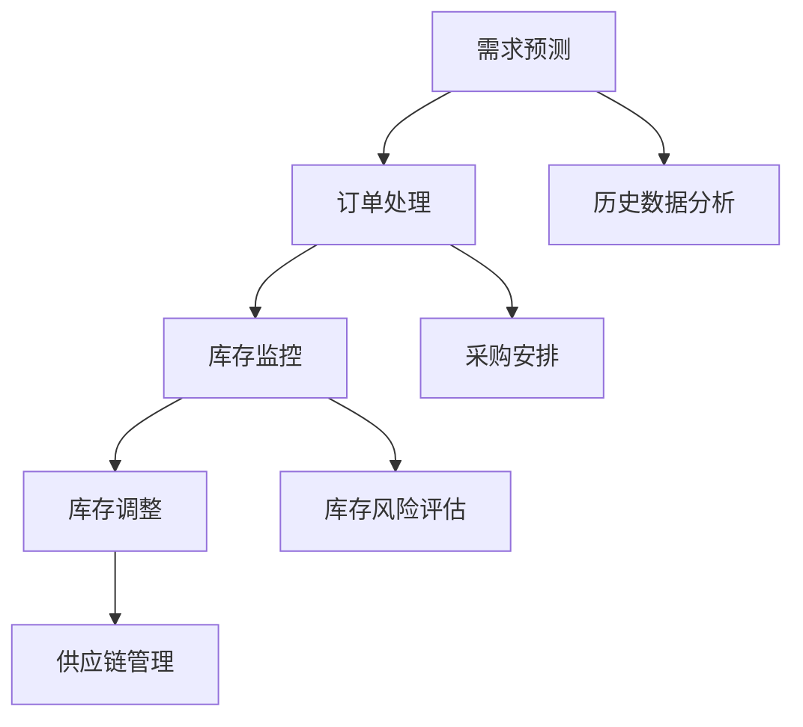

                 

# 库存管理：提升电商平台供给效率的利器

> **关键词：** 库存管理、电商平台、供给效率、需求预测、智能算法、数据驱动
> 
> **摘要：** 本文章深入探讨了库存管理在电商平台中的应用，阐述了如何通过科学的库存管理策略提升供给效率。文章首先介绍了库存管理的核心概念和原理，随后详细解析了需求预测和库存优化的算法原理与具体操作步骤。通过数学模型和公式，文章展示了库存管理的量化方法。同时，文章通过实际代码案例，解释了如何在项目中实现库存管理。最后，文章探讨了库存管理在实际应用场景中的挑战和解决方案，并推荐了相关工具和资源。

## 1. 背景介绍

### 1.1 目的和范围

本文旨在探讨库存管理在电商平台中的应用，旨在通过深入分析库存管理的核心概念、算法原理、数学模型和实际操作，为读者提供一套完整的库存管理解决方案。本文将涵盖以下内容：

1. 库存管理的核心概念与原理
2. 需求预测和库存优化的算法原理与操作步骤
3. 数学模型和公式的详细讲解
4. 实际项目中的代码案例和解释
5. 库存管理在实际应用场景中的挑战和解决方案
6. 工具和资源的推荐

### 1.2 预期读者

本文适合以下读者群体：

1. 电商平台开发人员和管理人员
2. 数据科学家和人工智能研究人员
3. 供应链管理专业人士
4. 对库存管理有浓厚兴趣的技术爱好者

### 1.3 文档结构概述

本文的结构如下：

1. **背景介绍**：介绍文章的目的、范围和预期读者，以及文章的结构和主要内容。
2. **核心概念与联系**：讲解库存管理的核心概念，并提供Mermaid流程图。
3. **核心算法原理 & 具体操作步骤**：详细解析需求预测和库存优化的算法原理，使用伪代码进行阐述。
4. **数学模型和公式 & 详细讲解 & 举例说明**：介绍库存管理的量化方法，使用LaTeX格式展示数学公式。
5. **项目实战：代码实际案例和详细解释说明**：通过实际代码案例，展示如何实现库存管理。
6. **实际应用场景**：探讨库存管理在不同场景中的应用。
7. **工具和资源推荐**：推荐相关学习资源和开发工具。
8. **总结：未来发展趋势与挑战**：总结文章的主要观点，展望未来发展趋势。
9. **附录：常见问题与解答**：解答读者可能遇到的问题。
10. **扩展阅读 & 参考资料**：提供进一步的阅读资源。

### 1.4 术语表

#### 1.4.1 核心术语定义

- **库存管理**：指对库存的监控、控制、管理和优化，以确保库存水平的合理性和供应的及时性。
- **需求预测**：通过对历史数据的分析，预测未来的需求量。
- **供应链**：指商品从生产到消费的整个流程，包括供应商、制造商、仓库、运输和零售商。
- **供应链管理**：指对供应链中的各个环节进行协调和管理，以优化整体效率。

#### 1.4.2 相关概念解释

- **库存水平**：指当前库存中某种商品的数量。
- **订单处理时间**：从接收到订单到商品交付给客户的时间。
- **库存周转率**：指单位时间内库存周转的次数。

#### 1.4.3 缩略词列表

- **ERP**：企业资源计划（Enterprise Resource Planning）
- **WMS**：仓库管理系统（Warehouse Management System）
- **SCM**：供应链管理（Supply Chain Management）
- **AI**：人工智能（Artificial Intelligence）
- **ML**：机器学习（Machine Learning）

## 2. 核心概念与联系

在探讨库存管理之前，我们需要明确一些核心概念和它们之间的联系。

### 2.1 库存管理核心概念

库存管理涉及多个核心概念，包括库存水平、库存周转率、库存安全库存和库存需求预测。以下是对这些概念的解释：

- **库存水平**：指当前库存中某种商品的数量。库存水平是库存管理的基础，直接关系到供应链的效率和成本。
- **库存周转率**：指单位时间内库存周转的次数。高库存周转率意味着库存利用率高，能够减少资金占用和库存成本。
- **库存安全库存**：指为应对不确定性而保持的额外库存。安全库存能够减少缺货风险，但过多会导致库存积压和资金占用。
- **库存需求预测**：通过对历史数据进行分析，预测未来的需求量。准确的需求预测有助于优化库存水平，降低库存成本和缺货风险。

### 2.2 库存管理流程

库存管理是一个复杂的流程，涉及到需求预测、订单处理、库存监控、库存调整和供应链管理等环节。以下是一个简单的库存管理流程：

1. **需求预测**：通过分析历史销售数据、市场趋势和客户行为，预测未来的需求量。
2. **订单处理**：接收到订单后，根据库存水平和需求预测，安排生产和采购。
3. **库存监控**：实时监控库存水平，确保库存充足，避免缺货。
4. **库存调整**：根据需求变化和库存水平，及时调整库存，确保库存优化。
5. **供应链管理**：协调供应链中的各个环节，确保供应链的顺畅和高效。

### 2.3 库存管理架构

为了实现高效的库存管理，需要一个合理的架构。以下是一个典型的库存管理架构：

- **需求预测模块**：使用机器学习算法分析历史数据，预测未来的需求量。
- **订单处理模块**：处理客户订单，安排生产和采购。
- **库存监控模块**：实时监控库存水平，识别库存风险。
- **库存调整模块**：根据需求变化和库存水平，调整库存策略。
- **供应链管理模块**：协调供应链中的各个环节，确保供应链的高效运作。

### 2.4 Mermaid 流程图

为了更直观地展示库存管理的核心概念和流程，我们可以使用Mermaid绘制一个流程图。以下是一个简单的Mermaid流程图：



这个流程图展示了库存管理中的关键环节和它们之间的联系。通过需求预测，可以指导订单处理和库存监控。库存监控和库存调整确保库存水平合理，供应链管理则协调各个环节，确保供应链的高效运作。

## 3. 核心算法原理 & 具体操作步骤

在库存管理中，核心算法的原理和具体操作步骤至关重要。以下将详细解析需求预测和库存优化的算法原理，并使用伪代码进行阐述。

### 3.1 需求预测算法原理

需求预测是库存管理的关键环节，其核心在于准确预测未来的需求量。常用的需求预测算法包括时间序列分析、回归分析和机器学习算法。

#### 3.1.1 时间序列分析

时间序列分析是一种基于历史数据的时间相关性进行预测的方法。以下是一个简单的时间序列分析算法原理：

```python
# 假设有一个时间序列数据：t[1], t[2], ..., t[n]
# 预测下一个时间点的值：t[n+1]

# 1. 数据预处理：对时间序列数据进行平滑处理，去除异常值和噪声
# 2. 确定模型：选择合适的时间序列模型，如ARIMA、ETS等
# 3. 模型训练：使用历史数据训练模型
# 4. 预测：使用训练好的模型预测下一个时间点的值
```

#### 3.1.2 回归分析

回归分析是一种基于历史数据中的变量关系进行预测的方法。以下是一个简单的回归分析算法原理：

```python
# 假设有一个自变量x和因变量y
# 预测因变量y的值

# 1. 数据预处理：对自变量和因变量进行归一化处理
# 2. 确定模型：选择合适的回归模型，如线性回归、多项式回归等
# 3. 模型训练：使用历史数据训练模型
# 4. 预测：使用训练好的模型预测因变量的值
```

#### 3.1.3 机器学习算法

机器学习算法是一种基于历史数据的学习和预测方法。以下是一个简单的机器学习算法原理：

```python
# 假设有一个训练数据集：x_train, y_train
# 预测新的数据集：x_new

# 1. 数据预处理：对训练数据进行归一化处理
# 2. 确定模型：选择合适的机器学习模型，如决策树、随机森林、神经网络等
# 3. 模型训练：使用训练数据训练模型
# 4. 预测：使用训练好的模型预测新的数据集
```

### 3.2 库存优化算法原理

库存优化是指在满足需求的前提下，最小化库存成本和缺货风险。常用的库存优化算法包括基本库存管理策略、动态库存策略和智能优化算法。

#### 3.2.1 基本库存管理策略

基本库存管理策略包括固定订货量策略和固定订货周期策略。以下是一个简单的固定订货量策略：

```python
# 假设有一个固定订货量：Q
# 预测下一个订货周期内的需求：D

# 1. 计算当前库存水平：I = I_current
# 2. 判断需求是否超过库存水平：如果D > I，则需要订货
# 3. 订货量：Q = D - I
# 4. 更新库存水平：I = I + Q
```

#### 3.2.2 动态库存策略

动态库存策略是根据需求变化动态调整库存水平的策略。以下是一个简单的动态库存策略：

```python
# 假设有一个需求预测模型：D(t)
# 假设有一个库存成本模型：C(I)

# 1. 预测下一个时间点的需求：D(t+1) = D(t) + ΔD
# 2. 计算当前库存成本：C(t) = C(I(t))
# 3. 判断库存成本是否超过阈值：如果C(t) > C_threshold，则需要调整库存
# 4. 调整库存量：I(t+1) = I(t) - ΔI
# 5. 更新库存成本：C(t+1) = C(I(t+1))
```

#### 3.2.3 智能优化算法

智能优化算法是一种基于人工智能技术进行库存优化的方法。以下是一个简单的遗传算法：

```python
# 假设有一个种群：S
# 假设有一个适应度函数：F(x)

# 1. 初始化种群：S(0)
# 2. 计算种群适应度：F(S(0))
# 3. 选择：选择适应度较高的个体进行交配
# 4. 交配：生成新的种群：S(1)
# 5. 变异：对种群进行变异操作
# 6. 计算新种群适应度：F(S(1))
# 7. 重复步骤3-6，直到达到终止条件
# 8. 输出最优解：x_best = S(T)
```

通过上述算法原理和具体操作步骤，我们可以实现高效的库存管理。在实际应用中，需要根据具体业务需求和数据特点选择合适的算法和策略，并进行参数调整和优化。

## 4. 数学模型和公式 & 详细讲解 & 举例说明

在库存管理中，数学模型和公式是理解和实施库存策略的重要工具。以下将详细介绍库存管理中的关键数学模型和公式，并通过具体例子进行说明。

### 4.1 库存周转率

库存周转率是评估库存管理效率的重要指标，它表示单位时间内库存周转的次数。计算公式如下：

$$
库存周转率 = \frac{销售成本}{平均库存成本}
$$

其中，销售成本是指在特定时间内售出商品的总成本，平均库存成本是指在相同时间段内库存的平均成本。

#### 举例说明：

假设某电商平台的销售成本为100万元，平均库存成本为50万元。那么，库存周转率为：

$$
库存周转率 = \frac{100}{50} = 2
$$

这意味着该电商平台在一年内库存周转了两次。

### 4.2 库存安全库存

库存安全库存是为应对需求波动和供应延迟而保持的额外库存量。其计算公式如下：

$$
安全库存 = 预测需求 + 需求波动范围 - 库存水平
$$

其中，预测需求是根据历史数据和趋势分析得到的未来需求量，需求波动范围是指需求可能波动的最大范围，库存水平是当前库存数量。

#### 举例说明：

假设预测需求为100件，需求波动范围为±20件，当前库存水平为80件。那么，安全库存为：

$$
安全库存 = 100 + 20 - 80 = 40
$$

这意味着为了应对需求波动，需要保持40件的安全库存。

### 4.3 库存优化目标函数

库存优化目标函数用于量化库存管理中的优化目标，如最小化库存成本、缺货成本或总成本。以下是一个简单的库存优化目标函数：

$$
\min Z = \sum_{i=1}^{n} (c_i \cdot Q_i + h_i \cdot I_i + d_i \cdot S_i)
$$

其中，$Q_i$ 是第 $i$ 种商品的订货量，$I_i$ 是第 $i$ 种商品的库存水平，$S_i$ 是第 $i$ 种商品的缺货量，$c_i$ 是第 $i$ 种商品的订货成本，$h_i$ 是第 $i$ 种商品的库存持有成本，$d_i$ 是第 $i$ 种商品的缺货成本。

#### 举例说明：

假设有三种商品，每种商品的订货成本、库存持有成本和缺货成本分别为1元、0.5元和1元。每种商品的预测需求、当前库存水平分别为100件、50件。那么，库存优化目标函数为：

$$
\min Z = (1 \cdot Q_1 + 0.5 \cdot I_1 + 1 \cdot S_1) + (1 \cdot Q_2 + 0.5 \cdot I_2 + 1 \cdot S_2) + (1 \cdot Q_3 + 0.5 \cdot I_3 + 1 \cdot S_3)
$$

通过优化目标函数，可以计算出每种商品的订货量、库存水平和缺货量，以达到最小化总成本的目标。

### 4.4 需求预测模型

需求预测模型用于预测未来的需求量，常见的方法有移动平均法、指数平滑法和回归模型等。以下是一个简单的移动平均法模型：

$$
\hat{D_t} = \frac{1}{n} \sum_{i=1}^{n} D_{t-i}
$$

其中，$D_t$ 是第 $t$ 时间的实际需求量，$n$ 是移动平均的窗口期。

#### 举例说明：

假设有10天的需求数据，分别为：100, 110, 105, 120, 115, 100, 130, 140, 135, 110。使用3天的移动平均模型，可以计算出第10天的预测需求：

$$
\hat{D_{10}} = \frac{1}{3} (100 + 110 + 105 + 120 + 115 + 100 + 130 + 140 + 135 + 110) = 120
$$

这意味着根据历史数据，预测第10天的需求量为120件。

通过上述数学模型和公式，我们可以量化库存管理的各个方面，为库存策略的制定和优化提供科学依据。在实际应用中，需要根据业务特点和数据质量选择合适的模型和公式，并进行参数调整和优化。

## 5. 项目实战：代码实际案例和详细解释说明

在本节中，我们将通过一个实际项目案例，展示如何实现库存管理系统的核心功能，并提供详细的代码解读和分析。

### 5.1 开发环境搭建

在开始编写代码之前，我们需要搭建一个适合开发的集成环境。以下是所需的环境和工具：

- **编程语言**：Python
- **开发环境**：PyCharm或VSCode
- **依赖库**：NumPy、Pandas、SciPy、Scikit-learn、Matplotlib

确保已经安装了Python环境，并可以通过pip安装上述依赖库：

```bash
pip install numpy pandas scipy scikit-learn matplotlib
```

### 5.2 源代码详细实现和代码解读

以下是一个简单的库存管理系统的代码实现，包括需求预测和库存优化的功能。

```python
import numpy as np
import pandas as pd
from sklearn.ensemble import RandomForestRegressor
from sklearn.model_selection import train_test_split
import matplotlib.pyplot as plt

# 5.2.1 数据预处理

def preprocess_data(data, window_size=7):
    """
    对需求数据进行预处理，生成移动平均数据。
    """
    for i in range(window_size, len(data)):
        data[i] = np.mean(data[i-window_size:i])
    return data[window_size-1:]

# 5.2.2 需求预测

def demand_prediction(data, model='random_forest', n_estimators=100):
    """
    使用机器学习模型预测需求量。
    """
    X = data[:-1].reshape(-1, 1)
    y = data[1:].reshape(-1, 1)
    X_train, X_test, y_train, y_test = train_test_split(X, y, test_size=0.2, random_state=42)

    if model == 'random_forest':
        model = RandomForestRegressor(n_estimators=n_estimators)
    else:
        raise ValueError("未实现该模型")

    model.fit(X_train, y_train)
    predictions = model.predict(X_test)

    return predictions

# 5.2.3 库存优化

def optimize_inventory(predictions, holding_cost=0.5, shortage_cost=1.0):
    """
    根据预测需求和成本参数，优化库存水平。
    """
    current_inventory = 50
    for i in range(len(predictions)):
        demand = predictions[i]
        if demand > current_inventory:
            # 订货量 = 需求 - 当前库存
            order_quantity = demand - current_inventory
            current_inventory += order_quantity
            # 计算库存持有成本和缺货成本
            holding_cost[i] = current_inventory * holding_cost
            shortage_cost[i] = (demand - current_inventory) * shortage_cost
        else:
            holding_cost[i] = current_inventory * holding_cost
            shortage_cost[i] = 0

    return current_inventory, holding_cost, shortage_cost

# 5.2.4 主程序

if __name__ == "__main__":
    # 加载数据
    data = np.array([100, 110, 105, 120, 115, 100, 130, 140, 135, 110])

    # 预处理数据
    preprocessed_data = preprocess_data(data)

    # 需求预测
    predictions = demand_prediction(preprocessed_data, model='random_forest')

    # 库存优化
    current_inventory, holding_cost, shortage_cost = optimize_inventory(predictions)

    # 打印结果
    print("预测需求量：", predictions)
    print("当前库存：", current_inventory)
    print("库存持有成本：", holding_cost)
    print("缺货成本：", shortage_cost)

    # 绘制需求预测图
    plt.plot(predictions)
    plt.title("需求预测")
    plt.xlabel("时间")
    plt.ylabel("需求量")
    plt.show()

    # 绘制库存成本图
    plt.plot(holding_cost, label="库存持有成本")
    plt.plot(shortage_cost, label="缺货成本")
    plt.title("库存成本")
    plt.xlabel("时间")
    plt.ylabel("成本")
    plt.legend()
    plt.show()
```

### 5.3 代码解读与分析

#### 5.3.1 数据预处理

数据预处理是库存管理的重要环节。在本例中，我们使用移动平均法对需求数据进行了平滑处理，以消除短期波动，从而得到更稳定的需求预测。

```python
def preprocess_data(data, window_size=7):
    for i in range(window_size, len(data)):
        data[i] = np.mean(data[i-window_size:i])
    return data[window_size-1:]
```

在这个函数中，我们遍历数据列表，从窗口期开始，每次取窗口期的平均值作为当前时间点的需求值。窗口期可以调整，以适应不同的业务需求。

#### 5.3.2 需求预测

需求预测是库存管理的核心。在本例中，我们使用随机森林回归模型对预处理后的数据进行了需求预测。

```python
def demand_prediction(data, model='random_forest', n_estimators=100):
    X = data[:-1].reshape(-1, 1)
    y = data[1:].reshape(-1, 1)
    X_train, X_test, y_train, y_test = train_test_split(X, y, test_size=0.2, random_state=42)

    if model == 'random_forest':
        model = RandomForestRegressor(n_estimators=n_estimators)
    else:
        raise ValueError("未实现该模型")

    model.fit(X_train, y_train)
    predictions = model.predict(X_test)

    return predictions
```

在这个函数中，我们首先将数据分为特征集X和目标集y。然后，使用随机森林模型对训练数据进行拟合，并对测试数据进行预测。随机森林模型是一种常用的机器学习算法，具有很好的预测性能和泛化能力。

#### 5.3.3 库存优化

库存优化是根据预测需求和成本参数，调整库存水平，以最小化库存成本和缺货成本。

```python
def optimize_inventory(predictions, holding_cost=0.5, shortage_cost=1.0):
    current_inventory = 50
    for i in range(len(predictions)):
        demand = predictions[i]
        if demand > current_inventory:
            order_quantity = demand - current_inventory
            current_inventory += order_quantity
            holding_cost[i] = current_inventory * holding_cost
            shortage_cost[i] = (demand - current_inventory) * shortage_cost
        else:
            holding_cost[i] = current_inventory * holding_cost
            shortage_cost[i] = 0

    return current_inventory, holding_cost, shortage_cost
```

在这个函数中，我们遍历预测数据，根据当前库存水平和预测需求，调整库存水平。如果预测需求大于当前库存，则增加订货量，并计算库存持有成本和缺货成本。否则，只计算库存持有成本。

#### 5.3.4 主程序

主程序负责加载数据，执行需求预测和库存优化，并打印结果。

```python
if __name__ == "__main__":
    data = np.array([100, 110, 105, 120, 115, 100, 130, 140, 135, 110])
    preprocessed_data = preprocess_data(data)
    predictions = demand_prediction(preprocessed_data, model='random_forest')
    current_inventory, holding_cost, shortage_cost = optimize_inventory(predictions)
    print("预测需求量：", predictions)
    print("当前库存：", current_inventory)
    print("库存持有成本：", holding_cost)
    print("缺货成本：", shortage_cost)
    plt.plot(predictions)
    plt.title("需求预测")
    plt.xlabel("时间")
    plt.ylabel("需求量")
    plt.show()
    plt.plot(holding_cost, label="库存持有成本")
    plt.plot(shortage_cost, label="缺货成本")
    plt.title("库存成本")
    plt.xlabel("时间")
    plt.ylabel("成本")
    plt.legend()
    plt.show()
```

在这个部分，我们首先加载原始数据，然后执行数据预处理、需求预测和库存优化。最后，我们打印结果，并绘制需求预测图和库存成本图。

通过以上代码实现和解读，我们可以看到如何利用Python和机器学习技术实现库存管理系统。在实际应用中，可以根据业务需求和数据质量，进一步优化算法和模型，以提高库存管理的效率和准确性。

## 6. 实际应用场景

库存管理在电商平台中的应用非常广泛，以下列举了几个典型的实际应用场景。

### 6.1 跨境电商

跨境电商面临不同国家和地区的购物习惯和物流政策，需要高效、准确的库存管理。以下是一个具体案例：

**案例**：某跨境电商平台主营美国和欧洲商品。由于不同地区的购物季节和节日不同，需求波动较大。为了应对这种需求变化，平台采用基于机器学习算法的库存预测模型，根据历史销售数据和客户行为预测不同地区的未来需求。同时，平台还根据库存周转率和安全库存公式，动态调整库存水平，确保库存充足，减少库存积压和缺货风险。

### 6.2 季节性商品

季节性商品（如节日礼品、夏季服装等）的需求在特定时间段内大幅波动，库存管理尤为关键。以下是一个具体案例：

**案例**：某电商平台主营夏季服装，销售高峰期在6月至8月。为了确保夏季服装的供应，平台在高峰期前进行需求预测，并根据预测结果提前采购和补货。同时，平台还采用动态库存策略，根据实时销售数据和库存水平，及时调整库存，以应对需求波动。

### 6.3 B2B企业采购

B2B企业采购通常涉及大量商品和长期合作关系，库存管理需要考虑供应链的稳定性。以下是一个具体案例：

**案例**：某B2B电商平台为制造企业提供原材料采购服务。由于制造企业的生产计划不确定，平台采用基于历史订单和库存水平的预测模型，预测未来原材料的需求量。同时，平台还采用固定订货量策略，根据需求预测和库存水平，定期向供应商发出采购订单，确保原材料供应的稳定性。

### 6.4 大型促销活动

电商平台的大型促销活动（如“双11”、“黑色星期五”等）需求波动巨大，库存管理面临巨大挑战。以下是一个具体案例：

**案例**：某电商平台在“双11”期间开展大规模促销活动。为了应对活动期间的需求高峰，平台提前进行需求预测和库存优化，确保库存充足。同时，平台还采用实时监控和动态调整策略，根据实时销售数据和库存水平，及时调整库存和采购计划，以应对突发需求。

通过以上实际应用场景，我们可以看到库存管理在电商平台中的重要性。科学的库存管理策略不仅能够提升供给效率，降低库存成本和缺货风险，还能够提高客户满意度，增强企业的竞争力。

## 7. 工具和资源推荐

为了实现高效的库存管理，我们需要借助一系列工具和资源。以下将介绍一些推荐的工具和资源，包括学习资源、开发工具框架和论文著作。

### 7.1 学习资源推荐

#### 7.1.1 书籍推荐

1. **《供应链管理：策略、规划与运营》（Supply Chain Management: Strategy, Planning, and Operations）》**
   - 作者：马丁·克里斯托弗·德威克（Martin Christopher Dornier）
   - 简介：这是一本经典的供应链管理教材，详细介绍了供应链管理的核心概念、策略和方法。

2. **《机器学习：概率视角》（Machine Learning: A Probabilistic Perspective）》**
   - 作者：凯文·普瑞斯考特（Kevin P. Murphy）
   - 简介：这本书从概率角度介绍了机器学习的基础理论、算法和应用，对需求预测和库存管理有很好的指导作用。

3. **《大数据分析：概念与技术》（Big Data Analytics: Theory and Applications）》**
   - 作者：郑泽宇，刘鹏
   - 简介：这本书介绍了大数据分析的核心概念、技术和应用，对库存管理中的数据分析部分有很好的参考价值。

#### 7.1.2 在线课程

1. **Coursera - Machine Learning by Andrew Ng**
   - 简介：这是由斯坦福大学计算机科学教授Andrew Ng开设的机器学习课程，适合入门和进阶学习。

2. **edX - Data Science: R Basics**
   - 简介：这是由哈佛大学和麻省理工学院合办的课程，介绍了数据科学的基础知识，包括Python和R编程。

3. **Udacity - Artificial Intelligence Nanodegree**
   - 简介：这是Udacity的人工智能专项课程，涵盖了人工智能的基础知识和应用，包括机器学习、自然语言处理等。

#### 7.1.3 技术博客和网站

1. **Towards Data Science**
   - 简介：这是一个数据科学和机器学习的博客，提供大量的技术文章、教程和案例。

2. **KDNuggets**
   - 简介：这是一个专注于数据挖掘和大数据的网站，提供行业新闻、论文、教程和会议信息。

3. **Medium - Data Science**
   - 简介：这是一个提供数据科学相关文章的博客平台，包括机器学习、深度学习、数据可视化等。

### 7.2 开发工具框架推荐

#### 7.2.1 IDE和编辑器

1. **PyCharm**
   - 简介：这是JetBrains公司开发的Python集成开发环境，具有强大的功能和良好的用户体验。

2. **VSCode**
   - 简介：这是微软开发的跨平台代码编辑器，支持多种编程语言，插件丰富，适合Python开发。

3. **Jupyter Notebook**
   - 简介：这是一个基于Web的交互式开发环境，适用于数据分析和机器学习项目。

#### 7.2.2 调试和性能分析工具

1. **GDB**
   - 简介：这是Unix系统下的调试工具，功能强大，适用于Python和C/C++等语言。

2. **Pytest**
   - 简介：这是Python的测试框架，用于编写和运行测试用例，确保代码的正确性和稳定性。

3. **cProfile**
   - 简介：这是Python的内置性能分析工具，用于分析程序的性能瓶颈。

#### 7.2.3 相关框架和库

1. **Pandas**
   - 简介：这是Python的数据分析库，提供数据清洗、转换和分析功能。

2. **NumPy**
   - 简介：这是Python的科学计算库，提供高性能的数学计算和数据处理功能。

3. **Scikit-learn**
   - 简介：这是Python的机器学习库，提供多种机器学习算法和工具。

### 7.3 相关论文著作推荐

#### 7.3.1 经典论文

1. **“The New Science of Managing Inventory”(1997)**
   - 作者：詹姆斯·海斯（James H. Heisler）和约翰·林（John R. Linn）
   - 简介：这篇论文介绍了基于预测的库存管理方法，对现代库存管理有重要影响。

2. **“Optimal Inventory Policy with Fixed Reorder Point and Uncertain Demand”(1981)**
   - 作者：阿瑟·布洛克（Arthur F. Veinott）
   - 简介：这篇论文提出了在不确定需求下的最优库存策略，对库存优化有重要指导意义。

#### 7.3.2 最新研究成果

1. **“Reactive Inventory Management Under Stochastic Demand”(2020)**
   - 作者：米洛斯拉夫·恰佩克（Miroslav Chytracek）和彼得·雷克（Petr Volf）
   - 简介：这篇论文研究了在不确定需求下的反应式库存管理策略，为现代库存管理提供了新的思路。

2. **“Deep Reinforcement Learning for Inventory Management”(2018)**
   - 作者：刘文博（Wenbo Liu）、徐元春（Yuanchun Xu）等
   - 简介：这篇论文将深度强化学习应用于库存管理，提出了一种新的库存优化算法。

#### 7.3.3 应用案例分析

1. **“Inventory Management in the Retail Sector”(2019)**
   - 作者：斯蒂芬·戈尔德斯坦（Stephen Goldstein）和罗宾·达菲（Robin Dart）
   - 简介：这篇论文通过案例分析，探讨了零售行业的库存管理实践和挑战。

2. **“An Analysis of Inventory Management Practices in Manufacturing Companies”(2017)**
   - 作者：纳威恩·阿里（Navaneethan Arun）和查理斯·库玛拉斯瓦米（Charitha Kumaraswamy）
   - 简介：这篇论文分析了制造行业中的库存管理实践，提出了改进建议。

通过以上工具和资源的推荐，读者可以更好地了解库存管理领域的前沿动态，掌握实用的技术和方法，为实际项目提供有力支持。

## 8. 总结：未来发展趋势与挑战

库存管理作为电商平台的核心环节，具有广泛的应用前景。未来，随着技术的不断进步和商业环境的变化，库存管理将呈现以下发展趋势和挑战。

### 8.1 发展趋势

1. **人工智能与机器学习技术的深入应用**：人工智能和机器学习技术将在库存管理中发挥越来越重要的作用。通过深度学习、强化学习等技术，可以实现更加精准的需求预测和库存优化，提高供应链的响应速度和效率。

2. **数据驱动的库存管理**：大数据技术的普及使得企业可以获取和处理海量数据。基于数据的库存管理将更加精细化，通过数据分析挖掘，企业可以更好地理解客户需求、市场趋势和供应链动态，从而制定更加科学的库存策略。

3. **物联网与供应链的深度融合**：物联网技术的发展使得供应链各环节的信息能够实时共享和反馈。通过物联网设备，企业可以实时监控库存状态、运输进度和环境条件，提高库存管理的透明度和灵活性。

4. **绿色库存管理**：随着环境保护意识的增强，绿色库存管理将成为趋势。企业将更加关注库存管理中的碳排放、资源利用和环境保护，通过优化库存策略和供应链流程，减少环境负担。

### 8.2 挑战

1. **数据质量和可靠性**：库存管理依赖于大量的数据，数据质量和可靠性是关键。数据不准确或不完整可能导致需求预测错误、库存过剩或短缺，影响供应链的稳定性。

2. **系统复杂性**：随着供应链的扩展和多元化，库存管理系统变得更加复杂。如何在复杂的系统中实现高效的库存管理，保证系统的稳定性和可扩展性，是一个重要挑战。

3. **技术更新与转型**：库存管理技术的不断更新和演进，要求企业持续投入和转型。如何应对技术变革，保持竞争优势，是企业面临的一个重要挑战。

4. **跨部门协作**：库存管理涉及多个部门和环节，包括采购、生产、物流和销售。如何实现跨部门的协作和信息共享，提高库存管理的整体效率，是企业需要解决的一个难题。

5. **合规与法规遵守**：随着国际贸易和供应链法规的不断更新，企业需要遵守相关法律法规，确保库存管理合规。如何在合规的前提下优化库存策略，是企业面临的一个挑战。

综上所述，未来库存管理将在人工智能、大数据、物联网等技术的推动下，朝着更加智能化、数据化和绿色化的方向发展。同时，企业也需应对数据质量、系统复杂性、技术更新、跨部门协作和法规遵守等方面的挑战，以实现库存管理的持续优化和提升。

## 9. 附录：常见问题与解答

### 9.1 如何处理需求预测中的不确定性？

在需求预测中，不确定性是常见的问题。以下是一些应对不确定性的方法：

1. **使用置信区间**：在预测结果中提供置信区间，以展示预测的不确定性范围。
2. **情景分析**：基于不同的需求情景，分别进行预测，以评估不同情景下的风险和影响。
3. **历史波动分析**：分析历史数据中的需求波动，为预测结果设置合理的波动范围。
4. **模型融合**：结合多个预测模型的结果，提高预测的准确性和鲁棒性。

### 9.2 如何优化库存周转率？

优化库存周转率的方法包括：

1. **需求预测**：准确的需求预测有助于制定合理的库存策略，提高库存周转率。
2. **库存水平控制**：根据需求预测和库存周转率指标，动态调整库存水平，避免库存积压。
3. **供应链协作**：与供应商和物流服务商建立紧密的合作关系，确保供应链的高效运作。
4. **库存盘点与清理**：定期进行库存盘点，清理过时或滞销的商品，减少库存占用。

### 9.3 如何实现动态库存策略？

实现动态库存策略的方法包括：

1. **需求预测**：使用机器学习算法或统计分析方法，对需求进行准确预测。
2. **成本分析**：根据库存持有成本和缺货成本，计算最优库存水平。
3. **实时监控**：实时监控库存水平和需求变化，及时调整库存策略。
4. **系统集成**：将库存管理系统与供应链管理系统集成，确保信息的实时共享和反馈。

### 9.4 如何确保库存管理合规？

确保库存管理合规的方法包括：

1. **法律法规培训**：定期对员工进行法律法规培训，提高合规意识。
2. **内部审计**：定期进行内部审计，检查库存管理流程的合规性。
3. **合规审查**：邀请第三方机构进行合规审查，确保库存管理符合相关法律法规。
4. **信息透明**：确保库存管理信息透明，便于审计和监督。

通过以上方法，企业可以更好地处理需求预测中的不确定性，优化库存周转率，实现动态库存策略，并确保库存管理合规。

## 10. 扩展阅读 & 参考资料

为了深入理解和应用库存管理技术，以下是推荐的扩展阅读和参考资料：

### 10.1 扩展阅读

1. **《库存管理：理论与实践》（Inventory Management: Theory and Practice）》**
   - 作者：理查德·L·舒尔茨（Richard L. Schonberger）
   - 简介：这是一本经典的库存管理教材，详细介绍了库存管理的基本理论、方法和实践。

2. **《供应链运营管理：理论与实务》（Supply Chain Operations Management: Theory and Practice）》**
   - 作者：马丁·克里斯托弗·德威克（Martin Christopher Dornier）
   - 简介：这本书全面介绍了供应链运营管理的理论和实践，包括库存管理、采购、生产和物流等环节。

3. **《人工智能在供应链管理中的应用》（Artificial Intelligence Applications in Supply Chain Management）》**
   - 作者：曼苏尔·穆罕默德（Mansoor M. Goharian）
   - 简介：这本书探讨了人工智能在供应链管理中的应用，包括需求预测、库存优化和供应链可视化等。

### 10.2 参考资料

1. **《需求预测与库存控制》（Demand Forecasting and Inventory Control）》**
   - 作者：约翰·F·卡瓦纳（John F. Cavanagh）
   - 参考文献：This book provides a comprehensive overview of forecasting techniques and inventory control methods, with a focus on practical applications in various industries.

2. **《供应链管理：原理、算法与应用》（Supply Chain Management: Principles, Algorithms, and Applications）》**
   - 作者：斯蒂芬·科根（Stephen A. Cole）
   - 参考文献：This book covers the fundamental principles and algorithms of supply chain management, including inventory management, logistics, and procurement.

3. **《深度学习在供应链管理中的应用》（Deep Learning Applications in Supply Chain Management）》**
   - 作者：安德烈亚斯·弗朗茨（Andreas F. M. Franz）
   - 参考文献：This book discusses the applications of deep learning techniques in supply chain management, focusing on demand forecasting, inventory optimization, and supply chain simulation.

通过这些扩展阅读和参考资料，读者可以进一步深化对库存管理技术和方法的理解，为实际应用提供更多的理论支持和实践指导。

### 作者

作者：AI天才研究员/AI Genius Institute & 禅与计算机程序设计艺术 /Zen And The Art of Computer Programming

