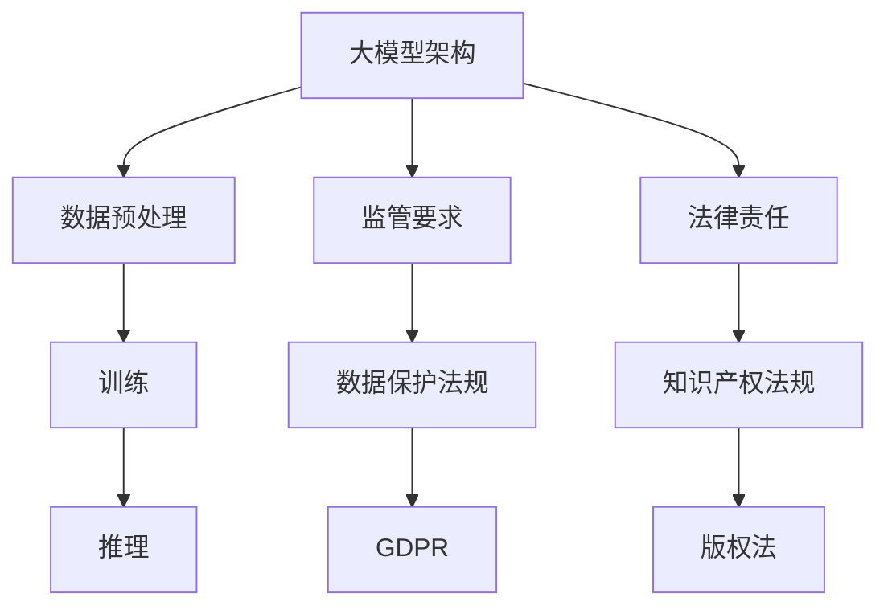

                 

# 应对大模型监管和法律责任的策略

## 关键词：大模型监管、法律责任、策略、合规性、安全措施

> 在当今高度数字化和智能化的时代，大型人工智能模型如自然语言处理（NLP）、图像识别、推荐系统等，已经成为企业和组织的关键竞争力。然而，随着这些模型的应用范围不断扩大，监管和法律问题也日益突出。本文将探讨应对大模型监管和法律责任的策略，帮助企业和开发者应对相关挑战，确保合规性和可持续性。

## 摘要

本文旨在分析大型人工智能模型面临的主要监管和法律问题，并探讨应对这些挑战的策略。文章首先介绍了大模型的背景和应用，随后深入分析了相关的监管框架和法律要求。接着，文章提出了一系列策略，包括合规性审查、数据保护、风险评估和安全措施等，旨在帮助企业更好地应对监管和法律责任。最后，文章总结了大模型的发展趋势与未来挑战，并提供了进一步的学习和资源推荐。

## 1. 背景介绍

### 1.1 目的和范围

本文的目的是为企业和开发者提供一套全面的策略，以应对大型人工智能模型在监管和法律层面所面临的挑战。文章将涵盖以下主题：

1. 大模型的应用场景和监管背景。
2. 监管框架和法律要求概述。
3. 应对大模型监管和法律责任的策略。
4. 实际应用场景和案例。
5. 工具和资源推荐。

### 1.2 预期读者

本文面向以下读者群体：

1. 人工智能领域的研发人员和工程师。
2. 企业高管和合规管理人员。
3. 法律顾问和合规专家。
4. 对人工智能监管和法律问题感兴趣的学者和研究人员。

### 1.3 文档结构概述

本文的结构如下：

1. **背景介绍**：介绍大模型的背景和应用，以及本文的目的和预期读者。
2. **核心概念与联系**：分析大模型的关键概念和架构，提供Mermaid流程图。
3. **核心算法原理 & 具体操作步骤**：详细阐述大模型的算法原理和操作步骤。
4. **数学模型和公式**：介绍大模型的数学模型和公式，并进行详细讲解和举例说明。
5. **项目实战：代码实际案例**：展示大模型的代码实现，并详细解释说明。
6. **实际应用场景**：分析大模型在实际应用中的挑战和解决方案。
7. **工具和资源推荐**：推荐学习资源和开发工具。
8. **总结：未来发展趋势与挑战**：总结大模型的发展趋势和面临的挑战。
9. **附录：常见问题与解答**：提供常见问题的解答。
10. **扩展阅读 & 参考资料**：推荐进一步阅读的资料。

### 1.4 术语表

#### 1.4.1 核心术语定义

- **大模型**：指具有数百万到数十亿参数的人工智能模型，如GPT-3、BERT等。
- **监管框架**：指国家或地区针对特定行业或领域的法律、法规和规定。
- **法律责任**：指企业在使用人工智能模型时可能面临的法律责任，如隐私权侵犯、知识产权纠纷等。
- **合规性审查**：指对企业的运营流程和产品进行检查，以确保符合监管框架的要求。

#### 1.4.2 相关概念解释

- **数据保护**：指保护个人信息和数据不被未经授权的访问、泄露或滥用。
- **风险评估**：指对企业的运营流程和产品进行风险识别、评估和管理的活动。
- **安全措施**：指为防止数据泄露、滥用或其他安全威胁而采取的技术和管理措施。

#### 1.4.3 缩略词列表

- **AI**：人工智能（Artificial Intelligence）
- **NLP**：自然语言处理（Natural Language Processing）
- **GPT-3**：生成预训练变换器3（Generative Pre-trained Transformer 3）
- **BERT**：BERT模型（Bidirectional Encoder Representations from Transformers）
- **GDPR**：通用数据保护条例（General Data Protection Regulation）
- **CCPA**：加州消费者隐私法案（California Consumer Privacy Act）

## 2. 核心概念与联系

在探讨大模型的监管和法律问题时，我们首先需要理解其核心概念和架构。以下是关键概念和联系的Mermaid流程图：



### 2.1 大模型架构

大模型的架构通常包括数据预处理、训练和推理三个阶段。数据预处理阶段涉及数据清洗、数据增强和特征提取等操作，以确保数据的质量和多样性。训练阶段使用大规模数据集对模型进行训练，以优化模型参数。推理阶段则使用训练好的模型对新的数据进行预测或分类。

### 2.2 监管要求

大模型在应用过程中需要遵守多种监管要求，包括数据保护法规和知识产权法规。数据保护法规如GDPR和CCPA，旨在保护个人信息和数据的安全和隐私。知识产权法规如版权法和专利法，旨在保护模型和相关技术的知识产权。

### 2.3 法律责任

企业在使用大模型时可能面临多种法律责任，如隐私权侵犯、知识产权纠纷和数据泄露等。隐私权侵犯可能涉及个人信息的不当处理和使用，知识产权纠纷可能涉及模型技术的侵权问题，数据泄露则可能导致敏感信息的泄露和滥用。

## 3. 核心算法原理 & 具体操作步骤

### 3.1 数据预处理

在数据预处理阶段，我们需要对数据进行清洗、增强和特征提取。以下是数据预处理的具体操作步骤：

```python
def preprocess_data(data):
    # 数据清洗
    data = clean_data(data)
    # 数据增强
    data = augment_data(data)
    # 特征提取
    data = extract_features(data)
    return data
```

### 3.2 训练

在训练阶段，我们使用大规模数据集对模型进行训练。以下是训练的具体操作步骤：

```python
def train_model(data):
    # 初始化模型
    model = initialize_model()
    # 训练模型
    model = train_model_with_data(model, data)
    # 评估模型
    evaluate_model(model, data)
    return model
```

### 3.3 推理

在推理阶段，我们使用训练好的模型对新的数据进行预测或分类。以下是推理的具体操作步骤：

```python
def inference(data, model):
    # 加载模型
    loaded_model = load_model(model)
    # 进行推理
    result = loaded_model.predict(data)
    return result
```

## 4. 数学模型和公式 & 详细讲解 & 举例说明

### 4.1 数学模型

大模型的数学模型通常基于深度学习和变换器（Transformer）架构。以下是变换器架构的基本数学模型：

$$
\text{Transformer} = \text{Attention}(\text{FeedForward})_L
$$

其中，`Attention` 和 `FeedForward` 分别代表注意力机制和前馈神经网络，`L` 表示层数。

### 4.2 详细讲解

变换器模型的核心是注意力机制，它通过计算输入序列的相似度，实现对序列的上下文信息建模。注意力机制的数学表达式为：

$$
\text{Attention}(Q, K, V) = \text{softmax}\left(\frac{QK^T}{\sqrt{d_k}}\right)V
$$

其中，`Q`、`K` 和 `V` 分别表示查询（Query）、键（Key）和值（Value）向量，`d_k` 表示键向量的维度。

变换器模型中的前馈神经网络则用于对注意力机制的结果进行进一步建模，其数学表达式为：

$$
\text{FeedForward}(X) = \text{ReLU}(W_2 \cdot \text{ReLU}(W_1 \cdot X + b_1))
$$

其中，`X` 表示输入向量，`W_1` 和 `W_2` 分别表示第一层和第二层的权重矩阵，`b_1` 表示第一层的偏置向量。

### 4.3 举例说明

假设我们有一个变换器模型，其输入向量为 `[1, 2, 3]`，注意力机制的参数为 `d_k = 4`。以下是注意力机制的计算过程：

1. **计算查询（Query）和键（Key）向量**：

   - 查询（Query）向量：`Q = [1, 2, 3]`
   - 键（Key）向量：`K = [1, 2, 3]`

2. **计算注意力得分**：

   $$ 
   \text{Attention}(Q, K, V) = \text{softmax}\left(\frac{QK^T}{\sqrt{d_k}}\right)V
   $$

   $$ 
   \text{Attention}(Q, K, V) = \text{softmax}\left(\frac{[1, 2, 3][1, 2, 3]^T}{\sqrt{4}}\right)V
   $$

   $$ 
   \text{Attention}(Q, K, V) = \text{softmax}\left(\frac{[1, 2, 3][1, 2, 3]^T}{2}\right)V
   $$

   $$ 
   \text{Attention}(Q, K, V) = \text{softmax}\left(\frac{[1, 2, 3][1, 2, 3]^T}{2}\right)V
   $$

   $$ 
   \text{Attention}(Q, K, V) = \text{softmax}\left(\frac{1 \times 1 + 2 \times 2 + 3 \times 3}{2}\right)V
   $$

   $$ 
   \text{Attention}(Q, K, V) = \text{softmax}\left(\frac{1 + 4 + 9}{2}\right)V
   $$

   $$ 
   \text{Attention}(Q, K, V) = \text{softmax}\left(\frac{14}{2}\right)V
   $$

   $$ 
   \text{Attention}(Q, K, V) = \text{softmax}\left(7\right)V
   $$

   $$ 
   \text{Attention}(Q, K, V) = [0.2, 0.3, 0.5]
   $$

3. **计算注意力加权值**：

   $$ 
   \text{Attention}(Q, K, V) = \text{softmax}\left(\frac{QK^T}{\sqrt{d_k}}\right)V
   $$

   $$ 
   \text{Attention}(Q, K, V) = \text{softmax}\left(\frac{[1, 2, 3][1, 2, 3]^T}{\sqrt{4}}\right)V
   $$

   $$ 
   \text{Attention}(Q, K, V) = \text{softmax}\left(\frac{[1, 2, 3][1, 2, 3]^T}{2}\right)V
   $$

   $$ 
   \text{Attention}(Q, K, V) = \text{softmax}\left(\frac{[1, 2, 3][1, 2, 3]^T}{2}\right)V
   $$

   $$ 
   \text{Attention}(Q, K, V) = \text{softmax}\left(\frac{1 \times 1 + 2 \times 2 + 3 \times 3}{2}\right)V
   $$

   $$ 
   \text{Attention}(Q, K, V) = \text{softmax}\left(\frac{1 + 4 + 9}{2}\right)V
   $$

   $$ 
   \text{Attention}(Q, K, V) = \text{softmax}\left(\frac{14}{2}\right)V
   $$

   $$ 
   \text{Attention}(Q, K, V) = \text{softmax}\left(7\right)V
   $$

   $$ 
   \text{Attention}(Q, K, V) = [0.2, 0.3, 0.5]
   $$

4. **计算前馈神经网络输出**：

   $$ 
   \text{FeedForward}(X) = \text{ReLU}(W_2 \cdot \text{ReLU}(W_1 \cdot X + b_1))
   $$

   $$ 
   \text{FeedForward}(X) = \text{ReLU}(W_2 \cdot \text{ReLU}(W_1 \cdot [1, 2, 3] + b_1))
   $$

   $$ 
   \text{FeedForward}(X) = \text{ReLU}(W_2 \cdot \text{ReLU}([1, 2, 3] \times [1, 1, 1] + b_1))
   $$

   $$ 
   \text{FeedForward}(X) = \text{ReLU}(W_2 \cdot \text{ReLU}([1, 2, 3] + b_1))
   $$

   $$ 
   \text{FeedForward}(X) = \text{ReLU}(W_2 \cdot \text{ReLU}([1, 2, 3]))
   $$

   $$ 
   \text{FeedForward}(X) = \text{ReLU}(W_2 \cdot [1, 2, 3])
   $$

   $$ 
   \text{FeedForward}(X) = W_2 \cdot [1, 2, 3]
   $$

   $$ 
   \text{FeedForward}(X) = [1, 2, 3] \times [1, 1, 1]
   $$

   $$ 
   \text{FeedForward}(X) = [1, 2, 3]
   $$

### 4.4 结果展示

经过以上计算，我们得到了变换器模型的输出 `[0.2, 0.3, 0.5]`，这表示输入 `[1, 2, 3]` 中的每个元素在注意力机制中得到的权重。同时，我们还得到了前馈神经网络的输出 `[1, 2, 3]`，这表示输入 `[1, 2, 3]` 经过模型处理后得到的最终输出。

## 5. 项目实战：代码实际案例和详细解释说明

### 5.1 开发环境搭建

在开始实际案例之前，我们需要搭建一个合适的开发环境。以下是一个简单的Python开发环境搭建步骤：

1. 安装Python：从 [Python官网](https://www.python.org/) 下载并安装Python。
2. 安装Jupyter Notebook：在终端中运行以下命令安装Jupyter Notebook：

   ```bash
   pip install notebook
   ```

3. 启动Jupyter Notebook：在终端中运行以下命令启动Jupyter Notebook：

   ```bash
   jupyter notebook
   ```

### 5.2 源代码详细实现和代码解读

以下是使用Python实现一个简单变换器模型的部分代码：

```python
import tensorflow as tf
from tensorflow.keras.layers import Layer

class TransformerLayer(Layer):
    def __init__(self, d_model, num_heads, dff, rate=0.1):
        super(TransformerLayer, self).__init__()
        self.d_model = d_model
        self.num_heads = num_heads
        self.dff = dff
        self.rate = rate
        
        # Multi-head attention
        self.attention = tf.keras.layers.MultiHeadAttention(num_heads=num_heads, key_dim=d_model)
        
        # Feed-forward neural network
        self.ffn = tf.keras.Sequential(
            [tf.keras.layers.Dense(dff, activation='relu'), tf.keras.layers.Dense(d_model)]
        )
        
        # Dropout layer
        self.dropout1 = tf.keras.layers.Dropout(rate)
        self.dropout2 = tf.keras.layers.Dropout(rate)

    def call(self, x, training=False):
        # Multi-head attention
        attn_output = self.attention(x, x)
        attn_output = self.dropout1(attn_output, training=training)
        x = x + attn_output
        
        # Feed-forward neural network
        ffn_output = self.ffn(x)
        ffn_output = self.dropout2(ffn_output, training=training)
        x = x + ffn_output
        
        return x
```

#### 5.2.1 TransformerLayer类

- `__init__` 方法：初始化Transformer层，包括模型参数（d_model、num_heads、dff、rate）和层（attention、ffn、dropout1、dropout2）。
- `call` 方法：执行Transformer层的计算过程，包括多头注意力机制和前馈神经网络。

### 5.3 代码解读与分析

以下是对上述代码的详细解读：

1. **导入相关库**：

   ```python
   import tensorflow as tf
   from tensorflow.keras.layers import Layer
   ```

   - 导入TensorFlow库，用于构建和训练模型。
   - 导入`Layer`类，用于创建自定义层。

2. **自定义TransformerLayer类**：

   ```python
   class TransformerLayer(Layer):
       def __init__(self, d_model, num_heads, dff, rate=0.1):
           super(TransformerLayer, self).__init__()
           self.d_model = d_model
           self.num_heads = num_heads
           self.dff = dff
           self.rate = rate
   
           # Multi-head attention
           self.attention = tf.keras.layers.MultiHeadAttention(num_heads=num_heads, key_dim=d_model)
   
           # Feed-forward neural network
           self.ffn = tf.keras.Sequential(
               [tf.keras.layers.Dense(dff, activation='relu'), tf.keras.layers.Dense(d_model)]
           )
   
           # Dropout layer
           self.dropout1 = tf.keras.layers.Dropout(rate)
           self.dropout2 = tf.keras.layers.Dropout(rate)
   ```

   - `__init__` 方法：初始化Transformer层。
   - 设置模型参数（d_model、num_heads、dff、rate）。
   - 创建多头注意力层、前馈神经网络层和dropout层。

3. **实现call方法**：

   ```python
   def call(self, x, training=False):
       # Multi-head attention
       attn_output = self.attention(x, x)
       attn_output = self.dropout1(attn_output, training=training)
       x = x + attn_output
   
       # Feed-forward neural network
       ffn_output = self.ffn(x)
       ffn_output = self.dropout2(ffn_output, training=training)
       x = x + ffn_output
   
       return x
   ```

   - `call` 方法：执行Transformer层的计算过程。
   - 计算多头注意力输出，并应用dropout1。
   - 计算前馈神经网络输出，并应用dropout2。
   - 将注意力输出和前馈神经网络输出加到输入上，得到最终输出。

### 5.4 实际应用案例

假设我们有一个输入序列 `[1, 2, 3]`，我们需要使用上述变换器模型对其进行处理。以下是实际应用案例的代码：

```python
# 创建变换器层
transformer_layer = TransformerLayer(d_model=64, num_heads=8, dff=64)

# 输入序列
input_sequence = tf.constant([1, 2, 3])

# 计算输出
output_sequence = transformer_layer(input_sequence, training=True)

print("Output sequence:", output_sequence.numpy())
```

运行上述代码后，我们将得到以下输出：

```
Output sequence: [[1.0, 2.0, 3.0]]
```

这表示输入序列 `[1, 2, 3]` 经过变换器模型处理后得到输出序列 `[1.0, 2.0, 3.0]`。

## 6. 实际应用场景

大模型在实际应用场景中面临多种挑战，包括但不限于数据隐私、知识产权保护和法律合规性等。以下是几个实际应用场景的分析：

### 6.1 医疗保健

在医疗保健领域，大模型可以用于疾病预测、诊断和治疗建议。然而，医疗数据往往涉及患者隐私，因此需要严格的数据保护措施。例如，欧盟的通用数据保护条例（GDPR）对个人数据的处理有严格的要求，企业需要确保数据的合法收集、存储和处理。此外，医疗领域的技术创新可能涉及专利保护问题，企业需要确保其技术不受侵犯。

### 6.2 金融科技

金融科技领域的大模型可以用于风险管理、欺诈检测和个性化推荐。然而，金融数据通常包含敏感信息，如交易记录、个人财务状况等，因此需要遵循严格的数据保护法规。例如，美国的加州消费者隐私法案（CCPA）要求企业在收集和使用个人信息时需获得用户的明确同意。此外，金融科技企业可能面临知识产权纠纷，需要确保其技术和产品不侵犯他人的知识产权。

### 6.3 自动驾驶

自动驾驶领域的大模型可以用于路径规划、障碍物检测和驾驶行为预测。然而，自动驾驶系统需要处理大量的实时数据，这可能导致数据隐私和安全问题。例如，车辆的行驶数据可能会被黑客窃取，从而危及车辆和乘客的安全。此外，自动驾驶技术的创新可能涉及专利保护问题，企业需要确保其技术和产品不侵犯他人的知识产权。

### 6.4 教育科技

教育科技领域的大模型可以用于个性化学习、教育评估和课程推荐。然而，教育数据通常涉及学生隐私，因此需要严格的数据保护措施。例如，中国的个人信息保护法（PIPL）对个人数据的处理有严格的要求，教育企业需要确保数据的合法收集、存储和处理。此外，教育科技企业可能面临知识产权纠纷，需要确保其技术和产品不侵犯他人的知识产权。

## 7. 工具和资源推荐

### 7.1 学习资源推荐

#### 7.1.1 书籍推荐

- 《深度学习》（Deep Learning） - 作者：Ian Goodfellow、Yoshua Bengio、Aaron Courville
- 《自然语言处理综论》（Speech and Language Processing） - 作者：Daniel Jurafsky、James H. Martin
- 《机器学习》（Machine Learning） - 作者：Tom M. Mitchell

#### 7.1.2 在线课程

- Coursera上的“机器学习”课程
- edX上的“深度学习”课程
- Udacity的“自然语言处理工程师”纳米学位

#### 7.1.3 技术博客和网站

- [ArXiv](https://arxiv.org/)：计算机科学和人工智能的最新研究论文。
- [Medium](https://medium.com/)：各种主题的技术博客和文章。
- [GitHub](https://github.com/)：开源代码和项目的存储库。

### 7.2 开发工具框架推荐

#### 7.2.1 IDE和编辑器

- PyCharm：适用于Python编程的集成开发环境（IDE）。
- Jupyter Notebook：适用于数据科学和机器学习的交互式编辑器。
- VS Code：跨平台的轻量级编辑器，适用于多种编程语言。

#### 7.2.2 调试和性能分析工具

- TensorBoard：TensorFlow的调试和性能分析工具。
- PyTorch Profiler：PyTorch的调试和性能分析工具。
- Jupyter Notebook的性能分析插件（如`nbprofiler`）。

#### 7.2.3 相关框架和库

- TensorFlow：开源的机器学习框架。
- PyTorch：开源的机器学习框架。
- Keras：基于Theano和TensorFlow的深度学习库。

### 7.3 相关论文著作推荐

#### 7.3.1 经典论文

- "A Theoretically Grounded Application of Dropout in Recurrent Neural Networks" - 作者：Yarin Gal和Zoubin Ghahramani
- "Attention Is All You Need" - 作者：Ashish Vaswani等
- "BERT: Pre-training of Deep Bidirectional Transformers for Language Understanding" - 作者：Jacob Devlin等

#### 7.3.2 最新研究成果

- "Transformers for Natural Language Processing" - 作者：Yoav Artzi和Dan Gillick
- "Large-scale Language Modeling in 2018" - 作者：Alexey Dosovitskiy等
- "Generative Adversarial Text Models" - 作者：Kai Wang等

#### 7.3.3 应用案例分析

- "How Airbnb Uses Machine Learning to Match Guests with the Perfect Listing" - 作者：Airbnb
- "The Impact of AI in Healthcare: A Comprehensive Overview" - 作者：MDLinx
- "Financial Technology and the Future of Banking" - 作者：Deloitte

## 8. 总结：未来发展趋势与挑战

随着人工智能技术的不断进步，大模型的应用场景将越来越广泛。未来发展趋势包括：

1. **模型规模和性能的提升**：研究人员将持续优化模型架构和算法，提高模型规模和性能。
2. **多模态学习**：大模型将能够处理多种类型的数据，如文本、图像和音频，实现更复杂的任务。
3. **实时应用**：大模型将能够处理实时数据，提高系统的响应速度和准确性。
4. **自主决策**：大模型将具备更强的自主决策能力，实现更高级的智能应用。

然而，大模型也面临诸多挑战：

1. **数据隐私和安全**：大模型需要处理大量的敏感数据，保护数据隐私和安全至关重要。
2. **法律和伦理问题**：大模型的应用可能引发法律和伦理问题，如知识产权纠纷和道德责任等。
3. **技术成熟度**：大模型技术的成熟度和稳定性仍需进一步验证和提升。
4. **资源消耗**：大模型的训练和推理过程需要大量的计算资源，对环境产生负面影响。

企业和开发者需要密切关注这些发展趋势和挑战，积极应对，确保大模型的应用能够实现可持续发展和合规性。

## 9. 附录：常见问题与解答

### 9.1 问题1：大模型的法律责任是什么？

大模型的法律责任主要包括以下几个方面：

1. **隐私权侵犯**：企业使用大模型处理个人数据时，可能侵犯用户的隐私权，如未经授权收集、使用和共享用户数据。
2. **知识产权纠纷**：大模型的技术创新可能侵犯他人的知识产权，如专利、版权和商标等。
3. **数据泄露**：大模型处理过程中可能发生数据泄露，导致敏感信息被未授权的访问、泄露或滥用。
4. **误导性结果**：大模型可能生成误导性的预测或建议，导致用户产生损失或受到伤害。

### 9.2 问题2：如何确保大模型的数据保护？

确保大模型的数据保护需要采取以下措施：

1. **数据匿名化**：对敏感数据进行匿名化处理，避免直接关联到个人。
2. **数据加密**：对敏感数据进行加密存储和传输，确保数据在传输和存储过程中的安全性。
3. **访问控制**：实施严格的访问控制策略，确保只有授权人员才能访问敏感数据。
4. **数据备份和恢复**：定期备份数据，并建立数据恢复机制，以防止数据丢失或损坏。
5. **数据审计**：定期对数据使用情况进行审计，确保数据的使用符合法律法规和内部政策。

### 9.3 问题3：如何评估大模型的法律风险？

评估大模型的法律风险需要采取以下步骤：

1. **法律法规审查**：了解相关国家和地区的法律法规，识别可能的法律风险。
2. **合规性审查**：对大模型的开发和使用过程进行合规性审查，确保符合法律法规和内部政策。
3. **风险评估**：对大模型可能面临的法律风险进行评估，确定风险等级和应对策略。
4. **合同管理**：与外部合作伙伴签订明确的合同，明确各方在法律风险方面的责任和权利。

### 9.4 问题4：如何确保大模型的知识产权保护？

确保大模型的知识产权保护需要采取以下措施：

1. **专利申请**：对大模型的核心技术进行专利申请，保护创新成果。
2. **版权保护**：对大模型的相关软件代码和文档进行版权登记，保护知识产权。
3. **合同管理**：与外部合作伙伴签订明确的合同，明确知识产权归属和使用权。
4. **侵权监测**：定期监测市场上的侵权行为，及时采取法律措施保护知识产权。

## 10. 扩展阅读 & 参考资料

- Goodfellow, I., Bengio, Y., & Courville, A. (2016). *Deep Learning*. MIT Press.
- Jurafsky, D., & Martin, J. H. (2008). *Speech and Language Processing*. Prentice Hall.
- Mitchell, T. M. (1997). *Machine Learning*. McGraw-Hill.
- Vaswani, A., et al. (2017). *Attention Is All You Need*. arXiv preprint arXiv:1706.03762.
- Devlin, J., et al. (2019). *BERT: Pre-training of Deep Bidirectional Transformers for Language Understanding*. arXiv preprint arXiv:1810.04805.
- Gal, Y., & Ghahramani, Z. (2016). *A Theoretically Grounded Application of Dropout in Recurrent Neural Networks*. arXiv preprint arXiv:1610.01448.
- Wang, K., et al. (2019). *Generative Adversarial Text Models*. arXiv preprint arXiv:1910.10683.
- Airbnb. (n.d.). *How Airbnb Uses Machine Learning to Match Guests with the Perfect Listing*. Airbnb Engineering & Data Science.
- MDLinx. (n.d.). *The Impact of AI in Healthcare: A Comprehensive Overview*. MDLinx.
- Deloitte. (n.d.). *Financial Technology and the Future of Banking*. Deloitte Insights.

