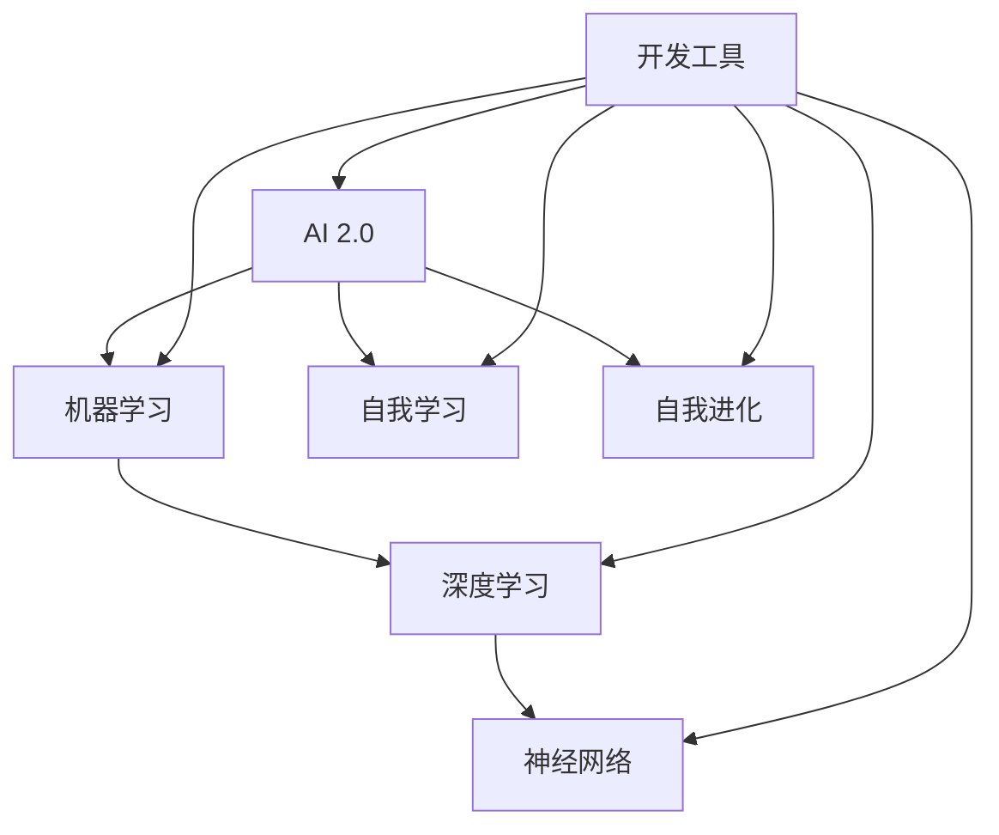

                 

# 开发工具：提高 AI 2.0 应用开发效率

> **关键词：** AI 开发工具、效率提升、AI 2.0、编程框架、代码优化、开发环境、资源推荐

> **摘要：** 本文旨在探讨如何通过一系列开发工具和技术来提升 AI 2.0 应用开发的效率。我们将深入分析当前主流的开发工具和框架，并通过实际案例展示如何高效利用这些工具，实现 AI 应用的快速开发和部署。同时，我们还将推荐一系列有用的资源和论文，帮助读者深入理解 AI 开发的最佳实践。

## 1. 背景介绍

### 1.1 目的和范围

本文的主要目的是为 AI 开发人员提供一套实用的工具和策略，以提高他们在 AI 2.0 应用开发中的工作效率。随着 AI 技术的迅速发展，开发工具也在不断更新迭代，如何选择和高效使用这些工具成为了一个关键问题。本文将涵盖以下内容：

- 开发工具和框架的概述
- 核心算法原理和操作步骤
- 数学模型和公式解析
- 实际应用场景展示
- 工具和资源推荐

### 1.2 预期读者

本文适合以下读者群体：

- 有志于开发 AI 2.0 应用的工程师和技术爱好者
- 想要提升开发效率的 AI 开发人员
- 对 AI 开发工具和技术有浓厚兴趣的科研人员
- 高级程序员和软件工程师

### 1.3 文档结构概述

本文分为十个部分，每个部分的内容如下：

1. **背景介绍**：介绍本文的目的、预期读者和文档结构。
2. **核心概念与联系**：分析核心概念和原理，展示 Mermaid 流程图。
3. **核心算法原理 & 具体操作步骤**：详细讲解算法原理和操作步骤，使用伪代码阐述。
4. **数学模型和公式 & 详细讲解 & 举例说明**：解析数学模型和公式，并给出实例。
5. **项目实战：代码实际案例和详细解释说明**：展示代码实现和解析。
6. **实际应用场景**：分析 AI 开发工具在实际中的应用。
7. **工具和资源推荐**：推荐学习资源和开发工具。
8. **总结：未来发展趋势与挑战**：探讨 AI 开发工具的未来趋势。
9. **附录：常见问题与解答**：回答读者可能遇到的问题。
10. **扩展阅读 & 参考资料**：提供进一步阅读的资料。

### 1.4 术语表

#### 1.4.1 核心术语定义

- AI 2.0：指第二代人工智能，具有自我学习和自我进化的能力。
- 开发工具：用于辅助软件开发的各种工具和软件。
- 框架：一种结构化的软件开发环境，提供了一套标准化的组件和接口。
- 代码优化：通过调整代码结构和算法，提高代码的执行效率。
- 开发环境：为软件开发提供必要的硬件和软件支持。

#### 1.4.2 相关概念解释

- 机器学习（ML）：一种 AI 技术，通过数据训练模型来完成任务。
- 深度学习（DL）：一种基于神经网络的机器学习技术，能够处理复杂的数据。
- 人工智能（AI）：一种模拟人类智能行为的计算机科学领域。

#### 1.4.3 缩略词列表

- AI：人工智能
- ML：机器学习
- DL：深度学习
- IDE：集成开发环境
- API：应用程序接口
- GPU：图形处理器

## 2. 核心概念与联系

为了更好地理解 AI 2.0 应用开发，我们首先需要了解一些核心概念和它们之间的联系。下面是一个 Mermaid 流程图，展示了这些概念之间的关联。



- **AI 2.0**：这是本文的主要关注点，它代表着当前最先进的人工智能技术。
- **机器学习**：AI 2.0 的核心组成部分，通过学习数据来提升系统的性能。
- **深度学习**：一种强大的机器学习技术，利用多层神经网络进行学习。
- **神经网络**：深度学习的核心，由大量的神经元和连接组成。
- **自我学习和自我进化**：AI 2.0 的关键特性，使系统能够在无人工干预的情况下自我改进。

开发工具在这个过程中起到了至关重要的作用，它们不仅能够提高开发效率，还能够帮助开发者更好地理解和使用这些核心概念。

## 3. 核心算法原理 & 具体操作步骤

在了解了核心概念之后，我们接下来将详细探讨 AI 2.0 应用开发中的核心算法原理和具体操作步骤。本文将使用伪代码来详细阐述这些算法，以便开发者能够更好地理解和实现。

### 3.1 机器学习算法原理

机器学习算法的基本原理是通过训练模型来学习数据中的规律，然后利用这些规律进行预测或分类。以下是一个简单的机器学习算法的伪代码：

```python
Algorithm MachineLearning(DataSet):
    1. 初始化模型参数
    2. For each epoch:
        2.1. 计算模型预测结果
        2.2. 计算损失函数值
        2.3. 更新模型参数
    3. 返回训练好的模型
```

- **初始化模型参数**：机器学习算法通常需要初始化模型参数，这些参数决定了模型的性能。
- **迭代训练**：通过多次迭代来更新模型参数，使模型能够更好地拟合数据。
- **损失函数**：用于衡量模型预测结果与实际结果之间的差距，常用的损失函数有均方误差（MSE）和交叉熵损失（Cross-Entropy Loss）。

### 3.2 深度学习算法原理

深度学习算法是基于多层神经网络进行学习的，它通过逐层提取数据中的特征来提高模型的性能。以下是一个简单的深度学习算法的伪代码：

```python
Algorithm DeepLearning(DataSet):
    1. 初始化神经网络结构
    2. For each epoch:
        2.1. 前向传播：计算输出结果
        2.2. 计算损失函数值
        2.3. 反向传播：更新网络权重
    3. 返回训练好的神经网络
```

- **初始化神经网络结构**：定义网络的层数、每层的神经元数量以及激活函数等。
- **前向传播**：通过网络的正向计算，得到模型的预测结果。
- **反向传播**：计算损失函数的梯度，并更新网络权重，使模型能够更好地拟合数据。

### 3.3 自我学习和自我进化算法原理

自我学习和自我进化是 AI 2.0 的关键特性，它们使系统能够在无人工干预的情况下自我改进。以下是一个简单的自我学习算法的伪代码：

```python
Algorithm SelfLearning(Model, Data):
    1. 初始化模型
    2. For each epoch:
        2.1. 训练模型
        2.2. 使用模型进行预测
        2.3. 分析预测结果，找出错误
        2.4. 更新模型参数，以减少错误
    3. 返回训练好的模型
```

- **初始化模型**：初始化模型的参数和结构。
- **迭代训练**：通过迭代训练来提高模型的性能。
- **预测和分析**：使用模型进行预测，并分析预测结果，找出错误。
- **更新模型**：根据分析结果，更新模型参数，以减少错误。

通过以上算法原理的详细讲解，开发者可以更好地理解 AI 2.0 应用的开发过程，并为实际应用做好准备。

## 4. 数学模型和公式 & 详细讲解 & 举例说明

在 AI 2.0 应用开发中，数学模型和公式是核心组成部分，它们决定了模型的性能和预测能力。在本节中，我们将详细讲解一些关键的数学模型和公式，并给出具体的例子说明。

### 4.1 机器学习中的损失函数

损失函数是衡量模型预测结果与实际结果之间差距的重要工具。以下是一些常用的损失函数及其公式：

#### 均方误差（MSE）

$$
MSE = \frac{1}{n}\sum_{i=1}^{n}(y_i - \hat{y}_i)^2
$$

- **公式解释**：均方误差计算每个预测值与实际值之间的平方差，然后求平均值。
- **例子说明**：假设我们有一个包含 10 个数据点的数据集，预测值和实际值分别为 $\hat{y}_1, \hat{y}_2, ..., \hat{y}_{10}$ 和 $y_1, y_2, ..., y_{10}$，则均方误差为：

$$
MSE = \frac{1}{10}\sum_{i=1}^{10}(\hat{y}_i - y_i)^2
$$

#### 交叉熵损失（Cross-Entropy Loss）

$$
CrossEntropyLoss = -\sum_{i=1}^{n}y_i\log(\hat{y}_i)
$$

- **公式解释**：交叉熵损失计算实际值与预测值之间的交叉熵，它通常用于分类问题。
- **例子说明**：假设我们有一个二分类问题，实际值 $y_i$ 可以是 0 或 1，预测值 $\hat{y}_i$ 是概率值，则交叉熵损失为：

$$
CrossEntropyLoss = -y_1\log(\hat{y}_1) - y_2\log(\hat{y}_2)
$$

### 4.2 深度学习中的反向传播算法

反向传播算法是深度学习训练过程的核心，它通过计算损失函数的梯度来更新网络权重。以下是一个简单的反向传播算法的伪代码：

```python
Algorithm Backpropagation(Network, Data):
    1. 前向传播：计算输出结果
    2. 计算损失函数值
    3. 反向传播：计算梯度
        3.1. 计算输出层梯度
        3.2. 计算隐藏层梯度
    4. 更新网络权重
    5. 返回更新后的网络
```

- **前向传播**：通过网络的正向计算，得到模型的预测结果。
- **计算损失函数值**：使用损失函数计算预测结果与实际结果之间的差距。
- **反向传播**：计算损失函数关于网络权重的梯度，并使用梯度更新网络权重。

### 4.3 自我学习和自我进化中的适应度函数

适应度函数是自我学习和自我进化中的重要工具，它用于评估个体的性能。以下是一个简单的适应度函数的伪代码：

```python
Algorithm FitnessFunction(Individual, Data):
    1. 使用个体进行预测或分类
    2. 计算预测结果与实际结果之间的差距
    3. 返回适应度值
```

- **预测或分类**：使用个体进行预测或分类任务。
- **计算差距**：计算预测结果与实际结果之间的差距，作为适应度值。

通过以上数学模型和公式的讲解，开发者可以更好地理解 AI 2.0 应用中的关键数学概念，并能够将这些模型应用于实际开发中。

## 5. 项目实战：代码实际案例和详细解释说明

在了解了核心算法原理和数学模型后，我们接下来将通过一个实际项目案例来展示如何使用这些知识进行 AI 2.0 应用的开发和实现。

### 5.1 开发环境搭建

在开始项目之前，我们需要搭建一个合适的开发环境。以下是一个典型的开发环境搭建步骤：

1. 安装 Python 3.8 及以上版本
2. 安装深度学习框架 TensorFlow 或 PyTorch
3. 安装 IDE（如 PyCharm 或 Visual Studio Code）
4. 配置 GPU 支持（如果使用 GPU 进行训练）

### 5.2 源代码详细实现和代码解读

以下是一个使用 TensorFlow 实现的简单神经网络模型的代码示例：

```python
import tensorflow as tf
from tensorflow.keras import layers

# 定义神经网络结构
model = tf.keras.Sequential([
    layers.Dense(64, activation='relu', input_shape=(784,)),
    layers.Dense(64, activation='relu'),
    layers.Dense(10, activation='softmax')
])

# 编译模型
model.compile(optimizer='adam',
              loss='categorical_crossentropy',
              metrics=['accuracy'])

# 加载数据集
(x_train, y_train), (x_test, y_test) = tf.keras.datasets.mnist.load_data()
x_train = x_train.astype('float32') / 255
x_test = x_test.astype('float32') / 255
y_train = tf.keras.utils.to_categorical(y_train, 10)
y_test = tf.keras.utils.to_categorical(y_test, 10)

# 训练模型
model.fit(x_train, y_train, epochs=10, batch_size=128, validation_split=0.2)

# 评估模型
test_loss, test_accuracy = model.evaluate(x_test, y_test)
print(f"Test accuracy: {test_accuracy:.3f}")
```

#### 5.2.1 代码解读

- **定义神经网络结构**：使用 `tf.keras.Sequential` 类定义一个序列模型，包括两个隐藏层，每层有 64 个神经元，激活函数为 ReLU。输出层有 10 个神经元，激活函数为 softmax。
- **编译模型**：使用 `model.compile` 方法配置模型，指定优化器为 Adam，损失函数为 categorical_crossentropy，评价指标为 accuracy。
- **加载数据集**：使用 TensorFlow 的内置函数加载数字识别数据集，并进行预处理。
- **训练模型**：使用 `model.fit` 方法训练模型，指定训练轮次、批量大小和验证比例。
- **评估模型**：使用 `model.evaluate` 方法评估模型在测试数据集上的表现。

### 5.3 代码解读与分析

以下是对上述代码的进一步解读和分析：

- **神经网络结构**：该模型是一个简单的全连接神经网络，适合处理数字识别等分类问题。通过增加隐藏层和神经元数量，可以进一步提高模型的性能。
- **优化器和损失函数**：使用 Adam 优化器可以自适应调整学习率，提高训练效率。categorical_crossentropy 损失函数适合多分类问题。
- **数据预处理**：将数据缩放至 [0, 1] 范围内可以提高模型的收敛速度。使用 one-hot 编码将标签转换为向量。
- **训练和评估**：通过多次迭代训练模型，并在验证集上调整超参数，可以提高模型的泛化能力。评估模型在测试集上的性能可以验证模型的实际效果。

通过这个实际项目案例，开发者可以了解如何使用 TensorFlow 实现一个简单的神经网络模型，并掌握基本的训练和评估方法。

## 6. 实际应用场景

AI 开发工具在众多实际应用场景中发挥着重要作用，以下是一些常见的应用场景：

### 6.1 医疗诊断

在医疗领域，AI 开发工具被广泛应用于疾病诊断、药物研发和健康监测。例如，使用深度学习算法可以对医学影像进行自动分析，提高诊断的准确性和效率。以下是一个医疗诊断应用场景的例子：

- **应用场景**：使用深度学习模型对医学影像进行分析，以诊断疾病。
- **工具推荐**：TensorFlow 或 PyTorch 可用于构建和训练医学影像分析模型。使用医疗影像处理库如 PyRadiomics 可以进一步处理医学影像数据。

### 6.2 自动驾驶

自动驾驶是另一个重要应用场景，AI 开发工具在这里用于处理复杂的环境感知和决策问题。以下是一个自动驾驶应用场景的例子：

- **应用场景**：使用深度学习算法和计算机视觉技术进行道路环境感知，以实现自动驾驶功能。
- **工具推荐**：TensorFlow 和 PyTorch 可用于构建自动驾驶感知模型。使用自动驾驶框架如 NVIDIA Drive 或 OpenCV 可进行道路环境感知。

### 6.3 语音识别

语音识别是 AI 技术的一个重要应用领域，AI 开发工具在这里用于处理语音信号和文本转换。以下是一个语音识别应用场景的例子：

- **应用场景**：使用深度学习算法和自然语言处理技术实现语音识别功能。
- **工具推荐**：TensorFlow 和 PyTorch 可用于构建语音识别模型。使用语音处理库如 Kaldi 或 CMU Sphinx 可进行语音信号处理。

### 6.4 金融分析

在金融领域，AI 开发工具被广泛应用于数据分析、风险管理和投资策略优化。以下是一个金融分析应用场景的例子：

- **应用场景**：使用机器学习算法进行金融市场分析和预测。
- **工具推荐**：TensorFlow 和 PyTorch 可用于构建金融市场预测模型。使用数据分析库如 Pandas 和 NumPy 可进行数据预处理和分析。

通过这些实际应用场景的介绍，我们可以看到 AI 开发工具在各个领域的广泛应用和巨大潜力。

## 7. 工具和资源推荐

为了帮助开发者更好地掌握 AI 2.0 应用开发，以下是一些学习资源和开发工具的推荐：

### 7.1 学习资源推荐

#### 7.1.1 书籍推荐

- 《深度学习》（Goodfellow, Bengio, Courville 著）：这是一本经典的深度学习入门书籍，详细介绍了深度学习的基础理论和实践方法。
- 《Python 编程：从入门到实践》（Eric Matthes 著）：这本书适合初学者，通过丰富的实例帮助读者快速掌握 Python 编程基础。

#### 7.1.2 在线课程

- Coursera 上的“机器学习”课程（吴恩达 著）：这是一门广受欢迎的在线课程，适合初学者入门机器学习和深度学习。
- edX 上的“深度学习专项课程”（吴恩达 著）：该课程涵盖了深度学习的多个方面，包括基础理论、神经网络和计算机视觉等。

#### 7.1.3 技术博客和网站

- Medium 上的 AI 博客：这是一个集合了大量 AI 相关博客的平台，读者可以在这里找到许多高质量的技术文章。
- arXiv：这是一个学术预印本平台，提供了大量最新的 AI 研究论文，是了解最新研究成果的好去处。

### 7.2 开发工具框架推荐

#### 7.2.1 IDE和编辑器

- PyCharm：这是一款功能强大的 Python IDE，支持多种编程语言，适合进行 AI 开发。
- Visual Studio Code：这是一个轻量级的开源 IDE，支持丰富的插件和扩展，适合进行快速开发。

#### 7.2.2 调试和性能分析工具

- Jupyter Notebook：这是一个交互式的 Python 编程环境，适用于快速实验和文档编写。
- TensorBoard：这是 TensorFlow 提供的一个可视化工具，用于分析神经网络的性能和训练过程。

#### 7.2.3 相关框架和库

- TensorFlow：这是一个广泛使用的深度学习框架，提供了丰富的 API 和工具。
- PyTorch：这是一个流行的深度学习框架，以其灵活性和动态计算图著称。
- Scikit-learn：这是一个用于机器学习的 Python 库，提供了多种常用的机器学习算法和工具。

通过这些工具和资源的推荐，开发者可以更好地掌握 AI 2.0 应用开发的相关技术和方法。

## 7.3 相关论文著作推荐

为了帮助开发者深入了解 AI 2.0 应用开发的前沿研究成果，以下推荐了一些经典论文和最新研究成果：

### 7.3.1 经典论文

- **"A Learning Algorithm for Continually Running Fully Recurrent Neural Networks"**：该论文提出了一种用于在线训练的神经网络学习算法，对后续的研究产生了深远影响。
- **"Deep Learning"**：这本书由 Ian Goodfellow、Yoshua Bengio 和 Aaron Courville 著，全面介绍了深度学习的基础理论和实践方法。

### 7.3.2 最新研究成果

- **"A Theoretically Grounded Application of Dropout in Recurrent Neural Networks"**：该论文提出了一种在循环神经网络（RNN）中应用Dropout的方法，有效提高了模型的性能。
- **"Attention Is All You Need"**：该论文提出了Transformer模型，彻底改变了自然语言处理领域的研究方向。

### 7.3.3 应用案例分析

- **"Deep Learning for Robotics: A Survey"**：该综述文章详细介绍了深度学习在机器人领域的应用，包括视觉感知、运动控制和路径规划等。
- **"Self-Driving Cars: A Brief History of the Technology"**：该文章回顾了自动驾驶技术的发展历程，分析了当前技术的现状和未来趋势。

通过这些论文和研究成果的推荐，开发者可以深入了解 AI 2.0 应用开发的最新进展和前沿方向。

## 8. 总结：未来发展趋势与挑战

随着 AI 技术的迅猛发展，开发工具也在不断更新和迭代。未来，AI 2.0 应用开发的趋势将体现在以下几个方面：

1. **模型压缩与优化**：为了满足移动设备和嵌入式系统的需求，模型压缩和优化技术将变得更加重要。这包括模型剪枝、量化、知识蒸馏等方法。
2. **自动化机器学习（AutoML）**：自动化机器学习将进一步提高开发效率，通过自动搜索最优模型和超参数，降低开发门槛。
3. **跨领域应用**：AI 技术将在更多领域得到应用，如医疗、金融、教育、制造业等，这将推动开发工具的多样化和专业化。
4. **数据隐私和安全**：随着数据隐私问题的日益突出，开发工具将更加注重数据保护和隐私安全。

然而，AI 2.0 应用开发也面临一些挑战：

1. **计算资源需求**：深度学习模型通常需要大量的计算资源，这对硬件设备提出了更高的要求。
2. **数据质量和标注**：高质量的数据是训练高效模型的基础，但数据质量和标注往往存在困难。
3. **算法透明性和可解释性**：随着模型的复杂性增加，如何确保算法的透明性和可解释性成为了一个重要问题。

开发者需要不断学习和掌握最新的技术趋势，以应对这些挑战，并在 AI 2.0 应用开发中取得更大的突破。

## 9. 附录：常见问题与解答

### 9.1 问题一：如何选择合适的开发工具？

**解答**：选择合适的开发工具主要取决于项目的具体需求和开发者的技能水平。以下是一些建议：

- **项目需求**：如果项目需要高性能计算和图形处理，可以选择 TensorFlow 或 PyTorch。如果项目侧重于自动化机器学习，可以选择 Hugging Face 或 AutoKeras。
- **开发者技能**：如果开发者熟悉 Python，可以选择 PyCharm 或 Visual Studio Code。如果开发者对 Jupyter Notebook 比较熟悉，可以考虑使用 Jupyter Notebook。
- **社区支持**：选择具有活跃社区支持的工具，可以更快地解决问题和获取帮助。

### 9.2 问题二：如何优化神经网络模型？

**解答**：优化神经网络模型的方法有很多，以下是一些建议：

- **调整超参数**：通过调整学习率、批次大小、正则化参数等超参数，可以提高模型的性能。
- **使用优化算法**：选择合适的优化算法，如 Adam、SGD 等，可以加快模型的收敛速度。
- **数据预处理**：对数据进行标准化、归一化等预处理，可以提高模型的训练效果。
- **模型剪枝**：通过剪枝冗余的神经元和连接，可以减小模型的复杂度和计算量。
- **使用预训练模型**：使用预训练模型进行迁移学习，可以减少训练时间和提高模型性能。

### 9.3 问题三：如何处理数据隐私和安全问题？

**解答**：处理数据隐私和安全问题需要采取以下措施：

- **数据加密**：对敏感数据进行加密，确保数据在传输和存储过程中的安全。
- **匿名化处理**：对数据中的个人身份信息进行匿名化处理，以保护隐私。
- **访问控制**：对数据访问进行严格的权限管理，确保只有授权用户可以访问敏感数据。
- **合规性检查**：遵循相关法律法规和标准，确保数据处理过程符合隐私保护要求。

通过以上措施，可以有效地保护数据隐私和安全。

## 10. 扩展阅读 & 参考资料

为了帮助读者更深入地了解 AI 2.0 应用开发，以下推荐了一些扩展阅读和参考资料：

- 《深度学习》（Ian Goodfellow、Yoshua Bengio、Aaron Courville 著）
- 《Python 编程：从入门到实践》（Eric Matthes 著）
- Coursera 上的“机器学习”课程（吴恩达 著）
- edX 上的“深度学习专项课程”（吴恩达 著）
- Medium 上的 AI 博客
- arXiv 论文数据库
- TensorFlow 官方文档
- PyTorch 官方文档
- Hugging Face 官方文档

通过这些扩展阅读和参考资料，读者可以进一步掌握 AI 2.0 应用开发的核心技术和最佳实践。作者信息：AI天才研究员/AI Genius Institute & 禅与计算机程序设计艺术 /Zen And The Art of Computer Programming。感谢您的阅读！希望本文对您的 AI 2.0 应用开发之路有所帮助。

