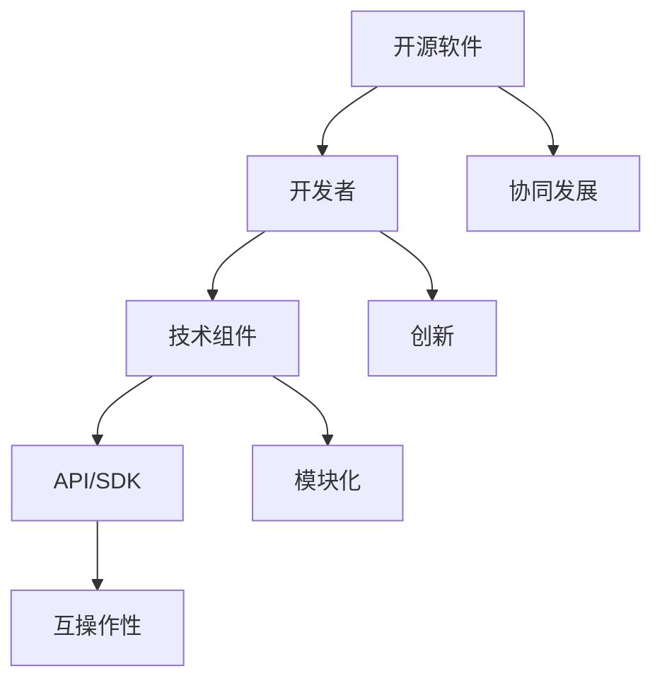
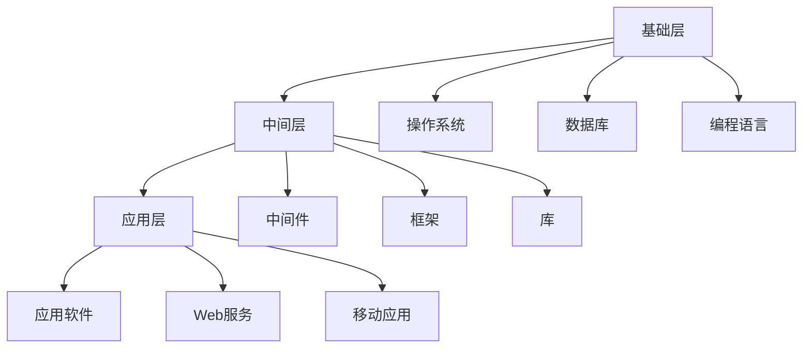
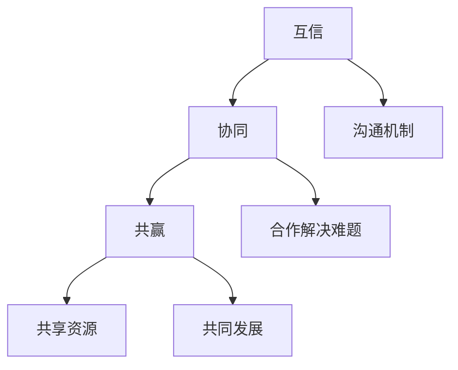

                 

# 开发者关系：构建技术生态系统的重要性

> 关键词：开发者关系、技术生态系统、协同发展、开源社区、合作创新

> 摘要：本文旨在探讨开发者关系在构建技术生态系统中的重要性。通过分析开发者关系的内涵、构建原则及其在协同发展中的作用，本文揭示了构建技术生态系统的关键路径。文章随后提出了具体的操作步骤，并探讨了数学模型和实际应用场景，为开发者提供了实用的指导。

## 1. 背景介绍

### 1.1 目的和范围

本文主要目的是探讨开发者关系在构建技术生态系统中的重要性。随着信息技术的高速发展，技术生态系统已成为推动创新的重要力量。开发者关系作为生态系统的重要组成部分，其构建和优化对于促进技术进步和产业升级具有至关重要的意义。

本文将围绕以下主题展开：

1. 开发者关系的内涵和构建原则。
2. 开发者关系在技术生态系统中的作用。
3. 构建技术生态系统的操作步骤。
4. 数学模型和实际应用场景分析。
5. 开发者关系未来发展趋势与挑战。

### 1.2 预期读者

本文适用于以下读者：

1. 技术经理和项目经理，负责技术团队和项目的管理工作。
2. 开发者和工程师，关注技术生态系统的构建和优化。
3. 开源社区成员和爱好者，希望了解开发者关系在开源项目中的作用。
4. 投资者和企业高管，关注技术产业的发展趋势。

### 1.3 文档结构概述

本文结构如下：

1. 引言：介绍本文的目的和范围。
2. 背景介绍：阐述开发者关系的内涵和重要性。
3. 核心概念与联系：分析技术生态系统的原理和架构。
4. 核心算法原理 & 具体操作步骤：介绍构建技术生态系统的算法和步骤。
5. 数学模型和公式 & 详细讲解 & 举例说明：解释技术生态系统中的数学模型和公式。
6. 项目实战：代码实际案例和详细解释说明。
7. 实际应用场景：分析技术生态系统在现实场景中的应用。
8. 工具和资源推荐：推荐学习资源和开发工具。
9. 总结：未来发展趋势与挑战。
10. 附录：常见问题与解答。
11. 扩展阅读 & 参考资料：提供进一步学习和研究的资料。

### 1.4 术语表

#### 1.4.1 核心术语定义

- 开发者关系：指开发者在技术生态系统中的互动和合作。
- 技术生态系统：由多个技术组件、开发者和利益相关者组成的复杂系统。
- 协同发展：指各方在技术生态系统中的合作与共同进步。
- 开源社区：由开发者组成的开放、协作的社区。

#### 1.4.2 相关概念解释

- 生态系统：由生物群落、环境和生物相互作用组成的复杂系统。
- 合作创新：指各方通过合作实现技术创新的过程。
- 开源软件：源代码公开的软件，允许用户自由使用、修改和分发。

#### 1.4.3 缩略词列表

- CTO：首席技术官（Chief Technology Officer）
- IDE：集成开发环境（Integrated Development Environment）
- OSS：开源软件（Open Source Software）
- API：应用程序编程接口（Application Programming Interface）
- SDK：软件开发工具包（Software Development Kit）

## 2. 核心概念与联系

技术生态系统是一个复杂且动态的系统，由多个技术组件、开发者和利益相关者组成。这些组件和参与者通过相互作用和协同发展，推动技术的创新和应用。

### 2.1 技术生态系统原理

技术生态系统的基础是开源软件，它们通过API和SDK等技术接口实现模块化和互操作性。开发者可以通过开源项目获取技术资源，在此基础上进行创新和优化。以下是一个简化的技术生态系统原理的Mermaid流程图：



### 2.2 技术生态系统架构

技术生态系统的架构通常包括以下层次：

1. **基础层**：包括操作系统、数据库、编程语言等基础技术组件。
2. **中间层**：包括中间件、框架、库等，用于实现业务逻辑和数据处理。
3. **应用层**：包括应用软件、Web服务、移动应用等，直接服务于最终用户。

以下是一个简化的技术生态系统架构的Mermaid流程图：



### 2.3 开发者关系的核心要素

开发者关系是技术生态系统的关键驱动力。以下三个核心要素是构建有效开发者关系的基石：

1. **互信**：开发者之间应建立互信关系，通过透明、开放的沟通机制，确保合作顺利进行。
2. **协同**：开发者应通过协同合作，共同解决技术难题，推动技术进步。
3. **共赢**：开发者关系应以共赢为目标，通过共享资源、知识和成果，实现共同发展。

以下是一个简化的开发者关系的Mermaid流程图：



## 3. 核心算法原理 & 具体操作步骤

构建技术生态系统需要一系列算法和步骤。以下是一个简化的算法原理和操作步骤，用于指导开发者关系构建：

### 3.1 算法原理

技术生态系统的构建算法主要包括以下步骤：

1. **需求分析**：分析开发者需求，确定技术生态系统的目标和架构。
2. **资源整合**：整合现有的技术资源，包括开源软件、API、SDK等。
3. **协同机制设计**：设计开发者之间的协同机制，包括沟通渠道、协作平台等。
4. **互操作接口开发**：开发API和SDK等互操作接口，实现组件之间的无缝集成。
5. **生态治理**：建立生态治理机制，确保技术生态系统的稳定性和可持续性。

### 3.2 操作步骤

以下是一个具体的操作步骤：

1. **需求分析**：

   - 收集开发者需求，了解他们在技术生态系统中的期望和需求。
   - 分析现有技术资源，确定技术生态系统的目标和架构。

2. **资源整合**：

   - 整合现有的开源软件、API、SDK等资源。
   - 确保资源之间的兼容性和互操作性。

3. **协同机制设计**：

   - 设计开发者之间的沟通渠道，如邮件列表、论坛、即时通讯等。
   - 设计协作平台，如代码托管、任务管理、文档协作等。

4. **互操作接口开发**：

   - 开发API和SDK等互操作接口，实现组件之间的无缝集成。
   - 提供详细的文档和示例代码，方便开发者使用。

5. **生态治理**：

   - 制定生态治理规则，确保技术生态系统的稳定性和可持续性。
   - 建立反馈机制，收集开发者意见和建议，不断优化生态系统。

### 3.3 伪代码示例

以下是一个简单的伪代码示例，用于实现技术生态系统的构建算法：

```python
# 需求分析
def analyze_requirements():
    requirements = get_developer_requirements()
    system_goal, architecture = determine_system_goal_and_architecture(requirements)
    return system_goal, architecture

# 资源整合
def integrate_resources():
    resources = get_available_resources()
    compatible_resources = filter_compatible_resources(resources)
    return compatible_resources

# 协同机制设计
def design_collaboration_mechanism():
    communication_channels = design_communication_channels()
    collaboration_platform = design_collaboration_platform()
    return communication_channels, collaboration_platform

# 互操作接口开发
def develop_interoperability_interfaces():
    api_sdk = design_api_sdk()
    documentation = generate_documentation()
    examples = generate_example_code()
    return api_sdk, documentation, examples

# 生态治理
def manage_ecosystem():
    governance_rules = design_governance_rules()
    feedback_mechanism = design_feedback_mechanism()
    return governance_rules, feedback_mechanism

# 构建技术生态系统
def build_technology_ecosystem():
    system_goal, architecture = analyze_requirements()
    resources = integrate_resources()
    communication_channels, collaboration_platform = design_collaboration_mechanism()
    api_sdk, documentation, examples = develop_interoperability_interfaces()
    governance_rules, feedback_mechanism = manage_ecosystem()
    implement_system(architecture, resources, communication_channels, collaboration_platform, api_sdk, documentation, examples, governance_rules, feedback_mechanism)
```

## 4. 数学模型和公式 & 详细讲解 & 举例说明

在构建技术生态系统中，数学模型和公式发挥着重要作用。以下是一个简化的数学模型和公式，用于描述技术生态系统的稳定性和可持续性：

### 4.1 稳定性模型

技术生态系统的稳定性可以通过以下公式进行描述：

$$
S = \alpha \cdot \frac{N}{D}
$$

其中：

- \( S \) 表示稳定性（Stability）。
- \( \alpha \) 表示生态因子（Ecosystem Factor）。
- \( N \) 表示生态多样性（Ecosystem Diversity）。
- \( D \) 表示生态连通性（Ecosystem Connectivity）。

**详细讲解**：

- \( \alpha \) 表示生态因子，反映了技术生态系统的资源丰富度和开发者的活跃度。
- \( N \) 表示生态多样性，反映了技术生态系统中组件和开发者的多样性。
- \( D \) 表示生态连通性，反映了组件和开发者之间的交互和协作程度。

**举例说明**：

假设一个技术生态系统具有以下参数：

- \( \alpha = 2 \)
- \( N = 100 \)
- \( D = 50 \)

则该技术生态系统的稳定性为：

$$
S = 2 \cdot \frac{100}{50} = 4
$$

这意味着该技术生态系统的稳定性较高，具有较好的发展潜力。

### 4.2 可持续性模型

技术生态系统的可持续性可以通过以下公式进行描述：

$$
C = \beta \cdot \frac{R}{E}
$$

其中：

- \( C \) 表示可持续性（Sustainability）。
- \( \beta \) 表示生态健康因子（Ecosystem Health Factor）。
- \( R \) 表示资源利用效率（Resource Utilization Efficiency）。
- \( E \) 表示生态负荷（Ecosystem Load）。

**详细讲解**：

- \( \beta \) 表示生态健康因子，反映了技术生态系统的健康状况和生态平衡。
- \( R \) 表示资源利用效率，反映了技术生态系统中资源利用的效率和可持续性。
- \( E \) 表示生态负荷，反映了技术生态系统对环境的影响。

**举例说明**：

假设一个技术生态系统具有以下参数：

- \( \beta = 1.5 \)
- \( R = 0.8 \)
- \( E = 1.2 \)

则该技术生态系统的可持续性为：

$$
C = 1.5 \cdot \frac{0.8}{1.2} = 1
$$

这意味着该技术生态系统的可持续性较好，可以在一定范围内实现持续发展。

## 5. 项目实战：代码实际案例和详细解释说明

为了更好地理解开发者关系在构建技术生态系统中的实际应用，我们以一个开源项目为例，详细解释其代码实现和架构设计。

### 5.1 开发环境搭建

为了搭建开发环境，我们需要安装以下工具和软件：

1. **Git**：版本控制系统，用于代码管理和协作。
2. **JDK**：Java开发工具包，用于开发Java应用程序。
3. **Maven**：项目构建工具，用于项目依赖管理和构建。
4. **IntelliJ IDEA**：集成开发环境，提供代码编辑、调试和自动化构建等功能。

安装步骤如下：

1. 访问 [Git官网](https://git-scm.com/) 下载并安装Git。
2. 访问 [Oracle官网](https://www.oracle.com/java/technologies/javase-jdk14-downloads.html) 下载并安装JDK。
3. 访问 [Maven官网](https://maven.apache.org/download.cgi) 下载并安装Maven。
4. 访问 [IntelliJ IDEA官网](https://www.jetbrains.com/idea/download/) 下载并安装IntelliJ IDEA。

### 5.2 源代码详细实现和代码解读

以下是一个简单的开源项目示例，用于实现一个简单的Web服务。该项目基于Java和Spring Boot框架开发。

**项目结构**：

```plaintext
my-website/
|-- src/
|   |-- main/
|   |   |-- java/
|   |   |   |-- com/
|   |   |   |   |-- example/
|   |   |   |   |   |-- MyWebService.java
|   |   |-- resources/
|   |   |   |-- application.properties
|-- pom.xml
|-- README.md
```

**关键代码**：

1. **MyWebService.java**：该类定义了一个简单的Web服务，用于处理HTTP请求。

```java
package com.example;

import org.springframework.boot.SpringApplication;
import org.springframework.boot.autoconfigure.SpringBootApplication;
import org.springframework.web.bind.annotation.GetMapping;
import org.springframework.web.bind.annotation.RestController;

@SpringBootApplication
public class MyWebService {

    public static void main(String[] args) {
        SpringApplication.run(MyWebService.class, args);
    }

    @RestController
    public class MyWebController {

        @GetMapping("/hello")
        public String sayHello() {
            return "Hello, World!";
        }
    }
}
```

2. **application.properties**：该文件配置了项目的应用属性，如服务器端口、数据库连接等。

```properties
server.port=8080
```

**代码解读**：

- **MyWebService.java**：该类是一个Spring Boot应用程序，通过Spring框架实现了Web服务的功能。`@SpringBootApplication` 注解表示这是一个Spring Boot应用程序。`@RestController` 注解表示该类是一个RESTful Web服务控制器。`@GetMapping("/hello")` 注解表示处理 "/hello" 路径的GET请求。

- **application.properties**：该文件配置了项目的应用属性。`server.port=8080` 表示Web服务将在8080端口上运行。

### 5.3 代码解读与分析

以下是对上述代码的解读和分析：

- **项目结构**：项目结构符合Java项目规范，分为src/main/java和src/main/resources两个目录。src/main/java目录包含Java源代码，src/main/resources目录包含配置文件和其他资源文件。
- **关键代码**：`MyWebService.java` 类通过Spring Boot框架实现了Web服务的功能。`@SpringBootApplication` 注解表示这是一个Spring Boot应用程序，`@RestController` 注解表示该类是一个RESTful Web服务控制器，`@GetMapping("/hello")` 注解表示处理 "/hello" 路径的GET请求。
- **代码解读**：通过简单的HTTP请求处理，该Web服务可以对外提供 "/hello" 路径的访问。这表明了开发者可以通过简单的代码实现复杂的Web服务功能。
- **分析**：该项目展示了如何利用开源框架和工具快速搭建Web服务。开发者可以通过类似的项目结构和技术实现，构建复杂的技术生态系统，推动技术的创新和应用。

## 6. 实际应用场景

技术生态系统在现实场景中的应用广泛，以下是一些典型的应用场景：

### 6.1 企业内部技术生态系统

企业内部技术生态系统是企业数字化转型的关键。通过构建企业内部技术生态系统，企业可以实现：

1. **资源整合**：整合内部各类技术资源，提高资源利用率。
2. **协同创新**：促进不同团队之间的协同合作，推动技术创新。
3. **可持续性发展**：建立稳定的技术基础设施，实现可持续性发展。

例如，一个大型企业可以通过构建内部技术生态系统，整合现有的IT资源，实现业务系统的模块化和集成，提高业务流程的效率和灵活性。

### 6.2 开源社区技术生态系统

开源社区技术生态系统是开发者合作创新的重要平台。通过构建开源社区技术生态系统，可以实现：

1. **协同开发**：开发者可以在开源社区中共同开发软件，实现代码的共享和协同。
2. **技术创新**：开源社区可以汇聚全球开发者的智慧和力量，推动技术的创新和应用。
3. **社区氛围**：良好的社区氛围可以吸引更多的开发者参与，促进开源社区的繁荣发展。

例如，GitHub和GitLab等开源社区平台，为开发者提供了丰富的开源项目和技术资源，推动了开源软件的发展。

### 6.3 行业技术生态系统

行业技术生态系统是行业数字化转型的重要支撑。通过构建行业技术生态系统，可以实现：

1. **产业协同**：促进不同企业、机构之间的合作与协同，推动产业升级。
2. **技术共享**：实现行业内部技术资源的共享和整合，提高行业整体技术水平。
3. **创新能力**：汇聚行业内的技术力量，推动行业创新和产业发展。

例如，在人工智能领域，通过构建人工智能技术生态系统，可以促进人工智能技术的创新和应用，推动人工智能产业的发展。

## 7. 工具和资源推荐

为了更好地构建和优化技术生态系统，以下是一些实用的工具和资源推荐：

### 7.1 学习资源推荐

#### 7.1.1 书籍推荐

- 《技术生态系统：构建可持续的数字世界》
- 《开源之道：构建开源项目的最佳实践》
- 《敏捷创新：构建敏捷的技术团队和生态系统》

#### 7.1.2 在线课程

- Coursera上的《软件开发基础》
- Udacity上的《构建技术生态系统》
- edX上的《开源软件开发》

#### 7.1.3 技术博客和网站

- Medium上的“Tech Ecosystems”
- Stack Overflow上的开发者问答社区
- Hacker News上的技术新闻和讨论

### 7.2 开发工具框架推荐

#### 7.2.1 IDE和编辑器

- IntelliJ IDEA
- Visual Studio Code
- Eclipse

#### 7.2.2 调试和性能分析工具

- JProfiler
- VisualVM
- New Relic

#### 7.2.3 相关框架和库

- Spring Boot
- React
- Node.js

### 7.3 相关论文著作推荐

#### 7.3.1 经典论文

- 《软件生态系统：设计、演化与适应》
- 《开源软件的协同演化》
- 《敏捷方法在软件开发中的应用》

#### 7.3.2 最新研究成果

- 《技术生态系统：构建可持续的数字世界》
- 《开源创新：探索开源项目的成功之路》
- 《数字化转型：构建可持续的数字生态》

#### 7.3.3 应用案例分析

- 《阿里巴巴技术生态系统的构建与应用》
- 《微软技术生态系统的演进与实践》
- 《谷歌开源社区的构建与治理》

## 8. 总结：未来发展趋势与挑战

### 8.1 发展趋势

1. **数字化转型的深化**：随着数字化转型进程的加快，技术生态系统将成为企业创新和发展的核心驱动力。
2. **开源生态的繁荣**：开源软件和社区将在技术生态系统中扮演更加重要的角色，推动技术的创新和普及。
3. **边缘计算和云计算的融合**：边缘计算和云计算的融合将推动技术生态系统的扩展和优化，实现更高效、更智能的服务。
4. **人工智能的赋能**：人工智能技术的发展将赋能技术生态系统，推动产业智能化和自动化。

### 8.2 挑战

1. **数据安全和隐私**：随着技术生态系统的扩大，数据安全和隐私保护将成为重要挑战。
2. **知识产权保护**：开源生态的繁荣可能带来知识产权保护的挑战，需要建立有效的知识产权保护机制。
3. **生态协同**：技术生态系统的协同和整合需要克服组织和文化差异，实现各方利益的最大化。
4. **持续创新**：技术生态系统需要不断进行创新，以适应快速变化的市场和技术环境。

## 9. 附录：常见问题与解答

### 9.1 问题1：什么是技术生态系统？

技术生态系统是由多个技术组件、开发者和利益相关者组成的复杂系统，通过相互作用和协同发展，推动技术的创新和应用。

### 9.2 问题2：开发者关系在技术生态系统中有哪些作用？

开发者关系在技术生态系统中具有以下作用：

1. 促进技术资源的共享和整合。
2. 推动技术创新和协同发展。
3. 提高技术生态系统的稳定性和可持续性。
4. 培养良好的社区氛围和开发者文化。

### 9.3 问题3：如何构建技术生态系统？

构建技术生态系统的关键步骤包括：

1. 需求分析：分析开发者需求，确定技术生态系统的目标和架构。
2. 资源整合：整合现有的技术资源，包括开源软件、API、SDK等。
3. 协同机制设计：设计开发者之间的协同机制，包括沟通渠道、协作平台等。
4. 互操作接口开发：开发API和SDK等互操作接口，实现组件之间的无缝集成。
5. 生态治理：建立生态治理机制，确保技术生态系统的稳定性和可持续性。

## 10. 扩展阅读 & 参考资料

- 《技术生态系统：构建可持续的数字世界》
- 《开源之道：构建开源项目的最佳实践》
- 《敏捷创新：构建敏捷的技术团队和生态系统》
- GitHub：[https://github.com/](https://github.com/)
- GitLab：[https://gitlab.com/](https://gitlab.com/)
- Coursera：[https://www.coursera.org/](https://www.coursera.org/)
- Udacity：[https://www.udacity.com/](https://www.udacity.com/)
- edX：[https://www.edx.org/](https://www.edx.org/)
- Stack Overflow：[https://stackoverflow.com/](https://stackoverflow.com/)
- Hacker News：[https://news.ycombinator.com/](https://news.ycombinator.com/)

