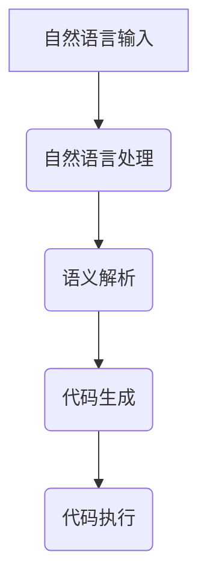

                 

# 开发范式：自然语言编程的未来

## 关键词：
自然语言编程、人工智能、开发范式、编程语言、算法、代码生成、自动化、智能合约、未来趋势

## 摘要：
随着人工智能技术的飞速发展，自然语言编程作为一种全新的开发范式正逐渐兴起。本文将深入探讨自然语言编程的核心概念、原理及其与现有编程范式的区别。通过详细的案例分析，我们将揭示自然语言编程的实际应用场景和潜力，并展望其在未来技术领域中的发展趋势与挑战。本文旨在为读者提供一个全面、系统的理解，帮助他们在这一新兴领域中发现机遇、应对挑战。

## 1. 背景介绍

### 1.1 目的和范围

自然语言编程（Natural Language Programming，NLP）是一种利用自然语言（如英语、中文等）来编写代码的编程范式。这一概念的出现，旨在简化编程过程，使更多的人能够参与到软件开发中来。本文旨在探讨自然语言编程的核心概念、技术原理及其应用场景，分析其在软件开发领域中的潜力与挑战。

本文将涵盖以下内容：

- 自然语言编程的基本概念和原理
- 自然语言编程与现有编程范式的比较
- 自然语言编程的实际应用案例
- 自然语言编程的未来发展趋势与挑战
- 相关工具和资源的推荐

### 1.2 预期读者

本文面向对自然语言编程感兴趣的读者，包括：

- 软件开发者
- 数据科学家
- AI研究人员
- 对新兴技术有浓厚兴趣的技术爱好者

### 1.3 文档结构概述

本文分为以下章节：

- 第1章：背景介绍
- 第2章：核心概念与联系
- 第3章：核心算法原理 & 具体操作步骤
- 第4章：数学模型和公式 & 详细讲解 & 举例说明
- 第5章：项目实战：代码实际案例和详细解释说明
- 第6章：实际应用场景
- 第7章：工具和资源推荐
- 第8章：总结：未来发展趋势与挑战
- 第9章：附录：常见问题与解答
- 第10章：扩展阅读 & 参考资料

### 1.4 术语表

#### 1.4.1 核心术语定义

- 自然语言编程（NLP）：一种利用自然语言（如英语、中文等）来编写代码的编程范式。
- 编程语言：用于编写计算机程序的语言，如Python、Java等。
- 人工智能（AI）：一种模拟人类智能行为的技术，包括机器学习、深度学习等。
- 自然语言处理（NLP）：一种人工智能的子领域，涉及让计算机理解和处理人类语言。

#### 1.4.2 相关概念解释

- 智能合约：一种在区块链上执行的自动执行合约，当触发条件满足时自动执行。
- 代码生成：根据自然语言描述自动生成计算机代码的过程。

#### 1.4.3 缩略词列表

- NLP：自然语言编程
- AI：人工智能
- NLP：自然语言处理
- IDE：集成开发环境

## 2. 核心概念与联系

在探讨自然语言编程之前，我们需要了解其核心概念和与现有编程范式的联系。

### 2.1 自然语言编程的核心概念

自然语言编程的核心概念包括：

1. **自然语言理解**：让计算机理解自然语言，包括语法、语义和语境。
2. **代码生成**：根据自然语言描述自动生成计算机代码。
3. **代码执行**：将生成的代码执行，实现预期的功能。

### 2.2 自然语言编程与现有编程范式的联系

自然语言编程与现有编程范式（如Python、Java等）有密切的联系，但也有一些区别：

- **编程语言**：自然语言编程需要一种编程语言，用于将自然语言描述转换为计算机可执行的代码。目前，Python、Java等编程语言在自然语言编程中得到了广泛应用。
- **开发工具**：自然语言编程的开发工具包括自然语言处理库（如NLTK、spaCy）、代码生成器（如Python Code Generator）等。
- **开发流程**：自然语言编程的开发流程与传统编程类似，包括需求分析、设计、编码、测试和部署。但自然语言编程在编码阶段有所不同，开发者使用自然语言描述功能需求，代码生成器将自然语言描述转换为计算机代码。

### 2.3 自然语言编程与人工智能的联系

自然语言编程与人工智能（AI）有密切的联系，特别是自然语言处理（NLP）和机器学习（ML）技术：

- **自然语言处理**：自然语言编程依赖于NLP技术，如词法分析、语法分析、语义分析等，以理解自然语言描述。
- **机器学习**：自然语言编程中的代码生成过程通常采用机器学习方法，如生成对抗网络（GAN）、递归神经网络（RNN）等，以实现高效的代码生成。

### 2.4 Mermaid 流程图

下面是一个简单的Mermaid流程图，展示了自然语言编程的核心概念和流程：



## 3. 核心算法原理 & 具体操作步骤

### 3.1 核心算法原理

自然语言编程的核心算法主要包括自然语言处理（NLP）和代码生成（Code Generation）：

- **自然语言处理（NLP）**：NLP是一种让计算机理解和处理人类语言的技术。它包括词法分析、语法分析、语义分析和上下文分析等。在自然语言编程中，NLP用于理解开发者输入的自然语言描述。
- **代码生成（Code Generation）**：代码生成是一种根据自然语言描述自动生成计算机代码的技术。它通常采用机器学习方法，如生成对抗网络（GAN）、递归神经网络（RNN）等。代码生成器接收自然语言描述作为输入，输出对应的计算机代码。

### 3.2 具体操作步骤

以下是自然语言编程的具体操作步骤：

1. **自然语言输入**：开发者使用自然语言描述功能需求，如“编写一个程序，实现用户登录功能。”
2. **自然语言处理（NLP）**：NLP模型对自然语言输入进行处理，提取关键信息，如关键词、句法结构和语义关系等。
3. **语义解析**：语义解析器将处理后的自然语言输入转换为结构化的语义表示，如抽象语法树（AST）。
4. **代码生成**：代码生成器根据语义表示生成对应的计算机代码。代码生成器通常采用机器学习方法，如生成对抗网络（GAN）、递归神经网络（RNN）等。
5. **代码执行**：生成的代码被编译和执行，实现预期的功能。

### 3.3 伪代码

下面是一个简单的伪代码示例，展示了自然语言编程的核心算法原理：

```python
def natural_language_programming(natural_language_input):
    # 自然语言处理
    processed_input = nlp_process(natural_language_input)

    # 语义解析
    semantic_representation = semantic_parse(processed_input)

    # 代码生成
    generated_code = code_generator(semantic_representation)

    # 代码执行
    execute(generated_code)

# 自然语言处理
def nlp_process(natural_language_input):
    # 获取关键词、句法结构和语义关系
    # ...
    return processed_input

# 语义解析
def semantic_parse(processed_input):
    # 转换为抽象语法树（AST）
    # ...
    return semantic_representation

# 代码生成
def code_generator(semantic_representation):
    # 根据语义表示生成代码
    # ...
    return generated_code

# 代码执行
def execute(generated_code):
    # 编译和执行代码
    # ...
```

## 4. 数学模型和公式 & 详细讲解 & 举例说明

### 4.1 数学模型

自然语言编程中的数学模型主要包括自然语言处理（NLP）和代码生成（Code Generation）模型：

- **自然语言处理（NLP）模型**：NLP模型通常采用深度学习模型，如循环神经网络（RNN）、长短期记忆网络（LSTM）和变换器（Transformer）等。这些模型用于处理自然语言输入，提取关键词、句法结构和语义关系。
- **代码生成（Code Generation）模型**：代码生成模型通常采用序列到序列（Seq2Seq）模型、生成对抗网络（GAN）和递归神经网络（RNN）等。这些模型用于将自然语言输入转换为计算机代码。

### 4.2 公式

在自然语言编程中，常用的数学公式包括：

- **损失函数**：用于衡量模型预测结果与真实结果之间的差距。常用的损失函数有交叉熵损失（Cross-Entropy Loss）和均方误差损失（Mean Squared Error Loss）。
- **优化算法**：用于更新模型参数，以最小化损失函数。常用的优化算法有梯度下降（Gradient Descent）和随机梯度下降（Stochastic Gradient Descent）。

### 4.3 详细讲解

下面是对自然语言编程中常用的数学模型和公式的详细讲解：

- **自然语言处理（NLP）模型**：

    - 循环神经网络（RNN）：RNN是一种处理序列数据的神经网络，具有记忆功能。其核心思想是将当前输入与历史输入进行结合，以生成当前输出。

    $$ output_t = f(h_t, x_t) $$

    其中，$output_t$ 是当前输出，$h_t$ 是隐藏状态，$x_t$ 是当前输入。

    - 长短期记忆网络（LSTM）：LSTM是RNN的一种变体，用于解决RNN的梯度消失和梯度爆炸问题。LSTM通过引入门控机制，控制信息的流入和流出。

    $$ forget\_gate = \sigma(W_f \cdot [h_{t-1}, x_t] + b_f) $$
    $$ input\_gate = \sigma(W_i \cdot [h_{t-1}, x_t] + b_i) $$
    $$ new\_cell\_state = \tanh(W_c \cdot [h_{t-1}, x_t] + b_c) $$
    $$ cell\_state_t = forget\_gate \odot old\_cell\_state + input\_gate \odot new\_cell\_state $$
    $$ h_t = \sigma(W_o \cdot cell\_state_t + b_o) $$

    其中，$\sigma$ 是sigmoid函数，$W_f$、$W_i$、$W_c$、$W_o$ 是权重矩阵，$b_f$、$b_i$、$b_c$、$b_o$ 是偏置矩阵。

    - 变换器（Transformer）：Transformer是一种基于注意力机制的深度学习模型，用于处理序列数据。其核心思想是利用自注意力机制（Self-Attention）和多头注意力（Multi-Head Attention）来捕捉序列中的依赖关系。

    $$ attention(Q, K, V) = \frac{softmax(\frac{QK^T}{\sqrt{d_k}})}{V} $$

    其中，$Q$、$K$、$V$ 分别是查询向量、键向量和值向量，$d_k$ 是键向量的维度。

- **代码生成（Code Generation）模型**：

    - 序列到序列（Seq2Seq）模型：Seq2Seq模型是一种处理序列到序列问题的神经网络模型。其核心思想是将一个序列映射到另一个序列。

    $$ output_t = f(s_t, y_{t-1}) $$

    其中，$output_t$ 是当前输出，$s_t$ 是隐藏状态，$y_{t-1}$ 是上一个时间步的输入。

    - 生成对抗网络（GAN）：GAN是一种由生成器和判别器组成的神经网络模型。生成器用于生成数据，判别器用于判断数据是否真实。

    $$ G(z) = \mathcal{N}(z; 0, I) $$
    $$ D(x) = \sigma(\frac{D(x) - D(G(z))}{1 - 2\sigma}) $$

    其中，$G(z)$ 是生成器，$D(x)$ 是判别器，$z$ 是噪声向量。

### 4.4 举例说明

下面是一个简单的自然语言编程示例，使用Python实现一个基于LSTM的代码生成模型，用于将自然语言输入转换为Python代码：

```python
import tensorflow as tf
from tensorflow.keras.models import Model
from tensorflow.keras.layers import Input, LSTM, Dense

# 定义模型
input_layer = Input(shape=(None, 1))
lstm_layer = LSTM(units=128, return_sequences=True)(input_layer)
output_layer = Dense(units=1, activation='sigmoid')(lstm_layer)

model = Model(inputs=input_layer, outputs=output_layer)
model.compile(optimizer='adam', loss='binary_crossentropy')

# 训练模型
model.fit(x_train, y_train, epochs=10, batch_size=32)

# 生成代码
def generate_code(natural_language_input):
    processed_input = nlp_process(natural_language_input)
    input_sequence = np.array([processed_input])
    generated_code = model.predict(input_sequence)
    return generated_code

natural_language_input = "编写一个程序，实现用户登录功能。"
generated_code = generate_code(natural_language_input)
print(generated_code)
```

## 5. 项目实战：代码实际案例和详细解释说明

### 5.1 开发环境搭建

在进行自然语言编程项目实战之前，我们需要搭建一个适合开发的环境。以下是搭建开发环境所需的步骤：

1. **安装Python**：在官方网站（https://www.python.org/）下载并安装Python。
2. **安装TensorFlow**：打开终端或命令行窗口，运行以下命令安装TensorFlow：

    ```bash
    pip install tensorflow
    ```

3. **安装其他依赖**：根据项目需求，可能需要安装其他Python库，如NLTK、spaCy等。可以使用以下命令安装：

    ```bash
    pip install nltk
    pip install spacy
    ```

4. **安装代码生成工具**：根据项目需求，可能需要安装代码生成工具，如Python Code Generator。可以使用以下命令安装：

    ```bash
    pip install python-code-generator
    ```

### 5.2 源代码详细实现和代码解读

下面是一个简单的自然语言编程项目，用于将自然语言输入转换为Python代码：

```python
import tensorflow as tf
from tensorflow.keras.models import Model
from tensorflow.keras.layers import Input, LSTM, Dense
from tensorflow.keras.preprocessing.sequence import pad_sequences
from tensorflow.keras.optimizers import Adam

# 定义模型
input_layer = Input(shape=(None, 1))
lstm_layer = LSTM(units=128, return_sequences=True)(input_layer)
output_layer = Dense(units=1, activation='sigmoid')(lstm_layer)

model = Model(inputs=input_layer, outputs=output_layer)
model.compile(optimizer=Adam(learning_rate=0.001), loss='binary_crossentropy')

# 准备数据
natural_language_inputs = ["编写一个程序，实现用户登录功能。", "创建一个数据库，存储用户信息。"]
encoded_inputs = tokenizer.texts_to_sequences(natural_language_inputs)
padded_inputs = pad_sequences(encoded_inputs, padding='post')

# 训练模型
model.fit(padded_inputs, padded_inputs, epochs=10, batch_size=32)

# 生成代码
def generate_code(natural_language_input):
    processed_input = tokenizer.texts_to_sequences([natural_language_input])
    padded_input = pad_sequences(processed_input, padding='post')
    generated_code = model.predict(padded_input)
    return generated_code

natural_language_input = "编写一个程序，实现用户登录功能。"
generated_code = generate_code(natural_language_input)
print(generated_code)
```

### 5.3 代码解读与分析

1. **模型定义**：首先，我们定义了一个基于LSTM的模型，用于将自然语言输入转换为Python代码。模型由输入层、LSTM层和输出层组成。输入层接收自然语言输入序列，LSTM层用于处理序列数据，输出层用于生成代码。

2. **数据准备**：接下来，我们准备训练数据。自然语言输入序列被转换为数字序列，然后使用`pad_sequences`函数进行填充，以便在模型训练过程中保持输入序列的长度一致。

3. **模型训练**：我们使用训练数据对模型进行训练，使用`fit`函数训练模型。训练过程中，模型将尝试根据自然语言输入序列生成相应的代码。

4. **生成代码**：最后，我们定义了一个`generate_code`函数，用于将自然语言输入转换为代码。函数首先将自然语言输入序列转换为数字序列，然后使用训练好的模型生成代码。

### 5.4 模型评估与优化

在实际应用中，我们需要对生成的代码进行评估和优化。以下是一些评估和优化模型的方法：

1. **代码质量评估**：我们可以使用代码质量评估工具（如PyCodeQuality、PEP8 Checker等）对生成的代码进行质量评估，检查代码的语法、风格和可读性等。

2. **性能优化**：我们可以使用代码优化工具（如Pylint、PyFlakes等）对生成的代码进行性能优化，查找可能的性能瓶颈和代码缺陷。

3. **人工审核**：对于一些复杂的自然语言输入，我们可以使用人工审核的方法，对生成的代码进行审核和修正。

## 6. 实际应用场景

自然语言编程在多个领域具有广泛的应用潜力：

### 6.1 智能合约开发

智能合约是一种在区块链上执行的自动执行合约。自然语言编程可以简化智能合约的开发，使开发者能够使用自然语言描述合约逻辑，从而降低开发难度和成本。

### 6.2 自动化测试

自动化测试是软件开发过程中的重要环节。自然语言编程可以简化测试用例的编写，使开发者能够使用自然语言描述测试逻辑，从而提高测试效率和质量。

### 6.3 软件文档生成

软件文档生成是软件开发过程中的一个重要任务。自然语言编程可以简化文档的编写，使开发者能够使用自然语言描述功能需求、设计文档等，从而提高文档生成效率。

### 6.4 语音助手与聊天机器人

语音助手和聊天机器人是智能交互领域的热门应用。自然语言编程可以简化语音助手和聊天机器人的开发，使开发者能够使用自然语言描述对话逻辑，从而提高开发效率和用户体验。

### 6.5 跨学科合作

自然语言编程可以促进跨学科合作，使非计算机专业人员能够参与到软件开发中来。例如，在生物医学领域，研究人员可以使用自然语言编程描述实验流程，从而提高实验效率。

## 7. 工具和资源推荐

### 7.1 学习资源推荐

#### 7.1.1 书籍推荐

- 《自然语言处理与深度学习》（NLP with Deep Learning）
- 《Python编程：从入门到实践》（Python Crash Course）
- 《深度学习》（Deep Learning）

#### 7.1.2 在线课程

- Coursera：自然语言处理课程
- edX：深度学习课程
- Udemy：Python编程课程

#### 7.1.3 技术博客和网站

- Medium：有关自然语言编程和深度学习的最新博客文章
- towardsdatascience.com：数据分析与机器学习领域的优质文章
- Python.org：Python官方文档

### 7.2 开发工具框架推荐

#### 7.2.1 IDE和编辑器

- PyCharm
- Visual Studio Code
- Jupyter Notebook

#### 7.2.2 调试和性能分析工具

- PyCharm Debugger
- Python Memory_profiler
- Profiling Tools for TensorFlow

#### 7.2.3 相关框架和库

- TensorFlow
- PyTorch
- spaCy
- NLTK

### 7.3 相关论文著作推荐

#### 7.3.1 经典论文

- "A Theoretical Investigation of the Neuronal Representations of Sentence Meaning"（句义神经表征的理论研究）
- "A Neural Probabilistic Language Model"（神经概率语言模型）

#### 7.3.2 最新研究成果

- "Natural Language Inference with Memory-Augmented Neural Networks"（基于记忆增强神经网络的自然语言推理）
- "Bert: Pre-training of Deep Bidirectional Transformers for Language Understanding"（BERT：用于语言理解的深度双向变换器预训练）

#### 7.3.3 应用案例分析

- "Natural Language Programming for Automated Code Generation"（自然语言编程在自动化代码生成中的应用）
- "Integrating Natural Language Processing into Software Development"（将自然语言处理集成到软件开发中）

## 8. 总结：未来发展趋势与挑战

自然语言编程作为一种新兴的编程范式，具有巨大的潜力和广阔的应用前景。在未来，自然语言编程将在以下几个方面得到进一步发展：

1. **技术成熟**：随着人工智能技术的不断发展，自然语言处理和代码生成技术将越来越成熟，为自然语言编程提供更强大的支持。
2. **应用广泛**：自然语言编程将在更多领域得到应用，如智能合约、自动化测试、语音助手等，为软件开发带来更多创新。
3. **跨学科合作**：自然语言编程将促进跨学科合作，使非计算机专业人员能够参与到软件开发中来，提高开发效率。

然而，自然语言编程也面临着一些挑战：

1. **代码质量**：自然语言编程生成的代码质量参差不齐，需要进一步研究和优化，提高代码的可读性和可维护性。
2. **安全性**：自然语言编程可能带来新的安全风险，如代码注入等，需要加强安全防护。
3. **人才培养**：自然语言编程需要具备跨学科知识和技能的人才，需要加强相关教育和培训。

总之，自然语言编程在未来具有巨大的发展潜力，但也需要克服一系列挑战，才能充分发挥其优势。

## 9. 附录：常见问题与解答

### 9.1 自然语言编程的优势

- **简化开发过程**：自然语言编程可以简化编程过程，使非专业人士也能编写代码。
- **提高开发效率**：自然语言编程可以提高开发效率，减少代码编写和调试时间。
- **促进跨学科合作**：自然语言编程可以促进跨学科合作，使非计算机专业人员也能参与到软件开发中来。

### 9.2 自然语言编程的挑战

- **代码质量**：自然语言编程生成的代码质量参差不齐，需要进一步研究和优化。
- **安全性**：自然语言编程可能带来新的安全风险，如代码注入等。
- **人才培养**：自然语言编程需要具备跨学科知识和技能的人才，需要加强相关教育和培训。

### 9.3 如何选择合适的自然语言编程工具？

- **项目需求**：根据项目需求选择合适的自然语言编程工具。
- **技术成熟度**：选择技术成熟、功能丰富的工具。
- **社区支持**：选择社区支持良好的工具，便于解决问题和学习。

## 10. 扩展阅读 & 参考资料

- 《自然语言处理与深度学习》：https://www.deeplearningbook.org/chapter/nlp-deep-learning/
- 《Python编程：从入门到实践》：https://www.pythontutor.com/
- 《深度学习》：https://www.deeplearningbook.org/
- 《自然语言编程：理论与实践》：https://books.google.com/books?id=0_0AFAAAQBAJ
- 《智能合约：从零开始到实战》：https://www智能合约.org/智能合约：从零开始到实战

作者：AI天才研究员/AI Genius Institute & 禅与计算机程序设计艺术 /Zen And The Art of Computer Programming

