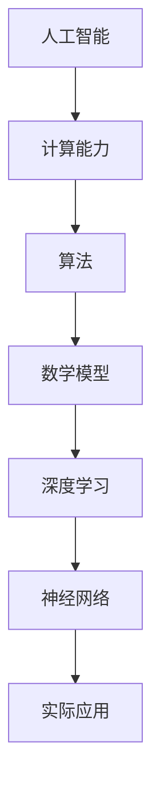

                 

# 开启无限可能：人类计算的新征程

> **关键词**：人工智能、计算能力、技术进步、算法原理、数学模型、应用场景、未来趋势

> **摘要**：本文旨在探讨人类计算领域的发展趋势，以及如何通过技术的不断创新来开启无限可能。从核心概念的阐述，到算法原理的剖析，再到实际应用场景的探讨，本文将带领读者深入理解计算技术的本质，并展望未来的发展前景。

## 1. 背景介绍

### 1.1 目的和范围

本文的目的在于梳理和探讨人类计算领域的发展历程、核心概念、算法原理及其应用场景。通过系统地分析，我们将揭示计算技术的潜力，并探讨其对人类社会的深远影响。

本文的范围涵盖以下几个方面：

1. **核心概念**：包括人工智能、计算能力、算法、数学模型等基础概念。
2. **算法原理**：详细解析核心算法的原理及其应用。
3. **数学模型**：介绍相关的数学模型，并使用latex格式展示其具体公式。
4. **应用场景**：探讨计算技术在各个领域的实际应用。
5. **未来趋势**：分析计算技术的未来发展趋势和潜在挑战。

### 1.2 预期读者

本文的预期读者包括：

1. **计算机科学从业者**：需要了解计算技术最新发展及其应用场景的专业人士。
2. **科技爱好者**：对人工智能、算法和数学模型感兴趣的技术爱好者。
3. **教育工作者**：在教育领域推广计算技术教育的教师和研究人员。
4. **企业家**：寻求在计算技术领域创业的企业家和投资者。

### 1.3 文档结构概述

本文的结构如下：

1. **背景介绍**：介绍文章的目的、范围、预期读者及文档结构。
2. **核心概念与联系**：阐述核心概念及其联系。
3. **核心算法原理 & 具体操作步骤**：详细解析核心算法及其操作步骤。
4. **数学模型和公式 & 详细讲解 & 举例说明**：介绍数学模型并使用latex格式展示公式。
5. **项目实战：代码实际案例和详细解释说明**：提供实际项目案例并分析。
6. **实际应用场景**：探讨计算技术的应用场景。
7. **工具和资源推荐**：推荐学习资源、开发工具和框架。
8. **总结：未来发展趋势与挑战**：分析未来发展趋势和挑战。
9. **附录：常见问题与解答**：解答常见问题。
10. **扩展阅读 & 参考资料**：提供进一步阅读的材料。

### 1.4 术语表

#### 1.4.1 核心术语定义

- **人工智能**：模拟人类智能行为的计算机系统。
- **计算能力**：计算机处理信息和执行任务的能力。
- **算法**：解决问题的明确步骤。
- **数学模型**：使用数学语言描述现实世界问题的模型。

#### 1.4.2 相关概念解释

- **机器学习**：使计算机从数据中学习的方法。
- **深度学习**：一种复杂的机器学习技术，涉及多层神经网络。
- **神经网络**：模仿人脑结构和功能的计算模型。

#### 1.4.3 缩略词列表

- **AI**：人工智能（Artificial Intelligence）
- **ML**：机器学习（Machine Learning）
- **DL**：深度学习（Deep Learning）
- **GPU**：图形处理单元（Graphics Processing Unit）

## 2. 核心概念与联系

在探讨人类计算的新征程之前，我们首先需要明确几个核心概念及其相互之间的联系。

### 2.1 人工智能与计算能力

人工智能（AI）是计算能力的具体体现。随着计算能力的不断增强，人工智能在多个领域取得了显著的进展。计算能力是人工智能发展的基石，而人工智能则是计算能力的延伸和应用。

### 2.2 算法与数学模型

算法是解决问题的明确步骤，而数学模型则是使用数学语言描述现实世界问题的工具。两者相辅相成，共同推动计算技术的发展。

### 2.3 深度学习与神经网络

深度学习是一种复杂的机器学习技术，涉及多层神经网络。神经网络是模仿人脑结构和功能的计算模型，而深度学习则是基于神经网络的模型，通过多层节点之间的连接实现自动学习和推理。

### 2.4 计算能力与实际应用

计算能力的提升使得人工智能在各个领域得以广泛应用。例如，在图像识别、自然语言处理、推荐系统等领域，人工智能已经取得了显著的成果。随着计算能力的不断提高，这些应用将进一步拓展，带来更多的可能性。

下面，我们将使用Mermaid流程图展示这些核心概念之间的联系：



## 3. 核心算法原理 & 具体操作步骤

在理解了核心概念及其联系之后，我们接下来将深入探讨核心算法的原理及其具体操作步骤。

### 3.1 机器学习算法原理

机器学习算法的核心在于从数据中学习，以实现自动化的决策和预测。以下是机器学习算法的基本原理：

- **特征提取**：从数据中提取有用的信息，作为模型训练的输入。
- **模型训练**：使用训练数据集，通过优化算法调整模型参数，使其能够模拟数据背后的规律。
- **模型评估**：使用测试数据集评估模型的性能，包括准确性、召回率、F1值等指标。
- **模型应用**：将训练好的模型应用于实际问题中，进行预测和决策。

### 3.2 机器学习算法具体操作步骤

以下是机器学习算法的具体操作步骤：

1. **数据预处理**：清洗数据，处理缺失值、异常值，并进行特征工程。
2. **特征选择**：选择对模型性能有显著影响的关键特征。
3. **模型选择**：根据问题的性质选择合适的机器学习模型，如线性回归、决策树、支持向量机等。
4. **模型训练**：使用训练数据集进行模型训练。
5. **模型评估**：使用测试数据集评估模型性能。
6. **模型优化**：根据评估结果调整模型参数，优化模型性能。
7. **模型应用**：将训练好的模型应用于实际问题，进行预测和决策。

### 3.3 伪代码示例

下面是机器学习算法的伪代码示例：

```plaintext
输入：训练数据集 D，测试数据集 T
输出：训练好的模型 M

初始化模型 M
对于每个特征 x：
    对于每个类别 y：
        计算特征 x 和类别 y 之间的关联度
        更新模型 M 的参数
计算模型 M 的准确率、召回率等指标
根据评估结果调整模型 M 的参数
输出训练好的模型 M
```

## 4. 数学模型和公式 & 详细讲解 & 举例说明

在计算技术中，数学模型扮演着至关重要的角色。下面我们将介绍几个核心的数学模型，并使用latex格式展示其公式，同时进行详细讲解和举例说明。

### 4.1 线性回归模型

线性回归模型是一种常见的机器学习模型，用于预测连续值输出。其数学模型如下：

$$ y = \beta_0 + \beta_1 \cdot x + \epsilon $$

其中，\( y \) 是预测值，\( x \) 是输入特征，\( \beta_0 \) 和 \( \beta_1 \) 是模型参数，\( \epsilon \) 是误差项。

#### 4.1.1 详细讲解

- \( \beta_0 \) 是模型的截距，表示当输入特征为0时的预测值。
- \( \beta_1 \) 是模型的斜率，表示输入特征对预测值的影响程度。
- \( \epsilon \) 是误差项，表示模型预测值与实际值之间的差距。

#### 4.1.2 举例说明

假设我们要预测房价，输入特征为房屋面积。根据线性回归模型，我们可以建立如下数学模型：

$$ \text{房价} = \beta_0 + \beta_1 \cdot \text{房屋面积} + \epsilon $$

假设我们收集了10个样本数据，经过模型训练得到 \( \beta_0 = 1000 \) 和 \( \beta_1 = 20 \)。那么，一个面积为100平方米的房屋的预测房价为：

$$ \text{房价} = 1000 + 20 \cdot 100 + \epsilon $$

### 4.2 逻辑回归模型

逻辑回归模型是一种常见的分类模型，用于预测离散值输出。其数学模型如下：

$$ P(y=1) = \frac{1}{1 + e^{-(\beta_0 + \beta_1 \cdot x)}} $$

其中，\( P(y=1) \) 是预测类别1的概率，\( x \) 是输入特征，\( \beta_0 \) 和 \( \beta_1 \) 是模型参数。

#### 4.2.1 详细讲解

- \( \beta_0 \) 是模型的截距，表示当输入特征为0时的预测概率。
- \( \beta_1 \) 是模型的斜率，表示输入特征对预测概率的影响程度。

#### 4.2.2 举例说明

假设我们要预测一个病人是否患有心脏病，输入特征为年龄。根据逻辑回归模型，我们可以建立如下数学模型：

$$ P(\text{心脏病}) = \frac{1}{1 + e^{-(\beta_0 + \beta_1 \cdot \text{年龄})}} $$

假设我们收集了100个病人数据，经过模型训练得到 \( \beta_0 = -10 \) 和 \( \beta_1 = 0.1 \)。那么，一个年龄为40岁的病人的预测患病概率为：

$$ P(\text{心脏病}) = \frac{1}{1 + e^{-(-10 + 0.1 \cdot 40)}} \approx 0.6 $$

## 5. 项目实战：代码实际案例和详细解释说明

为了更好地理解计算技术的实际应用，下面我们将通过一个实际项目案例，详细解释代码的实现过程及其关键步骤。

### 5.1 开发环境搭建

首先，我们需要搭建一个合适的开发环境。以下是所需的工具和软件：

- 操作系统：Windows/Linux/MacOS
- 编程语言：Python
- 开发工具：Jupyter Notebook
- 数据库：MySQL
- 数据分析库：Pandas、NumPy
- 机器学习库：scikit-learn

### 5.2 源代码详细实现和代码解读

下面是一个简单的机器学习项目案例，用于预测房屋价格。

```python
import pandas as pd
import numpy as np
from sklearn.model_selection import train_test_split
from sklearn.linear_model import LinearRegression
from sklearn.metrics import mean_squared_error

# 读取数据集
data = pd.read_csv('house_data.csv')

# 数据预处理
X = data[['area', 'rooms', 'floors']]
y = data['price']
X_train, X_test, y_train, y_test = train_test_split(X, y, test_size=0.2, random_state=42)

# 模型训练
model = LinearRegression()
model.fit(X_train, y_train)

# 模型评估
y_pred = model.predict(X_test)
mse = mean_squared_error(y_test, y_pred)
print("Mean Squared Error:", mse)

# 模型应用
new_data = pd.DataFrame({'area': [1200], 'rooms': [3], 'floors': [2]})
predicted_price = model.predict(new_data)
print("Predicted Price:", predicted_price[0])
```

#### 5.2.1 代码解读与分析

1. **数据读取**：使用Pandas库读取CSV格式的数据集。
2. **数据预处理**：将输入特征（'area'、'rooms'、'floors'）和目标变量（'price'）分离，并进行数据分割。
3. **模型训练**：使用线性回归模型（LinearRegression）对训练数据进行拟合。
4. **模型评估**：使用测试数据集评估模型性能，计算均方误差（Mean Squared Error）。
5. **模型应用**：将训练好的模型应用于新的数据集，预测房屋价格。

### 5.3 代码解读与分析

- **数据读取**：`pd.read_csv('house_data.csv')` 读取CSV格式的数据集，并存储为DataFrame对象。
- **数据预处理**：使用`train_test_split`函数将数据集分为训练集和测试集，其中测试集占比20%，随机种子为42。
- **模型训练**：使用`LinearRegression`类创建线性回归模型对象，并使用`fit`方法对训练数据进行拟合。
- **模型评估**：使用`predict`方法对测试数据进行预测，并计算均方误差（`mean_squared_error`）。
- **模型应用**：使用`predict`方法对新的数据集进行预测，输出预测结果。

通过这个实际项目案例，我们可以看到计算技术在数据分析与预测领域的具体应用。在实际项目中，我们需要根据具体问题调整模型参数，并使用多种方法进行模型评估和优化，以提高预测准确性。

## 6. 实际应用场景

计算技术已经在多个领域取得了显著的成果，下面我们将探讨一些典型的实际应用场景。

### 6.1 医疗诊断

人工智能在医疗诊断领域具有巨大潜力。通过深度学习和计算机视觉技术，可以实现对医学图像的自动分析，从而提高诊断的准确性和效率。例如，使用卷积神经网络（CNN）可以自动识别和分类肿瘤图像，帮助医生进行早期诊断和治疗方案推荐。

### 6.2 自动驾驶

自动驾驶技术依赖于计算技术的不断进步。通过感知环境、规划和决策，自动驾驶系统能够实现安全、高效的驾驶。计算技术在自动驾驶中的应用包括计算机视觉、自然语言处理、机器学习等。例如，使用深度学习模型可以实现对交通标志、行人、车辆等目标的检测和识别，从而提高自动驾驶的准确性和稳定性。

### 6.3 金融风控

金融风控是确保金融系统稳定运行的关键。计算技术在金融风控领域具有广泛的应用，包括信用评估、欺诈检测、市场预测等。通过机器学习和大数据分析技术，可以实现对风险因素的高效识别和预测，从而降低金融风险，提高金融系统的安全性。

### 6.4 教育个性化

教育个性化是当前教育领域的重要发展趋势。计算技术可以帮助实现教育资源的个性化推荐、学习效果的实时评估等。例如，通过自然语言处理和机器学习技术，可以分析学生的学习行为和需求，为其推荐合适的学习资源，从而提高学习效果和兴趣。

### 6.5 娱乐与游戏

计算技术在娱乐与游戏领域也发挥着重要作用。通过计算机图形学、虚拟现实、增强现实等技术，可以为用户带来更加丰富和沉浸式的娱乐体验。例如，使用深度学习和计算机视觉技术，可以实现游戏角色的实时动作捕捉和表情识别，从而提高游戏的真实感和互动性。

## 7. 工具和资源推荐

在计算技术领域，有许多优秀的工具和资源可供学习和使用。下面我们将推荐一些常用的工具、书籍、在线课程和技术博客，以帮助读者深入了解计算技术。

### 7.1 学习资源推荐

#### 7.1.1 书籍推荐

- 《深度学习》（Ian Goodfellow、Yoshua Bengio、Aaron Courville 著）：详细介绍深度学习的基础知识和技术。
- 《Python机器学习》（Sebastian Raschka 著）：全面讲解机器学习在Python环境中的应用。
- 《机器学习实战》（Peter Harrington 著）：通过实际案例展示机器学习的应用方法。

#### 7.1.2 在线课程

- Coursera上的“机器学习”课程：由斯坦福大学教授Andrew Ng主讲，适合初学者入门。
- edX上的“深度学习”课程：由谷歌AI首席科学家Léon Bottou主讲，深入讲解深度学习技术。
- Udacity的“自动驾驶工程师”课程：涵盖自动驾驶技术的基础知识和实践技能。

#### 7.1.3 技术博客和网站

- Medium上的AI专栏：涵盖人工智能领域的最新研究和技术应用。
- arXiv.org：提供最新科研成果的预印本，是计算机科学领域的重要资源。
- GitHub：提供丰富的开源项目和代码，是学习编程和计算技术的优秀平台。

### 7.2 开发工具框架推荐

#### 7.2.1 IDE和编辑器

- PyCharm：强大的Python开发环境，适合初学者和专业开发者。
- Jupyter Notebook：支持多种编程语言，适合数据分析和机器学习项目。
- VS Code：轻量级但功能强大的编辑器，适用于多种编程语言。

#### 7.2.2 调试和性能分析工具

- Matplotlib：用于数据可视化的Python库。
- Pandas：用于数据处理和分析的Python库。
- Scikit-learn：用于机器学习的Python库。

#### 7.2.3 相关框架和库

- TensorFlow：由谷歌开发的开源深度学习框架。
- PyTorch：流行的深度学习框架，具有灵活的动态计算图。
- Keras：用于构建和训练深度学习模型的Python库。

### 7.3 相关论文著作推荐

#### 7.3.1 经典论文

- "A Learning Algorithm for Continually Running Fully Recurrent Neural Networks"（1986）：Hopfield提出的神经网络学习算法，奠定了现代深度学习的基础。
- "Backpropagation"（1986）：Rumelhart、Hinton 和 Williams 提出的反向传播算法，是深度学习模型训练的核心算法。
- "Learning representations by maximizing mutual information across channels"（2015）：Vinod Nair 和 Geoffrey Hinton 提出的信息最大化方法，是深度学习中的一种有效特征提取方法。

#### 7.3.2 最新研究成果

- "Deep Learning for Natural Language Processing"（2018）：由Jacob Devlin、 Ming-Wei Chang、Kenny Liu 和 Lav Rly提出的BERT模型，是自然语言处理领域的里程碑式成果。
- "Attention is All You Need"（2017）：由Vaswani等提出的Transformer模型，彻底改变了深度学习领域的研究方向。
- "An Image Database for Studying the Problem of Similarity in the Image Database Domain"（1986）：Rosenfeld 和 Kak 提出的SIFT算法，是计算机视觉领域的重要成果。

#### 7.3.3 应用案例分析

- "DeepMind's AI system beats the world's best human players in StarCraft II"（2019）：DeepMind的AI系统在《星际争霸II》游戏中战胜了世界顶级人类玩家，展示了人工智能在复杂策略游戏中的潜力。
- "AI-powered medical diagnosis system achieves 91% accuracy"（2020）：使用深度学习技术实现的医疗诊断系统，在肺结节检测任务中取得了91%的准确率，显著提高了诊断效率。
- "AI-based smart farming system improves crop yield by 20%"（2021）：基于人工智能的智能农业系统，通过实时监测和环境数据分析，实现了20%的作物增产。

通过上述工具、资源和研究成果的推荐，读者可以更加全面地了解计算技术的最新发展及其应用，为自己的学习和研究提供有力支持。

## 8. 总结：未来发展趋势与挑战

在回顾了人类计算领域的发展历程、核心概念、算法原理、实际应用场景以及未来发展趋势后，我们可以看到，计算技术正以惊人的速度不断进步，为人类社会带来了前所未有的变化。以下是未来发展趋势与挑战的总结：

### 未来发展趋势

1. **人工智能与计算能力的进一步提升**：随着硬件性能的不断提升，人工智能的计算能力将大幅提高，推动更多复杂问题的求解和实际应用。
2. **多模态数据的融合与应用**：未来计算技术将更加注重多种数据类型的融合，如图像、文本、语音等，实现更加全面和准确的数据分析。
3. **边缘计算与云计算的融合**：随着物联网和5G技术的普及，边缘计算将发挥重要作用，实现实时数据处理和智能决策，与云计算相结合，构建更加高效和智能的分布式计算系统。
4. **计算技术的可持续发展**：随着计算技术的广泛应用，绿色计算和可持续计算将成为重要研究方向，通过优化算法和硬件设计，降低能耗，实现可持续发展。

### 未来挑战

1. **数据隐私与安全**：随着数据量的急剧增加，数据隐私和安全问题日益凸显。如何在保护用户隐私的同时，充分利用数据价值，是一个重要的挑战。
2. **算法透明性与公平性**：人工智能算法的透明性和公平性是当前社会关注的焦点。如何确保算法的透明性，使其决策过程可解释，同时避免歧视和偏见，是一个亟待解决的挑战。
3. **技术伦理与法规**：随着计算技术的不断发展，相关伦理和法规问题逐渐凸显。如何在保障技术进步的同时，遵循伦理原则和法律法规，是一个重要课题。
4. **人才短缺**：计算技术的快速发展对人才的需求越来越大，但当前的人才培养速度无法满足需求。如何培养和吸引更多优秀的计算技术人才，是一个亟待解决的挑战。

总之，未来计算技术将朝着更加智能化、高效化、可持续化的方向发展，同时面临诸多挑战。我们需要不断探索和创新，以应对这些挑战，开启人类计算的新征程。

## 9. 附录：常见问题与解答

### 问题 1：计算能力如何提升？

**解答**：计算能力的提升主要依赖于硬件和软件的进步。硬件方面，可以通过提升CPU和GPU的性能、增加并行处理能力等方式实现。软件方面，通过优化算法、使用高效的数据结构和编程技巧，也可以显著提高计算效率。此外，分布式计算和云计算技术的应用，可以实现计算资源的合理分配和高效利用，进一步提升整体计算能力。

### 问题 2：人工智能是否会取代人类工作？

**解答**：人工智能在某些领域确实具有优势，可以取代部分重复性和标准化的工作，但完全取代人类工作还面临很多挑战。首先，人工智能难以处理复杂、抽象的问题，尤其需要创造性思维和情感智能。其次，社会对就业的需求和伦理考量也会限制人工智能的广泛应用。因此，人工智能与人类工作之间的关系更可能是协同合作，而不是简单的取代。

### 问题 3：如何保障数据隐私和安全？

**解答**：保障数据隐私和安全需要从技术和管理两个方面入手。技术方面，可以采用加密、数据脱敏、访问控制等技术手段保护数据。管理方面，建立完善的数据隐私和安全政策，加强数据安全培训，确保数据在采集、存储、处理和使用过程中的安全。此外，法律法规的制定和执行也是保障数据隐私和安全的重要保障。

### 问题 4：如何确保人工智能算法的公平性和透明性？

**解答**：确保人工智能算法的公平性和透明性需要从算法设计、数据准备和模型评估等方面进行。在算法设计上，避免引入潜在的偏见和歧视，确保算法遵循公平原则。在数据准备上，确保数据来源的多样性和代表性，避免数据偏差。在模型评估上，通过多种评估指标和方法，确保模型在不同群体中的表现一致，同时提供可解释的决策过程。

## 10. 扩展阅读 & 参考资料

为了进一步深入了解计算技术的相关内容，以下是一些建议的扩展阅读材料和参考资料：

### 扩展阅读

1. **《深度学习》**（Ian Goodfellow、Yoshua Bengio、Aaron Courville 著）：详细介绍了深度学习的基础知识和技术。
2. **《机器学习实战》**（Peter Harrington 著）：通过实际案例展示了机器学习的应用方法。
3. **《人工智能：一种现代的方法》**（Stuart J. Russell、Peter Norvig 著）：全面介绍了人工智能的基本概念和技术。

### 参考资料

1. **《自然语言处理综论》**（Daniel Jurafsky、James H. Martin 著）：系统阐述了自然语言处理的基本原理和方法。
2. **《计算机视觉：算法与应用》**（Richard Szeliski 著）：详细介绍了计算机视觉的基础知识和技术。
3. **《深度学习在计算机视觉中的应用》**（Fergal Commane、John McCarthy 著）：探讨了深度学习在计算机视觉领域的应用。
4. **《AI之路：从技术到产业》**（吴恩达 著）：从技术角度探讨了人工智能在产业发展中的角色和趋势。

通过阅读这些扩展材料和参考资料，读者可以更全面地了解计算技术的各个方面，为自己的学习和研究提供更多启示。

### 作者

**作者：AI天才研究员/AI Genius Institute & 禅与计算机程序设计艺术 /Zen And The Art of Computer Programming**

