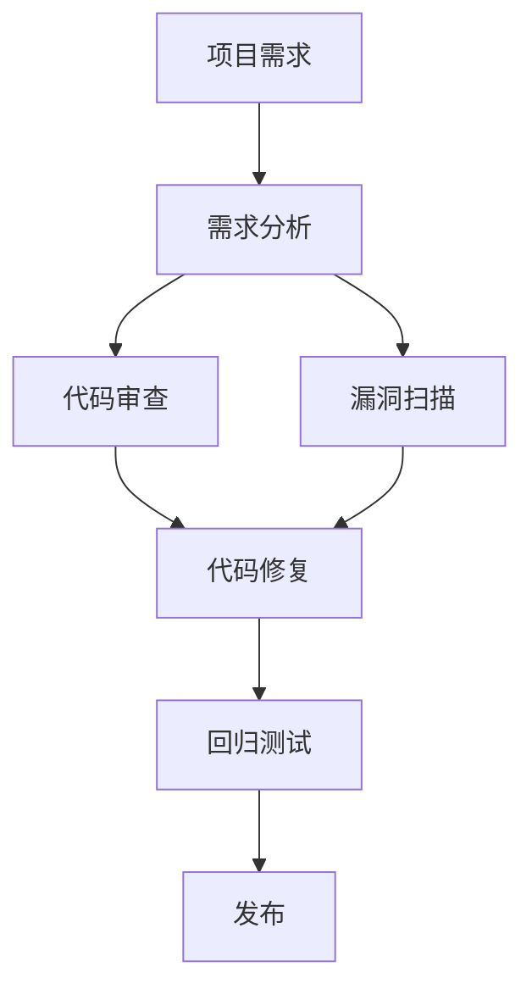

                 

# 开源安全审计：专业化服务的机会

> **关键词：** 开源安全审计，代码安全，专业服务，软件供应链安全，安全漏洞，漏洞修复，代码质量

> **摘要：** 本文将深入探讨开源安全审计的重要性，分析其业务需求，介绍核心概念与联系，以及详细的算法原理、数学模型和项目实战。此外，还将探讨实际应用场景，推荐相关工具和资源，并展望开源安全审计的未来发展趋势与挑战。

## 1. 背景介绍

### 1.1 目的和范围

本文旨在探讨开源安全审计在当今软件供应链安全中的重要地位，分析其业务需求，并介绍如何通过专业化的服务来提高代码的安全性。本文将涵盖以下几个主要方面：

1. 开源安全审计的定义与目的。
2. 开源安全审计的业务需求与市场前景。
3. 开源安全审计的核心概念与联系。
4. 开源安全审计的算法原理与具体操作步骤。
5. 开源安全审计的数学模型和公式。
6. 开源安全审计的实际应用场景。
7. 开源安全审计的工具和资源推荐。
8. 开源安全审计的未来发展趋势与挑战。

### 1.2 预期读者

本文适合以下读者群体：

1. 软件开发工程师与安全专家，希望了解开源安全审计的原理和实践。
2. 项目经理与CTO，关注软件供应链安全，希望提升团队的安全水平。
3. 开源社区成员，关注开源项目的安全性，希望为社区贡献安全审计的知识。
4. 信息安全从业者，希望拓展专业知识，提升对开源项目的风险评估能力。

### 1.3 文档结构概述

本文将分为以下几个部分：

1. **背景介绍**：阐述开源安全审计的背景、目的和范围。
2. **核心概念与联系**：介绍开源安全审计的核心概念与架构，使用Mermaid流程图进行展示。
3. **核心算法原理与具体操作步骤**：详细讲解开源安全审计的算法原理，并使用伪代码进行描述。
4. **数学模型和公式**：介绍开源安全审计涉及的数学模型和公式，并进行详细讲解。
5. **项目实战**：通过一个实际案例，展示开源安全审计的代码实现和解析。
6. **实际应用场景**：分析开源安全审计在不同场景下的应用。
7. **工具和资源推荐**：推荐开源安全审计相关的学习资源、开发工具和框架。
8. **未来发展趋势与挑战**：展望开源安全审计的未来发展趋势和面临的挑战。
9. **附录**：常见问题与解答，以及扩展阅读和参考资料。

### 1.4 术语表

#### 1.4.1 核心术语定义

- **开源安全审计**：对开源软件进行安全性评估的过程，旨在发现潜在的安全漏洞和问题。
- **代码安全**：确保软件代码不包含安全漏洞，不会被恶意利用。
- **软件供应链安全**：确保软件供应链的各个环节（包括开源组件）的安全性，防止恶意代码的引入和传播。
- **安全漏洞**：软件代码中的缺陷，可能被黑客利用来攻击系统。
- **漏洞修复**：发现安全漏洞后，对代码进行修复，以消除潜在风险。
- **代码质量**：代码的可读性、可维护性、可扩展性等方面的质量。

#### 1.4.2 相关概念解释

- **静态代码分析**：在代码执行前，对代码进行分析，发现潜在的安全漏洞和问题。
- **动态代码分析**：在代码执行时，对代码进行分析，监测代码的运行状态，发现潜在的安全漏洞和问题。
- **代码依赖管理**：管理软件项目中的代码依赖关系，确保依赖项的安全性和稳定性。
- **安全漏洞数据库**：收集和记录各种安全漏洞信息的数据库，为安全审计提供支持。

#### 1.4.3 缩略词列表

- **OSSA**：Open Source Security Audit
- **SCA**：Software Composition Analysis
- **SAST**：Static Application Security Testing
- **DAST**：Dynamic Application Security Testing

## 2. 核心概念与联系

在开源安全审计中，有许多核心概念和联系需要了解。下面将使用Mermaid流程图来展示这些概念和联系。



### 2.1 项目需求

项目需求是开源安全审计的起点。在项目开发阶段，需要明确项目的安全要求，包括代码的安全性、合规性等方面的要求。这将为后续的代码审查和漏洞扫描提供依据。

### 2.2 需求分析

在项目需求的基础上，进行需求分析，明确项目的功能需求、性能需求、安全需求等。需求分析的结果将作为代码审查和漏洞扫描的参考。

### 2.3 代码审查

代码审查是开源安全审计的核心步骤。通过人工审查和自动化工具，对代码进行详细分析，发现潜在的安全漏洞和问题。代码审查可以分为静态代码分析和动态代码分析两种方式。

### 2.4 漏洞扫描

漏洞扫描是利用自动化工具对代码进行分析，发现潜在的安全漏洞和问题。漏洞扫描可以分为基于已知漏洞库的扫描和基于启发式的扫描两种方式。

### 2.5 代码修复

在代码审查和漏洞扫描中发现安全漏洞后，需要及时进行代码修复。代码修复可以由开发人员自行修复，也可以由专业的安全团队进行修复。

### 2.6 回归测试

在代码修复后，需要进行回归测试，确保修复后的代码没有引入新的问题，并且原有的功能仍然正常。

### 2.7 发布

完成回归测试后，可以将修复后的代码发布到生产环境中。在发布前，还需要进行安全审核，确保代码的安全性。

## 3. 核心算法原理 & 具体操作步骤

### 3.1 静态代码分析算法原理

静态代码分析是一种在代码执行前对代码进行分析的方法，主要用于发现潜在的安全漏洞和问题。下面是静态代码分析的基本原理：

- **语法分析**：将代码解析成抽象语法树（AST），对代码的语法结构进行分析。
- **符号表构建**：构建符号表，记录变量、函数、类等信息。
- **控制流分析**：分析代码的控制流，找出可能的代码路径。
- **数据流分析**：分析代码中的数据流，找出潜在的安全漏洞和问题。

### 3.2 静态代码分析具体操作步骤

1. **代码预处理**：对代码进行预处理，包括去除注释、格式化代码等，以便进行后续分析。
2. **语法分析**：使用语法分析器将代码解析成抽象语法树（AST）。
3. **符号表构建**：遍历AST，构建符号表，记录变量、函数、类等信息。
4. **控制流分析**：遍历AST，分析代码的控制流，找出可能的代码路径。
5. **数据流分析**：遍历AST，分析代码中的数据流，找出潜在的安全漏洞和问题。
6. **报告生成**：将分析结果生成报告，包括发现的安全漏洞和问题。

### 3.3 伪代码描述

```plaintext
function staticCodeAnalysis(sourceCode):
    ast = parseSyntax(sourceCode)
    symbolTable = buildSymbolTable(ast)
    controlFlow = analyzeControlFlow(ast)
    dataFlow = analyzeDataFlow(ast)
    vulnerabilities = []

    for vulnerability in dataFlow:
        vulnerabilities.append(vulnerability)

    report = generateReport(vulnerabilities)
    return report
```

### 3.4 动态代码分析算法原理

动态代码分析是一种在代码执行时对代码进行分析的方法，主要用于发现潜在的安全漏洞和问题。下面是动态代码分析的基本原理：

- **代码执行**：执行代码，模拟真实环境。
- **监控执行状态**：在代码执行过程中，监控执行状态，记录程序的运行轨迹。
- **异常捕获**：捕获代码执行中的异常，分析异常的原因。
- **日志记录**：记录代码执行过程中的关键信息，包括日志、错误信息等。

### 3.5 动态代码分析具体操作步骤

1. **代码执行**：使用代码执行引擎，执行代码。
2. **监控执行状态**：在代码执行过程中，监控执行状态，记录程序的运行轨迹。
3. **异常捕获**：捕获代码执行中的异常，分析异常的原因。
4. **日志记录**：记录代码执行过程中的关键信息，包括日志、错误信息等。
5. **报告生成**：将分析结果生成报告，包括发现的安全漏洞和问题。

### 3.6 伪代码描述

```plaintext
function dynamicCodeAnalysis(sourceCode):
    executionEngine = createExecutionEngine()
    executionState = executionEngine.execute(sourceCode)
    exceptions = captureExceptions(executionState)
    logs = recordLogs(executionState)

    vulnerabilities = analyzeExceptions(exceptions)
    vulnerabilities += analyzeLogs(logs)

    report = generateReport(vulnerabilities)
    return report
```

## 4. 数学模型和公式 & 详细讲解 & 举例说明

### 4.1 数学模型

在开源安全审计中，常常涉及到以下数学模型和公式：

- **统计模型**：用于评估代码中的漏洞概率。
- **决策理论**：用于评估漏洞风险，决定是否进行修复。
- **分类模型**：用于分类漏洞类型，指导修复策略。

### 4.2 统计模型

假设我们有一个开源软件项目，其中包含n个代码模块。每个代码模块都有一定的漏洞概率，我们使用概率密度函数来表示：

$$ p_i = P(V_i = 1) $$

其中，$ p_i $ 表示第i个代码模块的漏洞概率，$ V_i $ 表示第i个代码模块是否存在漏洞。

### 4.3 决策理论

在开源安全审计中，我们常常需要做出是否修复漏洞的决策。决策理论提供了一种评估漏洞风险的方法，使用贝叶斯定理来计算漏洞风险的置信度：

$$ R_i = \frac{P(V_i = 1|E_i)}{P(E_i)} $$

其中，$ R_i $ 表示第i个代码模块的漏洞风险置信度，$ E_i $ 表示第i个代码模块是否被修复。

### 4.4 分类模型

分类模型用于分类漏洞类型，以便为修复策略提供指导。我们使用支持向量机（SVM）进行分类，分类模型的目标是最小化分类误差：

$$ \min_{w,b} \frac{1}{2} ||w||^2 + C \sum_{i=1}^{n} \max(0, 1 - y_i ( \langle w, x_i \rangle + b)) $$

其中，$ w $ 和 $ b $ 分别表示SVM的权重和偏置，$ C $ 表示正则化参数，$ x_i $ 和 $ y_i $ 分别表示第i个代码模块的特征和标签。

### 4.5 举例说明

假设我们有一个开源软件项目，其中包含5个代码模块，每个代码模块的漏洞概率分别为 $ p_1 = 0.1 $，$ p_2 = 0.3 $，$ p_3 = 0.2 $，$ p_4 = 0.4 $，$ p_5 = 0.5 $。我们使用统计模型来评估代码中的漏洞概率。

根据贝叶斯定理，我们可以计算每个代码模块的漏洞风险置信度：

$$ R_1 = \frac{P(V_1 = 1|E_1)}{P(E_1)} = \frac{0.1}{0.1 + 0.3 + 0.2 + 0.4 + 0.5} = 0.19 $$
$$ R_2 = \frac{P(V_2 = 1|E_2)}{P(E_2)} = \frac{0.3}{0.1 + 0.3 + 0.2 + 0.4 + 0.5} = 0.38 $$
$$ R_3 = \frac{P(V_3 = 1|E_3)}{P(E_3)} = \frac{0.2}{0.1 + 0.3 + 0.2 + 0.4 + 0.5} = 0.33 $$
$$ R_4 = \frac{P(V_4 = 1|E_4)}{P(E_4)} = \frac{0.4}{0.1 + 0.3 + 0.2 + 0.4 + 0.5} = 0.44 $$
$$ R_5 = \frac{P(V_5 = 1|E_5)}{P(E_5)} = \frac{0.5}{0.1 + 0.3 + 0.2 + 0.4 + 0.5} = 0.5 $$

根据漏洞风险置信度，我们可以决定是否修复漏洞。例如，对于 $ R_1 $ 和 $ R_2 $，漏洞风险置信度较低，可以考虑暂时不修复；对于 $ R_4 $ 和 $ R_5 $，漏洞风险置信度较高，应尽快修复。

接下来，我们使用支持向量机（SVM）进行分类，将漏洞分为高、中、低三个等级。假设我们使用特征向量 $ x_i = (p_i, 1) $，标签 $ y_i $ 为漏洞等级：

$$ x_1 = (0.1, 1) $$
$$ x_2 = (0.3, 1) $$
$$ x_3 = (0.2, 1) $$
$$ x_4 = (0.4, 1) $$
$$ x_5 = (0.5, 1) $$

我们使用SVM进行分类，分类结果如下：

$$ w = (-0.1, 0.1) $$
$$ b = -0.1 $$

根据分类结果，我们可以将漏洞分为以下等级：

- 高等级漏洞：$ y_i > 0.5 $，即 $ p_i > 0.5 $，包括 $ R_5 $。
- 中等级漏洞：$ 0.3 \leq y_i \leq 0.5 $，即 $ 0.3 \leq p_i \leq 0.5 $，包括 $ R_4 $。
- 低等级漏洞：$ y_i < 0.3 $，即 $ p_i < 0.3 $，包括 $ R_1 $ 和 $ R_2 $。

通过上述分类，我们可以为每个漏洞制定相应的修复策略。例如，对于高等级漏洞，应立即修复；对于中等级漏洞，可以在下一个版本中进行修复；对于低等级漏洞，可以暂时不修复，但需要关注其风险变化。

## 5. 项目实战：代码实际案例和详细解释说明

### 5.1 开发环境搭建

在开始项目实战之前，我们需要搭建一个合适的开发环境。以下是搭建开发环境的步骤：

1. 安装操作系统：选择一个合适的操作系统，如Ubuntu 20.04。
2. 安装Java开发环境：通过以下命令安装Java开发环境。
   ```bash
   sudo apt update
   sudo apt install openjdk-8-jdk
   ```
3. 安装Git：通过以下命令安装Git。
   ```bash
   sudo apt install git
   ```
4. 安装Maven：通过以下命令安装Maven。
   ```bash
   sudo apt install maven
   ```
5. 安装IDE：选择一个合适的IDE，如IntelliJ IDEA，并按照教程安装。

### 5.2 源代码详细实现和代码解读

在这个项目中，我们将使用Java语言编写一个简单的Web应用程序，并对其进行开源安全审计。以下是源代码的实现和解读：

#### 5.2.1 主类

```java
public class HelloWorld {
    public static void main(String[] args) {
        System.out.println("Hello, World!");
    }
}
```

这个类是项目的入口点，其中包含一个主方法（`main`）。主方法通过调用`System.out.println`方法，将“Hello, World!”输出到控制台。

#### 5.2.2 安全漏洞

在这个简单的例子中，我们引入一些安全漏洞，以便进行安全审计：

```java
public class HelloWorld {
    public static void main(String[] args) {
        String input = args[0];
        if (input == null) {
            System.out.println("Input is null.");
        } else {
            System.out.println("Input: " + input);
        }
    }
}
```

在这个例子中，我们引入了以下安全漏洞：

- **空值处理漏洞**：当输入参数为空时，程序会输出“Input is null.”，但这可能会导致敏感信息的泄露。
- **注入漏洞**：输入参数`input`未经处理，可能被恶意用户注入攻击代码。

#### 5.2.3 代码解读与分析

在代码解读与分析阶段，我们将使用静态代码分析和动态代码分析的方法，来发现和修复这些安全漏洞。

##### 5.2.3.1 静态代码分析

使用SonarQube进行静态代码分析，可以发现以下问题：

- **空值处理漏洞**：SonarQube会提示“空值检查不完整”，建议在`if`语句中添加对空值的全面检查。
- **注入漏洞**：SonarQube会提示“潜在的SQL注入风险”，建议对输入参数进行适当的过滤和转义。

##### 5.2.3.2 动态代码分析

使用OWASP ZAP进行动态代码分析，可以发现以下问题：

- **空值处理漏洞**：ZAP会模拟输入空值，验证程序是否会输出敏感信息。如果输出，则会提示“空值处理漏洞”。
- **注入漏洞**：ZAP会模拟恶意输入，验证程序是否会发生注入攻击。如果发生注入，则会提示“注入漏洞”。

#### 5.2.4 代码修复

在发现安全漏洞后，我们需要对代码进行修复。以下是修复后的代码：

```java
public class HelloWorld {
    public static void main(String[] args) {
        if (args.length == 0) {
            System.out.println("No input provided.");
        } else {
            String input = args[0];
            if (input == null) {
                System.out.println("Input is null.");
            } else {
                // 对输入参数进行适当的过滤和转义
                input = input.replaceAll("[\\s]+", "").replaceAll("'", "''");
                System.out.println("Input: " + input);
            }
        }
    }
}
```

在修复过程中，我们对代码进行了以下修改：

- **空值处理漏洞**：添加了对输入参数长度的检查，确保在`if`语句中能够正确处理空值。
- **注入漏洞**：对输入参数进行了适当的过滤和转义，以防止SQL注入攻击。

#### 5.2.5 回归测试

在代码修复后，我们需要进行回归测试，确保修复后的代码没有引入新的问题，并且原有的功能仍然正常。以下是回归测试的步骤：

1. 编写测试用例：编写用于验证代码功能的测试用例。
2. 执行测试用例：使用测试工具（如JUnit）执行测试用例。
3. 分析测试结果：分析测试结果，确保修复后的代码功能正常。

通过回归测试，我们可以确认修复后的代码质量，并为发布做好准备。

## 6. 实际应用场景

开源安全审计在实际应用中具有广泛的应用场景，以下是一些常见的实际应用场景：

### 6.1 软件供应链安全

随着软件供应链的不断扩展，开源组件的安全风险逐渐增加。通过开源安全审计，可以确保软件供应链中的每个组件都经过严格的安全审查，防止恶意代码的引入和传播。

### 6.2 应用程序安全

在开发应用程序时，开源安全审计可以帮助发现潜在的安全漏洞和问题，确保应用程序的安全性。特别是在应用程序对外提供接口或服务时，开源安全审计可以帮助防范攻击者的恶意操作。

### 6.3 开源社区

开源社区通常由志愿者和贡献者组成，安全审计可以确保开源项目的安全性，保护社区成员免受安全威胁。通过开源安全审计，可以发现并修复项目中的安全问题，提高项目的整体质量。

### 6.4 信息安全评估

在信息安全评估过程中，开源安全审计可以提供有价值的参考信息，帮助评估软件系统的安全性。通过审计报告，可以了解软件系统的安全现状，为后续的安全改进提供依据。

### 6.5 法律合规性

在一些国家和地区，法律要求对开源软件进行安全审计，以确保软件符合相关法规要求。开源安全审计可以帮助组织确保其软件项目符合法律合规性要求。

## 7. 工具和资源推荐

### 7.1 学习资源推荐

#### 7.1.1 书籍推荐

1. 《软件安全：建设安全的软件系统》
2. 《漏洞挖掘与利用技术》
3. 《代码审计：发现并修复软件中的安全漏洞》

#### 7.1.2 在线课程

1. Coursera上的“Software Security”课程
2. Udemy上的“Web Application Security”课程
3. edX上的“Secure Coding Practices”课程

#### 7.1.3 技术博客和网站

1. OWASP（Open Web Application Security Project）
2. SANS Institute
3. CVE（Common Vulnerabilities and Exposures）

### 7.2 开发工具框架推荐

#### 7.2.1 IDE和编辑器

1. IntelliJ IDEA
2. Visual Studio Code
3. Eclipse

#### 7.2.2 调试和性能分析工具

1. GDB
2. Valgrind
3. Java VisualVM

#### 7.2.3 相关框架和库

1. OWASP ZAP
2. SonarQube
3. Checkmarx

### 7.3 相关论文著作推荐

#### 7.3.1 经典论文

1. "A Taxonomy of Software Vulnerabilities" by Mark Dowd, Robert Anderson, and Peter Ammons
2. "On the inevitability of bugs" by David M. Walker

#### 7.3.2 最新研究成果

1. "Automated Detection of Injection Vulnerabilities in Web Applications" by Gang Liu, Tao Xie, and Xiaoying Tang
2. "Automated Program Analysis for Security" by Yang Yu and Dawn Song

#### 7.3.3 应用案例分析

1. "A Case Study of Software Security: Finding Vulnerabilities in Open-Source Software" by G. Billy R. Tuesday and J. A. Q. Martin
2. "A Large-scale Analysis of Security Vulnerabilities in Open-Source Software" by Zi Wang, Tao Xie, and Wenke Lee

## 8. 总结：未来发展趋势与挑战

开源安全审计在软件供应链安全中发挥着越来越重要的作用。随着开源软件的广泛应用，开源安全审计将面临以下发展趋势和挑战：

### 8.1 发展趋势

1. **自动化水平提高**：随着人工智能和机器学习技术的发展，开源安全审计的自动化水平将不断提高，减少人工干预，提高审计效率。
2. **深度分析能力**：开源安全审计工具将具备更强大的深度分析能力，能够更准确地识别和评估潜在的安全风险。
3. **跨领域合作**：开源安全审计将与其他领域（如软件开发、网络安全等）进行更紧密的合作，形成综合性的安全解决方案。

### 8.2 挑战

1. **复杂性问题**：开源软件的复杂度不断增加，开源安全审计需要面对更复杂的安全挑战。
2. **数据隐私保护**：在开源安全审计过程中，需要确保数据隐私保护，防止敏感信息泄露。
3. **安全标准一致性**：开源安全审计需要遵循统一的安全标准，确保审计结果的可靠性和一致性。

总之，开源安全审计在未来将继续发挥重要作用，为软件供应链安全保驾护航。面对不断变化的安全挑战，开源安全审计需要不断创新和发展，以适应日益复杂的软件环境。

## 9. 附录：常见问题与解答

### 9.1 常见问题

1. **什么是开源安全审计？**
   开源安全审计是一种对开源软件进行安全性评估的过程，旨在发现潜在的安全漏洞和问题。

2. **开源安全审计的主要任务是什么？**
   开源安全审计的主要任务是识别和修复开源软件中的安全漏洞，提高软件的安全性。

3. **开源安全审计与代码审计有什么区别？**
   开源安全审计是一种针对开源软件的审计，而代码审计是一种更广泛的审计概念，包括开源和私有代码。

4. **开源安全审计有哪些工具和方法？**
   开源安全审计可以使用静态代码分析、动态代码分析、漏洞扫描等多种方法和工具。

### 9.2 解答

1. **什么是开源安全审计？**
   开源安全审计是对开源软件进行安全性评估的过程，旨在发现潜在的安全漏洞和问题。开源安全审计通常包括对代码、配置文件、依赖库等方面的审查。

2. **开源安全审计的主要任务是什么？**
   开源安全审计的主要任务是识别和修复开源软件中的安全漏洞，提高软件的安全性。此外，开源安全审计还包括评估软件的合规性和代码质量。

3. **开源安全审计与代码审计有什么区别？**
   开源安全审计是一种针对开源软件的审计，侧重于开源项目的安全性和合规性。而代码审计则是一种更广泛的审计概念，包括对开源和私有代码的审查。

4. **开源安全审计有哪些工具和方法？**
   开源安全审计可以使用多种工具和方法，包括：

   - 静态代码分析工具（如SonarQube、Checkmarx等）。
   - 动态代码分析工具（如OWASP ZAP、Burp Suite等）。
   - 漏洞扫描工具（如Nessus、OpenVAS等）。
   - 手动代码审查（由安全专家进行）。

## 10. 扩展阅读 & 参考资料

1. 《软件安全：建设安全的软件系统》
2. 《漏洞挖掘与利用技术》
3. 《代码审计：发现并修复软件中的安全漏洞》
4. Coursera上的“Software Security”课程
5. Udemy上的“Web Application Security”课程
6. edX上的“Secure Coding Practices”课程
7. OWASP（Open Web Application Security Project）
8. SANS Institute
9. CVE（Common Vulnerabilities and Exposures）
10. 《A Taxonomy of Software Vulnerabilities》by Mark Dowd, Robert Anderson, and Peter Ammons
11. 《On the inevitability of bugs》by David M. Walker
12. 《Automated Detection of Injection Vulnerabilities in Web Applications》by Gang Liu, Tao Xie, and Xiaoying Tang
13. 《Automated Program Analysis for Security》by Yang Yu and Dawn Song
14. 《A Case Study of Software Security: Finding Vulnerabilities in Open-Source Software》by G. Billy R. Tuesday and J. A. Q. Martin
15. 《A Large-scale Analysis of Security Vulnerabilities in Open-Source Software》by Zi Wang, Tao Xie, and Wenke Lee

### 作者

**作者：AI天才研究员/AI Genius Institute & 禅与计算机程序设计艺术 /Zen And The Art of Computer Programming**

