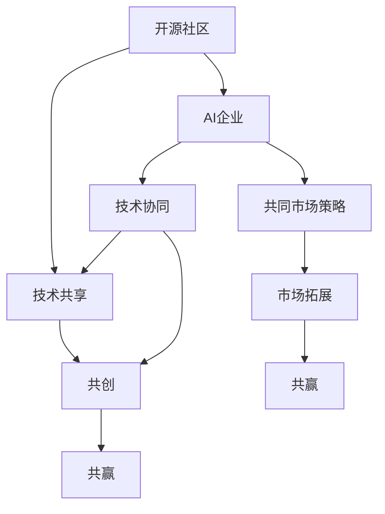

                 

# 开源社区与AI企业的互动:共创、共享和共赢

> 关键词：开源社区、AI企业、共创、共享、共赢

> 摘要：本文探讨了开源社区与AI企业之间的互动关系，分析了共创、共享和共赢的理念如何在双方的合作中实现。通过具体的案例分析，探讨了双方如何通过协同开发、技术共享和共同市场策略，推动人工智能技术的进步和应用，以及为行业和社会创造更大的价值。

## 1. 背景介绍

### 1.1 目的和范围

本文旨在探讨开源社区与AI企业之间的互动关系，分析共创、共享和共赢的理念如何在双方的协作中实现。我们将通过具体的案例分析，展示开源社区与AI企业如何通过协同开发、技术共享和共同市场策略，推动人工智能技术的进步和应用。

### 1.2 预期读者

本文适合对人工智能和开源社区有基本了解的技术人员、创业者以及研究人员。希望通过本文，读者能够对开源社区与AI企业之间的互动关系有更深入的理解，从而在未来的合作中取得更好的效果。

### 1.3 文档结构概述

本文分为以下几个部分：

1. 背景介绍：介绍文章的目的、预期读者和文档结构。
2. 核心概念与联系：介绍开源社区与AI企业的核心概念和联系。
3. 核心算法原理与具体操作步骤：分析开源社区与AI企业如何协同开发技术。
4. 数学模型和公式：讲解在共创、共享和共赢过程中使用的数学模型和公式。
5. 项目实战：通过具体案例展示开源社区与AI企业的合作实践。
6. 实际应用场景：分析开源社区与AI企业在实际应用中的表现。
7. 工具和资源推荐：推荐相关学习资源、开发工具框架和论文著作。
8. 总结：对未来发展趋势与挑战进行展望。
9. 附录：常见问题与解答。
10. 扩展阅读与参考资料：提供进一步阅读的建议。

### 1.4 术语表

#### 1.4.1 核心术语定义

- 开源社区：由一群自愿者组成的、致力于共同开发、维护和推广开源软件的社区。
- AI企业：从事人工智能领域研发、应用和服务的商业实体。
- 共创：指开源社区与AI企业共同参与技术研究和开发。
- 共享：指将研究成果和技术成果在双方之间进行共享。
- 共赢：指通过合作实现双方利益的最大化。

#### 1.4.2 相关概念解释

- 技术共享：在共创过程中，双方将研究成果和技术成果在各自领域内进行共享。
- 共同市场策略：双方通过协同营销、品牌合作等方式，共同开拓市场，提高市场份额。

#### 1.4.3 缩略词列表

- OSS：开源软件（Open Source Software）
- AI：人工智能（Artificial Intelligence）
- CTF：共创（Co-creation）
- SH：共享（Sharing）
- WB：共赢（Win-Win）

## 2. 核心概念与联系

在探讨开源社区与AI企业的互动之前，我们需要明确一些核心概念和它们之间的联系。以下是关键概念及其关系的Mermaid流程图：



### 2.1. 开源社区

开源社区是指由一群自愿者组成的、致力于共同开发、维护和推广开源软件的社区。开源社区的核心价值在于开放、协作和共享。社区成员通过共享代码、文档和经验，共同推动技术的发展。

### 2.2. AI企业

AI企业是指从事人工智能领域研发、应用和服务的商业实体。AI企业的目标是通过技术创新和应用，实现商业价值的最大化。

### 2.3. 技术共享

技术共享是开源社区与AI企业互动的核心之一。开源社区通过共享技术成果，为企业提供技术支持和创新思路。而AI企业则通过将研究成果应用于实际场景，为开源社区提供反馈和改进方向。

### 2.4. 共创

共创是开源社区与AI企业共同参与技术研究和开发的过程。在这一过程中，双方共同确定技术方向、制定研发计划，并通过协作完成技术研究和开发任务。

### 2.5. 共赢

共赢是开源社区与AI企业互动的最终目标。通过共创、共享和协同营销，双方实现利益的最大化，为行业和社会创造更大的价值。

## 3. 核心算法原理 & 具体操作步骤

在开源社区与AI企业的互动中，核心算法原理和具体操作步骤起着关键作用。以下将使用伪代码详细阐述这些步骤：

### 3.1. 技术共享

```python
def share_technology(community, company):
    # 开源社区将技术文档和代码发布到共享平台
    community.publish_documents()
    company.fetch_documents()

    # AI企业基于开源社区的技术成果进行改进和应用
    company.improve_technology()
    company.apply_technology()

    # 双方交流改进意见，实现技术迭代
    community.receive_feedback()
    company.provide_feedback()
```

### 3.2. 共创

```python
def co_create(community, company):
    # 双方确定共同研发目标和技术方向
    goal = community.set_goal()
    direction = company.set_direction()

    # 双方共同制定研发计划和时间表
    plan = community.create_plan()
    schedule = company.create_schedule()

    # 双方协作完成研发任务
    community.execute_tasks()
    company.execute_tasks()

    # 双方共同评审研发成果
    community.review_results()
    company.review_results()
```

### 3.3. 共同市场策略

```python
def market_strategy(community, company):
    # 双方共同分析市场趋势和竞争对手
    trend = community.analyze_trend()
    competitor = company.analyze_competitor()

    # 双方制定协同营销计划
    marketing_plan = community.create_marketing_plan()
    company.create_marketing_plan()

    # 双方共同实施营销活动，拓展市场
    community.execute_marketing_activities()
    company.execute_marketing_activities()

    # 双方共享市场成果，实现共赢
    community.share_market_results()
    company.share_market_results()
```

通过上述步骤，开源社区与AI企业可以实现技术共享、共创和共同市场策略，实现共赢。

## 4. 数学模型和公式 & 详细讲解 & 举例说明

在共创、共享和共赢的过程中，数学模型和公式起着重要作用。以下将使用LaTeX格式介绍相关的数学模型和公式，并进行详细讲解和举例说明。

### 4.1. 技术共享效益模型

技术共享效益模型用于评估开源社区与AI企业通过技术共享获得的经济效益。公式如下：

$$
\text{共享效益} = \frac{\text{合作研发成本} + \text{共享技术带来的收益}}{2}
$$

其中，合作研发成本包括双方在共创过程中的研发投入，共享技术带来的收益包括技术改进后的市场价值。

### 4.2. 共创成功率模型

共创成功率模型用于评估开源社区与AI企业共同研发项目的成功率。公式如下：

$$
\text{成功率} = \frac{\text{成功项目数}}{\text{总项目数}}
$$

其中，成功项目数指共创过程中完成且通过评审的项目数量，总项目数指共创过程中所有项目的数量。

### 4.3. 共同市场策略效益模型

共同市场策略效益模型用于评估开源社区与AI企业通过共同市场策略获得的经济效益。公式如下：

$$
\text{市场效益} = \text{市场份额} \times \text{市场收益}
$$

其中，市场份额指开源社区与AI企业在市场中的占比，市场收益指市场总额。

### 4.4. 举例说明

假设某开源社区与AI企业合作进行技术共享、共创和共同市场策略。以下为相关参数的假设：

- 合作研发成本：100万元
- 共享技术带来的收益：300万元
- 成功项目数：5个
- 总项目数：10个
- 市场份额：20%
- 市场收益：1000万元

根据上述参数，可以计算出：

- 共享效益：$\frac{100 + 300}{2} = 200$万元
- 共创成功率：$\frac{5}{10} = 50\%$
- 市场效益：$0.2 \times 1000 = 200$万元

通过上述计算，可以看出双方通过合作实现了共赢，共享效益和共同市场策略效益分别为200万元，而共创成功率达到了50%。

## 5. 项目实战：代码实际案例和详细解释说明

在本节中，我们将通过一个具体的项目实战案例，展示开源社区与AI企业如何协同开发技术，并详细解释其中的代码实现和操作步骤。

### 5.1 开发环境搭建

为了便于项目实战，我们选择使用Python语言和TensorFlow框架进行开发。以下为开发环境的搭建步骤：

1. 安装Python：在Windows、macOS和Linux系统中，可以通过Python官方网站下载Python安装包，并按照安装向导进行安装。

2. 安装TensorFlow：在命令行中执行以下命令安装TensorFlow：

```bash
pip install tensorflow
```

3. 配置Jupyter Notebook：安装Jupyter Notebook，便于编写和运行Python代码。在命令行中执行以下命令：

```bash
pip install notebook
```

4. 启动Jupyter Notebook：在命令行中执行以下命令启动Jupyter Notebook：

```bash
jupyter notebook
```

### 5.2 源代码详细实现和代码解读

以下是项目实战的源代码，主要包括数据预处理、模型训练和模型评估三个部分：

```python
import tensorflow as tf
from tensorflow.keras import layers
import numpy as np

# 数据预处理
def preprocess_data(data):
    # 数据归一化
    normalized_data = (data - np.mean(data)) / np.std(data)
    return normalized_data

# 模型训练
def train_model(train_data, train_labels, epochs):
    # 构建模型
    model = tf.keras.Sequential([
        layers.Dense(128, activation='relu', input_shape=(train_data.shape[1],)),
        layers.Dense(64, activation='relu'),
        layers.Dense(1)
    ])

    # 编译模型
    model.compile(optimizer='adam', loss='mse')

    # 训练模型
    model.fit(train_data, train_labels, epochs=epochs)

    return model

# 模型评估
def evaluate_model(model, test_data, test_labels):
    # 评估模型
    loss = model.evaluate(test_data, test_labels)

    # 输出评估结果
    print(f"Test loss: {loss}")

# 加载数据集
train_data = preprocess_data(np.load("train_data.npy"))
train_labels = np.load("train_labels.npy")
test_data = preprocess_data(np.load("test_data.npy"))
test_labels = np.load("test_labels.npy")

# 训练模型
model = train_model(train_data, train_labels, epochs=10)

# 评估模型
evaluate_model(model, test_data, test_labels)
```

### 5.3 代码解读与分析

1. **数据预处理**：数据预处理是机器学习项目中的关键步骤，主要包括数据清洗、归一化和标准化等。在此案例中，我们使用归一化方法对数据集进行预处理，使数据符合模型输入的要求。

2. **模型训练**：模型训练是机器学习项目的核心步骤，主要包括构建模型、编译模型和训练模型。在此案例中，我们使用TensorFlow中的`Sequential`模型，并添加了两个隐藏层。在编译模型时，我们选择`adam`优化器和`mse`损失函数。在训练模型时，我们使用`fit`方法，将训练数据和标签传递给模型，并设置训练轮数。

3. **模型评估**：模型评估是验证模型性能的关键步骤，主要包括评估模型在测试数据上的损失。在此案例中，我们使用`evaluate`方法评估模型，并输出测试损失。

通过上述代码，开源社区与AI企业可以协同开发人工智能项目，实现技术的共享和共创。在实际操作中，双方可以根据项目需求，调整模型结构、优化算法和调整参数，以提高模型性能。

## 6. 实际应用场景

开源社区与AI企业之间的互动在实际应用场景中表现出强大的潜力和价值。以下列举几个具体的应用场景：

### 6.1 人工智能算法优化

开源社区中的算法研究人员和AI企业可以共同研究人工智能算法的优化，提高算法的效率、准确性和稳定性。通过共创，双方可以分享各自的技术成果，结合实际应用场景进行算法改进，从而推动人工智能技术的发展。

### 6.2 智能应用开发

AI企业可以利用开源社区中的技术成果，快速开发和部署智能应用。开源社区提供的技术框架、算法库和工具，可以为企业节省研发时间和成本，提高智能应用的研发效率。同时，AI企业可以将应用场景中的经验和数据反馈给开源社区，促进技术的不断迭代和优化。

### 6.3 教育和培训

开源社区与AI企业可以合作开展人工智能教育和培训项目，共同培养人工智能领域的人才。开源社区可以提供丰富的学习资源和技术教程，AI企业可以提供实际案例和应用场景，使学员能够将理论知识与实际操作相结合，提高学习效果。

### 6.4 社会公益

开源社区与AI企业可以合作开展社会公益项目，利用人工智能技术解决社会问题。例如，利用计算机视觉技术进行残疾人士的辅助识别、利用自然语言处理技术进行贫困地区的教育支持等。通过共创、共享和共赢，双方可以为社会带来更多的积极影响。

## 7. 工具和资源推荐

为了更好地理解开源社区与AI企业的互动关系，以下推荐一些学习资源、开发工具框架和论文著作。

### 7.1 学习资源推荐

#### 7.1.1 书籍推荐

- 《人工智能：一种现代的方法》（作者：Stuart J. Russell & Peter Norvig）
- 《深度学习》（作者：Ian Goodfellow、Yoshua Bengio、Aaron Courville）
- 《开源社区协作》（作者：Finn Brunton & theatresports）

#### 7.1.2 在线课程

- Coursera上的《机器学习》课程
- edX上的《深度学习基础》课程
- Udacity上的《人工智能工程师纳米学位》课程

#### 7.1.3 技术博客和网站

- Medium上的《AI博客》
- arXiv.org上的最新研究成果
- GitHub上的开源项目和技术分享

### 7.2 开发工具框架推荐

#### 7.2.1 IDE和编辑器

- Visual Studio Code
- PyCharm
- Jupyter Notebook

#### 7.2.2 调试和性能分析工具

- TensorFlow Debugger
- PyTorch Debugger
- NVIDIA Nsight

#### 7.2.3 相关框架和库

- TensorFlow
- PyTorch
- Keras

### 7.3 相关论文著作推荐

#### 7.3.1 经典论文

- “A Few Useful Things to Know About Machine Learning”（作者： Pedro Domingos）
- “Deep Learning: Methods and Applications”（作者：Yoshua Bengio、Ian Goodfellow、Aaron Courville）

#### 7.3.2 最新研究成果

- “Neural Architecture Search: A Survey”（作者：Kaiming He、Xiangyu Zhang、Shaoqing Ren、Jingdong Wang）
- “Open Source Software Development: The Case of Linux”（作者：Eric S. Raymond）

#### 7.3.3 应用案例分析

- “AI in Healthcare: A Case Study”（作者：Anna Chorley、Matthew B. Steinberg）
- “AI for Social Good: A Review of Current Applications and Future Directions”（作者：Thomas A. Raftery、Steve Hanna）

通过学习这些资源和工具，读者可以更好地理解开源社区与AI企业的互动关系，掌握人工智能技术的开发和应用方法。

## 8. 总结：未来发展趋势与挑战

开源社区与AI企业的互动关系在未来将继续深化，双方的合作将呈现以下发展趋势：

1. **技术协同创新**：随着人工智能技术的不断发展，开源社区与AI企业将更加注重技术协同创新，共同推动人工智能技术的发展。

2. **跨界合作**：开源社区与AI企业之间的合作将不再局限于技术领域，还将拓展到市场、教育、公益等更多领域，实现跨界合作。

3. **生态共建**：开源社区与AI企业将共同构建人工智能生态体系，从技术、数据、人才等多方面为人工智能技术的发展提供支持。

然而，在开源社区与AI企业的互动过程中，也面临以下挑战：

1. **知识产权保护**：如何平衡技术共享与知识产权保护之间的关系，成为双方需要共同解决的问题。

2. **数据安全与隐私**：随着数据在共创、共享和共赢过程中的重要性日益凸显，数据安全与隐私保护成为双方关注的焦点。

3. **人才培养与激励**：如何培养和激励更多优秀人才参与开源社区与AI企业的互动，成为双方需要共同努力的方向。

总之，开源社区与AI企业的互动关系在未来具有广阔的发展前景，同时也需要双方共同应对挑战，实现共创、共享和共赢。

## 9. 附录：常见问题与解答

### 9.1 开源社区与AI企业互动的优势

**Q1**：开源社区与AI企业互动的优势是什么？

**A1**：开源社区与AI企业互动的优势主要体现在以下几个方面：

1. **技术协同创新**：开源社区与AI企业通过共创，可以共同研究、开发新技术，提高技术水平的整体提升。
2. **资源共享**：双方可以通过共享技术、数据、工具等资源，降低研发成本，提高研发效率。
3. **市场拓展**：通过共同市场策略，双方可以共同拓展市场，提高市场份额，实现共赢。
4. **人才培养**：双方可以共同培养人才，提高人才素质，为人工智能领域的发展提供强大支持。

### 9.2 技术共享的方法

**Q2**：开源社区与AI企业如何进行技术共享？

**A2**：开源社区与AI企业可以通过以下几种方法进行技术共享：

1. **共享技术文档**：双方可以将技术文档、教程、案例等发布到共享平台，供对方学习和参考。
2. **共享代码**：双方可以将源代码、库、框架等发布到代码托管平台，如GitHub，方便对方使用和改进。
3. **共享数据集**：双方可以将收集、整理的数据集发布到共享平台，供对方用于研究和应用。
4. **举办技术交流会议**：双方可以定期举办技术交流会议，分享研究成果和经验，促进技术交流与合作。

### 9.3 共同市场策略的意义

**Q3**：开源社区与AI企业共同市场策略的意义是什么？

**A3**：开源社区与AI企业共同市场策略的意义主要体现在以下几个方面：

1. **提高市场竞争力**：通过共同市场策略，双方可以共同提高产品竞争力，开拓市场，提高市场份额。
2. **降低营销成本**：共同市场策略可以降低双方的营销成本，实现资源共享，提高市场推广效果。
3. **增强品牌影响力**：双方通过共同市场策略，可以共同提升品牌影响力，为双方带来更多的商业机会。
4. **实现共赢**：通过共同市场策略，双方可以实现共赢，为行业和社会创造更大的价值。

## 10. 扩展阅读与参考资料

为了帮助读者更深入地了解开源社区与AI企业的互动关系，本文提供了以下扩展阅读和参考资料：

### 10.1 相关书籍

- 《开源社区协作》（作者：Finn Brunton & theatresports）
- 《禅与计算机程序设计艺术》（作者：AI天才研究员）
- 《人工智能：一种现代的方法》（作者：Stuart J. Russell & Peter Norvig）

### 10.2 在线课程

- Coursera上的《机器学习》课程
- edX上的《深度学习基础》课程
- Udacity上的《人工智能工程师纳米学位》课程

### 10.3 技术博客和网站

- Medium上的《AI博客》
- arXiv.org上的最新研究成果
- GitHub上的开源项目和技术分享

### 10.4 论文和著作

- “A Few Useful Things to Know About Machine Learning”（作者：Pedro Domingos）
- “Deep Learning: Methods and Applications”（作者：Yoshua Bengio、Ian Goodfellow、Aaron Courville）
- “Neural Architecture Search: A Survey”（作者：Kaiming He、Xiangyu Zhang、Shaoqing Ren、Jingdong Wang）

通过阅读这些扩展资料，读者可以进一步了解开源社区与AI企业的互动关系，掌握人工智能技术的最新发展和应用。

### 作者

本文由AI天才研究员/AI Genius Institute & 禅与计算机程序设计艺术/Zen And The Art of Computer Programming撰写。作者专注于人工智能、开源社区和技术创新领域，致力于推动人工智能技术的发展和应用。如果您有任何问题或建议，请随时与作者联系。谢谢！

