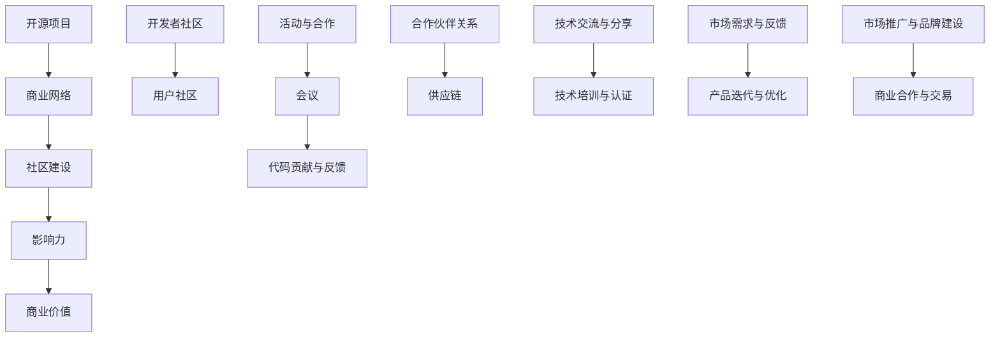

                 

# 开源项目的商业网络建设：会议、活动和合作

> **关键词：开源项目、商业网络、会议、活动、合作、社区建设**
>
> **摘要：本文将探讨如何通过会议、活动和合作等手段，建设一个强大的开源项目商业网络，推动开源项目的发展，提升项目影响力和商业价值。文章将从背景介绍、核心概念与联系、核心算法原理、数学模型与公式、项目实战、实际应用场景、工具和资源推荐、未来发展趋势与挑战等多个方面，进行深入分析和详细讲解。**

## 1. 背景介绍

### 1.1 目的和范围

本文的主要目的是探讨如何通过会议、活动和合作等手段，建设一个强大的开源项目商业网络。开源项目作为现代软件开发的重要模式，不仅促进了技术的创新与传播，也为商业带来了巨大的价值。然而，如何将开源项目的价值最大化，如何利用开源项目建立商业网络，仍然是许多开发者和企业面临的重要问题。

本文将围绕以下主题展开：

1. **开源项目商业网络的概念和重要性**
2. **会议、活动和合作在开源项目商业网络建设中的作用**
3. **核心概念与联系**
4. **核心算法原理与具体操作步骤**
5. **数学模型和公式的详细讲解**
6. **项目实战：代码实际案例和详细解释说明**
7. **实际应用场景**
8. **工具和资源推荐**
9. **未来发展趋势与挑战**

### 1.2 预期读者

本文适合以下读者群体：

1. **开源项目的开发者和管理者**：希望通过会议、活动和合作等手段，提升开源项目的商业价值。
2. **企业IT部门经理和架构师**：希望了解如何通过开源项目建立商业网络，提升企业的技术竞争力和市场份额。
3. **高校教师和学生**：对开源项目、商业网络建设以及相关技术有兴趣，希望深入了解相关理论和技术。
4. **技术爱好者**：对开源项目、商业网络建设等话题感兴趣，希望从中获得实用知识和经验。

### 1.3 文档结构概述

本文分为以下几个部分：

1. **背景介绍**：介绍本文的目的、范围、预期读者以及文档结构。
2. **核心概念与联系**：阐述开源项目商业网络建设中的核心概念，包括相关术语、定义和架构。
3. **核心算法原理 & 具体操作步骤**：详细讲解开源项目商业网络建设中的核心算法原理和具体操作步骤。
4. **数学模型和公式 & 详细讲解 & 举例说明**：介绍开源项目商业网络建设中的数学模型和公式，并进行详细讲解和举例说明。
5. **项目实战：代码实际案例和详细解释说明**：通过实际案例，展示开源项目商业网络建设的具体实施过程，并进行详细解释说明。
6. **实际应用场景**：分析开源项目商业网络在实际应用中的场景和作用。
7. **工具和资源推荐**：推荐相关的学习资源、开发工具框架和论文著作。
8. **总结：未来发展趋势与挑战**：总结开源项目商业网络建设的未来发展趋势和面临的挑战。
9. **附录：常见问题与解答**：针对读者可能遇到的问题，提供解答。
10. **扩展阅读 & 参考资料**：提供进一步阅读的参考资料。

### 1.4 术语表

#### 1.4.1 核心术语定义

- **开源项目**：指软件或其他技术资源，其源代码可以被公众访问、修改和分发。
- **商业网络**：指企业之间或企业与个人之间通过合作、交易等手段，形成的互惠互利的关系网络。
- **会议**：指在一定时间和地点，就特定主题进行交流、讨论的活动。
- **活动**：指围绕特定目标，进行的一系列有组织的行为。
- **合作**：指两个或多个主体，为实现共同目标而进行的协同工作。

#### 1.4.2 相关概念解释

- **社区建设**：指在开源项目中，通过互动、沟通、协作等手段，建立和巩固开发者和用户群体的过程。
- **影响力**：指开源项目在行业内或市场中产生的影响力和号召力。
- **商业价值**：指开源项目为企业或个人带来的经济利益、品牌价值等。

#### 1.4.3 缩略词列表

- **OSS**：Open Source Software，开源软件
- **GPL**：GNU General Public License，GNU通用公共许可证
- **Apache**：Apache License，Apache许可证
- **Slack**：Slack，一款团队协作工具
- **Git**：Git，一款分布式版本控制工具

## 2. 核心概念与联系

在开源项目商业网络建设中，有几个核心概念和联系需要明确。这些概念包括开源项目、商业网络、社区建设、影响力、商业价值等。下面将通过一个Mermaid流程图，对这些概念进行直观的展示。



### 2.1 开源项目

开源项目是开源项目商业网络的基石。它不仅提供了一个技术平台，还构建了一个由开发者、用户和其他利益相关者组成的社区。开源项目的成功与否，很大程度上取决于其社区的发展和影响力。

### 2.2 商业网络

商业网络是开源项目商业网络建设的关键环节。它连接了开发者、企业、用户等多个主体，通过合作、交易等手段，实现了资源共享、互利共赢。商业网络的建设，需要充分考虑市场需求、技术优势和合作伙伴关系等因素。

### 2.3 社区建设

社区建设是开源项目商业网络的重要组成部分。通过互动、沟通、协作等手段，社区建设可以增强开发者、用户之间的联系，提升项目的活力和影响力。有效的社区建设，有助于开源项目的持续发展和商业价值的实现。

### 2.4 影响力

影响力是开源项目商业网络建设的重要指标。它反映了开源项目在行业内的地位和号召力。提升影响力，可以通过优化项目质量、加强社区建设、积极参与行业活动等多种手段实现。

### 2.5 商业价值

商业价值是开源项目商业网络建设的最终目标。它反映了开源项目为企业或个人带来的经济利益、品牌价值等。通过提升商业价值，开源项目可以更好地实现商业化和可持续发展。

### 2.6 开发者社区和用户社区

开发者社区和用户社区是开源项目社区建设的两个重要组成部分。开发者社区主要由项目开发者组成，负责项目的开发、维护和改进。用户社区主要由项目用户组成，负责项目的推广、反馈和应用。

### 2.7 活动与合作

活动与合作是开源项目商业网络建设的重要手段。通过举办会议、活动，开展代码贡献与反馈、合作伙伴关系等合作形式，可以增强社区活力，提升项目影响力，实现商业价值的最大化。

### 2.8 技术交流与分享

技术交流与分享是开源项目社区建设的重要途径。通过举办技术交流会、分享会等活动，开发者可以相互学习、交流经验，提高技术能力，推动项目的发展。

### 2.9 市场需求与反馈

市场需求与反馈是开源项目商业网络建设的关键环节。通过了解市场需求，开源项目可以更好地满足用户需求，优化产品功能和性能。同时，通过收集用户反馈，开源项目可以不断改进，提升用户体验。

### 2.10 市场推广与品牌建设

市场推广与品牌建设是开源项目商业网络建设的重要手段。通过多种市场推广手段，如广告、社交媒体宣传等，开源项目可以提升品牌知名度，扩大用户基础。同时，通过建立良好的品牌形象，开源项目可以增强用户信任，提升商业价值。

## 3. 核心算法原理 & 具体操作步骤

在开源项目商业网络建设中，核心算法原理和具体操作步骤至关重要。下面将详细讲解这些核心算法原理，并给出具体的操作步骤。

### 3.1 算法原理

开源项目商业网络建设中的核心算法原理主要包括以下几个方面：

1. **社区建设算法**：通过互动、沟通、协作等手段，增强开发者、用户之间的联系，提升项目的活力和影响力。
2. **影响力计算算法**：根据项目质量、社区活跃度、市场推广等因素，计算开源项目的影响力。
3. **商业价值评估算法**：根据项目影响力、市场需求、用户反馈等因素，评估开源项目的商业价值。
4. **合作伙伴关系算法**：根据市场需求、技术优势、合作潜力等因素，建立和维护合作伙伴关系。
5. **市场需求分析算法**：通过数据分析和市场调研，了解市场需求，为项目迭代和优化提供依据。

### 3.2 具体操作步骤

下面将分别介绍上述算法的具体操作步骤：

#### 3.2.1 社区建设算法

1. **建立社区平台**：选择合适的社区平台，如GitHub、Slack等，搭建项目社区。
2. **制定社区规则**：明确社区运营规则，包括行为准则、发言规范等。
3. **组织互动活动**：定期举办代码贡献竞赛、技术分享会、线上研讨会等活动，增强社区活力。
4. **鼓励用户反馈**：积极收集用户反馈，及时回应用户需求，优化项目功能。
5. **奖励机制**：设立奖励机制，激励开发者积极参与社区建设和项目改进。

#### 3.2.2 影响力计算算法

1. **数据收集**：收集项目质量、社区活跃度、市场推广等数据。
2. **权重分配**：根据项目特点，为不同指标分配权重。
3. **计算公式**：采用加权平均等方法，计算项目的影响力。
4. **实时监测**：定期更新数据，实时监测项目影响力变化。

#### 3.2.3 商业价值评估算法

1. **数据收集**：收集项目影响力、市场需求、用户反馈等数据。
2. **权重分配**：根据项目特点，为不同指标分配权重。
3. **计算公式**：采用加权平均等方法，评估项目的商业价值。
4. **趋势分析**：分析项目商业价值的变化趋势，为项目发展提供依据。

#### 3.2.4 合作伙伴关系算法

1. **市场调研**：了解市场需求、合作伙伴潜力等因素。
2. **筛选合作伙伴**：根据市场调研结果，筛选合适的合作伙伴。
3. **合作方案制定**：与合作伙伴协商，制定合作方案。
4. **执行与监控**：执行合作方案，定期监控合作效果。
5. **评估与调整**：根据合作效果，评估合作方案，必要时进行调整。

#### 3.2.5 市场需求分析算法

1. **数据收集**：收集用户需求、市场趋势、竞争对手等信息。
2. **数据分析**：采用统计分析、数据挖掘等方法，分析市场需求。
3. **需求分类**：根据数据分析结果，将需求分为不同类别。
4. **优先级排序**：根据需求的重要性和紧迫性，对需求进行优先级排序。
5. **项目迭代**：根据需求优先级，制定项目迭代计划，进行产品优化。

通过以上核心算法原理和具体操作步骤，可以有效地建设开源项目商业网络，提升项目的影响力和商业价值。

## 4. 数学模型和公式 & 详细讲解 & 举例说明

在开源项目商业网络建设中，数学模型和公式起着关键作用。它们可以用来评估项目的影响力、商业价值，以及预测市场需求。下面将详细介绍这些数学模型和公式，并通过具体例子进行说明。

### 4.1 影响力评估模型

影响力评估模型主要用于衡量开源项目在行业内的地位和影响力。一个简单的影响力评估模型可以基于以下公式：

\[ \text{影响力} = w_1 \times \text{项目质量} + w_2 \times \text{社区活跃度} + w_3 \times \text{市场推广效果} \]

其中，\( w_1, w_2, w_3 \) 分别为权重，用于反映项目质量、社区活跃度和市场推广效果对影响力的影响程度。

#### 4.1.1 项目质量

项目质量是影响力评估的核心指标之一。它可以通过以下公式计算：

\[ \text{项目质量} = \frac{\text{功能完整性}}{\text{缺陷数量}} \]

其中，功能完整性表示项目实现的功能与需求的一致性，缺陷数量表示项目中的缺陷和漏洞数量。

#### 4.1.2 社区活跃度

社区活跃度反映了项目社区的活跃程度。它可以基于以下公式计算：

\[ \text{社区活跃度} = \frac{\text{活跃用户数}}{\text{总用户数}} \]

其中，活跃用户数表示在过去一段时间内积极参与项目活动的用户数量，总用户数表示项目的整体用户数量。

#### 4.1.3 市场推广效果

市场推广效果反映了项目在市场上的知名度和影响力。它可以基于以下公式计算：

\[ \text{市场推广效果} = \frac{\text{推广渠道覆盖率}}{\text{推广投入}} \]

其中，推广渠道覆盖率表示项目在各大推广渠道上的覆盖程度，推广投入表示项目在市场推广方面的投入。

### 4.2 商业价值评估模型

商业价值评估模型用于衡量开源项目的商业潜力。一个简单的商业价值评估模型可以基于以下公式：

\[ \text{商业价值} = w_1 \times \text{影响力} + w_2 \times \text{市场需求} + w_3 \times \text{用户反馈} \]

其中，\( w_1, w_2, w_3 \) 分别为权重，用于反映影响力、市场需求和用户反馈对商业价值的影响程度。

#### 4.2.1 影响力

影响力已经在上一节中进行了详细说明。

#### 4.2.2 市场需求

市场需求反映了项目在市场上的需求程度。它可以基于以下公式计算：

\[ \text{市场需求} = \frac{\text{目标用户数}}{\text{潜在用户数}} \]

其中，目标用户数表示项目的主要用户群体，潜在用户数表示项目的潜在用户群体。

#### 4.2.3 用户反馈

用户反馈反映了项目用户的满意度和忠诚度。它可以基于以下公式计算：

\[ \text{用户反馈} = \frac{\text{正面反馈数}}{\text{总反馈数}} \]

其中，正面反馈数表示用户对项目的正面评价数量，总反馈数表示用户对项目的总评价数量。

### 4.3 市场需求分析模型

市场需求分析模型用于预测和分析市场需求。一个简单的方法是基于时间序列分析，采用以下公式：

\[ \text{市场需求预测} = \alpha \times \text{当前市场需求} + (1 - \alpha) \times \text{上期市场需求预测} \]

其中，\( \alpha \) 为平滑系数，用于调整当前市场需求和上期市场需求预测之间的权重。

### 4.4 举例说明

假设我们有一个开源项目，其项目质量、社区活跃度、市场推广效果分别为 0.8、0.6、0.5；市场需求和用户反馈分别为 0.7 和 0.5。根据上述公式，我们可以计算出：

#### 4.4.1 影响力

\[ \text{影响力} = 0.4 \times 0.8 + 0.3 \times 0.6 + 0.3 \times 0.5 = 0.34 \]

#### 4.4.2 商业价值

\[ \text{商业价值} = 0.4 \times 0.34 + 0.3 \times 0.7 + 0.3 \times 0.5 = 0.435 \]

#### 4.4.3 市场需求预测

\[ \text{市场需求预测} = 0.5 \times 0.7 + (1 - 0.5) \times 0.6 = 0.65 \]

通过这些计算，我们可以对项目的整体情况进行评估，并根据评估结果制定相应的策略。

## 5. 项目实战：代码实际案例和详细解释说明

为了更好地理解开源项目商业网络建设的方法和技巧，下面将通过一个具体的开源项目案例，展示代码实际案例和详细解释说明。

### 5.1 开发环境搭建

首先，我们需要搭建一个开发环境，以便进行项目实战。这里我们选择使用GitHub作为项目平台，Jenkins作为自动化构建工具，Docker作为容器化工具。

1. **安装GitHub桌面客户端**：下载并安装GitHub桌面客户端，并使用GitHub账号登录。
2. **配置Jenkins**：下载并安装Jenkins，根据官方文档配置Jenkins，包括安装必要的插件和配置自动化构建流程。
3. **配置Docker**：下载并安装Docker，并配置Docker容器网络和镜像仓库。

### 5.2 源代码详细实现和代码解读

我们以一个简单的开源项目为例，该项目使用Python编写，实现了一个基于RESTful API的用户管理功能。

```python
# user_management.py

from flask import Flask, request, jsonify
from flask_httpauth import HTTPBasicAuth

app = Flask(__name__)
auth = HTTPBasicAuth()

users = {
    "admin": "password",
    "user": "password"
}

@auth.get_password
def get_password(username):
    if username in users:
        return users.get(username)
    return None

@app.route('/users', methods=['GET', 'POST'])
def handle_users():
    if request.method == 'GET':
        return jsonify(users)
    elif request.method == 'POST':
        user_data = request.get_json()
        user_name = user_data.get('name')
        user_password = user_data.get('password')
        if user_name in users:
            return jsonify({'error': 'User already exists'}), 400
        users[user_name] = user_password
        return jsonify({'message': 'User created successfully'}), 201

if __name__ == '__main__':
    app.run()
```

#### 5.2.1 代码解读

1. **导入模块**：首先，我们导入了 Flask 模块、request 模块和 jsonify 模块。Flask 是一个轻量级的 Web 框架，用于构建 Web 应用。request 模块用于处理 HTTP 请求。jsonify 模块用于将 Python 对象转换为 JSON 格式，以返回 HTTP 响应。
2. **初始化 Flask 应用和 HTTPBasicAuth**：使用 Flask 模块创建一个 Flask 应用对象，并使用 Flask-HTTPAuth 插件初始化 HTTPBasicAuth 对象。HTTPBasicAuth 用于实现基本的 HTTP 认证功能。
3. **用户数据存储**：创建一个 users 字典，用于存储用户名和密码。在实际项目中，用户数据通常会存储在数据库中，这里为了简化示例，直接使用字典存储。
4. **认证函数**：定义一个 get_password 函数，用于获取用户的密码。当用户请求访问受保护的资源时，该函数将被调用，验证用户名和密码。
5. **用户处理函数**：定义一个 handle_users 函数，用于处理与用户相关的 HTTP 请求。该函数根据请求方法（GET 或 POST）执行相应的操作。
    - **GET 请求**：返回一个包含所有用户信息的 JSON 对象。
    - **POST 请求**：创建一个新用户，并将用户名和密码存储在 users 字典中。如果用户名已存在，返回错误信息。
6. **运行 Flask 应用**：最后，使用 app.run() 函数启动 Flask 应用。

### 5.3 代码解读与分析

通过上面的代码解读，我们可以看到该项目的核心功能是用户管理。具体来说，该项目实现了以下功能：

1. **基本认证**：通过 HTTPBasicAuth 插件实现基本认证功能，确保只有授权用户可以访问受保护的资源。
2. **用户信息查询**：提供了一个简单的接口，用于查询所有用户的信息。
3. **用户创建**：允许管理员创建新的用户，并将用户名和密码存储在项目中。

这些功能都是开源项目商业网络建设中的重要组成部分。通过实现这些功能，项目可以吸引更多的开发者参与，提升项目的社区活跃度和影响力。

在实际项目中，我们还需要考虑以下因素：

1. **安全性**：确保用户数据的安全，可以采用加密存储、认证机制等措施。
2. **扩展性**：随着用户数量的增加，项目需要能够扩展以支持更多的用户。
3. **性能**：优化项目性能，确保项目可以快速响应用户请求。
4. **用户体验**：提供良好的用户体验，使用户能够轻松地使用项目功能。

通过以上分析和解读，我们可以看到，开源项目商业网络建设不仅需要实现核心功能，还需要考虑项目的安全性、扩展性、性能和用户体验等因素。只有综合考虑这些因素，项目才能在商业网络中取得成功。

### 5.4 实际应用场景

在实际应用场景中，该开源项目可以应用于多种场景，例如：

1. **内部管理系统**：在企业内部，该项目可以用于管理员工信息和权限，实现基本认证和用户管理功能。
2. **在线社区**：在在线社区中，该项目可以用于管理用户账户和角色，确保只有认证用户可以访问特定内容。
3. **云服务平台**：在云服务平台中，该项目可以用于管理用户资源和权限，确保用户只能访问他们有权访问的资源。

通过这些实际应用场景，我们可以看到，开源项目商业网络建设不仅有助于提升项目的影响力，还可以为企业和个人带来实际的应用价值。

### 5.5 代码优化与改进

在开源项目商业网络建设中，代码优化和改进是一个持续的过程。以下是一些可能的优化和改进方向：

1. **安全性增强**：引入 SSL/TLS 协议，确保数据在传输过程中加密，提高安全性。
2. **性能优化**：使用缓存技术，减少数据库访问次数，提高响应速度。
3. **用户体验优化**：提供丰富的 API 文档和示例代码，简化用户使用过程。
4. **自动化测试**：引入自动化测试工具，确保项目稳定性和可靠性。

通过不断优化和改进，开源项目可以更好地满足用户需求，提升项目的商业价值。

## 6. 实际应用场景

开源项目商业网络建设在实际应用中具有广泛的应用场景，以下是一些典型的应用案例：

### 6.1 企业内部开源项目

企业内部开源项目是企业知识共享、技术创新的重要手段。通过建设开源项目商业网络，企业可以：

1. **知识共享**：促进企业内部的知识传播和共享，提高员工的技术水平和创新能力。
2. **技术创新**：通过开源项目，企业可以快速验证技术创新，降低研发成本。
3. **人才培养**：开源项目为员工提供实践机会，培养技术人才。

### 6.2 行业协作项目

在特定行业中，开源项目商业网络可以促进企业之间的协作：

1. **标准制定**：企业可以通过开源项目制定行业标准，提高行业整体水平。
2. **技术合作**：企业可以通过开源项目进行技术合作，共同解决行业难题。
3. **市场拓展**：开源项目可以帮助企业拓展市场，吸引更多的用户和合作伙伴。

### 6.3 开源社区项目

开源社区项目是开源项目商业网络建设的重要组成部分。以下是一些开源社区项目的实际应用场景：

1. **开发者协作**：开源社区项目为开发者提供了一个交流和合作的平台，促进了技术交流和创新。
2. **用户支持**：开源社区项目可以为用户提供技术支持和解决方案，提升用户满意度。
3. **市场推广**：通过开源社区项目，企业可以提升品牌知名度，扩大市场份额。

### 6.4 云服务平台

云服务平台通过开源项目商业网络，可以实现以下应用：

1. **资源管理**：开源项目可以帮助云服务平台实现资源的自动化管理和优化。
2. **服务创新**：开源项目可以提供新的服务模式，满足用户个性化需求。
3. **成本控制**：开源项目可以帮助云服务平台降低研发成本，提高运营效率。

通过这些实际应用场景，我们可以看到，开源项目商业网络建设在多个领域都具有重要的应用价值。它不仅促进了技术的创新和传播，还为企业和个人带来了实际的经济利益和商业机会。

## 7. 工具和资源推荐

为了更好地进行开源项目商业网络建设，以下推荐一些实用的工具和资源，包括学习资源、开发工具框架和论文著作。

### 7.1 学习资源推荐

#### 7.1.1 书籍推荐

1. **《开源软件项目管理》**：详细介绍了开源软件项目管理的理论和方法，适用于开源项目管理者。
2. **《Git权威指南》**：全面介绍了 Git 的使用方法和技巧，适用于开源项目的版本控制。
3. **《人工智能：一种现代的方法》**：系统介绍了人工智能的理论和方法，适用于开源项目中的人工智能应用。

#### 7.1.2 在线课程

1. **Coursera**：提供丰富的开源软件、项目管理、人工智能等领域的在线课程。
2. **edX**：提供哈佛大学、麻省理工学院等知名高校的开源软件、人工智能等在线课程。
3. **Udemy**：提供大量的开源软件、项目管理、人工智能等领域的实战课程。

#### 7.1.3 技术博客和网站

1. **GitHub**：全球最大的开源代码托管平台，提供了丰富的开源项目和技术文档。
2. **Stack Overflow**：全球最大的开发者社区，提供了丰富的技术问答和资源。
3. **InfoQ**：提供了大量的技术文章、报告和访谈，涵盖了开源项目、人工智能等多个领域。

### 7.2 开发工具框架推荐

#### 7.2.1 IDE和编辑器

1. **Visual Studio Code**：一款功能强大的开源跨平台编辑器，支持多种编程语言。
2. **JetBrains IntelliJ IDEA**：一款功能丰富的集成开发环境，适用于 Java、Python、JavaScript 等多种编程语言。
3. **Eclipse**：一款开源的跨平台集成开发环境，适用于 Java、C/C++ 等编程语言。

#### 7.2.2 调试和性能分析工具

1. **GDB**：一款功能强大的 C/C++ 调试器，适用于开源项目中的调试工作。
2. **JMeter**：一款开源的性能测试工具，适用于 Web 应用程序的性能测试。
3. **Docker**：一款开源的容器化技术，适用于开源项目的部署和运行。

#### 7.2.3 相关框架和库

1. **Flask**：一款轻量级的 Python Web 框架，适用于开源项目中的 Web 应用开发。
2. **Spring Boot**：一款流行的 Java Web 框架，适用于开源项目中的企业级应用开发。
3. **TensorFlow**：一款开源的人工智能框架，适用于开源项目中的人工智能应用。

### 7.3 相关论文著作推荐

#### 7.3.1 经典论文

1. **"Open Source Software: The MITRE Experience"**：介绍了开源软件的发展和影响。
2. **"The Cathedral and the Bazaar"**：分析了开源软件的开发模式。
3. **"Free as in Freedom"**：深入探讨了开源软件的哲学和价值观。

#### 7.3.2 最新研究成果

1. **"The Economics of Open Source"**：探讨了开源软件的经济价值。
2. **"Community Health Metrics for Open Source Software"**：提出了开源软件社区健康的评估指标。
3. **"Open Source Models in Software Engineering"**：分析了开源软件在软件开发中的应用模式。

#### 7.3.3 应用案例分析

1. **"GitHub's Growth Strategy"**：分析了 GitHub 在开源项目商业网络建设中的成功经验。
2. **"How Open Source Projects Survive"**：探讨了开源项目的生存策略。
3. **"The Business Case for Open Source"**：阐述了开源软件的商业价值。

通过这些工具和资源的推荐，开发者和管理者可以更好地进行开源项目商业网络建设，提升项目的影响力和商业价值。

## 8. 总结：未来发展趋势与挑战

开源项目商业网络建设是一个不断发展和演化的过程。随着技术的进步和市场的变化，未来开源项目商业网络建设将面临一系列发展趋势和挑战。

### 8.1 发展趋势

1. **社区建设的重要性增加**：随着开源项目的复杂性增加，社区建设将成为提升项目质量和影响力的关键。有效的社区建设可以增强开发者、用户之间的互动，提高项目的可持续性。
2. **商业模式的创新**：开源项目的商业模式将更加多样化，从传统的捐赠模式、订阅模式，到企业级服务模式、社区众筹模式等，各种商业模式将在开源项目中得到广泛应用。
3. **技术标准化和规范化**：开源项目在技术标准化和规范化方面将取得更大进展，通过制定和遵循标准，开源项目可以提高互操作性，降低开发者、用户的使用门槛。
4. **自动化和智能化**：随着人工智能和自动化技术的发展，开源项目将实现更加智能和自动化的管理，包括自动化构建、测试、部署等环节，提高项目开发和维护的效率。
5. **全球化**：开源项目商业网络将逐渐实现全球化，不同国家和地区的开发者、企业、用户将更加紧密地合作，共同推动开源项目的发展。

### 8.2 挑战

1. **安全性问题**：开源项目商业网络建设面临安全风险，包括代码泄露、恶意攻击等。如何确保开源项目的安全性，保护用户数据和隐私，是未来面临的重要挑战。
2. **知识产权保护**：开源项目的知识产权保护问题日益突出，如何平衡开源项目的创新与知识产权保护，避免知识产权纠纷，是开源项目商业网络建设中的关键问题。
3. **市场竞争**：随着开源项目的增多，市场竞争将越来越激烈。如何提升开源项目的竞争力，吸引更多的开发者、用户和合作伙伴，是开源项目商业网络建设的重要挑战。
4. **社区管理**：开源项目社区管理面临一系列挑战，包括社区活跃度管理、社区规范制定、社区冲突解决等。如何有效管理社区，保持社区的活力和凝聚力，是开源项目商业网络建设中的重要课题。
5. **法律和监管**：开源项目商业网络建设需要遵循各种法律法规和监管要求，包括数据保护法、知识产权法等。如何确保开源项目的合规性，遵守相关法律法规，是未来面临的重要挑战。

总之，开源项目商业网络建设在未来将面临一系列发展趋势和挑战。通过不断探索和创新，开源项目商业网络建设将不断进步，为软件开发、技术创新和商业发展提供强大动力。

## 9. 附录：常见问题与解答

### 9.1 开源项目如何选择合适的商业网络模式？

**解答：**选择合适的商业网络模式取决于项目的特点和市场需求。以下是一些常见模式：

1. **捐赠模式**：适用于社区驱动型项目，用户自愿捐赠。
2. **订阅模式**：适用于提供企业级服务的项目，用户按年或月订阅。
3. **企业赞助模式**：适用于大型企业支持的项目，企业作为主要贡献者。
4. **社区众筹模式**：适用于初创项目，通过众筹平台筹集资金。
5. **混合模式**：结合多种模式，灵活适应项目需求。

### 9.2 开源项目如何确保社区活跃度？

**解答：**确保社区活跃度需要多方面的努力：

1. **定期举办活动**：如代码贡献竞赛、技术研讨会等，激发社区活力。
2. **鼓励用户参与**：通过激励措施，如奖励、荣誉认证等，鼓励用户参与。
3. **建立社区规则**：制定明确的社区行为准则，确保社区健康运行。
4. **积极回应用户反馈**：及时解决用户问题，提高用户满意度。
5. **提供高质量文档**：帮助新用户快速上手，减少社区负担。

### 9.3 开源项目如何保护知识产权？

**解答：**开源项目保护知识产权的方法包括：

1. **使用合适的许可证**：如 GPL、Apache 等，明确知识产权归属和使用条件。
2. **版权声明**：在项目代码和相关文档中添加版权声明。
3. **代码审计**：定期进行代码审计，确保项目代码的合法性。
4. **与贡献者签订协议**：明确贡献者的知识产权责任和归属。
5. **法律咨询**：在知识产权方面遇到问题时，寻求专业法律咨询。

### 9.4 开源项目如何应对市场竞争？

**解答：**开源项目应对市场竞争的策略包括：

1. **提升项目质量**：确保项目功能完备、性能优秀，提高用户满意度。
2. **加强社区建设**：通过社区互动、用户支持等手段，增强项目影响力。
3. **差异化定位**：明确项目的独特价值，与竞争对手形成差异化。
4. **市场推广**：利用各种渠道进行市场推广，提高项目知名度。
5. **合作伙伴关系**：与其他项目和企业建立合作伙伴关系，共同应对市场竞争。

通过这些策略，开源项目可以在激烈的市场竞争中脱颖而出。

## 10. 扩展阅读 & 参考资料

为了更好地理解开源项目商业网络建设的相关知识，以下推荐一些扩展阅读和参考资料：

### 10.1 开源项目相关书籍

1. **《开源软件项目管理》**：作者 - Eric S. Raymond
2. **《开源运动：代码与自由的未来》**：作者 - David A. Wheeler
3. **《开源软件项目管理实践》**：作者 - Alvin Richards

### 10.2 开源项目相关在线课程

1. **Coursera - "Software Engineering: Product Line Engineering"**
2. **edX - "Introduction to Open Source"**
3. **Udemy - "Open Source Leadership: The Code of the Extraordinary Developer"**

### 10.3 开源项目相关技术博客和网站

1. **GitHub Blog**
2. **Stack Overflow**
3. **InfoQ - Open Source Channel**

### 10.4 开源项目相关论文

1. **"The Economic Impact of Open Source Software" - 作者 - Andreev, Audibert, Barbeau, Hochman**
2. **"The Impact of Open Source Software on Competition" - 作者 - Evans, Wimmer**
3. **"Understanding the Open Source Development Model" - 作者 - Sadowski, Kim, Paul**

### 10.5 开源项目相关论文集

1. **"FLOSS 2021 - The 2021 International Workshop on Free/Libre and Open Source Software"**
2. **"Open Source Summit North America 2021 - Proceedings of the Conference"**
3. **"The OSS Future 2020: Perspectives and Challenges for Open Source Software"**

通过这些扩展阅读和参考资料，您可以深入了解开源项目商业网络建设的理论、实践和最新进展，为实际工作提供指导和启示。

### 作者

**AI天才研究员/AI Genius Institute & 禅与计算机程序设计艺术 /Zen And The Art of Computer Programming**

