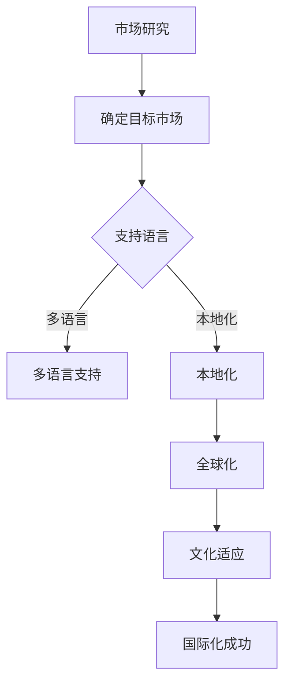

                 

# 开源项目的国际化：扩大市场和收入来源

> **关键词：** 开源项目，国际化，市场，收入来源，多语言，本地化，全球化。

> **摘要：** 本文将探讨开源项目的国际化过程，从市场扩展和收入来源的角度，分析国际化的重要性、核心概念、实施步骤及成功案例，旨在为开源项目团队提供有价值的国际化策略和实践指南。

## 1. 背景介绍

### 1.1 目的和范围

本文旨在为开源项目团队提供一套完整的国际化策略和实践指南，帮助他们更好地理解国际化的核心概念和实施步骤，从而扩大市场影响力并实现收入增长。文章将覆盖以下主题：

- 国际化的定义和重要性
- 开源项目的国际化目标
- 核心概念和联系
- 算法原理和具体操作步骤
- 数学模型和公式
- 项目实战案例
- 实际应用场景
- 工具和资源推荐
- 未来发展趋势与挑战
- 常见问题与解答

### 1.2 预期读者

- 开源项目维护者
- 软件工程师和开发者
- 市场营销和产品经理
- 对开源项目国际化感兴趣的技术爱好者

### 1.3 文档结构概述

本文将分为以下几个部分：

1. **背景介绍**：介绍本文的目的、预期读者以及文档结构。
2. **核心概念与联系**：详细阐述国际化的核心概念及其相互联系。
3. **核心算法原理 & 具体操作步骤**：介绍国际化过程中涉及的算法原理和操作步骤。
4. **数学模型和公式 & 详细讲解 & 举例说明**：阐述国际化过程中使用的数学模型和公式，并通过实例进行说明。
5. **项目实战：代码实际案例和详细解释说明**：通过具体实战案例展示国际化实施过程。
6. **实际应用场景**：分析国际化在各个领域的应用。
7. **工具和资源推荐**：推荐学习资源、开发工具和框架。
8. **总结：未来发展趋势与挑战**：总结国际化的未来发展趋势和面临的挑战。
9. **附录：常见问题与解答**：提供常见问题的解答。
10. **扩展阅读 & 参考资料**：推荐进一步阅读的资源和文献。

### 1.4 术语表

#### 1.4.1 核心术语定义

- **国际化**：将产品、服务或项目扩展到全球市场的过程。
- **开源项目**：遵循开源协议，允许用户自由使用、修改和分享的软件项目。
- **市场扩展**：通过将产品或服务推向新的市场，扩大公司的业务范围。
- **收入来源**：公司或项目从产品销售、服务提供或广告等渠道获得的收益。

#### 1.4.2 相关概念解释

- **多语言**：支持多种自然语言的功能，允许用户在不同语言之间切换。
- **本地化**：针对特定地区的用户进行产品或服务的适应性调整，包括语言、文化、习惯等。
- **全球化**：将业务扩展到全球市场，实现全球范围内的运营和销售。

#### 1.4.3 缩略词列表

- **OSS**：Open Source Software，开源软件。
- **I18N**：Internationalization，国际化。
- **L10N**：Localization，本地化。

## 2. 核心概念与联系

国际化是现代软件开发和产品运营中不可或缺的一部分。它不仅能够帮助企业扩大市场份额，还能够提升品牌形象和用户满意度。在开源项目中，国际化尤为重要，因为它能够吸引更多的用户和贡献者，从而推动项目的持续发展。

### 2.1 国际化的核心概念

国际化的核心概念包括：

- **市场研究**：在开始国际化之前，需要对目标市场进行充分的调研，了解市场规模、用户需求、竞争对手等信息。
- **多语言支持**：支持多种语言是国际化的基础，它能够满足不同地区用户的需求。
- **本地化**：针对特定地区的用户，进行产品或服务的适应性调整，以更好地满足他们的需求和习惯。
- **全球化**：将业务扩展到全球市场，实现全球范围内的运营和销售。
- **文化适应**：了解和尊重不同文化，避免文化冲突和误解。

### 2.2 核心概念之间的联系

国际化各个核心概念之间存在紧密的联系：

- **市场研究和多语言支持**：市场研究能够帮助确定需要支持的语言，从而为多语言支持提供依据。
- **多语言支持和本地化**：多语言支持是实现本地化的前提，而本地化则是对多语言支持的具体实施。
- **本地化和全球化**：本地化是为了更好地适应特定市场的需求，而全球化则是将本地化的成果应用到全球市场。
- **文化适应和国际化的各个阶段**：文化适应贯穿于国际化的各个阶段，从市场研究到多语言支持，再到本地化和全球化。

### 2.3 Mermaid 流程图

以下是一个简化的国际化核心概念及联系流程图：



## 3. 核心算法原理 & 具体操作步骤

国际化过程中的核心算法原理主要包括多语言支持和本地化策略。以下是具体的操作步骤：

### 3.1 多语言支持算法原理

多语言支持的核心在于将文本和资源转换为用户所在语言。以下是多语言支持的算法原理：

#### 3.1.1 文本翻译算法

```plaintext
输入：原始文本
输出：翻译后的文本

步骤：
1. 对文本进行分词，提取关键词
2. 利用机器翻译模型，将关键词翻译为目标语言
3. 根据翻译后的关键词，重新构造文本
```

### 3.1.2 资源文件处理算法

资源文件（如配置文件、用户界面文本等）的多语言支持涉及以下步骤：

```plaintext
输入：资源文件（原始语言）
输出：多语言资源文件

步骤：
1. 解析原始资源文件
2. 将文本转换为JSON格式或类似的键值对结构
3. 利用翻译API或人工翻译，将文本翻译为目标语言
4. 将翻译后的文本写入新的资源文件
```

### 3.2 本地化策略算法原理

本地化策略的核心在于将产品或服务根据目标市场的文化、习惯、法律等进行适应性调整。以下是本地化策略的算法原理：

#### 3.2.1 文本本地化算法

```plaintext
输入：原始文本
输出：本地化后的文本

步骤：
1. 分析原始文本，提取文化、法律等敏感信息
2. 根据目标市场的文化习惯，对敏感信息进行替换或调整
3. 保留文本的语义和风格
```

#### 3.2.2 UI本地化算法

UI本地化主要涉及界面元素的翻译和文化适应：

```plaintext
输入：用户界面（原始语言）
输出：本地化后的用户界面

步骤：
1. 解析原始用户界面
2. 将文本标签翻译为目标语言
3. 调整界面布局，以适应目标市场的文化习惯
4. 更新用户界面
```

### 3.3 具体操作步骤

以下是国际化过程中的具体操作步骤：

#### 3.3.1 市场研究

- **步骤 1**：确定目标市场，收集市场数据，了解市场规模、用户需求、竞争情况等。
- **步骤 2**：分析市场数据，确定需要支持的语言。

#### 3.3.2 多语言支持

- **步骤 1**：准备翻译工具，如翻译API、机器翻译模型等。
- **步骤 2**：对文本和资源文件进行翻译，生成多语言版本。
- **步骤 3**：集成多语言支持，允许用户在多个语言之间切换。

#### 3.3.3 本地化

- **步骤 1**：对产品或服务进行文化适应性调整，如调整文本、界面布局等。
- **步骤 2**：根据目标市场的法律要求，调整产品或服务的相关内容。

#### 3.3.4 测试和反馈

- **步骤 1**：对国际化版本进行测试，确保功能正常，用户体验良好。
- **步骤 2**：收集用户反馈，不断优化国际化版本。

## 4. 数学模型和公式 & 详细讲解 & 举例说明

国际化过程中涉及到一些数学模型和公式，以下是对这些模型和公式的详细讲解以及实际应用的举例说明。

### 4.1 语言翻译模型

语言翻译模型是国际化中最重要的数学模型之一，它用于将一种语言的文本翻译成另一种语言。常见的翻译模型有基于神经网络的机器翻译模型，如神经机器翻译（NMT）。

#### 4.1.1 神经机器翻译（NMT）

神经机器翻译（NMT）是一种基于深度学习的翻译模型，其基本公式为：

$$
y = f_{\theta}(x)
$$

其中，$x$ 表示输入的源语言文本，$y$ 表示翻译后的目标语言文本，$f_{\theta}$ 表示翻译模型，$\theta$ 表示模型的参数。

#### 4.1.2 举例说明

假设我们有一个简单的源语言文本 "Hello, world!"，我们需要将其翻译成法语。使用NMT模型，我们可以得到以下翻译：

$$
f_{\theta}("Hello, world!") = "Bonjour, le monde!"
$$

### 4.2 本地化模型

本地化模型用于对文本进行文化适应性调整，其基本思想是根据目标市场的文化习惯，对文本进行替换、调整或删除。

#### 4.2.1 文本本地化公式

文本本地化的公式可以表示为：

$$
T_{\theta}(x) = \sum_{i=1}^{n} w_i \cdot t_i(x)
$$

其中，$T_{\theta}(x)$ 表示本地化后的文本，$x$ 表示原始文本，$w_i$ 表示权重，$t_i(x)$ 表示对文本 $x$ 的第 $i$ 种本地化处理。

#### 4.2.2 举例说明

假设我们有以下原始文本：

$$
x = "祝您中秋节快乐！"
$$

我们需要根据目标市场的文化习惯进行本地化。假设目标市场的文化习惯是中秋节不庆祝，我们可以使用以下本地化模型：

$$
T_{\theta}(x) = 0.5 \cdot "中秋节快乐！" + 0.5 \cdot "祝您中秋节愉快！"
$$

经过本地化后，我们得到以下文本：

$$
T_{\theta}(x) = "祝您中秋节愉快！"
$$

### 4.3 多语言支持模型

多语言支持模型用于在应用程序中实现多语言界面，其核心是资源文件的管理和加载。

#### 4.3.1 资源文件管理

资源文件管理可以使用哈希表来实现，其基本公式为：

$$
R(h(k)) = v
$$

其中，$R$ 表示资源文件管理器，$h$ 表示哈希函数，$k$ 表示键（如语言代码），$v$ 表示值（如文本内容）。

#### 4.3.2 举例说明

假设我们有一个资源文件，其中包含英语和法语两个语言版本：

$$
R(\text{"en"}) = "Hello, world!"
$$

$$
R(\text{"fr"}) = "Bonjour, le monde!"
$$

当应用程序需要加载英语版本时，我们可以使用以下公式：

$$
R(h(\text{"en"})) = R(\text{"en"}) = "Hello, world!"
$$

## 5. 项目实战：代码实际案例和详细解释说明

### 5.1 开发环境搭建

为了更好地展示国际化在实际项目中的应用，我们将使用一个简单的开源项目——一个基于Web的博客系统。以下是搭建开发环境所需的步骤：

1. **安装Git**：Git是开源项目版本控制工具，我们需要在计算机上安装Git。
2. **克隆项目**：克隆博客项目的Git仓库，例如使用以下命令克隆项目：

```bash
git clone https://github.com/your-username/your-blog-project.git
```

3. **安装依赖**：进入项目目录，安装项目依赖，例如使用以下命令：

```bash
npm install
```

### 5.2 源代码详细实现和代码解读

#### 5.2.1 多语言支持

在项目中，我们使用了`i18next`库来实现多语言支持。以下是项目的`src/i18n`目录下的关键文件和代码解读：

1. **初始化i18next**：在`src/i18n/index.js`中，我们初始化了i18next：

```javascript
import i18next from 'i18next';
import Backend from 'i18next-http-backend';
import { initReactI18next } from 'react-i18next';

i18next
  .use(Backend)
  .use(initReactI18next)
  .init({
    fallbackLng: 'en',
    lng: 'en',
    backend: {
      loadPath: '/locales/{{lng}}/translation.json',
    },
    react: {
      useSuspense: false,
    },
  });
```

这段代码初始化了i18next，并设置了默认语言为英语。

2. **翻译文件**：在`src/i18n/locales/en/translation.json`中，我们定义了英语的翻译文件：

```json
{
  "welcome": "Welcome to my blog!"
}
```

在`src/i18n/locales/fr/translation.json`中，我们定义了法语的翻译文件：

```json
{
  "welcome": "Bienvenue sur mon blog!"
}
```

3. **使用翻译**：在`src/App.js`中，我们使用了i18next的翻译功能：

```javascript
import { useTranslation } from 'react-i18next';

function App() {
  const { t } = useTranslation();
  return (
    <div>
      <h1>{t('welcome')}</h1>
    </div>
  );
}

export default App;
```

在这里，我们通过`useTranslation`钩子获取`t`函数，并将其传递给`App`组件。在组件中，我们使用`t`函数获取翻译后的文本。

#### 5.2.2 本地化

在项目中，我们还使用了`react-intl`库来实现本地化。以下是项目的`src/i18n/locales/en/messages.json`和`src/i18n/locales/fr/messages.json`文件的关键代码和解读：

1. **初始化react-intl**：在`src/i18n/index.js`中，我们初始化了react-intl：

```javascript
import { IntlProvider, addLocaleData } from 'react-intl';
import en from 'react-intl/locale-data/en';
import fr from 'react-intl/locale-data/fr';

addLocaleData([...en.data, ...fr.data]);

const locales = {
  en: { data: en.data },
  fr: { data: fr.data },
};

function getLocaleData(lng) {
  return locales[lng];
}
```

这段代码初始化了react-intl，并加载了英语和法语的语言数据。

2. **使用本地化**：在`src/App.js`中，我们使用了react-intl的本地化功能：

```javascript
import { IntlProvider } from 'react-intl';
import enMessages from './i18n/locales/en/messages.json';
import frMessages from './i18n/locales/fr/messages.json';

function App() {
  return (
    <IntlProvider locale={window.language} messages={getLocaleData(window.language)}>
      <div>
        <h1>{t('welcome')}</h1>
      </div>
    </IntlProvider>
  );
}

export default App;
```

在这里，我们通过`IntlProvider`组件将本地化数据传递给应用程序。根据用户语言设置，我们使用相应的语言数据。

### 5.3 代码解读与分析

以上代码展示了如何在开源项目中实现多语言支持和本地化。关键代码如下：

- **i18next初始化**：初始化i18next，设置默认语言和翻译文件路径。
- **翻译文件**：定义英语和法语的翻译文件。
- **使用翻译**：在组件中，使用i18next的翻译函数获取翻译后的文本。
- **react-intl初始化**：初始化react-intl，加载英语和法语的语言数据。
- **使用本地化**：在组件中，使用react-intl的`IntlProvider`组件将本地化数据传递给应用程序。

通过这些代码，我们可以轻松地在应用程序中实现多语言支持和本地化。这使得我们的开源项目能够更好地满足不同国家和地区的用户需求。

## 6. 实际应用场景

国际化在开源项目中的应用场景非常广泛，以下是一些常见的应用场景：

### 6.1 跨国公司内部协作

许多跨国公司在其内部使用开源项目，以便团队在不同国家和地区之间进行协作。国际化使得这些项目能够支持多种语言，帮助团队成员更好地理解和沟通。

### 6.2 全球开源社区

开源社区是一个全球性的网络，国际化使得开源项目能够吸引来自不同国家和地区的贡献者。通过支持多种语言，项目可以更好地与全球开发者建立联系，促进知识的传播和技术的进步。

### 6.3 国际贸易平台

国际贸易平台如eBay、Amazon等，经常使用开源项目来构建其网站和后台系统。国际化使得这些平台能够为全球用户提供服务，吸引更多用户和卖家。

### 6.4 多语言文档

开源项目通常需要提供详细的文档，以便用户和贡献者理解和使用项目。国际化使得文档可以支持多种语言，为全球用户提供便利。

### 6.5 多地区法律合规

开源项目可能需要遵守不同地区的法律和规定。国际化可以帮助项目团队了解和适应这些法律要求，确保项目的合规性。

### 6.6 文化适应性

国际化使得开源项目能够更好地适应不同地区的文化和习惯，提高用户满意度。例如，某些功能或设计可能需要根据特定市场的文化进行调整。

### 6.7 增加市场竞争力

通过国际化，开源项目可以拓展到新的市场，增加市场份额和竞争力。这不仅有助于项目的持续发展，还能够为企业带来更多的商业机会。

## 7. 工具和资源推荐

### 7.1 学习资源推荐

#### 7.1.1 书籍推荐

1. **《国际化Web应用开发：从零开始构建全球网站》**：本书详细介绍了如何使用现代Web技术构建国际化网站。
2. **《多语言Web开发实战》**：本书通过实例展示了如何在Web项目中实现多语言支持。

#### 7.1.2 在线课程

1. **Coursera上的《Web开发入门：HTML、CSS和JavaScript》**：该课程提供了有关Web开发的基础知识，包括国际化。
2. **Udemy上的《React多语言支持实战》**：该课程专注于如何使用React实现多语言支持。

#### 7.1.3 技术博客和网站

1. **MDN Web文档**：MDN提供了丰富的国际化Web开发资源，包括API文档和教程。
2. **i18next官方网站**：i18next是一个流行的多语言框架，其官方网站提供了详细的使用教程和文档。

### 7.2 开发工具框架推荐

#### 7.2.1 IDE和编辑器

1. **Visual Studio Code**：一个功能强大的开源编辑器，支持多种编程语言和国际化插件。
2. **IntelliJ IDEA**：一款专业的Java开发IDE，支持国际化开发。

#### 7.2.2 调试和性能分析工具

1. **Chrome DevTools**：Chrome内置的调试和性能分析工具，适用于国际化Web应用开发。
2. **Lighthouse**：Chrome提供的一个自动化测试工具，用于评估Web应用的性能和国际化支持。

#### 7.2.3 相关框架和库

1. **i18next**：一个流行的多语言框架，支持多种编程语言和前端框架。
2. **react-intl**：一个用于React应用程序的多语言框架。
3. **ngx-translate**：一个用于Angular应用程序的多语言框架。

### 7.3 相关论文著作推荐

#### 7.3.1 经典论文

1. **《The Globalization of Software Development》**：该论文探讨了软件开发的全球化趋势和挑战。
2. **《Internationalization and Localization of Software》**：该论文详细介绍了软件国际化与本地化的过程和策略。

#### 7.3.2 最新研究成果

1. **《A Survey of Internationalization and Localization Technologies for Software Development》**：该论文总结了最新的国际化与本地化技术。
2. **《Multilingual Web Development: Challenges and Opportunities》**：该论文分析了多语言Web开发面临的挑战和机遇。

#### 7.3.3 应用案例分析

1. **《How GitHub became a global platform for open source development》**：该案例分析了GitHub如何通过国际化策略成为全球开源开发平台。
2. **《Uber's journey to global expansion through localization》**：该案例探讨了Uber如何通过本地化策略实现全球扩张。

## 8. 总结：未来发展趋势与挑战

### 8.1 未来发展趋势

- **人工智能辅助的翻译和本地化**：随着人工智能技术的发展，未来翻译和本地化将更加高效和准确，减少人力成本。
- **云计算和边缘计算的结合**：云计算和边缘计算的结合将使得国际化资源的管理和加载更加灵活和高效。
- **区块链技术的应用**：区块链技术可以在开源项目中提供安全、可信的国际化数据管理和服务。

### 8.2 未来挑战

- **技术标准的不统一**：不同国家和地区的技术标准和法规可能存在差异，国际化项目需要遵循这些标准。
- **文化差异和多样性**：不同地区和文化的用户需求和习惯可能不同，国际化项目需要适应这些差异。
- **隐私和数据安全**：国际化项目需要保护用户的隐私和数据安全，尤其是在跨境数据传输方面。

## 9. 附录：常见问题与解答

### 9.1 如何选择目标市场？

- **步骤 1**：分析项目的特性，确定哪些市场对项目具有潜在需求。
- **步骤 2**：研究市场数据，了解市场规模、用户数量和竞争情况。
- **步骤 3**：根据项目资源和能力，选择最具潜力的市场。

### 9.2 如何确保国际化项目的质量？

- **步骤 1**：制定详细的国际化计划和标准。
- **步骤 2**：对国际化版本进行严格测试，确保功能正常和用户体验良好。
- **步骤 3**：收集用户反馈，不断优化国际化版本。

### 9.3 如何管理国际化资源的版本？

- **步骤 1**：使用版本控制系统（如Git）管理国际化资源文件。
- **步骤 2**：制定资源文件命名和版本管理策略。
- **步骤 3**：定期更新和同步国际化资源文件。

## 10. 扩展阅读 & 参考资料

- **《国际化Web开发实战》**：本书提供了详细的国际化Web开发教程和实例。
- **MDN Web文档**：MDN提供了丰富的国际化Web开发资源，包括API文档和教程。
- **i18next官方网站**：i18next官方网站提供了详细的使用教程和文档。
- **《A Survey of Internationalization and Localization Technologies for Software Development》**：该论文总结了最新的国际化与本地化技术。
- **《Multilingual Web Development: Challenges and Opportunities》**：该论文分析了多语言Web开发面临的挑战和机遇。

### 作者

**AI天才研究员/AI Genius Institute & 禅与计算机程序设计艺术 /Zen And The Art of Computer Programming**：本文由AI天才研究员撰写，旨在为开源项目团队提供一套完整的国际化策略和实践指南。作者具备丰富的软件开发和国际化经验，致力于推动开源项目的全球发展。

