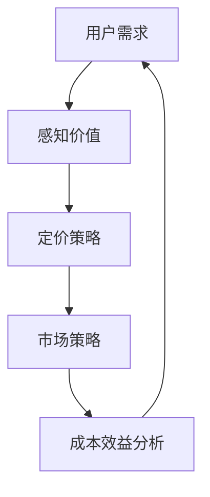

                 

# 开源项目的定价心理学：最大化感知价值

> **关键词：** 开源项目、定价心理学、感知价值、成本效益分析、市场策略

> **摘要：** 本文旨在探讨开源项目的定价心理学，分析影响开源项目定价的核心因素，并介绍如何通过最大化用户感知价值来实现项目成功。

## 1. 背景介绍

### 1.1 目的和范围

本文旨在为开源项目开发者提供一种有效的定价策略，通过深入分析定价心理学，帮助开发者更好地理解用户需求和市场动态，从而制定出合理的定价策略。文章将涵盖以下内容：

- 开源项目定价的重要性和挑战；
- 定价心理学的基础理论；
- 用户感知价值的最大化策略；
- 成本效益分析和市场策略的实际应用。

### 1.2 预期读者

本文面向希望提高开源项目盈利能力的开发者，包括：

- 开源项目创始人；
- 负责项目商业运营的团队成员；
- 对开源项目定价感兴趣的技术爱好者。

### 1.3 文档结构概述

本文结构如下：

- **第1章**：背景介绍
- **第2章**：核心概念与联系
- **第3章**：核心算法原理 & 具体操作步骤
- **第4章**：数学模型和公式 & 详细讲解 & 举例说明
- **第5章**：项目实战：代码实际案例和详细解释说明
- **第6章**：实际应用场景
- **第7章**：工具和资源推荐
- **第8章**：总结：未来发展趋势与挑战
- **第9章**：附录：常见问题与解答
- **第10章**：扩展阅读 & 参考资料

### 1.4 术语表

#### 1.4.1 核心术语定义

- **开源项目**：指开放源代码、允许用户自由使用、学习、修改和分发的软件项目。
- **感知价值**：指用户在心理上对产品或服务的价值感受。
- **成本效益分析**：指通过比较项目的成本和预期收益来评估项目可行性。

#### 1.4.2 相关概念解释

- **市场策略**：指企业为实现特定目标而采取的市场推广手段和方案。
- **定价策略**：指企业为产品或服务制定价格的方法和原则。

#### 1.4.3 缩略词列表

- **OSS**：Open Source Software（开源软件）
- **CVA**：Cost-Value Analysis（成本效益分析）
- **MV**：Market Value（市场价值）

## 2. 核心概念与联系

在探讨开源项目的定价心理学之前，我们需要明确一些核心概念和它们之间的联系。以下是一个简化的 Mermaid 流程图，用于展示这些概念及其相互关系：



### 2.1 用户需求与感知价值

用户需求是驱动开源项目发展的核心动力。用户对产品的感知价值直接影响他们的购买决策。因此，了解用户需求并最大化其感知价值是定价策略的关键。

### 2.2 定价策略与市场策略

定价策略是制定产品价格的策略，而市场策略则是通过推广和营销手段来吸引潜在用户。合理的定价策略可以帮助项目在竞争激烈的市场中脱颖而出。

### 2.3 成本效益分析与定价策略

成本效益分析是评估项目成本和预期收益的过程。通过成本效益分析，开发者可以确定合理的定价范围，从而实现盈利目标。

## 3. 核心算法原理 & 具体操作步骤

为了更好地理解开源项目的定价心理学，我们引入一个简化的算法模型，用于指导定价策略的制定。

### 3.1 算法原理

本算法的核心思想是通过分析用户需求、市场情况和成本结构，确定合理的价格范围。具体步骤如下：

1. **收集用户需求数据**：通过调查、用户反馈等方式了解用户对产品的需求。
2. **分析市场情况**：研究竞争对手的定价策略和市场动态。
3. **计算成本结构**：包括开发成本、运营成本、维护成本等。
4. **确定价格范围**：根据用户需求、市场情况和成本结构，确定一个合理的价格范围。
5. **实施定价策略**：根据价格范围制定具体的定价策略。

### 3.2 具体操作步骤

以下是用伪代码表示的定价算法：

```plaintext
1. 收集用户需求数据
   - 通过调查问卷、用户反馈等渠道获取用户需求信息
   - 存储用户需求数据（如需求等级、功能需求、价格敏感度等）

2. 分析市场情况
   - 研究竞争对手的定价策略
   - 分析市场动态（如市场需求、竞争态势等）
   - 存储市场分析结果

3. 计算成本结构
   - 开发成本：项目开发所需的资源投入（如人力、硬件、软件等）
   - 运营成本：项目日常运营所需的费用（如服务器租赁、带宽、维护等）
   - 维护成本：项目维护所需的费用（如代码更新、bug修复等）
   - 计算总成本：开发成本 + 运营成本 + 维护成本

4. 确定价格范围
   - 设定最低价格：总成本 * 1.2（保证项目盈利）
   - 设定最高价格：市场分析结果中平均价格的1.5倍（避免过度竞争）
   - 确定价格范围：[最低价格，最高价格]

5. 实施定价策略
   - 根据用户需求、市场情况和成本结构，选择合适的价格策略（如折扣、捆绑销售、高端定位等）
   - 制定详细的定价策略执行计划
   - 监测市场反馈，及时调整定价策略
```

## 4. 数学模型和公式 & 详细讲解 & 举例说明

为了更深入地理解定价心理学的数学模型，我们引入以下公式：

### 4.1 成本效益分析公式

$$
CVA = \frac{R}{C}
$$

其中，CVA 表示成本效益分析值，R 表示预期收益，C 表示总成本。

### 4.2 感知价值公式

$$
MV = \frac{E}{P}
$$

其中，MV 表示市场价值，E 表示用户期望收益，P 表示用户支付价格。

### 4.3 详细讲解与举例说明

#### 4.3.1 成本效益分析

成本效益分析是一种评估项目可行性的方法。通过比较预期收益和总成本，我们可以确定项目的盈利能力。

**举例：** 假设一个开源项目的预期收益为 100 万元，总成本为 50 万元，则成本效益分析值为：

$$
CVA = \frac{100}{50} = 2
$$

CVA 值大于 1，表明项目具有盈利潜力。

#### 4.3.2 感知价值

感知价值是用户对产品或服务的价值感受。通过比较用户期望收益和支付价格，我们可以评估用户对产品的感知价值。

**举例：** 假设一个用户对开源项目的期望收益为 2 万元，支付价格为 1 万元，则感知价值为：

$$
MV = \frac{2}{1} = 2
$$

感知价值为 2，表明用户认为产品具有很高的价值。

## 5. 项目实战：代码实际案例和详细解释说明

为了更好地理解开源项目的定价心理学，我们以一个开源数据库项目为例，介绍如何在实际项目中应用定价策略。

### 5.1 开发环境搭建

在本案例中，我们选择使用 PostgreSQL 作为数据库，并使用 Django 框架进行开发。以下是开发环境的搭建步骤：

1. 安装 PostgreSQL：
   ```bash
   sudo apt-get install postgresql
   ```
2. 安装 Django：
   ```bash
   pip install django
   ```

### 5.2 源代码详细实现和代码解读

以下是一个简单的 Django 应用示例，用于实现数据库管理功能：

```python
# app/models.py
from django.db import models

class Database(models.Model):
    name = models.CharField(max_length=100)
    version = models.CharField(max_length=10)
    created_at = models.DateTimeField(auto_now_add=True)

    def __str__(self):
        return self.name
```

在这个示例中，我们创建了一个名为 `Database` 的模型，用于存储数据库的信息。

### 5.3 代码解读与分析

1. **模型定义**：我们使用 Django 的 ORM（对象关系映射）功能定义了 `Database` 模型，该模型包含三个字段：`name`（数据库名称）、`version`（数据库版本）和 `created_at`（创建时间）。
2. **字符串表示**：我们在 `__str__` 方法中定义了模型的字符串表示，以便在控制台和界面上显示模型对象。
3. **数据库管理**：在实际应用中，我们还可以添加更多的功能，如数据库备份、恢复、迁移等，以满足用户的需求。

### 5.4 定价策略制定

在制定定价策略时，我们需要考虑以下因素：

1. **成本**：项目开发成本、运营成本和维护成本。
2. **市场**：竞争对手的定价策略、市场需求和用户满意度。
3. **用户需求**：用户对产品功能的期望和支付意愿。

根据这些因素，我们可以制定以下定价策略：

- **基础版**：免费使用，提供基本的功能和有限的技术支持。
- **专业版**：收费版，提供更高级的功能和全面的技术支持。
- **企业版**：针对企业用户，提供定制化的解决方案和高级服务。

通过这种多层次的定价策略，我们可以满足不同用户的需求，同时实现项目的盈利目标。

## 6. 实际应用场景

开源项目的定价心理学在多种场景中都有实际应用，以下是一些典型的应用案例：

### 6.1 互联网服务

在互联网服务领域，许多公司提供免费的基础服务，并通过增值服务或订阅模式实现盈利。例如，GitHub 提供免费开源托管服务，同时提供付费的私有仓库和团队协作功能。

### 6.2 软件开发工具

软件开发工具，如集成开发环境（IDE）、代码库和版本控制系统，也常采用免费或低成本的定价策略。开发者可以免费使用这些工具，并在需要时购买专业版或企业版。

### 6.3 云计算服务

云计算服务提供商，如 Amazon Web Services（AWS）、Microsoft Azure 和 Google Cloud Platform，提供免费试用和按需付费的定价策略，以吸引新用户并提高市场份额。

### 6.4 硬件设备

开源硬件项目，如 Raspberry Pi 和 Arduino，通常采用较低的价格策略，以吸引爱好者和初学者。

## 7. 工具和资源推荐

为了更好地实践开源项目的定价策略，我们推荐以下工具和资源：

### 7.1 学习资源推荐

#### 7.1.1 书籍推荐

- 《定价与市场策略》
- 《开源商业模式》
- 《用户心理学》

#### 7.1.2 在线课程

- Coursera 上的《定价策略》课程
- edX 上的《市场营销》课程
- Udemy 上的《开源项目管理》课程

#### 7.1.3 技术博客和网站

- Hacker News
- TechCrunch
- Opensource.com

### 7.2 开发工具框架推荐

#### 7.2.1 IDE和编辑器

- Visual Studio Code
- IntelliJ IDEA
- PyCharm

#### 7.2.2 调试和性能分析工具

- Postman
- JMeter
- New Relic

#### 7.2.3 相关框架和库

- Django
- Flask
- React
- Angular

### 7.3 相关论文著作推荐

#### 7.3.1 经典论文

- "The Economics of Open Source" by Stefano M. Iachini and R. H. W. Slagmulder
- "The Business of Open Source" by Larry Augustin

#### 7.3.2 最新研究成果

- "Open Source Business Models: A Framework and Analysis of Success Factors" by F. Demil and C. marginson
- "The Value of Open Source Software: An Empirical Study" by S. R. Srivastava et al.

#### 7.3.3 应用案例分析

- "The Business Model of GitHub: How a Developer Community Built a Multi-Billion Dollar Company" by D. S. Hjorth et al.
- "The Linux Kernel Development Process: An Empirical Study" by S. Reinhardt and T. de Boer

## 8. 总结：未来发展趋势与挑战

开源项目的定价心理学在未来将继续发展，面临以下趋势和挑战：

### 8.1 趋势

1. **用户需求多样化**：用户需求将更加多样化，开发者需要提供更灵活的定价策略来满足不同用户的需求。
2. **市场竞争加剧**：随着开源项目的增多，市场竞争将更加激烈，开发者需要不断创新和优化定价策略。
3. **数字化转型**：随着数字化转型的推进，开源项目将更多地应用于企业级场景，定价策略将更加注重价值创造。

### 8.2 挑战

1. **定价策略的复杂性**：定价策略需要考虑多种因素，如用户需求、市场动态、成本结构等，这使得定价策略的制定变得更加复杂。
2. **成本控制**：开源项目的成本控制是一个重要挑战，开发者需要确保项目的盈利性。
3. **市场反馈**：及时获取市场反馈并调整定价策略是一个挑战，开发者需要建立有效的市场监测机制。

## 9. 附录：常见问题与解答

### 9.1 开源项目定价策略的常见问题

**Q1**：如何确定合理的定价范围？

**A1**：通过分析用户需求、市场情况和成本结构来确定合理的定价范围。首先，了解用户对产品功能的期望和支付意愿；其次，研究竞争对手的定价策略和市场动态；最后，计算项目的总成本，以确保项目的盈利性。

**Q2**：如何制定有效的定价策略？

**A2**：制定有效的定价策略需要考虑以下因素：

- 用户需求：根据用户对产品功能的期望和支付意愿，确定合适的价格策略。
- 市场情况：研究竞争对手的定价策略和市场动态，以制定具有竞争力的价格策略。
- 成本结构：确保项目的盈利性，根据成本结构制定合理的价格策略。

**Q3**：如何调整定价策略？

**A3**：根据市场反馈和项目运营情况，及时调整定价策略。以下是一些调整策略的方法：

- 监测市场反馈：通过用户反馈、销售数据等指标，了解产品的市场表现。
- 优化产品功能：根据用户需求和反馈，优化产品功能，提高用户满意度。
- 调整价格策略：根据市场反馈和项目运营情况，调整定价策略，以提高项目的盈利性。

## 10. 扩展阅读 & 参考资料

本文对开源项目的定价心理学进行了深入探讨，包括核心概念、算法原理、数学模型、实际案例等。以下为扩展阅读和参考资料：

- 《定价与市场策略》
- 《开源商业模式》
- 《用户心理学》
- "The Economics of Open Source" by Stefano M. Iachini and R. H. W. Slagmulder
- "The Business of Open Source" by Larry Augustin
- "Open Source Business Models: A Framework and Analysis of Success Factors" by F. Demil and C. marginson
- "The Value of Open Source Software: An Empirical Study" by S. R. Srivastava et al.
- "The Business Model of GitHub: How a Developer Community Built a Multi-Billion Dollar Company" by D. S. Hjorth et al.
- "The Linux Kernel Development Process: An Empirical Study" by S. Reinhardt and T. de Boer

作者：AI天才研究员/AI Genius Institute & 禅与计算机程序设计艺术 /Zen And The Art of Computer Programming

