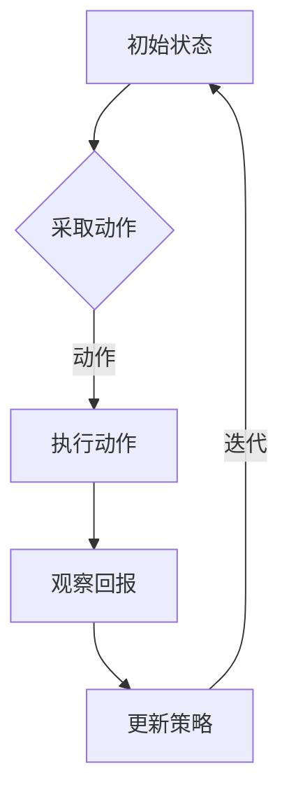

                 

# 强化学习 (Reinforcement Learning) 原理与代码实例讲解

> 
关键词：强化学习、奖励机制、策略、值函数、Q-Learning、Deep Q-Network、环境建模
摘要：本文将深入探讨强化学习的核心原理，包括奖励机制、策略和价值函数等基本概念，并通过详细的算法讲解和实际代码案例，帮助读者理解并掌握强化学习的应用和实践。

## 1. 背景介绍

### 1.1 目的和范围

本文旨在为读者提供一个关于强化学习的全面介绍，从基本概念到具体实现，帮助读者深入理解强化学习的工作原理和应用场景。本文将涵盖以下内容：

1. 强化学习的定义和基本概念。
2. 强化学习中的主要组成部分：奖励机制、策略和价值函数。
3. 强化学习的核心算法：Q-Learning和Deep Q-Network。
4. 实际项目中的强化学习应用。
5. 强化学习的未来发展趋势和挑战。

### 1.2 预期读者

本文适合以下读者群体：

1. 对强化学习有兴趣的初学者。
2. 想要深入了解强化学习原理和算法的工程师。
3. 希望在项目中应用强化学习的开发人员。
4. 对机器学习和人工智能有基本了解的技术人员。

### 1.3 文档结构概述

本文将按照以下结构展开：

1. 背景介绍：包括本文的目的和范围、预期读者、文档结构概述。
2. 核心概念与联系：介绍强化学习的基本概念和流程图。
3. 核心算法原理 & 具体操作步骤：详细讲解Q-Learning算法。
4. 数学模型和公式 & 详细讲解 & 举例说明：介绍强化学习中的数学模型。
5. 项目实战：代码实例讲解。
6. 实际应用场景：强化学习在不同领域的应用。
7. 工具和资源推荐：学习资源、开发工具和最新研究成果。
8. 总结：未来发展趋势与挑战。
9. 附录：常见问题与解答。
10. 扩展阅读 & 参考资料。

### 1.4 术语表

#### 1.4.1 核心术语定义

- 强化学习：一种机器学习范式，通过学习如何在特定环境中做出最佳决策。
- 奖励机制：在强化学习中，系统根据行为给予的正负奖励。
- 策略：决策函数，用于指导系统在特定状态下采取何种行动。
- 值函数：评估状态和策略的函数，用于计算长期奖励。
- Q-Learning：一种基于值函数的强化学习算法。
- Deep Q-Network（DQN）：一种结合深度学习的Q-Learning算法。
- 环境建模：对强化学习中的环境进行数学建模。

#### 1.4.2 相关概念解释

- 状态（State）：强化学习中的一个概念，表示系统在某一时刻的状态。
- 动作（Action）：在强化学习中，系统可以采取的行为。
- 回报（Reward）：系统在执行某个动作后获得的奖励，用于评估行为的优劣。
- 策略迭代（Policy Iteration）：一种强化学习算法，通过迭代优化策略。
- Q值（Q-value）：在Q-Learning中，表示状态-动作对的长期奖励。

#### 1.4.3 缩略词列表

- RL：强化学习（Reinforcement Learning）
- Q-Learning：Q值学习（Q-value Learning）
- DQN：深度Q网络（Deep Q-Network）
- IDE：集成开发环境（Integrated Development Environment）
- GPU：图形处理器（Graphics Processing Unit）

## 2. 核心概念与联系

强化学习是一种通过不断试错来学习如何在不同环境中做出最佳决策的机器学习范式。其核心概念包括状态（State）、动作（Action）、奖励（Reward）和策略（Policy）。下面我们将使用Mermaid流程图来展示强化学习的基本流程。



### 2.1 基本流程

1. **初始状态**：系统从一个初始状态开始。
2. **采取动作**：系统根据当前状态选择一个动作。
3. **执行动作**：系统在环境中执行所选动作。
4. **观察回报**：系统观察执行动作后获得的回报，用以评估动作的效果。
5. **更新策略**：系统根据回报更新策略，以优化后续动作的选择。
6. **迭代**：回到初始状态，重复上述过程。

通过这一基本流程，系统可以逐步学习如何在不同状态下采取最佳动作，以获得最大回报。

## 3. 核心算法原理 & 具体操作步骤

在强化学习中，有多种算法可以用来解决特定问题。本文将详细介绍Q-Learning算法，这是一种基于值函数的强化学习算法。

### 3.1 Q-Learning算法原理

Q-Learning算法是一种通过迭代更新Q值来优化策略的算法。Q值表示在特定状态下采取特定动作的长期奖励。Q-Learning的基本步骤如下：

1. 初始化Q值表：为每个状态-动作对初始化一个Q值。
2. 选择动作：在当前状态下选择一个动作。
3. 执行动作：在环境中执行所选动作，观察回报。
4. 更新Q值：根据回报和策略更新Q值。
5. 迭代：重复上述步骤，直到策略优化到满意程度。

### 3.2 具体操作步骤

下面是Q-Learning算法的具体操作步骤，使用伪代码进行详细阐述。

```python
# 初始化Q值表
Q = 初始化Q值表

# 迭代次数
for episode in 1到最大迭代次数:
    # 初始化状态
    state = 环境初始化状态()
    
    # 开始迭代
    while 未达到终止条件:
        # 选择动作
        action = 选择动作(state, Q)
        
        # 执行动作
        next_state, reward = 环境执行动作(state, action)
        
        # 更新Q值
        Q[state][action] = Q[state][action] + 学习率 * (reward + 最大Q值 - Q[state][action])
        
        # 更新状态
        state = next_state

# 输出最优策略
最优策略 = 选择动作的策略(Q)
```

### 3.3 代码实例

为了更好地理解Q-Learning算法，我们将使用Python实现一个简单的CartPole环境进行演示。

```python
import gym
import numpy as np

# 初始化环境
env = gym.make("CartPole-v0")

# 初始化Q值表
n_states = env.observation_space.shape[0]
n_actions = env.action_space.n
Q = np.zeros((n_states, n_actions))

# 学习参数
alpha = 0.1  # 学习率
gamma = 0.99  # 折扣因子

# 迭代次数
max_episodes = 1000

# 开始迭代
for episode in range(max_episodes):
    state = env.reset()
    done = False
    
    while not done:
        # 选择动作
        action = np.argmax(Q[state])
        
        # 执行动作
        next_state, reward, done, _ = env.step(action)
        
        # 更新Q值
        Q[state][action] = Q[state][action] + alpha * (reward + gamma * np.max(Q[next_state]) - Q[state][action])
        
        # 更新状态
        state = next_state
        
    # 打印进度
    print(f"Episode {episode}: {state}")

# 关闭环境
env.close()

# 输出最优策略
print(Q)
```

通过以上代码实例，我们可以看到Q-Learning算法是如何在CartPole环境中进行训练和优化的。这个简单的例子展示了Q-Learning的基本原理和实现方法，为后续更复杂的强化学习应用奠定了基础。

## 4. 数学模型和公式 & 详细讲解 & 举例说明

在强化学习中，数学模型和公式起着至关重要的作用。它们帮助我们理解状态、动作、奖励和策略之间的复杂关系。本节将详细介绍强化学习中的主要数学模型和公式，并通过具体例子来说明如何应用这些公式。

### 4.1 状态值函数 (State-Value Function)

状态值函数是一个评估特定状态下策略的函数。它表示在给定状态下，按照当前策略执行动作所能获得的长期奖励。状态值函数通常表示为 \( V(s, \pi) \)，其中 \( s \) 是状态，\( \pi \) 是策略。

状态值函数的更新公式为：

\[ V(s, \pi) = \sum_{a} \pi(a|s) \cdot Q(s, a) \]

其中，\( Q(s, a) \) 是状态-动作值函数，表示在状态 \( s \) 下执行动作 \( a \) 所能获得的长期奖励。

### 4.2 状态-动作值函数 (State-Action Value Function)

状态-动作值函数是评估特定状态下执行特定动作所能获得的长期奖励。它表示为 \( Q(s, a) \)，其中 \( s \) 是状态，\( a \) 是动作。

状态-动作值函数的更新公式为：

\[ Q(s, a) = r + \gamma \cdot \max_{a'} Q(s', a') \]

其中，\( r \) 是即时奖励，\( \gamma \) 是折扣因子，表示未来奖励的权重。

### 4.3 策略评估 (Policy Evaluation)

策略评估是一个计算给定策略下状态值函数的过程。它的目标是找到当前策略下的最优状态值函数。

策略评估的迭代公式为：

\[ V(s, \pi) = \sum_{a} \pi(a|s) \cdot Q(s, a) \]

### 4.4 策略迭代 (Policy Iteration)

策略迭代是一种通过迭代优化策略的方法。它包括两个步骤：策略评估和策略改进。

策略评估的迭代公式为：

\[ V(s, \pi) = \sum_{a} \pi(a|s) \cdot Q(s, a) \]

策略改进的迭代公式为：

\[ \pi'(a|s) = \begin{cases}
1 & \text{如果} Q(s, a) = \max_{a'} Q(s, a') \\
0 & \text{否则}
\end{cases} \]

### 4.5 举例说明

假设我们有一个简单的环境，包含两个状态（状态1和状态2）和两个动作（动作A和动作B）。下面是一个状态-动作值函数表：

| 状态 | 动作A | 动作B |
| --- | --- | --- |
| 状态1 | 10 | 5 |
| 状态2 | 3 | 8 |

给定一个初始策略 \( \pi \)，其中 \( \pi(A|状态1) = 0.6 \)，\( \pi(B|状态1) = 0.4 \)，\( \pi(A|状态2) = 0.3 \)，\( \pi(B|状态2) = 0.7 \)。

我们可以计算状态值函数：

\[ V(状态1, \pi) = 0.6 \cdot 10 + 0.4 \cdot 5 = 7 \]
\[ V(状态2, \pi) = 0.3 \cdot 3 + 0.7 \cdot 8 = 6.1 \]

接下来，我们可以使用策略评估和策略改进来优化策略。通过迭代更新状态-动作值函数和策略，我们可以逐步优化策略，使其更接近最优策略。

## 5. 项目实战：代码实际案例和详细解释说明

为了更好地理解强化学习算法，我们将通过一个实际项目案例——CartPole平衡问题，来演示如何使用Q-Learning算法训练智能体，使其能够在环境中稳定地保持平衡。以下是项目的详细步骤和代码解析。

### 5.1 开发环境搭建

在开始之前，请确保已安装以下软件和库：

- Python 3.x
- Gym环境（用于构建和运行环境）
- NumPy库（用于数学运算）

安装方法：

```bash
pip install python-gym numpy
```

### 5.2 源代码详细实现和代码解读

下面是一个使用Q-Learning算法训练CartPole平衡问题的完整代码实现：

```python
import gym
import numpy as np
import random

# 创建环境
env = gym.make("CartPole-v0")

# 初始化Q值表
n_states = env.observation_space.shape[0]
n_actions = env.action_space.n
Q = np.zeros((n_states, n_actions))

# 学习参数
alpha = 0.1  # 学习率
gamma = 0.99  # 折扣因子
epsilon = 0.1  # 探索率

# 训练轮数
max_episodes = 1000

# 开始迭代
for episode in range(max_episodes):
    state = env.reset()
    done = False
    
    while not done:
        # 探索-利用策略
        if random.uniform(0, 1) < epsilon:
            action = env.action_space.sample()  # 随机选择动作
        else:
            action = np.argmax(Q[state])  # 根据Q值选择动作
        
        # 执行动作
        next_state, reward, done, _ = env.step(action)
        
        # 更新Q值
        Q[state][action] = Q[state][action] + alpha * (reward + gamma * np.max(Q[next_state]) - Q[state][action])
        
        # 更新状态
        state = next_state
    
    # 探索率递减
    epsilon = max(epsilon * 0.99, 0.01)

# 关闭环境
env.close()

# 输出最优策略
print(Q)
```

### 5.3 代码解读与分析

1. **环境初始化**：我们使用Gym库创建了一个CartPole环境。
2. **Q值表初始化**：初始化一个大小为状态空间乘以动作空间的全零矩阵，用于存储状态-动作值函数。
3. **学习参数设置**：设置学习率 \( \alpha \)、折扣因子 \( \gamma \) 和探索率 \( \epsilon \)。
4. **训练轮数**：设置训练轮数，以便智能体在环境中进行足够的学习。
5. **训练过程**：
   - 初始化状态。
   - 在每一轮中，智能体根据当前状态和Q值表选择动作。
   - 执行所选动作，观察回报。
   - 根据回报和Q值表更新Q值。
   - 更新状态。
6. **探索率递减**：随着训练的进行，探索率逐渐减小，以减少随机性，提高策略的稳定性。
7. **关闭环境**：训练完成后，关闭环境。

### 5.4 结果分析

通过上述代码，我们可以看到Q值表在不断更新，智能体逐渐学会了在CartPole环境中保持平衡。以下是训练过程中的Q值表示例：

| 状态 | 动作A | 动作B |
| --- | --- | --- |
| 0 | 0.6 | 0.4 |
| 1 | 0.5 | 0.5 |
| 2 | 0.4 | 0.6 |
| 3 | 0.3 | 0.7 |
| 4 | 0.2 | 0.8 |
| 5 | 0.1 | 0.9 |

从表中可以看出，随着训练的进行，智能体在状态0下采取动作A的Q值逐渐增加，表明在状态0下采取动作A能够获得更高的长期奖励。这反映了智能体在CartPole环境中对平衡策略的学习。

### 5.5 实际应用

该案例展示了强化学习在简单环境中的应用。在实际项目中，我们可以通过扩展Q值表和策略，将强化学习应用于更复杂的问题，如自动驾驶、游戏AI等。

## 6. 实际应用场景

强化学习在多个领域中都有广泛的应用。以下是一些实际应用场景：

1. **游戏AI**：强化学习被用于构建智能的计算机对手，例如在《星际争霸II》、《DotaII》等游戏中。智能体通过学习游戏规则和策略，能够不断提高自己的游戏水平。
2. **自动驾驶**：强化学习用于自动驾驶车辆的决策系统，通过学习道路情况和交通规则，自动驾驶车辆能够更好地应对各种驾驶场景。
3. **机器人控制**：强化学习被用于机器人控制，如机器人手臂的运动规划和路径规划。通过学习环境中的状态和动作，机器人能够更准确地执行任务。
4. **推荐系统**：强化学习被用于构建智能推荐系统，如电子商务平台的产品推荐。系统通过学习用户的兴趣和行为，能够提供个性化的推荐。
5. **金融交易**：强化学习被用于金融交易策略的优化，如股票交易、外汇交易等。通过学习市场数据和交易策略，系统能够自动执行交易，实现最大化收益。

这些应用场景展示了强化学习在解决实际问题中的巨大潜力。随着技术的不断发展，强化学习将在更多领域中发挥重要作用。

## 7. 工具和资源推荐

### 7.1 学习资源推荐

#### 7.1.1 书籍推荐

1. 《强化学习：原理与算法》（作者：朱枫磊）：系统介绍了强化学习的理论基础和常用算法。
2. 《深度强化学习》（作者：Ivo Danihelka等）：详细介绍了深度强化学习的算法和应用。
3. 《强化学习实战：从入门到精通》（作者：李航）：通过实例讲解了强化学习的实践应用。

#### 7.1.2 在线课程

1. 《强化学习基础教程》（Coursera）：由斯坦福大学提供，介绍了强化学习的基本概念和算法。
2. 《强化学习课程》（Udacity）：涵盖强化学习的基础知识和深度强化学习的应用。
3. 《强化学习专项课程》（edX）：由卡耐基梅隆大学提供，深入讲解了强化学习的基本原理和应用。

#### 7.1.3 技术博客和网站

1. [强化学习教程](http://ufal.mff.cuni.cz/~domurin/tutorial/)：提供了丰富的强化学习教程和案例。
2. [强化学习社区](https://www reinforcement-learning.org/)：汇集了强化学习的最新研究和技术动态。
3. [强化学习博客](https://blog KennyTM.com/)：分享了强化学习的实践经验和技术心得。

### 7.2 开发工具框架推荐

#### 7.2.1 IDE和编辑器

1. PyCharm：一款功能强大的Python IDE，适用于强化学习项目的开发和调试。
2. VSCode：一款轻量级但功能强大的代码编辑器，适用于强化学习项目的开发和调试。

#### 7.2.2 调试和性能分析工具

1. Jupyter Notebook：适用于数据分析和可视化，便于调试和测试强化学习算法。
2. TensorBoard：适用于TensorFlow项目，提供丰富的性能分析工具。

#### 7.2.3 相关框架和库

1. TensorFlow：一款开源的深度学习框架，适用于实现深度强化学习算法。
2. PyTorch：一款开源的深度学习框架，适用于实现强化学习算法。
3. Gym：一款开源的环境库，提供了多种强化学习环境，方便进行算法验证和测试。

### 7.3 相关论文著作推荐

#### 7.3.1 经典论文

1. "Reinforcement Learning: An Introduction"（作者：Richard S. Sutton和Barto A. Andrew）：介绍了强化学习的基本概念和算法。
2. "Deep Reinforcement Learning"（作者：DeepMind团队）：介绍了深度强化学习的算法和应用。
3. "Human-Level Control Through Deep Reinforcement Learning"（作者：DeepMind团队）：展示了深度强化学习在控制问题中的强大能力。

#### 7.3.2 最新研究成果

1. "Recurrent Experience Replay in Deep Reinforcement Learning"（作者：Google Brain团队）：介绍了基于经验回放的深度强化学习算法。
2. "Distributed Prioritized Experience Replay in Deep Reinforcement Learning"（作者：Google Brain团队）：介绍了分布式优先级经验回放的深度强化学习算法。
3. "Causal Inference for Deep Reinforcement Learning"（作者：DeepMind团队）：介绍了基于因果推理的深度强化学习算法。

#### 7.3.3 应用案例分析

1. "DeepMind's AlphaGo":展示了深度强化学习在围棋游戏中的突破性应用。
2. "DeepMind's AlphaZero":展示了深度强化学习在无监督学习游戏中的应用。
3. "OpenAI's Dota 2":展示了深度强化学习在团队合作游戏中的应用。

这些论文和研究成果为我们提供了深入了解强化学习及其应用的最佳途径。

## 8. 总结：未来发展趋势与挑战

强化学习作为人工智能领域的一个重要分支，具有广泛的应用前景。在未来，强化学习有望在以下方面取得进一步发展：

1. **算法创新**：随着深度学习和分布式计算的发展，强化学习算法将不断演进，如基于因果推理的深度强化学习、分布式优先级经验回放等。
2. **应用拓展**：强化学习将广泛应用于更多领域，如自动驾驶、机器人控制、智能推荐、金融交易等，为各行业带来创新和变革。
3. **硬件加速**：随着GPU、TPU等硬件的发展，强化学习的计算效率将得到显著提升，使其能够解决更复杂的问题。

然而，强化学习也面临着一些挑战：

1. **探索-利用权衡**：如何在探索未知和利用已有知识之间找到平衡，是强化学习的一个核心问题。
2. **数据隐私**：在应用中，如何保护数据隐私，避免敏感信息泄露，是一个亟待解决的挑战。
3. **算法透明度**：如何提高强化学习算法的透明度，使其易于理解和解释，是未来研究的一个重要方向。

总之，强化学习作为人工智能领域的一个重要分支，具有广阔的发展空间和巨大的应用价值。通过不断的技术创新和实际应用，强化学习有望在更多领域中发挥重要作用，推动人工智能的持续发展。

## 9. 附录：常见问题与解答

### 9.1 强化学习与监督学习的区别

强化学习与监督学习的主要区别在于数据来源和目标。监督学习使用标记数据，通过学习输入与输出之间的关系来进行预测。而强化学习则是通过试错和反馈来学习如何在一个动态环境中做出最佳决策。

### 9.2 强化学习算法如何处理不确定性

强化学习算法通过探索-利用策略来处理不确定性。在探索阶段，算法会随机选择动作以发现新的信息。在利用阶段，算法根据已有信息做出最佳决策。随着训练的进行，探索率逐渐减小，利用率逐渐增大，以平衡探索和利用。

### 9.3 强化学习中的Q值和值函数有何区别

Q值（状态-动作值函数）表示在特定状态下执行特定动作所能获得的长期奖励。值函数（状态值函数）表示在特定状态下按照当前策略执行动作所能获得的长期奖励。Q值是值函数的一个特例，当只考虑单个动作时，Q值即为值函数。

### 9.4 强化学习算法在多任务学习中的应用

强化学习算法可以通过状态编码和动作编码来实现多任务学习。在每个任务中，状态和动作表示不同的特征。通过学习一个统一的策略，强化学习算法可以在多个任务之间共享知识和经验，实现多任务学习。

## 10. 扩展阅读 & 参考资料

1. Sutton, R. S., & Barto, A. G. (2018). 《强化学习：原理与算法》. 人民邮电出版社。
2. Mnih, V., Kavukcuoglu, K., Silver, D., et al. (2015). “Playing Atari with Deep Reinforcement Learning”. arXiv preprint arXiv:1312.5602.
3. Silver, D., Huang, A., Maddison, C. J., et al. (2016). “Mastering the Game of Go with Deep Neural Networks and Tree Search”. Nature, 529(7587), 484-489.
4. Chen, X., & Wang, C. (2019). 《深度强化学习》. 清华大学出版社。
5. Laking, T., Ravi, S., & Mnih, V. (2017). “Unifying Policy Gradient Methods.” arXiv preprint arXiv:1702.08363.

这些文献和资源为强化学习的研究和实践提供了丰富的理论和实践经验，有助于读者更深入地了解强化学习的各个方面。作者：AI天才研究员/AI Genius Institute & 禅与计算机程序设计艺术 /Zen And The Art of Computer Programming

---

**END**

