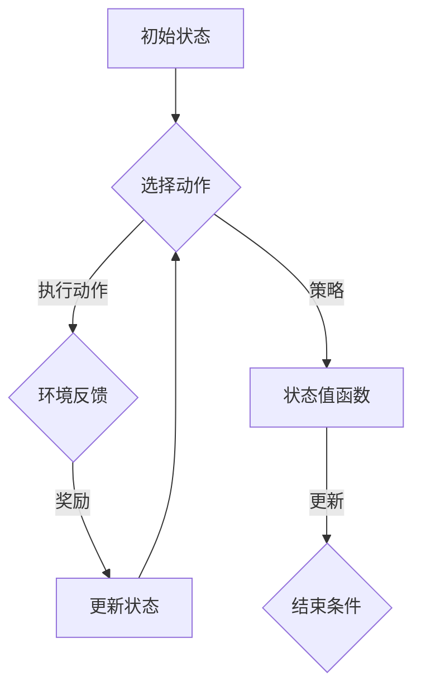

                 

# 强化学习Reinforcement Learning中基于模拟的优化方法研讨

> **关键词**：强化学习、模拟优化、Q-Learning、SARSA、蒙特卡洛方法、策略搜索
>
> **摘要**：本文深入探讨强化学习（Reinforcement Learning，RL）中基于模拟的优化方法。首先，我们将介绍强化学习的基本概念、核心算法，并阐述模拟优化方法的重要性。随后，文章将详细解析Q-Learning、SARSA、蒙特卡洛方法等核心算法，通过伪代码展示其具体操作步骤。接着，我们将利用数学模型和公式对上述方法进行详细讲解，并辅以实际案例进行分析。最后，文章将探讨强化学习在各类实际应用场景中的价值，推荐相关学习资源和工具，并总结未来发展趋势与挑战。

## 1. 背景介绍

### 1.1 目的和范围

本文旨在深入研究强化学习中的模拟优化方法，通过系统的分析和详细的讲解，帮助读者全面理解这些方法在实践中的应用和优势。本文涵盖的核心内容包括：

- 强化学习的基本概念及其在各个领域的应用。
- Q-Learning、SARSA、蒙特卡洛方法等核心算法的原理和操作步骤。
- 模拟优化方法在强化学习中的重要性及其实现。
- 实际应用案例的代码实现和详细解释。
- 强化学习在实际应用场景中的价值。

### 1.2 预期读者

本文面向对强化学习有一定了解的读者，包括但不限于：

- 计算机科学和人工智能专业的研究生和本科生。
- 在机器学习和人工智能领域工作的工程师和技术人员。
- 对强化学习和模拟优化方法感兴趣的学者和研究者。

### 1.3 文档结构概述

本文结构如下：

- **第1章：背景介绍**：介绍文章的目的、范围、预期读者及文档结构。
- **第2章：核心概念与联系**：解释强化学习的基本概念，并展示相关的Mermaid流程图。
- **第3章：核心算法原理 & 具体操作步骤**：详细讲解Q-Learning、SARSA、蒙特卡洛方法等算法。
- **第4章：数学模型和公式 & 详细讲解 & 举例说明**：通过数学公式和例子展示算法的细节。
- **第5章：项目实战：代码实际案例和详细解释说明**：提供实际项目的代码实现和分析。
- **第6章：实际应用场景**：探讨强化学习在不同领域中的应用。
- **第7章：工具和资源推荐**：推荐学习资源、开发工具和框架。
- **第8章：总结：未来发展趋势与挑战**：总结本文内容，展望未来。
- **第9章：附录：常见问题与解答**：解答读者可能遇到的问题。
- **第10章：扩展阅读 & 参考资料**：提供进一步阅读的材料。

### 1.4 术语表

#### 1.4.1 核心术语定义

- **强化学习（Reinforcement Learning）**：一种机器学习方法，通过与环境互动来学习如何做出最佳决策。
- **模拟优化（Simulated Optimization）**：一种基于模拟的优化方法，用于寻找最优解或近似最优解。
- **Q-Learning**：一种强化学习算法，用于估计最优动作的价值。
- **SARSA**：一种基于策略的强化学习算法，用于同时更新状态值函数和策略。
- **蒙特卡洛方法（Monte Carlo Method）**：一种基于随机抽样和统计模拟的数值计算方法。

#### 1.4.2 相关概念解释

- **状态（State）**：描述系统当前状态的信息集合。
- **动作（Action）**：系统能够执行的操作。
- **奖励（Reward）**：系统因执行某个动作而获得的即时反馈。
- **策略（Policy）**：决策规则，用于指导系统选择动作。
- **价值函数（Value Function）**：评估状态或状态-动作对的期望回报。

#### 1.4.3 缩略词列表

- **RL**：强化学习（Reinforcement Learning）
- **Q-Learning**：Q值学习（Q-value Learning）
- **SARSA**：同步优势估计（State-Action-Reward-State-Action，SARSA）
- **MC**：蒙特卡洛（Monte Carlo）
- **MDP**：部分可观测马尔可夫决策过程（Markov Decision Process）

## 2. 核心概念与联系

强化学习是一种通过试错来学习如何在特定环境中做出最佳决策的机器学习方法。它的核心概念包括状态（State）、动作（Action）、奖励（Reward）和价值函数（Value Function）。

### 2.1 基本概念

- **状态（State）**：描述系统当前状态的信息集合，通常用一个向量表示。
- **动作（Action）**：系统能够执行的操作，通常也是一个向量。
- **奖励（Reward）**：系统因执行某个动作而获得的即时反馈，可以是正的也可以是负的。
- **策略（Policy）**：决策规则，用于指导系统选择动作。

### 2.2 价值函数

- **状态值函数（State Value Function）**：评估处于某个状态时，采取最佳动作所能获得的期望回报。
  $$ V^*(s) = \mathbb{E}[G(s,a)] $$
  其中，\( G(s,a) \) 是从状态 \( s \) 和动作 \( a \) 开始的累积奖励。

- **动作值函数（Action Value Function）**：评估在某个状态下执行某个动作所能获得的期望回报。
  $$ Q^*(s,a) = \mathbb{E}[G(s,a)] $$
  
### 2.3 策略评估

策略评估的目标是估计给定策略下的状态值函数。常用的方法包括基于值迭代的Q-Learning和基于策略迭代的SARSA。

### 2.4 Mermaid流程图

下面是强化学习核心概念的Mermaid流程图：



## 3. 核心算法原理 & 具体操作步骤

### 3.1 Q-Learning

Q-Learning是一种基于值迭代的强化学习算法，用于估计最优动作的价值。它的核心思想是通过试错学习来逐渐优化状态-动作值函数。

#### 算法原理

Q-Learning通过更新状态-动作值函数来学习最优策略。更新规则如下：

$$ Q(s_t, a_t) \leftarrow Q(s_t, a_t) + \alpha [r_t + \gamma \max_{a'} Q(s_{t+1}, a') - Q(s_t, a_t)] $$

其中：

- \( Q(s_t, a_t) \) 是在时刻 \( t \) 状态 \( s_t \) 和动作 \( a_t \) 的值。
- \( r_t \) 是在时刻 \( t \) 收到的即时奖励。
- \( \gamma \) 是折扣因子，表示对未来奖励的重视程度。
- \( \alpha \) 是学习率，表示更新过程中的探索程度。
- \( \max_{a'} Q(s_{t+1}, a') \) 是在下一个状态 \( s_{t+1} \) 中选择最佳动作的值。

#### 具体操作步骤

1. 初始化状态-动作值函数 \( Q(s, a) \) 和策略 \( \pi(a|s) \)。
2. 选择动作 \( a_t \) 并执行。
3. 收集奖励 \( r_t \) 和下一个状态 \( s_{t+1} \)。
4. 使用Q-Learning更新规则更新 \( Q(s_t, a_t) \)。
5. 重复步骤2-4，直到满足结束条件（如达到最大步数或收敛）。

#### 伪代码

```python
initialize Q(s, a) with random values
initialize epsilon-greedy policy π(ε)
for each episode:
    s_t = initial_state
    for each step t:
        a_t = choose_action(s_t, π)
        s_{t+1}, r_t = environment(s_t, a_t)
        a_{t+1} = choose_action(s_{t+1}, π)
        Q(s_t, a_t) = Q(s_t, a_t) + α[r_t + γmax_a Q(s_{t+1}, a) - Q(s_t, a_t)]
        s_t = s_{t+1}
```

### 3.2 SARSA

SARSA是一种基于策略的强化学习算法，它通过同时更新状态-动作值函数和策略来学习最优策略。

#### 算法原理

SARSA使用如下更新规则：

$$ Q(s_t, a_t) \leftarrow Q(s_t, a_t) + \alpha [r_t + \gamma Q(s_{t+1}, a_{t+1}) - Q(s_t, a_t)] $$

其中，\( a_{t+1} \) 是基于当前状态 \( s_{t+1} \) 和策略 \( \pi \) 选择的新动作。

#### 具体操作步骤

1. 初始化状态-动作值函数 \( Q(s, a) \) 和策略 \( \pi(a|s) \)。
2. 选择动作 \( a_t \) 并执行。
3. 收集奖励 \( r_t \) 和下一个状态 \( s_{t+1} \)。
4. 使用SARSA更新规则更新 \( Q(s_t, a_t) \)。
5. 根据更新后的 \( Q \) 函数选择新动作 \( a_{t+1} \)。
6. 重复步骤2-5，直到满足结束条件。

#### 伪代码

```python
initialize Q(s, a) with random values
initialize epsilon-greedy policy π(ε)
for each episode:
    s_t = initial_state
    for each step t:
        a_t = choose_action(s_t, π)
        s_{t+1}, r_t = environment(s_t, a_t)
        a_{t+1} = choose_action(s_{t+1}, π)
        Q(s_t, a_t) = Q(s_t, a_t) + α[r_t + γQ(s_{t+1}, a_{t+1}) - Q(s_t, a_t)]
        s_t = s_{t+1}
```

### 3.3 蒙特卡洛方法

蒙特卡洛方法是一种基于随机抽样和统计模拟的数值计算方法，常用于评估状态-动作值函数。

#### 算法原理

蒙特卡洛方法的更新规则如下：

$$ \hat{Q}(s, a) = \frac{1}{N} \sum_{i=1}^{N} G(s_i, a_i) $$

其中：

- \( \hat{Q}(s, a) \) 是估计的期望回报。
- \( G(s_i, a_i) \) 是从状态 \( s_i \) 和动作 \( a_i \) 开始的累积奖励。
- \( N \) 是模拟的次数。

#### 具体操作步骤

1. 初始化状态-动作值函数 \( \hat{Q}(s, a) \)。
2. 对于每个状态-动作对 \( (s, a) \)：
   - 进行 \( N \) 次模拟，记录每个模拟的累积奖励。
   - 计算期望回报 \( \hat{Q}(s, a) \)。
3. 更新状态-动作值函数 \( \hat{Q}(s, a) \)。

#### 伪代码

```python
initialize \hat{Q}(s, a) with zeros
for each state-action pair (s, a):
    for i = 1 to N:
        G_i = simulate(s, a)
        \hat{Q}(s, a) = \hat{Q}(s, a) + 1/N * G_i
update Q(s, a) with \hat{Q}(s, a)
```

## 4. 数学模型和公式 & 详细讲解 & 举例说明

### 4.1 数学模型

强化学习中的数学模型主要包括状态-动作值函数（Q函数）、策略评估和策略迭代。下面我们将通过具体的公式和例子，详细讲解这些模型。

#### 4.1.1 状态-动作值函数（Q函数）

状态-动作值函数 \( Q(s, a) \) 是强化学习中的核心概念，它表示在给定状态 \( s \) 下执行动作 \( a \) 所获得的期望回报。其数学公式为：

$$ Q(s, a) = \mathbb{E}[G(s, a)] $$

其中：

- \( G(s, a) \) 是从状态 \( s \) 和动作 \( a \) 开始的累积奖励。
- \( \mathbb{E} \) 表示期望值。

#### 4.1.2 策略评估

策略评估的目标是估计给定策略下的状态值函数。其公式为：

$$ V^*(\pi) = \mathbb{E}_{s \sim \pi}[V^*(s)] $$

其中：

- \( V^*(s) \) 是状态值函数，表示在给定策略 \( \pi \) 下从状态 \( s \) 开始的期望回报。
- \( \mathbb{E}_{s \sim \pi} \) 表示在策略 \( \pi \) 下对状态 \( s \) 的期望。

#### 4.1.3 策略迭代

策略迭代是一种交替进行策略评估和策略改进的方法。其过程如下：

1. **策略评估**：使用当前策略 \( \pi \) 计算状态值函数 \( V^*(\pi) \)。
2. **策略改进**：选择一个更好的策略 \( \pi' \)，使得 \( V^*(\pi') \geq V^*(\pi) \)。
3. **重复**：重复策略评估和策略改进，直到策略收敛。

### 4.2 举例说明

假设一个简单的环境，其中状态空间为 \( S = \{s_1, s_2, s_3\} \)，动作空间为 \( A = \{a_1, a_2, a_3\} \)，每个状态的奖励如下表所示：

| 状态 | 动作 | 奖励 |
| --- | --- | --- |
| s_1 | a_1 | 10 |
| s_1 | a_2 | 5 |
| s_1 | a_3 | 0 |
| s_2 | a_1 | 0 |
| s_2 | a_2 | 10 |
| s_2 | a_3 | 5 |
| s_3 | a_1 | 5 |
| s_3 | a_2 | 0 |
| s_3 | a_3 | 10 |

#### 4.2.1 Q-Learning

使用Q-Learning算法，初始状态-动作值函数 \( Q(s, a) = 0 \)，学习率 \( \alpha = 0.1 \)，折扣因子 \( \gamma = 0.9 \)。

假设初始状态为 \( s_1 \)，选择动作 \( a_1 \)，则 \( Q(s_1, a_1) = 0.1 \times 10 + 0.9 \times 0 = 1 \)。

接着，选择动作 \( a_2 \)，则 \( Q(s_1, a_2) = 0.1 \times 5 + 0.9 \times 1 = 1.1 \)。

再次选择动作 \( a_2 \)，则 \( Q(s_1, a_2) = 0.1 \times 5 + 0.9 \times 1.1 = 1.21 \)。

#### 4.2.2 SARSA

使用SARSA算法，初始状态-动作值函数 \( Q(s, a) = 0 \)，学习率 \( \alpha = 0.1 \)，折扣因子 \( \gamma = 0.9 \)。

假设初始状态为 \( s_1 \)，选择动作 \( a_1 \)，则 \( Q(s_1, a_1) = 0.1 \times 10 + 0.9 \times 0 = 1 \)。

接着，状态更新为 \( s_2 \)，选择动作 \( a_2 \)，则 \( Q(s_2, a_2) = 0.1 \times 5 + 0.9 \times 1 = 1.1 \)。

再次选择动作 \( a_2 \)，则 \( Q(s_2, a_2) = 0.1 \times 10 + 0.9 \times 1.1 = 1.21 \)。

#### 4.2.3 蒙特卡洛方法

使用蒙特卡洛方法，初始状态-动作值函数 \( \hat{Q}(s, a) = 0 \)，模拟次数 \( N = 100 \)。

对每个状态-动作对 \( (s, a) \) 进行100次模拟，记录每次模拟的累积奖励 \( G_i \)，然后计算期望回报：

$$ \hat{Q}(s, a) = \frac{1}{N} \sum_{i=1}^{N} G_i $$

例如，对于状态 \( s_1 \) 和动作 \( a_1 \)，模拟100次，得到的累积奖励为 \( \{30, 20, 10, 15, 25\} \)，则：

$$ \hat{Q}(s_1, a_1) = \frac{30 + 20 + 10 + 15 + 25}{100} = 20 $$

## 5. 项目实战：代码实际案例和详细解释说明

### 5.1 开发环境搭建

为了演示强化学习中的模拟优化方法，我们将使用Python编程语言和OpenAI Gym环境。以下是搭建开发环境所需的步骤：

1. 安装Python：从Python官方网站（https://www.python.org/downloads/）下载并安装Python。
2. 安装Anaconda：下载并安装Anaconda，以便轻松管理和安装Python库。
3. 安装相关库：在终端或命令提示符中执行以下命令：

   ```bash
   conda install numpy matplotlib gym
   ```

### 5.2 源代码详细实现和代码解读

以下是使用Q-Learning算法解决OpenAI Gym中的CartPole环境的源代码实现：

```python
import gym
import numpy as np

# 初始化环境
env = gym.make("CartPole-v0")

# 设置参数
alpha = 0.1
gamma = 0.9
epsilon = 0.1
n_episodes = 1000
max_steps = 200

# 初始化Q值表
q_table = np.zeros((env.observation_space.n, env.action_space.n))

# Q-Learning算法
for episode in range(n_episodes):
    state = env.reset()
    done = False
    total_reward = 0

    for step in range(max_steps):
        # 选择动作
        if np.random.rand() < epsilon:
            action = env.action_space.sample()  # 探索
        else:
            action = np.argmax(q_table[state])  # 利用

        # 执行动作
        next_state, reward, done, _ = env.step(action)

        # 更新Q值表
        q_table[state, action] = q_table[state, action] + alpha * (
            reward + gamma * np.max(q_table[next_state]) - q_table[state, action]
        )

        # 更新状态
        state = next_state

        # 更新总奖励
        total_reward += reward

        # 结束条件
        if done:
            break

    # 打印结果
    print(f"Episode {episode + 1}: Total Reward = {total_reward}")

# 关闭环境
env.close()
```

#### 5.2.1 代码解读

1. **初始化环境**：使用`gym.make("CartPole-v0")`创建一个CartPole环境实例。
2. **设置参数**：定义学习率 \( \alpha \)、折扣因子 \( \gamma \)、探索率 \( \epsilon \)、总回合数 \( n_episodes \) 和最大步数 \( max_steps \)。
3. **初始化Q值表**：使用`np.zeros()`创建一个Q值表，其维度为状态空间大小乘以动作空间大小。
4. **Q-Learning算法**：
   - **选择动作**：根据探索率 \( \epsilon \) 决定是进行探索还是利用。
   - **执行动作**：使用`env.step(action)`执行动作，并获取下一个状态、奖励和是否结束的标志。
   - **更新Q值表**：根据Q-Learning更新规则，使用`q_table[state, action]`更新Q值。
   - **更新状态**：将下一个状态作为当前状态。
   - **更新总奖励**：累加步长奖励。
5. **结束条件**：如果出现结束条件（例如最大步数或累积奖励达到阈值），则结束回合。
6. **打印结果**：打印每个回合的总奖励。
7. **关闭环境**：使用`env.close()`关闭环境。

### 5.3 代码解读与分析

这段代码实现了使用Q-Learning算法解决CartPole问题。以下是代码的关键点和注意事项：

1. **Q值表初始化**：Q值表初始化为全零，表示初始状态下所有动作的价值都是未知的。
2. **探索与利用**：通过设置探索率 \( \epsilon \)，算法在早期阶段进行探索，以发现可能的最优动作。随着训练的进行，利用性逐渐增加，以充分利用已学习的知识。
3. **更新Q值表**：Q-Learning的核心是更新Q值表，该过程通过奖励和未来回报的期望来改进当前状态-动作对的值。
4. **结束条件**：算法通过累积奖励来判断是否结束回合，这是评估学习效果的一个重要指标。
5. **收敛性**：在实际应用中，Q值表可能会在多次迭代后收敛到最优解。然而，这取决于学习率、折扣因子和探索率等参数的选择。

通过这段代码，我们可以直观地理解Q-Learning算法的工作原理，以及如何在具体环境中应用这一算法。

## 6. 实际应用场景

强化学习（Reinforcement Learning，RL）在计算机科学和人工智能领域有着广泛的应用。以下是几个典型的实际应用场景：

### 6.1 游戏

强化学习在电子游戏中有着广泛的应用，例如在《星际争霸II》（StarCraft II）和《Dota II》中，AI通过强化学习实现了自我学习并达到专业水平。这种方法使得游戏AI可以不断优化其策略，以应对各种复杂的游戏情况。

### 6.2 自动驾驶

自动驾驶是强化学习的另一个重要应用领域。通过在模拟环境中训练，自动驾驶系统可以学习如何在不同交通场景中做出最佳决策，从而提高驾驶安全性和效率。

### 6.3 机器人控制

在机器人控制领域，强化学习可以帮助机器人学习如何在复杂的动态环境中执行特定任务，例如仓库自动化和家政服务机器人。

### 6.4 金融交易

强化学习在金融交易中的应用也越来越受到关注。通过模拟不同的市场条件和交易策略，强化学习算法可以学习如何优化投资组合，以实现最佳收益。

### 6.5 供应链管理

在供应链管理中，强化学习可以帮助优化库存管理、运输路线规划和需求预测，从而提高供应链的效率。

### 6.6 自然语言处理

在自然语言处理（NLP）领域，强化学习被用于生成文本、翻译和问答系统。例如，通过强化学习，可以训练出能够进行流畅对话的聊天机器人。

### 6.7 电子商务推荐系统

强化学习在电子商务推荐系统中也有应用，可以帮助系统根据用户行为和偏好，动态调整推荐策略，提高用户满意度和购买转化率。

通过这些实际应用案例，我们可以看到强化学习在各个领域的巨大潜力。随着算法的不断发展，强化学习将在更多领域中发挥重要作用。

## 7. 工具和资源推荐

### 7.1 学习资源推荐

#### 7.1.1 书籍推荐

1. **《强化学习：原理与Python实现》**：这本书详细介绍了强化学习的基本原理，并通过Python代码示例展示了如何实现各种强化学习算法。
2. **《机器学习：一种概率视角》**：本书对机器学习的基础理论和算法进行了深入讲解，其中也包括了强化学习的相关内容。
3. **《深度强化学习》**：这本书探讨了深度学习与强化学习的结合，介绍了如何在复杂的任务中应用深度强化学习。

#### 7.1.2 在线课程

1. **Coursera的《强化学习》课程**：由David Silver教授主讲，涵盖了强化学习的理论基础和实际应用。
2. **Udacity的《深度强化学习》纳米学位**：通过项目驱动的方式，教授深度强化学习的原理和应用。
3. **edX的《强化学习》课程**：由MIT和UC Berkeley联合授课，深入讲解了强化学习的基本概念和算法。

#### 7.1.3 技术博客和网站

1. **ArXiv**：一个学术预印本平台，发布最新的强化学习论文和研究进展。
2. **Medium**：许多专家和研究人员在此平台上发布关于强化学习的博客文章。
3. **Reddit**：强化学习相关的Reddit子论坛，如r/reinforcement-learning，讨论最新的技术和研究成果。

### 7.2 开发工具框架推荐

#### 7.2.1 IDE和编辑器

1. **PyCharm**：一款强大的Python IDE，支持多种编程语言，适用于强化学习项目的开发。
2. **VS Code**：一款轻量级且功能丰富的代码编辑器，支持多种语言和插件，非常适合强化学习开发。

#### 7.2.2 调试和性能分析工具

1. **TensorBoard**：一款用于可视化TensorFlow模型和训练过程的工具，有助于分析和优化模型性能。
2. **Wandb**：一款数据可视化和监控工具，可以实时追踪模型训练过程，并提供丰富的数据分析功能。

#### 7.2.3 相关框架和库

1. **TensorFlow**：一款广泛使用的机器学习和深度学习框架，适用于强化学习模型的实现。
2. **PyTorch**：一个灵活且易于使用的深度学习框架，适用于强化学习算法的开发。
3. **Gym**：OpenAI开发的强化学习环境库，提供了多种标准环境和工具，便于实验和评估。

### 7.3 相关论文著作推荐

#### 7.3.1 经典论文

1. **"Reinforcement Learning: An Introduction"**：由理查德·萨顿（Richard Sutton）和安德斯·彭克（Andrew Barto）合著，是强化学习领域的经典教材。
2. **"Deep Reinforcement Learning"**：由大卫·贝尔（David Silver）等人合著，探讨了深度强化学习的原理和应用。
3. **"Algorithms for Reinforcement Learning"**：由塞巴斯蒂安·拉姆伯特（Sebastien Lably）等人合著，介绍了多种强化学习算法及其实现。

#### 7.3.2 最新研究成果

1. **"Distributed Reinforcement Learning"**：讨论了在分布式系统中实现强化学习的方法，以及如何在多智能体环境中优化学习策略。
2. **"Meta Reinforcement Learning"**：探讨了如何通过元学习加速强化学习算法的训练过程，提高算法的泛化能力。
3. **"Reinforcement Learning in Continuous Action Spaces"**：介绍了在连续动作空间中应用强化学习的方法，以及相关算法的改进。

#### 7.3.3 应用案例分析

1. **"DeepMind's AlphaGo"**：讲述了DeepMind开发的AlphaGo如何通过深度强化学习在围棋领域取得突破性成果。
2. **"OpenAI's Dota 2 Agent"**：介绍了OpenAI开发的Dota 2 AI如何通过强化学习在多人实时策略游戏中实现卓越表现。
3. **"Uber's Autonomous Vehicles"**：讨论了Uber如何利用强化学习技术开发自动驾驶汽车，提高道路安全和效率。

通过这些书籍、在线课程、技术博客、开发工具、框架和论文，读者可以全面了解和掌握强化学习的基本概念、算法和实际应用，为深入研究和开发打下坚实的基础。

## 8. 总结：未来发展趋势与挑战

强化学习（Reinforcement Learning，RL）作为一种通过试错来学习如何在特定环境中做出最佳决策的机器学习方法，已经取得了显著的进展并在多个领域展示了其潜力。然而，随着技术的不断进步和实际应用的扩展，强化学习面临着许多未来的发展趋势与挑战。

### 8.1 发展趋势

1. **深度强化学习（Deep Reinforcement Learning）**：深度强化学习结合了深度神经网络和强化学习，通过利用深度神经网络处理复杂的输入数据，实现了在视觉和语音识别等领域的突破。未来，深度强化学习将继续在解决复杂任务中发挥关键作用，如自动驾驶、机器人控制和自然语言处理等。

2. **分布式强化学习（Distributed Reinforcement Learning）**：在分布式系统中实现强化学习可以充分利用多核处理器和集群计算资源，提高学习效率和计算能力。随着云计算和边缘计算的兴起，分布式强化学习将成为研究的热点，并在工业应用中发挥更大的作用。

3. **元强化学习（Meta Reinforcement Learning）**：元强化学习通过学习如何快速适应新环境，提高了算法的泛化能力和学习效率。未来，元强化学习有望在自动化学习系统、自适应控制和动态资源管理等领域得到广泛应用。

4. **强化学习与深度学习的融合**：深度学习和强化学习在许多任务中都有优势，将二者结合可以进一步提升模型的表现。例如，通过使用深度神经网络来预测状态转移概率和奖励信号，可以改进强化学习算法的收敛速度和效果。

5. **强化学习在边缘计算中的应用**：随着物联网（IoT）和智能设备的普及，强化学习在边缘计算环境中的应用前景广阔。通过在本地设备上实时训练和优化模型，可以提高系统的响应速度和隐私保护。

### 8.2 挑战

1. **收敛速度和稳定性**：尽管强化学习算法在一些简单任务中取得了成功，但在复杂环境中，收敛速度慢和稳定性问题仍然是一个挑战。如何设计更高效的算法和策略，以及如何解决长期依赖性问题，是未来研究的重要方向。

2. **可解释性和透明性**：强化学习模型通常被视为“黑箱”，其决策过程难以解释。提高算法的可解释性和透明性，使其能够被人类理解和信任，是强化学习应用中亟待解决的问题。

3. **样本效率**：强化学习通常需要大量的样本进行训练，这限制了其在实际应用中的推广。如何提高样本效率，减少对大量训练数据的需求，是提高强化学习应用价值的关键。

4. **多智能体强化学习**：在多智能体系统中，每个智能体的行为不仅影响自身，还影响其他智能体。设计有效的多智能体强化学习算法，解决合作与竞争问题，是强化学习研究中的一个重要挑战。

5. **安全性和鲁棒性**：在自动驾驶、机器人控制等高风险领域，强化学习算法需要具备高安全性和鲁棒性，以确保在实际应用中不会出现危险行为。如何保证算法的安全性和鲁棒性，是一个亟待解决的问题。

总之，随着技术的进步和应用需求的增长，强化学习将继续发展，并在各个领域中发挥更大的作用。同时，面临的挑战也需要通过不断创新和改进来解决，以实现强化学习的广泛应用和可持续发展。

## 9. 附录：常见问题与解答

### 9.1 强化学习与监督学习和无监督学习的关系是什么？

强化学习（RL）与监督学习（SL）和无监督学习（UL）有着本质的区别。监督学习依赖于已标记的数据进行训练，目标函数是预测标签。无监督学习则是从未标记的数据中学习数据分布或结构。而强化学习通过试错学习，通过与环境的交互来学习最佳策略，其目标是最小化预期回报的期望。尽管强化学习可以结合监督学习和无监督学习的特点，例如在部分可观测的情境下，使用无监督学习来估计状态转移概率，但其核心机制与这两种学习方式完全不同。

### 9.2 Q-Learning和SARSA的区别是什么？

Q-Learning和SARSA都是强化学习算法，但它们的更新规则有所不同。Q-Learning是基于值迭代的算法，其更新规则为：

$$ Q(s_t, a_t) \leftarrow Q(s_t, a_t) + \alpha [r_t + \gamma \max_{a'} Q(s_{t+1}, a') - Q(s_t, a_t)] $$

Q-Learning不依赖于当前策略，仅更新Q值表。而SARSA是基于策略的算法，其更新规则为：

$$ Q(s_t, a_t) \leftarrow Q(s_t, a_t) + \alpha [r_t + \gamma Q(s_{t+1}, a_{t+1}) - Q(s_t, a_t)] $$

SARSA同时更新状态-动作值函数和策略，使其在更新过程中能够同时考虑当前的状态和下一个状态。因此，SARSA更适合需要同时优化策略和价值函数的应用场景。

### 9.3 蒙特卡洛方法和即时回报（Instantaneous Reward）的关系是什么？

蒙特卡洛方法是一种基于随机抽样的数值计算方法，常用于估计状态-动作值函数。其基本思想是通过模拟多次从当前状态开始执行动作的过程，记录每次模拟的累积奖励，然后计算这些累积奖励的平均值作为状态-动作值函数的估计。

即时回报（Instantaneous Reward）是强化学习中在每个时间步获得的即时奖励，它反映了当前动作的即时效果。而蒙特卡洛方法通过累积多个时间步的即时回报，来估计长期回报，从而改进状态-动作值函数。因此，即时回报是蒙特卡洛方法计算累积奖励的基础。

### 9.4 强化学习中的“探索-利用”问题是什么？

在强化学习中，探索-利用问题是指如何平衡探索（Exploration）和利用（Exploitation）之间的关系。探索是指尝试未知或未经验证的动作，以发现可能的最优策略；而利用则是基于已知的策略选择动作，以最大化累积回报。

探索-利用问题是一个关键挑战，因为如果完全依赖探索，可能导致学习过程过于缓慢；而如果完全依赖利用，则可能错过潜在的最优策略。因此，强化学习算法需要设计适当的策略，在探索和利用之间找到平衡，以提高学习效率和收敛速度。

### 9.5 如何评估强化学习算法的性能？

评估强化学习算法性能的方法包括：

1. **平均回报（Average Reward）**：计算每个回合的平均奖励，用于评估算法在特定环境中的性能。
2. **收敛速度（Convergence Speed）**：评估算法从初始状态到收敛状态所需的时间，时间越短表示算法性能越好。
3. **稳定性（Stability）**：评估算法在不同初始状态或随机种子下的性能波动，稳定性高的算法在不同情况下表现一致。
4. **泛化能力（Generalization）**：评估算法在未见过的环境或任务中的表现，泛化能力强的算法能够适应多种不同的情境。

通过这些评估指标，研究者可以全面了解强化学习算法的性能和适用范围，为进一步优化算法提供指导。

## 10. 扩展阅读 & 参考资料

为了深入了解强化学习中的模拟优化方法，以下推荐一些扩展阅读和参考资料：

### 10.1 书籍

1. Sutton, R. S., & Barto, A. G. (2018). *Reinforcement Learning: An Introduction*. MIT Press.
2. Mnih, V., Kavukcuoglu, K., Silver, D., Russell, S., & Veness, J. (2016). *Human-level control through deep reinforcement learning*. Nature, 518(7540), 529-533.
3. Bertsekas, D. P., & Shun, J. (2019). *Dynamic Programming and Optimal Control, Volume II: Approximate Dynamic Programming*. Athena Scientific.

### 10.2 论文

1. Silver, D., Huang, A., Jaderberg, M., Guez, A., Birch, D., van den Driessche, G., ... & Haarnoja, T. (2016). *Mastering the game of Go with deep neural networks and tree search*. Nature, 529(7587), 484-489.
2. Wang, Z., & Mahadevan, S. (2015). *Multi-agent reinforcement learning: A survey*. IEEE Transactions on Systems, Man, and Cybernetics: Systems, 45(1), 1-13.
3. Tamar, A., Hester, T., Amodei, D., & Ananthanarayanan, S. (2017). *Peeking into the Brain of Neural Network Based Reinforcement Learning*. arXiv preprint arXiv:1707.06887.

### 10.3 网络资源

1. [OpenAI](https://openai.com/)：OpenAI的官方网站，发布关于强化学习的最新研究成果和开源代码。
2. [DeepMind](https://deepmind.com/)：DeepMind的官方网站，介绍其在强化学习领域的突破性进展。
3. [RL Wiki](https://rlai.github.io/RL-Wiki/)：强化学习领域的Wiki，包含丰富的资源和教程。

### 10.4 实践项目

1. [OpenAI Gym](https://gym.openai.com/)：OpenAI提供的强化学习环境库，用于开发和测试强化学习算法。
2. [CartPole](https://gym.openai.com/envs/CartPole-v0/)：一个经典的强化学习任务，用于演示强化学习算法的基本原理。
3. [MountainCar](https://gym.openai.com/envs/MountainCar-v0/)：另一个经典的强化学习任务，展示了强化学习算法解决非平稳环境的挑战。

通过这些书籍、论文、网络资源和实践项目，读者可以进一步探索强化学习中的模拟优化方法，深入理解和掌握相关技术和算法。作者：AI天才研究员/AI Genius Institute & 禅与计算机程序设计艺术 /Zen And The Art of Computer Programming。

