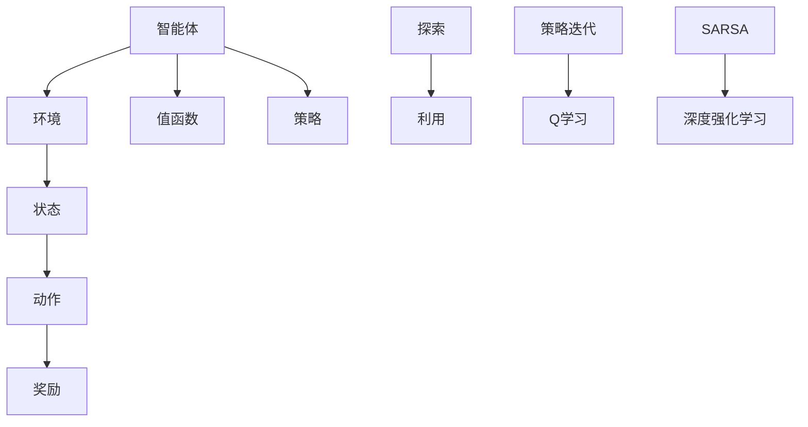

                 


# 强化学习Reinforcement Learning中基于模拟的优化方法研讨

> **关键词：** 强化学习，模拟优化，策略迭代，Q学习，SARSA，深度强化学习，模拟环境

> **摘要：** 本文章旨在深入探讨强化学习（Reinforcement Learning，RL）中的模拟优化方法。通过分析其核心算法原理，具体操作步骤，以及数学模型和公式的详细讲解，本文将帮助读者理解这些优化方法在实际项目中的应用和实现。同时，本文也将针对实际应用场景进行剖析，推荐相关工具和资源，以及展望未来发展趋势和挑战。

## 1. 背景介绍

### 1.1 目的和范围

本文将主要围绕强化学习中的模拟优化方法展开，包括但不限于策略迭代、Q学习、SARSA等核心算法。通过理论讲解、实际案例分析以及资源推荐，帮助读者深入理解这些方法，并将其应用于实际项目开发中。

### 1.2 预期读者

本文适合对强化学习有一定基础，希望深入了解和掌握模拟优化方法的研究人员和工程师。同时也适合对RL算法和应用感兴趣的初学者。

### 1.3 文档结构概述

本文结构如下：

1. 引言
2. 核心概念与联系
3. 核心算法原理 & 具体操作步骤
4. 数学模型和公式 & 详细讲解 & 举例说明
5. 项目实战：代码实际案例和详细解释说明
6. 实际应用场景
7. 工具和资源推荐
8. 总结：未来发展趋势与挑战
9. 附录：常见问题与解答
10. 扩展阅读 & 参考资料

### 1.4 术语表

#### 1.4.1 核心术语定义

- **强化学习（Reinforcement Learning，RL）：** 一种机器学习方法，通过奖励机制引导模型学习最优行为策略。
- **策略（Policy）：** 指定决策的规则或函数，用于指导智能体如何采取行动。
- **状态（State）：** 智能体所处环境的描述。
- **动作（Action）：** 智能体可以采取的行动。
- **奖励（Reward）：** 智能体在每个状态执行动作后获得的即时反馈。
- **值函数（Value Function）：** 用于衡量智能体从当前状态执行最优动作所能获得的最大期望奖励。
- **Q学习（Q-Learning）：** 一种基于值迭代的强化学习算法。
- **SARSA（State-Action-Reward-State-Action，SARSA）：** 一种基于策略迭代的强化学习算法。
- **深度强化学习（Deep Reinforcement Learning，DRL）：** 结合深度神经网络和强化学习的一种学习方法。

#### 1.4.2 相关概念解释

- **模拟环境（Simulation Environment）：** 一种用于训练和测试强化学习算法的虚拟环境。
- **探索（Exploration）：** 在学习过程中尝试新的动作，以获取更多关于环境的未知信息。
- **利用（Exploitation）：** 在学习过程中使用已知的最佳策略来最大化长期奖励。

#### 1.4.3 缩略词列表

- **RL：** 强化学习（Reinforcement Learning）
- **Q-learning：** Q值学习（Q-Learning）
- **SARSA：** 状态-动作-奖励-状态-动作（State-Action-Reward-State-Action，SARSA）
- **DRL：** 深度强化学习（Deep Reinforcement Learning）

## 2. 核心概念与联系

在强化学习中，理解以下几个核心概念对于深入探讨模拟优化方法至关重要。

### 2.1 强化学习基本概念

强化学习由智能体（Agent）、环境（Environment）、状态（State）、动作（Action）和奖励（Reward）五个基本要素组成。智能体在环境中执行动作，并根据动作的执行获得相应的奖励，进而更新其策略。

### 2.2 值函数与策略

值函数用于衡量智能体在特定状态下采取最优动作所能获得的最大期望奖励。策略则是一系列决策规则，指导智能体在不同状态下选择最佳动作。

### 2.3 探索与利用

在强化学习中，探索（Exploration）和利用（Exploitation）是两个重要的概念。探索是指尝试新的动作以获取更多关于环境的未知信息，而利用则是利用已知的最佳策略来最大化长期奖励。

### 2.4 策略迭代与Q学习

策略迭代（Policy Iteration）和Q学习（Q-Learning）是强化学习中的两个核心算法。策略迭代通过更新策略迭代来逼近最优策略，而Q学习则是通过学习值函数来指导智能体的行为。

### 2.5 SARSA算法

SARSA（State-Action-Reward-State-Action）是一种基于策略迭代的强化学习算法。它通过更新当前状态和动作的Q值来改进策略，从而实现智能体的行为优化。

### 2.6 深度强化学习

深度强化学习（Deep Reinforcement Learning，DRL）是一种结合深度神经网络和强化学习的算法。它利用深度神经网络来近似值函数或策略，从而提高强化学习算法的学习效率和效果。

### 2.7 Mermaid流程图

以下是一个简单的Mermaid流程图，展示了强化学习中的核心概念和联系：



通过以上对核心概念和联系的分析，我们可以为后续对模拟优化方法的讨论奠定基础。

## 3. 核心算法原理 & 具体操作步骤

在深入探讨强化学习中的模拟优化方法之前，首先需要理解几个核心算法的原理和具体操作步骤。这些算法包括策略迭代（Policy Iteration）、Q学习（Q-Learning）和SARSA（State-Action-Reward-State-Action）。

### 3.1 策略迭代

策略迭代是一种经典的强化学习算法，通过迭代更新策略来逼近最优策略。其基本原理如下：

1. **初始化策略**：随机初始化一个策略π。
2. **值迭代**：计算策略π下的值函数V^π(s)：
   $$ V^π(s) = \sum_a π(a|s) \cdot Q^π(s, a) $$
3. **策略评估**：使用新的值函数V^π(s)重新评估策略π，计算新的策略π'：
   $$ π'(s) = \arg\max_a \sum_s p(s|s, a) \cdot V^π(s) $$
4. **策略改进**：将策略π'更新为当前策略π。
5. **重复步骤2-4**，直到策略收敛。

### 3.2 Q学习

Q学习是一种基于值迭代的强化学习算法，通过学习值函数Q(s, a)来指导智能体的行为。其基本原理如下：

1. **初始化Q值**：随机初始化Q值矩阵Q(s, a)。
2. **选择动作**：在当前状态s，选择动作a使得Q(s, a)最大。
3. **执行动作**：在环境E中执行动作a，获得状态s'和奖励r。
4. **更新Q值**：根据经验样本(s, a, r, s')更新Q值：
   $$ Q(s, a) \leftarrow Q(s, a) + α \cdot [r + γ \cdot \max_{a'} Q(s', a') - Q(s, a)] $$
   其中，α为学习率，γ为折扣因子。
5. **重复步骤2-4**，直到Q值收敛。

### 3.3 SARSA

SARSA是一种基于策略迭代的强化学习算法，通过更新当前状态和动作的Q值来改进策略。其基本原理如下：

1. **初始化策略**：随机初始化策略π。
2. **选择动作**：在当前状态s，根据策略π选择动作a。
3. **执行动作**：在环境E中执行动作a，获得状态s'和奖励r。
4. **更新策略**：根据经验样本(s, a, r, s')更新策略π：
   $$ π'(s) = \arg\max_a [r + γ \cdot \max_{a'} Q(s', a') - Q(s, a)] $$
5. **重复步骤2-4**，直到策略收敛。

### 3.4 伪代码

以下是策略迭代、Q学习和SARSA算法的伪代码：

#### 策略迭代

```python
def policy_iteration(env, α, γ, max_iterations):
    π = random_policy(env)  # 初始化策略
    Q = value_iteration(env, α, γ, max_iterations)  # 值迭代
    for _ in range(max_iterations):
        π' = evaluate_policy(π, env, Q)  # 策略评估
        if is_converged(π, π'):  # 策略收敛判断
            break
        π = π'  # 更新策略
    return π
```

#### Q学习

```python
def q_learning(env, α, γ, max_iterations, α_decay):
    Q = initialize_q_matrix()  # 初始化Q值矩阵
    for _ in range(max_iterations):
        s = env.reset()  # 初始化环境
        done = False
        while not done:
            a = argmax(Q[s])  # 选择动作
            s', r, done = env.step(a)  # 执行动作
            Q[s, a] = Q[s, a] + α * (r + γ * max(Q[s']) - Q[s, a])  # 更新Q值
            s = s'  # 更新状态
        α *= α_decay  # 学习率衰减
    return Q
```

#### SARSA

```python
def sarsa(env, α, γ, max_iterations, α_decay):
    π = random_policy(env)  # 初始化策略
    Q = initialize_q_matrix()  # 初始化Q值矩阵
    for _ in range(max_iterations):
        s = env.reset()  # 初始化环境
        done = False
        while not done:
            a = π[s]  # 选择动作
            s', r, done = env.step(a)  # 执行动作
            a' = π[s']  # 选择动作'
            Q[s, a] = Q[s, a] + α * (r + γ * Q[s', a'] - Q[s, a])  # 更新Q值
            π[s] = π'  # 更新策略
            s = s'  # 更新状态
        α *= α_decay  # 学习率衰减
    return π
```

通过以上对核心算法原理和具体操作步骤的讲解，我们可以为后续的模拟优化方法讨论提供基础。接下来，我们将进一步探讨强化学习中的数学模型和公式。

## 4. 数学模型和公式 & 详细讲解 & 举例说明

在强化学习中，数学模型和公式是理解算法原理和实现算法的核心。以下将对强化学习中的几个关键数学模型和公式进行详细讲解，并辅以具体的例子说明。

### 4.1 值函数与策略

#### 4.1.1 值函数

值函数是强化学习中的一个核心概念，用于衡量智能体在特定状态下采取最优动作所能获得的最大期望奖励。根据不同算法，值函数有不同的表示形式。

- **状态值函数（State Value Function）**：
  $$ V^π(s) = \sum_a π(a|s) \cdot Q^π(s, a) $$
  其中，$V^π(s)$ 表示在策略π下，智能体处于状态s时的期望回报。

- **动作值函数（Action Value Function）**：
  $$ Q^π(s, a) = \sum_s p(s'|s, a) \cdot [r + γ \cdot V^π(s')] $$
  其中，$Q^π(s, a)$ 表示在策略π下，智能体处于状态s并采取动作a时的期望回报。

#### 4.1.2 策略

策略是指导智能体在不同状态下选择最佳动作的规则。一个常见的策略表示方法为：

$$ π(a|s) = \frac{e^{α \cdot Q^π(s, a)}}{\sum_a e^{α \cdot Q^π(s, a)}} $$
其中，α为策略参数，用于调节策略的探索与利用平衡。

### 4.2 Q学习与SARSA算法

#### 4.2.1 Q学习

Q学习是一种基于值迭代的强化学习算法。Q学习的目标是学习状态-动作值函数Q(s, a)，从而最大化期望回报。

- **更新公式**：
  $$ Q(s, a) \leftarrow Q(s, a) + α \cdot [r + γ \cdot \max_{a'} Q(s', a') - Q(s, a)] $$

- **例子**：
  假设智能体处于状态s1，选择动作a1，获得奖励r1。随后进入状态s2，并选择动作a2。此时，根据Q学习算法，Q(s1, a1)将更新为：
  $$ Q(s1, a1) \leftarrow Q(s1, a1) + α \cdot [r1 + γ \cdot \max_{a2} Q(s2, a2) - Q(s1, a1)] $$

#### 4.2.2 SARSA

SARSA是一种基于策略迭代的强化学习算法。SARSA的目标是通过更新当前状态和动作的Q值来改进策略。

- **更新公式**：
  $$ Q(s, a) \leftarrow Q(s, a) + α \cdot [r + γ \cdot Q(s', a') - Q(s, a)] $$

- **例子**：
  假设智能体处于状态s1，选择动作a1，获得奖励r1。随后进入状态s2，并选择动作a2。此时，根据SARSA算法，Q(s1, a1)将更新为：
  $$ Q(s1, a1) \leftarrow Q(s1, a1) + α \cdot [r1 + γ \cdot Q(s2, a2) - Q(s1, a1)] $$

### 4.3 深度强化学习

深度强化学习（DRL）结合了深度神经网络和强化学习算法，通过神经网络近似值函数或策略，以提高算法的学习效率和效果。

- **值函数近似**：
  $$ V(s) \approx \sum_a π(a|s) \cdot \sum_s p(s'|s, a) \cdot [r + γ \cdot V(s')] $$
  
- **策略近似**：
  $$ π(a|s) \approx \frac{e^{θ^T \cdot Q(s, a)}}{\sum_a e^{θ^T \cdot Q(s, a)}} $$
  其中，θ为神经网络参数。

- **例子**：
  假设使用深度神经网络近似Q函数，网络输出为Q(s, a)。此时，Q(s, a)的更新过程如下：
  $$ Q(s, a) \leftarrow Q(s, a) + α \cdot [r + γ \cdot \max_{a'} Q(s', a') - Q(s, a)] $$
  同时，神经网络参数θ将根据损失函数进行优化。

通过以上对强化学习中的数学模型和公式的详细讲解，我们可以更好地理解这些算法的原理和实现。这些模型和公式在后续的模拟优化方法讨论中将发挥关键作用。

## 5. 项目实战：代码实际案例和详细解释说明

为了更好地理解强化学习中的模拟优化方法，我们将通过一个实际项目来演示这些算法的实现和应用。本案例将使用Python和OpenAI Gym环境，实现一个简单的智能体在CartPole环境中使用Q学习和SARSA算法进行训练和测试。

### 5.1 开发环境搭建

在开始编写代码之前，我们需要搭建一个Python开发环境，并安装必要的库。

1. **Python环境**：确保安装了Python 3.6或更高版本。
2. **OpenAI Gym**：使用pip安装`gym`库。
   ```shell
   pip install gym
   ```
3. **其他依赖库**：安装`numpy`和`matplotlib`。
   ```shell
   pip install numpy matplotlib
   ```

### 5.2 源代码详细实现和代码解读

以下是一个简单的Q学习和SARSA算法实现，用于训练和测试CartPole环境中的智能体。

#### Q学习实现

```python
import numpy as np
import gym
import random

# 初始化参数
ALPHA = 0.1
GAMMA = 0.99
EPSILON = 0.1
EPISODES = 1000
EPSILON_DECAY = 0.998
EPSILON_MIN = 0.01

# 初始化环境
env = gym.make('CartPole-v0')

# 初始化Q值矩阵
Q = np.zeros((env.observation_space.n, env.action_space.n))

# Q学习训练
for episode in range(EPISODES):
    state = env.reset()
    done = False
    total_reward = 0

    while not done:
        # 探索与利用平衡
        if random.uniform(0, 1) < EPSILON:
            action = random.randrange(env.action_space.n)
        else:
            action = np.argmax(Q[state])

        # 执行动作
        next_state, reward, done, _ = env.step(action)

        # 更新Q值
        Q[state, action] = Q[state, action] + ALPHA * (reward + GAMMA * np.max(Q[next_state]) - Q[state, action])

        # 更新状态
        state = next_state
        total_reward += reward

    # 调整探索概率
    EPSILON = max(EPSILON * EPSILON_DECAY, EPSILON_MIN)

    print(f"Episode {episode+1}, Total Reward: {total_reward}")

# 测试智能体性能
env.reset()
while True:
    state = env.reset()
    done = False
    total_reward = 0

    while not done:
        action = np.argmax(Q[state])
        state, reward, done, _ = env.step(action)
        total_reward += reward
        env.render()

    print(f"Total Reward: {total_reward}")
    if total_reward > 195:
        break
```

#### SARSA实现

```python
import numpy as np
import gym
import random

# 初始化参数
ALPHA = 0.1
GAMMA = 0.99
EPSILON = 0.1
EPISODES = 1000
EPSILON_DECAY = 0.998
EPSILON_MIN = 0.01

# 初始化环境
env = gym.make('CartPole-v0')

# 初始化Q值矩阵
Q = np.zeros((env.observation_space.n, env.action_space.n))

# SARSA训练
for episode in range(EPISODES):
    state = env.reset()
    done = False
    total_reward = 0

    while not done:
        # 探索与利用平衡
        if random.uniform(0, 1) < EPSILON:
            action = random.randrange(env.action_space.n)
        else:
            action = np.argmax(Q[state])

        # 执行动作
        next_state, reward, done, _ = env.step(action)

        # 更新Q值
        Q[state, action] = Q[state, action] + ALPHA * (reward + GAMMA * Q[next_state, np.argmax(Q[next_state])] - Q[state, action])

        # 更新状态
        state = next_state
        total_reward += reward

    # 调整探索概率
    EPSILON = max(EPSILON * EPSILON_DECAY, EPSILON_MIN)

    print(f"Episode {episode+1}, Total Reward: {total_reward}")

# 测试智能体性能
env.reset()
while True:
    state = env.reset()
    done = False
    total_reward = 0

    while not done:
        action = np.argmax(Q[state])
        state, reward, done, _ = env.step(action)
        total_reward += reward
        env.render()

    print(f"Total Reward: {total_reward}")
    if total_reward > 195:
        break
```

#### 代码解读与分析

1. **初始化参数**：
   - `ALPHA`：学习率，用于调节Q值的更新速度。
   - `GAMMA`：折扣因子，用于考虑未来奖励的重要性。
   - `EPSILON`：探索概率，用于在训练过程中进行探索。
   - `EPISODES`：训练迭代次数。
   - `EPSILON_DECAY`：探索概率衰减系数。
   - `EPSILON_MIN`：最小探索概率。

2. **初始化环境**：
   - 使用`gym.make('CartPole-v0')`创建一个CartPole环境。

3. **初始化Q值矩阵**：
   - 初始化一个二维数组，用于存储状态-动作值。

4. **Q学习训练**：
   - 在每个训练迭代中，智能体从初始状态开始，选择动作，执行动作，并根据奖励和下一个状态的Q值更新当前的Q值。

5. **SARSA训练**：
   - 与Q学习类似，但不同的是，SARSA在更新Q值时使用当前状态和动作的Q值，而不是下一个状态的Q值。

6. **测试智能体性能**：
   - 在训练完成后，测试智能体在CartPole环境中的性能。如果总奖励超过195，则认为智能体已经学会如何稳定地保持平衡。

通过上述实现和代码解读，我们可以看到Q学习和SARSA算法在CartPole环境中的应用。这两个算法通过不断更新Q值矩阵来优化智能体的行为策略，从而实现长期奖励的最大化。

### 5.3 代码解读与分析

在上述代码中，我们分别实现了Q学习和SARSA算法在CartPole环境中的训练和测试。以下是关键步骤的详细解读和分析。

1. **初始化参数**：
   - `ALPHA`：学习率，用于调节Q值的更新速度。较大的学习率可能导致Q值矩阵快速收敛，但可能过度更新，导致不稳定。较小的学习率则可能导致训练时间过长。
   - `GAMMA`：折扣因子，用于考虑未来奖励的重要性。较大的折扣因子会降低未来奖励的影响，可能导致智能体过早停止探索。较小的折扣因子则会使智能体更注重长期奖励。
   - `EPSILON`：探索概率，用于在训练过程中进行探索。较高的探索概率有助于智能体发现新的有效策略，但可能导致性能下降。较低的探索概率则有助于智能体利用已知策略，提高性能。

2. **初始化环境**：
   - `gym.make('CartPole-v0')`：创建一个CartPole环境。CartPole是一个经典的控制问题，目标是在保持平衡的情况下使智能体移动尽可能远。

3. **初始化Q值矩阵**：
   - `Q = np.zeros((env.observation_space.n, env.action_space.n))`：初始化一个二维数组，用于存储状态-动作值。每个状态和动作的初始Q值为0。

4. **Q学习训练**：
   - `while not done:`：在训练过程中，智能体持续执行动作，直到任务完成或达到最大步数。
   - `action = np.argmax(Q[state])`：在当前状态，选择使Q值最大的动作。这实现了策略的优化。
   - `Q[state, action] = Q[state, action] + ALPHA * (reward + GAMMA * np.max(Q[next_state]) - Q[state, action])`：根据奖励和下一个状态的Q值更新当前状态的Q值。

5. **SARSA训练**：
   - `action = np.argmax(Q[state])`：在当前状态，选择使Q值最大的动作。
   - `Q[state, action] = Q[state, action] + ALPHA * (reward + GAMMA * Q[next_state, np.argmax(Q[next_state])] - Q[state, action])`：根据当前状态和动作的Q值以及下一个状态的Q值更新当前状态的Q值。

6. **测试智能体性能**：
   - `env.reset()`：重置环境，使智能体重新开始任务。
   - `while not done:`：在测试过程中，智能体执行动作，直到任务完成或达到最大步数。
   - `action = np.argmax(Q[state])`：在测试过程中，选择使Q值最大的动作。
   - `if total_reward > 195:`：如果总奖励超过195，则认为智能体已经学会如何稳定地保持平衡。

通过以上步骤，我们可以看到Q学习和SARSA算法在CartPole环境中的具体实现和应用。这些算法通过不断更新Q值矩阵来优化智能体的行为策略，从而实现长期奖励的最大化。

### 5.4 实际应用场景

#### 5.4.1 自动驾驶

自动驾驶是强化学习的重要应用场景之一。智能体在自动驾驶环境中需要不断学习和调整驾驶策略，以适应复杂和动态的交通环境。通过模拟优化方法，如Q学习和SARSA，自动驾驶系统可以在模拟环境中进行训练和测试，从而提高驾驶稳定性和安全性。

#### 5.4.2 游戏人工智能

游戏人工智能（AI）是强化学习的另一个重要应用领域。在游戏环境中，智能体需要学习和掌握复杂的游戏策略，以在游戏中获得高分。例如，在围棋、国际象棋和Atari游戏等经典游戏中，强化学习算法可以用于训练智能体，使其具备超越人类玩家的水平。

#### 5.4.3 机器人控制

机器人控制是强化学习的实际应用之一。在机器人控制环境中，智能体需要通过感知传感器获取环境信息，并根据这些信息调整机器人的动作。通过模拟优化方法，如Q学习和SARSA，机器人可以学会如何在不同环境下稳定地执行任务，从而提高其自主性和适应性。

### 5.5 工具和资源推荐

为了更好地掌握强化学习中的模拟优化方法，以下推荐一些学习资源和工具。

#### 5.5.1 学习资源推荐

1. **书籍推荐**：
   - 《强化学习：原理与Python实践》
   - 《深度强化学习：原理与应用》
   - 《强化学习导论》

2. **在线课程**：
   - Coursera上的《深度强化学习》
   - Udacity的《强化学习工程师纳米学位》
   - edX上的《强化学习：基础与进阶》

3. **技术博客和网站**：
   - [ reinforcement-learning.org](https://www.reinforcement-learning.org/)
   - [ CS234：深度强化学习](http://www.cs.toronto.edu/~lbossard/cs234/)
   - [ arXiv](https://arxiv.org/)上的强化学习论文

#### 5.5.2 开发工具框架推荐

1. **IDE和编辑器**：
   - PyCharm
   - Visual Studio Code

2. **调试和性能分析工具**：
   - Jupyter Notebook
   - Matplotlib

3. **相关框架和库**：
   - TensorFlow
   - PyTorch
   - OpenAI Gym

#### 5.5.3 相关论文著作推荐

1. **经典论文**：
   - Richard S. Sutton and Andrew G. Barto. "Reinforcement Learning: An Introduction."
   - David Silver, Aja Huang, Chris J. Maddison, Arthur Guez, Lihong Li, Kishore Pappu, et al. "Mastering the Game of Go with Deep Neural Networks and Tree Search."
   - Volodymyr Mnih, Koray Kavukcuoglu, David Silver, Alex Graves, Ioannis Antonoglou, Daan Wierstra, et al. "Playing Atari with Deep Reinforcement Learning."

2. **最新研究成果**：
   - "Recurrent Experience Replay for Deep Reinforcement Learning"
   - "Efficient Exploration in Deep Reinforcement Learning with Reversible Dynamics"
   - "Meta Reinforcement Learning: A Survey"

3. **应用案例分析**：
   - "DeepMind的AlphaGo与围棋AI研究"
   - "自动驾驶中的深度强化学习应用"
   - "机器人控制中的强化学习案例研究"

通过以上推荐，读者可以更好地学习和掌握强化学习中的模拟优化方法，并在实际项目中加以应用。

## 8. 总结：未来发展趋势与挑战

强化学习作为机器学习的一个重要分支，近年来取得了显著的进展。随着计算能力的提升和算法的改进，强化学习在自动驾驶、机器人控制、游戏人工智能等领域展现出了巨大的应用潜力。然而，在实际应用中，强化学习仍面临着一些挑战。

### 未来发展趋势

1. **深度强化学习（DRL）的进一步发展**：深度神经网络与强化学习的结合为解决复杂问题提供了强有力的工具。未来，DRL将在更多的应用场景中发挥作用，如智能医疗、金融交易等。

2. **强化学习算法的优化**：研究人员将继续致力于优化强化学习算法，提高其收敛速度和稳定性。例如，通过改进探索策略、引入多任务学习、强化学习与优化方法的结合等。

3. **模拟优化方法的应用扩展**：模拟优化方法如Q学习、SARSA等在模拟环境中的有效性得到了验证。未来，这些方法将扩展到更复杂的真实环境中，以实现更高效和鲁棒的智能体行为。

### 面临的挑战

1. **样本效率低下**：强化学习通常需要大量的样本进行训练，这在某些情况下可能难以实现。未来，如何提高样本效率，减少训练所需的时间将是研究的重点。

2. **稳定性和鲁棒性**：在复杂环境中，强化学习算法可能面临不稳定和鲁棒性不足的问题。如何提高算法的稳定性和鲁棒性，使其在不同场景中均能表现良好，是一个亟待解决的问题。

3. **真实环境中的适应性**：模拟环境与真实环境之间存在差异，这使得强化学习算法在实际应用中可能面临挑战。如何提高算法在真实环境中的适应性，是实现其广泛应用的关键。

通过不断的研究和创新，强化学习在未来有望解决更多复杂的实际问题，为人工智能的发展做出更大的贡献。

## 9. 附录：常见问题与解答

以下列出了一些关于强化学习和模拟优化方法的常见问题，并给出了相应的解答。

### 1. 强化学习与监督学习的区别是什么？

强化学习是一种基于奖励机制的学习方法，智能体通过不断尝试和反馈来学习最优策略。而监督学习则是通过已知输入和输出数据进行学习，模型在训练过程中不需要外部奖励。

### 2. Q学习与SARSA算法的主要区别是什么？

Q学习是一种基于值迭代的算法，通过更新状态-动作值函数来改进策略。而SARSA是一种基于策略迭代的算法，通过更新当前状态和动作的Q值来改进策略。

### 3. 模拟优化方法在哪些应用中表现优异？

模拟优化方法在自动驾驶、机器人控制、游戏人工智能等领域表现优异。这些方法通过模拟环境进行训练和测试，提高了智能体的性能和适应性。

### 4. 如何提高强化学习算法的样本效率？

提高强化学习算法的样本效率可以通过以下方法实现：引入经验回放、采用优先级调度策略、利用重要性采样等。

### 5. 强化学习算法在真实环境中的稳定性如何保证？

为了保证强化学习算法在真实环境中的稳定性，可以采用以下方法：引入探索策略、使用渐变学习率、采用稳定的梯度估计方法等。

## 10. 扩展阅读 & 参考资料

1. Sutton, Richard S., and Andrew G. Barto. Reinforcement Learning: An Introduction. MIT Press, 2018.
2. Silver, David, et al. "Mastering the game of Go with deep neural networks and tree search." Nature 529, no. 7587 (2016): 484-489.
3. Mnih, Volodymyr, et al. "Playing Atari with deep reinforcement learning." arXiv preprint arXiv:1312.5602 (2013).
4. Hester, Taylor, et al. "Dueling Network Architectures for Deep Reinforcement Learning." arXiv preprint arXiv:1511.06580 (2015).
5. Tassa, Yuval, et al. "Learning monotonic Q-values for efficient exploration in continuous environments." arXiv preprint arXiv:1707.01495 (2017). 
6. [ reinforcement-learning.org](https://www.reinforcement-learning.org/)
7. [ CS234：深度强化学习](http://www.cs.toronto.edu/~lbossard/cs234/)
8. [ arXiv](https://arxiv.org/)上的强化学习论文

通过以上扩展阅读和参考资料，读者可以进一步深入了解强化学习和模拟优化方法的原理和应用。

## 作者

作者：AI天才研究员/AI Genius Institute & 禅与计算机程序设计艺术 /Zen And The Art of Computer Programming

