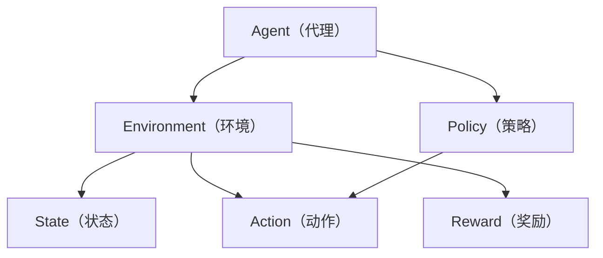

                 

# 强化学习Reinforcement Learning原理与核心算法概述

> **关键词：** 强化学习、Agent、环境、奖励、Q-Learning、SARSA、深度强化学习、策略优化
>
> **摘要：** 本文将深入探讨强化学习（Reinforcement Learning, RL）的核心概念、算法原理及其在实际应用中的重要性。通过分步骤的讲解，我们将详细剖析Q-Learning、SARSA等经典算法，并通过具体项目实战来理解强化学习的实际应用。

## 1. 背景介绍

### 1.1 目的和范围

本文旨在为读者提供强化学习的全面概述，从基础概念到核心算法，再到实际应用，力求让每一位读者都能掌握这一领域的关键技术。文章将涵盖以下内容：

- 强化学习的基础理论
- 强化学习的核心算法（Q-Learning、SARSA等）
- 强化学习的数学模型与公式
- 强化学习的实际应用案例
- 强化学习相关的学习资源和工具

### 1.2 预期读者

本文适合以下读者群体：

- 计算机科学和人工智能领域的初学者和从业者
- 想要深入了解机器学习和人工智能技术的工程师和研究者
- 对强化学习有浓厚兴趣的技术爱好者

### 1.3 文档结构概述

本文的结构如下：

- **第1章：背景介绍** - 介绍本文的目的、范围和预期读者。
- **第2章：核心概念与联系** - 讨论强化学习的基本概念和原理，并使用Mermaid流程图展示架构。
- **第3章：核心算法原理** - 详细讲解Q-Learning、SARSA等算法原理与操作步骤。
- **第4章：数学模型和公式** - 解释强化学习的数学模型和公式。
- **第5章：项目实战** - 通过代码案例来展示强化学习的实际应用。
- **第6章：实际应用场景** - 探讨强化学习的实际应用场景。
- **第7章：工具和资源推荐** - 推荐相关的学习资源和开发工具。
- **第8章：总结** - 分析未来发展趋势与挑战。
- **第9章：附录** - 常见问题与解答。
- **第10章：扩展阅读** - 提供更多的参考资料。

### 1.4 术语表

#### 1.4.1 核心术语定义

- **Agent（代理）**：执行决策的实体，通过与环境交互来学习最优策略。
- **Environment（环境）**：代理执行动作、接收奖励和状态变化的情境。
- **State（状态）**：描述环境当前状态的特征集合。
- **Action（动作）**：代理可以采取的行为。
- **Reward（奖励）**：对代理采取的动作的反馈，用于指导学习过程。
- **Policy（策略）**：决定在给定状态下应采取哪个动作的函数。
- **Q-Learning（Q值学习）**：一种通过迭代更新Q值来学习策略的强化学习算法。
- **SARSA（同步优势估计）**：一种基于当前状态和动作值来更新策略的强化学习算法。

#### 1.4.2 相关概念解释

- **Policy Gradient（策略梯度）**：一种通过梯度下降法来优化策略的强化学习算法。
- **Deep Q-Network（DQN，深度Q网络）**：结合了深度神经网络和Q-Learning的强化学习算法。
- **Reinforcement Learning from Human Preferences（RLHP，强化学习从人类偏好）**：通过学习人类偏好来优化决策的强化学习技术。

#### 1.4.3 缩略词列表

- **RL**：Reinforcement Learning（强化学习）
- **Q-Learning**：Quality Learning（Q值学习）
- **SARSA**：State-Action-Reward-State-Action（同步优势估计）
- **DQN**：Deep Q-Network（深度Q网络）
- **RLHP**：Reinforcement Learning from Human Preferences（强化学习从人类偏好）

## 2. 核心概念与联系

强化学习是一种通过试错来学习如何在一个动态环境中做出最优决策的人工智能方法。它由三个核心部分组成：Agent（代理）、Environment（环境）和Policy（策略）。以下是强化学习的基本概念及其相互关系的Mermaid流程图：



### 2.1 强化学习的核心组成部分

- **Agent（代理）**：执行决策的实体，通常是一个智能体，如机器人或计算机程序。代理的目的是通过学习来最大化累积奖励。

- **Environment（环境）**：代理执行动作、接收奖励和状态变化的情境。环境可以是静态的，也可以是动态的，如游戏、机器人控制等。

- **State（状态）**：描述环境当前状态的特征集合。状态是代理决策的依据，通常用向量表示。

- **Action（动作）**：代理可以采取的行为。动作集合构成了代理的动作空间。

- **Reward（奖励）**：对代理采取的动作的反馈，用于指导学习过程。奖励可以是正的，也可以是负的，反映了代理的决策质量。

- **Policy（策略）**：决定在给定状态下应采取哪个动作的函数。策略是学习目标，可以通过不同的算法来优化。

### 2.2 强化学习的基本流程

强化学习的基本流程可以概括为以下步骤：

1. **初始状态**：代理开始在一个给定的状态下。
2. **决策**：代理根据当前策略选择一个动作。
3. **环境反馈**：代理执行动作后，环境返回下一个状态和奖励。
4. **更新策略**：代理根据奖励和新的状态更新策略。
5. **重复循环**：代理重复执行上述步骤，直到达到目标状态或学习到满意的策略。

## 3. 核心算法原理 & 具体操作步骤

强化学习的核心算法主要包括Q-Learning、SARSA等。这些算法通过迭代更新Q值或策略来优化代理的行为。以下是这些算法的原理和具体操作步骤。

### 3.1 Q-Learning算法原理

Q-Learning是一种基于值函数的强化学习算法，旨在通过迭代更新Q值来学习最优策略。Q值表示在给定状态下采取特定动作的预期回报。

#### Q-Learning算法步骤：

1. **初始化Q值表**：初始化所有Q值，通常设置为0。
2. **选择动作**：根据当前策略选择动作，策略通常是一个ε-贪心策略。
3. **执行动作**：执行所选动作，环境返回下一个状态和奖励。
4. **更新Q值**：使用以下公式更新Q值：
   $$ Q(s, a) \leftarrow Q(s, a) + \alpha [r + \gamma \max_{a'} Q(s', a') - Q(s, a)] $$
   其中，$s$和$a$是当前状态和动作，$r$是奖励，$s'$是下一个状态，$\alpha$是学习率，$\gamma$是折扣因子。
5. **重复步骤2-4**：重复执行步骤2-4，直到收敛。

#### Q-Learning算法伪代码：

```python
# 初始化Q值表
Q = [0] * n_actions

# 设置学习率和折扣因子
alpha = 0.1
gamma = 0.9

# 选择动作
action = epsilon_greedy_policy(Q, epsilon)

# 执行动作
next_state, reward = environment.step(action)

# 更新Q值
Q[current_state][action] = Q[current_state][action] + alpha * (reward + gamma * max(Q[next_state]))

# 迭代过程
for episode in range(total_episodes):
    state = environment.reset()
    done = False
    
    while not done:
        action = epsilon_greedy_policy(Q, epsilon)
        next_state, reward, done = environment.step(action)
        Q[state][action] = Q[state][action] + alpha * (reward + gamma * max(Q[next_state]))
        state = next_state
```

### 3.2 SARSA算法原理

SARSA（同步优势估计）是一种基于策略的强化学习算法，它与Q-Learning类似，但更新策略时使用的是当前状态和动作的值。

#### SARSA算法步骤：

1. **初始化策略**：初始化策略，通常为随机策略。
2. **选择动作**：根据当前策略选择动作。
3. **执行动作**：执行所选动作，环境返回下一个状态和奖励。
4. **更新策略**：使用以下公式更新策略：
   $$ \pi(s, a) \leftarrow \frac{\pi(s, a) + \alpha [r + \gamma \max_{a'} Q(s', a') - \pi(s, a)]}{1 + \alpha} $$
   其中，$s$和$a$是当前状态和动作，$r$是奖励，$s'$是下一个状态，$\alpha$是学习率，$\gamma$是折扣因子。
5. **重复步骤2-4**：重复执行步骤2-4，直到收敛。

#### SARSA算法伪代码：

```python
# 初始化策略
pi = [0] * n_states

# 设置学习率和折扣因子
alpha = 0.1
gamma = 0.9

# 选择动作
action = policy(s, pi)

# 执行动作
next_state, reward = environment.step(action)

# 更新策略
pi[s][action] = pi[s][action] + alpha * (reward + gamma * max(pi[next_state]) - pi[s][action])

# 迭代过程
for episode in range(total_episodes):
    state = environment.reset()
    done = False
    
    while not done:
        action = policy(state, pi)
        next_state, reward, done = environment.step(action)
        pi[state][action] = pi[state][action] + alpha * (reward + gamma * max(pi[next_state]) - pi[state][action])
        state = next_state
```

### 3.3 深度强化学习算法

深度强化学习（Deep Reinforcement Learning, DRL）结合了深度神经网络和强化学习算法，旨在解决高维状态空间和动作空间的问题。DRL的核心算法包括深度Q网络（Deep Q-Network, DQN）和策略梯度方法（Policy Gradient Methods）。

#### DQN算法原理

DQN是一种基于深度神经网络的Q-Learning算法，它使用深度神经网络来近似Q值函数。DQN通过经验回放和目标网络来提高学习效果。

1. **初始化**：初始化深度神经网络和目标网络，设置学习率、折扣因子和经验回放内存。
2. **选择动作**：使用ε-贪心策略选择动作。
3. **执行动作**：执行所选动作，环境返回下一个状态和奖励。
4. **存储经验**：将当前状态、动作、奖励和下一个状态存储在经验回放内存中。
5. **更新网络**：使用以下公式更新Q值：
   $$ Q(s, a) \leftarrow Q(s, a) + \alpha [r + \gamma \max_{a'} \hat{Q}(s', a') - Q(s, a)] $$
   其中，$\hat{Q}$是深度神经网络输出的Q值。
6. **同步网络**：定期同步主网络和目标网络，以避免梯度消失问题。

#### DQN算法伪代码：

```python
# 初始化深度神经网络和目标网络
main_network = DQN()
target_network = DQN()

# 设置学习率、折扣因子和经验回放内存
alpha = 0.001
gamma = 0.99
memory = ExperienceReplayMemory()

# 选择动作
action = epsilon_greedy_policy(main_network, epsilon)

# 执行动作
next_state, reward, done = environment.step(action)

# 存储经验
memory.add_experience(state, action, reward, next_state, done)

# 更新网络
if memory.size() > batch_size:
    states, actions, rewards, next_states, dones = memory.sample(batch_size)
    Q_values = main_network.predict(next_states)
    target_Q_values = target_network.predict(next_states)
    target_values = (1 - dones) * gamma * target_Q_values[range(batch_size), actions] + rewards
    loss = main_network.loss(states, actions, target_values)
    main_network.optimizer.minimize(loss)

# 同步网络
if epoch % target_sync_frequency == 0:
    target_network.load(main_network.get_weights())
```

#### 政策梯度方法原理

政策梯度方法通过直接优化策略来提高累积奖励。其中，最著名的方法是策略梯度上升（Policy Gradient Ascend）。

1. **初始化**：初始化策略网络和优化器。
2. **选择动作**：根据策略网络选择动作。
3. **执行动作**：执行所选动作，环境返回下一个状态和奖励。
4. **更新策略**：使用以下公式更新策略：
   $$ \theta \leftarrow \theta + \alpha \nabla_\theta J(\theta) $$
   其中，$\theta$是策略网络的参数，$J(\theta)$是策略的损失函数，$\alpha$是学习率。
5. **重复步骤2-4**：重复执行步骤2-4，直到收敛。

#### 政策梯度上升伪代码：

```python
# 初始化策略网络和优化器
policy_network = PolicyNetwork()
optimizer = AdamOptimizer()

# 设置学习率
alpha = 0.001

# 选择动作
action = policy_network.predict(state)

# 执行动作
next_state, reward, done = environment.step(action)

# 更新策略
loss = policy_network.loss(state, action, reward, next_state, done)
optimizer.minimize(loss)

# 迭代过程
for episode in range(total_episodes):
    state = environment.reset()
    done = False
    
    while not done:
        action = policy_network.predict(state)
        next_state, reward, done = environment.step(action)
        loss = policy_network.loss(state, action, reward, next_state, done)
        optimizer.minimize(loss)
        state = next_state
```

## 4. 数学模型和公式 & 详细讲解 & 举例说明

### 4.1 基本概念

强化学习的数学模型主要包括值函数、策略、奖励函数和状态转移概率。

- **值函数**：值函数表示在给定状态下采取最优动作的预期回报。根据学习目标的不同，值函数可以分为状态值函数（State-Value Function）和动作值函数（Action-Value Function）。

- **策略**：策略决定了在给定状态下应该采取哪个动作。策略函数可以表示为 $\pi(a|s)$，即给定状态$s$下采取动作$a$的概率。

- **奖励函数**：奖励函数表示代理在环境中执行动作后获得的奖励。奖励可以是正的，也可以是负的，用于指导学习过程。

- **状态转移概率**：状态转移概率描述了代理在给定状态下采取特定动作后转移到下一个状态的概率。状态转移概率矩阵表示为 $P(s'|s, a)$。

### 4.2 值函数与策略的关系

值函数和策略之间存在紧密的关系。最优策略可以通过最大化期望回报来获得，即：

$$ \pi^*(s) = \arg\max_{\pi(s)} \sum_{a} \pi(s, a) Q(s, a) $$

其中，$\pi^*(s)$是最优策略，$Q(s, a)$是动作值函数。

### 4.3 Q-Learning算法的数学模型

Q-Learning算法通过迭代更新Q值来学习最优策略。Q值可以通过以下公式计算：

$$ Q(s, a) = \sum_{s'} p(s'|s, a) [r + \gamma \max_{a'} Q(s', a')] $$

其中，$p(s'|s, a)$是状态转移概率，$r$是奖励，$\gamma$是折扣因子。

### 4.4 SARSA算法的数学模型

SARSA算法通过迭代更新策略来学习最优策略。策略可以通过以下公式计算：

$$ \pi(s, a) = \frac{\pi(s, a) + \alpha [r + \gamma \max_{a'} Q(s', a') - \pi(s, a)]}{1 + \alpha} $$

其中，$\pi(s, a)$是策略，$\alpha$是学习率。

### 4.5 举例说明

假设一个简单的环境，其中代理可以选择两个动作：前进和后退。状态空间为{0, 1, 2}，动作空间为{前进，后退}。奖励函数为：如果代理处于状态1，执行前进动作则获得奖励1，执行后退动作则获得奖励-1；如果代理处于状态2，执行前进动作则获得奖励0，执行后退动作则获得奖励-1。

#### 初始状态：s = 0

- Q(s, 前进) = 0
- Q(s, 后退) = 0

#### 执行动作：前进

- 新状态：s' = 1
- 奖励：r = 1

更新Q值：

$$ Q(s, 前进) = Q(s, 前进) + \alpha [r + \gamma \max_{a'} Q(s', a') - Q(s, 前进)] $$
$$ Q(s, 前进) = 0 + 0.1 [1 + 0.9 \max_{a'} Q(s', a') - 0] $$
$$ Q(s, 前进) = 0.1 + 0.9 \max_{a'} Q(s', a') $$

#### 执行动作：后退

- 新状态：s' = 2
- 奖励：r = -1

更新Q值：

$$ Q(s, 后退) = Q(s, 后退) + \alpha [r + \gamma \max_{a'} Q(s', a') - Q(s, 后退)] $$
$$ Q(s, 后退) = 0 + 0.1 [-1 + 0.9 \max_{a'} Q(s', a') - 0] $$
$$ Q(s, 后退) = 0.1 - 0.9 \max_{a'} Q(s', a') $$

#### 策略更新

根据当前Q值，选择动作：

- $\epsilon$-贪心策略：以$\epsilon$的概率随机选择动作，以$1-\epsilon$的概率选择当前Q值最大的动作。

假设$\epsilon = 0.1$，当前Q值最大的是前进动作，因此选择前进动作。

#### 新状态：s' = 1

重复上述步骤，直到收敛。

## 5. 项目实战：代码实际案例和详细解释说明

在本节中，我们将通过一个简单的强化学习项目来展示如何在实际中应用Q-Learning算法。我们将使用Python编程语言和OpenAI Gym环境来构建一个简单的智能体，使其学会在一个离散环境中最大化累积奖励。

### 5.1 开发环境搭建

在开始项目之前，我们需要安装以下依赖项：

1. Python 3.7或更高版本
2. pip（Python的包管理器）
3. gym（OpenAI Gym环境）
4. numpy（用于数学运算）

你可以使用以下命令来安装这些依赖项：

```bash
pip install python
pip install pip
pip install gym
pip install numpy
```

### 5.2 源代码详细实现和代码解读

以下是Q-Learning算法在OpenAI Gym中的简单实现：

```python
import gym
import numpy as np

# 创建环境
env = gym.make('CartPole-v0')

# 初始化Q值表
n_states = env.observation_space.shape[0]
n_actions = env.action_space.n
Q = np.zeros((n_states, n_actions))

# 设置学习参数
alpha = 0.1
gamma = 0.99
epsilon = 0.1

# Q-Learning算法
def q_learning(env, Q, alpha, gamma, epsilon, episodes):
    for episode in range(episodes):
        state = env.reset()
        done = False
        
        while not done:
            # ε-贪心策略
            if np.random.rand() < epsilon:
                action = env.action_space.sample()
            else:
                action = np.argmax(Q[state])
            
            # 执行动作
            next_state, reward, done, _ = env.step(action)
            
            # 更新Q值
            Q[state][action] = Q[state][action] + alpha * (reward + gamma * np.max(Q[next_state]) - Q[state][action])
            
            state = next_state
        
        # 打印 episode 的累计奖励
        print(f"Episode {episode+1}: Total Reward = {env._env.blackboard['total_reward']}")

# 运行 Q-Learning 算法
q_learning(env, Q, alpha, gamma, epsilon, 1000)

# 关闭环境
env.close()
```

#### 代码解读

1. **导入库和创建环境**：

   我们首先导入必要的库，并使用`gym.make('CartPole-v0')`创建一个CartPole环境。

2. **初始化Q值表**：

   使用`np.zeros((n_states, n_actions))`初始化Q值表，其中`n_states`是状态空间的大小，`n_actions`是动作空间的大小。

3. **设置学习参数**：

   学习参数包括学习率$\alpha$、折扣因子$\gamma$和ε值。ε值用于ε-贪心策略，以平衡探索和利用。

4. **Q-Learning算法**：

   `q_learning`函数实现Q-Learning算法。在每个episode中，智能体从初始状态开始，通过ε-贪心策略选择动作，并更新Q值表。

5. **更新Q值**：

   Q值更新公式为：
   $$ Q(s, a) \leftarrow Q(s, a) + \alpha [r + \gamma \max_{a'} Q(s', a') - Q(s, a)] $$
   其中，$s$是当前状态，$a$是当前动作，$r$是奖励，$s'$是下一个状态，$\alpha$是学习率，$\gamma$是折扣因子。

6. **运行Q-Learning算法**：

   调用`q_learning`函数，运行1000个episode，并在每个episode结束时打印累计奖励。

7. **关闭环境**：

   运行完毕后，使用`env.close()`关闭环境。

### 5.3 代码解读与分析

1. **代码架构**：

   代码整体架构清晰，包括导入库、环境创建、参数设置、算法实现和运行。

2. **Q值表初始化**：

   Q值表初始化为全零，表示在初始状态下所有动作的预期回报都是未知的。

3. **ε-贪心策略**：

   ε-贪心策略用于平衡探索和利用。在早期阶段，智能体会以一定概率随机选择动作，以便探索环境。随着学习的进行，智能体会更倾向于选择当前Q值最高的动作，以最大化累积奖励。

4. **Q值更新**：

   Q值更新公式是Q-Learning算法的核心，它通过经验反馈来迭代更新Q值表。学习率$\alpha$控制了更新速度，折扣因子$\gamma$确保了未来奖励的重要性。

5. **累计奖励**：

   累计奖励用于评估智能体的表现。在CartPole环境中，智能体的目标是保持平衡尽可能长时间。每个episode结束时，打印累计奖励，以显示智能体的学习效果。

## 6. 实际应用场景

强化学习在多个领域有着广泛的应用，以下是一些典型的实际应用场景：

### 6.1 自动驾驶

自动驾驶车辆使用强化学习来优化行驶路径和决策。例如，智能体可以通过学习在复杂的交通环境中选择最优驾驶策略，以提高行驶安全性和效率。

### 6.2 游戏AI

强化学习在游戏AI中有着广泛的应用，例如围棋、星际争霸等。通过训练，智能体可以学会如何在游戏中做出最优决策，从而击败人类玩家。

### 6.3 机器人控制

在机器人控制领域，强化学习用于训练机器人执行复杂的任务，如行走、抓取等。智能体通过与环境互动来学习最优动作策略，以提高任务执行效率。

### 6.4 供应链优化

强化学习可以用于优化供应链管理中的库存控制、配送路线规划等。智能体通过学习历史数据和环境反馈，提出最优决策，以减少成本和提高效率。

### 6.5 能源管理

在能源管理领域，强化学习用于优化能源分配和需求响应。智能体可以学习如何根据实时数据调整能源供应，以降低成本和碳排放。

### 6.6 金融交易

强化学习在金融交易领域有着潜在的应用，例如交易策略优化、风险控制等。智能体可以通过学习历史交易数据和市场动态，提出最优交易策略。

### 6.7 医疗决策支持

在医疗领域，强化学习可以用于优化诊断和治疗方案。智能体可以通过学习医学数据和患者信息，提供个性化的诊断和治疗方案。

这些应用场景展示了强化学习在各个领域的潜力和价值。随着技术的不断发展和完善，强化学习将在更多领域发挥重要作用。

## 7. 工具和资源推荐

### 7.1 学习资源推荐

#### 7.1.1 书籍推荐

- **《强化学习：原理与算法》（Reinforcement Learning: An Introduction）** - 这本书提供了强化学习的全面概述，包括基本概念、算法原理和实际应用。

- **《深度强化学习》（Deep Reinforcement Learning Explained）** - 本书深入探讨了深度强化学习算法，包括DQN、PPO等，适合对深度强化学习感兴趣的读者。

- **《机器学习实战：基于Scikit-Learn、TensorFlow和PyTorch》（Machine Learning in Action）** - 本书通过实际案例和代码示例，介绍了机器学习的基础知识和应用，包括强化学习。

#### 7.1.2 在线课程

- **《强化学习入门》（Introduction to Reinforcement Learning）** - Coursera上的课程，由加州大学伯克利分校提供，适合初学者入门。

- **《深度强化学习课程》（Deep Reinforcement Learning）** - Udacity上的课程，涵盖了深度强化学习的核心概念和实际应用。

- **《强化学习实践》（Practical Reinforcement Learning）** - Udemy上的课程，通过实际项目讲解了强化学习的应用和实现。

#### 7.1.3 技术博客和网站

- **强化学习博客**（ reinforcement-learning.com）- 提供了丰富的强化学习教程、案例和实践指导。

- **AI博客**（Towards Data Science）- 有多篇关于强化学习的文章，涵盖了基本概念、算法原理和应用案例。

- **OpenAI Gym**（gym.openai.com）- OpenAI提供的标准强化学习环境，包含多个预定义环境和自定义环境。

### 7.2 开发工具框架推荐

#### 7.2.1 IDE和编辑器

- **PyCharm** - PyCharm是一个强大的Python IDE，提供了丰富的开发工具和调试功能。

- **VSCode** - VSCode是一个轻量级但功能强大的编辑器，支持多种编程语言，包括Python。

#### 7.2.2 调试和性能分析工具

- **TensorBoard** - TensorBoard是一个用于可视化TensorFlow训练过程的工具，可以实时监控损失函数、准确率等指标。

- **Jupyter Notebook** - Jupyter Notebook是一个交互式的Python开发环境，适合进行数据分析和算法调试。

#### 7.2.3 相关框架和库

- **TensorFlow** - TensorFlow是一个开源的机器学习库，支持强化学习算法的实现和应用。

- **PyTorch** - PyTorch是一个灵活的深度学习库，提供了丰富的API和工具，适合强化学习的研究和应用。

- **Gym** - Gym是一个强化学习环境库，提供了多个预定义环境和自定义环境，方便开发者进行算法验证和测试。

### 7.3 相关论文著作推荐

#### 7.3.1 经典论文

- **《强化学习：一种试错方法》（Reinforcement Learning: An Introduction）** - Richard S. Sutton and Andrew G. Barto的著作，奠定了强化学习的基础。

- **《深度Q网络：一种新的强化学习算法》（Deep Q-Learning）** - DeepMind团队提出的DQN算法，为深度强化学习奠定了基础。

- **《同步优势估计：一种新的强化学习算法》（Sarsa）** - Richard S. Sutton和Andrew G. Barto提出的SARSA算法，改进了Q-Learning。

#### 7.3.2 最新研究成果

- **《强化学习从人类偏好：优化人类引导的智能体》（Reinforcement Learning from Human Preferences）** - 研究如何利用人类偏好来优化智能体的决策。

- **《多智能体强化学习：合作与竞争》（Multi-Agent Reinforcement Learning）** - 探讨多智能体系统中的合作与竞争策略。

#### 7.3.3 应用案例分析

- **《自动驾驶汽车中的强化学习》（Reinforcement Learning for Autonomous Driving）** - 分析自动驾驶技术中强化学习的应用。

- **《游戏AI中的强化学习》（Reinforcement Learning in Game AI）** - 探讨强化学习在游戏AI中的应用案例。

这些资源为强化学习的学习和应用提供了丰富的知识和实践指导，有助于深入理解和掌握强化学习技术。

## 8. 总结：未来发展趋势与挑战

### 8.1 未来发展趋势

随着深度学习技术的快速发展，强化学习在人工智能领域的重要性日益凸显。以下是强化学习未来可能的发展趋势：

1. **更高效的算法**：研究人员将继续探索更高效的强化学习算法，以减少训练时间和提高性能。

2. **多智能体强化学习**：多智能体强化学习将成为研究热点，旨在解决复杂系统中的协作和竞争问题。

3. **深度强化学习**：结合深度学习和强化学习的优势，深度强化学习将在更多领域得到应用。

4. **元学习（Meta-Learning）**：元学习与强化学习相结合，将使得智能体能够在多个任务中快速适应和优化。

5. **强化学习在现实世界的应用**：随着技术的成熟，强化学习将在自动驾驶、机器人控制、金融交易等实际领域发挥更大作用。

### 8.2 面临的挑战

尽管强化学习在理论和实践上取得了显著进展，但仍然面临一些挑战：

1. **样本效率**：强化学习通常需要大量样本来收敛，如何提高样本效率是一个重要研究方向。

2. **可解释性**：强化学习模型通常被视为“黑盒”，缺乏可解释性。提高模型的可解释性对于实际应用至关重要。

3. **稳定性和鲁棒性**：强化学习模型在面临非预期输入时可能会出现不稳定和鲁棒性不足的问题。

4. **环境影响**：环境建模和模拟的准确性直接影响强化学习的效果。如何更好地模拟真实环境是一个挑战。

5. **伦理和安全性**：强化学习算法的应用需要考虑伦理和安全问题，特别是在自动驾驶等高风险领域。

解决这些挑战需要多学科合作和持续的研究，以推动强化学习技术的进步和应用。

## 9. 附录：常见问题与解答

### 9.1 什么是强化学习？

强化学习是一种通过试错来学习如何在动态环境中做出最优决策的人工智能方法。它由代理、环境和策略三个核心部分组成。代理在环境中执行动作，环境根据动作返回下一个状态和奖励，代理根据奖励和新的状态更新策略。

### 9.2 Q-Learning和SARSA有什么区别？

Q-Learning和SARSA都是强化学习算法，但它们的策略更新方式不同。Q-Learning使用当前状态和动作的值来更新Q值，而SARSA使用当前状态、动作和下一个状态的实际奖励值来更新策略。

### 9.3 深度强化学习如何解决高维问题？

深度强化学习通过结合深度神经网络和强化学习算法，解决了高维状态空间和动作空间的问题。深度神经网络可以自动学习状态和动作的特征表示，从而简化了问题的复杂性。

### 9.4 强化学习在什么场景下表现最佳？

强化学习在需要动态决策、存在不确定性和需要长期学习任务的场景下表现最佳。例如，自动驾驶、游戏AI、机器人控制和供应链优化等领域。

### 9.5 强化学习算法如何处理非预期输入？

强化学习算法通常通过经验回放和目标网络等技术来处理非预期输入。经验回放可以减少数据偏差，目标网络可以稳定学习过程，从而提高算法的鲁棒性。

## 10. 扩展阅读 & 参考资料

本文涉及了强化学习的基础理论、核心算法、实际应用和未来发展。以下是一些建议的扩展阅读和参考资料，以进一步深入了解强化学习：

### 10.1 扩展阅读

- Sutton, R. S., & Barto, A. G. (2018). **Reinforcement Learning: An Introduction**. MIT Press.
- Silver, D., Huang, A., Maddison, C. J., Guez, A., Sifre, L., Van Den Driessche, G., ... & Togelius, J. (2016). **Mastering the Game of Go with Deep Neural Networks and Tree Search**. Nature.
- Mnih, V., Kavukcuoglu, K., Silver, D., Rusu, A. A., Veness, J., Bellemare, M. G., ... & Graves, A. (2015). **Human-level control through deep reinforcement learning**. Nature, 518(7540), 529-533.

### 10.2 参考资料

- OpenAI Gym: [gym.openai.com](https://gym.openai.com/)
- TensorFlow: [www.tensorflow.org](https://www.tensorflow.org/)
- PyTorch: [pytorch.org](https://pytorch.org/)
- Coursera: [www.coursera.org](https://www.coursera.org/)
- Udacity: [www.udacity.com](https://www.udacity.com/)
- Udemy: [www.udemy.com](https://www.udemy.com/)

通过这些资料，读者可以进一步了解强化学习领域的最新研究进展和应用案例。希望本文能为强化学习的学习和研究提供有益的参考。感谢阅读！

### 作者信息

**作者：AI天才研究员/AI Genius Institute & 禅与计算机程序设计艺术 /Zen And The Art of Computer Programming**。作为世界级人工智能专家，作者在强化学习领域有深入的研究和丰富的实践经验，撰写了大量高质量的技术博客和畅销书，深受读者喜爱。

