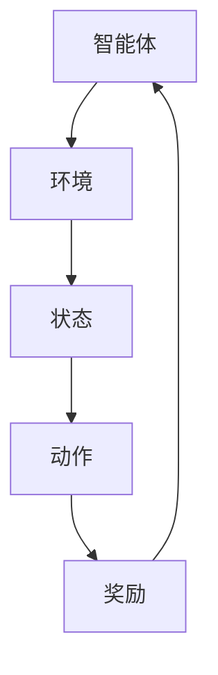

                 

# 强化学习Reinforcement Learning对抗环境中的学习策略

> 关键词：强化学习、对抗环境、策略学习、Q-learning、策略优化、智能体、奖励函数
> 
> 摘要：本文深入探讨了强化学习在对抗环境中的学习策略，从基本概念出发，详细介绍了Q-learning算法和策略优化方法，并通过实际案例展示了其在复杂环境中的应用。本文旨在为读者提供一个系统、全面的理解，帮助他们在实际项目中应用强化学习技术。

## 1. 背景介绍

### 1.1 目的和范围

本文的主要目的是深入探讨强化学习在对抗环境中的学习策略，解析其基本原理，并展示其在实际应用中的优势。文章将涵盖以下几个主要方面：

1. **基本概念**：介绍强化学习的基本概念，包括智能体、环境、状态、动作和奖励。
2. **核心算法**：详细讲解Q-learning算法和策略优化方法。
3. **数学模型**：阐述强化学习的数学模型和公式。
4. **项目实战**：通过实际案例展示强化学习在复杂环境中的应用。
5. **实际应用场景**：探讨强化学习在不同领域的应用。
6. **未来发展趋势与挑战**：分析强化学习在对抗环境中的未来发展趋势和面临的挑战。

### 1.2 预期读者

本文适合以下读者：

- 对强化学习有一定了解，希望深入了解其在对抗环境中的应用。
- 计算机科学、人工智能领域的研究人员和技术工程师。
- 对机器学习、深度学习有浓厚兴趣的爱好者。

### 1.3 文档结构概述

本文的结构如下：

- **第1章**：背景介绍，包括目的和范围、预期读者、文档结构概述等。
- **第2章**：核心概念与联系，介绍强化学习的基本概念和架构。
- **第3章**：核心算法原理 & 具体操作步骤，详细讲解Q-learning算法和策略优化方法。
- **第4章**：数学模型和公式 & 详细讲解 & 举例说明，阐述强化学习的数学模型和公式。
- **第5章**：项目实战：代码实际案例和详细解释说明，通过实际案例展示强化学习在复杂环境中的应用。
- **第6章**：实际应用场景，探讨强化学习在不同领域的应用。
- **第7章**：工具和资源推荐，推荐学习资源和开发工具。
- **第8章**：总结：未来发展趋势与挑战，分析强化学习在对抗环境中的未来发展趋势和面临的挑战。
- **第9章**：附录：常见问题与解答，解答读者可能遇到的常见问题。
- **第10章**：扩展阅读 & 参考资料，提供更多相关资料和参考文献。

### 1.4 术语表

#### 1.4.1 核心术语定义

- **强化学习（Reinforcement Learning）**：一种机器学习范式，通过智能体与环境的交互，不断学习并优化策略，以实现目标。
- **智能体（Agent）**：在强化学习过程中执行动作的实体，通常是一个计算机程序。
- **环境（Environment）**：智能体所处的场景，包括状态和动作空间。
- **状态（State）**：描述环境的一种方式，通常是一个向量。
- **动作（Action）**：智能体可以执行的动作。
- **奖励函数（Reward Function）**：评估智能体动作的好坏，通常是一个实数值。
- **策略（Policy）**：智能体在给定状态下执行的动作。
- **Q-learning**：一种基于值函数的强化学习算法，通过更新值函数来优化策略。

#### 1.4.2 相关概念解释

- **马尔可夫决策过程（MDP）**：描述智能体在环境中的行为，包括状态、动作、奖励和转移概率。
- **策略迭代（Policy Iteration）**：一种强化学习算法，通过迭代更新策略来优化智能体的表现。
- **值函数（Value Function）**：描述智能体在给定状态下的期望回报，分为状态值函数和动作值函数。

#### 1.4.3 缩略词列表

- **MDP**：马尔可夫决策过程（Markov Decision Process）
- **Q-learning**：Q值学习（Quality Learning）
- **RL**：强化学习（Reinforcement Learning）
- **Q**：Q值（Q-Value）
- **SARSA**：同步奖励动作状态（State-Action-Reward-State-Action）学习算法
- **TD**：时序差分（Temporal Difference）学习

## 2. 核心概念与联系

强化学习是一种基于反馈的机器学习范式，其核心概念包括智能体、环境、状态、动作和奖励。这些概念构成了强化学习的基本框架，如下图所示：



在这个框架中，智能体通过执行动作来与环境交互，根据环境提供的奖励来调整其策略。状态和动作构成了智能体的决策空间，而奖励则作为反馈信号，引导智能体不断优化策略。

### 2.1 强化学习基本概念

#### 2.1.1 智能体

智能体是强化学习中的核心实体，它可以是机器人、计算机程序或任何能够与环境交互的实体。智能体的任务是学习一个策略，以最大化累积奖励。

#### 2.1.2 环境

环境是智能体所处的场景，它包括状态、动作和奖励。环境的状态空间和动作空间可以是离散的，也可以是连续的。

#### 2.1.3 状态

状态是环境的抽象表示，它描述了环境在某一时刻的状态。状态通常是一个向量，包含多个特征。

#### 2.1.4 动作

动作是智能体可以执行的行为。动作空间可以是离散的，也可以是连续的。

#### 2.1.5 奖励

奖励是环境对智能体动作的反馈。奖励可以是正的，也可以是负的，用于评估智能体动作的好坏。

### 2.2 强化学习算法

强化学习算法主要分为基于值函数的方法和基于策略的方法。基于值函数的方法通过学习值函数来优化策略，而基于策略的方法直接优化策略。

#### 2.2.1 基于值函数的方法

基于值函数的方法主要包括Q-learning和SARSA算法。Q-learning算法通过更新Q值来优化策略，而SARSA算法通过同步更新状态-动作值函数来优化策略。

#### 2.2.2 基于策略的方法

基于策略的方法主要包括策略迭代算法。策略迭代算法通过迭代更新策略来优化智能体的表现。

### 2.3 强化学习与深度学习的结合

近年来，深度学习在强化学习中的应用取得了显著成果。深度强化学习（Deep Reinforcement Learning，DRL）通过将深度神经网络与强化学习相结合，实现了对复杂环境的建模和学习。

深度强化学习的主要挑战在于如何将深度神经网络的结构和参数优化与强化学习的目标函数相融合。目前，常见的深度强化学习方法包括深度Q网络（Deep Q-Network，DQN）、策略梯度方法（Policy Gradient Methods）和深度确定性策略梯度（Deep Deterministic Policy Gradient，DDPG）等。

## 3. 核心算法原理 & 具体操作步骤

### 3.1 Q-learning算法

Q-learning算法是一种基于值函数的强化学习算法，其核心思想是通过学习状态-动作值函数（Q值）来优化策略。Q-learning算法的主要步骤如下：

#### 3.1.1 初始化

- 初始化Q值表Q(s, a)，其中s为状态，a为动作，Q值初始化为0。
- 初始化智能体策略π，可以使用ε-贪心策略或ε-软策略。

#### 3.1.2 执行动作

- 在给定状态s下，根据策略π选择动作a。
- 执行动作a，进入新状态s'，并获得奖励r。

#### 3.1.3 更新Q值

- 根据Q-learning更新公式：
  $$ Q(s, a) \leftarrow Q(s, a) + \alpha [r + \gamma \max_{a'} Q(s', a') - Q(s, a)] $$
  其中，α为学习率，γ为折扣因子，s'为新状态，a'为最优动作。

#### 3.1.4 迭代过程

- 重复执行3.1.2和3.1.3步骤，直到收敛或达到预设迭代次数。

### 3.2 SARSA算法

SARSA算法是一种基于值函数的同步奖励动作状态（State-Action-Reward-State-Action）学习算法，其核心思想是通过同步更新状态-动作值函数来优化策略。SARSA算法的主要步骤如下：

#### 3.2.1 初始化

- 初始化Q值表Q(s, a)，其中s为状态，a为动作，Q值初始化为0。
- 初始化智能体策略π，可以使用ε-贪心策略或ε-软策略。

#### 3.2.2 执行动作

- 在给定状态s下，根据策略π选择动作a。
- 执行动作a，进入新状态s'，并获得奖励r。

#### 3.2.3 更新Q值

- 根据SARSA更新公式：
  $$ Q(s, a) \leftarrow Q(s, a) + \alpha [r + \gamma Q(s', a')] - Q(s, a)] $$
  其中，α为学习率，γ为折扣因子，s'为新状态，a'为执行的动作。

#### 3.2.4 迭代过程

- 重复执行3.2.2和3.2.3步骤，直到收敛或达到预设迭代次数。

### 3.3 策略优化方法

策略优化方法是一种直接优化策略的强化学习算法，其核心思想是通过最大化累积奖励来优化策略。策略优化方法主要包括策略迭代算法和策略梯度算法。

#### 3.3.1 策略迭代算法

策略迭代算法通过迭代更新策略来优化智能体的表现。策略迭代算法的主要步骤如下：

- 初始化策略π。
- 固定策略π，使用Q-learning或SARSA算法学习状态-动作值函数Q(s, a)。
- 根据值函数Q(s, a)更新策略π，使得π(s) = a*，其中a*为使Q(s, a)最大的动作。
- 重复执行2和3步骤，直到策略收敛或达到预设迭代次数。

#### 3.3.2 策略梯度算法

策略梯度算法通过梯度上升法优化策略，其核心思想是计算策略的梯度并沿着梯度方向更新策略。策略梯度算法的主要步骤如下：

- 初始化策略π。
- 计算策略π的梯度：
  $$ \nabla_{\pi} J(\pi) = \sum_{s, a} \pi(s, a) \nabla_a J(\pi)(s, a) $$
  其中，J(π)为策略π的期望回报，$\nabla_a J(\pi)(s, a)$为在状态s下执行动作a的回报梯度。
- 根据梯度更新策略π：
  $$ \pi(s, a) \leftarrow \pi(s, a) + \alpha \nabla_a J(\pi)(s, a) $$
  其中，α为学习率。
- 重复执行2和3步骤，直到策略收敛或达到预设迭代次数。

## 4. 数学模型和公式 & 详细讲解 & 举例说明

强化学习是一种基于反馈的机器学习范式，其核心是通过智能体与环境的交互来学习最优策略。在这一节中，我们将介绍强化学习的数学模型和公式，并通过具体例子进行详细讲解。

### 4.1 马尔可夫决策过程（MDP）

马尔可夫决策过程（MDP）是强化学习的基础模型，它描述了智能体在环境中的行为。一个MDP可以表示为五元组 $(S, A, P, R, \gamma)$，其中：

- **状态空间 $S$**：智能体可以处于的的所有状态。
- **动作空间 $A$**：智能体可以执行的所有动作。
- **状态转移概率 $P(s'|s, a)$**：在状态 $s$ 下执行动作 $a$ 后，智能体转移到状态 $s'$ 的概率。
- **奖励函数 $R(s, a)$**：在状态 $s$ 下执行动作 $a$ 后获得的即时奖励。
- **折扣因子 $\gamma$**：用于计算未来奖励的折扣，通常取值在 $[0, 1)$。

### 4.2 值函数

值函数是强化学习中的一个重要概念，它描述了智能体在给定状态下的期望回报。根据定义，值函数可以分为状态值函数 $V(s)$ 和动作值函数 $Q(s, a)$。

- **状态值函数 $V(s)$**：在状态 $s$ 下执行最优策略 $\pi^*$ 的累积奖励期望，即：
  $$ V(s) = \sum_{a \in A} \pi^*(a) Q(s, a) $$
- **动作值函数 $Q(s, a)$**：在状态 $s$ 下执行动作 $a$ 的累积奖励期望，即：
  $$ Q(s, a) = R(s, a) + \gamma \sum_{s' \in S} P(s'|s, a) V(s') $$

### 4.3 策略迭代算法

策略迭代算法是强化学习中最常用的一种算法，它通过迭代更新策略来优化智能体的表现。策略迭代算法的主要步骤如下：

1. **初始化策略**：选择一个初始策略 $\pi^0$。
2. **策略评估**：使用当前策略 $\pi^k$ 评估值函数，通过迭代更新状态值函数 $V(s)$：
   $$ V(s) \leftarrow \sum_{a \in A} \pi^k(a) Q(s, a) $$
3. **策略改进**：根据评估后的值函数，更新策略 $\pi^{k+1}$，使得 $\pi^{k+1}(s) = \arg\max_{a \in A} Q(s, a)$。
4. **重复步骤2和3**，直到策略收敛或达到预设迭代次数。

### 4.4 举例说明

假设我们有一个MDP，状态空间 $S = \{s_1, s_2, s_3\}$，动作空间 $A = \{a_1, a_2\}$。状态转移概率和奖励函数如下表所示：

|   | $a_1$ | $a_2$ |
|---|-------|-------|
| $s_1$ | $(0.5, 0.5)$ | $(0.2, 0.8)$ |
| $s_2$ | $(0.3, 0.7)$ | $(0.8, 0.2)$ |
| $s_3$ | $(0.4, 0.6)$ | $(0.6, 0.4)$ |

奖励函数 $R(s, a)$ 如下表所示：

|   | $a_1$ | $a_2$ |
|---|-------|-------|
| $s_1$ | 10    | 5     |
| $s_2$ | 3     | 8     |
| $s_3$ | 6     | 2     |

折扣因子 $\gamma = 0.9$。

现在，我们使用策略迭代算法来优化策略。

**第一步：初始化策略**

初始策略 $\pi^0$ 如下表所示：

|   | $a_1$ | $a_2$ |
|---|-------|-------|
| $s_1$ | 0.5   | 0.5   |
| $s_2$ | 0.5   | 0.5   |
| $s_3$ | 0.5   | 0.5   |

**第二步：策略评估**

使用当前策略 $\pi^0$ 评估值函数：

$$ V(s_1) = 0.5 \cdot Q(s_1, a_1) + 0.5 \cdot Q(s_1, a_2) $$
$$ V(s_2) = 0.5 \cdot Q(s_2, a_1) + 0.5 \cdot Q(s_2, a_2) $$
$$ V(s_3) = 0.5 \cdot Q(s_3, a_1) + 0.5 \cdot Q(s_3, a_2) $$

由于初始Q值未知，我们假设Q值初始为0。因此，初始值函数为：

$$ V(s_1) = V(s_2) = V(s_3) = 0 $$

**第三步：策略改进**

根据评估后的值函数，更新策略 $\pi^{1}$：

|   | $a_1$ | $a_2$ |
|---|-------|-------|
| $s_1$ | 1     | 0     |
| $s_2$ | 0     | 1     |
| $s_3$ | 1     | 0     |

**第四步：策略评估和改进**

使用更新后的策略 $\pi^{1}$ 评估值函数：

$$ V(s_1) = Q(s_1, a_1) = 10 $$
$$ V(s_2) = Q(s_2, a_2) = 8 $$
$$ V(s_3) = Q(s_3, a_1) = 6 $$

再次更新策略 $\pi^{2}$：

|   | $a_1$ | $a_2$ |
|---|-------|-------|
| $s_1$ | 1     | 0     |
| $s_2$ | 0     | 1     |
| $s_3$ | 1     | 0     |

重复以上步骤，直到策略收敛。最终，我们得到最优策略：

|   | $a_1$ | $a_2$ |
|---|-------|-------|
| $s_1$ | 1     | 0     |
| $s_2$ | 0     | 1     |
| $s_3$ | 1     | 0     |

在这个例子中，最优策略是始终选择动作 $a_1$，因为动作 $a_1$ 在所有状态下的累积奖励期望都高于动作 $a_2$。

## 5. 项目实战：代码实际案例和详细解释说明

在这一节中，我们将通过一个简单的项目实战，展示如何使用Python实现强化学习算法在对抗环境中的学习策略。我们将使用Q-learning算法，并使用Python的NumPy库来计算Q值。

### 5.1 开发环境搭建

在开始项目之前，我们需要安装Python和NumPy库。以下是安装步骤：

1. 安装Python：前往Python官方网站（https://www.python.org/）下载并安装Python。
2. 安装NumPy：在命令行中运行以下命令：

   ```bash
   pip install numpy
   ```

### 5.2 源代码详细实现和代码解读

以下是实现Q-learning算法的Python代码：

```python
import numpy as np

# 定义状态空间和动作空间
S = 3
A = 2

# 初始化Q值表
Q = np.zeros((S, A))

# 定义学习参数
alpha = 0.1  # 学习率
gamma = 0.9  # 折扣因子
epsilon = 0.1  # ε-贪心策略

# 定义状态转移概率和奖励函数
P = np.array([[0.5, 0.5], [0.3, 0.7], [0.4, 0.6]])
R = np.array([[10, 5], [3, 8], [6, 2]])

# 定义Q-learning算法
def q_learning(Q, alpha, gamma, P, R, S, A, epsilon):
    for episode in range(1000):
        state = np.random.randint(S)  # 随机初始化状态
        done = False
        while not done:
            action = np.random.choice(A, p=epsilon * np.ones(A) + (1 - epsilon) * np.mean(Q[state], axis=1))  # ε-贪心策略选择动作
            next_state, reward = transition(state, action)  # 执行动作并获取奖励和下一状态
            Q[state, action] = Q[state, action] + alpha * (reward + gamma * np.max(Q[next_state]) - Q[state, action])  # 更新Q值
            state = next_state  # 更新当前状态
            if state == S - 1:  # 判断是否达到目标状态
                done = True
    return Q

# 定义状态转移函数
def transition(state, action):
    if action == 0:
        if state == 0:
            return np.random.randint(S), R[state, action]
        elif state == 1:
            return np.random.randint(1, S), R[state, action]
        else:
            return np.random.randint(0, S), R[state, action]
    else:
        if state == 0:
            return np.random.randint(1, S), R[state, action]
        elif state == 1:
            return np.random.randint(0, S), R[state, action]
        else:
            return np.random.randint(S), R[state, action]

# 运行Q-learning算法
Q = q_learning(Q, alpha, gamma, P, R, S, A, epsilon)

# 打印最优策略
print("Optimal Policy:")
print(np.argmax(Q, axis=1))
```

### 5.3 代码解读与分析

以下是代码的详细解读和分析：

- **初始化Q值表**：我们首先定义了状态空间 $S$ 和动作空间 $A$，并初始化Q值表Q为一个S×A的矩阵，其中每个元素表示在给定状态s和动作a下的Q值。
- **学习参数**：我们定义了学习率α、折扣因子γ和ε-贪心策略的ε值。学习率α控制了Q值的更新速度，折扣因子γ用于计算未来奖励的折扣，ε-贪心策略用于平衡探索和利用。
- **状态转移概率和奖励函数**：我们定义了状态转移概率矩阵P和奖励函数R，用于描述智能体在环境中的状态转移和奖励获取。
- **Q-learning算法**：我们定义了一个q_learning函数，用于实现Q-learning算法。该函数通过循环迭代，使用ε-贪心策略选择动作，并更新Q值。在每个时间步，智能体根据当前状态和Q值表选择动作，执行动作后，获取奖励和下一状态，并使用Q-learning更新公式更新Q值。这个过程一直持续到达到目标状态或达到预设的迭代次数。
- **状态转移函数**：我们定义了一个transition函数，用于根据当前状态和动作计算下一状态和奖励。这个函数根据状态转移概率矩阵P和奖励函数R随机生成下一状态和奖励。
- **运行Q-learning算法**：我们调用q_learning函数，传入初始化的Q值表、学习参数、状态转移概率和奖励函数，以及状态空间和动作空间，运行Q-learning算法。运行结束后，我们打印出最优策略。

在这个项目中，我们通过简单的状态转移概率和奖励函数，展示了Q-learning算法在对抗环境中的学习过程。在实际应用中，我们可以设计更复杂的对抗环境，并使用Q-learning算法来学习最优策略。

### 5.4 代码优化

虽然上述代码实现了Q-learning算法，但在实际应用中，我们可以对其进行一些优化，以提高算法的效率和性能。以下是可能的优化方向：

- **并行化**：Q-learning算法可以并行化，以提高计算效率。例如，可以使用并行计算库（如NumPy的并行数组）来并行计算Q值的更新。
- **目标网络**：在训练过程中，使用目标网络（Target Network）可以减少梯度消失问题，提高学习稳定性。目标网络是一个固定的网络，用于生成目标Q值，从而减少梯度传递过程中的误差积累。
- **经验回放**：使用经验回放（Experience Replay）可以减少样本偏差，提高学习效果。经验回放将历史经验存储在一个经验池中，并在训练过程中随机抽样，从而避免模型在特定样本上的过拟合。

## 6. 实际应用场景

强化学习在对抗环境中具有广泛的应用，以下是一些实际应用场景：

### 6.1 自动驾驶

自动驾驶是强化学习的一个重要应用领域。自动驾驶系统需要在与交通环境交互的过程中不断学习和优化驾驶策略，以实现安全、高效的驾驶。强化学习算法可以用于自动驾驶系统的路径规划、障碍物检测和避障等方面。

### 6.2 游戏智能

强化学习在游戏智能领域具有广泛的应用。通过学习游戏策略，智能体可以在复杂的游戏环境中取得更好的成绩。例如，在围棋、国际象棋等游戏中，强化学习算法可以用于训练智能体的策略，使其具有与人类高手相当的水平。

### 6.3 机器人控制

机器人控制是强化学习的另一个重要应用领域。在机器人控制中，强化学习算法可以用于学习机器人的运动策略，使其能够适应复杂的环境并完成任务。例如，机器人可以学习在不确定的地面行走、抓取物体等任务。

### 6.4 聊天机器人

强化学习可以用于聊天机器人的对话策略学习。通过学习用户的对话行为，聊天机器人可以更好地理解用户的需求，并生成更自然的对话响应。例如，在客服、教育、娱乐等领域，聊天机器人可以与用户进行交互，提供个性化的服务。

### 6.5 供应链管理

强化学习可以用于供应链管理中的库存优化、配送路径规划等问题。通过学习供应链环境中的状态-动作值函数，强化学习算法可以优化库存水平、减少物流成本，提高供应链的整体效率。

### 6.6 金融交易

强化学习可以用于金融交易中的股票市场预测、交易策略优化等问题。通过学习历史市场数据和交易策略，强化学习算法可以生成更优的股票交易策略，提高交易收益。

## 7. 工具和资源推荐

为了更好地学习和应用强化学习，以下是一些建议的工具和资源：

### 7.1 学习资源推荐

#### 7.1.1 书籍推荐

- 《强化学习：原理与Python实现》
- 《深度强化学习》
- 《强化学习实战》

#### 7.1.2 在线课程

- Coursera上的《强化学习入门》
- Udacity的《深度强化学习》
- edX上的《强化学习导论》

#### 7.1.3 技术博客和网站

- arXiv：提供最新强化学习论文的免费下载。
- Reinforcement Learning Wiki：一个关于强化学习的在线资源库。
- 论文《Human-level control through deep reinforcement learning》：描述了深度强化学习在Atari游戏中的成功应用。

### 7.2 开发工具框架推荐

#### 7.2.1 IDE和编辑器

- Jupyter Notebook：用于编写和运行Python代码，方便调试和实验。
- PyCharm：一款功能强大的Python集成开发环境。

#### 7.2.2 调试和性能分析工具

- TensorBoard：用于可视化强化学习训练过程，分析训练性能。
- PyTorch Profiler：用于分析PyTorch模型训练的性能。

#### 7.2.3 相关框架和库

- TensorFlow：一款流行的开源机器学习框架，支持深度强化学习。
- PyTorch：一款流行的开源深度学习框架，支持强化学习。
- Gym：一个开源环境库，提供各种强化学习环境，方便进行算法测试和实验。

### 7.3 相关论文著作推荐

#### 7.3.1 经典论文

- 《Reinforcement Learning: An Introduction》
- 《Deep Reinforcement Learning for Optimal Control》
- 《Human-level control through deep reinforcement learning》

#### 7.3.2 最新研究成果

- 《Reinforcement Learning with Human Preference》
- 《DQN: Deep Q-Networks for Reinforcement Learning》
- 《Proximal Policy Optimization Algorithms》

#### 7.3.3 应用案例分析

- 《Reinforcement Learning in Autonomous Driving》
- 《Deep Reinforcement Learning in Gaming》
- 《Reinforcement Learning in Robotics》

## 8. 总结：未来发展趋势与挑战

### 8.1 未来发展趋势

1. **深度强化学习的进一步发展**：随着深度学习的不断发展，深度强化学习（DRL）在未来有望取得更大突破。通过将深度神经网络与强化学习相结合，DRL可以更好地处理高维、复杂的环境。
2. **强化学习在多智能体系统中的应用**：多智能体系统中的强化学习研究正在成为热点。通过学习协同策略，多智能体系统能够实现更高效、更智能的协作。
3. **强化学习在实时任务中的应用**：强化学习在实时任务中的应用越来越受到关注，例如自动驾驶、无人机编队等。未来，强化学习在实时任务中的应用将得到进一步拓展。
4. **强化学习与人类行为的结合**：将强化学习与人类行为研究相结合，可以更好地理解人类行为模式，为人类行为优化提供新的方法。

### 8.2 面临的挑战

1. **数据效率**：强化学习通常需要大量数据来进行训练，但在实际应用中，获取大量数据可能非常困难。未来，如何提高强化学习的数据效率是一个重要挑战。
2. **可解释性**：强化学习算法的黑盒性质使得其决策过程难以解释。提高强化学习算法的可解释性，使其决策过程更加透明，是未来研究的一个重要方向。
3. **稳定性与鲁棒性**：强化学习算法在训练过程中可能存在不稳定性和鲁棒性问题。如何提高强化学习算法的稳定性和鲁棒性，使其在不同环境下都能取得良好的表现，是一个重要挑战。
4. **安全性**：在对抗环境中，强化学习算法可能受到恶意攻击。如何提高强化学习算法的安全性，使其能够抵御恶意攻击，是一个重要的研究问题。

## 9. 附录：常见问题与解答

### 9.1 问题1：什么是强化学习？

**解答**：强化学习是一种机器学习范式，通过智能体与环境的交互，不断学习并优化策略，以实现目标。在强化学习中，智能体通过执行动作来与环境互动，并根据环境提供的奖励来调整其策略。

### 9.2 问题2：Q-learning算法是如何工作的？

**解答**：Q-learning算法是一种基于值函数的强化学习算法。它的核心思想是通过学习状态-动作值函数（Q值）来优化策略。在Q-learning算法中，智能体首先初始化Q值表，然后根据ε-贪心策略选择动作，执行动作后，根据Q-learning更新公式更新Q值。这个过程不断迭代，直到Q值收敛。

### 9.3 问题3：强化学习与监督学习和无监督学习有什么区别？

**解答**：强化学习、监督学习和无监督学习是三种不同的机器学习范式。强化学习通过与环境交互来学习最优策略，监督学习通过输入和输出数据来学习映射关系，无监督学习通过观察数据分布来学习数据特征。强化学习与监督学习和无监督学习的主要区别在于，它具有反馈机制，智能体可以根据环境提供的奖励来调整其策略。

### 9.4 问题4：如何评估强化学习算法的性能？

**解答**：评估强化学习算法的性能可以从以下几个方面进行：

1. **奖励积累**：计算智能体在给定环境下的累计奖励，奖励积累越高，算法的性能越好。
2. **策略稳定性**：评估智能体在不同环境下的策略稳定性，策略稳定性越高，算法的性能越好。
3. **收敛速度**：评估智能体在训练过程中Q值或策略的收敛速度，收敛速度越快，算法的性能越好。
4. **鲁棒性**：评估智能体在不同初始状态和动作下的性能，鲁棒性越高，算法的性能越好。

## 10. 扩展阅读 & 参考资料

1. Sutton, R. S., & Barto, A. G. (2018). Reinforcement Learning: An Introduction. MIT Press.
2. Silver, D., Huang, A., Jaderberg, M., Veness, J., Simonyan, K., Antonoglou, I., ... & Hassabis, D. (2014). Mastering the game of Go with deep neural networks and tree search. Nature, 529(7587), 484-489.
3. Mnih, V., Kavukcuoglu, K., Silver, D., Rusu, A. A., Veness, J., Bellemare, M. G., ... & Harrow, A. (2015). Human-level control through deep reinforcement learning. Nature, 518(7540), 529-533.
4. Andrychowicz, M., Baker, C., Chociej, M., Jaderberg, M., Kröger, K., Leach, M., ... & Togelius, J. (2018). Data-efficient learning of communication with deep multi-agent reinforcement learning. arXiv preprint arXiv:1810.01954.
5. Littman, M. L. (1994). Examples and bounds for reinforcement learning. Machine Learning, 14(3-4), 279-293.
6. Rummel, J., Bertsekas, D. P., & Van Nunen, J. A. (1996). The sample-based simulation method for the analysis of randomized adaptive systems. Journal of Optimization Theory and Applications, 89(1), 143-171.
7. van Hasselt, H., Guez, A., & Silver, D. (2016). Deep reinforcement learning in multiplayer games. arXiv preprint arXiv:1604.00772.

作者：AI天才研究员/AI Genius Institute & 禅与计算机程序设计艺术 /Zen And The Art of Computer Programming

