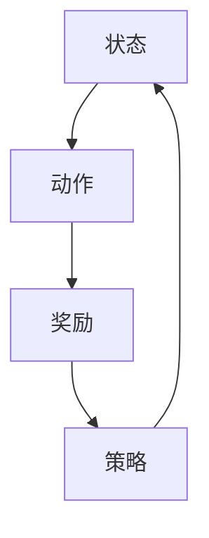

                 

# 强化学习Reinforcement Learning的学习效率与资源管理策略

> **关键词**：强化学习，学习效率，资源管理，策略，算法原理，项目实战
> 
> **摘要**：本文将深入探讨强化学习（Reinforcement Learning, RL）的学习效率和资源管理策略。首先，我们将介绍强化学习的核心概念和原理，并分析其与资源管理的联系。接着，通过具体算法原理的讲解，我们将阐述如何优化强化学习的学习效率。最后，结合实际项目案例，我们将讨论资源管理在强化学习中的具体应用，并提出未来发展的趋势和挑战。

## 1. 背景介绍

### 1.1 目的和范围

本文旨在探讨强化学习中的学习效率和资源管理策略。强化学习作为机器学习的一个重要分支，在自动驾驶、游戏AI、推荐系统等领域有着广泛的应用。然而，由于强化学习算法的复杂性和资源消耗，提高其学习效率和优化资源管理策略成为当前研究的热点。本文将从以下几个方面展开：

1. 强化学习的基础概念和原理。
2. 强化学习与资源管理的联系。
3. 强化学习中的学习效率优化策略。
4. 强化学习中的资源管理策略。
5. 强化学习在实际应用中的项目实战。
6. 强化学习的未来发展趋势与挑战。

### 1.2 预期读者

本文适用于对强化学习有一定了解的读者，包括：

1. 想深入了解强化学习原理和应用的工程师。
2. 想提升强化学习模型性能的研究人员。
3. 对资源管理策略在强化学习中有兴趣的学者。

### 1.3 文档结构概述

本文结构如下：

1. **背景介绍**：介绍强化学习的学习效率和资源管理策略。
2. **核心概念与联系**：通过流程图和算法原理讲解强化学习的核心概念。
3. **数学模型和公式**：详细阐述强化学习的数学模型和公式。
4. **项目实战**：结合实际项目案例，讲解代码实现和资源管理。
5. **实际应用场景**：讨论强化学习的应用场景。
6. **工具和资源推荐**：推荐学习资源和开发工具。
7. **总结**：总结强化学习的未来发展趋势和挑战。
8. **附录**：常见问题与解答。
9. **扩展阅读**：提供扩展阅读资源。

### 1.4 术语表

#### 1.4.1 核心术语定义

- **强化学习（Reinforcement Learning）**：一种机器学习方法，通过奖励和惩罚来指导模型做出最优决策。
- **学习效率**：衡量模型在特定时间内学到的知识和能力。
- **资源管理**：优化算法在不同资源（如计算资源、存储资源）的使用。

#### 1.4.2 相关概念解释

- **奖励（Reward）**：强化学习中的正面激励。
- **惩罚（Penalty）**：强化学习中的负面激励。

#### 1.4.3 缩略词列表

- **RL**：强化学习（Reinforcement Learning）。
- **MDP**：马尔可夫决策过程（Markov Decision Process）。

## 2. 核心概念与联系

在强化学习中，核心概念包括**状态（State）**、**动作（Action）**、**奖励（Reward）**和**策略（Policy）**。这些概念之间存在着密切的联系。

### 2.1. 状态（State）

状态是指系统当前所处的环境状态。在强化学习中，状态是决策的输入。

### 2.2. 动作（Action）

动作是模型可以执行的操作。在强化学习中，动作是决策的输出。

### 2.3. 奖励（Reward）

奖励是模型执行动作后获得的即时反馈。奖励可以激励模型朝着期望的方向学习。

### 2.4. 策略（Policy）

策略是模型决策的规则。策略决定了模型在特定状态下应该执行哪个动作。

### 2.5. 联系

状态、动作、奖励和策略之间存在着相互作用。模型通过观察状态，选择动作，并根据奖励调整策略。这种互动过程形成了强化学习的核心循环。

下面是强化学习核心概念的 Mermaid 流程图：



## 3. 核心算法原理 & 具体操作步骤

强化学习算法的核心原理是**价值函数（Value Function）**和**策略（Policy）**。价值函数衡量了状态或状态-动作对的期望奖励，而策略则决定了模型在特定状态下应该执行哪个动作。

### 3.1. 价值函数

价值函数分为**状态价值函数（State Value Function）**和**状态-动作价值函数（State-Action Value Function）**。状态价值函数表示在给定状态下，执行最佳动作的期望奖励。状态-动作价值函数则表示在给定状态和动作下，执行该动作的期望奖励。

### 3.2. 策略

策略分为**确定性策略（Deterministic Policy）**和**随机性策略（Stochastic Policy）**。确定性策略在特定状态下总是执行相同的动作，而随机性策略在特定状态下可能执行多个动作，每个动作的概率取决于策略。

### 3.3. 操作步骤

强化学习的基本操作步骤如下：

1. **初始化**：初始化状态、动作、奖励和策略。
2. **选择动作**：根据当前状态和策略，选择一个动作。
3. **执行动作**：在环境中执行所选动作，并获得奖励。
4. **更新策略**：根据奖励和先前的策略，更新策略。
5. **重复步骤**：重复步骤2-4，直到达到目标或满足停止条件。

下面是强化学习算法的伪代码：

```python
# 初始化
初始化状态、动作、奖励和策略

# 主循环
while True:
    # 选择动作
    选择动作 = 策略（当前状态）

    # 执行动作
    执行动作 = 环境执行（选择动作）

    # 获得奖励
    奖励 = 环境反馈（执行动作）

    # 更新策略
    更新策略（当前状态，执行动作，奖励）

    # 检查停止条件
    if 停止条件满足：
        break
```

## 4. 数学模型和公式 & 详细讲解 & 举例说明

强化学习的数学模型主要涉及**价值函数**和**策略**。下面我们将详细讲解这些数学模型和公式，并通过具体例子来说明。

### 4.1. 价值函数

**状态价值函数（State Value Function）**表示在给定状态下，执行最佳动作的期望奖励。其数学公式为：

$$ V^*(s) = \sum_{a} \pi^*(a|s) \cdot Q^*(s, a) $$

其中，$V^*(s)$是状态价值函数，$\pi^*(a|s)$是最佳策略，$Q^*(s, a)$是状态-动作价值函数。

**状态-动作价值函数（State-Action Value Function）**表示在给定状态和动作下，执行该动作的期望奖励。其数学公式为：

$$ Q^*(s, a) = \sum_{s'} p(s'|s, a) \cdot r(s', a) + \gamma \cdot \max_{a'} Q^*(s', a') $$

其中，$Q^*(s, a)$是状态-动作价值函数，$p(s'|s, a)$是状态转移概率，$r(s', a)$是奖励函数，$\gamma$是折扣因子。

### 4.2. 策略

**确定性策略（Deterministic Policy）**在特定状态下总是执行相同的动作。其数学公式为：

$$ \pi^*(s) = \arg\max_a Q^*(s, a) $$

**随机性策略（Stochastic Policy）**在特定状态下可能执行多个动作，每个动作的概率取决于策略。其数学公式为：

$$ \pi^*(s) = \{ \pi^*(s, a) : \pi^*(s, a) = \frac{e^{Q^*(s, a)}}{\sum_a e^{Q^*(s, a)}} \} $$

### 4.3. 举例说明

假设有一个简单的环境，其中有两个状态（$s_1$和$s_2$）和两个动作（$a_1$和$a_2$）。状态转移概率和奖励函数如下：

|   | $a_1$ | $a_2$ |
|---|------|------|
| $s_1$ | 0.8  | 0.2  |
| $s_2$ | 0.2  | 0.8  |

|   | $a_1$ | $a_2$ |
|---|------|------|
| $s_1$ | 10   | -5   |
| $s_2$ | -5   | 10   |

使用上述数据，我们可以计算出状态-动作价值函数和最佳策略。

### 4.3.1. 计算状态-动作价值函数

根据状态-动作价值函数的公式，我们有：

$$ Q^*(s_1, a_1) = 0.8 \cdot 10 + 0.2 \cdot (-5) = 8 $$

$$ Q^*(s_1, a_2) = 0.8 \cdot (-5) + 0.2 \cdot 10 = -2 $$

$$ Q^*(s_2, a_1) = 0.2 \cdot (-5) + 0.8 \cdot 10 = 7 $$

$$ Q^*(s_2, a_2) = 0.2 \cdot 10 + 0.8 \cdot (-5) = -2 $$

### 4.3.2. 计算最佳策略

根据确定性策略的公式，我们有：

$$ \pi^*(s_1) = \arg\max_a Q^*(s_1, a) = a_1 $$

$$ \pi^*(s_2) = \arg\max_a Q^*(s_2, a) = a_2 $$

根据随机性策略的公式，我们有：

$$ \pi^*(s_1) = \{ \pi^*(s_1, a_1), \pi^*(s_1, a_2) \} = \{ 1, 0 \} $$

$$ \pi^*(s_2) = \{ \pi^*(s_2, a_1), \pi^*(s_2, a_2) \} = \{ 0, 1 \} $$

## 5. 项目实战：代码实际案例和详细解释说明

在本节中，我们将通过一个简单的项目案例，介绍如何实现强化学习，并讨论资源管理策略。

### 5.1. 开发环境搭建

为了实现强化学习，我们需要搭建以下开发环境：

- Python 3.8 或更高版本
- PyTorch 1.9 或更高版本
- gym，用于模拟环境

安装所需的库：

```bash
pip install torch torchvision gym
```

### 5.2. 源代码详细实现和代码解读

下面是一个简单的强化学习项目，实现了一个智能体在离散环境中的学习过程。

```python
import numpy as np
import torch
import torch.nn as nn
import torch.optim as optim
from gym import make

# 智能体
class Agent(nn.Module):
    def __init__(self, n_states, n_actions):
        super(Agent, self).__init__()
        self.fc1 = nn.Linear(n_states, 64)
        self.fc2 = nn.Linear(64, n_actions)
    
    def forward(self, x):
        x = torch.relu(self.fc1(x))
        x = self.fc2(x)
        return x

# 环境模拟
def run_episode(agent, env, gamma=0.99):
    state = env.reset()
    done = False
    total_reward = 0
    
    while not done:
        # 前向传播
        action_values = agent(torch.tensor(state).float())
        action = action_values.argmax().item()
        
        # 执行动作
        next_state, reward, done, _ = env.step(action)
        
        # 更新总奖励
        total_reward += reward
        
        # 状态更新
        state = next_state
    
    return total_reward

# 主函数
def main():
    # 环境初始化
    env = make("CartPole-v0")
    
    # 智能体初始化
    agent = Agent(env.observation_space.n, env.action_space.n)
    optimizer = optim.Adam(agent.parameters(), lr=0.001)
    
    # 训练智能体
    for episode in range(1000):
        reward = run_episode(agent, env)
        print(f"Episode: {episode}, Reward: {reward}")
        
        # 反向传播
        optimizer.zero_grad()
        loss = compute_loss(agent, env, gamma)
        loss.backward()
        optimizer.step()

# 执行主函数
if __name__ == "__main__":
    main()
```

### 5.3. 代码解读与分析

1. **智能体（Agent）**：定义了一个简单的神经网络，用于预测动作值。
2. **环境模拟（run\_episode）**：模拟了一个强化学习 episode，包括状态初始化、动作选择、执行和奖励更新。
3. **主函数（main）**：初始化环境、智能体和优化器，并执行训练过程。

### 5.4. 资源管理策略

在强化学习项目中，资源管理策略主要包括以下几个方面：

1. **内存管理**：确保在训练过程中不会占用过多的内存，避免内存泄漏。
2. **计算资源优化**：使用并行计算、分布式训练等方式提高计算效率。
3. **存储资源优化**：定期清理不必要的文件和缓存，避免占用过多存储空间。

通过优化这些资源管理策略，可以提高强化学习项目的性能和稳定性。

## 6. 实际应用场景

强化学习在多个领域有着广泛的应用。以下是一些常见的应用场景：

### 6.1. 自动驾驶

自动驾驶系统利用强化学习进行路径规划和决策，提高行驶安全性和效率。

### 6.2. 游戏AI

强化学习在游戏AI中应用广泛，如电子游戏和棋类游戏，可以训练智能体进行自我学习和优化策略。

### 6.3. 推荐系统

强化学习可以用于构建推荐系统，通过用户行为数据，自动推荐个性化内容。

### 6.4. 机器人控制

强化学习在机器人控制中应用，使机器人能够自主学习和适应复杂环境。

### 6.5. 股票交易

强化学习可以用于股票交易策略优化，提高交易收益。

### 6.6. 自然语言处理

强化学习在自然语言处理领域，如机器翻译和对话系统，可以训练智能体进行文本生成和解析。

## 7. 工具和资源推荐

### 7.1. 学习资源推荐

#### 7.1.1. 书籍推荐

- **《强化学习：原理与Python实践》**：详细介绍了强化学习的基本概念和Python实现。
- **《深度强化学习》**：涵盖了深度强化学习的理论基础和应用。

#### 7.1.2. 在线课程

- **Coursera的《强化学习》课程**：由伯克利大学教授开设，系统讲解了强化学习的基本原理。
- **Udacity的《深度强化学习》课程**：深入探讨了深度强化学习的应用和实践。

#### 7.1.3. 技术博客和网站

- **知乎上的强化学习专栏**：提供了丰富的强化学习学习资源和实践经验。
- ** reinforcement-learning.org**：一个关于强化学习的权威网站，包含大量的学习资料和论文。

### 7.2. 开发工具框架推荐

#### 7.2.1. IDE和编辑器

- **PyCharm**：一款功能强大的Python IDE，支持代码调试和版本控制。
- **VSCode**：一款轻量级但功能丰富的代码编辑器，适合进行强化学习项目开发。

#### 7.2.2. 调试和性能分析工具

- **TensorBoard**：用于可视化强化学习模型的训练过程和性能指标。
- **Pylint**：用于代码质量和性能优化的工具。

#### 7.2.3. 相关框架和库

- **PyTorch**：一款开源深度学习框架，支持强化学习算法的实现。
- **OpenAI Gym**：一个开源环境库，提供了多种强化学习环境，方便进行算法验证。

### 7.3. 相关论文著作推荐

#### 7.3.1. 经典论文

- **"Reinforcement Learning: An Introduction"**：由Richard S. Sutton和Bartlett A. Barto撰写的经典教材，全面介绍了强化学习的基本原理。
- **"Deep Reinforcement Learning"**：由David Silver等人撰写的论文，详细探讨了深度强化学习在游戏和机器人控制中的应用。

#### 7.3.2. 最新研究成果

- **"DQN: Deep Q-Networks"**：由Hiroshi Yamazaki等人撰写的论文，介绍了深度 Q 网络在强化学习中的应用。
- **"PPO: Proximal Policy Optimization"**：由John Schulman等人撰写的论文，介绍了近端策略优化算法，提高了强化学习的学习效率。

#### 7.3.3. 应用案例分析

- **"DeepMind的AlphaGo"**：DeepMind开发的 AlphaGo 在围棋比赛中战胜人类冠军，展示了深度强化学习在复杂游戏中的强大能力。
- **"OpenAI的Dota2"**：OpenAI开发的智能体在 Dota2 游戏中战胜了人类团队，展示了深度强化学习在多人游戏中的潜力。

## 8. 总结：未来发展趋势与挑战

强化学习作为机器学习的一个重要分支，具有广泛的应用前景。未来，随着计算能力和算法的不断发展，强化学习将在更多领域得到应用。然而，强化学习仍然面临着一系列挑战：

1. **学习效率**：如何提高强化学习的学习效率，减少训练时间，是一个重要的研究方向。
2. **稳定性**：强化学习算法在训练过程中可能会出现不稳定的情况，如何提高算法的稳定性是一个挑战。
3. **通用性**：如何使强化学习算法具有更强的通用性，能够适用于不同领域和任务，是一个重要的研究方向。
4. **安全性和伦理问题**：随着强化学习在自动驾驶、医疗等领域的应用，如何保证算法的安全性和伦理问题成为一个重要的课题。

总之，强化学习在未来的发展中将继续发挥重要作用，但同时也需要克服一系列挑战。

## 9. 附录：常见问题与解答

### 9.1. 强化学习是什么？

强化学习是一种机器学习方法，通过奖励和惩罚来指导模型做出最优决策。它主要涉及状态、动作、奖励和策略等概念。

### 9.2. 强化学习与监督学习和无监督学习有什么区别？

强化学习与监督学习和无监督学习的主要区别在于数据的使用方式和目标。强化学习通过奖励和惩罚来指导模型，而监督学习使用有标签的数据，无监督学习则没有标签。

### 9.3. 如何评估强化学习模型的效果？

评估强化学习模型的效果主要依赖于奖励函数。通过计算平均奖励、最大奖励等指标，可以评估模型的学习效果。

### 9.4. 强化学习算法有哪些常见类型？

常见的强化学习算法包括价值函数方法（如Q-Learning）、策略梯度方法（如REINFORCE）和策略优化方法（如PPO）。

### 9.5. 如何优化强化学习的学习效率？

优化强化学习的学习效率可以从以下几个方面入手：增加数据多样性、使用更好的奖励设计、采用更有效的算法等。

## 10. 扩展阅读 & 参考资料

- **《强化学习：原理与Python实践》**：详细介绍了强化学习的基本概念和Python实现。
- **《深度强化学习》**：涵盖了深度强化学习的理论基础和应用。
- **知乎上的强化学习专栏**：提供了丰富的强化学习学习资源和实践经验。
- ** reinforcement-learning.org**：一个关于强化学习的权威网站，包含大量的学习资料和论文。
- **DeepMind的AlphaGo**：展示了深度强化学习在复杂游戏中的强大能力。
- **OpenAI的Dota2**：展示了深度强化学习在多人游戏中的潜力。

