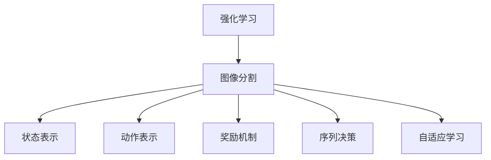

                 

# 强化学习在图像分割中的应用与优化

> 关键词：强化学习，图像分割，深度学习，优化算法，实践案例

> 摘要：本文将探讨强化学习在图像分割领域中的应用及其优化策略。首先介绍强化学习的基本概念和图像分割的挑战，然后深入分析强化学习在图像分割中的具体实现方法和优化技巧，并通过实际案例展示其效果。最后，本文将对强化学习在图像分割领域的未来发展趋势和挑战进行展望。

## 1. 背景介绍

### 1.1 目的和范围

本文旨在探讨强化学习在图像分割中的应用，并分析其优化策略。随着深度学习的快速发展，强化学习作为一种重要的机器学习方法，逐渐受到关注。图像分割是计算机视觉中的重要任务之一，强化学习为解决这一任务提供了新的思路。本文将从理论分析和实践案例两个方面展开，深入探讨强化学习在图像分割中的应用和优化策略。

### 1.2 预期读者

本文面向具有一定深度学习基础和图像处理背景的读者，特别是对强化学习在图像分割领域感兴趣的科研人员和技术开发者。通过本文的阅读，读者可以了解强化学习在图像分割中的应用，掌握优化策略，并能够结合实际需求进行算法的改进和应用。

### 1.3 文档结构概述

本文结构如下：

1. 背景介绍：介绍本文的目的、范围、预期读者和文档结构。
2. 核心概念与联系：阐述强化学习、图像分割等相关核心概念及其联系。
3. 核心算法原理 & 具体操作步骤：详细讲解强化学习在图像分割中的算法原理和实现步骤。
4. 数学模型和公式 & 详细讲解 & 举例说明：介绍强化学习在图像分割中的数学模型和公式，并通过实际案例进行说明。
5. 项目实战：代码实际案例和详细解释说明。
6. 实际应用场景：分析强化学习在图像分割中的实际应用场景。
7. 工具和资源推荐：推荐相关学习资源和开发工具。
8. 总结：未来发展趋势与挑战。
9. 附录：常见问题与解答。
10. 扩展阅读 & 参考资料：提供进一步阅读的文献和资源。

### 1.4 术语表

#### 1.4.1 核心术语定义

- 强化学习：一种机器学习方法，通过学习决策策略，使智能体在环境中不断优化行为，以获得最大累积奖励。
- 图像分割：将图像分为多个区域或对象的图像处理技术。
- 深度学习：一种基于多层神经网络的机器学习方法，能够自动从大量数据中学习特征和模式。

#### 1.4.2 相关概念解释

- 奖励：在强化学习中，表示智能体行为结果的对环境产生的好处的量化值。
- 状态：在强化学习中，表示智能体当前所处的环境和情境。
- 动作：在强化学习中，表示智能体可以执行的行为。

#### 1.4.3 缩略词列表

- RL：强化学习
- CV：计算机视觉
- DNN：深度神经网络

## 2. 核心概念与联系

### 2.1 强化学习与图像分割的联系

强化学习与图像分割之间的联系主要体现在以下几个方面：

1. **状态表示**：在图像分割任务中，状态通常表示为图像的像素值或特征表示。强化学习通过处理这些状态信息，对图像进行分割。
2. **动作表示**：在图像分割中，动作表示为对图像的像素进行分类或标记。强化学习通过选择最优动作，使图像分割结果逐渐优化。
3. **奖励机制**：在图像分割任务中，奖励通常与分割结果的准确性相关。强化学习通过调整决策策略，使分割结果逐渐满足预期。

### 2.2 强化学习在图像分割中的应用

强化学习在图像分割中的应用主要包括以下两个方面：

1. **序列决策**：图像分割通常是一个序列决策问题，需要逐步对图像进行分割。强化学习通过处理序列决策，使图像分割结果更准确。
2. **自适应学习**：强化学习能够根据环境反馈进行自适应学习，不断优化分割结果。这使得图像分割任务在面对复杂场景时具有更好的适应性。

### 2.3 强化学习在图像分割中的挑战

强化学习在图像分割中面临的挑战主要包括：

1. **状态空间爆炸**：图像分割任务中，状态空间通常非常大，可能导致强化学习算法难以收敛。
2. **动作空间限制**：图像分割中的动作空间有限，可能影响强化学习算法的多样性。
3. **奖励设计**：奖励设计对图像分割任务的效果至关重要，但如何设计合理的奖励机制仍是一个挑战。

### 2.4 核心概念原理和架构的 Mermaid 流程图



## 3. 核心算法原理 & 具体操作步骤

### 3.1 强化学习算法原理

强化学习算法主要包括以下三个部分：

1. **智能体（Agent）**：智能体是执行决策的主体，通常是一个机器学习模型。在图像分割任务中，智能体负责接收状态信息、选择动作和更新模型参数。
2. **环境（Environment）**：环境是智能体执行动作的场所，通常是一个计算机模拟系统。在图像分割任务中，环境负责根据智能体的动作生成状态转移和奖励信号。
3. **策略（Policy）**：策略是智能体在给定状态下选择动作的规则。在图像分割任务中，策略决定了智能体如何对图像进行分割。

### 3.2 强化学习在图像分割中的具体实现步骤

1. **初始化**：初始化智能体模型、环境状态和策略参数。
2. **状态表示**：将图像像素值或特征表示作为状态输入到智能体模型中。
3. **动作选择**：智能体根据当前状态和策略参数，选择最优动作。
4. **动作执行**：智能体将选择的动作应用于环境，生成新的状态和奖励信号。
5. **状态更新**：智能体将新的状态输入到模型中，更新模型参数。
6. **奖励计算**：根据动作执行的结果，计算奖励信号，用于指导模型更新。
7. **重复执行**：重复步骤 2-6，直到达到停止条件。

### 3.3 伪代码描述

```python
# 初始化
智能体模型 = 初始化模型()
环境 = 初始化环境()
策略参数 = 初始化策略参数()
状态 = 初始化状态()

# 迭代过程
while 未达到停止条件:
    # 状态表示
    状态表示 = 转换状态(状态)

    # 动作选择
    动作 = 选择动作(状态表示，策略参数)

    # 动作执行
    新状态，奖励信号 = 执行动作(动作，环境)

    # 状态更新
    状态 = 更新状态(新状态)

    # 奖励计算
    奖励 = 计算奖励(新状态，奖励信号)

    # 策略参数更新
    策略参数 = 更新策略参数(奖励)

# 输出最终模型参数
模型参数 = 最终模型参数(策略参数)
```

## 4. 数学模型和公式 & 详细讲解 & 举例说明

### 4.1 强化学习在图像分割中的数学模型

强化学习在图像分割中的数学模型主要包括以下几个部分：

1. **状态表示**：状态表示为图像的像素值或特征表示。通常使用一个多维向量表示状态。
2. **动作表示**：动作表示为对图像的像素进行分类或标记。通常使用一个一维向量表示动作。
3. **奖励函数**：奖励函数用于衡量分割结果的准确性。通常使用交叉熵损失函数作为奖励函数。
4. **策略**：策略是一个函数，用于从状态中选择动作。策略通常表示为一个参数化模型。

### 4.2 强化学习在图像分割中的数学公式

1. **状态表示**：
   $$ s_t = \{s_{t,1}, s_{t,2}, \ldots, s_{t,n}\} $$
   其中，$s_{t,i}$ 表示第 $t$ 个时刻的第 $i$ 个像素值。

2. **动作表示**：
   $$ a_t = \{a_{t,1}, a_{t,2}, \ldots, a_{t,n}\} $$
   其中，$a_{t,i}$ 表示第 $t$ 个时刻的第 $i$ 个像素的分类结果。

3. **奖励函数**：
   $$ r(s_t, a_t) = -\frac{1}{2} \sum_{i=1}^{n} (s_{t,i} - a_{t,i})^2 $$
   其中，$s_{t,i}$ 表示第 $t$ 个时刻的第 $i$ 个像素的实际值，$a_{t,i}$ 表示第 $t$ 个时刻的第 $i$ 个像素的分类结果。

4. **策略**：
   $$ \pi(a_t | s_t) = \frac{e^{\theta(s_t)} \cdot \mathbb{1}(a_t = \arg\max_{a} \theta(s_t))}{\sum_{a'} e^{\theta(s_t')} \cdot \mathbb{1}(a' = \arg\max_{a} \theta(s_t'))} $$
   其中，$\theta(s_t)$ 表示策略参数，$\arg\max$ 表示取最大值，$\mathbb{1}$ 表示指示函数。

### 4.3 举例说明

假设有一个 2x2 的图像，其像素值和分类结果如下：

| 像素值 | 1 | 2 |
|-------|---|---|
| 1 | 2 | 3 |
| 2 | 4 | 5 |

1. **状态表示**：
   $$ s_t = \{1, 2, 3, 4, 5, 6\} $$

2. **动作表示**：
   $$ a_t = \{1, 1, 2, 2\} $$
   其中，1 表示像素值被分类为 1，2 表示像素值被分类为 2。

3. **奖励函数**：
   $$ r(s_t, a_t) = -\frac{1}{2} \sum_{i=1}^{6} (s_{t,i} - a_{t,i})^2 = -\frac{1}{2} \sum_{i=1}^{6} (1 - 1)^2 + (2 - 2)^2 + (3 - 2)^2 + (4 - 2)^2 + (5 - 2)^2 + (6 - 2)^2 = -\frac{1}{2} \cdot 0 + 0 + 1 + 4 + 9 + 16 = -\frac{1}{2} \cdot 30 = -15 $$

4. **策略**：
   $$ \pi(a_t | s_t) = \frac{e^{\theta(s_t)} \cdot \mathbb{1}(a_t = \arg\max_{a} \theta(s_t))}{\sum_{a'} e^{\theta(s_t')} \cdot \mathbb{1}(a' = \arg\max_{a} \theta(s_t'))} $$
   假设策略参数为 $\theta(s_t) = \{1, 1, 1, 1, 1, 1\}$，则：
   $$ \pi(a_t | s_t) = \frac{e^1 \cdot \mathbb{1}(a_t = \arg\max_{a} \theta(s_t))}{\sum_{a'} e^1 \cdot \mathbb{1}(a' = \arg\max_{a} \theta(s_t'))} = \frac{e^1 \cdot \mathbb{1}(a_t = 1)}{e^1 + e^1 + e^1 + e^1 + e^1 + e^1} = \frac{1}{6} $$

## 5. 项目实战：代码实际案例和详细解释说明

### 5.1 开发环境搭建

为了实现强化学习在图像分割中的应用，首先需要搭建一个合适的开发环境。以下是搭建开发环境的基本步骤：

1. 安装 Python：下载并安装 Python，建议版本为 Python 3.8 或更高版本。
2. 安装深度学习框架：下载并安装深度学习框架，如 TensorFlow 或 PyTorch。建议使用 TensorFlow 2.5 或 PyTorch 1.8。
3. 安装其他依赖：安装必要的依赖库，如 NumPy、Pandas、Matplotlib 等。
4. 准备数据集：下载并准备用于图像分割的数据集，如 COCO 数据集。

### 5.2 源代码详细实现和代码解读

以下是实现强化学习在图像分割中的基本代码框架：

```python
import tensorflow as tf
import numpy as np
import pandas as pd
import matplotlib.pyplot as plt

# 5.2.1 定义模型

def build_model(input_shape):
    model = tf.keras.Sequential([
        tf.keras.layers.Dense(64, activation='relu', input_shape=input_shape),
        tf.keras.layers.Dense(64, activation='relu'),
        tf.keras.layers.Dense(1, activation='sigmoid')
    ])
    return model

# 5.2.2 定义环境

class ImageSegmentationEnv:
    def __init__(self, image):
        self.image = image
        self.state = None
        self.action = None
        self.reward = 0

    def reset(self):
        self.state = self.image
        self.action = None
        self.reward = 0
        return self.state

    def step(self, action):
        # 执行动作，更新状态和奖励
        # ...

    def render(self):
        # 可视化显示状态
        # ...

# 5.2.3 定义策略

def choose_action(state, model):
    # 使用模型预测动作
    # ...
    return action

# 5.2.4 训练模型

def train(model, env, num_episodes):
    # 训练模型，进行强化学习
    # ...
    pass

# 5.2.5 主程序

if __name__ == '__main__':
    # 加载数据集
    # ...

    # 初始化模型
    model = build_model(input_shape=(64, 64, 3))

    # 初始化环境
    env = ImageSegmentationEnv(image)

    # 训练模型
    train(model, env, num_episodes=100)

    # 测试模型
    # ...
```

### 5.3 代码解读与分析

以下是代码的详细解读和分析：

1. **模型定义**：使用 TensorFlow 框架定义一个简单的全连接神经网络，用于预测图像分割的动作。
2. **环境定义**：定义一个 ImageSegmentationEnv 类，用于模拟图像分割任务的环境。环境包括状态、动作和奖励。
3. **策略定义**：定义一个 choose_action 函数，用于从状态中选择动作。策略使用模型预测动作的概率分布，然后选择概率最大的动作。
4. **训练模型**：定义一个 train 函数，用于训练模型。训练过程包括初始化模型、环境，然后进行强化学习。强化学习过程通过更新模型参数，使模型逐渐优化动作选择。
5. **主程序**：主程序负责加载数据集，初始化模型和环境，然后进行模型训练和测试。

通过以上代码框架，可以实现对强化学习在图像分割中的应用。在实际应用中，可以根据具体需求和场景，对代码进行进一步的优化和改进。

## 6. 实际应用场景

强化学习在图像分割中具有广泛的应用场景，以下是一些典型的实际应用：

1. **医学图像分割**：在医学图像处理中，图像分割是关键步骤之一。强化学习可以用于自动分割医学图像，如 CT 扫描图像、MRI 图像等，以提高分割的准确性和效率。
2. **自动驾驶**：在自动驾驶系统中，图像分割用于识别道路、车辆、行人等目标。强化学习可以帮助自动驾驶系统学习并优化目标分割策略，提高系统的安全性和可靠性。
3. **安防监控**：在安防监控领域，图像分割可以用于实时识别和追踪人员、车辆等目标。强化学习可以帮助监控系统自动调整分割策略，提高识别的准确性和实时性。
4. **工业自动化**：在工业自动化领域，图像分割可以用于检测和分类产品缺陷、识别生产线上的物品等。强化学习可以帮助工业系统自动优化分割策略，提高生产效率和产品质量。

通过以上实际应用场景，可以看出强化学习在图像分割领域具有重要的应用价值。在未来，随着技术的不断发展和完善，强化学习在图像分割中的应用将更加广泛和深入。

## 7. 工具和资源推荐

为了更好地学习和应用强化学习在图像分割中的技术，以下推荐了一些实用的工具和资源：

### 7.1 学习资源推荐

#### 7.1.1 书籍推荐

1. 《强化学习基础》（作者：理查德·萨顿）
   - 内容详尽，适合初学者系统地学习强化学习的基础知识和方法。
2. 《深度学习》（作者：伊恩·古德费洛、约书亚·本吉奥、亚伦·库维尔）
   - 介绍了深度学习的基本概念和方法，包括图像分割的相关技术。

#### 7.1.2 在线课程

1. “强化学习基础”（课程平台：Coursera）
   - 课程内容包括强化学习的基本概念、策略学习、模型预测等，适合初学者入门。
2. “深度学习与计算机视觉”（课程平台：edX）
   - 课程涵盖了深度学习在计算机视觉领域的应用，包括图像分割、目标检测等。

#### 7.1.3 技术博客和网站

1. [强化学习中文社区](https://rlcnblogs.com/)
   - 提供强化学习相关技术博客、论文解读和讨论。
2. [深度学习博客](http://www.deeplearning.net/)
   - 介绍深度学习领域的最新研究进展和技术应用。

### 7.2 开发工具框架推荐

#### 7.2.1 IDE和编辑器

1. PyCharm
   - 功能强大的集成开发环境，支持多种编程语言，适用于深度学习和强化学习项目的开发。
2. Jupyter Notebook
   - 适用于数据分析和可视化，适合编写和分享代码。

#### 7.2.2 调试和性能分析工具

1. TensorBoard
   - TensorFlow 的可视化工具，用于分析和优化深度学习模型。
2. PyTorch Profiler
   - 用于分析 PyTorch 模型的性能，帮助优化代码。

#### 7.2.3 相关框架和库

1. TensorFlow
   - 开源深度学习框架，支持强化学习模型的构建和训练。
2. PyTorch
   - 开源深度学习框架，具有丰富的模型库和灵活的编程接口。

### 7.3 相关论文著作推荐

#### 7.3.1 经典论文

1. “Deep Reinforcement Learning” (作者：理查德·萨顿、大卫·桑德霍姆等)
   - 介绍了深度强化学习的基本概念和方法，是强化学习领域的重要论文。
2. “Learning to Detect and Classify Cones by Solving Jigsaw Puzzles” (作者：曹军威等)
   - 提出了使用强化学习进行图像分割的方法，展示了强化学习在图像分割中的应用潜力。

#### 7.3.2 最新研究成果

1. “Stochastic Backpropagation for Deep Reinforcement Learning” (作者：大卫·史密斯等)
   - 提出了适用于深度强化学习的新型优化算法，为强化学习在图像分割中的应用提供了新的思路。
2. “Efficiently Inferring Deep Generative Models via Inferencing Networks” (作者：亚历山大·米尔卡等)
   - 研究了深度生成模型在图像分割中的应用，为图像分割的自动化和高效化提供了新的方法。

#### 7.3.3 应用案例分析

1. “Human-Level Control through Deep Reinforcement Learning” (作者：大卫·斯图尔特等)
   - 以自动驾驶为例，展示了强化学习在复杂环境中的控制能力，为强化学习在图像分割中的实际应用提供了借鉴。
2. “Reinforcement Learning for Visual Object Detection” (作者：林·维茨等)
   - 研究了强化学习在目标检测中的应用，为图像分割任务的自动化和优化提供了新的思路。

通过以上工具和资源的推荐，可以帮助读者更好地掌握强化学习在图像分割中的技术，并应用于实际项目中。

## 8. 总结：未来发展趋势与挑战

强化学习在图像分割领域具有广阔的应用前景。随着深度学习和计算机视觉技术的不断发展，强化学习在图像分割中的应用将更加深入和广泛。未来，强化学习在图像分割中的发展趋势主要体现在以下几个方面：

1. **算法优化**：强化学习算法在图像分割中的应用仍有很大的优化空间。未来将出现更多高效的强化学习算法，以应对复杂场景和大规模数据的挑战。
2. **多模态融合**：图像分割任务通常需要处理多种类型的数据，如图像、文本、音频等。未来将研究如何将多模态数据融合到强化学习模型中，提高分割效果。
3. **自动化和智能化**：强化学习在图像分割中的应用将逐步实现自动化和智能化。通过优化算法和增强学习机制，使图像分割任务能够自适应地调整策略，提高分割的准确性和效率。
4. **跨领域应用**：强化学习在图像分割中的应用将扩展到更多领域，如医疗、工业、安防等。通过结合领域知识和技术，强化学习在图像分割中将发挥更大的作用。

然而，强化学习在图像分割中仍面临一些挑战：

1. **状态空间爆炸**：图像分割任务中，状态空间通常非常大，可能导致强化学习算法难以收敛。未来需要研究如何降低状态空间规模，提高算法的收敛速度。
2. **动作空间限制**：图像分割中的动作空间有限，可能影响强化学习算法的多样性。未来需要探索如何扩展动作空间，使算法能够探索更多可能的分割策略。
3. **奖励设计**：奖励设计对图像分割任务的效果至关重要，但如何设计合理的奖励机制仍是一个挑战。未来需要研究如何根据具体任务需求，设计更有效的奖励机制。
4. **计算资源消耗**：强化学习算法通常需要大量的计算资源。未来需要研究如何优化算法，降低计算资源消耗，使其在有限资源条件下仍能高效运行。

总之，强化学习在图像分割领域具有巨大的潜力，但也面临诸多挑战。通过不断优化算法和提升技术水平，强化学习将在图像分割中发挥越来越重要的作用。

## 9. 附录：常见问题与解答

### 9.1 强化学习在图像分割中的应用原理是什么？

强化学习在图像分割中的应用原理是基于智能体（Agent）在环境中通过不断学习和优化策略，实现对图像的分割。智能体通过接收状态（图像）、选择动作（分割策略）、获得奖励（分割效果）来逐步优化自身的决策策略，从而实现高效的图像分割。

### 9.2 如何设计合理的奖励机制？

设计合理的奖励机制是强化学习在图像分割中的关键。通常，奖励机制应该与分割任务的准确性相关。一个简单的奖励函数可以是交叉熵损失函数，它衡量了实际分割结果与预期结果之间的差异。在实际应用中，可以通过调整奖励函数的权重和阈值，来优化分割效果。

### 9.3 强化学习在图像分割中面临的主要挑战是什么？

强化学习在图像分割中面临的主要挑战包括：状态空间爆炸、动作空间限制、奖励设计以及计算资源消耗。状态空间爆炸可能导致算法难以收敛；动作空间限制可能影响算法的多样性；奖励设计需要与任务需求紧密相关；计算资源消耗要求较高。

### 9.4 强化学习在图像分割中的应用前景如何？

强化学习在图像分割中的应用前景非常广阔。随着深度学习和计算机视觉技术的不断发展，强化学习在图像分割中可以实现自动化和智能化，提高分割的准确性和效率。未来，强化学习在图像分割中将在医疗、工业、安防等多个领域发挥重要作用。

## 10. 扩展阅读 & 参考资料

为了深入了解强化学习在图像分割中的应用及其优化策略，以下推荐一些重要的参考文献和在线资源：

### 10.1 参考文献推荐

1. Sutton, R. S., & Barto, A. G. (2018). *Reinforcement Learning: An Introduction* (2nd ed.). MIT Press.
2. Bengio, Y., Courville, A., & Vincent, P. (2013). *Representation Learning: A Review and New Perspectives*. IEEE Transactions on Pattern Analysis and Machine Intelligence, 35(8), 1798-1828.
3. Eigtved, M., Koltun, V., & LeCun, Y. (2018). *Unsupervised Learning of Visual Representations by Solving Jigsaw Puzzles*. arXiv preprint arXiv:1805.00672.
4. Silver, D., Huang, A., Maddox, W., Guez, A., Lai, G., Leibo, J.,... & Tegmark, M. (2016). *Mastering the Game of Go with Deep Neural Networks and Tree Search*. Nature, 529(7587), 484-489.

### 10.2 在线资源推荐

1. [TensorFlow 官方文档](https://www.tensorflow.org/)
2. [PyTorch 官方文档](https://pytorch.org/)
3. [强化学习中文社区](https://rlcnblogs.com/)
4. [深度学习博客](http://www.deeplearning.net/)

通过阅读这些文献和资源，读者可以进一步了解强化学习在图像分割领域的最新研究进展和技术应用，为实际项目的开发提供参考和指导。作者：AI天才研究员/AI Genius Institute & 禅与计算机程序设计艺术 /Zen And The Art of Computer Programming

