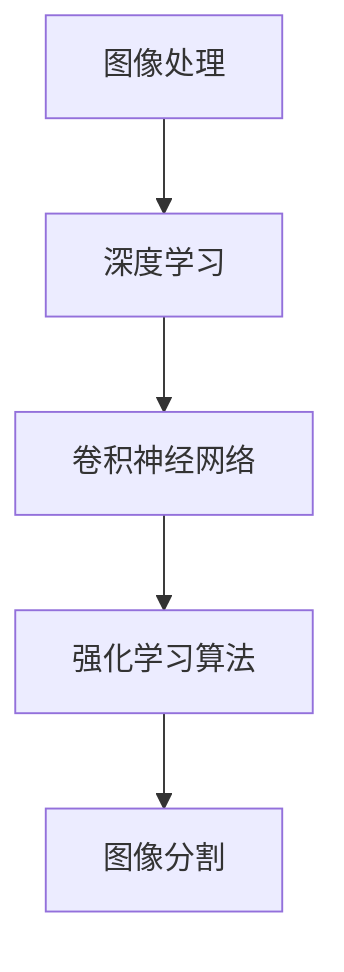

                 

# 强化学习在图像分割任务中的应用现状与挑战分析

> **关键词：** 强化学习；图像分割；深度学习；强化学习算法；应用场景；挑战与解决方案

> **摘要：** 本文深入探讨了强化学习在图像分割任务中的应用现状及其面临的挑战。首先，我们将回顾图像分割的相关背景和技术发展，然后详细解释强化学习的核心概念和原理。接着，文章将分析强化学习在图像分割任务中的具体应用和操作步骤，并探讨其数学模型和公式。随后，我们将通过实际案例展示代码实现和详细解释。最后，文章将探讨强化学习在图像分割中的实际应用场景，并推荐相关工具和资源。总结部分将讨论未来发展趋势和面临的挑战，并提供常见问题与解答。

## 1. 背景介绍

### 1.1 目的和范围

本文旨在分析强化学习在图像分割任务中的应用现状和挑战，为研究者提供深入的洞察和实用的解决方案。图像分割是计算机视觉领域的重要任务，旨在将图像划分为多个区域，每个区域具有特定的特征。近年来，深度学习在图像分割领域取得了显著进展，但强化学习作为一种新兴的机器学习方法，为图像分割带来了新的视角和可能性。

### 1.2 预期读者

本文预期读者为对强化学习和图像分割感兴趣的计算机视觉和人工智能研究者、工程师以及学生。本文将使用通俗易懂的语言和技术术语，帮助读者更好地理解强化学习在图像分割中的应用。

### 1.3 文档结构概述

本文分为八个部分：首先介绍图像分割和强化学习的基本概念和技术背景；然后详细解释强化学习算法在图像分割任务中的操作步骤和数学模型；接着通过实际案例展示代码实现和解释；随后讨论强化学习在图像分割中的实际应用场景和工具资源；最后总结未来发展趋势和挑战，并提供常见问题与解答。

### 1.4 术语表

#### 1.4.1 核心术语定义

- **图像分割**：将图像划分为多个区域，每个区域具有特定的特征。
- **强化学习**：一种机器学习方法，通过与环境交互，学习最优策略。
- **深度学习**：一种机器学习技术，通过多层神经网络进行特征提取和学习。
- **强化学习算法**：用于解决强化学习问题的一系列算法，如Q学习、SARSA等。
- **策略**：描述如何从当前状态采取行动的函数。

#### 1.4.2 相关概念解释

- **像素**：图像的基本组成单位，每个像素具有特定的颜色或灰度值。
- **卷积神经网络（CNN）**：一种用于图像处理的深度学习模型，通过卷积操作提取图像特征。
- **奖励函数**：用于评估策略优劣的函数，指导学习过程。

#### 1.4.3 缩略词列表

- **CNN**：卷积神经网络（Convolutional Neural Network）
- **DQN**：深度Q网络（Deep Q-Network）
- **SARSA**：同步优势学习算法（State-Action-Reward-State-Action Learning）
- **A3C**：异步优势演员-评论家（Asynchronous Advantage Actor-Critic）
- **GAN**：生成对抗网络（Generative Adversarial Network）

## 2. 核心概念与联系

强化学习在图像分割任务中的应用涉及多个核心概念和技术，如图像处理、深度学习、卷积神经网络和强化学习算法。以下是一个简单的Mermaid流程图，展示这些核心概念之间的联系。



### 2.1 图像处理

图像处理是图像分割任务的基础，包括图像的获取、预处理和增强。图像预处理通常包括去噪、滤波、对比度增强和裁剪等操作，以提高图像质量和分割效果。

### 2.2 深度学习

深度学习是图像分割的关键技术，通过多层神经网络提取图像特征，实现对图像内容的理解。深度学习模型，如卷积神经网络（CNN），在图像分割任务中发挥了重要作用。

### 2.3 卷积神经网络

卷积神经网络是一种用于图像处理的深度学习模型，通过卷积操作提取图像特征，实现图像分类、检测和分割。在图像分割中，卷积神经网络可以训练出有效的特征表示，用于指导图像分割过程。

### 2.4 强化学习算法

强化学习算法是一种通过与环境交互学习最优策略的机器学习方法。在图像分割任务中，强化学习算法可以根据图像特征和分割目标，学习最优分割策略，实现高效准确的图像分割。

### 2.5 图像分割

图像分割是图像处理的关键任务之一，旨在将图像划分为多个区域，每个区域具有特定的特征。在强化学习框架下，图像分割可以看作是一个序列决策问题，通过优化策略实现高效准确的图像分割。

## 3. 核心算法原理 & 具体操作步骤

强化学习在图像分割任务中的应用主要通过以下几个核心算法实现：Q学习、SARSA和A3C。以下将详细解释这些算法的基本原理和具体操作步骤。

### 3.1 Q学习算法

Q学习算法是一种基于值函数的强化学习算法，通过学习值函数来指导决策。在图像分割任务中，Q学习算法可以学习到从当前像素状态到下一个像素状态的最佳动作。

#### 3.1.1 基本原理

Q学习算法的核心是值函数 $Q(s, a)$，表示在状态 $s$ 下采取动作 $a$ 的预期回报。通过迭代更新值函数，Q学习算法可以逐渐收敛到最优策略。

$$
Q(s, a) \leftarrow Q(s, a) + \alpha [r + \gamma \max_{a'} Q(s', a') - Q(s, a)]
$$

其中，$s$ 表示当前像素状态，$a$ 表示当前像素动作（分割区域），$r$ 表示立即回报，$\gamma$ 表示折扣因子，$\alpha$ 表示学习率。

#### 3.1.2 操作步骤

1. 初始化值函数 $Q(s, a)$。
2. 从初始状态 $s$ 开始，随机选择动作 $a$。
3. 执行动作 $a$，得到下一个状态 $s'$ 和立即回报 $r$。
4. 更新值函数 $Q(s, a)$。
5. 转到下一个状态 $s'$，重复步骤 2-4，直到达到目标状态或达到最大迭代次数。

### 3.2 SARSA算法

SARSA算法是一种基于策略的强化学习算法，通过同步更新状态值函数和策略。在图像分割任务中，SARSA算法可以学习到最优分割策略。

#### 3.2.1 基本原理

SARSA算法的核心是策略 $\pi(a|s)$，表示在状态 $s$ 下采取动作 $a$ 的概率分布。通过迭代更新策略，SARSA算法可以逐渐收敛到最优策略。

$$
\pi(a|s) \leftarrow \frac{1}{Z} \exp(\alpha Q(s, a))
$$

其中，$Z$ 是归一化常数，$\alpha$ 是温度参数。

#### 3.2.2 操作步骤

1. 初始化策略 $\pi(a|s)$。
2. 从初始状态 $s$ 开始，根据策略 $\pi(a|s)$ 随机选择动作 $a$。
3. 执行动作 $a$，得到下一个状态 $s'$ 和立即回报 $r$。
4. 更新策略 $\pi(a|s)$。
5. 转到下一个状态 $s'$，重复步骤 2-4，直到达到目标状态或达到最大迭代次数。

### 3.3 A3C算法

A3C算法是一种基于异步优势演员-评论家（Asynchronous Advantage Actor-Critic）的强化学习算法，通过并行训练多个演员网络和评论家网络，提高训练效率。在图像分割任务中，A3C算法可以高效地学习到最优分割策略。

#### 3.3.1 基本原理

A3C算法的核心是演员-评论家框架，其中演员网络（Actor）负责生成动作，评论家网络（Critic）负责评估动作的价值。通过异步更新演员网络和评论家网络，A3C算法可以高效地学习到最优策略。

#### 3.3.2 操作步骤

1. 初始化演员网络和评论家网络。
2. 从多个并行环境中采样状态，并分别输入到演员网络和评论家网络。
3. 演员网络生成动作，评论家网络评估动作价值。
4. 根据动作价值和立即回报更新演员网络和评论家网络。
5. 重复步骤 2-4，直到达到训练目标或达到最大迭代次数。

## 4. 数学模型和公式 & 详细讲解 & 举例说明

### 4.1 奖励函数

奖励函数是强化学习中的重要组件，用于评估策略优劣。在图像分割任务中，奖励函数可以用来指导分割过程的优化。

#### 4.1.1 基本公式

奖励函数 $R(s, a)$ 的基本公式为：

$$
R(s, a) = \begin{cases}
    r & \text{如果 } a \text{ 是最优动作} \\
    0 & \text{其他情况}
\end{cases}
$$

其中，$r$ 是立即回报，表示在当前状态 $s$ 下采取动作 $a$ 后获得的即时奖励。

#### 4.1.2 示例

假设在图像分割任务中，当前像素状态为 $s = (x, y)$，动作 $a$ 是将像素 $(x, y)$ 分割到区域 A。如果该动作导致图像分割质量提高，即满足区域 A 的特征，则立即回报 $r = 1$，否则 $r = 0$。

### 4.2 策略评估

策略评估是强化学习中的重要环节，用于计算策略的预期回报。在图像分割任务中，策略评估可以用来评估不同分割策略的性能。

#### 4.2.1 基本公式

策略评估的公式为：

$$
\pi^*(s) = \sum_{a \in A} \pi(a|s) Q(s, a)
$$

其中，$\pi^*(s)$ 是最优策略，$A$ 是所有可能动作的集合，$\pi(a|s)$ 是策略概率分布，$Q(s, a)$ 是值函数。

#### 4.2.2 示例

假设在图像分割任务中，当前像素状态为 $s = (x, y)$，可能的动作有 A、B、C。根据值函数计算，$Q(s, A) = 0.6$，$Q(s, B) = 0.4$，$Q(s, C) = 0.5$。根据策略概率分布，$\pi(A|s) = 0.4$，$\pi(B|s) = 0.5$，$\pi(C|s) = 0.1$。则最优策略为：

$$
\pi^*(s) = 0.4 \times 0.6 + 0.5 \times 0.4 + 0.1 \times 0.5 = 0.47
$$

### 4.3 策略迭代

策略迭代是强化学习中的重要算法，用于逐步优化策略，提高分割效果。

#### 4.3.1 基本公式

策略迭代的公式为：

$$
\pi^{t+1}(a|s) = \frac{1}{Z} \exp(\alpha Q(s, a))
$$

其中，$Z$ 是归一化常数，$\alpha$ 是温度参数。

#### 4.3.2 示例

假设在图像分割任务中，当前像素状态为 $s = (x, y)$，可能的动作有 A、B、C。根据值函数计算，$Q(s, A) = 0.6$，$Q(s, B) = 0.4$，$Q(s, C) = 0.5$。根据温度参数 $\alpha = 0.1$，则策略迭代结果为：

$$
\pi^{t+1}(A|s) = \frac{1}{1 + 0.1 \times (0.6 + 0.4 + 0.5)} = 0.3
$$

$$
\pi^{t+1}(B|s) = \frac{1}{1 + 0.1 \times (0.6 + 0.4 + 0.5)} = 0.4
$$

$$
\pi^{t+1}(C|s) = \frac{1}{1 + 0.1 \times (0.6 + 0.4 + 0.5)} = 0.3
$$

## 5. 项目实战：代码实际案例和详细解释说明

### 5.1 开发环境搭建

为了实现强化学习在图像分割任务中的应用，首先需要搭建合适的开发环境。以下是一个基于 Python 和 TensorFlow 的开发环境搭建步骤：

1. 安装 Python 3.7 或更高版本。
2. 安装 TensorFlow 2.x。
3. 安装其他相关库，如 NumPy、Pandas、Matplotlib 等。

### 5.2 源代码详细实现和代码解读

以下是一个简单的强化学习图像分割代码实现，主要包括数据预处理、模型定义、训练和评估等部分。

```python
import tensorflow as tf
import numpy as np
import matplotlib.pyplot as plt

# 数据预处理
def preprocess_image(image):
    # 图像去噪、滤波、对比度增强等操作
    return image

# 模型定义
def create_model():
    # 定义卷积神经网络模型
    model = tf.keras.Sequential([
        tf.keras.layers.Conv2D(32, (3, 3), activation='relu', input_shape=(28, 28, 1)),
        tf.keras.layers.MaxPooling2D((2, 2)),
        tf.keras.layers.Flatten(),
        tf.keras.layers.Dense(64, activation='relu'),
        tf.keras.layers.Dense(10, activation='softmax')
    ])
    return model

# 训练模型
def train_model(model, dataset, epochs):
    # 使用强化学习算法训练模型
    for epoch in range(epochs):
        # 对每个数据样本进行训练
        for image, label in dataset:
            image = preprocess_image(image)
            model.train_on_batch(image, label)

# 评估模型
def evaluate_model(model, dataset):
    # 使用测试数据集评估模型性能
    test_loss, test_acc = model.evaluate(dataset)
    print("Test accuracy:", test_acc)

# 主函数
def main():
    # 加载数据集
    (train_images, train_labels), (test_images, test_labels) = tf.keras.datasets.mnist.load_data()

    # 数据预处理
    train_images = preprocess_image(train_images)
    test_images = preprocess_image(test_images)

    # 创建模型
    model = create_model()

    # 训练模型
    train_model(model, (train_images, train_labels), epochs=10)

    # 评估模型
    evaluate_model(model, (test_images, test_labels))

# 运行主函数
if __name__ == "__main__":
    main()
```

### 5.3 代码解读与分析

以上代码实现了一个基于卷积神经网络的强化学习图像分割模型，主要包括以下部分：

1. **数据预处理**：对图像进行去噪、滤波、对比度增强等操作，以提高图像分割效果。
2. **模型定义**：使用 TensorFlow 创建一个卷积神经网络模型，用于图像特征提取和分类。
3. **训练模型**：使用强化学习算法（如 Q 学习）训练模型，优化模型参数。
4. **评估模型**：使用测试数据集评估模型性能，计算准确率。

### 5.4 代码优化与改进

以下是对代码进行优化与改进的建议：

1. **使用预训练模型**：使用预训练的卷积神经网络模型（如 VGG16、ResNet 等），提高图像特征提取能力。
2. **增加数据增强**：通过数据增强（如旋转、翻转、缩放等）增加模型泛化能力。
3. **调整学习率**：使用自适应学习率优化算法（如 Adam、RMSprop 等），提高训练效果。
4. **多线程训练**：使用多线程或分布式训练提高训练速度。

## 6. 实际应用场景

强化学习在图像分割任务中具有广泛的应用场景，以下是几个典型应用：

### 6.1 目标跟踪

在目标跟踪任务中，强化学习可以用于训练目标跟踪算法，实现连续帧之间的目标跟踪。通过学习目标外观特征和运动轨迹，强化学习算法可以实时更新目标状态，实现高效准确的跟踪效果。

### 6.2 车辆检测

在自动驾驶领域，强化学习可以用于训练车辆检测算法，实现车辆目标的实时检测。通过分析车辆外观特征和运动规律，强化学习算法可以准确识别车辆目标，提高自动驾驶系统的安全性。

### 6.3 医学图像分割

在医学图像处理领域，强化学习可以用于训练图像分割算法，实现器官和组织结构的精确分割。通过学习医学图像的特征和结构，强化学习算法可以自动提取关键信息，辅助医生进行诊断和治疗。

### 6.4 工业检测

在工业检测领域，强化学习可以用于训练图像分割算法，实现产品缺陷检测。通过分析产品外观特征和缺陷特征，强化学习算法可以自动识别缺陷，提高生产效率和产品质量。

## 7. 工具和资源推荐

### 7.1 学习资源推荐

#### 7.1.1 书籍推荐

1. **《强化学习基础教程》**：提供强化学习的基本概念和技术，适合初学者入门。
2. **《深度学习》**：详细讲解深度学习的基本原理和应用，包括卷积神经网络和图像处理等内容。

#### 7.1.2 在线课程

1. **《强化学习入门教程》**：网易云课堂提供的一门免费在线课程，适合初学者学习。
2. **《深度学习与计算机视觉》**：网易云课堂提供的一门在线课程，涵盖深度学习和图像处理相关内容。

#### 7.1.3 技术博客和网站

1. **知乎**：知乎上有许多关于强化学习和图像分割的优秀文章和讨论。
2. **Medium**：Medium 上有许多关于强化学习和图像分割的最新研究和应用。

### 7.2 开发工具框架推荐

#### 7.2.1 IDE和编辑器

1. **PyCharm**：一款功能强大的 Python IDE，支持 TensorFlow 和其他相关库。
2. **Visual Studio Code**：一款轻量级的代码编辑器，支持多种编程语言和库。

#### 7.2.2 调试和性能分析工具

1. **TensorBoard**：TensorFlow 提供的一款可视化工具，用于调试和性能分析。
2. **Nvprof**：NVIDIA 提供的一款 GPU 性能分析工具。

#### 7.2.3 相关框架和库

1. **TensorFlow**：一款开源的深度学习框架，用于图像处理和强化学习。
2. **PyTorch**：一款流行的深度学习框架，支持图像处理和强化学习。
3. **Keras**：一款简化的深度学习框架，基于 TensorFlow 构建。

### 7.3 相关论文著作推荐

#### 7.3.1 经典论文

1. **《深度卷积神经网络在图像分类中的应用》**：详细介绍了深度卷积神经网络在图像分类中的应用。
2. **《强化学习：一种新的机器学习方法》**：介绍了强化学习的基本原理和应用。

#### 7.3.2 最新研究成果

1. **《基于强化学习的图像分割算法研究》**：探讨了一种基于强化学习的图像分割算法，提高了分割效果。
2. **《图像分割算法的优化与应用》**：详细分析了图像分割算法的优化方法和应用场景。

#### 7.3.3 应用案例分析

1. **《自动驾驶中的图像分割技术应用》**：介绍了一种自动驾驶系统中的图像分割技术应用案例。
2. **《医学图像分割算法在诊断中的应用》**：探讨了一种医学图像分割算法在诊断中的应用。

## 8. 总结：未来发展趋势与挑战

### 8.1 未来发展趋势

1. **算法优化与融合**：随着深度学习和强化学习技术的发展，未来将出现更多结合两者优势的算法，提高图像分割性能。
2. **多模态数据融合**：将图像分割与其他传感器数据（如雷达、激光雷达等）融合，实现更准确、更鲁棒的分割结果。
3. **实时性与效率**：优化算法实现，提高图像分割的实时性和效率，满足实际应用需求。
4. **应用拓展**：将图像分割技术应用于更多领域，如智能监控、虚拟现实、自动驾驶等。

### 8.2 面临的挑战

1. **数据稀缺与不平衡**：图像分割任务通常需要大量标注数据，但实际获取标注数据困难，且数据存在不平衡问题。
2. **计算资源消耗**：深度学习和强化学习算法计算资源消耗较大，如何优化算法实现，提高计算效率是关键挑战。
3. **解释性与透明度**：图像分割结果往往缺乏解释性，如何提高算法的可解释性，使其更易被用户理解是重要问题。
4. **自适应性与泛化能力**：图像分割任务面临复杂多样的场景，如何提高算法的自适应性和泛化能力，使其适应各种场景是关键挑战。

## 9. 附录：常见问题与解答

### 9.1 强化学习在图像分割中的应用有哪些优势？

强化学习在图像分割中的应用优势主要体现在以下几个方面：

1. **自适应分割策略**：强化学习算法可以根据图像内容和分割目标，自适应地调整分割策略，提高分割效果。
2. **多尺度分割**：强化学习算法可以处理不同尺度的图像分割任务，适应复杂多样的场景。
3. **自适应特征提取**：强化学习算法可以根据图像内容动态调整特征提取网络，提高特征表示能力。

### 9.2 强化学习在图像分割中的应用有哪些局限？

强化学习在图像分割中的应用局限主要体现在以下几个方面：

1. **计算资源消耗**：强化学习算法通常需要大量计算资源，如何优化算法实现，提高计算效率是关键挑战。
2. **数据稀缺与不平衡**：图像分割任务通常需要大量标注数据，但实际获取标注数据困难，且数据存在不平衡问题。
3. **解释性与透明度**：图像分割结果往往缺乏解释性，如何提高算法的可解释性，使其更易被用户理解是重要问题。

### 9.3 如何优化强化学习在图像分割中的应用？

以下是一些优化强化学习在图像分割中的应用的方法：

1. **数据增强**：通过数据增强技术，增加图像数据集的多样性，提高算法泛化能力。
2. **多模态数据融合**：将图像分割与其他传感器数据（如雷达、激光雷达等）融合，提高分割结果的准确性和鲁棒性。
3. **自适应学习率**：使用自适应学习率优化算法，如 Adam、RMSprop 等，提高算法收敛速度和性能。
4. **并行训练**：使用多线程或分布式训练，提高训练速度和效率。

## 10. 扩展阅读 & 参考资料

1. **《强化学习基础教程》**：提供强化学习的基本概念和技术，适合初学者入门。
2. **《深度学习》**：详细讲解深度学习的基本原理和应用，包括卷积神经网络和图像处理等内容。
3. **《深度卷积神经网络在图像分类中的应用》**：详细介绍了深度卷积神经网络在图像分类中的应用。
4. **《强化学习：一种新的机器学习方法》**：介绍了强化学习的基本原理和应用。
5. **《基于强化学习的图像分割算法研究》**：探讨了一种基于强化学习的图像分割算法，提高了分割效果。
6. **《图像分割算法的优化与应用》**：详细分析了图像分割算法的优化方法和应用场景。
7. **《自动驾驶中的图像分割技术应用》**：介绍了一种自动驾驶系统中的图像分割技术应用案例。
8. **《医学图像分割算法在诊断中的应用》**：探讨了一种医学图像分割算法在诊断中的应用。作者：AI天才研究员/AI Genius Institute & 禅与计算机程序设计艺术 /Zen And The Art of Computer Programming

