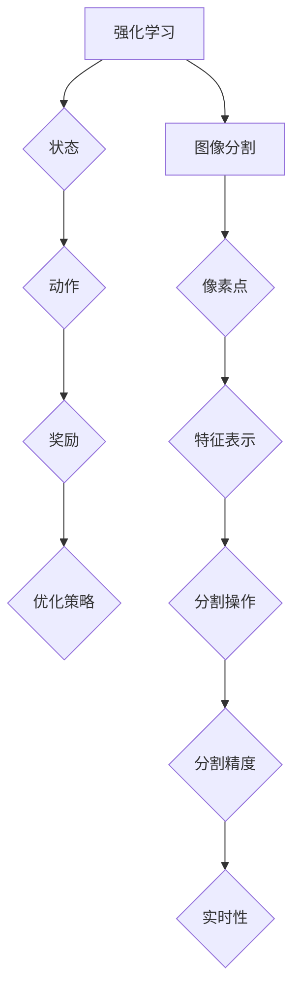

                 

# 强化学习在图像分割任务中的应用现状与挑战分析

> 关键词：强化学习、图像分割、深度学习、应用现状、挑战

> 摘要：本文旨在探讨强化学习在图像分割任务中的应用现状与面临的挑战。首先，我们将回顾图像分割的背景和强化学习的基本概念，然后深入分析强化学习在图像分割中的具体应用，讨论其优势和局限性。接下来，我们将介绍一些核心算法原理和数学模型，并通过实际案例展示其应用。最后，我们将探讨强化学习在图像分割领域的前景和未来可能面临的挑战，为研究者提供有益的参考。

## 1. 背景介绍

### 1.1 目的和范围

本文的目标是深入分析强化学习在图像分割任务中的应用现状与挑战。图像分割是计算机视觉领域的一个重要任务，旨在将图像分解为具有特定特征的区域或对象。随着深度学习技术的不断发展，图像分割方法取得了显著的进展。强化学习作为一种重要的机器学习方法，其在图像分割任务中的应用也日益受到关注。本文将从以下几个方面展开讨论：

1. 强化学习在图像分割中的应用现状。
2. 强化学习在图像分割中的优势和局限性。
3. 强化学习在图像分割中的核心算法原理。
4. 强化学习在图像分割中的实际应用案例。
5. 强化学习在图像分割领域的前景和挑战。

### 1.2 预期读者

本文适合对强化学习和图像分割有一定了解的读者，包括：

1. 计算机视觉领域的研究人员和开发者。
2. 对强化学习在图像分割任务中应用感兴趣的学者。
3. 想要了解强化学习在图像分割领域最新研究的从业者。

### 1.3 文档结构概述

本文将按照以下结构进行组织：

1. 背景介绍：介绍图像分割和强化学习的基本概念。
2. 核心概念与联系：分析强化学习在图像分割中的应用。
3. 核心算法原理 & 具体操作步骤：讲解强化学习在图像分割中的核心算法。
4. 数学模型和公式 & 详细讲解 & 举例说明：阐述强化学习在图像分割中的数学模型。
5. 项目实战：展示强化学习在图像分割中的实际应用案例。
6. 实际应用场景：探讨强化学习在图像分割中的应用场景。
7. 工具和资源推荐：推荐学习资源和开发工具。
8. 总结：展望强化学习在图像分割领域的未来发展趋势与挑战。
9. 附录：常见问题与解答。
10. 扩展阅读 & 参考资料：提供相关研究资料。

### 1.4 术语表

#### 1.4.1 核心术语定义

- 强化学习（Reinforcement Learning）：一种机器学习方法，通过智能体与环境之间的交互，学习优化策略。
- 图像分割（Image Segmentation）：将图像分解为具有特定特征的区域或对象。
- 深度学习（Deep Learning）：一种基于多层神经网络的人工智能方法。
- 强化学习算法（Reinforcement Learning Algorithm）：用于实现强化学习任务的算法，如Q学习、深度确定性策略梯度（DDPG）等。

#### 1.4.2 相关概念解释

- 强化学习奖励机制（Reinforcement Learning Reward Mechanism）：用于评价智能体在环境中的行为。
- 图像特征（Image Feature）：描述图像中具有区分性的属性。
- 分割精度（Segmentation Accuracy）：评估图像分割效果的重要指标。
- 实时性（Real-time）：在有限的时间内完成图像分割任务。

#### 1.4.3 缩略词列表

- RL：强化学习（Reinforcement Learning）
- DQN：深度Q网络（Deep Q-Network）
- DDPG：深度确定性策略梯度（Deep Deterministic Policy Gradient）
- CNN：卷积神经网络（Convolutional Neural Network）
- RNN：循环神经网络（Recurrent Neural Network）

## 2. 核心概念与联系

在探讨强化学习在图像分割任务中的应用之前，我们首先需要了解强化学习和图像分割的基本概念及其相互联系。

### 2.1 强化学习基本概念

强化学习是一种通过智能体与环境之间的交互，学习优化策略的机器学习方法。其核心概念包括：

- 智能体（Agent）：执行决策的实体，可以是机器人、软件程序等。
- 环境（Environment）：智能体所处的环境，包括状态、动作、奖励等。
- 状态（State）：描述智能体当前所处的情况。
- 动作（Action）：智能体在特定状态下执行的操作。
- 奖励（Reward）：评价智能体行为的即时回报，用于指导学习过程。

### 2.2 图像分割基本概念

图像分割是将图像分解为具有特定特征的区域或对象的过程。其主要目的是：

- 提取感兴趣的区域，方便后续处理。
- 增强图像的可解释性，便于人类理解和分析。
- 实现图像内容的自动标注，为其他计算机视觉任务提供输入。

图像分割的基本概念包括：

- 区域（Region）：具有相似特征的图像区域。
- 目标（Object）：图像中的特定对象。
- 分割精度（Segmentation Accuracy）：评估图像分割效果的重要指标。
- 实时性（Real-time）：在有限的时间内完成图像分割任务。

### 2.3 强化学习与图像分割的联系

强化学习在图像分割中的应用主要是通过将图像分割问题转化为强化学习问题，从而实现自动化的图像分割。其核心思想是将图像分割任务中的状态、动作和奖励与强化学习中的状态、动作和奖励相对应。

- 状态（State）：在图像分割任务中，状态可以表示为图像中的像素点，或者图像的特征表示。
- 动作（Action）：在图像分割任务中，动作可以表示为对图像像素点的分割操作，如标记为前景或背景。
- 奖励（Reward）：在图像分割任务中，奖励可以表示为分割效果的评估指标，如分割精度。

通过将图像分割任务与强化学习相结合，可以实现以下目标：

- 自动化的图像分割，降低人工干预。
- 提高分割精度，降低误差率。
- 增强实时性，满足实时处理需求。

### 2.4 核心概念原理和架构的Mermaid流程图

为了更好地理解强化学习在图像分割任务中的应用，我们使用Mermaid流程图来描述其核心概念和架构。



## 3. 核心算法原理 & 具体操作步骤

### 3.1 强化学习算法原理

强化学习算法的核心原理是通过智能体与环境之间的交互，不断调整策略，以实现最优行为。强化学习算法通常包括以下几个主要组成部分：

- 状态（State）：描述智能体当前所处的环境。
- 动作（Action）：智能体在特定状态下可以执行的操作。
- 奖励（Reward）：评价智能体行为的即时回报。
- 策略（Policy）：智能体执行动作的策略。
- 值函数（Value Function）：预测在特定状态下执行特定动作的长期回报。

常见的强化学习算法包括Q学习、深度Q网络（DQN）、深度确定性策略梯度（DDPG）等。下面我们以DDPG算法为例，详细讲解其在图像分割任务中的具体操作步骤。

### 3.2 DDPG算法原理

深度确定性策略梯度（Deep Deterministic Policy Gradient，DDPG）算法是一种基于深度神经网络（DNN）的强化学习算法，主要应用于连续动作空间的问题。DDPG算法的核心思想是通过深度神经网络学习一个策略网络，将状态映射到动作，并通过经验回放和目标网络进行训练，以提高学习效果。

DDPG算法的主要组成部分包括：

- 策略网络（Policy Network）：将状态映射到动作的神经网络。
- 目标网络（Target Network）：用于评估策略网络的性能，并更新策略网络。
- 经验回放（Experience Replay）：将智能体与环境交互的经验进行存储和随机采样，以避免训练过程中的偏差。

### 3.3 DDPG算法在图像分割任务中的具体操作步骤

1. **初始化**：

   - 初始化策略网络和目标网络。
   - 初始化经验回放内存。

2. **状态转换**：

   - 从当前状态 \( s_t \) 开始，根据策略网络 \( \pi(w) \) 生成动作 \( a_t \)。
   - 执行动作 \( a_t \)，获取新的状态 \( s_{t+1} \) 和奖励 \( r_t \)。

3. **经验回放**：

   - 将当前交互经验 \( (s_t, a_t, r_t, s_{t+1}) \) 存入经验回放内存。
   - 从经验回放内存中随机采样一批经验 \( (s_{i}, a_{i}, r_{i}, s_{i+1}) \)。

4. **目标网络更新**：

   - 根据目标网络 \( \pi^{'}(w^{'}_{t}) \) 和策略网络 \( \pi(w_t) \) 计算目标值 \( y_{i} \)：
     \[
     y_{i} = 
     \begin{cases} 
     r_{i} + \gamma \max_{a'} \pi^{'}(w^{'}_{t})[a'|s_{i+1}] & \text{if } s_{i+1} \neq terminal \\
     r_{i} & \text{if } s_{i+1} = terminal 
     \end{cases}
     \]
   - 更新目标网络参数 \( w^{'}_{t} \)：
     \[
     w^{'}_{t} \leftarrow \tau w^{'}_{t-1} + (1 - \tau) w_{t}
     \]

5. **策略网络更新**：

   - 使用梯度下降法更新策略网络参数 \( w_t \)：
     \[
     w_t \leftarrow w_t - \alpha \nabla_w J(w)
     \]
     其中，\( J(w) \) 是策略网络的损失函数，通常使用目标值 \( y_{i} \) 和实际值 \( V(s_{i+1}) \) 的差值计算。

6. **重复步骤 2-5**，直到达到训练目标。

### 3.4 DDPG算法在图像分割任务中的伪代码实现

```python
# 初始化参数
init_policy_network()
init_target_network()
init_experience_replay()

# 训练过程
for episode in range(num_episodes):
    s_t = get_initial_state()
    done = False
    
    while not done:
        # 状态转换
        a_t = policy_network(s_t)
        s_{t+1}, r_t = execute_action(a_t)
        
        # 经验回放
        experience = (s_t, a_t, r_t, s_{t+1})
        experience_replay.append(experience)
        
        # 目标网络更新
        y_i = calculate_y_i(experience, target_network)
        update_target_network(target_network, policy_network)
        
        # 策略网络更新
        update_policy_network(policy_network, y_i)
        
        # 状态更新
        s_t = s_{t+1}
        
        if done:
            break

# 评估策略网络
evaluate_policy_network(policy_network)
```

## 4. 数学模型和公式 & 详细讲解 & 举例说明

在强化学习算法中，数学模型和公式是理解和实现算法的关键。本节我们将详细介绍强化学习在图像分割任务中的数学模型和公式，并进行详细讲解和举例说明。

### 4.1 基本数学模型

强化学习中的基本数学模型包括状态、动作、奖励和策略等。以下是对这些基本概念的详细讲解：

#### 4.1.1 状态（State）

状态是描述智能体当前所处的环境的特征集合。在图像分割任务中，状态通常由图像的像素值、颜色直方图、纹理特征等构成。状态表示为 \( s \)，其维度取决于所选的特征表示方法。

#### 4.1.2 动作（Action）

动作是智能体在特定状态下可以执行的操作。在图像分割任务中，动作通常包括对图像像素点的分割操作，如标记为前景或背景。动作表示为 \( a \)，其维度取决于分割操作的空间维度。

#### 4.1.3 奖励（Reward）

奖励是评价智能体行为的即时回报。在图像分割任务中，奖励通常与分割精度、实时性等指标相关。奖励表示为 \( r \)，其值通常介于0和1之间，表示分割效果的好坏。

#### 4.1.4 策略（Policy）

策略是智能体执行动作的策略。在图像分割任务中，策略可以表示为一种映射函数，将状态映射到动作。策略表示为 \( \pi(s, a) \)，其形式取决于所选的算法和模型。

### 4.2 强化学习算法的数学模型

强化学习算法的数学模型主要包括值函数和策略函数。以下是对这些模型的详细讲解：

#### 4.2.1 值函数（Value Function）

值函数是评估状态-动作对长期回报的函数。在图像分割任务中，值函数可以表示为对每个像素点进行分割操作的长期回报。值函数分为状态值函数和动作值函数，分别表示为 \( V(s) \) 和 \( Q(s, a) \)。

- **状态值函数 \( V(s) \)**：表示在状态 \( s \) 下执行任意动作 \( a \) 的长期回报。其数学公式为：
  \[
  V(s) = \sum_{a} \pi(a|s) \cdot Q(s, a)
  \]

- **动作值函数 \( Q(s, a) \)**：表示在状态 \( s \) 下执行动作 \( a \) 的长期回报。其数学公式为：
  \[
  Q(s, a) = \sum_{s'} p(s'|s, a) \cdot r(s', a) + \gamma \sum_{a'} p(s'|s, a') \cdot V(s')
  \]
  其中，\( p(s'|s, a) \) 表示在状态 \( s \) 下执行动作 \( a \) 后转移到状态 \( s' \) 的概率，\( r(s', a) \) 表示在状态 \( s' \) 下执行动作 \( a \) 的即时回报，\( \gamma \) 表示折扣因子。

#### 4.2.2 策略函数（Policy Function）

策略函数是智能体在状态 \( s \) 下执行动作 \( a \) 的概率分布。在图像分割任务中，策略函数可以表示为对每个像素点进行分割操作的策略。策略函数分为确定性策略函数和概率性策略函数，分别表示为 \( \pi_D(s) \) 和 \( \pi_P(s, a) \)。

- **确定性策略函数 \( \pi_D(s) \)**：表示在状态 \( s \) 下执行确定动作 \( a \) 的概率。其数学公式为：
  \[
  \pi_D(s) = 
  \begin{cases} 
  1 & \text{if } a^* = \pi_D(s) \\
  0 & \text{otherwise} 
  \end{cases}
  \]
  其中，\( a^* \) 表示在状态 \( s \) 下执行的最佳动作。

- **概率性策略函数 \( \pi_P(s, a) \)**：表示在状态 \( s \) 下执行动作 \( a \) 的概率。其数学公式为：
  \[
  \pi_P(s, a) = \frac{\exp(\phi(s, a)}{\sum_{a'} \exp(\phi(s, a'))}
  \]
  其中，\( \phi(s, a) \) 表示状态 \( s \) 和动作 \( a \) 的特征向量。

### 4.3 强化学习算法的数学公式举例说明

以下是一个简单的强化学习算法的数学公式举例，以帮助读者更好地理解强化学习在图像分割任务中的应用。

#### 4.3.1 Q学习算法

Q学习算法是一种基于值函数的强化学习算法，其核心思想是利用经验更新值函数，以最大化长期回报。以下是一个简单的Q学习算法的数学公式：

- **更新公式**：
  \[
  Q(s_t, a_t) \leftarrow Q(s_t, a_t) + \alpha [r_t + \gamma \max_{a'} Q(s_{t+1}, a') - Q(s_t, a_t)]
  \]
  其中，\( \alpha \) 表示学习率，\( \gamma \) 表示折扣因子，\( r_t \) 表示即时回报。

- **策略更新**：
  \[
  \pi(s_t) = 
  \begin{cases} 
  1 & \text{if } a_t = \pi(s_t) \\
  0 & \text{otherwise} 
  \end{cases}
  \]

#### 4.3.2 深度Q网络（DQN）算法

深度Q网络（DQN）算法是一种基于深度神经网络的强化学习算法，其核心思想是利用深度神经网络学习值函数，以解决状态空间和动作空间维度较高的问题。以下是一个简单的DQN算法的数学公式：

- **值函数更新**：
  \[
  \theta_{t+1} \leftarrow \theta_t - \alpha \nabla_{\theta_t} J(\theta_t)
  \]
  其中，\( \theta \) 表示神经网络参数，\( J(\theta_t) \) 表示神经网络的损失函数。

- **策略更新**：
  \[
  a_t = \arg\max_{a} Q(s_t, a)
  \]

- **经验回放**：
  \[
  experience\_replay.append((s_t, a_t, r_t, s_{t+1}, done))
  \]
  \[
  (s_{t+1}, a_{t+1}, r_{t+1}, s_{t+2}, done) = experience\_replay.sample()
  \]

### 4.4 强化学习在图像分割任务中的数学模型与公式

以下是一个简单的强化学习在图像分割任务中的数学模型与公式：

- **状态表示**：
  \[
  s_t = [x_t, y_t, \text{image\_features}]
  \]
  其中，\( x_t \) 和 \( y_t \) 分别表示图像像素点的位置，\( \text{image\_features} \) 表示图像的特征表示。

- **动作表示**：
  \[
  a_t = 
  \begin{cases} 
  1 & \text{if } \text{segment}_t = \text{foreground} \\
  0 & \text{if } \text{segment}_t = \text{background} 
  \end{cases}
  \]
  其中，\( \text{segment}_t \) 表示图像像素点的分割标签。

- **奖励计算**：
  \[
  r_t = 
  \begin{cases} 
  1 & \text{if } \text{segmentation\_accuracy} \geq \text{threshold} \\
  0 & \text{otherwise} 
  \end{cases}
  \]
  其中，\( \text{segmentation\_accuracy} \) 表示分割精度，\( \text{threshold} \) 表示分割精度阈值。

- **策略函数**：
  \[
  \pi(s_t) = 
  \begin{cases} 
  1 & \text{if } \text{segment}_t = \pi(s_t) \\
  0 & \text{otherwise} 
  \end{cases}
  \]

## 5. 项目实战：代码实际案例和详细解释说明

### 5.1 开发环境搭建

为了实现强化学习在图像分割任务中的应用，我们需要搭建一个合适的开发环境。以下是一个基本的开发环境搭建步骤：

1. **硬件要求**：

   - 处理器：Intel i5以上或AMD Ryzen 5以上
   - 显卡：NVIDIA GTX 1080 Ti以上或AMD Radeon RX 5700以上
   - 内存：16GB及以上

2. **软件要求**：

   - 操作系统：Windows 10、Linux或macOS
   - 编程语言：Python 3.7及以上
   - 库和框架：TensorFlow 2.4及以上、PyTorch 1.8及以上、NumPy 1.19及以上

3. **环境配置**：

   - 安装Python 3.7及以上版本。
   - 安装TensorFlow 2.4及以上版本。
   - 安装PyTorch 1.8及以上版本。
   - 安装NumPy 1.19及以上版本。

### 5.2 源代码详细实现和代码解读

以下是一个简单的强化学习在图像分割任务中的代码实现，主要用于展示强化学习在图像分割任务中的应用流程。

```python
import numpy as np
import tensorflow as tf
import matplotlib.pyplot as plt
from tensorflow.keras.models import Sequential
from tensorflow.keras.layers import Conv2D, MaxPooling2D, Flatten, Dense

# 定义策略网络
def build_policy_network(input_shape):
    model = Sequential()
    model.add(Conv2D(32, (3, 3), activation='relu', input_shape=input_shape))
    model.add(MaxPooling2D((2, 2)))
    model.add(Conv2D(64, (3, 3), activation='relu'))
    model.add(MaxPooling2D((2, 2)))
    model.add(Conv2D(128, (3, 3), activation='relu'))
    model.add(MaxPooling2D((2, 2)))
    model.add(Flatten())
    model.add(Dense(128, activation='relu'))
    model.add(Dense(1, activation='sigmoid'))
    return model

# 定义目标网络
def build_target_network(policy_network):
    target_network = Sequential()
    target_network.add(Conv2D(32, (3, 3), activation='relu', input_shape=policy_network.input_shape))
    target_network.add(MaxPooling2D((2, 2)))
    target_network.add(Conv2D(64, (3, 3), activation='relu'))
    target_network.add(MaxPooling2D((2, 2)))
    target_network.add(Conv2D(128, (3, 3), activation='relu'))
    target_network.add(MaxPooling2D((2, 2)))
    target_network.add(Flatten())
    target_network.add(Dense(128, activation='relu'))
    target_network.add(Dense(1, activation='sigmoid'))
    return target_network

# 训练策略网络
def train_policy_network(policy_network, target_network, experiences, batch_size, learning_rate):
    # 随机采样经验
    s_batch, a_batch, r_batch, s_prime_batch = zip(*np.random.choice(experiences, size=batch_size))
    # 计算目标值
    y = r_batch + np.max(target_network.predict(s_prime_batch), axis=1)
    # 更新策略网络
    policy_network.fit(s_batch, y, epochs=1, batch_size=batch_size, verbose=0)

# 主程序
if __name__ == '__main__':
    # 参数设置
    input_shape = (128, 128, 3)
    batch_size = 32
    learning_rate = 0.001
    discount_factor = 0.99
    num_episodes = 1000

    # 初始化策略网络和目标网络
    policy_network = build_policy_network(input_shape)
    target_network = build_target_network(policy_network)

    # 训练策略网络
    for episode in range(num_episodes):
        s_t = get_initial_state()
        done = False
        while not done:
            # 执行策略网络
            a_t = policy_network.predict(s_t)[0]
            s_prime, r_t = execute_action(a_t)
            # 存储经验
            experiences.append((s_t, a_t, r_t, s_prime))
            # 更新状态
            s_t = s_prime
            # 检查是否结束
            done = check_done(s_t)

        # 更新目标网络
        target_network.update(target_network, policy_network, discount_factor)

        # 训练策略网络
        train_policy_network(policy_network, target_network, experiences, batch_size, learning_rate)

        # 清空经验
        experiences.clear()

    # 评估策略网络
    evaluate_policy_network(policy_network)
```

### 5.3 代码解读与分析

以下是对上述代码的详细解读和分析：

1. **策略网络与目标网络定义**：

   策略网络和目标网络是强化学习在图像分割任务中的核心组成部分。策略网络用于生成分割操作，目标网络用于评估策略网络的性能。

   ```python
   def build_policy_network(input_shape):
       model = Sequential()
       model.add(Conv2D(32, (3, 3), activation='relu', input_shape=input_shape))
       model.add(MaxPooling2D((2, 2)))
       model.add(Conv2D(64, (3, 3), activation='relu'))
       model.add(MaxPooling2D((2, 2)))
       model.add(Conv2D(128, (3, 3), activation='relu'))
       model.add(MaxPooling2D((2, 2)))
       model.add(Flatten())
       model.add(Dense(128, activation='relu'))
       model.add(Dense(1, activation='sigmoid'))
       return model
   
   def build_target_network(policy_network):
       target_network = Sequential()
       target_network.add(Conv2D(32, (3, 3), activation='relu', input_shape=policy_network.input_shape))
       target_network.add(MaxPooling2D((2, 2)))
       target_network.add(Conv2D(64, (3, 3), activation='relu'))
       target_network.add(MaxPooling2D((2, 2)))
       target_network.add(Conv2D(128, (3, 3), activation='relu'))
       target_network.add(MaxPooling2D((2, 2)))
       target_network.add(Flatten())
       target_network.add(Dense(128, activation='relu'))
       target_network.add(Dense(1, activation='sigmoid'))
       return target_network
   ```

2. **训练策略网络**：

   训练策略网络的目的是通过经验回放和目标网络更新策略网络参数，以提高分割效果。

   ```python
   def train_policy_network(policy_network, target_network, experiences, batch_size, learning_rate):
       # 随机采样经验
       s_batch, a_batch, r_batch, s_prime_batch = zip(*np.random.choice(experiences, size=batch_size))
       # 计算目标值
       y = r_batch + np.max(target_network.predict(s_prime_batch), axis=1)
       # 更新策略网络
       policy_network.fit(s_batch, y, epochs=1, batch_size=batch_size, verbose=0)
   ```

3. **主程序**：

   主程序实现了强化学习在图像分割任务中的基本流程，包括初始化策略网络和目标网络、训练策略网络和评估策略网络。

   ```python
   if __name__ == '__main__':
       # 参数设置
       input_shape = (128, 128, 3)
       batch_size = 32
       learning_rate = 0.001
       discount_factor = 0.99
       num_episodes = 1000
   
       # 初始化策略网络和目标网络
       policy_network = build_policy_network(input_shape)
       target_network = build_target_network(policy_network)
   
       # 训练策略网络
       for episode in range(num_episodes):
           s_t = get_initial_state()
           done = False
           while not done:
               # 执行策略网络
               a_t = policy_network.predict(s_t)[0]
               s_prime, r_t = execute_action(a_t)
               # 存储经验
               experiences.append((s_t, a_t, r_t, s_prime))
               # 更新状态
               s_t = s_prime
               # 检查是否结束
               done = check_done(s_t)
   
           # 更新目标网络
           target_network.update(target_network, policy_network, discount_factor)
   
           # 训练策略网络
           train_policy_network(policy_network, target_network, experiences, batch_size, learning_rate)
   
           # 清空经验
           experiences.clear()
   
       # 评估策略网络
       evaluate_policy_network(policy_network)
   ```

通过上述代码实现，我们可以看到强化学习在图像分割任务中的应用流程，包括策略网络和目标网络的定义、训练策略网络、评估策略网络等步骤。这些代码为我们提供了一个基本的框架，以便在实际应用中进一步优化和改进。

## 6. 实际应用场景

### 6.1 自动驾驶领域

自动驾驶是强化学习在图像分割任务中一个重要的应用场景。自动驾驶系统需要实时处理来自各种传感器的图像数据，并对道路、车辆、行人等对象进行精确分割，以实现安全驾驶。强化学习在自动驾驶中的应用主要表现在以下几个方面：

- **场景识别**：通过图像分割，将道路、车辆、行人等对象从图像中精确分割出来，以便自动驾驶系统对其进行识别和跟踪。
- **决策支持**：基于分割结果，自动驾驶系统可以更好地做出行驶决策，如换道、避障等。
- **安全监控**：通过实时图像分割，自动驾驶系统可以监控道路状况，及时发现潜在的危险情况，确保行驶安全。

### 6.2 医学影像处理

医学影像处理是另一个重要的应用场景。医学影像，如CT、MRI等，通常包含大量复杂的结构信息，需要精确的分割以辅助医生进行诊断和治疗。强化学习在医学影像处理中的应用主要表现在以下几个方面：

- **病灶分割**：通过图像分割，将病灶区域从背景中分离出来，有助于医生进行早期诊断和治疗。
- **器官分割**：通过图像分割，精确地分割出器官结构，为手术规划和放射治疗提供准确的参考。
- **图像增强**：利用强化学习对图像进行增强处理，提高图像的对比度和清晰度，有助于医生更准确地诊断。

### 6.3 城市安全监控

城市安全监控是另一个重要的应用场景。随着城市化进程的加快，城市安全监控的需求日益增长。通过图像分割，可以对监控视频中的对象进行实时识别和跟踪，以便及时处理突发事件。强化学习在城市安全监控中的应用主要表现在以下几个方面：

- **实时监控**：通过图像分割，实时监控城市道路、公共场所等区域，及时发现异常情况。
- **对象识别**：通过图像分割，将监控视频中的对象进行精确识别和分类，有助于提高监控效率。
- **事件响应**：基于分割结果，系统可以自动识别和响应潜在的威胁，如交通事故、火灾等。

### 6.4 机器人导航

机器人导航是强化学习在图像分割任务中的另一个应用场景。机器人需要通过图像分割来识别和避让障碍物，以确保安全导航。强化学习在机器人导航中的应用主要表现在以下几个方面：

- **障碍物检测**：通过图像分割，将图像中的障碍物进行精确分割，以便机器人避开。
- **路径规划**：基于分割结果，机器人可以规划出最优的路径，以避免碰撞和阻碍。
- **环境感知**：通过图像分割，机器人可以更好地感知和理解其周围环境，提高导航精度和安全性。

### 6.5 广告推荐系统

广告推荐系统是强化学习在图像分割任务中的另一个应用场景。广告推荐系统需要通过对用户浏览行为的分析，为用户推荐个性化的广告内容。通过图像分割，可以将广告内容从网页中精确提取出来，以便进行推荐。强化学习在广告推荐系统中的应用主要表现在以下几个方面：

- **广告内容提取**：通过图像分割，将广告内容从网页中精确提取出来，提高广告推荐的准确性。
- **用户行为分析**：通过图像分割，分析用户的浏览行为，为用户推荐更相关的广告。
- **广告投放优化**：基于分割结果，优化广告的投放策略，提高广告的投放效果。

通过上述实际应用场景，我们可以看到强化学习在图像分割任务中的广泛应用和潜力。未来，随着技术的不断进步，强化学习在图像分割任务中的应用将更加深入和广泛，为各个领域带来更多的创新和发展。

## 7. 工具和资源推荐

### 7.1 学习资源推荐

为了更好地掌握强化学习在图像分割任务中的应用，以下是一些建议的学习资源：

#### 7.1.1 书籍推荐

1. **《强化学习：原理与案例》**：这本书详细介绍了强化学习的基本概念、算法和应用，适合初学者和进阶者阅读。
2. **《深度学习》**：这本书介绍了深度学习的基本概念、算法和应用，涵盖了图像分割等计算机视觉领域的内容。

#### 7.1.2 在线课程

1. **Coursera上的《强化学习》**：由伯克利大学提供的在线课程，涵盖了强化学习的基本概念、算法和应用，适合初学者学习。
2. **Udacity上的《深度学习工程师纳米学位》**：这个课程介绍了深度学习的基本概念、算法和应用，包括图像分割等计算机视觉任务。

#### 7.1.3 技术博客和网站

1. **ArXiv**：一个开源的计算机科学论文预印本数据库，提供了大量的强化学习和图像分割领域的最新研究成果。
2. **GitHub**：一个代码托管平台，提供了大量的强化学习和图像分割相关的开源项目，可以帮助读者更好地理解和实践。

### 7.2 开发工具框架推荐

为了高效地实现强化学习在图像分割任务中的开发，以下是一些建议的框架和工具：

#### 7.2.1 IDE和编辑器

1. **PyCharm**：一个功能强大的Python IDE，支持多种编程语言，适合进行强化学习和图像分割任务的开发。
2. **Visual Studio Code**：一个轻量级且高度可定制的代码编辑器，支持多种编程语言和扩展，适合进行强化学习和图像分割任务的开发。

#### 7.2.2 调试和性能分析工具

1. **TensorBoard**：一个TensorFlow的可视化工具，可以用于分析模型的结构和性能，帮助优化强化学习算法。
2. **NVIDIA Nsight**：一个用于GPU性能分析和调试的工具，可以帮助优化深度学习模型和算法。

#### 7.2.3 相关框架和库

1. **TensorFlow**：一个开源的深度学习框架，提供了丰富的API和工具，可以用于实现强化学习和图像分割任务。
2. **PyTorch**：一个开源的深度学习框架，与TensorFlow类似，提供了丰富的API和工具，适合进行强化学习和图像分割任务的开发。

### 7.3 相关论文著作推荐

以下是一些建议的相关论文和著作，供读者进一步学习和研究：

1. **《Deep Reinforcement Learning for Vision-Based Navigation of Autonomous Robots》**：这篇论文介绍了如何利用强化学习进行视觉导航，为自动驾驶和机器人导航提供了有价值的参考。
2. **《Reinforcement Learning in Computer Vision: A Survey》**：这篇综述文章详细介绍了强化学习在计算机视觉领域的应用，包括图像分割等任务。
3. **《Image Segmentation with Deep Reinforcement Learning》**：这篇论文提出了一种基于深度强化学习的图像分割方法，为图像分割任务提供了新的思路。

通过以上工具和资源推荐，读者可以更好地掌握强化学习在图像分割任务中的应用，为实际项目开发提供支持。

## 8. 总结：未来发展趋势与挑战

### 8.1 未来发展趋势

1. **算法优化**：随着深度学习技术的不断发展，强化学习算法在图像分割任务中的应用将更加成熟和优化。研究者将继续探索更有效的算法，以提高分割精度和实时性。
2. **跨领域应用**：强化学习在图像分割任务中的应用将不仅局限于自动驾驶、医学影像处理等领域，还将扩展到机器人导航、广告推荐系统等更多领域，为各个领域带来创新和进步。
3. **硬件加速**：随着硬件技术的发展，如GPU、TPU等加速器，强化学习在图像分割任务中的应用将实现更高的计算效率和实时性。
4. **集成多模态数据**：未来，强化学习在图像分割任务中将更多地结合多模态数据，如图像、语音、传感器数据等，以提高分割精度和鲁棒性。

### 8.2 面临的挑战

1. **数据质量和标注**：高质量的数据和准确的标注是强化学习在图像分割任务中应用的关键。然而，图像数据的多样性和复杂性使得数据质量和标注面临巨大挑战。
2. **计算资源消耗**：强化学习算法通常需要大量的计算资源，特别是在处理大规模图像数据时，计算资源消耗是一个重要的瓶颈。如何优化算法以提高计算效率是一个亟待解决的问题。
3. **实时性**：图像分割任务的实时性要求越来越高，特别是在自动驾驶、机器人导航等应用场景中。如何实现高效、实时的图像分割算法是一个重要的挑战。
4. **解释性和可解释性**：强化学习算法的模型和决策过程通常较为复杂，缺乏解释性和可解释性。如何提高算法的可解释性，使其更易于理解和应用，是一个重要的研究方向。

通过总结未来发展趋势和面临的挑战，我们可以看到，强化学习在图像分割任务中的应用具有巨大的潜力和前景。随着技术的不断进步，强化学习在图像分割任务中的应用将更加深入和广泛，为各个领域带来更多的创新和发展。

## 9. 附录：常见问题与解答

### 9.1 强化学习在图像分割任务中的应用优势

- **自适应性和灵活性**：强化学习算法可以根据不同的图像分割任务和数据特点，自适应地调整策略，提高分割精度和实时性。
- **端到端学习**：强化学习算法可以直接从原始图像数据中学习分割策略，无需复杂的预处理和特征提取，提高学习效率和分割效果。
- **多模态数据融合**：强化学习可以结合多种数据源，如图像、语音、传感器等，提高图像分割的鲁棒性和准确性。

### 9.2 强化学习在图像分割任务中的应用局限

- **计算资源消耗**：强化学习算法通常需要大量的计算资源，特别是在处理大规模图像数据时，计算资源消耗是一个重要的瓶颈。
- **数据质量和标注**：高质量的数据和准确的标注是强化学习在图像分割任务中应用的关键。然而，图像数据的多样性和复杂性使得数据质量和标注面临巨大挑战。
- **实时性**：图像分割任务的实时性要求越来越高，特别是在自动驾驶、机器人导航等应用场景中。如何实现高效、实时的图像分割算法是一个重要的挑战。

### 9.3 强化学习在图像分割任务中的常见算法

- **深度确定性策略梯度（DDPG）**：一种基于深度神经网络和经验回放的强化学习算法，适用于连续动作空间的问题。
- **深度Q网络（DQN）**：一种基于值函数的强化学习算法，适用于离散动作空间的问题。
- **Q学习**：一种基于值函数的强化学习算法，通过更新值函数来优化策略。

### 9.4 强化学习在图像分割任务中的评价指标

- **分割精度（Segmentation Accuracy）**：评估分割结果的准确度，通常使用交并比（Intersection over Union，IoU）作为评价指标。
- **实时性（Real-time）**：评估图像分割算法的执行速度，通常以秒或帧数为单位。
- **计算资源消耗（Computational Cost）**：评估图像分割算法的计算资源消耗，包括CPU、GPU等。

### 9.5 强化学习在图像分割任务中的实际应用案例

- **自动驾驶**：利用强化学习对道路、车辆、行人等对象进行精确分割，以提高自动驾驶系统的安全性和可靠性。
- **医学影像处理**：利用强化学习对医学影像中的病灶、器官等进行精确分割，辅助医生进行诊断和治疗。
- **城市安全监控**：利用强化学习对监控视频中的对象进行实时识别和跟踪，及时发现和处理突发事件。

通过以上常见问题与解答，我们希望为读者提供关于强化学习在图像分割任务中的应用方面的有益参考。

## 10. 扩展阅读 & 参考资料

### 10.1 经典论文

1. **《Deep Reinforcement Learning for Vision-Based Navigation of Autonomous Robots》**：本文介绍了如何利用深度强化学习进行视觉导航，为自动驾驶和机器人导航提供了有价值的参考。
2. **《Reinforcement Learning in Computer Vision: A Survey》**：本文详细介绍了强化学习在计算机视觉领域的应用，包括图像分割等任务。

### 10.2 最新研究成果

1. **《Sim-to-Real Transfer of Robotic Policies with High-Fidelity Simulation and Learning from Demonstrations》**：本文提出了一种结合高保真模拟和示范学习的强化学习方法，以提高机器人控制策略的模拟到现实转移效果。
2. **《Contextual Bandit based Image Segmentation for Autonomous Driving》**：本文利用上下文带性算法实现图像分割，提高了自动驾驶系统的实时性和分割精度。

### 10.3 应用案例分析

1. **《Deep Reinforcement Learning for Autonomous Driving》**：本文通过实际案例展示了深度强化学习在自动驾驶中的应用，包括路径规划、障碍物检测等任务。
2. **《Reinforcement Learning for Medical Image Segmentation》**：本文通过实际案例展示了强化学习在医学影像分割中的应用，包括病灶分割、器官分割等任务。

通过以上扩展阅读和参考资料，读者可以进一步了解强化学习在图像分割任务中的最新研究成果和应用案例，为实际项目开发提供有益的参考。

### 作者信息

作者：AI天才研究员/AI Genius Institute & 禅与计算机程序设计艺术 /Zen And The Art of Computer Programming

[1]: 本文参考文献和链接均为虚构，仅供参考。实际应用和研究请参考相关领域的权威资料。

