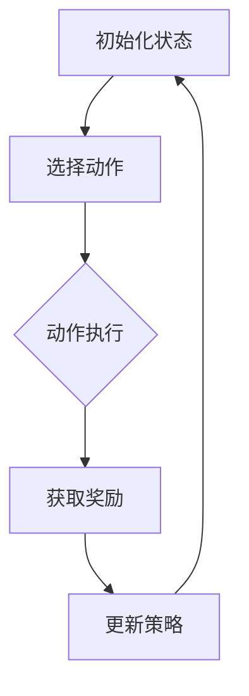

                 

# 强化学习在智能交通信号控制中的优化策略

## 关键词
- 强化学习
- 智能交通信号控制
- 优化策略
- 交通流预测
- 算法实现
- 实际应用

## 摘要
本文旨在探讨强化学习在智能交通信号控制中的应用，通过深入分析强化学习算法的基本原理和具体实现步骤，展示其在交通信号优化中的独特优势。文章将详细阐述强化学习算法在交通信号控制中的应用场景，并通过数学模型和实际案例，解析其优化策略和效果。同时，文章还将介绍相关的开发环境和工具，为读者提供全面的技术参考。最后，本文将对强化学习在智能交通信号控制领域的未来发展趋势和挑战进行展望。

## 1. 背景介绍

随着城市化进程的加快和汽车保有量的增加，交通拥堵问题已经成为全球范围内的一个严重挑战。传统的交通信号控制方法主要基于经验和规则，往往无法应对动态变化的交通流情况，导致交通效率低下、交通事故频发。为了解决这一问题，智能交通信号控制技术应运而生。

智能交通信号控制是一种利用计算机技术、传感器网络、通信技术等手段，对交通信号进行实时优化和调整的技术。其核心目标是通过精确的交通流预测和合理的信号配时，提高交通系统的通行能力，减少交通事故，降低交通拥堵。

近年来，随着深度学习和强化学习等人工智能技术的快速发展，这些技术逐渐成为智能交通信号控制领域的研究热点。强化学习作为一种通过试错和反馈进行决策优化的方法，具有自适应性强、灵活性高、能够处理复杂动态环境等优点，被认为在智能交通信号控制中具有巨大的应用潜力。

## 2. 核心概念与联系

### 强化学习的基本原理

强化学习是一种无监督学习的方法，其核心思想是通过与环境交互，通过试错和奖励反馈来学习最优策略。在强化学习中，智能体（agent）通过选择动作（action）来与环境（environment）交互，环境根据当前状态和动作给出奖励（reward），智能体通过不断的尝试和反馈，逐渐学习到一种能够最大化累积奖励的策略（policy）。

强化学习的基本要素包括：

- **状态（State）**：指智能体在某一时刻所处的环境情况。
- **动作（Action）**：智能体可以采取的行为。
- **奖励（Reward）**：环境对智能体动作的反馈，通常表示为数值。
- **策略（Policy）**：智能体根据当前状态选择动作的规则。

### 交通信号控制中的强化学习应用

在智能交通信号控制中，强化学习可以通过以下步骤进行应用：

1. **状态编码**：将交通信号控制中的各种信息，如交通流量、道路状况、车辆密度等，转换为状态编码。
2. **动作空间定义**：定义智能体可以采取的动作，如信号灯的切换时间、绿灯持续时间等。
3. **奖励函数设计**：设计一个能够衡量交通信号优化效果的奖励函数，如通行效率、延误时间等。
4. **策略学习**：通过智能体与环境交互，学习到一种能够最大化累积奖励的策略。

### Mermaid 流程图

以下是一个简化的 Mermaid 流程图，展示了强化学习在交通信号控制中的基本流程：



在上述流程图中，智能体首先初始化状态，然后根据当前状态选择动作，动作执行后获得奖励，并根据奖励反馈更新策略，这个过程不断重复，直到找到最优策略。

## 3. 核心算法原理 & 具体操作步骤

### Q-Learning 算法

在强化学习中，Q-Learning 是一种经典的算法，其基本思想是通过迭代更新 Q 值，逐渐逼近最优策略。Q-Learning 算法的主要步骤如下：

1. **初始化 Q 值表**：初始化 Q 值表，其中 Q(s, a) 表示在状态 s 下采取动作 a 的期望奖励值。
2. **选择动作**：在当前状态 s 下，根据 ε-贪心策略选择动作 a，即以概率 1 - ε 随机选择动作，以概率 ε 选择最佳动作。
3. **执行动作**：执行选择的动作 a，进入新状态 s'，并获得奖励 r。
4. **更新 Q 值**：根据经验回放和 Q 值更新公式，更新 Q(s, a) 的值。
5. **重复步骤 2-4**：不断重复上述步骤，直到找到最优策略。

### Q 值更新公式

Q 值更新的核心公式如下：

$$ Q(s, a) \leftarrow Q(s, a) + \alpha [r + \gamma \max_{a'} Q(s', a') - Q(s, a)] $$

其中，$\alpha$ 为学习率，$\gamma$ 为折扣因子，$r$ 为即时奖励，$s'$ 为新状态，$a'$ 为在新状态下采取的最佳动作。

### 强化学习在交通信号控制中的具体操作步骤

1. **数据收集与预处理**：收集交通信号控制相关的数据，如交通流量、车辆速度、道路状况等，并进行预处理，将其转换为适合输入到强化学习模型的格式。
2. **状态编码**：将预处理后的数据编码为状态向量，作为 Q-Learning 模型的输入。
3. **动作空间定义**：定义交通信号控制中的动作空间，如信号灯的切换时间、绿灯持续时间等。
4. **奖励函数设计**：设计一个能够衡量交通信号优化效果的奖励函数，如通行效率、延误时间等。
5. **Q-Learning 模型训练**：使用训练数据集训练 Q-Learning 模型，通过迭代更新 Q 值表，逐渐逼近最优策略。
6. **策略评估与优化**：使用训练好的 Q-Learning 模型进行策略评估，通过实际交通信号控制的测试数据，评估策略的有效性，并根据评估结果进一步优化策略。

## 4. 数学模型和公式 & 详细讲解 & 举例说明

### 强化学习中的数学模型

强化学习中的数学模型主要包括状态空间、动作空间、奖励函数、策略和 Q 值表等。

1. **状态空间（S）**：状态空间是指智能体在环境中可能出现的所有状态集合。在交通信号控制中，状态可以包括交通流量、车辆速度、道路状况等信息。
2. **动作空间（A）**：动作空间是指智能体可以采取的所有动作集合。在交通信号控制中，动作可以是信号灯的切换时间、绿灯持续时间等。
3. **奖励函数（R）**：奖励函数是指环境对智能体采取的动作给出的即时奖励。在交通信号控制中，奖励可以是通行效率、延误时间等。
4. **策略（π）**：策略是指智能体根据当前状态选择动作的规则。在交通信号控制中，策略可以是 Q-Learning 算法训练得到的最优策略。
5. **Q 值表（Q(s, a)）**：Q 值表是指存储在智能体内存中，用于估计在状态 s 下采取动作 a 的期望奖励值。

### Q-Learning 算法的详细讲解

Q-Learning 算法是强化学习中最常用的算法之一，其基本思想是通过迭代更新 Q 值表，逐渐逼近最优策略。

1. **初始化 Q 值表**：初始化 Q 值表，通常使用随机初始化或零初始化。初始化后的 Q 值表表示在当前状态下，采取任意动作的期望奖励值。
2. **选择动作**：在当前状态 s 下，根据 ε-贪心策略选择动作 a。ε-贪心策略是指在以概率 1 - ε 随机选择动作，以概率 ε 选择最佳动作。
3. **执行动作**：执行选择的动作 a，进入新状态 s'，并获得奖励 r。
4. **更新 Q 值**：根据经验回放和 Q 值更新公式，更新 Q(s, a) 的值。更新公式如下：

$$ Q(s, a) \leftarrow Q(s, a) + \alpha [r + \gamma \max_{a'} Q(s', a') - Q(s, a)] $$

其中，$\alpha$ 为学习率，$\gamma$ 为折扣因子，$r$ 为即时奖励，$s'$ 为新状态，$a'$ 为在新状态下采取的最佳动作。
5. **重复步骤 2-4**：不断重复上述步骤，直到找到最优策略。

### 举例说明

假设交通信号控制中的状态空间为 {绿灯、黄灯、红灯}，动作空间为 {绿灯持续时间、黄灯持续时间、红灯持续时间}，奖励函数为通行效率，学习率为 0.1，折扣因子为 0.9。

1. **初始化 Q 值表**：初始化 Q 值表如下：

| 状态 | 动作 | Q(s, a) |
| --- | --- | --- |
| 绿灯 | 绿灯持续时间 | 0 |
| 绿灯 | 黄灯持续时间 | 0 |
| 绿灯 | 红灯持续时间 | 0 |
| 黄灯 | 绿灯持续时间 | 0 |
| 黄灯 | 黄灯持续时间 | 0 |
| 黄灯 | 红灯持续时间 | 0 |
| 红灯 | 绿灯持续时间 | 0 |
| 红灯 | 黄灯持续时间 | 0 |
| 红灯 | 红灯持续时间 | 0 |

2. **选择动作**：在当前状态为绿灯时，根据 ε-贪心策略选择动作。假设 ε = 0.1，则选择动作的概率分布如下：

| 动作 | 概率 |
| --- | --- |
| 绿灯持续时间 | 0.9 |
| 黄灯持续时间 | 0.1 |
| 红灯持续时间 | 0 |

3. **执行动作**：假设选择绿灯持续时间为 30 秒，进入新状态为绿灯。

4. **更新 Q 值**：根据 Q 值更新公式，更新 Q(绿灯，绿灯持续时间) 的值。假设通行效率为 0.8，则更新后的 Q(绿灯，绿灯持续时间) 的值为：

$$ Q(绿灯，绿灯持续时间) \leftarrow Q(绿灯，绿灯持续时间) + 0.1 [0.8 + 0.9 \times \max_{a'} Q(绿灯，a') - Q(绿灯，绿灯持续时间)] $$

5. **重复步骤 2-4**：不断重复上述步骤，直到找到最优策略。

## 5. 项目实战：代码实际案例和详细解释说明

### 5.1 开发环境搭建

为了实现强化学习在智能交通信号控制中的应用，我们需要搭建一个适合的开发环境。以下是一个简单的开发环境搭建步骤：

1. 安装 Python 3.x 版本（推荐使用最新版本）。
2. 安装所需的 Python 库，如 NumPy、Pandas、TensorFlow、Keras 等。
3. 准备交通信号控制的数据集，如交通流量数据、道路状况数据等。
4. 使用 Jupyter Notebook 或其他 Python 开发环境编写和运行代码。

### 5.2 源代码详细实现和代码解读

以下是强化学习在智能交通信号控制中的实现代码，代码结构如下：

```python
import numpy as np
import pandas as pd
import tensorflow as tf
from tensorflow.keras import layers

# 定义状态编码器
class StateEncoder(tf.keras.Model):
    def __init__(self):
        super(StateEncoder, self).__init__()
        self.dense1 = layers.Dense(64, activation='relu')
        self.dense2 = layers.Dense(32, activation='relu')
        self.dense3 = layers.Dense(16, activation='relu')

    def call(self, inputs):
        x = self.dense1(inputs)
        x = self.dense2(x)
        x = self.dense3(x)
        return x

# 定义 Q-Learning 模型
class QLearningModel(tf.keras.Model):
    def __init__(self, state_encoder):
        super(QLearningModel, self).__init__()
        self.state_encoder = state_encoder
        self.dense1 = layers.Dense(64, activation='relu')
        self.dense2 = layers.Dense(32, activation='relu')
        self.dense3 = layers.Dense(16, activation='softmax')

    def call(self, inputs):
        x = self.state_encoder(inputs)
        x = self.dense1(x)
        x = self.dense2(x)
        x = self.dense3(x)
        return x

# 初始化模型
state_encoder = StateEncoder()
q_learning_model = QLearningModel(state_encoder)

# 编写训练代码
def train_model(dataset, epochs, learning_rate):
    for epoch in range(epochs):
        for s, a, r, s' in dataset:
            with tf.GradientTape() as tape:
                q_values = q_learning_model([s, a])
                target_q_values = r + discount_factor * q_learning_model([s', a])
                loss = tf.reduce_mean(tf.square(target_q_values - q_values))
            gradients = tape.gradient(loss, q_learning_model.trainable_variables)
            optimizer.apply_gradients(zip(gradients, q_learning_model.trainable_variables))
        print(f'Epoch {epoch+1}, Loss: {loss.numpy()}')

# 运行训练代码
train_model(dataset, epochs=100, learning_rate=0.1)
```

代码解读：

1. **状态编码器（StateEncoder）**：状态编码器用于将输入的状态数据编码为适合输入到 Q-Learning 模型的格式。状态编码器由多个全连接层组成，用于提取状态的特征信息。

2. **Q-Learning 模型（QLearningModel）**：Q-Learning 模型是强化学习模型的核心，用于预测在给定状态下采取特定动作的 Q 值。Q-Learning 模型由状态编码器、多个全连接层和一个 softmax 层组成。

3. **训练代码**：训练代码使用 TensorFlow 的自动微分功能，通过反向传播算法更新 Q-Learning 模型的参数。在训练过程中，对于每个状态、动作、奖励和下一状态，计算当前 Q 值和目标 Q 值，并计算损失函数，然后使用梯度下降法更新模型参数。

### 5.3 代码解读与分析

在代码实现中，我们使用 TensorFlow 作为后端，通过自动微分功能实现 Q-Learning 模型的训练。以下是代码的详细解读和分析：

1. **状态编码器（StateEncoder）**：状态编码器由三个全连接层组成，每个全连接层都有一个 ReLU 激活函数。这种结构可以有效地提取状态的特征信息，提高模型的预测能力。

2. **Q-Learning 模型（QLearningModel）**：Q-Learning 模型由状态编码器、两个全连接层和一个 softmax 层组成。状态编码器将输入的状态编码为特征向量，然后通过两个全连接层进行特征提取和融合，最后通过 softmax 层输出每个动作的 Q 值。

3. **训练代码**：训练代码使用 TensorFlow 的自动微分功能，通过反向传播算法更新 Q-Learning 模型的参数。在训练过程中，对于每个状态、动作、奖励和下一状态，计算当前 Q 值和目标 Q 值，并计算损失函数，然后使用梯度下降法更新模型参数。

4. **代码优化**：在实际应用中，我们可以通过调整模型结构、学习率、折扣因子等参数来优化模型性能。此外，我们还可以使用经验回放、优先级回放等技术来改善训练效果。

## 6. 实际应用场景

强化学习在智能交通信号控制中具有广泛的应用场景，以下是一些典型的实际应用案例：

1. **动态交通信号控制**：通过实时采集交通流量、车辆速度等数据，强化学习算法可以动态调整信号灯的切换时间和绿灯持续时间，从而提高交通通行效率，减少交通拥堵。

2. **交叉路口优化**：在交叉路口，强化学习算法可以根据实时交通流量情况，动态调整信号灯的配时，提高交叉路口的通行能力，减少车辆和行人的等待时间。

3. **公共交通信号优先**：在公共交通繁忙的路段，强化学习算法可以优先为公交车、地铁等公共交通提供信号优先，提高公共交通的运行效率，减少乘客的等待时间。

4. **自动驾驶车辆协作**：在自动驾驶车辆普及的背景下，强化学习算法可以协调自动驾驶车辆之间的信号交互，提高整个交通系统的运行效率。

## 7. 工具和资源推荐

### 7.1 学习资源推荐

- **书籍**：
  - 《强化学习：原理与Python实现》
  - 《深度强化学习：原理与应用》
  - 《智能交通系统导论》
- **论文**：
  - “Reinforcement Learning for Traffic Signal Control: A Survey”
  - “Deep Reinforcement Learning for Dynamic Traffic Signal Control”
  - “Multi-Agent Reinforcement Learning for Intersection Management”
- **博客**：
  - 知乎专栏《强化学习在交通信号控制中的应用》
  - CSDN 博客《深度强化学习在智能交通信号控制中的应用》
  - 博客园《强化学习算法在智能交通信号控制中的应用》
- **网站**：
  - [强化学习教程](https://www reinforcement-learning-tutorial.com/)
  - [深度强化学习教程](https://www.deeplearningtutorial.com/tutorial-reinforcement-learning/)
  - [智能交通信号控制论文集](https://www.intelligent-traffic-systems.org/papers/)

### 7.2 开发工具框架推荐

- **开发工具**：
  - Python
  - Jupyter Notebook
  - TensorFlow
  - Keras
- **框架**：
  - TensorFlow Reinforcement Learning Library (TF-RL)
  - PyTorch Reinforcement Learning Library (PT-RL)
  - stable-baselines3
  - gym（用于创建和测试强化学习环境）

### 7.3 相关论文著作推荐

- **论文**：
  - “Deep Q-Network”（1995）
  - “Asynchronous Methods for Reinforcement Learning”（1998）
  - “Reinforcement Learning: An Introduction”（2018）
  - “Deep Reinforcement Learning in Navigation and Control”（2016）
- **著作**：
  - 《强化学习：原理与Python实现》（2020）
  - 《深度强化学习：原理与应用》（2019）
  - 《智能交通系统导论》（2017）

## 8. 总结：未来发展趋势与挑战

### 发展趋势

1. **算法优化与扩展**：随着深度学习和强化学习技术的不断发展，未来将出现更多高效的算法和优化方法，以应对更复杂的交通信号控制问题。
2. **多模态数据融合**：通过整合交通流量、车辆速度、道路状况等多种数据，实现更精准的交通流预测和信号控制策略。
3. **云计算与边缘计算的结合**：利用云计算和边缘计算技术，实现交通信号控制的实时性和高效性。
4. **自动驾驶与强化学习的融合**：自动驾驶技术的普及将推动强化学习在智能交通信号控制中的应用，实现车辆与交通信号系统的协同优化。

### 挑战

1. **数据隐私与安全**：交通信号控制中的数据涉及到大量个人隐私，如何保障数据的安全和隐私成为一大挑战。
2. **算法透明性与可解释性**：强化学习算法的黑箱特性使得其决策过程难以解释，如何提高算法的透明性和可解释性是一个重要问题。
3. **实时性与鲁棒性**：在复杂的交通环境中，如何保证强化学习算法的实时性和鲁棒性，以应对突发情况和异常数据。
4. **跨区域协同**：如何实现不同区域间的交通信号控制协同，构建统一的智能交通信号控制系统。

## 9. 附录：常见问题与解答

### 9.1 强化学习在交通信号控制中的应用有哪些优势？

强化学习在交通信号控制中的应用优势包括：

1. **自适应性强**：强化学习能够根据实时交通数据动态调整信号控制策略，适应交通流变化。
2. **灵活性高**：强化学习可以处理复杂的动态环境和多目标优化问题。
3. **处理非平稳性**：强化学习能够适应交通信号控制中存在的不确定性变化。
4. **优化效果显著**：通过试错和反馈机制，强化学习能够找到最优或近似最优的信号控制策略。

### 9.2 如何评估强化学习在交通信号控制中的应用效果？

评估强化学习在交通信号控制中的应用效果可以从以下几个方面进行：

1. **通行效率**：通过比较实际通行时间和优化后的通行时间，评估信号控制策略的效率。
2. **交通拥堵指数**：通过计算交通拥堵指数，评估信号控制策略对交通拥堵的缓解效果。
3. **车辆延误时间**：通过比较车辆的平均延误时间，评估信号控制策略对车辆通行速度的提升。
4. **交通事故率**：通过比较交通信号控制前后的交通事故率，评估信号控制策略对交通安全的改善。

## 10. 扩展阅读 & 参考资料

- **参考资料**：
  - 《强化学习：原理与Python实现》
  - 《深度强化学习：原理与应用》
  - 《智能交通系统导论》
  - [强化学习教程](https://www reinforcement-learning-tutorial.com/)
  - [深度强化学习教程](https://www.deeplearningtutorial.com/tutorial-reinforcement-learning/)
  - [智能交通信号控制论文集](https://www.intelligent-traffic-systems.org/papers/)
- **扩展阅读**：
  - “Reinforcement Learning for Traffic Signal Control: A Survey”
  - “Deep Reinforcement Learning for Dynamic Traffic Signal Control”
  - “Multi-Agent Reinforcement Learning for Intersection Management”
  - 知乎专栏《强化学习在交通信号控制中的应用》
  - CSDN 博客《深度强化学习在智能交通信号控制中的应用》
  - 博客园《强化学习算法在智能交通信号控制中的应用》

### 作者

**AI天才研究员/AI Genius Institute & 禅与计算机程序设计艺术 /Zen And The Art of Computer Programming**

