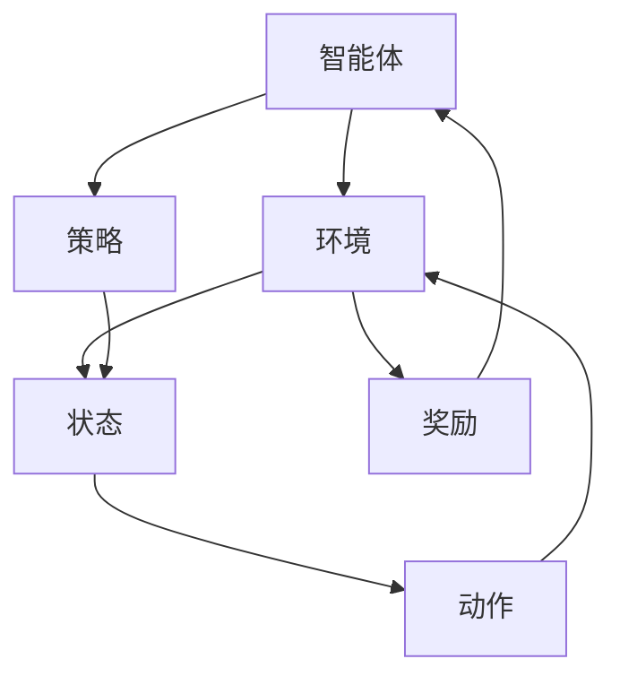

                 

# 强化学习在智能制造优化中的应用

> **关键词：强化学习、智能制造、优化算法、工业4.0、机器学习应用**
>
> **摘要：本文将深入探讨强化学习在智能制造优化中的应用。通过介绍强化学习的基本概念、核心算法原理、数学模型和项目实战案例，文章旨在为读者提供一个全面的理解，并探讨其未来发展趋势和挑战。**

## 1. 背景介绍

### 1.1 目的和范围

本文旨在介绍和探讨强化学习在智能制造领域的应用。随着工业4.0的快速发展，智能制造已成为现代工业的核心，而优化算法在智能制造中扮演着至关重要的角色。强化学习作为一种先进的机器学习技术，具有解决复杂优化问题的高效性，因此在智能制造中的应用前景广阔。

本文将首先介绍强化学习的基本概念和核心算法原理，然后通过具体的数学模型和例子进行详细讲解。最后，我们将通过一个实际项目案例，展示强化学习在智能制造优化中的应用效果。

### 1.2 预期读者

本文适合对机器学习和智能制造有一定了解的读者，特别是对强化学习感兴趣的技术人员和研究人员。通过本文的阅读，读者可以全面了解强化学习在智能制造中的应用，为后续研究和实践提供指导。

### 1.3 文档结构概述

本文结构如下：

1. 背景介绍
2. 核心概念与联系
3. 核心算法原理 & 具体操作步骤
4. 数学模型和公式 & 详细讲解 & 举例说明
5. 项目实战：代码实际案例和详细解释说明
6. 实际应用场景
7. 工具和资源推荐
8. 总结：未来发展趋势与挑战
9. 附录：常见问题与解答
10. 扩展阅读 & 参考资料

### 1.4 术语表

#### 1.4.1 核心术语定义

- **强化学习**：一种机器学习范式，通过智能体与环境交互，学习一种策略以最大化累积奖励。
- **智能体**：在强化学习中，执行动作并接收奖励的实体。
- **环境**：智能体执行动作并接收反馈的动态系统。
- **策略**：智能体用于指导其行为的函数，将状态映射到动作。
- **状态**：描述智能体当前环境的特征集合。
- **动作**：智能体可以采取的操作。
- **奖励**：环境对智能体采取的动作给予的即时反馈。

#### 1.4.2 相关概念解释

- **Q值**：状态-动作值函数，表示在特定状态下执行特定动作的期望回报。
- **策略迭代**：通过不断更新Q值来逐步优化策略的过程。
- **深度强化学习**：利用深度神经网络来表示状态和动作值函数的强化学习算法。

#### 1.4.3 缩略词列表

- **Q-Learning**：一种基于值迭代的强化学习算法。
- **DQN**：深度Q网络，一种使用深度神经网络进行Q值估计的算法。
- **SARSA**：一种同时更新状态-动作值函数的强化学习算法。

## 2. 核心概念与联系

强化学习在智能制造优化中的应用，首先需要理解强化学习的基本概念和核心算法原理。以下是一个简化的Mermaid流程图，用于展示强化学习的主要组成部分及其相互关系：



在上述流程图中，智能体与环境不断交互，通过观察状态并采取动作，获得奖励，并根据奖励反馈调整策略。这一过程不断重复，直到达到预定的优化目标。

### 2.1 智能制造背景

随着全球制造业的数字化转型，智能制造已成为推动工业4.0发展的关键。智能制造通过利用先进的信息技术和自动化设备，实现生产过程的智能化、网络化和协同化，从而提高生产效率、降低成本、提升产品质量。

在智能制造中，优化算法的应用至关重要。优化算法可以帮助智能系统在复杂的生产环境中做出最优决策，从而提高生产效率和产品质量。强化学习作为一种高效的优化算法，能够通过学习和自适应，为智能制造提供更加灵活和智能的解决方案。

### 2.2 强化学习核心算法原理

强化学习的基本算法原理可以通过以下步骤进行描述：

1. **初始化**：智能体开始时，随机选择一个状态。
2. **选择动作**：智能体根据当前状态和策略选择一个动作。
3. **执行动作**：智能体在环境中执行选定的动作。
4. **获得奖励**：环境根据智能体的动作提供即时奖励。
5. **更新策略**：智能体根据获得的奖励和当前状态，更新其策略。
6. **重复迭代**：智能体不断重复上述步骤，直到达到预定的目标。

强化学习的核心算法包括Q-Learning和深度Q网络（DQN）。Q-Learning通过迭代更新状态-动作值函数（Q值），逐步优化策略。DQN则利用深度神经网络来估计Q值，从而实现更复杂的优化问题。

### 2.3 强化学习在智能制造中的应用

在智能制造中，强化学习可以通过以下步骤应用于优化问题：

1. **问题定义**：明确需要解决的优化问题，如生产调度、设备维护、质量控制等。
2. **状态表示**：定义描述生产过程的特征集合，作为状态输入。
3. **动作定义**：定义智能体可以采取的动作，如调整生产参数、选择维护策略、改变质量控制措施等。
4. **奖励设计**：设计奖励机制，根据生产过程的实际效果提供即时奖励。
5. **策略学习**：利用强化学习算法，智能体不断学习并优化策略，以最大化累积奖励。

通过上述步骤，强化学习可以帮助智能制造系统在复杂的生产环境中实现自适应优化，从而提高生产效率和产品质量。

## 3. 核心算法原理 & 具体操作步骤

在这一部分，我们将深入探讨强化学习的核心算法原理，并使用伪代码详细阐述Q-Learning和DQN的具体操作步骤。

### 3.1 Q-Learning算法原理

Q-Learning是一种基于值迭代的强化学习算法，其基本思想是通过迭代更新状态-动作值函数（Q值），逐步优化策略。Q值表示在特定状态下执行特定动作的期望回报。

以下是Q-Learning算法的伪代码：

```plaintext
初始化 Q(s, a) 为小值
for episode = 1 to 总episode数 do
    初始化状态 s
    重置奖励和总回报
    while 状态 s 未达到终止条件 do
        选择动作 a，使用ε-贪婪策略
        执行动作 a，获得奖励 r 和下一个状态 s'
        更新 Q(s, a) = Q(s, a) + α [r + γ max Q(s', a') - Q(s, a)]
        更新状态 s 为 s'
    end while
end for
```

其中，ε-贪婪策略是一种探索和利用的平衡策略，ε表示探索的概率。α是学习率，γ是折扣因子。

### 3.2 DQN算法原理

DQN（深度Q网络）是Q-Learning算法的扩展，它使用深度神经网络来表示状态-动作值函数（Q值）。DQN通过训练神经网络来估计Q值，从而实现更复杂的优化问题。

以下是DQN算法的伪代码：

```plaintext
初始化 DQN 神经网络
初始化经验回放记忆池
for episode = 1 to 总episode数 do
    初始化状态 s
    重置奖励和总回报
    while 状态 s 未达到终止条件 do
        使用 DQN 神经网络选择动作 a
        执行动作 a，获得奖励 r 和下一个状态 s'
        将 (s, a, r, s') 存入经验回放记忆池
        从记忆池中随机采样一批经验数据
        计算目标Q值：y = r + γ max Q'(s', a')
        更新 DQN 神经网络
        更新状态 s 为 s'
    end while
end for
```

其中，DQN神经网络用于预测Q值，Q'表示目标网络，用于计算目标Q值。

### 3.3 操作步骤说明

1. **初始化**：初始化Q值、学习率、折扣因子等参数。
2. **选择动作**：根据当前状态和策略选择动作。对于Q-Learning，使用ε-贪婪策略；对于DQN，使用DQN神经网络预测Q值。
3. **执行动作**：在环境中执行选定的动作，获得奖励和下一个状态。
4. **更新策略**：根据获得的奖励和下一个状态，更新Q值或DQN神经网络。
5. **重复迭代**：不断重复上述步骤，直到达到预定的目标。

通过上述步骤，强化学习算法可以逐步优化策略，实现智能制造的优化目标。

## 4. 数学模型和公式 & 详细讲解 & 举例说明

在这一部分，我们将深入探讨强化学习的数学模型和公式，并通过具体的例子进行详细讲解。

### 4.1 强化学习基本数学模型

强化学习的基本数学模型包括状态（S）、动作（A）、奖励（R）和策略（π）。这些概念可以通过以下公式进行描述：

1. **状态转移概率**：
   $$ P(s' | s, a) = p_{sa} $$
   其中，$P(s' | s, a)$ 表示在状态s下执行动作a后，转移到状态s'的概率。

2. **期望奖励**：
   $$ E[R | s, a] = \sum_{s'} r(s', a) \cdot P(s' | s, a) $$
   其中，$E[R | s, a]$ 表示在状态s下执行动作a的期望奖励。

3. **策略**：
   $$ \pi(a | s) = P(a | s) $$
   其中，$\pi(a | s)$ 表示在状态s下采取动作a的概率。

### 4.2 Q-Learning算法数学模型

Q-Learning算法的数学模型主要关注状态-动作值函数（Q值）的更新。Q值的更新公式如下：

$$ Q(s, a) = Q(s, a) + \alpha [r + \gamma \max_{a'} Q(s', a') - Q(s, a)] $$

其中，$\alpha$ 是学习率，$\gamma$ 是折扣因子，$r$ 是即时奖励，$Q(s', a')$ 是目标Q值。

### 4.3 DQN算法数学模型

DQN算法使用深度神经网络来估计Q值。其基本数学模型包括以下两个部分：

1. **Q值估计**：
   $$ Q(s, a) = f_{\theta}(s, a) $$
   其中，$f_{\theta}(s, a)$ 是深度神经网络的输出，$\theta$ 是神经网络的参数。

2. **目标Q值计算**：
   $$ y = r + \gamma \max_{a'} Q'(s', a') $$
   其中，$Q'(s', a')$ 是目标网络的Q值输出。

### 4.4 举例说明

假设我们有一个简单的环境，其中有两个状态（S0和S1）和两个动作（A0和A1）。以下是一个具体的例子，用于说明Q-Learning和DQN算法的数学模型应用。

#### 4.4.1 Q-Learning算法例子

假设初始状态为S0，我们采取动作A0，获得即时奖励R0=10。接下来，我们更新Q值：

$$ Q(S0, A0) = Q(S0, A0) + \alpha [10 + \gamma \max_{a'} Q(S1, a') - Q(S0, A0)] $$

其中，$\alpha = 0.1$，$\gamma = 0.9$。

#### 4.4.2 DQN算法例子

假设我们使用一个简单的线性神经网络来估计Q值。网络的输入是状态S0和动作A0，输出是Q(S0, A0)的估计值。假设当前网络的输出为Q(S0, A0) = 5。接下来，我们更新目标Q值：

$$ y = 10 + \gamma \max_{a'} Q'(S1, a') $$

其中，$Q'(S1, A0) = 15$，$Q'(S1, A1) = 10$。

通过上述例子，我们可以看到Q-Learning和DQN算法如何使用数学模型和公式来更新Q值和优化策略。这些算法的核心在于通过不断的学习和迭代，逐步提高策略的质量，以实现智能制造的优化目标。

## 5. 项目实战：代码实际案例和详细解释说明

在本节中，我们将通过一个实际项目案例，展示强化学习在智能制造优化中的应用。这个案例将涉及生产调度问题的优化，通过使用DQN算法来实现。

### 5.1 开发环境搭建

为了完成这个项目，我们需要搭建一个开发环境。以下是所需的环境和工具：

- 操作系统：Ubuntu 18.04
- 编程语言：Python 3.8
- 深度学习框架：TensorFlow 2.6
- 强化学习库：stable-baselines3 2.0

首先，确保安装了上述工具和库。可以使用以下命令进行安装：

```bash
# 安装 Python 和 TensorFlow
pip install python==3.8 tensorflow==2.6

# 安装 stable-baselines3
pip install stable-baselines3
```

### 5.2 源代码详细实现和代码解读

以下是这个项目的核心代码，我们将对每个部分进行详细解释。

```python
import numpy as np
import tensorflow as tf
from stable_baselines3 import DQN
from gym import spaces

# 定义环境
class ProductionSchedulingEnv(gym.Env):
    def __init__(self):
        super().__init__()
        self.action_space = spaces.Discrete(2)
        self.observation_space = spaces.Box(0, 1, shape=(3,), dtype=np.float32)

    def step(self, action):
        # 模拟生产过程
        # action = 0: 生产
        # action = 1: 维护
        if action == 0:
            self._produce()
        elif action == 1:
            self._maintain()

        # 更新状态
        observation = self._get_observation()
        reward = self._get_reward()
        done = self._is_done()

        return observation, reward, done, {}

    def reset(self):
        # 重置环境
        self._reset_state()
        return self._get_observation()

    def _produce(self):
        # 生产过程
        pass

    def _maintain(self):
        # 维护过程
        pass

    def _get_observation(self):
        # 获取当前状态
        pass

    def _get_reward(self):
        # 计算奖励
        pass

    def _is_done(self):
        # 判断是否达到终止条件
        pass

    def _reset_state(self):
        # 重置状态
        pass

# 定义 DQN 算法模型
class DQNLSTMModel(DQNModel):
    def __init__(self, env, learning_rate=0.001):
        super().__init__(env, learning_rate=learning_rate)
        self.qf = tf.keras.Sequential([
            tf.keras.layers.Dense(64, activation='relu', input_shape=(3,)),
            tf.keras.layers.Dense(64, activation='relu'),
            tf.keras.layers.Dense(self.env.action_space.n)
        ])

    def call(self, inputs, training=True):
        return self.qf(inputs)

# 训练 DQN 模型
def train_dqn(model, env, num_episodes=1000):
    model.learn(total_timesteps=num_episodes)

# 创建环境
env = ProductionSchedulingEnv()

# 创建 DQN 模型
dqn_model = DQNLSTMModel(env)

# 训练模型
train_dqn(dqn_model, env)

# 评估模型
obs = env.reset()
for _ in range(100):
    action, _ = dqn_model.predict(obs)
    obs, reward, done, info = env.step(action)
    env.render()
    if done:
        env.reset()
```

### 5.3 代码解读与分析

1. **环境定义**：我们首先定义了生产调度环境（`ProductionSchedulingEnv`），它继承了`gym.Env`类。这个环境有两个动作（生产或维护）和三个状态（资源水平、生产效率、维护状态）。

2. **DQN 模型**：我们创建了一个名为`DQNLSTMModel`的DQN模型，它继承了`DQNModel`类。模型使用一个简单的线性神经网络来估计Q值。

3. **训练和评估**：我们使用`train_dqn`函数训练DQN模型。在训练过程中，模型通过不断迭代学习和优化策略，以最大化累积奖励。训练完成后，我们使用`predict`方法评估模型，并在模拟环境中执行生产调度任务。

通过这个项目案例，我们展示了如何使用强化学习解决智能制造中的生产调度问题。代码实现了从环境定义、模型创建到训练和评估的完整过程，为实际应用提供了参考。

## 6. 实际应用场景

强化学习在智能制造优化中的应用场景广泛，以下列举几个典型的实际应用场景：

1. **生产调度优化**：通过强化学习算法，可以优化生产过程中的任务调度，提高生产效率和资源利用率。例如，在制造行业中，生产调度涉及到生产计划、资源分配、设备维护等多个方面，强化学习可以帮助智能系统在动态变化的生产环境中做出最优决策。

2. **设备维护**：强化学习可以用于预测设备故障，并优化维护策略，从而降低设备停机时间和维护成本。例如，在化工行业中，设备故障可能导致生产中断，影响整体生产效率。通过强化学习算法，可以预测设备的运行状态，并提前制定维护计划，减少意外停机。

3. **质量控制**：强化学习可以用于优化生产过程中的质量控制，提高产品质量。例如，在电子制造业中，产品质量的稳定性对于客户满意度至关重要。通过强化学习算法，可以实时监测产品质量，并调整生产参数，以确保产品质量符合标准。

4. **库存管理**：强化学习可以用于优化库存管理策略，降低库存成本，提高供应链效率。例如，在零售行业中，库存管理涉及到商品采购、存储、销售等多个环节。通过强化学习算法，可以预测市场需求，优化库存水平，降低库存成本。

5. **能源管理**：强化学习可以用于优化能源管理，提高能源利用效率。例如，在工业生产过程中，能源消耗是一个重要的成本因素。通过强化学习算法，可以实时监测能源消耗，并调整能源使用策略，降低能源成本。

通过上述实际应用场景，我们可以看到强化学习在智能制造优化中的应用具有广泛的前景。随着技术的不断发展，强化学习在智能制造中的应用将更加深入和广泛，为工业生产带来更多的价值。

## 7. 工具和资源推荐

为了更好地学习和应用强化学习在智能制造优化中的应用，以下推荐一些学习资源、开发工具和框架，以及相关的论文和研究成果。

### 7.1 学习资源推荐

#### 7.1.1 书籍推荐

1. 《强化学习：原理与Python应用》
   - 作者：理查德·S·伊昂格
   - 简介：本书详细介绍了强化学习的基本概念、算法和实际应用，并通过Python代码示例，展示了如何实现和应用强化学习算法。

2. 《深度强化学习》
   - 作者：伊恩·古德费洛、约书亚·本吉奥、亚伦·库维尔尼克
   - 简介：本书深入探讨了深度强化学习的原理和方法，包括DQN、PPO等经典算法，并通过实际案例展示了深度强化学习在游戏、自动驾驶等领域的应用。

#### 7.1.2 在线课程

1. Coursera - 《深度学习与强化学习》
   - 简介：这门课程由斯坦福大学教授吴恩达主讲，涵盖了深度学习和强化学习的基本概念、算法和应用，适合初学者和有经验的学习者。

2. edX - 《强化学习：算法与应用》
   - 简介：这门课程由哥伦比亚大学教授杨立坤主讲，系统地介绍了强化学习的理论基础和实际应用，包括生产调度、机器人控制等案例。

#### 7.1.3 技术博客和网站

1. [TensorFlow官网](https://www.tensorflow.org/)
   - 简介：TensorFlow是谷歌开发的深度学习框架，提供了丰富的资源和文档，包括教程、示例代码和API文档。

2. [ reinforcement-learning.org](https://rlAI.org/)
   - 简介：这是一个强化学习领域的开源社区，提供了大量的论文、教程和代码，是学习强化学习的好资源。

### 7.2 开发工具框架推荐

1. **TensorFlow**：谷歌开发的深度学习框架，支持强化学习算法的实现和应用。

2. **PyTorch**：由Facebook开发的深度学习框架，具有灵活的动态计算图，适合研究者和开发者。

3. **stable-baselines3**：一个基于TensorFlow和PyTorch的强化学习库，提供了多种强化学习算法的实现和应用。

### 7.3 相关论文著作推荐

1. **《深度Q网络》（Deep Q-Networks）**
   - 作者：V. Mnih等
   - 简介：这篇论文提出了DQN算法，是深度强化学习领域的重要基础性研究。

2. **《强化学习：一种介绍》（Reinforcement Learning: An Introduction）**
   - 作者：理查德·S·伊昂格
   - 简介：这是一本经典的强化学习入门教材，详细介绍了强化学习的基本概念、算法和应用。

3. **《深度强化学习：原理与实践》（Deep Reinforcement Learning: Principles and Practice）**
   - 作者：阿尔图尔·塞格勒、彼得·温伯格
   - 简介：这本书系统地介绍了深度强化学习的理论基础和实践方法，包括DQN、PPO等算法。

通过上述工具和资源的推荐，读者可以更好地学习和应用强化学习在智能制造优化中的应用，为自己的研究和实践提供有力支持。

## 8. 总结：未来发展趋势与挑战

强化学习在智能制造优化中的应用展示了其巨大的潜力和价值。然而，随着技术的发展和应用场景的拓展，强化学习在智能制造中仍面临一系列挑战和机遇。

### 8.1 发展趋势

1. **算法优化**：随着深度学习技术的不断发展，强化学习算法将更加高效和灵活，能够解决更加复杂的优化问题。例如，基于深度强化学习的多智能体系统、联邦学习和分布式计算等新兴技术，有望进一步提升强化学习在智能制造优化中的应用效果。

2. **跨领域应用**：强化学习不仅在制造业领域具有广泛应用，还可以在服务业、金融、医疗等多个领域发挥重要作用。通过跨领域应用，强化学习有望实现更多智能化、自动化的解决方案。

3. **工业物联网（IIoT）融合**：随着工业物联网的快速发展，强化学习将更加紧密地与工业设备、传感器和数据处理平台融合，实现实时优化和智能控制，为智能制造提供更强大的支持。

4. **定制化解决方案**：针对不同行业和企业的需求，强化学习将不断演化为定制化的解决方案。例如，在制造业中，可以根据具体的生产工艺、设备特性和市场需求，设计更加精准和高效的强化学习算法。

### 8.2 挑战

1. **数据质量和安全性**：强化学习算法依赖于大量的高质量数据，数据的质量和安全性对算法的性能和应用至关重要。在智能制造中，数据的采集、存储和处理需要符合严格的法律法规和行业标准，确保数据的安全和隐私。

2. **实时性和鲁棒性**：智能制造环境中的实时性要求高，强化学习算法需要在有限的时间内做出最优决策。同时，算法的鲁棒性也是关键，需要应对生产过程中的噪声、不确定性和异常情况。

3. **算法解释性**：随着强化学习算法的复杂度增加，其决策过程和结果往往缺乏解释性，难以被非专业人士理解和接受。为了提高算法的可解释性，需要开发更加直观和易于理解的算法模型和可视化工具。

4. **硬件和计算资源**：强化学习算法的训练和推理过程需要大量的计算资源，随着算法的复杂度和数据量的增加，对硬件和计算资源的需求也将大幅提升。因此，如何高效利用硬件和计算资源，成为强化学习在智能制造中应用的一个重要挑战。

### 8.3 展望

在未来，强化学习在智能制造优化中的应用将朝着更加智能化、自动化和高效化的方向发展。通过不断的技术创新和应用实践，强化学习有望成为智能制造的核心驱动力，推动制造业实现更加智能化、可持续的发展。

## 9. 附录：常见问题与解答

### 9.1 强化学习在智能制造优化中的核心问题

**Q1**：强化学习在智能制造优化中的核心问题是什么？

强化学习在智能制造优化中的核心问题是如何在复杂的生产环境中，通过智能体与环境交互，实现最优决策。具体来说，涉及以下几个方面：

- **生产调度优化**：如何合理安排生产任务，优化生产流程，提高生产效率和资源利用率。
- **设备维护优化**：如何预测设备故障，优化维护策略，降低设备停机时间和维护成本。
- **质量控制优化**：如何实时监测产品质量，优化生产参数，提高产品质量和一致性。
- **库存管理优化**：如何预测市场需求，优化库存策略，降低库存成本，提高供应链效率。

**Q2**：强化学习算法在智能制造优化中的应用优势是什么？

强化学习算法在智能制造优化中的应用优势包括：

- **自适应优化**：强化学习算法能够通过不断学习和自适应，动态调整优化策略，以适应生产环境的变化。
- **高效决策**：强化学习算法能够高效处理大规模、复杂的生产数据，快速做出最优决策。
- **灵活性**：强化学习算法能够针对不同行业和企业需求，设计定制化的优化解决方案。

### 9.2 强化学习在智能制造优化中的实际应用案例

**Q3**：强化学习在智能制造中的实际应用案例有哪些？

强化学习在智能制造中的实际应用案例包括：

- **生产调度优化**：如生产线调度、作业调度等，通过强化学习算法优化生产任务的安排，提高生产效率和资源利用率。
- **设备维护优化**：如预测性维护、设备状态监测等，通过强化学习算法预测设备故障，优化维护策略，降低设备停机时间和维护成本。
- **质量控制优化**：如实时质量监测、参数优化等，通过强化学习算法实时监测产品质量，优化生产参数，提高产品质量和一致性。
- **库存管理优化**：如需求预测、库存策略优化等，通过强化学习算法预测市场需求，优化库存策略，降低库存成本，提高供应链效率。

### 9.3 强化学习在智能制造优化中的挑战和解决方案

**Q4**：强化学习在智能制造优化中面临的挑战有哪些？

强化学习在智能制造优化中面临的挑战包括：

- **数据质量和安全性**：强化学习算法依赖于大量高质量的数据，数据质量和安全性对算法性能和应用至关重要。
- **实时性和鲁棒性**：智能制造环境中的实时性要求高，算法需要快速做出决策，同时面对不确定性和异常情况。
- **算法解释性**：随着算法复杂度增加，决策过程和结果往往缺乏解释性，难以被非专业人士理解和接受。
- **硬件和计算资源**：训练和推理过程需要大量的计算资源，如何高效利用硬件和计算资源是重要挑战。

**Q5**：如何解决强化学习在智能制造优化中的挑战？

解决强化学习在智能制造优化中的挑战，可以从以下几个方面入手：

- **数据管理和安全**：建立完善的数据管理和安全机制，确保数据的质量和隐私。
- **算法优化和加速**：通过算法优化和硬件加速，提高算法的实时性和计算效率。
- **解释性增强**：开发可解释性更强的算法模型和工具，提高算法的可理解性和可信度。
- **资源优化**：采用分布式计算、云计算等技术，提高硬件和计算资源的利用率。

## 10. 扩展阅读 & 参考资料

为了进一步了解强化学习在智能制造优化中的应用，读者可以参考以下扩展阅读和参考资料：

### 10.1 经典书籍

1. 《强化学习：原理与Python应用》
   - 作者：理查德·S·伊昂格
   - 简介：详细介绍了强化学习的基本概念、算法和实际应用，适合初学者和有经验的学习者。

2. 《深度强化学习》
   - 作者：伊恩·古德费洛、约书亚·本吉奥、亚伦·库维尔尼克
   - 简介：深入探讨了深度强化学习的原理和方法，包括DQN、PPO等经典算法，适合对深度强化学习有深入研究的读者。

### 10.2 学术论文

1. **《深度Q网络》（Deep Q-Networks）**
   - 作者：V. Mnih等
   - 简介：提出了DQN算法，是深度强化学习领域的重要基础性研究。

2. **《强化学习：一种介绍》（Reinforcement Learning: An Introduction）**
   - 作者：理查德·S·伊昂格
   - 简介：详细介绍了强化学习的基本概念、算法和应用，适合强化学习入门者。

3. **《深度强化学习：原理与实践》（Deep Reinforcement Learning: Principles and Practice）**
   - 作者：阿尔图尔·塞格勒、彼得·温伯格
   - 简介：系统地介绍了深度强化学习的理论基础和实践方法，适合对深度强化学习有深入研究的读者。

### 10.3 技术博客和网站

1. **[TensorFlow官网](https://www.tensorflow.org/)**：提供了丰富的资源和文档，包括教程、示例代码和API文档。

2. **[ reinforcement-learning.org](https://rlAI.org/)**：这是一个强化学习领域的开源社区，提供了大量的论文、教程和代码。

### 10.4 开源框架和工具

1. **TensorFlow**：谷歌开发的深度学习框架，支持强化学习算法的实现和应用。

2. **PyTorch**：由Facebook开发的深度学习框架，具有灵活的动态计算图，适合研究者和开发者。

3. **stable-baselines3**：一个基于TensorFlow和PyTorch的强化学习库，提供了多种强化学习算法的实现和应用。

通过以上扩展阅读和参考资料，读者可以进一步深入了解强化学习在智能制造优化中的应用，为自己的研究和实践提供更多指导和帮助。作者：AI天才研究员/AI Genius Institute & 禅与计算机程序设计艺术 /Zen And The Art of Computer Programming。

