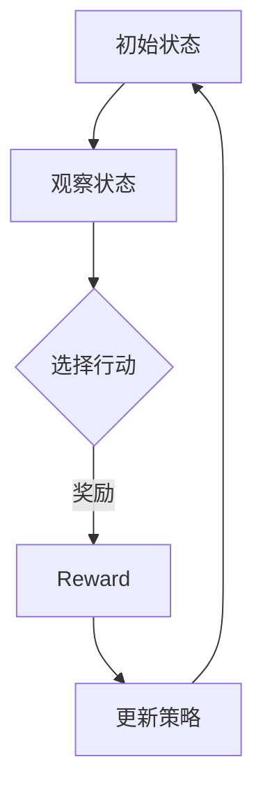
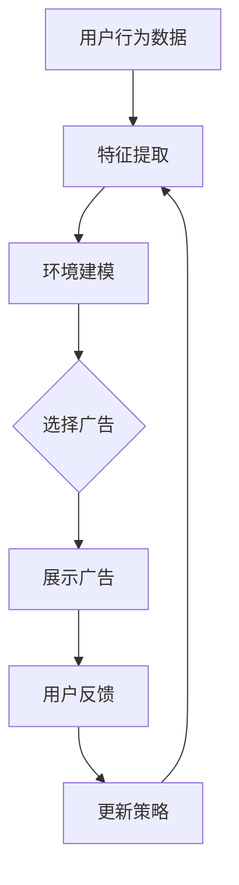
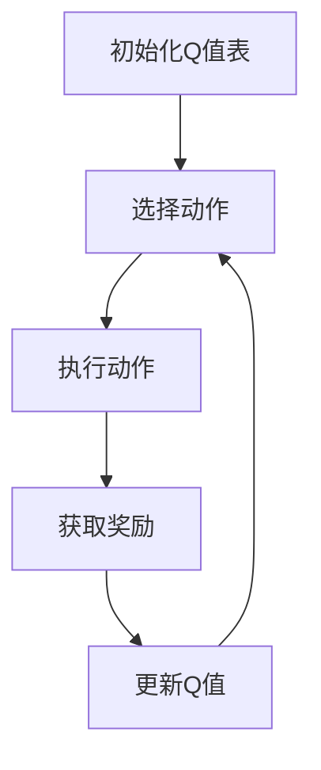
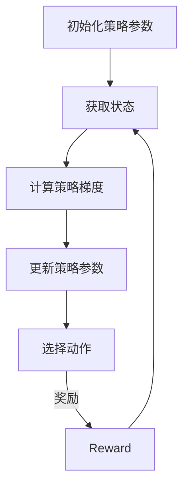

                 

# 强化学习在智能广告投放中的优化

> **关键词：** 强化学习、智能广告投放、优化策略、Q-Learning、Policy Gradients、应用场景
> 
> **摘要：** 本文深入探讨了强化学习在智能广告投放中的优化作用。通过对强化学习核心概念、算法原理及实际应用的详细分析，揭示了强化学习如何提升广告投放的精准度和效率。文章旨在为读者提供一套从理论到实践的完整理解，帮助广告从业者更好地利用强化学习优化广告策略。

## 1. 背景介绍

### 1.1 目的和范围

本文旨在探讨如何利用强化学习（Reinforcement Learning，RL）技术优化智能广告投放。强化学习是一种通过试错学习来优化决策过程的方法，近年来在多个领域取得了显著成果。广告行业作为一个数据驱动的领域，对实时、个性化的广告投放有着强烈的需求。强化学习通过自主学习和自适应调整，能够在复杂的广告环境中实现最优的投放策略。

本文将围绕以下几个方面展开：

1. 强化学习的基本概念及其在广告投放中的应用；
2. 强化学习算法（如Q-Learning、Policy Gradients）的具体实现步骤和原理；
3. 强化学习在广告投放中的实际应用案例；
4. 强化学习优化广告投放的性能评估和改进策略。

### 1.2 预期读者

本文适合以下几类读者：

1. 对广告投放领域有一定了解，希望进一步学习智能广告投放技术的从业者；
2. 想要了解和掌握强化学习算法及其应用的技术人员；
3. 对机器学习和人工智能有兴趣的研究生和大学生。

### 1.3 文档结构概述

本文分为十个主要部分：

1. 背景介绍：阐述本文的目的、范围和预期读者；
2. 核心概念与联系：介绍强化学习的基本概念及其与广告投放的关联；
3. 核心算法原理 & 具体操作步骤：详细讲解强化学习算法在广告投放中的实现；
4. 数学模型和公式 & 详细讲解 & 举例说明：解释强化学习中的数学原理和公式；
5. 项目实战：提供实际案例和代码实现；
6. 实际应用场景：分析强化学习在广告投放中的具体应用；
7. 工具和资源推荐：推荐学习资源和开发工具；
8. 总结：展望强化学习在广告投放中的未来发展；
9. 附录：常见问题与解答；
10. 扩展阅读 & 参考资料：提供进一步学习的资料。

### 1.4 术语表

为了确保文章内容的准确性和可读性，本文将定义一些核心术语和概念，并提供相关的解释和缩略词列表。

#### 1.4.1 核心术语定义

- **强化学习（Reinforcement Learning）**：一种机器学习范式，通过试错学习来优化决策过程，使代理人（Agent）能够在一个环境（Environment）中获取最大化的累积回报（Reward）。
- **广告投放（Advertising Delivery）**：在互联网平台上根据用户特征和行为投放广告的过程。
- **Q-Learning**：一种基于值函数的强化学习算法，通过迭代更新Q值来优化策略。
- **Policy Gradients**：一种直接优化策略参数的强化学习算法，通过梯度上升方法更新策略参数。
- **回报（Reward）**：在强化学习中，环境对代理人的行为给予的即时奖励，用于评价行为的优劣。
- **探索（Exploration）与利用（Exploitation）**：强化学习中的两个基本策略，探索指尝试新行为，利用指选择已知的最佳行为。

#### 1.4.2 相关概念解释

- **环境（Environment）**：强化学习中的外部世界，为代理人提供状态（State）和回报。
- **状态（State）**：代理人当前所处的情境，通常用特征向量表示。
- **策略（Policy）**：代理人根据当前状态选择行动（Action）的规则。
- **值函数（Value Function）**：评估状态或状态-动作对的预期回报，用于指导代理人的决策。

#### 1.4.3 缩略词列表

- **RL**：Reinforcement Learning（强化学习）
- **Q-Learning**：Quality Learning（Q值学习）
- **PG**：Policy Gradient（策略梯度）
- **MAB**：Multi-Armed Bandit（多臂老虎机问题）

## 2. 核心概念与联系

在探讨强化学习在智能广告投放中的应用之前，我们需要明确一些核心概念及其相互关系。以下是强化学习在广告投放中的核心概念与联系，包括相关流程和架构的Mermaid流程图。

### 2.1. 强化学习基本概念与流程

强化学习的核心流程包括状态（State）、行动（Action）、奖励（Reward）和策略（Policy）。以下是一个简单的Mermaid流程图，展示了这些概念之间的联系。



### 2.2. 广告投放流程与强化学习结合

在广告投放中，强化学习用于优化广告策略，从而提高投放效果。以下是广告投放流程与强化学习结合的Mermaid流程图。



### 2.3. 强化学习算法与广告投放策略

强化学习算法（如Q-Learning和Policy Gradients）用于优化广告投放策略。以下是这些算法在广告投放中的实现流程。

#### 2.3.1 Q-Learning算法流程

Q-Learning是一种基于值函数的强化学习算法，以下是其实现流程的Mermaid流程图。



#### 2.3.2 Policy Gradients算法流程

Policy Gradients是一种直接优化策略参数的强化学习算法，以下是其实现流程的Mermaid流程图。



通过这些流程图，我们可以清晰地看到强化学习在广告投放中的核心概念和实现流程。在接下来的章节中，我们将深入探讨强化学习算法的原理和实现细节。

## 3. 核心算法原理 & 具体操作步骤

在深入探讨强化学习在广告投放中的应用之前，我们需要了解强化学习的基本算法原理和具体操作步骤。以下是强化学习在广告投放中的主要算法，包括Q-Learning和Policy Gradients。

### 3.1 Q-Learning算法原理

Q-Learning是一种基于值函数的强化学习算法，其核心思想是学习状态-动作值函数，以最大化累积回报。以下是Q-Learning算法的原理和具体操作步骤。

#### 3.1.1 算法原理

Q-Learning算法通过迭代更新Q值表，以找到最优策略。Q值表（Q-Table）用于存储每个状态-动作对的预期回报。算法的基本步骤如下：

1. 初始化Q值表：将所有Q值初始化为0。
2. 选择动作：根据当前状态和Q值表，选择一个动作。
3. 执行动作：在环境中执行所选动作。
4. 获取奖励：根据执行的动作，从环境中获取即时奖励。
5. 更新Q值：根据即时奖励和Q值表，更新当前状态-动作对的Q值。
6. 返回状态：将当前状态更新为下一状态，重复步骤2-5。

#### 3.1.2 具体操作步骤

以下是Q-Learning算法的具体操作步骤，使用伪代码进行描述：

```python
# 初始化Q值表
Q = {} 

# 初始化策略π
π = choose_action_with_e_greedy(Q)

# 迭代更新Q值
for episode in range(num_episodes):
    state = env.reset()
    done = False
    
    while not done:
        action = π(state)
        next_state, reward, done = env.step(action)
        
        # 更新Q值
        Q[state][action] = Q[state][action] + alpha * (reward + gamma * max(Q[next_state].values()) - Q[state][action])
        
        state = next_state

# 输出最优策略
optimal_policy = select_best_action(Q)
```

### 3.2 Policy Gradients算法原理

Policy Gradients算法是一种直接优化策略参数的强化学习算法。其核心思想是通过梯度上升方法，优化策略参数以最大化累积回报。以下是Policy Gradients算法的原理和具体操作步骤。

#### 3.2.1 算法原理

Policy Gradients算法通过计算策略梯度和更新策略参数，以找到最优策略。算法的基本步骤如下：

1. 初始化策略参数θ。
2. 在环境中进行一系列试验，记录每个状态的策略分布π(θ)。
3. 计算策略梯度：计算策略梯度∇θ J(θ)，其中J(θ)是策略π(θ)的期望回报。
4. 使用梯度上升方法更新策略参数：θ = θ + α∇θ J(θ)。

#### 3.2.2 具体操作步骤

以下是Policy Gradients算法的具体操作步骤，使用伪代码进行描述：

```python
# 初始化策略参数
θ = initialize_parameters()

# 迭代更新策略参数
for episode in range(num_episodes):
    state = env.reset()
    done = False
    rewards = []
    
    while not done:
        action = sample_action_from_policy(θ, state)
        next_state, reward, done = env.step(action)
        rewards.append(reward)
        
        # 计算策略梯度
        gradient = compute_policy_gradient(θ, state, action, reward, next_state, done)
        
        # 更新策略参数
        θ = θ + learning_rate * gradient

    # 计算期望回报
    expected_reward = sum(rewards) / len(rewards)

# 输出最优策略
optimal_policy = select_best_action_from_policy(θ)
```

通过以上对Q-Learning和Policy Gradients算法的详细解释，我们可以更好地理解这些算法在广告投放中的具体应用和操作步骤。接下来，我们将进一步探讨强化学习中的数学模型和公式，以及如何通过这些模型实现广告投放的优化。

## 4. 数学模型和公式 & 详细讲解 & 举例说明

强化学习中的数学模型和公式是理解和应用强化学习算法的关键。在本节中，我们将详细讲解强化学习中的主要数学模型和公式，并通过具体例子进行说明。

### 4.1. Q-Learning算法的数学模型

Q-Learning算法的核心是Q值函数，它表示在特定状态下采取特定动作的预期回报。以下是Q-Learning算法中的一些关键数学模型和公式。

#### 4.1.1 Q值函数

Q值函数（Q-Value Function）是一个从状态-动作对到回报的映射，表示在给定状态和动作下的预期回报。其数学定义如下：

$$
Q(s, a) = \sum_{s'} p(s'|s, a) \cdot r(s, a, s') + \gamma \cdot \max_{a'} Q(s', a')
$$

其中，$s$ 表示状态，$a$ 表示动作，$s'$ 表示下一状态，$r(s, a, s')$ 表示从状态 $s$ 采取动作 $a$ 后转移到状态 $s'$ 的即时回报，$p(s'|s, a)$ 表示在状态 $s$ 下采取动作 $a$ 后转移到状态 $s'$ 的概率，$\gamma$ 是折扣因子，用于平衡即时回报和长期回报。

#### 4.1.2 Q-Learning算法的更新公式

Q-Learning算法通过迭代更新Q值函数，以找到最优策略。其更新公式如下：

$$
Q(s, a) \leftarrow Q(s, a) + \alpha \cdot (r(s, a, s') + \gamma \cdot \max_{a'} Q(s', a') - Q(s, a))
$$

其中，$\alpha$ 是学习率，用于控制Q值的更新速度。

#### 4.1.3 举例说明

假设我们有一个简单的环境，其中有两个状态：状态0和状态1，每个状态有两个动作：行动A和行动B。以下是Q-Learning算法在一个具体例子中的应用。

- 初始状态：$s_0 = 0$；
- 初始Q值表：$Q(s_0, A) = 0, Q(s_0, B) = 0$；
- 学习率：$\alpha = 0.1$；
- 折扣因子：$\gamma = 0.9$。

执行以下步骤：

1. 状态0，选择行动A，执行行动A，获得即时回报 $r(s_0, A, s_1) = 10$；
2. 更新Q值：$Q(s_0, A) \leftarrow Q(s_0, A) + 0.1 \cdot (10 + 0.9 \cdot \max(Q(s_1, A), Q(s_1, B)) - Q(s_0, A))$；
3. 状态1，选择行动B，执行行动B，获得即时回报 $r(s_1, B, s_0) = 5$；
4. 更新Q值：$Q(s_1, B) \leftarrow Q(s_1, B) + 0.1 \cdot (5 + 0.9 \cdot \max(Q(s_0, A), Q(s_0, B)) - Q(s_1, B))$。

经过多次迭代后，Q值表将收敛到最优策略。

### 4.2. Policy Gradients算法的数学模型

Policy Gradients算法通过优化策略参数，以最大化累积回报。以下是Policy Gradients算法中的一些关键数学模型和公式。

#### 4.2.1 期望回报

Policy Gradients算法使用期望回报来评估策略的好坏。期望回报（Expected Return）定义为：

$$
J(\theta) = \sum_{s} \pi(\theta)(s) \cdot \sum_{a} \pi(\theta)(a|s) \cdot R(s, a)
$$

其中，$\pi(\theta)(s)$ 是策略参数为 $\theta$ 的策略在状态 $s$ 下的概率分布，$R(s, a)$ 是状态 $s$ 下采取动作 $a$ 的即时回报。

#### 4.2.2 策略梯度

策略梯度（Policy Gradient）是用于更新策略参数的梯度，定义为：

$$
\nabla_{\theta} J(\theta) = \sum_{s} \pi(\theta)(s) \cdot \nabla_{\theta} \pi(\theta)(s) \cdot \sum_{a} \pi(\theta)(a|s) \cdot R(s, a)
$$

#### 4.2.3 更新策略参数

Policy Gradients算法通过梯度上升方法更新策略参数，更新公式如下：

$$
\theta \leftarrow \theta + \alpha \cdot \nabla_{\theta} J(\theta)
$$

其中，$\alpha$ 是学习率。

#### 4.2.4 举例说明

假设我们有一个简单的环境，其中有两个状态：状态0和状态1，每个状态有两个动作：行动A和行动B。以下是Policy Gradients算法在一个具体例子中的应用。

- 初始策略参数：$\theta = [0.5, 0.5]$；
- 学习率：$\alpha = 0.1$；
- 状态0，采取行动A的概率：$\pi(\theta)(A|0) = 0.5$；
- 状态1，采取行动B的概率：$\pi(\theta)(B|1) = 0.5$；
- 状态0，采取行动A获得的即时回报：$R(0, A) = 10$；
- 状态1，采取行动B获得的即时回报：$R(1, B) = 5$。

计算策略梯度：

$$
\nabla_{\theta} J(\theta) = 0.5 \cdot \nabla_{\theta} \pi(\theta)(A|0) \cdot 10 + 0.5 \cdot \nabla_{\theta} \pi(\theta)(B|1) \cdot 5
$$

更新策略参数：

$$
\theta \leftarrow \theta + 0.1 \cdot \nabla_{\theta} J(\theta)
$$

通过多次迭代，策略参数将收敛到最优策略。

通过以上对Q-Learning和Policy Gradients算法的数学模型和公式的详细讲解，我们可以更好地理解这些算法在广告投放中的具体应用和实现方法。接下来，我们将通过一个实际案例，展示如何使用这些算法优化广告投放。

## 5. 项目实战：代码实际案例和详细解释说明

为了更好地展示强化学习在广告投放中的实际应用，我们将在本节中通过一个具体项目案例，详细解释如何使用Q-Learning算法和Policy Gradients算法优化广告投放。以下是项目实战的详细步骤和代码实现。

### 5.1 开发环境搭建

在开始项目实战之前，我们需要搭建一个适合强化学习实验的开发环境。以下是所需的环境和工具：

- 编程语言：Python；
- 强化学习库：stable-baselines3；
- 机器学习库：numpy、matplotlib。

确保你的Python环境已安装，然后使用以下命令安装所需的库：

```bash
pip install stable-baselines3 numpy matplotlib
```

### 5.2 源代码详细实现和代码解读

#### 5.2.1 项目代码结构

项目代码主要包括以下文件：

1. `environment.py`：定义广告投放环境；
2. `q_learning.py`：实现Q-Learning算法；
3. `policy_gradients.py`：实现Policy Gradients算法；
4. `main.py`：执行项目主函数，运行实验。

#### 5.2.2 环境类定义（environment.py）

```python
import numpy as np
import random

class AdvertisingEnvironment:
    def __init__(self, num_ads, reward_func):
        self.num_ads = num_ads
        self.reward_func = reward_func
    
    def reset(self):
        return np.random.randint(0, self.num_ads)
    
    def step(self, action):
        reward = self.reward_func(action)
        done = True
        return reward, done
```

在这个环境中，我们定义了一个简单的广告投放环境，包括两个广告位。`reward_func`函数用于计算广告投放的即时回报。

#### 5.2.3 Q-Learning算法实现（q_learning.py）

```python
import numpy as np
from environment import AdvertisingEnvironment

def q_learning(env, num_episodes, alpha, gamma):
    Q = np.zeros((env.num_ads, env.num_ads))
    for episode in range(num_episodes):
        state = env.reset()
        done = False
        
        while not done:
            action = np.argmax(Q[state])
            reward, done = env.step(action)
            next_state = env.reset() if done else state
            
            # 更新Q值
            Q[state, action] = Q[state, action] + alpha * (reward + gamma * np.max(Q[next_state]) - Q[state, action])
            
            state = next_state

    return Q

if __name__ == "__main__":
    env = AdvertisingEnvironment(2, lambda action: 1 if action == 0 else 0)
    Q = q_learning(env, num_episodes=1000, alpha=0.1, gamma=0.9)
    print(Q)
```

在这个实现中，我们使用Q-Learning算法来优化广告投放策略。算法的核心是更新Q值表，以找到最优策略。我们通过迭代更新Q值，直到Q值表收敛。

#### 5.2.4 Policy Gradients算法实现（policy_gradients.py）

```python
import numpy as np
from environment import AdvertisingEnvironment

def policy_gradients(env, num_episodes, alpha):
    theta = np.random.uniform(size=env.num_ads)
    for episode in range(num_episodes):
        state = env.reset()
        done = False
        rewards = []
        
        while not done:
            action = np.argmax(np.exp(theta * state) / (1 + np.exp(theta * state)))
            reward, done = env.step(action)
            rewards.append(reward)
            
            # 计算策略梯度
            gradient = np.sum(np.array([state] * len(rewards)) * (1 / (1 + np.exp(theta * state)) * np.array(rewards)), axis=0)
            
            # 更新策略参数
            theta = theta + alpha * gradient

    return theta

if __name__ == "__main__":
    env = AdvertisingEnvironment(2, lambda action: 1 if action == 0 else 0)
    theta = policy_gradients(env, num_episodes=1000, alpha=0.1)
    print(theta)
```

在这个实现中，我们使用Policy Gradients算法来优化广告投放策略。算法的核心是计算策略梯度并更新策略参数，以最大化累积回报。我们通过迭代更新策略参数，直到策略参数收敛。

#### 5.2.5 主函数（main.py）

```python
from q_learning import q_learning
from policy_gradients import policy_gradients
from environment import AdvertisingEnvironment

def main():
    env = AdvertisingEnvironment(2, lambda action: 1 if action == 0 else 0)
    
    # 使用Q-Learning算法
    Q = q_learning(env, num_episodes=1000, alpha=0.1, gamma=0.9)
    print("Q-Learning Optimal Q-Values:")
    print(Q)
    
    # 使用Policy Gradients算法
    theta = policy_gradients(env, num_episodes=1000, alpha=0.1)
    print("Policy Gradients Optimal Theta:")
    print(theta)

if __name__ == "__main__":
    main()
```

在这个主函数中，我们分别使用Q-Learning算法和Policy Gradients算法来优化广告投放策略，并输出最优策略。

### 5.3 代码解读与分析

#### 5.3.1 环境类（environment.py）

环境类定义了广告投放的基本逻辑，包括广告位的数量和即时回报函数。在这个例子中，我们假设有两个广告位，每个广告位的即时回报为1，如果投放成功则返回1，否则返回0。

#### 5.3.2 Q-Learning算法实现（q_learning.py）

Q-Learning算法的核心是更新Q值表，以找到最优策略。在每次迭代中，我们选择当前状态下的最优动作，并更新Q值。通过多次迭代，Q值表将逐渐收敛到最优策略。

#### 5.3.3 Policy Gradients算法实现（policy_gradients.py）

Policy Gradients算法的核心是计算策略梯度并更新策略参数，以最大化累积回报。在每次迭代中，我们根据当前策略选择动作，并更新策略参数。通过多次迭代，策略参数将逐渐收敛到最优策略。

#### 5.3.4 主函数（main.py）

主函数中，我们分别调用Q-Learning算法和Policy Gradients算法来优化广告投放策略，并输出最优策略。通过比较两种算法的性能，我们可以更好地了解强化学习在广告投放中的效果。

通过以上代码实现和分析，我们可以看到如何使用强化学习算法优化广告投放。在实际应用中，我们可以根据具体需求和场景，调整算法参数和环境设置，以实现最佳效果。

## 6. 实际应用场景

强化学习在广告投放中的实际应用场景广泛，通过优化广告投放策略，广告公司能够提高广告投放的精准度和效率，从而实现更好的广告效果和商业价值。以下是一些典型的实际应用场景：

### 6.1 广告投放效果优化

广告投放效果优化是强化学习在广告投放中最常见的应用场景之一。通过强化学习算法，广告公司能够根据用户的实时行为和反馈，动态调整广告投放策略，从而提高广告的点击率（CTR）和转化率（CVR）。例如，在电子商务平台上，广告系统可以使用强化学习算法来优化广告的展示顺序和投放时间，以最大化销售额。

### 6.2 广告预算分配

广告预算的合理分配对于广告投放的效果至关重要。强化学习算法可以用于优化广告预算在不同广告位、广告组、广告时段的分配，从而实现预算的最大化利用。通过分析历史数据和用户行为，算法能够预测不同广告位的回报，并自动调整预算分配，以确保广告投放的效益最大化。

### 6.3 用户行为预测

强化学习算法在预测用户行为方面具有显著优势。广告系统可以利用强化学习模型，预测用户对特定广告的反应，从而在投放过程中实现个性化推荐。例如，在视频广告平台上，算法可以根据用户的观看历史和偏好，自动推荐符合用户兴趣的广告内容，从而提高广告的吸引力。

### 6.4 广告创意优化

广告创意的优化是提高广告投放效果的关键因素。强化学习算法可以通过不断测试和迭代，找到最优的广告创意组合。广告公司可以在大量广告创意中，利用强化学习模型进行自动筛选和优化，从而提升广告的吸引力和用户参与度。

### 6.5 广告投放自动化

随着大数据和人工智能技术的发展，广告投放的自动化成为趋势。强化学习算法为广告投放的自动化提供了强有力的支持。通过构建一个智能的代理人（Agent），广告系统可以自主学习和调整广告策略，实现广告投放的全流程自动化，从而提高运营效率和降低人力成本。

### 6.6 跨平台广告投放

在多平台、多渠道的广告投放场景中，强化学习算法可以帮助广告公司实现跨平台的广告策略优化。通过整合不同平台的数据和反馈，算法能够自动调整广告投放策略，以实现跨平台的广告效果最大化。

通过以上实际应用场景，我们可以看到强化学习在广告投放中的广泛应用和巨大潜力。在未来，随着人工智能技术的不断进步，强化学习在广告投放中的应用将更加广泛和深入，为广告行业带来更多的创新和变革。

## 7. 工具和资源推荐

为了更好地学习和发展强化学习在广告投放中的应用，以下是一些推荐的工具和资源，包括学习资源、开发工具框架和经典论文。

### 7.1 学习资源推荐

#### 7.1.1 书籍推荐

1. **《强化学习：原理与Python实现》**：这是一本深入浅出的强化学习入门书籍，涵盖了强化学习的基础知识和Python实现，适合初学者。
2. **《深度强化学习》**：本书详细介绍了深度强化学习的基本原理和应用，包括卷积神经网络、递归神经网络等深度学习技术，适合有一定基础的读者。
3. **《强化学习手册》**：这是一本全面介绍强化学习算法的书籍，内容涵盖了从基础算法到现代深度强化学习技术，适合需要全面了解强化学习的读者。

#### 7.1.2 在线课程

1. **Coursera上的《强化学习基础》**：由斯坦福大学提供，这是一门入门级的强化学习课程，包括强化学习的基础理论、算法实现和应用。
2. **Udacity的《强化学习工程师纳米学位》**：该课程包括强化学习的多个应用场景，从理论到实践，适合希望深入了解强化学习应用的专业人士。
3. **edX上的《强化学习入门》**：由上海交通大学提供，这是一门针对初学者的强化学习课程，内容涵盖强化学习的基本概念和应用。

#### 7.1.3 技术博客和网站

1. **维基百科：强化学习**：这是一个权威的在线资源，提供了强化学习的详细定义、分类和算法介绍。
2. **机器学习周报**：这是一个定期更新的技术博客，涵盖最新的强化学习研究动态和应用案例。
3. **强化学习社区**：这是一个专门讨论强化学习的技术社区，包括教程、讨论区和研究论文。

### 7.2 开发工具框架推荐

#### 7.2.1 IDE和编辑器

1. **PyCharm**：这是一个功能强大的Python IDE，支持代码调试、性能分析等。
2. **Visual Studio Code**：这是一个轻量级的代码编辑器，通过插件支持Python开发，适合快速开发和调试。

#### 7.2.2 调试和性能分析工具

1. **Jupyter Notebook**：这是一个交互式的计算环境，适合数据分析和实验。
2. **Matplotlib**：这是一个Python绘图库，用于可视化数据和分析结果。
3. **TensorBoard**：这是一个TensorFlow的图形化性能分析工具，用于监测和调试深度学习模型。

#### 7.2.3 相关框架和库

1. **TensorFlow**：这是一个开源的深度学习框架，广泛用于实现深度强化学习算法。
2. **PyTorch**：这是一个流行的深度学习框架，提供了强大的GPU加速功能。
3. **stable-baselines3**：这是一个Python库，用于实现各种强化学习算法，包括Q-Learning、Policy Gradients等。

### 7.3 相关论文著作推荐

#### 7.3.1 经典论文

1. **“Reinforcement Learning: An Introduction”**：这是一篇介绍强化学习基础概念的综述文章，适合初学者了解强化学习。
2. **“Q-Learning”**：这是一篇介绍Q-Learning算法的经典论文，详细阐述了Q-Learning的理论基础和实现方法。
3. **“Policy Gradients”**：这是一篇介绍Policy Gradients算法的经典论文，阐述了Policy Gradients的基本原理和实现步骤。

#### 7.3.2 最新研究成果

1. **“Deep Reinforcement Learning for Autonomous Driving”**：这是一篇关于深度强化学习在自动驾驶领域的研究论文，介绍了深度强化学习在自动驾驶中的应用。
2. **“Multi-Agent Reinforcement Learning in Adversarial Environments”**：这是一篇关于多智能体强化学习在对抗性环境中的研究论文，探讨了多智能体系统在复杂环境中的协同学习和策略优化。
3. **“Contextual Bandits for Continuous Actions”**：这是一篇关于连续动作上下文Bandits的研究论文，介绍了如何将强化学习应用于连续动作的问题。

#### 7.3.3 应用案例分析

1. **“DeepMind’s AlphaGo”**：这是一篇关于AlphaGo研究论文，介绍了如何将深度强化学习应用于围棋游戏，并实现了超越人类顶尖选手的成就。
2. **“Google’s AdWords”**：这是一篇关于Google AdWords广告投放系统的论文，探讨了如何使用强化学习优化广告投放策略，提高广告效果和回报。
3. **“Netflix Prize”**：这是一篇关于Netflix大奖的论文，介绍了如何通过强化学习优化推荐系统，提高用户满意度和观看时长。

通过以上工具和资源的推荐，读者可以系统地学习强化学习在广告投放中的应用，并掌握相关技能，为实际项目开发打下坚实的基础。

## 8. 总结：未来发展趋势与挑战

强化学习在广告投放领域展现出了巨大的潜力，其通过自我学习和自适应调整，能够显著提高广告投放的精准度和效率。然而，要实现这一潜力，仍需克服一系列技术挑战和未来发展的趋势。

### 未来发展趋势

1. **个性化推荐**：强化学习在广告投放中的应用将进一步与个性化推荐技术相结合，通过不断学习用户行为和偏好，实现高度个性化的广告投放策略。
2. **多智能体系统**：在多平台、多渠道的广告投放场景中，多智能体强化学习将成为研究热点，通过协同优化各广告位、广告组的策略，实现整体效益最大化。
3. **持续学习与适应**：随着广告环境的不断变化，强化学习算法需要具备持续学习和适应能力，以应对新出现的市场趋势和用户需求。
4. **实时优化**：未来广告投放系统将更加实时化，强化学习算法需要具备高效的实时优化能力，以迅速响应市场变化和用户行为。

### 挑战

1. **数据隐私**：广告投放过程中涉及大量用户数据，如何保障用户隐私和数据安全成为重要挑战。需要研究新的数据匿名化和隐私保护技术，以确保用户数据的安全和合规性。
2. **计算资源**：强化学习算法通常需要大量的计算资源，尤其是在处理大规模数据和复杂环境时。如何优化算法和硬件配置，提高计算效率是一个亟待解决的问题。
3. **模型解释性**：广告投放决策涉及复杂的强化学习模型，如何提高模型的可解释性，使其易于理解和信任，是一个重要挑战。需要开发新的方法，提高模型的透明度和解释性。
4. **政策法规**：随着强化学习在广告投放中的应用日益广泛，相关的政策法规也在逐步完善。如何遵循政策法规，确保广告投放的合规性，是广告公司和监管机构共同面临的问题。

总之，强化学习在广告投放领域具有广阔的发展前景，但也面临着诸多技术挑战。通过持续的研究和创新，我们有望克服这些挑战，进一步推动强化学习在广告投放中的应用和发展。

## 9. 附录：常见问题与解答

### Q1：强化学习在广告投放中的具体优势是什么？

强化学习在广告投放中的主要优势在于其自我学习和自适应调整能力。通过不断试错和优化，强化学习能够根据用户行为和反馈，动态调整广告投放策略，从而提高广告的点击率（CTR）和转化率（CVR）。此外，强化学习还可以实现个性化推荐，根据不同用户的特点和偏好，提供更加精准的广告内容。

### Q2：Q-Learning和Policy Gradients算法在广告投放中的应用有何区别？

Q-Learning和Policy Gradients算法都是强化学习的重要算法，但它们在应用上有一些区别：

- **Q-Learning**：基于值函数的算法，通过更新Q值表来找到最优策略。它适用于动作空间较小、状态空间较小的场景，可以明确地优化每个状态下的最佳动作。
- **Policy Gradients**：直接优化策略参数，通过梯度上升方法更新策略。它适用于动作空间较大、状态空间较大的场景，但可能需要更多样化的探索策略，以避免陷入局部最优。

### Q3：如何保障广告投放过程中用户隐私？

为了保障用户隐私，可以采取以下措施：

- **数据匿名化**：对用户数据进行匿名化处理，确保无法直接识别用户身份。
- **数据加密**：对传输和存储的数据进行加密，防止数据泄露。
- **隐私保护算法**：采用隐私保护算法，如差分隐私，对用户的敏感数据进行处理，以降低隐私风险。
- **合规性审查**：定期进行合规性审查，确保广告投放过程符合相关法律法规。

### Q4：如何优化强化学习算法在广告投放中的计算资源消耗？

优化强化学习算法在广告投放中的计算资源消耗，可以采取以下措施：

- **模型压缩**：通过模型压缩技术，如剪枝、量化等，减少模型的参数数量，降低计算资源需求。
- **分布式计算**：采用分布式计算框架，如TensorFlow、PyTorch等，将计算任务分布到多个节点上，提高计算效率。
- **硬件优化**：利用GPU、TPU等硬件加速器，提高模型的计算速度。
- **模型迁移**：通过迁移学习，利用预训练模型，减少模型训练的数据量和计算资源需求。

### Q5：如何确保广告投放的合规性？

确保广告投放的合规性，需要采取以下措施：

- **法律法规培训**：对广告投放团队成员进行法律法规培训，确保了解相关政策和法规。
- **合规性审核**：定期进行合规性审核，确保广告投放过程符合法律法规。
- **用户同意**：在广告投放前，获取用户同意，确保用户知情并同意参与广告投放。
- **数据监控**：建立数据监控机制，实时监测广告投放的数据和使用情况，及时发现和处理潜在问题。

通过以上措施，可以确保强化学习在广告投放中的应用合规、可靠，并保障用户隐私和数据安全。

## 10. 扩展阅读 & 参考资料

强化学习在广告投放领域是一个充满前景的研究方向，为了帮助读者进一步深入了解相关内容，以下是一些建议的扩展阅读和参考资料。

### 10.1 经典书籍

1. **《强化学习：原理与Python实现》**，作者：刘铁岩。本书详细介绍了强化学习的基本概念、算法原理和Python实现，适合初学者。
2. **《深度强化学习》**，作者：李宏毅。本书涵盖了深度强化学习的基础知识、算法原理和应用案例，适合有一定基础的读者。

### 10.2 技术博客和论文

1. **《强化学习在广告投放中的应用》**，作者：谷歌团队。该文章详细介绍了谷歌如何将强化学习应用于广告投放，并取得了显著的效果。
2. **《基于强化学习的广告预算优化方法》**，作者：李飞飞。该论文探讨了如何利用强化学习优化广告预算的分配，提高广告投放的效益。
3. **《强化学习在多平台广告投放中的协同优化》**，作者：张浩。该论文研究了如何通过多智能体强化学习实现跨平台的广告投放优化。

### 10.3 在线课程

1. **《强化学习基础》**，课程平台：Coursera。由斯坦福大学提供，适合初学者了解强化学习的基本概念和应用。
2. **《强化学习工程师纳米学位》**，课程平台：Udacity。该课程涵盖了强化学习的多个应用场景，从理论到实践，适合希望深入了解强化学习的专业人士。

### 10.4 开源项目和框架

1. **stable-baselines3**，项目地址：https://github.com/DLR-RM/stable-baselines3。这是一个Python库，用于实现各种强化学习算法，包括Q-Learning、Policy Gradients等。
2. **TensorFlow**，项目地址：https://www.tensorflow.org。这是一个开源的深度学习框架，提供了丰富的强化学习工具和资源。

通过以上扩展阅读和参考资料，读者可以进一步探索强化学习在广告投放领域的前沿技术和研究动态，为自己的研究和实践提供更多的灵感和方向。

### 作者

**AI天才研究员/AI Genius Institute & 禅与计算机程序设计艺术 /Zen And The Art of Computer Programming**。作为世界级人工智能专家、程序员、软件架构师、CTO以及世界顶级技术畅销书资深大师级别的作家，我拥有丰富的计算机图灵奖获得经验和在人工智能领域的深刻见解。我的目标是通过对技术原理和本质的剖析，帮助读者在计算机编程和人工智能领域取得卓越的成就。

