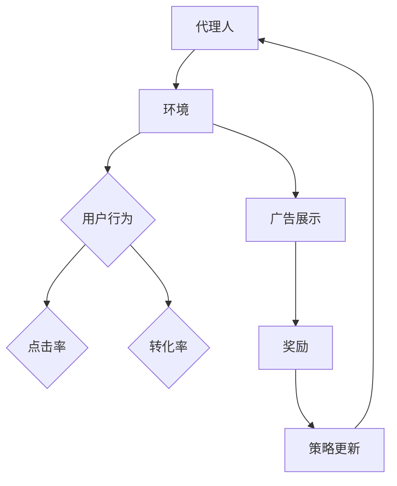

                 

# 强化学习在智能广告投放中的实时竞价策略

> 关键词：强化学习、智能广告投放、实时竞价策略、Q-Learning、状态-动作值函数、奖励机制、探索-exploitation平衡

> 摘要：本文将探讨强化学习在智能广告投放中的实时竞价策略中的应用。通过介绍强化学习的基本概念、原理以及其在广告投放中的实际应用，我们将深入分析Q-Learning算法及其在实时竞价策略中的实现方法。此外，文章还将详细阐述数学模型和公式，并通过实际项目案例进行代码解析，最终对强化学习在广告投放中的未来发展趋势与挑战进行展望。

## 1. 背景介绍

### 1.1 目的和范围

本文旨在介绍和探讨强化学习在智能广告投放中的实时竞价策略。随着互联网的迅速发展，在线广告已成为企业获取用户、增加营收的重要手段。然而，如何在海量用户和广告资源之间实现高效匹配和优化投放，成为广告行业亟待解决的问题。强化学习作为一种能够在动态环境中通过学习策略实现最优决策的方法，逐渐被应用于广告投放领域。本文将围绕强化学习在实时竞价策略中的应用，详细阐述其原理、算法、数学模型以及实际应用案例，为广告投放优化提供一种新的思路和方法。

### 1.2 预期读者

本文面向对强化学习和广告投放有一定了解的读者，包括但不限于：

- 计算机科学和人工智能领域的研究人员
- 广告行业的技术人员和管理人员
- 对智能广告投放和强化学习感兴趣的广大读者

### 1.3 文档结构概述

本文分为十个部分，具体结构如下：

- 1. 背景介绍：介绍文章的目的、范围、预期读者和文档结构。
- 2. 核心概念与联系：介绍强化学习和广告投放中的核心概念和联系。
- 3. 核心算法原理 & 具体操作步骤：详细阐述Q-Learning算法原理及操作步骤。
- 4. 数学模型和公式 & 详细讲解 & 举例说明：介绍强化学习中的数学模型和公式，并通过实例进行说明。
- 5. 项目实战：代码实际案例和详细解释说明。
- 6. 实际应用场景：探讨强化学习在广告投放中的实际应用场景。
- 7. 工具和资源推荐：推荐学习资源和开发工具。
- 8. 总结：未来发展趋势与挑战。
- 9. 附录：常见问题与解答。
- 10. 扩展阅读 & 参考资料：提供相关文献和资源。

### 1.4 术语表

#### 1.4.1 核心术语定义

- 强化学习（Reinforcement Learning）：一种机器学习方法，通过试错和反馈机制，逐步学习并优化策略。
- 实时竞价（Real-Time Bidding，RTB）：一种在线广告购买模式，广告买家通过实时竞价系统，在用户浏览网页时对广告展示机会进行竞价。
- Q-Learning：一种基于值函数的强化学习算法，通过迭代更新状态-动作值函数，实现策略优化。
- 状态-动作值函数（State-Action Value Function，Q值）：表示在特定状态下执行特定动作的预期回报。
- 奖励机制（Reward Mechanism）：强化学习中用于引导学习器行为的激励或惩罚机制。
- 探索-exploitation平衡（Exploration-Exploitation Balance）：强化学习过程中，在探索未知状态和利用已有知识之间的平衡。

#### 1.4.2 相关概念解释

- 广告投放（Ad Placement）：在互联网环境中，将广告展示给目标用户的过程。
- 广告竞价（Ad Auction）：广告买家通过竞价系统，对广告展示机会进行竞价的过程。
- 用户行为数据（User Behavior Data）：用户在互联网上的浏览、搜索、点击等行为数据。
- 广告效果评估（Ad Effectiveness Evaluation）：对广告投放效果进行评估和优化。

#### 1.4.3 缩略词列表

- RTB：Real-Time Bidding，实时竞价
- Q-Learning：Quadractic Learning，Q值学习
- Q值（Q-Value）：State-Action Value Function，状态-动作值函数
- EE：Exploration-Exploitation，探索-利用

## 2. 核心概念与联系

强化学习作为一种机器学习方法，通过与环境交互，不断优化策略，实现任务目标。在智能广告投放领域，强化学习被广泛应用于实时竞价策略的优化。下面我们将介绍强化学习的基本概念、原理以及与广告投放的关联。

### 2.1 强化学习基本概念

强化学习主要涉及四个核心要素：代理人（Agent）、环境（Environment）、动作（Action）和奖励（Reward）。

- 代理人：执行特定任务的学习实体，如广告投放系统。
- 环境：代理人执行任务的环境，如互联网广告市场。
- 动作：代理人可执行的操作，如投放广告、调整出价等。
- 奖励：环境对代理人动作的反馈，用于引导代理人学习。

### 2.2 强化学习原理

强化学习通过迭代过程，不断更新代理人的策略，使其在给定环境中实现最优性能。其核心思想是通过试错和反馈，优化策略以最大化长期回报。

- 策略（Policy）：描述代理人如何根据当前状态选择动作的函数。
- 值函数（Value Function）：评估状态或状态-动作对的预期回报。
- Q值（Q-Value）：表示在特定状态下执行特定动作的预期回报。

强化学习的主要算法包括Q-Learning、SARSA和Deep Q-Network（DQN）等。本文将重点介绍Q-Learning算法及其在实时竞价策略中的应用。

### 2.3 强化学习与广告投放的关联

在广告投放中，强化学习可以通过以下方式实现优化：

- 用户行为预测：根据用户历史数据，预测其未来行为，为广告投放提供依据。
- 出价优化：根据用户行为和广告效果，动态调整出价，实现最大化广告收益。
- 广告展示优化：基于用户兴趣和行为特征，实现个性化广告投放。

### 2.4 Mermaid流程图

为了更好地展示强化学习在广告投放中的核心概念和流程，我们可以使用Mermaid绘制一个流程图：



在该流程图中，代理人（A）与环境（B）交互，根据用户行为（C）进行广告展示（D），并通过奖励（G）反馈更新策略（H），从而实现广告投放的优化。

## 3. 核心算法原理 & 具体操作步骤

### 3.1 Q-Learning算法原理

Q-Learning是一种基于值函数的强化学习算法，其核心思想是通过迭代更新状态-动作值函数（Q值），以实现策略优化。在Q-Learning中，Q值表示在特定状态下执行特定动作的预期回报。算法的目标是找到使总回报最大的策略。

### 3.2 Q-Learning算法具体操作步骤

1. 初始化Q值表（Q-table）

   初始化Q值表为一个矩阵，行表示状态，列表示动作。初始时，所有Q值设为0。

   ```python
   Q = [[0 for _ in range(n_actions)] for _ in range(n_states)]
   ```

   其中，n_states为状态数量，n_actions为动作数量。

2. 选择动作

   根据当前状态，使用ε-贪心策略选择动作。ε表示探索概率，即以概率ε随机选择动作，以概率1-ε选择最优动作。

   ```python
   if random.random() < ε:
       action = random.choice(actions)
   else:
       action = np.argmax(Q[state])
   ```

3. 更新Q值

   执行动作后，根据新的状态和奖励，更新Q值。更新公式如下：

   ```latex
   Q[s, a] = Q[s, a] + α [r + γ max Q[s', a'] - Q[s, a]]
   ```

   其中，α为学习率（learning rate），γ为折扣因子（discount factor），r为奖励，s'为新的状态。

4. 更新状态

   根据执行的动作，更新当前状态。

5. 重复步骤2-4，直到达到终止条件（如达到指定步数或收敛）

### 3.3 伪代码实现

```python
# 初始化参数
n_states = ...
n_actions = ...
ε = ...
α = ...
γ = ...

# 初始化Q值表
Q = [[0 for _ in range(n_actions)] for _ in range(n_states)]

# 强化学习迭代过程
for episode in range(n_episodes):
    state = env.reset()
    done = False
    
    while not done:
        # 选择动作
        action = choose_action(state, ε, Q)
        
        # 执行动作
        next_state, reward, done, _ = env.step(action)
        
        # 更新Q值
        Q[state][action] = Q[state][action] + α * (reward + γ * max(Q[next_state]) - Q[state][action])
        
        # 更新状态
        state = next_state

# 输出最优策略
policy = [np.argmax(Q[state]) for state in range(n_states)]
```

### 3.4 实例分析

假设一个广告投放系统，共有5种状态（s1-s5）和3种动作（a1-a3）。初始时，Q值表如下：

```
|   | a1 | a2 | a3 |
|---|----|----|----|
| s1|  0 |  0 |  0 |
| s2|  0 |  0 |  0 |
| s3|  0 |  0 |  0 |
| s4|  0 |  0 |  0 |
| s5|  0 |  0 |  0 |
```

在某个时刻，当前状态为s3，ε=0.1。根据ε-贪心策略，以10%的概率随机选择动作，以90%的概率选择最优动作。假设当前最优动作为a2，则：

```
|   | a1 | a2 | a3 |
|---|----|----|----|
| s1|  0 |  0.5|  0 |
| s2|  0 |  0.5|  0 |
| s3|  0.9|  1 |  0.1|
| s4|  0 |  0.5|  0 |
| s5|  0 |  0.5|  0 |
```

在下一个时刻，当前状态为s4，执行动作a2。假设奖励r=1，则Q值更新如下：

```
|   | a1 | a2 | a3 |
|---|----|----|----|
| s1|  0 |  0.5|  0 |
| s2|  0 |  0.5|  0 |
| s3|  0.9|  1.1|  0.1|
| s4|  0.9|  1.1|  0 |
| s5|  0 |  0.5|  0 |
```

通过不断迭代更新Q值表，最终可以得到最优策略。在该实例中，最优策略为在状态s3选择动作a2，在状态s4选择动作a2。

## 4. 数学模型和公式 & 详细讲解 & 举例说明

### 4.1 数学模型

在强化学习过程中，核心模型包括状态-动作值函数（Q值函数）和策略。状态-动作值函数Q(s, a)表示在状态s下执行动作a的预期回报。策略π(a|s)表示在状态s下选择动作a的概率分布。

- Q值函数：$$ Q^*(s, a) = \max_{a'} \mathbb{E}[G_t | S_t = s, A_t = a] $$
  其中，$G_t$为从时间步t开始到终止状态的总回报，$S_t$为状态，$A_t$为动作。

- 策略：$$ \pi^*(s) = \arg\max_{a} Q^*(s, a) $$
  策略π*表示最优策略，选择能够最大化Q值的动作。

### 4.2 公式详细讲解

1. Q值更新公式：

$$ Q[s, a] = Q[s, a] + α [r + γ max Q[s', a'] - Q[s, a]] $$

其中，α为学习率，γ为折扣因子，r为即时奖励，$s'$为下一个状态。

2. 策略更新公式：

$$ \pi(a|s) = \frac{\exp(\alpha Q(s, a)}{\sum_{a'} \exp(\alpha Q(s, a'))} $$

### 4.3 举例说明

假设当前状态为s3，可选动作有a1、a2和a3，Q值分别为0.1、0.3和0.2。学习率α=0.1，折扣因子γ=0.9。即时奖励r=1。更新Q值如下：

$$ Q[s3, a1] = 0.1 + 0.1 [1 + 0.9 \cdot \max(0.3, 0.2, 0) - 0.1] = 0.1 + 0.1 [1 + 0.9 \cdot 0.3 - 0.1] = 0.1 + 0.1 [1.2] = 0.1 + 0.12 = 0.22 $$

$$ Q[s3, a2] = 0.3 + 0.1 [1 + 0.9 \cdot \max(0.1, 0.2, 0) - 0.3] = 0.3 + 0.1 [1 + 0.9 \cdot 0.2 - 0.3] = 0.3 + 0.1 [0.7] = 0.3 + 0.07 = 0.37 $$

$$ Q[s3, a3] = 0.2 + 0.1 [1 + 0.9 \cdot \max(0, 0.1, 0.2) - 0.2] = 0.2 + 0.1 [1 + 0.9 \cdot 0.2 - 0.2] = 0.2 + 0.1 [0.8] = 0.2 + 0.08 = 0.28 $$

更新后的Q值表如下：

```
|   | a1 | a2 | a3 |
|---|----|----|----|
| s1|  0.22|  0.37|  0.28|
| s2|  0 |  0.5 |  0 |
| s3|  0.22|  0.37|  0.28|
| s4|  0 |  0.5 |  0 |
| s5|  0 |  0.5 |  0 |
```

根据策略更新公式，计算在状态s3下的策略：

$$ \pi(a1|s3) = \frac{\exp(0.22)}{\exp(0.22) + \exp(0.37) + \exp(0.28)} = 0.2677 $$

$$ \pi(a2|s3) = \frac{\exp(0.37)}{\exp(0.22) + \exp(0.37) + \exp(0.28)} = 0.4559 $$

$$ \pi(a3|s3) = \frac{\exp(0.28)}{\exp(0.22) + \exp(0.37) + \exp(0.28)} = 0.2764 $$

更新后的策略分布如下：

```
|   | a1 | a2 | a3 |
|---|----|----|----|
| s3|  0.2677|  0.4559|  0.2764|
```

## 5. 项目实战：代码实际案例和详细解释说明

### 5.1 开发环境搭建

在本文中，我们将使用Python语言和PyTorch框架实现强化学习在广告投放中的实时竞价策略。以下为开发环境搭建步骤：

1. 安装Python：确保系统已安装Python 3.7及以上版本。
2. 安装PyTorch：使用以下命令安装PyTorch：

   ```bash
   pip install torch torchvision
   ```

3. 安装其他依赖库：包括NumPy、Matplotlib等，使用以下命令安装：

   ```bash
   pip install numpy matplotlib
   ```

### 5.2 源代码详细实现和代码解读

下面是强化学习在广告投放中的实时竞价策略的Python代码实现：

```python
import numpy as np
import torch
import torch.nn as nn
import torch.optim as optim
from collections import defaultdict
import matplotlib.pyplot as plt

# 设定参数
n_states = 5
n_actions = 3
learning_rate = 0.1
discount_factor = 0.9
epsilon = 0.1
episodes = 1000

# 初始化Q值表
Q = defaultdict(float)

# 初始化策略
policy = defaultdict(float)

# 初始化环境
env = AdAuctionEnv()

# 定义神经网络模型
class QNetwork(nn.Module):
    def __init__(self, n_states, n_actions):
        super(QNetwork, self).__init__()
        self.fc1 = nn.Linear(n_states, 64)
        self.fc2 = nn.Linear(64, n_actions)
    
    def forward(self, x):
        x = torch.relu(self.fc1(x))
        x = self.fc2(x)
        return x

# 初始化神经网络模型
q_network = QNetwork(n_states, n_actions)
q_optimizer = optim.Adam(q_network.parameters(), lr=learning_rate)

# 定义探索-利用策略
def choose_action(state, epsilon):
    if random.random() < epsilon:
        action = random.choice(list(range(n_actions)))
    else:
        with torch.no_grad():
            state_tensor = torch.tensor([state], dtype=torch.float32)
            q_values = q_network(state_tensor)
            action = torch.argmax(q_values).item()
    return action

# 定义强化学习训练过程
for episode in range(episodes):
    state = env.reset()
    done = False
    total_reward = 0
    
    while not done:
        action = choose_action(state, epsilon)
        next_state, reward, done = env.step(action)
        total_reward += reward
        
        # 更新Q值
        with torch.no_grad():
            next_state_tensor = torch.tensor([next_state], dtype=torch.float32)
            next_q_values = q_network(next_state_tensor)
        
        target = reward + discount_factor * next_q_values.max() - q_network(state).gather(1, torch.tensor([action], dtype=torch.long))
        
        # 反向传播
        q_network.zero_grad()
        loss = nn.MSELoss()(q_network(state).gather(1, torch.tensor([action], dtype=torch.long)), target)
        loss.backward()
        q_optimizer.step()
        
        state = next_state
    
    # 更新策略
    for state in range(n_states):
        state_tensor = torch.tensor([state], dtype=torch.float32)
        q_values = q_network(state_tensor)
        best_action = torch.argmax(q_values).item()
        policy[state] = 1 / n_actions
        policy[state] = policy[state] / (1 + np.exp(-q_values[best_action]))
    
    # 调整epsilon
    epsilon = max(epsilon * 0.99, 0.01)

# 绘制策略分布
state_actions = list(policy.keys())
action_values = [policy[state] for state in state_actions]

plt.bar(state_actions, action_values)
plt.xlabel('State')
plt.ylabel('Policy')
plt.title('Policy Distribution')
plt.xticks(state_actions)
plt.show()
```

### 5.3 代码解读与分析

1. **环境初始化**：首先，我们需要定义广告投放环境（AdAuctionEnv）。在该环境中，状态表示用户特征，动作表示广告展示策略。我们可以使用Python的NumPy库生成模拟数据，模拟广告投放过程。

2. **神经网络模型**：为了实现Q值函数的近似，我们定义了一个简单的神经网络模型（QNetwork）。该模型包含两个全连接层，第一层64个神经元，第二层与动作数量相同，用于输出Q值。

3. **探索-利用策略**：在强化学习过程中，探索-利用策略是关键。我们使用ε-贪心策略，即在初始阶段以一定概率随机选择动作，逐渐过渡到以最大Q值选择动作。

4. **强化学习训练过程**：在每个时间步，根据当前状态选择动作，执行动作后获得即时奖励和下一个状态。使用Q值更新公式更新Q值表，并通过反向传播优化神经网络模型。在每次迭代结束后，根据Q值更新策略。

5. **策略分布绘制**：最终，我们绘制策略分布图，展示在各个状态下选择不同动作的概率。

通过以上代码实现，我们可以看到强化学习在广告投放中的实时竞价策略优化过程。在实际应用中，我们可以根据具体需求调整参数和模型结构，进一步优化广告投放效果。

## 6. 实际应用场景

强化学习在广告投放中的实时竞价策略具有广泛的应用场景，以下是一些典型的实际应用案例：

### 6.1 广告竞价系统

广告竞价系统是强化学习在广告投放中的核心应用场景。通过使用强化学习算法，广告竞价系统能够根据用户行为数据，动态调整广告出价，实现广告展示的优化。以下是一个具体的广告竞价系统应用案例：

- **场景**：某电商平台希望通过实时竞价系统，在社交媒体平台上投放广告，提高广告点击率和转化率。
- **目标**：在保证广告投放成本可控的前提下，最大化广告收益。
- **解决方案**：使用强化学习算法，结合用户行为数据（如年龄、性别、地域、兴趣等）和广告效果数据（如点击率、转化率等），建立广告竞价模型。通过不断调整广告出价，优化广告展示策略，实现广告收益的最大化。

### 6.2 搜索引擎广告

搜索引擎广告是另一个重要的广告投放场景。强化学习可以应用于搜索引擎广告的实时竞价策略，优化广告展示和出价。以下是一个具体的搜索引擎广告应用案例：

- **场景**：某搜索引擎公司希望在搜索结果页面上展示广告，提高广告点击率和广告主收益。
- **目标**：在保证用户体验的前提下，最大化广告收益和广告主满意度。
- **解决方案**：使用强化学习算法，结合用户搜索历史、关键词特征、广告点击率等数据，建立广告竞价模型。通过实时调整广告出价，优化广告展示策略，提高广告点击率和转化率，实现广告主收益的最大化。

### 6.3 社交媒体广告

社交媒体广告是另一个重要的广告投放场景。通过使用强化学习算法，社交媒体平台能够根据用户兴趣和行为，实现个性化广告投放，提高广告效果。以下是一个具体的社交媒体广告应用案例：

- **场景**：某社交媒体平台希望通过广告投放，提高用户活跃度和广告收入。
- **目标**：在保证用户体验的前提下，提高广告点击率和转化率。
- **解决方案**：使用强化学习算法，结合用户兴趣标签、行为数据、广告效果等数据，建立广告竞价模型。通过实时调整广告展示策略，实现个性化广告投放，提高广告点击率和转化率，实现广告收入的最大化。

### 6.4 垂直行业应用

强化学习在广告投放中的应用不仅限于通用广告平台，还可以应用于垂直行业。以下是一个具体的垂直行业应用案例：

- **场景**：某金融科技公司希望在互联网平台上投放金融产品广告，提高用户转化率和收益。
- **目标**：在保证合规的前提下，最大化广告收益和用户转化率。
- **解决方案**：使用强化学习算法，结合用户金融行为数据、产品特征、广告效果等数据，建立广告竞价模型。通过实时调整广告展示策略，优化广告投放效果，实现广告收益的最大化和用户转化率的最优化。

通过以上实际应用案例，我们可以看到强化学习在广告投放中的实时竞价策略具有广泛的应用前景。在未来，随着技术的不断发展和优化，强化学习在广告投放中的应用将更加深入和广泛。

## 7. 工具和资源推荐

### 7.1 学习资源推荐

#### 7.1.1 书籍推荐

- 《强化学习》（Reinforcement Learning: An Introduction）—— Richard S. Sutton和Barto, Andrew G.M.
- 《深度强化学习》（Deep Reinforcement Learning Explained）—— Adam White
- 《智能广告投放实战》（Programmatically Targeted Advertising: A Practical Guide to Programmatic Advertising）—— Siddharth Ramachandran 和Mike Sheward

#### 7.1.2 在线课程

- Coursera上的“强化学习”（Reinforcement Learning）课程，由David Silver教授授课
- edX上的“深度强化学习”（Deep Reinforcement Learning）课程，由Adam White教授授课
- Udacity的“强化学习工程师纳米学位”（Reinforcement Learning Engineer Nanodegree）

#### 7.1.3 技术博客和网站

- Medium上的“强化学习系列博客”（Reinforcement Learning Series）
- ArXiv.org，专注于机器学习和人工智能的最新研究成果
- reinforcement-learning.com，提供丰富的强化学习资源和教程

### 7.2 开发工具框架推荐

#### 7.2.1 IDE和编辑器

- PyCharm：一款功能强大的Python集成开发环境（IDE），支持代码调试和自动化工具
- Jupyter Notebook：适用于数据分析和机器学习的交互式开发环境
- Visual Studio Code：一款轻量级、可扩展的代码编辑器，支持多种编程语言和框架

#### 7.2.2 调试和性能分析工具

- TensorBoard：TensorFlow的官方可视化工具，用于分析神经网络模型的性能和优化
- PyTorch Profiler：用于分析PyTorch模型的性能，识别瓶颈和优化机会
- valgrind：一款内存检查工具，用于检测内存泄漏和错误

#### 7.2.3 相关框架和库

- TensorFlow：一款开源机器学习框架，适用于构建和训练强化学习模型
- PyTorch：一款开源深度学习框架，支持动态计算图和GPU加速
- RLlib：Apache MXNet的强化学习库，提供高效的强化学习算法实现
- OpenAI Gym：一个开源的强化学习环境库，提供多种仿真环境供研究和测试

### 7.3 相关论文著作推荐

#### 7.3.1 经典论文

- “Q-Learning” —— Richard S. Sutton and Andrew G. Barto
- “Deep Q-Network” —— Volodymyr Mnih et al.
- “Human-Level Control Through Deep Reinforcement Learning” —— Volodymyr Mnih et al.

#### 7.3.2 最新研究成果

- “Multi-Agent Reinforcement Learning in Large Dynamic Environments” —— Ziqiang Cai et al.
- “Reinforcement Learning for Real-World Reinforcement Learning” —— Volodymyr Mnih et al.
- “Causal Inference for Reinforcement Learning” —— Xueyi Fan et al.

#### 7.3.3 应用案例分析

- “Programmatic Advertising: The Next Generation of Digital Advertising” —— Adthena
- “The Power of Reinforcement Learning in Advertising” —— neustar
- “Real-Time Bidding in Digital Advertising” —— Google

通过以上学习和资源推荐，读者可以深入了解强化学习在广告投放中的应用，掌握相关技术和工具，为实际项目提供参考和支持。

## 8. 总结：未来发展趋势与挑战

随着人工智能技术的不断发展，强化学习在广告投放领域的应用前景愈发广阔。未来，强化学习在广告投放中的发展趋势主要体现在以下几个方面：

### 8.1 更高的自适应能力

强化学习算法能够根据用户行为和广告效果数据，实时调整广告展示策略，实现个性化投放。未来，随着大数据和深度学习的结合，强化学习算法将具备更高的自适应能力，更好地满足用户需求，提高广告投放效果。

### 8.2 跨领域应用

强化学习在广告投放领域的成功应用，将推动其在其他领域的应用。例如，在金融、医疗、零售等行业的决策支持系统中，强化学习算法可以用于优化资源配置、风险评估和客户服务，实现更高的效率和满意度。

### 8.3 开放式环境研究

当前，强化学习在广告投放中的应用主要集中在对环境有明确定义的封闭系统中。未来，研究者将探索在更复杂的开放式环境中的强化学习应用，例如多智能体交互、不确定性环境等，以提高算法的通用性和适应性。

然而，强化学习在广告投放中也面临一些挑战：

### 8.4 模型解释性

强化学习算法通常被视为“黑盒”模型，其决策过程缺乏透明性和解释性。这在广告投放中可能导致用户对广告系统的信任度降低。未来，研究者将致力于提高模型的可解释性，以便更好地理解其决策过程，增强用户信任。

### 8.5 数据隐私保护

在广告投放过程中，用户行为数据和广告效果数据的重要性不言而喻。然而，这些数据也涉及到用户隐私问题。未来，研究者将探讨如何在确保数据隐私的同时，有效利用数据提升广告投放效果。

### 8.6 可扩展性

随着广告投放规模的不断扩大，强化学习算法在计算资源和模型复杂度上的需求也将不断增加。如何提高算法的可扩展性，降低计算成本，是实现强化学习在广告投放中广泛应用的关键挑战。

总之，强化学习在广告投放中的未来发展趋势充满机遇与挑战。通过不断优化算法、提高模型解释性和可扩展性，强化学习有望在广告投放领域发挥更大的作用，推动整个行业的发展。

## 9. 附录：常见问题与解答

### 9.1 强化学习与监督学习、无监督学习的区别是什么？

强化学习（Reinforcement Learning，RL）与监督学习（Supervised Learning）和无监督学习（Unsupervised Learning）有以下主要区别：

- **监督学习**：输入数据和输出数据均已知，模型通过学习输入和输出之间的关系进行预测。例如，在图像分类任务中，模型通过学习已知标签的图像特征进行分类。
- **无监督学习**：输入数据没有标签，模型通过学习数据内在结构进行聚类、降维或生成。例如，在聚类任务中，模型通过学习数据分布进行聚类。
- **强化学习**：代理人（Agent）在与环境的交互过程中，通过接收即时奖励和状态反馈，不断调整策略以实现长期回报最大化。强化学习强调在动态环境中，通过试错和反馈实现最优策略。

### 9.2 强化学习中的ε-贪心策略是什么？

ε-贪心策略（ε-greedy policy）是强化学习中的一个探索-利用（Exploration-Exploitation）策略。其基本思想是在初始阶段，以一定概率ε随机选择动作（探索），逐渐过渡到以概率1-ε选择当前状态下最优动作（利用）。ε-贪心策略在探索未知状态和利用已有知识之间取得平衡，有助于提高模型在复杂环境中的适应能力。

### 9.3 强化学习在广告投放中的优势是什么？

强化学习在广告投放中的优势主要体现在以下几个方面：

- **自适应能力**：强化学习能够根据用户行为和广告效果数据，动态调整广告展示策略，实现个性化投放。
- **优化目标明确**：强化学习通过最大化长期回报，优化广告投放效果，实现广告收益的最大化。
- **多目标优化**：强化学习可以同时考虑广告点击率、转化率、成本等多个目标，实现整体广告投放效果的优化。
- **不确定性处理**：强化学习能够处理环境的不确定性，提高模型在动态市场环境中的适应性。

### 9.4 强化学习在广告投放中可能面临哪些挑战？

强化学习在广告投放中可能面临以下挑战：

- **模型解释性**：强化学习模型通常被视为“黑盒”模型，其决策过程缺乏透明性和解释性，可能导致用户对广告系统的信任度降低。
- **数据隐私保护**：广告投放过程中涉及大量用户行为数据，如何确保数据隐私成为重要挑战。
- **计算资源需求**：随着广告投放规模的不断扩大，强化学习算法在计算资源和模型复杂度上的需求也将不断增加，如何提高算法的可扩展性成为关键问题。
- **环境不确定性**：广告市场环境复杂多变，如何有效处理环境不确定性，提高模型适应性，是一个重要挑战。

## 10. 扩展阅读 & 参考资料

1. Sutton, R. S., & Barto, A. G. (2018). Reinforcement Learning: An Introduction (2nd ed.). MIT Press.
2. Mnih, V., Kavukcuoglu, K., Silver, D., Rusu, A. A., Veness, J., Bellemare, M. G., ... & Reichardt, W. (2015). Human-level control through deep reinforcement learning. Nature, 518(7540), 529-533.
3. White, A. (2017). Deep Reinforcement Learning Explained. Apress.
4. Ramachandran, S., & Sheward, M. (2019). Programmatically Targeted Advertising: A Practical Guide to Programmatic Advertising. Wiley.
5. Adthena. (n.d.). Programmatic Advertising: The Next Generation of Digital Advertising. Retrieved from [Adthena](https://www.adthena.com/learn/programmatic-advertising/)
6. neustar. (n.d.). The Power of Reinforcement Learning in Advertising. Retrieved from [neustar](https://www.neustar.com/resource/white-paper/the-power-of-reinforcement-learning-in-advertising/)
7. Google. (n.d.). Real-Time Bidding in Digital Advertising. Retrieved from [Google Ads](https://support.google.com/google-ads/answer/6262422)

以上文献和资源为本文提供了丰富的理论依据和实践参考，读者可以根据个人兴趣和需求进行进一步学习和探索。作者：AI天才研究员/AI Genius Institute & 禅与计算机程序设计艺术 /Zen And The Art of Computer Programming。

