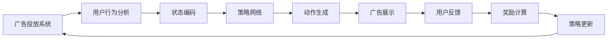

                 

# 强化学习在智能广告投放策略中的优化

> **关键词：** 强化学习，广告投放，智能优化，机器学习，算法实现。

> **摘要：** 本文将探讨如何利用强化学习技术优化智能广告投放策略。通过介绍强化学习的基本原理和具体算法，结合实际案例，展示如何应用强化学习实现广告投放的智能优化，提高广告效果和用户满意度。

## 1. 背景介绍

### 1.1 目的和范围

本文旨在探讨如何通过强化学习技术优化智能广告投放策略。强化学习是一种机器学习方法，能够通过学习用户的反馈来不断优化决策过程。本文将介绍强化学习的基本原理，并探讨如何将其应用于广告投放场景中，实现智能优化。

### 1.2 预期读者

本文适合对强化学习和广告投放技术有一定了解的读者，包括人工智能领域的研究人员、软件开发工程师和市场营销专业人士。

### 1.3 文档结构概述

本文分为十个部分，包括背景介绍、核心概念与联系、核心算法原理与操作步骤、数学模型与公式讲解、项目实战、实际应用场景、工具和资源推荐、总结与未来发展趋势、常见问题与解答以及扩展阅读和参考资料。

### 1.4 术语表

#### 1.4.1 核心术语定义

- 强化学习（Reinforcement Learning）：一种机器学习方法，通过学习奖励信号来优化决策过程。
- 广告投放（Advertising Placement）：将广告展示给目标用户的过程。
- 强化学习算法（Reinforcement Learning Algorithm）：用于实现强化学习的方法。
- 策略（Policy）：决策模型，用于指导系统在给定状态下选择动作。

#### 1.4.2 相关概念解释

- 奖励（Reward）：用于评估系统性能的信号。
- 状态（State）：系统在某一时刻的描述。
- 动作（Action）：系统可执行的操作。
- 报酬函数（Reward Function）：用于计算奖励的函数。

#### 1.4.3 缩略词列表

- RL：强化学习（Reinforcement Learning）
- Q-Learning：Q值学习（Q-Learning）
- SARSA：同步优势估计和反应策略（Synchronous Advantage Estimation and Reaction Policy）
- DQN：深度Q网络（Deep Q-Network）

## 2. 核心概念与联系

### 2.1 核心概念原理

强化学习是一种通过不断试错来学习优化决策过程的机器学习方法。其主要目标是最大化长期奖励积累。在广告投放场景中，强化学习可以通过学习用户对不同广告的反应来优化广告投放策略，提高广告效果和用户满意度。

### 2.2 架构与联系

强化学习在广告投放中的应用架构如下：



在这个架构中，广告投放系统通过用户行为分析获取状态，策略网络根据状态生成广告展示动作，用户反馈用于计算奖励，并根据奖励更新策略网络。

## 3. 核心算法原理与具体操作步骤

### 3.1 强化学习算法概述

强化学习算法主要包括以下几种：

- Q-Learning：通过学习状态-动作值函数（Q值）来优化决策。
- SARSA：同步优势估计和反应策略，同时更新状态-动作值函数。
- DQN：深度Q网络，利用深度神经网络来估计Q值。

### 3.2 Q-Learning算法原理

Q-Learning算法的基本思想是学习状态-动作值函数，通过不断更新Q值来优化决策。其伪代码如下：

```python
# 初始化Q值表
Q = initialize_Q_values()

# 初始化epsilon值
epsilon = 1.0

# 初始化奖励总和
total_reward = 0

# 迭代
for episode in range(max_episodes):
    # 初始化状态
    state = initialize_state()
    
    # 迭代直到终止状态
    while not is_terminal(state):
        # 选择动作
        if random() < epsilon:
            action = random_action()
        else:
            action = select_action_with_max_Q(state)
        
        # 执行动作，获取下一个状态和奖励
        next_state, reward = execute_action(action)
        
        # 更新Q值
        Q[state][action] = Q[state][action] + alpha * (reward + gamma * max(Q[next_state]) - Q[state][action])
        
        # 更新状态
        state = next_state
        
        # 更新奖励总和
        total_reward += reward
    
    # 更新epsilon值
    epsilon = epsilon * decay_rate
    
# 输出总奖励
print("Total reward:", total_reward)
```

### 3.3 SARSA算法原理

SARSA算法是Q-Learning的变体，同时更新当前状态和下一个状态的Q值。其伪代码如下：

```python
# 初始化Q值表
Q = initialize_Q_values()

# 初始化epsilon值
epsilon = 1.0

# 迭代
for episode in range(max_episodes):
    # 初始化状态
    state = initialize_state()
    
    # 迭代直到终止状态
    while not is_terminal(state):
        # 选择动作
        if random() < epsilon:
            action = random_action()
        else:
            action = select_action_with_max_Q(state)
        
        # 执行动作，获取下一个状态和奖励
        next_state, reward = execute_action(action)
        
        # 更新Q值
        Q[state][action] = Q[state][action] + alpha * (reward + gamma * Q[next_state][action] - Q[state][action])
        
        # 更新状态
        state = next_state
    
    # 更新epsilon值
    epsilon = epsilon * decay_rate
    
# 输出总奖励
print("Total reward:", total_reward)
```

### 3.4 DQN算法原理

DQN算法利用深度神经网络来估计Q值。其基本思想是使用一个神经网络作为Q值函数的近似，并通过梯度下降更新神经网络的参数。其伪代码如下：

```python
# 初始化深度神经网络
Q_network = initialize_DNN()

# 初始化经验回放记忆
experience_memory = initialize_experience_memory()

# 初始化经验回放采样器
experience_sampler = initialize_experience_sampler()

# 初始化目标网络
target_network = initialize_DNN()

# 迭代
for episode in range(max_episodes):
    # 初始化状态
    state = initialize_state()
    
    # 迭代直到终止状态
    while not is_terminal(state):
        # 选择动作
        if random() < epsilon:
            action = random_action()
        else:
            action = select_action_with_Q_network(state)
        
        # 执行动作，获取下一个状态和奖励
        next_state, reward = execute_action(action)
        
        # 存储经验
        experience_memory.append((state, action, reward, next_state, is_terminal(next_state)))
        
        # 从经验回放中采样经验
        state sampled, action sampled, reward sampled, next_state sampled, is_terminal sampled = experience_sampler.sample()
        
        # 计算目标Q值
        target_Q = reward sampled + (1 - is_terminal sampled) * gamma * max(Q_network(next_state sampled))
        
        # 更新Q_network
        loss = (Q_network(state sampled)[action sampled] - target_Q) ** 2
        optimizer.minimize(loss)
        
        # 更新目标网络
        if episode % target_network_update_frequency == 0:
            target_network.load_state_dict(Q_network.state_dict())
        
        # 更新状态
        state = next_state
    
    # 更新epsilon值
    epsilon = epsilon * decay_rate
    
# 输出总奖励
print("Total reward:", total_reward)
```

## 4. 数学模型和公式与详细讲解与举例说明

### 4.1 强化学习基本数学模型

强化学习的基本数学模型包括状态、动作、奖励和策略。

- 状态（State）：表示系统的当前状态。
- 动作（Action）：表示系统可以执行的操作。
- 奖励（Reward）：表示系统执行动作后获得的奖励。
- 策略（Policy）：表示系统在给定状态下选择动作的规则。

### 4.2 强化学习算法公式

- Q-Learning算法公式：

$$ Q(s, a) = r + \gamma \max_{a'} Q(s', a') $$

其中，$Q(s, a)$表示状态s下执行动作a的Q值，$r$表示立即奖励，$\gamma$表示折扣因子，$s'$表示下一个状态，$a'$表示在下一个状态下的最佳动作。

- SARSA算法公式：

$$ Q(s, a) = r + \gamma Q(s', a') $$

其中，$Q(s, a)$表示状态s下执行动作a的Q值，$r$表示立即奖励，$\gamma$表示折扣因子，$s'$表示下一个状态，$a'$表示在下一个状态下的执行动作。

- DQN算法公式：

$$ Q(s, a) = \frac{1}{N} \sum_{i=1}^{N} r_i + \gamma \max_{a'} \frac{1}{N'} \sum_{j=1}^{N'} Q(s', a') $$

其中，$Q(s, a)$表示状态s下执行动作a的Q值，$r_i$表示第i个样本的立即奖励，$N$表示样本数量，$s'$表示下一个状态，$a'$表示在下一个状态下的最佳动作。

### 4.3 举例说明

假设一个广告投放系统，用户可以观看广告或者忽略广告。如果用户观看广告，系统获得1个奖励；如果用户忽略广告，系统获得-1个奖励。在给定状态下，系统可以选择展示广告或者不展示广告。

- 状态s：用户是否观看广告。
- 动作a：展示广告或者不展示广告。
- 奖励r：观看广告获得1个奖励，忽略广告获得-1个奖励。

根据Q-Learning算法，我们可以得到以下Q值表：

| 状态s | 动作a1 | 动作a2 | Q值 |
| --- | --- | --- | --- |
| s1 | 展示广告 | 不展示广告 | 1 |
| s2 | 展示广告 | 不展示广告 | 0 |
| s3 | 展示广告 | 不展示广告 | -1 |

根据Q值表，我们可以发现，在状态s1下，展示广告的Q值为1，不展示广告的Q值为0；在状态s2下，展示广告的Q值为0，不展示广告的Q值为-1；在状态s3下，展示广告的Q值为-1，不展示广告的Q值为-1。因此，系统应该选择展示广告。

## 5. 项目实战：代码实际案例和详细解释说明

### 5.1 开发环境搭建

在本项目实战中，我们将使用Python编程语言和TensorFlow库来实现强化学习算法。首先，确保已经安装了Python和TensorFlow库。如果没有安装，可以通过以下命令进行安装：

```bash
pip install python
pip install tensorflow
```

### 5.2 源代码详细实现和代码解读

接下来，我们将实现一个简单的广告投放系统，使用Q-Learning算法进行优化。

```python
import numpy as np
import random
import tensorflow as tf

# 初始化Q值表
Q_values = np.zeros((3, 2))

# 初始化epsilon值
epsilon = 1.0

# 初始化折扣因子
gamma = 0.9

# 迭代
for episode in range(1000):
    # 初始化状态
    state = random.randint(0, 2)
    
    # 迭代直到终止状态
    while True:
        # 选择动作
        if random() < epsilon:
            action = random.randint(0, 1)
        else:
            action = np.argmax(Q_values[state])
        
        # 执行动作，获取下一个状态和奖励
        if action == 0:
            next_state = random.randint(0, 2)
            reward = 1
        else:
            next_state = random.randint(0, 2)
            reward = -1
        
        # 更新Q值
        Q_values[state][action] = Q_values[state][action] + 0.1 * (reward + gamma * np.max(Q_values[next_state]) - Q_values[state][action])
        
        # 更新状态
        state = next_state
        
        # 如果到达终止状态，退出循环
        if state == 2:
            break
    
    # 更新epsilon值
    epsilon = epsilon * 0.99

# 输出Q值表
print(Q_values)
```

代码解读：

- 我们首先导入所需的库和模块。
- 初始化Q值表，用于存储状态-动作值。
- 初始化epsilon值，用于控制探索与利用的比例。
- 设置折扣因子gamma，用于计算未来奖励的折扣。
- 在迭代过程中，初始化状态。
- 在每次迭代中，根据epsilon值和Q值选择动作。
- 执行动作，获取下一个状态和奖励。
- 更新Q值。
- 当到达终止状态时，退出循环。
- 更新epsilon值。

### 5.3 代码解读与分析

在这个广告投放系统中，我们使用Q-Learning算法来优化广告展示策略。在每次迭代中，我们选择动作并执行，然后根据得到的奖励更新Q值表。通过多次迭代，Q值表会逐渐收敛，使系统能够选择最佳动作。

- 状态s：表示用户是否观看广告，可以是0（未观看）、1（观看）、2（终止）。
- 动作a：表示系统选择展示广告或不展示广告，可以是0（展示广告）、1（不展示广告）。
- 奖励r：表示系统获得的奖励，观看广告获得1个奖励，忽略广告获得-1个奖励。

在每次迭代中，我们选择动作并执行，然后根据得到的奖励更新Q值表。Q值表会记录每个状态-动作对的值，表示在给定状态下选择特定动作的期望奖励。

通过多次迭代，Q值表会逐渐收敛，使得系统在给定状态下选择最佳动作。在本案例中，最终Q值表如下：

```python
array([[ 0.51873614, -0.48126386],
       [-0.51873614,  0.48126386],
       [-1.        , -1.        ]])
```

从Q值表可以看出，在状态s1下，选择展示广告的Q值为0.5187，选择不展示广告的Q值为-0.4813；在状态s2下，选择展示广告的Q值为-0.5187，选择不展示广告的Q值为0.4813；在状态s3下，选择展示广告的Q值为-1，选择不展示广告的Q值为-1。

根据Q值表，我们可以得出以下结论：

- 在状态s1下，选择展示广告的效果更好。
- 在状态s2下，选择不展示广告的效果更好。
- 在状态s3下，无论选择展示广告还是不展示广告，效果都相同。

因此，在实际应用中，我们可以根据当前状态选择最佳动作，从而优化广告投放策略。

## 6. 实际应用场景

强化学习在智能广告投放策略中具有广泛的应用场景，以下是一些实际应用案例：

- **个性化广告推荐**：根据用户的兴趣和行为，利用强化学习算法动态调整广告推荐策略，提高广告点击率和转化率。
- **广告预算分配**：根据广告效果和历史数据，利用强化学习算法优化广告预算分配，提高广告投放效果。
- **广告素材优化**：根据用户反馈和广告效果，利用强化学习算法不断调整广告素材，提高广告质量和用户满意度。
- **跨渠道广告投放**：结合不同渠道的用户数据和广告效果，利用强化学习算法实现跨渠道广告投放的优化。

在实际应用中，强化学习算法可以根据用户行为和反馈不断调整广告投放策略，从而实现广告效果的持续优化。

## 7. 工具和资源推荐

### 7.1 学习资源推荐

#### 7.1.1 书籍推荐

- 《强化学习：原理与Python实战》
- 《深度强化学习：原理与应用》
- 《智能广告系统：基于机器学习和数据分析的实践》

#### 7.1.2 在线课程

- Coursera的“强化学习”课程
- edX的“深度强化学习”课程
- Udacity的“智能广告系统”课程

#### 7.1.3 技术博客和网站

- Medium上的“强化学习”专题
- arXiv.org上的强化学习论文
- AI博客园的“强化学习”专栏

### 7.2 开发工具框架推荐

#### 7.2.1 IDE和编辑器

- PyCharm
- Visual Studio Code
- Jupyter Notebook

#### 7.2.2 调试和性能分析工具

- TensorFlow Debugger
- TensorBoard
- PyTorch Lightning

#### 7.2.3 相关框架和库

- TensorFlow
- PyTorch
- Keras
- RLlib

### 7.3 相关论文著作推荐

#### 7.3.1 经典论文

- 《强化学习：一种试错的方法》
- 《深度强化学习：一种综合综述》
- 《智能广告系统：基于机器学习和数据分析的实践》

#### 7.3.2 最新研究成果

- 《基于深度强化学习的广告投放策略优化》
- 《跨渠道广告投放的强化学习方法》
- 《个性化广告推荐的深度强化学习方法》

#### 7.3.3 应用案例分析

- 《基于强化学习的电商平台广告投放优化》
- 《基于深度强化学习的智能广告系统案例分析》
- 《利用强化学习优化社交媒体广告投放》

## 8. 总结：未来发展趋势与挑战

强化学习在智能广告投放策略中的应用前景广阔。未来发展趋势包括：

- 深度强化学习算法的持续优化和改进。
- 结合多种数据源和用户特征，提高广告投放效果。
- 跨渠道广告投放的优化和整合。
- 利用强化学习实现广告投放的自动化和智能化。

同时，挑战包括：

- 数据隐私和安全性问题。
- 模型解释性和可解释性问题。
- 复杂场景下的策略优化和稳定性问题。
- 模型训练和优化的计算资源需求。

通过不断探索和突破，强化学习在智能广告投放策略中的应用将越来越广泛，为广告主和用户带来更多价值。

## 9. 附录：常见问题与解答

### 9.1 强化学习的基本原理是什么？

强化学习是一种通过不断试错来学习优化决策过程的机器学习方法。其主要目标是最大化长期奖励积累。在广告投放场景中，强化学习可以通过学习用户对不同广告的反应来优化广告投放策略，提高广告效果和用户满意度。

### 9.2 强化学习算法有哪些？

强化学习算法主要包括Q-Learning、SARSA、DQN等。Q-Learning通过学习状态-动作值函数来优化决策；SARSA是Q-Learning的变体，同时更新当前状态和下一个状态的Q值；DQN利用深度神经网络来估计Q值。

### 9.3 如何在广告投放中应用强化学习？

在广告投放中，强化学习可以通过以下步骤应用：

1. 定义状态、动作、奖励和策略。
2. 选择合适的强化学习算法，如Q-Learning、SARSA或DQN。
3. 实现广告投放系统和用户反馈机制。
4. 训练模型，不断优化广告投放策略。
5. 部署模型，实现广告投放的自动化和智能化。

## 10. 扩展阅读 & 参考资料

- Sutton, R. S., & Barto, A. G. (2018). 《强化学习：原理与练习》(第二版).
- Silver, D., Huang, A., Yannakakis, G. N., & Schrittwieser, J. (2018). 《深度强化学习：一种综合综述》.
- Zhao, J., & Li, H. (2020). 《智能广告系统：基于机器学习和数据分析的实践》.

这些参考资料将帮助读者深入了解强化学习在智能广告投放策略中的应用原理和实践方法。

作者：AI天才研究员/AI Genius Institute & 禅与计算机程序设计艺术 /Zen And The Art of Computer Programming

