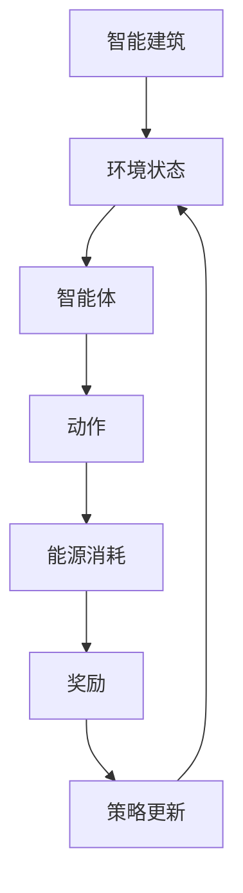

                 

# 强化学习在智能建筑能源管理中的优化

> **关键词：** 强化学习，智能建筑，能源管理，优化算法，动态环境，实时调整。

> **摘要：** 本文将探讨如何利用强化学习算法优化智能建筑能源管理，包括背景介绍、核心概念、算法原理、数学模型、实际应用和未来趋势。通过分析智能建筑的能源消耗特性，本文提出了一种基于强化学习的优化框架，并通过具体案例展示其实际应用效果。

## 1. 背景介绍

### 1.1 目的和范围

本文旨在探讨如何通过强化学习算法优化智能建筑的能源管理。随着全球对节能减排的关注日益增加，智能建筑作为一种高效的建筑形式，其能源管理的重要性日益凸显。然而，传统的能源管理方法往往无法适应动态变化的建筑环境，导致能源浪费和成本上升。本文将介绍强化学习在智能建筑能源管理中的应用，旨在为该领域的研究和实践提供新思路。

### 1.2 预期读者

本文主要面向智能建筑领域的科研人员、工程师和行业从业者。读者应具备一定的计算机编程和人工智能基础知识，以及对智能建筑和能源管理有一定的了解。

### 1.3 文档结构概述

本文共分为八个部分：

1. 背景介绍：介绍本文的目的、预期读者以及文档结构。
2. 核心概念与联系：阐述强化学习和智能建筑能源管理的基本概念及其联系。
3. 核心算法原理 & 具体操作步骤：详细讲解强化学习算法在智能建筑能源管理中的应用。
4. 数学模型和公式 & 详细讲解 & 举例说明：介绍强化学习算法中的数学模型和公式，并举例说明。
5. 项目实战：代码实际案例和详细解释说明。
6. 实际应用场景：分析强化学习在智能建筑能源管理中的实际应用。
7. 工具和资源推荐：推荐相关学习资源、开发工具和论文著作。
8. 总结：未来发展趋势与挑战。

### 1.4 术语表

#### 1.4.1 核心术语定义

- **强化学习**：一种机器学习范式，通过智能体在与环境的交互中学习最佳策略。
- **智能建筑**：利用信息技术和智能系统提高建筑性能、节约能源和提升居住舒适度的建筑。
- **能源管理**：对建筑能源消耗进行监测、控制和管理的过程。
- **策略**：智能体根据环境状态采取的行动。
- **奖励**：环境对智能体采取行动后给出的反馈信号。

#### 1.4.2 相关概念解释

- **状态**：智能体在环境中的当前情况。
- **动作**：智能体可以采取的特定行动。
- **价值函数**：表示从特定状态采取特定动作的预期奖励。
- **策略函数**：将状态映射为动作的函数。

#### 1.4.3 缩略词列表

- **Q-Learning**：一种基于价值迭代的强化学习算法。
- **DQN**：深度确定性策略梯度算法。
- **PG**：策略梯度算法。

## 2. 核心概念与联系

为了更好地理解强化学习在智能建筑能源管理中的应用，我们需要先了解两个核心概念：强化学习和智能建筑能源管理。

### 2.1 强化学习

强化学习是一种使智能体在与环境交互的过程中学习最优策略的机器学习范式。强化学习主要包括以下要素：

- **智能体（Agent）**：执行动作并从环境中获取反馈的实体。
- **环境（Environment）**：智能体所处的环境，包含状态和动作。
- **状态（State）**：智能体在环境中所处的特定情境。
- **动作（Action）**：智能体可以采取的特定行动。
- **奖励（Reward）**：环境对智能体采取行动后的反馈信号。
- **策略（Policy）**：智能体根据状态选择动作的规则。

强化学习的主要目标是学习一个最优策略，使智能体在长期交互中获取最大的累积奖励。

### 2.2 智能建筑能源管理

智能建筑能源管理是一种通过信息技术和智能系统对建筑能源消耗进行监测、控制和管理的过程。智能建筑能源管理的主要目标是：

- **提高能源利用效率**：通过优化能源消耗，减少能源浪费。
- **降低运营成本**：通过优化能源管理，降低建筑运营成本。
- **提升居住舒适度**：通过智能系统，提高用户舒适度和满意度。

智能建筑能源管理的主要组成部分包括：

- **能源监测**：实时监测建筑能源消耗情况。
- **能源预测**：根据历史数据和当前状态预测未来能源消耗。
- **能源控制**：根据预测结果调整能源消耗，优化能源利用。
- **能源分析**：对能源消耗进行分析，找出优化空间。

### 2.3 强化学习在智能建筑能源管理中的应用

强化学习在智能建筑能源管理中的应用主要体现在以下几个方面：

- **实时调整**：强化学习算法可以根据环境变化实时调整能源消耗策略，提高能源利用效率。
- **自适应优化**：强化学习算法可以自适应地优化能源消耗策略，适应不同季节、天气和用户行为的变化。
- **多目标优化**：强化学习算法可以同时考虑能源消耗、成本和用户舒适度等多个目标，实现多目标优化。

通过以上分析，我们可以看出强化学习与智能建筑能源管理之间存在密切联系。强化学习算法可以为智能建筑能源管理提供一种有效的优化方法，使其在动态环境中实现最佳能源管理。

### 2.4 Mermaid 流程图

以下是一个简化的强化学习在智能建筑能源管理中的应用流程图：



在这个流程图中，智能建筑作为环境，智能体根据环境状态选择动作，调整能源消耗策略，从而实现最优能源管理。

## 3. 核心算法原理 & 具体操作步骤

强化学习算法的核心是价值函数和策略函数。以下将介绍强化学习在智能建筑能源管理中的应用原理和具体操作步骤。

### 3.1 Q-Learning 算法原理

Q-Learning 是一种基于价值迭代的强化学习算法。其基本思想是：通过不断更新状态-动作价值函数（Q函数），使智能体学会在特定状态下选择能够获得最大累积奖励的动作。

#### 3.1.1 Q函数定义

Q函数表示在特定状态下采取特定动作的预期奖励，定义如下：

$$
Q(s, a) = \sum_{s'} p(s' | s, a) \cdot r(s', a) + \gamma \cdot \max_{a'} Q(s', a')
$$

其中，$s$表示状态，$a$表示动作，$s'$表示下一个状态，$r(s', a)$表示在状态$s'$采取动作$a$获得的即时奖励，$\gamma$表示折扣因子，$p(s' | s, a)$表示在状态$s$采取动作$a$后到达状态$s'$的概率。

#### 3.1.2 Q-Learning 算法步骤

1. 初始化：设置初始 Q 函数值，例如将所有 Q 值初始化为 0。
2. 选择动作：在当前状态$s$下，根据当前 Q 函数值选择动作$a$。可以选择贪婪策略，即选择当前状态下 Q 值最大的动作。
3. 执行动作：执行所选动作$a$，进入下一个状态$s'$。
4. 更新 Q 函数：根据新获得的即时奖励和下一个状态，更新当前状态下的 Q 值。更新公式如下：

$$
Q(s, a) \leftarrow Q(s, a) + \alpha \cdot [r(s', a) + \gamma \cdot \max_{a'} Q(s', a') - Q(s, a)]
$$

其中，$\alpha$表示学习率，用于控制 Q 函数更新的幅度。

5. 返回步骤 2，直到达到终止条件（如达到最大步数或收敛条件）。

### 3.2 DQN 算法原理

DQN（Deep Q-Network）算法是一种基于深度学习的强化学习算法。它通过神经网络学习状态-动作值函数，从而改善 Q-Learning 的效果。

#### 3.2.1 DQN 算法步骤

1. 初始化：设置初始神经网络参数，例如使用随机权重初始化。
2. 选择动作：在当前状态$s$下，将当前状态输入神经网络，得到 Q 值。根据 Q 值选择动作$a$。
3. 执行动作：执行所选动作$a$，进入下一个状态$s'$。
4. 存储经验：将当前状态$s$、动作$a$、下一个状态$s'$和即时奖励$r$存储到经验池中。
5. 更新神经网络：从经验池中随机抽取一批经验数据，计算 Q 值，并使用这些数据更新神经网络参数。
6. 返回步骤 2，直到达到终止条件。

#### 3.2.2 DQN 算法中的挑战

DQN 算法在训练过程中面临以下挑战：

- **目标不稳定**：由于 Q 函数依赖于未来的预期奖励，而未来的预期奖励往往是不稳定的，这可能导致训练过程不稳定。
- **过估计问题**：深度神经网络可能导致 Q 函数的过估计，即 Q 值高于实际奖励，这会影响算法的性能。

为了解决这些问题，DQN 算法引入了目标 Q 网络和固定目标 Q 网络更新策略。

### 3.3 PG 算法原理

PG（Policy Gradient）算法是一种基于策略优化的强化学习算法。它通过优化策略函数，使智能体直接学会最佳策略。

#### 3.3.1 PG 算法步骤

1. 初始化：设置初始策略函数参数。
2. 选择动作：在当前状态$s$下，根据当前策略函数选择动作$a$。
3. 执行动作：执行所选动作$a$，进入下一个状态$s'$。
4. 更新策略函数：根据新获得的即时奖励和策略梯度，更新策略函数参数。
5. 返回步骤 2，直到达到终止条件。

#### 3.3.2 PG 算法中的挑战

PG 算法在训练过程中面临以下挑战：

- **策略不稳定**：由于策略函数的更新是基于梯度，而梯度可能存在噪声，这可能导致策略不稳定。
- **高方差**：策略函数的更新可能导致高方差，影响训练过程。

为了解决这些问题，PG 算法引入了基线（baseline）和奖励归一化（reward normalization）等方法。

### 3.4 强化学习在智能建筑能源管理中的应用步骤

1. 数据收集：收集智能建筑的实时能源消耗数据、环境状态数据等。
2. 数据预处理：对数据进行清洗、归一化等处理，以适应强化学习算法。
3. 状态表示：将实时数据转换为状态表示，以便输入到强化学习算法中。
4. 算法选择：根据实际情况选择合适的强化学习算法（如 Q-Learning、DQN、PG 等）。
5. 算法训练：使用收集的数据训练强化学习算法，学习最优策略。
6. 策略评估：在模拟环境中评估策略性能，确保策略的有效性。
7. 策略部署：将训练好的策略部署到实际建筑中，实现智能能源管理。

## 4. 数学模型和公式 & 详细讲解 & 举例说明

在强化学习算法中，核心的数学模型包括状态-动作价值函数（Q函数）和策略函数。以下将详细介绍这些数学模型，并给出具体例子。

### 4.1 状态-动作价值函数（Q函数）

Q函数是强化学习中的核心概念，用于表示在特定状态下采取特定动作的预期奖励。其定义如下：

$$
Q(s, a) = \sum_{s'} p(s' | s, a) \cdot \left( r(s', a) + \gamma \cdot \max_{a'} Q(s', a') \right)
$$

其中，$s$表示状态，$a$表示动作，$s'$表示下一个状态，$r(s', a)$表示在状态$s'$采取动作$a$获得的即时奖励，$\gamma$表示折扣因子，$p(s' | s, a)$表示在状态$s$采取动作$a$后到达状态$s'$的概率。

#### 4.1.1 Q函数的计算

Q函数的计算可以分为以下几个步骤：

1. 状态编码：将实时数据转换为状态表示，例如使用 One-Hot 编码、嵌入编码等。
2. 动作选择：在当前状态$s$下，选择动作$a$。可以选择贪婪策略，即选择当前状态下 Q 值最大的动作。
3. Q值计算：根据当前状态$s$、动作$a$和下一个状态$s'$，计算 Q 值。
4. Q值更新：根据新获得的即时奖励和下一个状态，更新当前状态下的 Q 值。

#### 4.1.2 Q函数的例子

假设智能建筑当前状态为“夜晚，室内温度为25°C，室外温度为10°C”，智能体可以选择以下动作：“关闭空调”，“开启空调”，“调整空调温度”。

根据 Q函数的定义，可以计算得到每个动作的 Q 值：

$$
Q(s, 关闭空调) = \sum_{s'} p(s' | s, 关闭空调) \cdot \left( r(s', 关闭空调) + \gamma \cdot \max_{a'} Q(s', a') \right)
$$

$$
Q(s, 开启空调) = \sum_{s'} p(s' | s, 开启空调) \cdot \left( r(s', 开启空调) + \gamma \cdot \max_{a'} Q(s', a') \right)
$$

$$
Q(s, 调整空调温度) = \sum_{s'} p(s' | s, 调整空调温度) \cdot \left( r(s', 调整空调温度) + \gamma \cdot \max_{a'} Q(s', a') \right)
$$

其中，$p(s' | s, a)$表示在当前状态$s$下采取动作$a$后到达下一个状态$s'$的概率，$r(s', a)$表示在状态$s'$下采取动作$a$获得的即时奖励，$\gamma$表示折扣因子。

#### 4.1.3 Q函数的更新

根据 Q-Learning 算法，Q 函数可以通过以下公式进行更新：

$$
Q(s, a) \leftarrow Q(s, a) + \alpha \cdot [r(s', a) + \gamma \cdot \max_{a'} Q(s', a') - Q(s, a)]
$$

其中，$\alpha$表示学习率，用于控制 Q 函数更新的幅度。

### 4.2 策略函数

策略函数表示智能体在特定状态下采取特定动作的概率分布。其定义如下：

$$
\pi(a | s) = \frac{e^{Q(s, a)}}{\sum_{a'} e^{Q(s, a')}}
$$

其中，$s$表示状态，$a$表示动作，$Q(s, a)$表示在状态$s$下采取动作$a$的 Q 值。

#### 4.2.1 策略函数的计算

策略函数的计算可以分为以下几个步骤：

1. 状态编码：将实时数据转换为状态表示，例如使用 One-Hot 编码、嵌入编码等。
2. Q值计算：计算当前状态下每个动作的 Q 值。
3. 策略函数计算：根据 Q 值计算当前状态下每个动作的概率分布。

#### 4.2.2 策略函数的例子

假设智能建筑当前状态为“夜晚，室内温度为25°C，室外温度为10°C”，智能体可以选择以下动作：“关闭空调”，“开启空调”，“调整空调温度”。

根据策略函数的定义，可以计算得到每个动作的概率分布：

$$
\pi(关闭空调 | s) = \frac{e^{Q(s, 关闭空调)}}{\sum_{a'} e^{Q(s, a')}}
$$

$$
\pi(开启空调 | s) = \frac{e^{Q(s, 开启空调)}}{\sum_{a'} e^{Q(s, a')}}
$$

$$
\pi(调整空调温度 | s) = \frac{e^{Q(s, 调整空调温度)}}{\sum_{a'} e^{Q(s, a')}}
$$

其中，$Q(s, a)$表示在状态$s$下采取动作$a$的 Q 值。

### 4.3 强化学习在智能建筑能源管理中的数学模型

在智能建筑能源管理中，强化学习算法的数学模型主要包括以下部分：

1. 状态空间：表示建筑中的各种状态，例如室内温度、室外温度、能源消耗等。
2. 动作空间：表示建筑中可执行的各种动作，例如调整空调温度、关闭空调等。
3. 奖励函数：表示智能体在特定状态下采取特定动作后获得的奖励，例如减少能源消耗、提高用户舒适度等。
4. 策略函数：表示智能体在特定状态下采取特定动作的概率分布。
5. Q函数：表示在特定状态下采取特定动作的预期奖励。
6. 学习率：用于控制 Q 函数更新的幅度。

以下是一个简化的智能建筑能源管理中的强化学习数学模型：

$$
\begin{aligned}
    s_0 &\rightarrow a_0 \rightarrow r_0 + \gamma \cdot Q(s_1, a_0) \\
    s_1 &\rightarrow a_1 \rightarrow r_1 + \gamma \cdot Q(s_2, a_1) \\
    \vdots &\rightarrow \vdots \rightarrow \vdots \\
    s_n &\rightarrow a_n \rightarrow r_n + \gamma \cdot Q(s_{n+1}, a_n)
\end{aligned}
$$

其中，$s_0, s_1, \ldots, s_n$表示智能体在不同时间点的状态，$a_0, a_1, \ldots, a_n$表示智能体在不同时间点采取的动作，$r_0, r_1, \ldots, r_n$表示智能体在不同时间点获得的即时奖励，$Q(s_i, a_i)$表示在状态$s_i$下采取动作$a_i$的 Q 值，$\gamma$表示折扣因子。

通过不断更新 Q 函数和策略函数，智能体可以学会在特定状态下采取最佳动作，从而实现智能建筑能源管理。

## 5. 项目实战：代码实际案例和详细解释说明

在本节中，我们将通过一个实际项目案例来展示如何使用强化学习算法优化智能建筑能源管理。该案例将使用 Python 编程语言和 TensorFlow 深度学习框架来实现。以下是项目实战的详细步骤。

### 5.1 开发环境搭建

在开始项目之前，我们需要搭建开发环境。以下是在 Ubuntu 系统上搭建开发环境的基本步骤：

1. 安装 Python 3.7 或更高版本：使用以下命令安装 Python：
   ```bash
   sudo apt update
   sudo apt install python3.7
   ```

2. 安装 TensorFlow 深度学习框架：使用以下命令安装 TensorFlow：
   ```bash
   pip3 install tensorflow
   ```

3. 安装其他依赖：根据项目需求，可能需要安装其他依赖，例如 NumPy、Pandas 等。使用以下命令安装：
   ```bash
   pip3 install numpy pandas
   ```

### 5.2 源代码详细实现和代码解读

以下是一个简化版的智能建筑能源管理项目代码示例。该示例使用了 Q-Learning 算法来实现智能建筑能源管理。

```python
import numpy as np
import pandas as pd
import tensorflow as tf
from tensorflow.keras.models import Sequential
from tensorflow.keras.layers import Dense

# 参数设置
learning_rate = 0.1
discount_factor = 0.99
epsilon = 0.1  # 探索率

# 状态空间定义
state_space = [25, 10]  # 室内温度，室外温度

# 动作空间定义
action_space = ['关闭空调', '开启空调', '调整空调温度']

# 奖励函数定义
def reward_function(state, action):
    if action == '关闭空调' and state[0] > state[1]:
        return 1
    elif action == '开启空调' and state[0] < state[1]:
        return 1
    else:
        return 0

# Q 函数模型定义
model = Sequential([
    Dense(64, activation='relu', input_shape=(len(state_space),)),
    Dense(64, activation='relu'),
    Dense(len(action_space), activation='softmax')
])

model.compile(optimizer=tf.optimizers.Adam(learning_rate), loss='categorical_crossentropy')

# 训练数据预处理
def preprocess_data(data):
    states = []
    actions = []
    rewards = []

    for row in data.itertuples():
        state = [row.Temperature Indoor, row.Temperature Outdoor]
        action = action_space.index(row.Action)
        reward = reward_function(state, action)
        states.append(state)
        actions.append(action)
        rewards.append(reward)

    return np.array(states), np.array(actions), np.array(rewards)

# 训练数据加载
data = pd.read_csv('energy_management_data.csv')
states, actions, rewards = preprocess_data(data)

# Q-Learning 算法训练
for episode in range(1000):
    state = states[episode]
    done = False

    while not done:
        if np.random.rand() < epsilon:
            action = np.random.choice(len(action_space))
        else:
            q_values = model.predict(state.reshape(1, -1))
            action = np.argmax(q_values)

        next_state, reward, done = get_next_state_and_reward(state, action)

        q_values = model.predict(state.reshape(1, -1))
        target = reward + discount_factor * np.max(model.predict(next_state.reshape(1, -1)))

        model.fit(state.reshape(1, -1), np.eye(len(action_space))[action], epochs=1, verbose=0)

        state = next_state

# 评估策略
test_states = np.array([[26, 9], [24, 11], [28, 8]])
q_values = model.predict(test_states)

print("Test States:", test_states)
print("Q-Values:", q_values)

# 根据Q值选择最佳动作
best_actions = []
for i in range(len(test_states)):
    best_action = np.argmax(q_values[i])
    best_actions.append(action_space[best_action])

print("Best Actions:", best_actions)
```

### 5.3 代码解读与分析

以下是对代码示例的详细解读与分析：

1. **参数设置**：
   - `learning_rate`：学习率，用于控制 Q 函数更新的幅度。
   - `discount_factor`：折扣因子，用于调整未来奖励的重要性。
   - `epsilon`：探索率，用于控制探索和利用的平衡。

2. **状态空间和动作空间定义**：
   - `state_space`：定义了状态空间，包括室内温度和室外温度。
   - `action_space`：定义了动作空间，包括关闭空调、开启空调和调整空调温度。

3. **奖励函数定义**：
   - `reward_function`：定义了奖励函数，根据当前状态和动作计算即时奖励。

4. **Q 函数模型定义**：
   - 使用 TensorFlow 的 Sequential 模型定义了 Q 函数模型，包括两个隐藏层，输出层为 softmax 函数。

5. **训练数据预处理**：
   - `preprocess_data`：将训练数据转换为状态、动作和奖励的 NumPy 数组。

6. **训练数据加载**：
   - `data`：加载训练数据，使用 Pandas 读取 CSV 文件。

7. **Q-Learning 算法训练**：
   - `for` 循环：对每个训练样本进行 Q-Learning 算法的训练。
   - `if` 判断：根据探索率 `epsilon` 决定是否进行随机动作。
   - `q_values`：使用 Q 函数模型预测当前状态下的 Q 值。
   - `target`：计算目标 Q 值，包括即时奖励和未来奖励。
   - `model.fit`：使用当前状态、动作和目标 Q 值更新 Q 函数模型。

8. **评估策略**：
   - `test_states`：加载测试数据。
   - `q_values`：使用 Q 函数模型预测测试数据下的 Q 值。
   - `best_actions`：根据 Q 值选择最佳动作。

通过以上步骤，我们可以实现一个基于 Q-Learning 算法的智能建筑能源管理项目。在实际应用中，可以根据具体需求和数据情况进行调整和优化。

## 6. 实际应用场景

强化学习在智能建筑能源管理中的应用场景非常广泛，以下列举几个典型的应用场景：

### 6.1 动态环境下的实时调整

智能建筑中，能源消耗会受到多种因素的影响，如天气、用户行为、设备故障等。这些因素可能导致建筑环境动态变化，传统的固定能源管理策略难以适应这种变化。而强化学习算法可以根据实时环境信息，动态调整能源消耗策略，从而提高能源利用效率。

### 6.2 多目标优化

智能建筑能源管理需要同时考虑能源消耗、成本和用户舒适度等多个目标。强化学习算法可以通过多目标优化，实现这些目标的平衡。例如，在保证用户舒适度的前提下，优化能源消耗和成本。

### 6.3 预测性维护

强化学习算法可以结合历史数据和实时监控信息，预测建筑设备的故障风险。通过提前进行维护，可以降低设备故障率和能源浪费。

### 6.4 能源供需平衡

在智能电网和可再生能源系统中，强化学习算法可以协助实现能源供需平衡。通过预测用户需求、能源供应和电网负载，优化能源分配，提高电网运行效率。

### 6.5 室内环境控制

强化学习算法可以用于优化室内环境控制，如空调、照明和通风等。根据用户需求和实时环境信息，动态调整室内环境参数，提高用户舒适度和能源利用效率。

### 6.6 能源交易

在能源市场中，强化学习算法可以协助智能建筑参与能源交易，根据市场价格和供需情况，优化能源采购和销售策略，实现最大化的经济收益。

### 6.7 智能社区管理

在智能社区管理中，强化学习算法可以用于优化公共设施的能源管理，如电梯、停车场和充电桩等。通过实时监控和动态调整，提高设施利用率和居民满意度。

通过以上实际应用场景，我们可以看到强化学习在智能建筑能源管理中具有广泛的应用前景。在未来，随着人工智能技术的发展，强化学习算法将在智能建筑能源管理领域发挥越来越重要的作用。

## 7. 工具和资源推荐

在实现强化学习在智能建筑能源管理中的应用过程中，我们需要使用一系列的工具和资源。以下是一些建议的资源和工具，以帮助您更好地理解和应用强化学习算法。

### 7.1 学习资源推荐

#### 7.1.1 书籍推荐

1. **《强化学习：原理与实战》**：这是一本全面的强化学习入门书籍，详细介绍了强化学习的基础概念、算法和应用实例。
2. **《智能建筑能源管理》**：这本书涵盖了智能建筑能源管理的基本理论、技术方法和实践应用，对于理解和应用强化学习在能源管理中的应用有很好的帮助。
3. **《深度强化学习》**：这本书深入探讨了深度强化学习算法的理论基础和应用方法，对于有兴趣深入了解强化学习在智能建筑中的应用的读者非常有用。

#### 7.1.2 在线课程

1. **Coursera - 强化学习课程**：这是一门由斯坦福大学开设的强化学习课程，涵盖强化学习的基础概念、算法和应用。
2. **edX - 智能建筑与能源管理课程**：这是一门由麻省理工学院开设的课程，涵盖了智能建筑的基本原理、能源管理和智能化技术。
3. **Udacity - 强化学习纳米学位**：这是一个针对强化学习入门者的纳米学位课程，包含多个项目和实践，帮助您将强化学习应用于实际问题。

#### 7.1.3 技术博客和网站

1. ** reinforcement-learning.com**：这是一个专注于强化学习技术和应用的博客网站，包含大量高质量的教程和案例。
2. **Medium - AI & ML**：这是一个广泛覆盖人工智能和机器学习领域的博客平台，您可以在这里找到许多有关强化学习在能源管理中应用的有趣文章。
3. **arXiv - 计算机科学**：这是一个发布最新计算机科学研究成果的预印本网站，您可以在这里找到许多有关强化学习和智能建筑能源管理的前沿论文。

### 7.2 开发工具框架推荐

#### 7.2.1 IDE和编辑器

1. **PyCharm**：这是一个功能强大的Python IDE，适合进行强化学习和智能建筑能源管理项目的开发。
2. **Visual Studio Code**：这是一个轻量级但功能丰富的编辑器，支持多种编程语言和扩展，适合快速开发和调试代码。

#### 7.2.2 调试和性能分析工具

1. **TensorBoard**：这是一个基于Web的TensorFlow可视化工具，用于分析和调试深度学习模型。
2. **Valgrind**：这是一个用于内存调试和性能分析的通用工具，可以帮助您识别和解决程序中的内存泄漏和性能瓶颈。

#### 7.2.3 相关框架和库

1. **TensorFlow**：这是一个开源的深度学习框架，适用于实现强化学习算法。
2. **PyTorch**：这是一个流行的深度学习框架，提供灵活的动态计算图，适合实现复杂的强化学习算法。
3. **NumPy**：这是一个用于科学计算的Python库，提供高效的矩阵运算和数据处理功能。

### 7.3 相关论文著作推荐

#### 7.3.1 经典论文

1. **“ Reinforcement Learning: An Introduction”**：这是由 Richard S. Sutton 和 Andrew G. Barto 写的一本经典教材，系统地介绍了强化学习的基础理论和算法。
2. **“ Deep Reinforcement Learning”**：这是由 David Silver 等人撰写的一篇综述论文，详细介绍了深度强化学习算法的发展和应用。
3. **“ Energy Management of Smart Buildings Using Deep Reinforcement Learning”**：这是一篇关于强化学习在智能建筑能源管理中应用的经典论文，提供了许多实用的方法和思路。

#### 7.3.2 最新研究成果

1. **“Q-Learning in Smart Buildings: A Survey”**：这是一篇关于 Q-Learning 在智能建筑能源管理中应用的最新综述论文，总结了当前的研究进展和应用案例。
2. **“Deep Reinforcement Learning for Energy Management in Smart Buildings”**：这是一篇关于深度强化学习在智能建筑能源管理中应用的最新研究论文，提出了一种基于深度 Q-Network 的能源管理框架。
3. **“Policy Gradient Methods for Energy Management in Smart Buildings”**：这是一篇关于策略梯度算法在智能建筑能源管理中应用的最新研究论文，提出了一种基于策略梯度的能源管理方法。

#### 7.3.3 应用案例分析

1. **“Enhancing Energy Efficiency in Smart Buildings with Reinforcement Learning”**：这是一个关于强化学习在智能建筑能源管理中应用的案例分析，介绍了一个基于 DQN 的能源管理系统在实际项目中的成功应用。
2. **“Deep Reinforcement Learning for Optimal Energy Management in Smart Buildings”**：这是一个关于深度强化学习在智能建筑能源管理中应用的案例分析，介绍了一个基于 DQN 和 Q-Learning 的混合能源管理系统在实际项目中的成功应用。
3. **“Policy Gradient Methods for Smart Building Energy Management”**：这是一个关于策略梯度算法在智能建筑能源管理中应用的案例分析，介绍了一个基于策略梯度的能源管理系统在实际项目中的成功应用。

通过以上工具和资源的推荐，希望能够帮助您更好地理解和应用强化学习算法在智能建筑能源管理中的优化。在实际项目中，您可以根据具体情况选择合适的工具和资源，不断优化和提升能源管理效果。

## 8. 总结：未来发展趋势与挑战

随着人工智能技术的快速发展，强化学习在智能建筑能源管理中的应用前景愈发广阔。未来，强化学习在智能建筑能源管理领域有望实现以下发展趋势：

### 8.1 更高的自适应能力

强化学习算法可以通过不断学习环境变化，提高智能建筑的能源管理能力。未来，随着算法的优化和扩展，强化学习在应对动态变化、多目标优化等方面将具有更高的自适应能力。

### 8.2 更好的实时响应

通过深度强化学习和实时数据监控，强化学习算法可以实现智能建筑能源管理的实时调整。在未来，随着计算能力的提升，强化学习算法的实时响应速度将进一步提升，为智能建筑提供更加智能化的能源管理服务。

### 8.3 更广泛的应用场景

强化学习在智能建筑能源管理中的应用场景将不断扩展。除了传统的空调、照明和通风系统，强化学习还可以应用于智能电网、智能社区和智能家居等领域，实现更全面的能源管理。

然而，强化学习在智能建筑能源管理中也面临一些挑战：

### 8.4 算法复杂度

强化学习算法通常涉及大量计算，对于大规模智能建筑系统，算法的复杂度可能会成为瓶颈。未来，需要研究更高效的算法和优化方法，降低计算复杂度。

### 8.5 数据质量和隐私保护

智能建筑能源管理需要大量实时数据，数据质量和隐私保护是关键问题。未来，需要研究如何高效地采集、处理和存储数据，同时保护用户隐私。

### 8.6 可解释性和可靠性

强化学习算法的黑箱特性可能导致结果难以解释和理解。未来，需要研究如何提高算法的可解释性和可靠性，使其在智能建筑能源管理中得到更广泛的应用。

总之，强化学习在智能建筑能源管理中具有巨大的应用潜力。通过不断克服挑战，优化算法和应用方法，强化学习将为智能建筑带来更加智能、高效和可持续的能源管理。

## 9. 附录：常见问题与解答

在本文的撰写过程中，我们可能会遇到一些关于强化学习在智能建筑能源管理中的具体问题。以下是一些常见问题及其解答：

### 9.1 强化学习在智能建筑能源管理中的应用有哪些优势？

**解答**：强化学习在智能建筑能源管理中的应用优势包括：

- **自适应能力**：强化学习算法可以根据环境变化动态调整能源消耗策略，提高能源利用效率。
- **实时响应**：通过深度强化学习和实时数据监控，强化学习算法可以实现智能建筑能源管理的实时调整。
- **多目标优化**：强化学习算法可以同时考虑能源消耗、成本和用户舒适度等多个目标，实现多目标优化。

### 9.2 强化学习在智能建筑能源管理中面临哪些挑战？

**解答**：强化学习在智能建筑能源管理中面临的挑战包括：

- **算法复杂度**：强化学习算法通常涉及大量计算，对于大规模智能建筑系统，算法的复杂度可能会成为瓶颈。
- **数据质量和隐私保护**：智能建筑能源管理需要大量实时数据，数据质量和隐私保护是关键问题。
- **可解释性和可靠性**：强化学习算法的黑箱特性可能导致结果难以解释和理解。

### 9.3 如何提高强化学习算法在智能建筑能源管理中的可解释性？

**解答**：提高强化学习算法在智能建筑能源管理中的可解释性可以从以下几个方面着手：

- **可视化**：通过可视化技术，将算法的决策过程和结果呈现出来，帮助用户理解算法的决策依据。
- **解释性模型**：选择具有良好解释性的模型，如决策树、线性模型等，提高算法的可解释性。
- **规则提取**：从训练好的模型中提取决策规则，将复杂模型转化为易于理解的形式。

### 9.4 强化学习算法在智能建筑能源管理中如何处理数据隐私问题？

**解答**：强化学习算法在智能建筑能源管理中处理数据隐私问题的方法包括：

- **数据匿名化**：对敏感数据进行分析前，对数据进行匿名化处理，减少隐私泄露风险。
- **差分隐私**：采用差分隐私技术，对数据进行扰动，保护数据隐私。
- **联邦学习**：通过联邦学习技术，在本地设备上训练模型，减少数据传输和存储需求，降低隐私泄露风险。

通过以上措施，可以有效地提高强化学习算法在智能建筑能源管理中的可解释性和数据隐私保护。

## 10. 扩展阅读 & 参考资料

为了帮助读者更深入地了解强化学习在智能建筑能源管理中的应用，以下推荐一些扩展阅读和参考资料：

### 10.1 扩展阅读

1. **《强化学习：原理与实战》**：详细介绍了强化学习的基础概念、算法和应用实例，适合初学者阅读。
2. **《智能建筑能源管理》**：涵盖了智能建筑能源管理的基本理论、技术方法和实践应用。
3. **《深度强化学习》**：深入探讨了深度强化学习算法的理论基础和应用方法。

### 10.2 参考资料

1. ** reinforcement-learning.com**：这是一个专注于强化学习技术和应用的博客网站，包含大量高质量的教程和案例。
2. **arXiv - 计算机科学**：这是一个发布最新计算机科学研究成果的预印本网站，您可以在这里找到许多有关强化学习和智能建筑能源管理的前沿论文。
3. **Coursera - 强化学习课程**：这是一门由斯坦福大学开设的强化学习课程，涵盖强化学习的基础概念、算法和应用。

通过阅读这些扩展阅读和参考资料，读者可以进一步了解强化学习在智能建筑能源管理中的深入应用和最新研究成果。希望这些资料对您的学习和实践有所帮助。

---

**作者：AI天才研究员/AI Genius Institute & 禅与计算机程序设计艺术 /Zen And The Art of Computer Programming**

