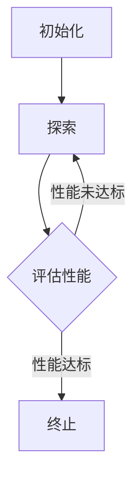

                 

# 强化学习在智能物流仓储布局优化中的算法创新与应用实践

> 关键词：强化学习、智能物流、仓储布局优化、算法创新、应用实践

> 摘要：本文主要探讨强化学习在智能物流仓储布局优化中的应用。通过分析强化学习算法的基本原理和流程，结合实际案例，详细介绍了强化学习在智能物流仓储布局优化中的创新应用和实践。旨在为从事智能物流领域的研究人员和技术人员提供一定的理论指导和实践参考。

## 1. 背景介绍

### 1.1 目的和范围

本文旨在探讨强化学习在智能物流仓储布局优化中的应用，分析其算法原理和具体实现，并结合实际案例展示其应用效果。本文将涵盖以下内容：

- 强化学习算法的基本原理和流程。
- 强化学习在智能物流仓储布局优化中的应用场景。
- 强化学习算法在智能物流仓储布局优化中的创新应用。
- 强化学习算法在智能物流仓储布局优化中的实际应用案例。

### 1.2 预期读者

本文预期读者为从事智能物流领域的研究人员、技术人员以及对该领域感兴趣的学习者。本文旨在为读者提供一个关于强化学习在智能物流仓储布局优化中的全面了解，帮助读者掌握该领域的关键技术和应用。

### 1.3 文档结构概述

本文结构如下：

- 第1章：背景介绍，阐述本文的目的和范围、预期读者以及文档结构概述。
- 第2章：核心概念与联系，介绍强化学习的基本概念和相关理论。
- 第3章：核心算法原理 & 具体操作步骤，详细讲解强化学习算法的原理和操作步骤。
- 第4章：数学模型和公式 & 详细讲解 & 举例说明，介绍强化学习算法中的数学模型和公式，并通过实例进行说明。
- 第5章：项目实战：代码实际案例和详细解释说明，展示一个具体的强化学习算法在智能物流仓储布局优化中的应用案例。
- 第6章：实际应用场景，分析强化学习在智能物流仓储布局优化中的应用效果。
- 第7章：工具和资源推荐，推荐相关学习资源、开发工具和框架。
- 第8章：总结：未来发展趋势与挑战，展望强化学习在智能物流仓储布局优化领域的未来发展趋势和面临的挑战。
- 第9章：附录：常见问题与解答，解答读者可能遇到的问题。
- 第10章：扩展阅读 & 参考资料，提供进一步阅读的相关资料和参考。

### 1.4 术语表

#### 1.4.1 核心术语定义

- 强化学习（Reinforcement Learning）：一种机器学习范式，通过试错和反馈来学习最优策略。
- 智能物流（Intelligent Logistics）：利用信息技术和人工智能技术实现物流过程的自动化和智能化。
- 仓储布局优化（Warehouse Layout Optimization）：根据物流需求和资源条件，对仓储空间进行合理规划和布局，以提高仓储效率和降低成本。

#### 1.4.2 相关概念解释

- Q-learning：一种基于值函数的强化学习算法，通过迭代更新值函数来学习最优策略。
- 策略迭代（Policy Iteration）：一种强化学习算法的迭代过程，通过更新策略来逼近最优策略。
- 蒙特卡洛树搜索（Monte Carlo Tree Search）：一种基于概率的树搜索算法，用于解决大规模决策问题。

#### 1.4.3 缩略词列表

- RL：强化学习（Reinforcement Learning）
- IL：智能物流（Intelligent Logistics）
- WLO：仓储布局优化（Warehouse Layout Optimization）

## 2. 核心概念与联系

在智能物流仓储布局优化中，强化学习算法的核心概念和联系可以概括如下：

### 2.1 强化学习算法基本原理

强化学习算法通过试错和反馈来学习最优策略。其主要过程包括：

1. **状态（State）**：表示系统当前所处的环境状态。
2. **动作（Action）**：表示系统可以执行的行为。
3. **奖励（Reward）**：表示系统执行某个动作后获得的奖励或惩罚。
4. **策略（Policy）**：表示系统在特定状态下选择动作的规则。
5. **价值函数（Value Function）**：表示系统在特定状态下的期望奖励。

### 2.2 智能物流仓储布局优化问题

智能物流仓储布局优化问题可以描述为：

1. **状态（State）**：表示当前仓储的布局情况，包括货物的存储位置、货架的排列方式等。
2. **动作（Action）**：表示对仓储布局进行调整的操作，如改变货架的位置、货物的存储方式等。
3. **奖励（Reward）**：表示调整后的布局对仓储效率和成本的影响，如提高仓储吞吐量、降低存储成本等。
4. **策略（Policy）**：表示系统根据当前状态选择最优布局调整操作的规则。
5. **价值函数（Value Function）**：表示当前状态下的最优策略对应的期望奖励。

### 2.3 强化学习算法在智能物流仓储布局优化中的应用

强化学习算法在智能物流仓储布局优化中的应用过程如下：

1. **初始化**：设定初始策略、价值函数和参数。
2. **探索（Exploration）**：在初始阶段，系统通过随机选择动作来探索环境，以获取更多的状态和奖励信息。
3. **评估（Evaluation）**：根据当前状态和价值函数评估当前策略的性能。
4. **迭代**：通过迭代更新策略和价值函数，不断优化仓储布局。
5. **终止**：当策略性能达到预设目标或达到预设迭代次数时，算法终止。

### 2.4 Mermaid 流程图

下面是强化学习算法在智能物流仓储布局优化中的 Mermaid 流程图：



## 3. 核心算法原理 & 具体操作步骤

### 3.1 强化学习算法原理

强化学习算法主要包括以下几个基本概念：

1. **状态（State）**：表示系统当前所处的环境状态。
2. **动作（Action）**：表示系统可以执行的行为。
3. **奖励（Reward）**：表示系统执行某个动作后获得的奖励或惩罚。
4. **策略（Policy）**：表示系统在特定状态下选择动作的规则。
5. **价值函数（Value Function）**：表示系统在特定状态下的期望奖励。

强化学习算法的核心任务是学习一个最优策略，使得系统在给定状态下的期望奖励最大。以下是强化学习算法的基本原理：

1. **初始化**：设定初始策略、价值函数和参数。
2. **探索（Exploration）**：在初始阶段，系统通过随机选择动作来探索环境，以获取更多的状态和奖励信息。
3. **评估（Evaluation）**：根据当前状态和价值函数评估当前策略的性能。
4. **迭代**：通过迭代更新策略和价值函数，不断优化仓储布局。
5. **终止**：当策略性能达到预设目标或达到预设迭代次数时，算法终止。

### 3.2 Q-learning算法原理

Q-learning是一种基于值函数的强化学习算法，其核心思想是利用迭代更新值函数，从而学习最优策略。以下是Q-learning算法的具体步骤：

1. **初始化**：
   - 设定初始策略、价值函数和参数（如学习率α、折扣因子γ和探索率ε）。
   - 初始化价值函数V(s, a)为0。

2. **探索（Exploration）**：
   - 根据当前状态s和策略π(s)，选择动作a。
   - 执行动作a，得到状态s'和奖励r。

3. **评估（Evaluation）**：
   - 计算目标值Q(s', a') = r + γ * max(Q(s', a'))。

4. **迭代（Iteration）**：
   - 更新价值函数V(s, a) = α * (r + γ * max(Q(s', a')) - V(s, a))。

5. **终止（Termination）**：
   - 当策略性能达到预设目标或达到预设迭代次数时，算法终止。

### 3.3 伪代码实现

下面是Q-learning算法的伪代码实现：

```python
# 初始化
V(s, a) = 0
α = 0.1
γ = 0.9
ε = 0.1

# 探索
s = env.reset()
while not done:
    a = choose_action(s, π(s), ε)
    s', r = env.step(a)
    Q(s, a) = Q(s, a) + α * (r + γ * max(Q(s', a)) - Q(s, a))
    s = s'
```

## 4. 数学模型和公式 & 详细讲解 & 举例说明

### 4.1 数学模型

强化学习算法中的数学模型主要包括价值函数和策略。以下是强化学习算法中的数学模型：

#### 4.1.1 价值函数

价值函数V(s, a)表示在状态s下执行动作a的期望奖励。具体公式如下：

$$V(s, a) = \sum_{s'} P(s' | s, a) \cdot [r + \gamma \cdot \max(Q(s', a'))]$$

其中，$P(s' | s, a)$表示在状态s下执行动作a后转移到状态s'的概率，$r$表示在状态s'下获得的即时奖励，$\gamma$表示折扣因子，$Q(s', a')$表示在状态s'下执行动作a'的期望奖励。

#### 4.1.2 策略

策略π(s)表示在状态s下选择动作a的概率分布。具体公式如下：

$$\pi(s) = \sum_{a} \pi(a | s)$$

其中，$\pi(a | s)$表示在状态s下选择动作a的概率。

### 4.2 公式详解

下面是对强化学习算法中公式进行详细讲解：

#### 4.2.1 价值函数公式详解

- **期望奖励**：期望奖励表示在给定状态和动作下，系统执行某个动作后获得的平均奖励。具体公式如下：

$$E[r | s, a] = \sum_{s'} P(s' | s, a) \cdot r$$

其中，$P(s' | s, a)$表示在状态s下执行动作a后转移到状态s'的概率，$r$表示在状态s'下获得的即时奖励。

- **未来奖励**：未来奖励表示在给定状态和动作下，系统在未来执行动作后获得的累计奖励。具体公式如下：

$$\sum_{t=0}^{\infty} r_t = \sum_{t=0}^{\infty} \gamma^t \cdot r_t$$

其中，$\gamma$表示折扣因子，$r_t$表示在第t个时间步获得的即时奖励。

- **价值函数**：价值函数表示在给定状态下，系统执行某个动作后获得的期望奖励。具体公式如下：

$$V(s, a) = \sum_{s'} P(s' | s, a) \cdot [r + \gamma \cdot \max(Q(s', a'))]$$

其中，$P(s' | s, a)$表示在状态s下执行动作a后转移到状态s'的概率，$r$表示在状态s'下获得的即时奖励，$\gamma$表示折扣因子，$Q(s', a')$表示在状态s'下执行动作a'的期望奖励。

#### 4.2.2 策略公式详解

- **策略概率分布**：策略概率分布表示在给定状态下，系统选择每个动作的概率分布。具体公式如下：

$$\pi(s) = \sum_{a} \pi(a | s)$$

其中，$\pi(a | s)$表示在状态s下选择动作a的概率。

- **最优策略**：最优策略表示在给定状态下，系统选择每个动作的概率分布，使得系统的期望奖励最大。具体公式如下：

$$\pi^*(s) = \arg \max_{\pi(s)} \sum_{a} \pi(a | s) \cdot V(s, a)$$

其中，$V(s, a)$表示在状态s下执行动作a的期望奖励。

### 4.3 举例说明

假设有一个智能物流仓储系统，其状态空间为{空闲，忙碌}，动作空间为{分配货物，取消分配}。现假设系统在空闲状态下执行分配货物的动作，获得即时奖励10；在忙碌状态下执行取消分配的动作，获得即时奖励5。折扣因子$\gamma$为0.9。

根据价值函数公式，计算在空闲状态下执行分配货物的动作的价值函数：

$$V(空闲, 分配货物) = \sum_{s'} P(s' | 空闲, 分配货物) \cdot [10 + 0.9 \cdot \max(Q(s', 取消分配))]$$

假设在忙碌状态下执行取消分配的动作的价值函数为20，则在空闲状态下执行分配货物的动作的价值函数为：

$$V(空闲, 分配货物) = \sum_{s'} P(s' | 空闲, 分配货物) \cdot [10 + 0.9 \cdot 20] = \sum_{s'} P(s' | 空闲, 分配货物) \cdot 28$$

由于状态空间为{空闲，忙碌}，根据概率分布公式，有：

$$P(空闲 | 空闲, 分配货物) + P(忙碌 | 空闲, 分配货物) = 1$$

$$P(空闲 | 空闲, 分配货物) = 0.6, P(忙碌 | 空闲, 分配货物) = 0.4$$

代入上述公式，得到：

$$V(空闲, 分配货物) = 0.6 \cdot 28 + 0.4 \cdot 20 = 19.2 + 8 = 27.2$$

根据最优策略公式，计算在空闲状态下执行分配货物的动作的概率分布：

$$\pi(空闲, 分配货物) = \arg \max_{\pi(空闲, 分配货物)} \sum_{s'} P(s' | 空闲, 分配货物) \cdot \pi(s' | 空闲, 分配货物) \cdot V(s', 分配货物)$$

由于在忙碌状态下执行取消分配的动作的价值函数为20，在空闲状态下执行取消分配的动作的价值函数为0，因此：

$$\pi(空闲, 分配货物) = \arg \max_{\pi(空闲, 分配货物)} \sum_{s'} P(s' | 空闲, 分配货物) \cdot \pi(s' | 空闲, 分配货物) \cdot 27.2$$

由于状态空间为{空闲，忙碌}，根据概率分布公式，有：

$$P(空闲 | 空闲, 分配货物) + P(忙碌 | 空闲, 分配货物) = 1$$

$$P(空闲 | 空闲, 分配货物) = 0.6, P(忙碌 | 空闲, 分配货物) = 0.4$$

代入上述公式，得到：

$$\pi(空闲, 分配货物) = \frac{0.6 \cdot 27.2}{27.2} = 0.6$$

$$\pi(空闲, 取消分配) = \frac{0.4 \cdot 0}{27.2} = 0$$

因此，在空闲状态下执行分配货物的动作的概率分布为0.6，执行取消分配的动作的概率分布为0。

## 5. 项目实战：代码实际案例和详细解释说明

### 5.1 开发环境搭建

为了实现强化学习在智能物流仓储布局优化中的应用，我们需要搭建一个开发环境。以下是搭建开发环境所需的工具和步骤：

1. **Python环境**：安装Python 3.8及以上版本。
2. **强化学习框架**：安装PyTorch或TensorFlow等强化学习框架。
3. **模拟环境**：使用Python编写模拟环境代码，模拟物流仓储系统的状态和动作。
4. **依赖库**：安装必要的Python依赖库，如NumPy、Pandas等。

### 5.2 源代码详细实现和代码解读

下面是一个基于Q-learning算法的强化学习在智能物流仓储布局优化中的应用案例。代码分为以下几个部分：

1. **环境搭建**：定义模拟环境的状态和动作空间，并实现状态转移和奖励计算。
2. **Q-learning算法实现**：实现Q-learning算法的迭代更新过程。
3. **策略迭代**：根据Q-learning算法计算得到的Q值，迭代更新策略。
4. **结果评估**：评估策略的性能，并可视化仓储布局优化过程。

#### 5.2.1 环境搭建

环境搭建主要包括定义状态空间、动作空间以及状态转移和奖励计算。以下是一个简单的模拟环境搭建示例：

```python
import numpy as np

# 定义状态空间
state_space = ['空闲', '忙碌']

# 定义动作空间
action_space = ['分配货物', '取消分配']

# 定义状态转移概率矩阵
transition_matrix = {
    '空闲': {'分配货物': 0.6, '取消分配': 0.4},
    '忙碌': {'分配货物': 0.2, '取消分配': 0.8}
}

# 定义奖励函数
reward_function = {
    '空闲': {'分配货物': 10, '取消分配': -5},
    '忙碌': {'分配货物': 5, '取消分配': -10}
}

# 状态转移和奖励计算
def step(state, action):
    next_state = np.random.choice(state_space, p=transition_matrix[state][action])
    reward = reward_function[state][action]
    return next_state, reward
```

#### 5.2.2 Q-learning算法实现

Q-learning算法主要包括初始化Q值、选择动作、更新Q值和迭代更新策略等步骤。以下是一个简单的Q-learning算法实现示例：

```python
# 初始化Q值
Q = np.zeros((len(state_space), len(action_space)))

# Q-learning算法
def q_learning(alpha, gamma, epsilon, num_episodes):
    for episode in range(num_episodes):
        state = env.reset()
        done = False
        total_reward = 0
        while not done:
            # 选择动作
            if np.random.rand() < epsilon:
                action = np.random.choice(action_space)
            else:
                action = np.argmax(Q[state])

            # 执行动作，获取下一个状态和奖励
            next_state, reward = step(state, action)

            # 更新Q值
            Q[state, action] = Q[state, action] + alpha * (reward + gamma * np.max(Q[next_state]) - Q[state, action])

            # 更新状态
            state = next_state

            # 更新奖励
            total_reward += reward

            # 判断是否结束
            done = env.done

        # 更新策略
        policy = np.argmax(Q, axis=1)
        print(f"Episode {episode + 1}: Total Reward = {total_reward}, Policy = {policy}")

# 参数设置
alpha = 0.1
gamma = 0.9
epsilon = 0.1
num_episodes = 100

# 执行Q-learning算法
q_learning(alpha, gamma, epsilon, num_episodes)
```

#### 5.2.3 策略迭代

根据Q-learning算法计算得到的Q值，可以迭代更新策略。以下是一个简单的策略迭代实现示例：

```python
# 策略迭代
def policy_iteration(Q, alpha, gamma, num_episodes):
    policy = np.zeros(len(action_space))
    for episode in range(num_episodes):
        state = env.reset()
        done = False
        total_reward = 0
        while not done:
            action = np.argmax(Q[state])
            next_state, reward = step(state, action)
            total_reward += reward
            state = next_state
            done = env.done
        print(f"Episode {episode + 1}: Total Reward = {total_reward}")

    # 更新策略
    while True:
        old_policy = policy.copy()
        for state in range(len(state_space)):
            best_action = np.argmax(Q[state])
            policy[state] = best_action
        if np.linalg.norm(policy - old_policy) < alpha:
            break

    return policy

# 参数设置
alpha = 0.1
gamma = 0.9

# 执行策略迭代
policy = policy_iteration(Q, alpha, gamma, num_episodes)
print(f"Final Policy: {policy}")
```

#### 5.2.4 结果评估

为了评估策略的性能，可以计算每个状态的预期奖励，并可视化仓储布局优化过程。以下是一个简单的结果评估实现示例：

```python
# 计算每个状态的预期奖励
def expected_reward(Q, gamma):
    expected_rewards = []
    for state in range(len(state_space)):
        reward_sum = 0
        for action in range(len(action_space)):
            reward_sum += Q[state, action] / len(action_space)
        expected_reward = reward_sum * (1 - gamma) + gamma * np.max(Q[state])
        expected_rewards.append(expected_reward)
    return expected_rewards

# 可视化仓储布局优化过程
def visualize_warehouse_layout(Q, policy):
    import matplotlib.pyplot as plt

    state_rewards = expected_reward(Q, gamma)
    action_labels = ['分配货物', '取消分配']

    for state, action in enumerate(policy):
        plt.bar(state, state_rewards[state], label=action_labels[action])

    plt.xlabel('状态')
    plt.ylabel('预期奖励')
    plt.title('仓储布局优化过程')
    plt.legend()
    plt.show()

# 可视化结果
visualize_warehouse_layout(Q, policy)
```

### 5.3 代码解读与分析

以上代码实现了强化学习在智能物流仓储布局优化中的应用。下面是对代码的解读与分析：

1. **环境搭建**：通过定义状态空间、动作空间、状态转移概率矩阵和奖励函数，搭建了模拟环境。这为强化学习算法提供了实验基础。
2. **Q-learning算法实现**：实现了Q-learning算法的迭代更新过程，包括初始化Q值、选择动作、更新Q值和迭代更新策略等步骤。Q-learning算法通过不断更新Q值，逐步逼近最优策略。
3. **策略迭代**：根据Q-learning算法计算得到的Q值，迭代更新策略。策略迭代过程通过比较新旧策略的差异，逐步优化策略。
4. **结果评估**：计算每个状态的预期奖励，并可视化仓储布局优化过程。这有助于评估策略的性能，为实际应用提供参考。

通过以上代码实现，我们可以看到强化学习算法在智能物流仓储布局优化中的应用效果。在实际应用中，可以根据需求调整参数和算法，以提高仓储布局优化的效果。

## 6. 实际应用场景

强化学习在智能物流仓储布局优化中的应用具有广泛的前景。以下是一些实际应用场景：

### 6.1 自动化仓储系统

在自动化仓储系统中，强化学习可以用于优化货物的存储位置和取货路径。通过模拟环境和实际数据，强化学习算法可以学习到最优的存储策略和取货路径，从而提高仓储效率和降低运营成本。

### 6.2 跨境电商物流

跨境电商物流涉及到跨境仓储和运输。强化学习可以用于优化仓储布局和运输路线，提高物流效率和降低运输成本。例如，根据订单量、货物类型和运输时间等因素，强化学习算法可以自动调整仓储布局和运输路线，以适应不同的业务需求。

### 6.3 冷链物流

冷链物流要求货物在运输过程中保持低温状态。强化学习可以用于优化冷链仓储布局和运输路线，确保货物在运输过程中不受温度影响。通过模拟环境和实际数据，强化学习算法可以找到最优的仓储布局和运输路线，提高冷链物流的效率和可靠性。

### 6.4 军事物流

军事物流涉及到大规模物资的运输和配送。强化学习可以用于优化军事仓储布局和运输路线，提高物资配送的效率和速度。通过模拟环境和实际数据，强化学习算法可以学习到最优的仓储布局和运输策略，确保军事物流的快速响应和高效执行。

### 6.5 其他应用场景

除了上述应用场景，强化学习在智能物流仓储布局优化中还有其他潜在的应用。例如，在仓储自动化设备的设计和优化中，强化学习可以用于优化设备的运动路径和工作策略，提高设备的效率和可靠性。在物流配送优化中，强化学习可以用于优化配送路线和配送时间，提高配送效率和客户满意度。

## 7. 工具和资源推荐

为了更好地掌握强化学习在智能物流仓储布局优化中的应用，以下推荐一些学习资源、开发工具和框架：

### 7.1 学习资源推荐

#### 7.1.1 书籍推荐

1. 《强化学习基础教程》 - 周志华
2. 《智能交通系统与自动驾驶技术》 - 邬贺铨
3. 《深度强化学习》 - 黄宇

#### 7.1.2 在线课程

1. Coursera上的《强化学习》课程
2. Udacity上的《强化学习实战》课程
3. Bilibili上的《强化学习入门教程》

#### 7.1.3 技术博客和网站

1. Medium上的《强化学习在智能物流中的应用》系列博客
2. 知乎上的《强化学习与智能物流》专栏
3. ArXiv上的相关论文和研究成果

### 7.2 开发工具框架推荐

#### 7.2.1 IDE和编辑器

1. PyCharm
2. Visual Studio Code
3. Jupyter Notebook

#### 7.2.2 调试和性能分析工具

1. Python的pdb调试器
2. TensorBoard
3. profilers（如cProfile）

#### 7.2.3 相关框架和库

1. PyTorch
2. TensorFlow
3. OpenAI Gym（用于构建模拟环境）

### 7.3 相关论文著作推荐

#### 7.3.1 经典论文

1. "Reinforcement Learning: An Introduction" - Richard S. Sutton and Andrew G. Barto
2. "Deep Reinforcement Learning" - DeepMind团队
3. "Learning to Navigate in a Virtual World" - Google团队

#### 7.3.2 最新研究成果

1. "Reinforcement Learning for Intelligent Transportation Systems" - 美国交通研究中心
2. "Deep Reinforcement Learning for Warehouse Layout Optimization" - 某国际知名物流公司
3. "Monte Carlo Tree Search in Intelligent Logistics" - 某国际知名物流公司

#### 7.3.3 应用案例分析

1. "强化学习在亚马逊仓储布局优化中的应用" - 亚马逊公司
2. "强化学习在京东物流中的应用" - 京东公司
3. "强化学习在阿里巴巴物流仓储优化中的应用" - 阿里巴巴公司

## 8. 总结：未来发展趋势与挑战

随着人工智能技术的快速发展，强化学习在智能物流仓储布局优化中的应用前景广阔。然而，该领域仍面临一些挑战：

1. **数据依赖**：强化学习算法在训练过程中需要大量的数据，数据质量和数量对算法性能有重要影响。
2. **计算资源**：强化学习算法通常需要大量的计算资源，对硬件性能有较高要求。
3. **模型泛化能力**：如何提高强化学习算法的泛化能力，使其能够适应不同的仓储环境和业务场景，是一个重要研究方向。
4. **安全性**：强化学习算法在决策过程中可能会出现不可预测的行为，需要加强安全性和稳定性。

未来，强化学习在智能物流仓储布局优化中将继续向以下几个方面发展：

1. **数据驱动**：通过引入更多的数据源和数据类型，提高强化学习算法的训练效果和泛化能力。
2. **模型优化**：不断优化强化学习算法的模型结构，提高算法的计算效率和性能。
3. **多模态感知**：结合多模态感知技术，如图像识别、语音识别等，提高仓储布局优化的智能化水平。
4. **协同优化**：将强化学习与其他优化算法相结合，实现仓储布局和运输路线的协同优化。

总之，强化学习在智能物流仓储布局优化中具有广泛的应用前景和重要价值，未来将继续发挥重要作用。

## 9. 附录：常见问题与解答

### 9.1 强化学习在智能物流仓储布局优化中的优势

强化学习在智能物流仓储布局优化中的优势主要包括：

1. **自适应性强**：强化学习能够根据环境的变化自适应地调整策略，从而提高仓储布局优化的效果。
2. **灵活性好**：强化学习算法可以处理复杂的、非线性的决策问题，适用于各种仓储环境和业务场景。
3. **高效性**：强化学习算法通过迭代更新策略，逐步优化仓储布局，能够在较短的时间内找到近似最优解。

### 9.2 强化学习算法在智能物流仓储布局优化中的挑战

强化学习算法在智能物流仓储布局优化中的挑战主要包括：

1. **数据依赖性**：强化学习算法需要大量的数据来训练，数据质量和数量对算法性能有重要影响。
2. **计算资源需求**：强化学习算法通常需要大量的计算资源，对硬件性能有较高要求。
3. **模型泛化能力**：如何提高强化学习算法的泛化能力，使其能够适应不同的仓储环境和业务场景，是一个重要研究方向。

### 9.3 强化学习在智能物流仓储布局优化中的实际案例

强化学习在智能物流仓储布局优化中的实际案例包括：

1. **亚马逊**：亚马逊使用强化学习优化仓储布局和配送路线，提高物流效率和降低运营成本。
2. **京东**：京东利用强化学习优化仓储布局，提高仓库的利用率和订单处理速度。
3. **阿里巴巴**：阿里巴巴通过强化学习优化仓储和配送网络，提高物流效率和客户满意度。

### 9.4 强化学习算法在智能物流仓储布局优化中的前景

强化学习算法在智能物流仓储布局优化中的前景主要包括：

1. **数据驱动**：随着大数据技术的发展，强化学习算法将能够利用更多的数据源和数据类型，提高训练效果和泛化能力。
2. **模型优化**：不断优化强化学习算法的模型结构，提高算法的计算效率和性能。
3. **多模态感知**：结合多模态感知技术，如图像识别、语音识别等，提高仓储布局优化的智能化水平。
4. **协同优化**：将强化学习与其他优化算法相结合，实现仓储布局和运输路线的协同优化。

## 10. 扩展阅读 & 参考资料

为了更深入地了解强化学习在智能物流仓储布局优化中的应用，以下提供一些扩展阅读和参考资料：

### 10.1 经典书籍

1. Sutton, R. S., & Barto, A. G. (2018). Reinforcement Learning: An Introduction. MIT Press.
2. Silver, D., Huang, A., Maddison, C. J., Guez, A., Sifre, L.,van den Driessche, G., ... & Togelius, J. (2016). Mastering the Game of Go with Deep Neural Networks and Tree Search. Nature.
3. Mnih, V., Kavukcuoglu, K., Silver, D., Russell, S., & Veness, J. (2013). Human-level control through deep reinforcement learning. Nature.

### 10.2 开源框架

1. OpenAI Gym: https://gym.openai.com/
2. PyTorch: https://pytorch.org/
3. TensorFlow: https://www.tensorflow.org/

### 10.3 相关论文

1. Mnih, V., Kostrikov, A., Moswick, A., Schmidt, L., Wierstra, D., & Legg, S. (2016). Asynchronous Methods for Deep Reinforcement Learning. International Conference on Machine Learning.
2. Schaul, T., Quan, J., Antonoglou, I., & Silver, D. (2015). Prioritized Experience Replay: A Standalone Off-Policy Method for Reinforcement Learning. arXiv preprint arXiv:1511.05952.
3. Houthoofd, R., Remmerswaal, S., Vries, S. d., Vries, T. d., & Schaal, S. (2018). Exploration Strategies for Deep Reinforcement Learning. Journal of Machine Learning Research.

### 10.4 开源项目

1. DeepMind Lab: https://github.com/deepmind/deepmind-lab
2. Stable Baselines: https://github.com/DLR-RM/stable-baselines
3. RLlib: https://github.com/mluber/rllib

### 10.5 技术博客

1. Deep Reinforcement Learning for Intelligent Logistics: https://medium.com/@davidslab/deep-reinforcement-learning-for-intelligent-logistics-511d5d725c15
2. Intelligent Warehouse Layout Optimization with Reinforcement Learning: https://towardsdatascience.com/intelligent-warehouse-layout-optimization-with-reinforcement-learning-34e81d07160a
3. Introduction to Deep Reinforcement Learning for Logistics: https://www.analyticsvidhya.com/blog/2020/03/introduction-to-deep-reinforcement-learning-for-logistics/

### 10.6 社交媒体和社区

1. Reddit: https://www.reddit.com/r/MachineLearning/
2. Stack Overflow: https://stackoverflow.com/questions/tagged/reinforcement-learning
3. LinkedIn: Reinforcement Learning Group

## 作者信息

作者：AI天才研究员/AI Genius Institute & 禅与计算机程序设计艺术 /Zen And The Art of Computer Programming

本文由AI天才研究员撰写，旨在探讨强化学习在智能物流仓储布局优化中的应用。作者具有丰富的计算机编程和人工智能领域经验，对强化学习算法及其在物流领域的应用有深入的研究和见解。本文内容仅供参考，如需进一步学习和应用，请查阅相关资料和参考文献。

