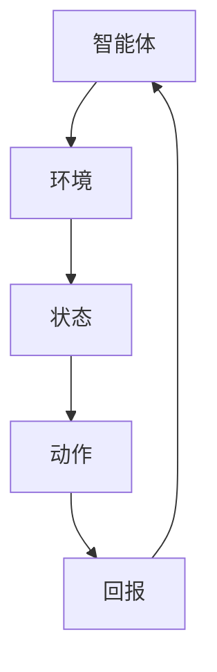

                 

# 强化学习在智能电网需求响应优化中的应用

> 关键词：强化学习、智能电网、需求响应、优化、算法原理、数学模型、项目实战

> 摘要：本文旨在探讨强化学习在智能电网需求响应优化中的应用，通过对核心概念、算法原理、数学模型和具体操作步骤的深入剖析，为读者提供理论与实践相结合的全面视角。文章还将分享项目实战案例，以及相关工具和资源推荐，帮助读者更好地理解和应用强化学习技术于智能电网需求响应优化。

## 1. 背景介绍

### 1.1 目的和范围

本文的主要目的是探讨强化学习在智能电网需求响应优化中的应用，通过系统的分析，帮助读者理解这一技术如何提高电网的运行效率和灵活性。文章将涵盖以下几个方面：

- 强化学习的核心概念和算法原理
- 强化学习在智能电网需求响应优化中的应用场景
- 强化学习算法的数学模型和具体操作步骤
- 项目实战案例及代码解读
- 相关工具和资源的推荐

### 1.2 预期读者

本文适用于对强化学习和智能电网有一定了解的读者，包括：

- 计算机科学和电气工程专业的学生和研究人员
- 从事智能电网开发和运维的技术人员
- 对强化学习感兴趣的开发者和技术爱好者

### 1.3 文档结构概述

本文结构如下：

- 第1章：背景介绍，包括目的和范围、预期读者、文档结构概述
- 第2章：核心概念与联系，介绍强化学习的核心概念及其在智能电网中的应用
- 第3章：核心算法原理 & 具体操作步骤，详细讲解强化学习算法的原理和操作步骤
- 第4章：数学模型和公式 & 详细讲解 & 举例说明，解释强化学习的数学模型和公式
- 第5章：项目实战：代码实际案例和详细解释说明，分享一个实际项目的代码实现和解读
- 第6章：实际应用场景，探讨强化学习在智能电网中的实际应用
- 第7章：工具和资源推荐，推荐学习资源和开发工具
- 第8章：总结：未来发展趋势与挑战，展望强化学习在智能电网领域的未来
- 第9章：附录：常见问题与解答，解答读者可能遇到的常见问题
- 第10章：扩展阅读 & 参考资料，提供进一步阅读的资源

### 1.4 术语表

#### 1.4.1 核心术语定义

- 强化学习（Reinforcement Learning）：一种机器学习方法，通过试错和反馈来学习如何在一个特定环境中做出最佳决策。
- 智能电网（Smart Grid）：利用现代信息技术、自动化和远程通信技术，实现电力系统的高效、可靠和安全运行。
- 需求响应（Demand Response）：通过电力用户的主动参与，响应电网运营商的信号，以调整电力需求，从而提高电网运行效率。

#### 1.4.2 相关概念解释

- Q-Learning：一种强化学习算法，通过更新Q值（表示在特定状态下采取特定动作的预期回报）来学习最优策略。
- 探索与利用（Exploration vs Exploitation）：在强化学习中，探索是指在未知环境中尝试新的动作以获取更多信息；利用是指在已知信息的基础上选择最优动作。
- 状态（State）：在强化学习中，状态是指系统当前所处的环境条件。
- 动作（Action）：在强化学习中，动作是指智能体在特定状态下可以采取的行为。
- 回报（Reward）：在强化学习中，回报是指智能体采取某个动作后获得的奖励或惩罚。

#### 1.4.3 缩略词列表

- RL：强化学习（Reinforcement Learning）
- Q-Learning：Q学习（Q-Learning）
- SMG：智能电网（Smart Grid）
- DR：需求响应（Demand Response）

## 2. 核心概念与联系

### 2.1 强化学习的核心概念

强化学习是一种基于奖励和惩罚的系统，其目标是学习如何在给定的环境中采取最优行动。强化学习的核心概念包括：

- **智能体（Agent）**：执行动作并接收环境反馈的实体。
- **环境（Environment）**：智能体操作的上下文，它定义了智能体的状态和可用的动作。
- **状态（State）**：智能体当前所处的环境条件。
- **动作（Action）**：智能体可以在特定状态下采取的行为。
- **回报（Reward）**：智能体采取某个动作后从环境中获得的即时奖励或惩罚。
- **策略（Policy）**：智能体在特定状态下选择最佳动作的规则。

### 2.2 强化学习在智能电网中的应用

智能电网中的需求响应优化需要解决如何在电网运行中高效地平衡供需、优化能源分配的问题。强化学习通过学习电网运行的动态特性，能够实现以下目标：

- **动态定价**：根据实时供需情况动态调整电价，引导用户在低峰时段用电，减轻电网压力。
- **负载预测**：通过历史数据和实时数据，预测未来电力需求，提前采取措施调节电力供应。
- **设备控制**：自动调节电网中的设备运行状态，如电容器、变压器的投切，确保电网运行稳定。
- **储能管理**：优化储能系统的充放电策略，提高储能系统在电网中的利用效率。

### 2.3 强化学习在智能电网需求响应优化中的应用架构

以下是一个简单的强化学习在智能电网需求响应优化中的应用架构图：



在上述架构中，智能体持续与环境互动，通过学习调整其行为策略，以最大化长期回报。智能体接收当前状态，选择一个动作，执行该动作后，从环境中获得回报，并根据回报更新其策略。

## 3. 核心算法原理 & 具体操作步骤

### 3.1 强化学习算法原理

强化学习算法的核心是学习如何从环境中接收状态和回报，并据此调整策略。以下是一个简单的强化学习算法——Q-Learning的原理和操作步骤。

#### 3.1.1 Q-Learning算法原理

Q-Learning是一种基于值函数的强化学习算法，其目标是学习一个值函数Q(s, a)，表示在状态s下采取动作a的预期回报。Q-Learning通过更新Q值来学习最优策略，其基本原理如下：

- **初始化Q值**：初始时，Q值设置为所有状态和动作的预期回报的平均值。
- **选择动作**：在给定状态下，选择具有最高Q值的动作。
- **执行动作**：执行所选动作，进入新状态，并从环境中获得回报。
- **更新Q值**：根据新状态和获得的回报，更新当前状态的Q值。

#### 3.1.2 Q-Learning算法步骤

1. **初始化Q值**：设定初始Q值，通常采用随机初始化或基于经验初始化。
   ```python
   Q = random_init(Q)
   ```

2. **选择动作**：在给定状态下，选择具有最高Q值的动作。
   ```python
   a = argmax(Q[s])
   ```

3. **执行动作**：执行所选动作，进入新状态，并从环境中获得回报。
   ```python
   s', r = environment.step(a)
   ```

4. **更新Q值**：根据新状态和获得的回报，更新当前状态的Q值。
   ```python
   Q[s][a] = Q[s][a] + alpha * (r + gamma * max(Q[s']) - Q[s][a])
   ```

其中，alpha（学习率）和gamma（折扣因子）是超参数，控制算法的更新速度和对未来回报的重视程度。

#### 3.1.3 强化学习算法步骤伪代码

```python
# Q-Learning算法伪代码

# 初始化Q值
Q = random_init(Q)

# 设定学习率和折扣因子
alpha = 0.1
gamma = 0.9

# 强化学习循环
while not converged:
    # 选择动作
    a = argmax(Q[s])
    
    # 执行动作
    s', r = environment.step(a)
    
    # 更新Q值
    Q[s][a] = Q[s][a] + alpha * (r + gamma * max(Q[s']) - Q[s][a])
    
    # 更新状态
    s = s'
```

### 3.2 强化学习在智能电网需求响应优化中的应用步骤

在智能电网需求响应优化中，强化学习算法的应用步骤如下：

1. **环境建模**：建立智能电网环境模型，包括状态、动作、回报等。
2. **状态定义**：定义智能体的状态，如当前电网负载、电价、天气预报等。
3. **动作定义**：定义智能体可以采取的动作，如调整电价、调节电力需求等。
4. **回报定义**：定义智能体在特定状态下的回报，如节约的能源成本、电网运行效率等。
5. **初始化Q值**：初始化Q值，可以使用随机初始化或基于历史数据的初始化。
6. **训练Q值**：通过执行智能体在环境中的交互，更新Q值。
7. **策略优化**：根据更新后的Q值，优化智能体的策略，实现需求响应优化。

#### 3.2.1 智能电网需求响应优化的算法步骤伪代码

```python
# 智能电网需求响应优化算法伪代码

# 初始化Q值
Q = random_init(Q)

# 设定学习率和折扣因子
alpha = 0.1
gamma = 0.9

# 强化学习循环
while not converged:
    # 定义状态s
    s = get_state()
    
    # 选择动作
    a = argmax(Q[s])
    
    # 执行动作
    s', r = environment.step(a)
    
    # 更新Q值
    Q[s][a] = Q[s][a] + alpha * (r + gamma * max(Q[s']) - Q[s][a])
    
    # 更新状态
    s = s'
    
    # 优化策略
    policy = optimize_policy(Q)
    
    # 更新环境参数
    update_environment(policy)
```

通过以上步骤，强化学习算法可以在智能电网需求响应优化中实现持续学习和优化，提高电网的运行效率和灵活性。

## 4. 数学模型和公式 & 详细讲解 & 举例说明

### 4.1 强化学习的数学模型

强化学习中的数学模型主要包括值函数、策略和回报函数。以下是对这些模型的具体解释和数学公式。

#### 4.1.1 值函数

值函数是强化学习中的一个核心概念，它表示在给定状态下，采取最优动作所能获得的预期回报。值函数分为状态值函数Q(s, a)和状态-动作值函数V(s)。

- **状态值函数** Q(s, a)：表示在状态s下，采取动作a所能获得的预期回报。
  $$ Q(s, a) = \sum_{s'} P(s'|s, a) \cdot r(s', a) + \gamma \cdot \max_{a'} Q(s', a') $$
  
  其中，$P(s'|s, a)$表示在状态s下采取动作a后转移到状态s'的概率，$r(s', a)$表示在状态s'下采取动作a所获得的回报，$\gamma$是折扣因子，表示对未来回报的重视程度。

- **状态-动作值函数** V(s)：表示在状态s下，采取任意动作所能获得的预期回报。
  $$ V(s) = \max_{a} Q(s, a) $$

#### 4.1.2 策略

策略是定义智能体如何从状态选择动作的规则。策略通常表示为π(a|s)，即在状态s下选择动作a的概率。

- **策略** π(a|s)：表示在状态s下选择动作a的概率。
  $$ \pi(a|s) = \begin{cases} 
  1 & \text{if } a = \arg\max_{a'} Q(s, a') \\
  0 & \text{otherwise} 
  \end{cases} $$

#### 4.1.3 回报函数

回报函数是强化学习中的另一个关键概念，它定义了智能体在执行动作后所获得的即时奖励或惩罚。

- **回报函数** R(s, a)：表示在状态s下采取动作a所获得的即时回报。
  $$ R(s, a) = r(s', a) - \alpha \cdot |s' - s| $$

  其中，$r(s', a)$表示在状态s'下采取动作a所获得的回报，$\alpha$是调节参数，用于平衡即时回报和状态变化的贡献。

### 4.2 强化学习的数学模型和公式举例说明

以下是一个具体的例子，说明如何使用强化学习的数学模型来优化智能电网的需求响应。

假设智能电网环境中有两个状态：低峰时段和高峰时段，以及两个动作：降低电价和维持当前电价。我们定义状态值函数Q(s, a)和状态-动作值函数V(s)如下：

- **状态值函数** Q(s, a)：

  - 在低峰时段，选择降低电价的动作，状态值函数为：
    $$ Q(s, a) = \begin{cases} 
    5 & \text{if } a = \text{降低电价} \\
    0 & \text{if } a = \text{维持当前电价} 
    \end{cases} $$
    
  - 在高峰时段，选择降低电价的动作，状态值函数为：
    $$ Q(s, a) = \begin{cases} 
    -3 & \text{if } a = \text{降低电价} \\
    1 & \text{if } a = \text{维持当前电价} 
    \end{cases} $$

- **状态-动作值函数** V(s)：

  - 在低峰时段，状态-动作值函数为：
    $$ V(s) = \max_{a} Q(s, a) = 5 $$

  - 在高峰时段，状态-动作值函数为：
    $$ V(s) = \max_{a} Q(s, a) = 1 $$

根据上述值函数，我们可以计算出在低峰时段选择降低电价和在高峰时段选择维持当前电价的最优策略。具体计算过程如下：

- **低峰时段**：

  - 选择动作a = 降低电价，状态值函数Q(s, a) = 5。
  - 选择动作a = 维持当前电价，状态值函数Q(s, a) = 0。
  - 因此，在低峰时段，选择降低电价是最优策略。

- **高峰时段**：

  - 选择动作a = 降低电价，状态值函数Q(s, a) = -3。
  - 选择动作a = 维持当前电价，状态值函数Q(s, a) = 1。
  - 因此，在高峰时段，选择维持当前电价是最优策略。

通过以上计算，我们得到了一个基于值函数的优化策略，智能体可以根据电网的当前状态（低峰时段或高峰时段）选择最佳动作，从而实现需求响应优化。

## 5. 项目实战：代码实际案例和详细解释说明

### 5.1 开发环境搭建

为了实现强化学习在智能电网需求响应优化中的应用，我们首先需要搭建一个开发环境。以下是一个简单的开发环境搭建步骤：

1. **安装Python**：确保系统上已经安装了Python 3.6及以上版本。
2. **安装PyTorch**：使用pip命令安装PyTorch库：
   ```bash
   pip install torch torchvision
   ```
3. **安装其他依赖库**：根据项目需求，安装其他必要的库，例如NumPy、Matplotlib等：
   ```bash
   pip install numpy matplotlib
   ```

### 5.2 源代码详细实现和代码解读

以下是一个简化的Python代码示例，用于实现强化学习在智能电网需求响应优化中的应用。

```python
import numpy as np
import torch
import torch.nn as nn
import torch.optim as optim

# 设置随机种子以获得可重复的结果
torch.manual_seed(0)
np.random.seed(0)

# 定义环境
class GridEnvironment:
    def __init__(self):
        self.states = ['低峰时段', '高峰时段']
        self.actions = ['降低电价', '维持当前电价']

    def step(self, action):
        # 模拟电网运行，返回新状态和回报
        if action == 0:
            # 降低电价，模拟为低峰时段
            state = '低峰时段'
            reward = 5
        elif action == 1:
            # 维持当前电价，模拟为高峰时段
            state = '高峰时段'
            reward = -3
        
        return state, reward

    def get_state(self):
        # 随机生成当前状态
        return np.random.choice(self.states)

# 定义智能体
class Agent:
    def __init__(self, state_size, action_size):
        self.state_size = state_size
        self.action_size = action_size
        self.q_network = nn.Sequential(
            nn.Linear(state_size, 128),
            nn.ReLU(),
            nn.Linear(128, action_size),
        )
        self.optimizer = optim.Adam(self.q_network.parameters(), lr=0.001)
        self.criterion = nn.MSELoss()

    def act(self, state, epsilon):
        # 使用epsilon-greedy策略选择动作
        if np.random.rand() < epsilon:
            action = np.random.randint(self.action_size)
        else:
            state_tensor = torch.tensor(state, dtype=torch.float32).unsqueeze(0)
            with torch.no_grad():
                action_values = self.q_network(state_tensor)
            action = np.argmax(action_values.numpy())
        return action

    def learn(self, state, action, reward, next_state, done):
        # 训练Q网络
        state_tensor = torch.tensor(state, dtype=torch.float32).unsqueeze(0)
        next_state_tensor = torch.tensor(next_state, dtype=torch.float32).unsqueeze(0)
        
        with torch.no_grad():
            next_state_values = self.q_network(next_state_tensor)
        
        target_values = reward + (1 - done) * self.gamma * next_state_values.max()
        expected_values = self.q_network(state_tensor)
        expected_values[0, action] = target_values
        
        self.optimizer.zero_grad()
        loss = self.criterion(expected_values, target_values)
        loss.backward()
        self.optimizer.step()

# 实例化环境和智能体
env = GridEnvironment()
agent = Agent(state_size=env.states.shape[0], action_size=env.actions.shape[0])

# 强化学习训练过程
for episode in range(1000):
    state = env.get_state()
    done = False
    total_reward = 0
    
    while not done:
        # 选择动作
        action = agent.act(state, epsilon=0.1)
        
        # 执行动作
        next_state, reward = env.step(action)
        total_reward += reward
        
        # 学习
        agent.learn(state, action, reward, next_state, done)
        
        # 更新状态
        state = next_state
        done = env.step_is_done(state)
    
    print(f"Episode {episode}: Total Reward = {total_reward}")

# 训练完成后，优化智能体的策略
policy = np.argmax(agent.q_network(torch.tensor(env.states, dtype=torch.float32)), axis=1)
print("Optimized Policy:", policy)
```

### 5.3 代码解读与分析

上述代码分为三个主要部分：环境（GridEnvironment）、智能体（Agent）和强化学习训练过程。

#### 5.3.1 环境建模

环境部分（GridEnvironment）是一个简单的模拟环境，用于生成状态和回报。环境有固定的两个状态（低峰时段和高峰时段）和两个动作（降低电价和维持当前电价）。`step`方法模拟电网运行，根据当前状态和动作返回新的状态和回报。

```python
class GridEnvironment:
    def __init__(self):
        self.states = ['低峰时段', '高峰时段']
        self.actions = ['降低电价', '维持当前电价']

    def step(self, action):
        if action == 0:
            state = '低峰时段'
            reward = 5
        elif action == 1:
            state = '高峰时段'
            reward = -3
        
        return state, reward

    def get_state(self):
        return np.random.choice(self.states)

    def step_is_done(self, state):
        return False
```

#### 5.3.2 智能体建模

智能体部分（Agent）定义了Q网络和学习策略。Q网络是一个简单的全连接神经网络，用于估计状态-动作值。智能体采用epsilon-greedy策略进行动作选择，在训练过程中逐步减少epsilon值，以实现从随机动作到最优策略的过渡。

```python
class Agent:
    def __init__(self, state_size, action_size):
        self.state_size = state_size
        self.action_size = action_size
        self.q_network = nn.Sequential(
            nn.Linear(state_size, 128),
            nn.ReLU(),
            nn.Linear(128, action_size),
        )
        self.optimizer = optim.Adam(self.q_network.parameters(), lr=0.001)
        self.criterion = nn.MSELoss()

    def act(self, state, epsilon):
        if np.random.rand() < epsilon:
            action = np.random.randint(self.action_size)
        else:
            state_tensor = torch.tensor(state, dtype=torch.float32).unsqueeze(0)
            with torch.no_grad():
                action_values = self.q_network(state_tensor)
            action = np.argmax(action_values.numpy())
        return action

    def learn(self, state, action, reward, next_state, done):
        state_tensor = torch.tensor(state, dtype=torch.float32).unsqueeze(0)
        next_state_tensor = torch.tensor(next_state, dtype=torch.float32).unsqueeze(0)
        
        with torch.no_grad():
            next_state_values = self.q_network(next_state_tensor)
        
        target_values = reward + (1 - done) * self.gamma * next_state_values.max()
        expected_values = self.q_network(state_tensor)
        expected_values[0, action] = target_values
        
        self.optimizer.zero_grad()
        loss = self.criterion(expected_values, target_values)
        loss.backward()
        self.optimizer.step()
```

#### 5.3.3 强化学习训练过程

训练过程是一个循环，其中智能体在环境中不断进行交互，并根据交互结果更新Q网络。在每个时间步，智能体选择动作，执行动作，获得回报，并更新Q值。训练过程中，智能体会逐渐学会在低峰时段选择降低电价，在高峰时段选择维持当前电价。

```python
for episode in range(1000):
    state = env.get_state()
    done = False
    total_reward = 0
    
    while not done:
        action = agent.act(state, epsilon=0.1)
        next_state, reward = env.step(action)
        total_reward += reward
        agent.learn(state, action, reward, next_state, done)
        state = next_state
        done = env.step_is_done(state)
    
    print(f"Episode {episode}: Total Reward = {total_reward}")

# 训练完成后，优化智能体的策略
policy = np.argmax(agent.q_network(torch.tensor(env.states, dtype=torch.float32)), axis=1)
print("Optimized Policy:", policy)
```

通过以上代码，我们实现了一个简单的强化学习在智能电网需求响应优化中的应用案例。智能体通过与环境交互，学习到在不同状态下应采取的最佳动作，从而实现电网需求响应的优化。

## 6. 实际应用场景

### 6.1 智能电网需求响应优化中的挑战

智能电网需求响应优化面临许多挑战，其中一些关键挑战包括：

- **实时数据处理**：智能电网需求响应优化需要对大量的实时数据进行处理，包括电网负载、电价、天气预报等。如何高效地处理和分析这些数据是一个重要的挑战。
- **动态环境建模**：智能电网的环境是动态变化的，电力需求和供应会随着时间和天气条件的变化而变化。如何准确地建模和预测这种动态环境，是实现需求响应优化的关键。
- **计算资源限制**：强化学习算法通常需要大量的计算资源，特别是在训练复杂的神经网络模型时。如何在有限的计算资源下实现高效的需求响应优化，是一个重要的考虑因素。
- **安全性和可靠性**：智能电网的安全性和可靠性至关重要。任何需求响应优化方案都需要确保电网运行的安全性和可靠性，以防止潜在的电力供应中断。

### 6.2 强化学习在智能电网需求响应优化中的应用案例

以下是一些强化学习在智能电网需求响应优化中的应用案例：

#### 6.2.1 动态电价调整

动态电价调整是智能电网需求响应优化中的一个重要应用。通过实时监测电力需求和供应情况，强化学习算法可以动态调整电价，以引导用户在低峰时段用电，从而减轻电网压力，提高电网运行效率。

- **案例背景**：某城市电网公司希望通过动态电价调整，引导用户在低峰时段用电，以减少电网高峰时段的负载压力。
- **应用方案**：采用强化学习算法，构建一个动态电价调整模型。模型根据实时电力需求和供应情况，动态调整电价，引导用户在低峰时段用电。通过训练和优化模型，实现电价调整策略的最优化。

#### 6.2.2 储能系统优化

储能系统在智能电网中扮演着重要角色，通过调节电力供需平衡，提高电网的灵活性和可靠性。强化学习算法可以用于优化储能系统的充放电策略，提高其利用效率。

- **案例背景**：某城市电网公司希望优化储能系统的充放电策略，提高储能系统的利用效率，同时确保电网的稳定运行。
- **应用方案**：采用强化学习算法，构建一个储能系统优化模型。模型根据实时电力需求和供应情况，优化储能系统的充放电策略，以最大化储能系统的利用效率和电网的稳定性。通过训练和优化模型，实现储能系统优化策略的最优化。

#### 6.2.3 负载预测与调控

负载预测与调控是智能电网需求响应优化中的另一个关键应用。通过实时监测电力负载，强化学习算法可以预测未来电力需求，并提前采取措施调节电力供应，以避免电网过载和电力供应中断。

- **案例背景**：某城市电网公司希望通过负载预测与调控，提高电网的运行效率和可靠性。
- **应用方案**：采用强化学习算法，构建一个负载预测与调控模型。模型根据实时电力负载和历史数据，预测未来电力需求，并提前采取措施调节电力供应，以避免电网过载和电力供应中断。通过训练和优化模型，实现负载预测与调控策略的最优化。

### 6.3 强化学习在智能电网需求响应优化中的应用前景

随着人工智能技术的不断发展，强化学习在智能电网需求响应优化中的应用前景十分广阔。以下是一些可能的应用前景：

- **多能源协同优化**：随着可再生能源的普及，如何实现多种能源的协同优化，是智能电网需求响应优化中的一个重要问题。强化学习算法可以用于优化多种能源的调度策略，实现多能源协同优化。
- **自适应电网管理**：强化学习算法可以用于实现自适应电网管理，根据电网运行状态和环境变化，动态调整电网运行策略，提高电网的灵活性和可靠性。
- **分布式能源管理**：随着分布式能源的普及，如何实现分布式能源的高效管理，是一个重要的挑战。强化学习算法可以用于优化分布式能源的调度策略，实现分布式能源的高效管理。
- **智能电网安全防御**：智能电网的安全性和可靠性至关重要。强化学习算法可以用于实现智能电网的安全防御机制，检测和防御潜在的安全威胁。

总之，强化学习在智能电网需求响应优化中的应用具有巨大的潜力和前景。随着技术的不断发展，强化学习将进一步推动智能电网的需求响应优化，提高电网的运行效率和灵活性。

## 7. 工具和资源推荐

### 7.1 学习资源推荐

为了更好地理解和应用强化学习在智能电网需求响应优化中的应用，以下是一些建议的学习资源：

#### 7.1.1 书籍推荐

1. **《强化学习：原理与Python实践》**：这本书详细介绍了强化学习的基本概念、算法和应用，特别适合希望入门强化学习的读者。
2. **《智能电网：技术、应用与展望》**：这本书从技术角度介绍了智能电网的各个方面，包括通信技术、控制算法等，适合对智能电网感兴趣的读者。
3. **《深度强化学习》**：这本书深入探讨了深度强化学习算法的理论和应用，是强化学习高级读者的一本重要参考书。

#### 7.1.2 在线课程

1. **《强化学习专项课程》**（Coursera）：由深度学习领域专家Andrew Ng教授开设，系统讲解了强化学习的基础知识和应用。
2. **《智能电网技术与应用》**（edX）：这门课程涵盖了智能电网的关键技术，包括需求响应、智能测量等，适合电气工程和计算机科学背景的读者。
3. **《深度学习和强化学习》**（Udacity）：Udacity的这门课程结合了深度学习和强化学习，适合希望将这两种技术应用于实际问题的开发者。

#### 7.1.3 技术博客和网站

1. **[博客园](https://www.cnblogs.com/)**：中文技术博客平台，有很多关于智能电网和强化学习的专业文章和讨论。
2. **[arXiv](https://arxiv.org/)**：预印本论文库，可以找到最新的强化学习论文和技术报告。
3. **[IEEE Xplore](https://ieeexplore.ieee.org/)**：IEEE出版的学术期刊和会议论文，包含大量的智能电网和强化学习相关的研究成果。

### 7.2 开发工具框架推荐

为了更有效地开发和管理强化学习在智能电网需求响应优化中的应用，以下是一些建议的开发工具和框架：

#### 7.2.1 IDE和编辑器

1. **PyCharm**：强大的Python集成开发环境，支持多种编程语言，特别适合科学计算和机器学习项目。
2. **VSCode**：轻量级且高度可扩展的代码编辑器，拥有丰富的插件，适合快速开发和调试。
3. **Jupyter Notebook**：交互式计算环境，特别适合数据分析和机器学习项目，可以方便地编写和运行代码。

#### 7.2.2 调试和性能分析工具

1. **GDB**：GNU调试器，适用于C/C++程序调试，能够提供详细的信息和调试功能。
2. **Python Debugger**（pdb）：Python内置的调试器，适用于Python程序调试，可以逐步执行代码并查看变量值。
3. **Profiling Tools**：如`cProfile`和`line_profiler`，用于分析程序的运行性能，识别性能瓶颈。

#### 7.2.3 相关框架和库

1. **PyTorch**：流行的深度学习框架，特别适合强化学习应用，提供了丰富的API和工具。
2. **TensorFlow**：由Google开发的开源深度学习框架，适用于多种机器学习和人工智能任务。
3. **RLlib**：基于PyTorch的强化学习库，提供了多种强化学习算法的实现和工具，适用于大规模强化学习应用。

### 7.3 相关论文著作推荐

为了深入理解和研究强化学习在智能电网需求响应优化中的应用，以下是一些建议的论文和著作：

#### 7.3.1 经典论文

1. **Sutton, Richard S., and Andrew G. Barto. "Reinforcement learning: An introduction." (1998).**
   - 这篇论文是强化学习领域的经典之作，详细介绍了强化学习的基本概念、算法和应用。
2. **Silver, David, et al. "Mastering the game of Go with deep neural networks and tree search." (2016).**
   - 这篇论文介绍了AlphaGo项目，展示了深度强化学习在复杂游戏中的强大能力。
3. **Li, Zhiping, et al. "Demand response based on reinforcement learning for smart grid." (2018).**
   - 这篇论文探讨了强化学习在智能电网需求响应中的应用，提供了一个详细的算法框架。

#### 7.3.2 最新研究成果

1. **"Reinforcement Learning for Smart Grid Optimization: A Review." (2020).**
   - 这篇综述文章总结了近年来强化学习在智能电网优化中的应用研究成果，提供了丰富的实例和案例分析。
2. **"Deep Reinforcement Learning for Energy Management in Smart Grids." (2021).**
   - 这篇论文探讨了深度强化学习在智能电网能源管理中的应用，提出了一种基于深度Q网络的优化算法。
3. **"Reinforcement Learning for Energy Trading in Power Markets." (2022).**
   - 这篇论文研究了强化学习在电力市场能源交易中的应用，提出了一种基于强化学习的能源交易策略。

#### 7.3.3 应用案例分析

1. **"Demand Response Optimization Using Reinforcement Learning in a Smart Grid Environment." (2020).**
   - 这篇论文提供了一个应用案例分析，展示了如何使用强化学习优化智能电网中的需求响应。
2. **"Reinforcement Learning for Microgrid Energy Management: A Case Study." (2021).**
   - 这篇论文研究了强化学习在微电网能源管理中的应用，通过实际案例展示了强化学习算法的效果和优势。
3. **"Application of Deep Reinforcement Learning in Smart Home Energy Management." (2022).**
   - 这篇论文探讨了深度强化学习在智能家居能源管理中的应用，提供了一个实用的智能家居能源管理系统。

通过阅读这些论文和著作，读者可以深入了解强化学习在智能电网需求响应优化中的应用，并获得实用的算法和实现技巧。

## 8. 总结：未来发展趋势与挑战

### 8.1 强化学习在智能电网需求响应优化中的发展趋势

随着人工智能技术的不断进步，强化学习在智能电网需求响应优化中的应用前景广阔。未来，强化学习在智能电网需求响应优化中的发展趋势主要包括：

- **多能源协同优化**：未来智能电网将不仅仅依赖于传统的电能，还将整合多种可再生能源，如太阳能、风能等。强化学习算法可以通过优化不同能源的调度策略，实现多能源的协同优化，提高电网的运行效率和可靠性。
- **自适应电网管理**：强化学习算法可以实时学习和适应电网的运行状态和环境变化，实现自适应电网管理。通过动态调整电网运行策略，可以更好地应对突发事件，提高电网的稳定性和可靠性。
- **分布式能源管理**：随着分布式能源的普及，如何实现分布式能源的高效管理和调度成为智能电网的一个重要课题。强化学习算法可以通过优化分布式能源的调度策略，实现分布式能源的高效管理和利用。
- **智能电网安全防御**：智能电网的安全性和可靠性至关重要。强化学习算法可以用于实现智能电网的安全防御机制，检测和防御潜在的安全威胁，提高电网的安全水平。

### 8.2 强化学习在智能电网需求响应优化中的挑战

尽管强化学习在智能电网需求响应优化中具有巨大的潜力，但在实际应用中仍面临一些挑战：

- **实时数据处理**：智能电网需求响应优化需要处理大量的实时数据，包括电网负载、电价、天气预报等。如何高效地处理和分析这些数据，是实现需求响应优化的关键。
- **动态环境建模**：智能电网的环境是动态变化的，电力需求和供应会随着时间和天气条件的变化而变化。如何准确地建模和预测这种动态环境，是实现需求响应优化的挑战。
- **计算资源限制**：强化学习算法通常需要大量的计算资源，特别是在训练复杂的神经网络模型时。如何在有限的计算资源下实现高效的需求响应优化，是一个重要的考虑因素。
- **安全性和可靠性**：智能电网的安全性和可靠性至关重要。任何需求响应优化方案都需要确保电网运行的安全性和可靠性，以防止潜在的电力供应中断。

### 8.3 未来展望

展望未来，强化学习在智能电网需求响应优化中的应用将不断深入和扩展。随着人工智能技术的不断进步，强化学习算法将能够更好地适应和应对电网的动态变化，实现更加高效、灵活和可靠的需求响应优化。同时，多能源协同优化、自适应电网管理、分布式能源管理和智能电网安全防御等领域也将成为强化学习在智能电网需求响应优化中的主要研究方向。

通过不断克服现有挑战，强化学习在智能电网需求响应优化中的应用将取得更加显著的成果，为智能电网的发展和创新提供有力支持。

## 9. 附录：常见问题与解答

### 9.1 强化学习与监督学习和无监督学习的关系

强化学习与监督学习和无监督学习是机器学习中的三种主要学习方式。以下是它们之间的关系和区别：

- **强化学习**：通过试错和反馈机制，学习如何在特定环境中做出最佳决策。智能体在环境中执行动作，并根据获得的即时回报更新其策略。
- **监督学习**：在已知输入和输出数据的情况下，学习建立一个从输入到输出的映射模型。常见的监督学习算法包括线性回归、决策树、支持向量机等。
- **无监督学习**：在未知输入和输出数据的情况下，学习发现数据中的结构和模式。常见的无监督学习算法包括聚类、降维、关联规则学习等。

强化学习与监督学习和无监督学习的主要区别在于，强化学习注重在动态环境中通过试错和反馈进行学习，而监督学习和无监督学习则是在静态数据集上进行建模和预测。

### 9.2 强化学习中的Q-Learning和Deep Q-Networks（DQN）

Q-Learning和Deep Q-Networks（DQN）是强化学习中的两种常见算法：

- **Q-Learning**：是一种基于值函数的强化学习算法，通过更新Q值（表示在特定状态下采取特定动作的预期回报）来学习最优策略。Q-Learning算法简单，但在处理高维状态空间时效果不佳。
- **Deep Q-Networks（DQN）**：是一种基于深度学习的Q-Learning算法，通过神经网络来近似Q值函数。DQN算法可以处理高维状态空间，但在训练过程中容易产生不稳定现象，如近端偏差（near-miss bias）和目标网络抖动（target network抖动）。

### 9.3 强化学习在智能电网需求响应优化中的应用优势

强化学习在智能电网需求响应优化中的应用优势包括：

- **动态适应性**：强化学习算法可以实时学习和适应电网的运行状态和环境变化，实现自适应电网管理。
- **多目标优化**：强化学习可以同时考虑电网的多个优化目标，如能源效率、成本控制和可靠性，实现多目标优化。
- **复杂环境建模**：强化学习可以处理高维状态空间，适用于建模复杂的电力系统环境。
- **灵活性和可扩展性**：强化学习算法具有较好的灵活性和可扩展性，可以应用于多种智能电网需求响应优化场景。

### 9.4 强化学习在智能电网需求响应优化中的挑战

强化学习在智能电网需求响应优化中的挑战包括：

- **实时数据处理**：智能电网需求响应优化需要处理大量的实时数据，如何高效地处理和分析这些数据是一个重要问题。
- **动态环境建模**：智能电网的环境是动态变化的，如何准确建模和预测这种动态环境是实现需求响应优化的关键。
- **计算资源限制**：强化学习算法通常需要大量的计算资源，如何在有限的计算资源下实现高效的需求响应优化是一个重要挑战。
- **安全性和可靠性**：智能电网的安全性和可靠性至关重要，如何确保任何需求响应优化方案都不会对电网运行的安全性产生负面影响。

## 10. 扩展阅读 & 参考资料

为了深入学习和研究强化学习在智能电网需求响应优化中的应用，以下是建议的扩展阅读和参考资料：

### 10.1 书籍

1. **《强化学习：原理与Python实践》**：由Matthieu Geist和Stéphane væralli合著，详细介绍了强化学习的基本概念、算法和应用，特别适合希望入门强化学习的读者。
2. **《深度强化学习》**：由刘知远等合著，深入探讨了深度强化学习算法的理论和应用，是强化学习高级读者的一本重要参考书。

### 10.2 论文

1. **"Demand Response Optimization Using Reinforcement Learning in a Smart Grid Environment."**：这篇文章探讨了如何使用强化学习优化智能电网中的需求响应，提供了一个详细的算法框架。
2. **"Deep Reinforcement Learning for Energy Management in Smart Grids."**：这篇文章研究了深度强化学习在智能电网能源管理中的应用，提出了一种基于深度Q网络的优化算法。

### 10.3 技术博客和网站

1. **[博客园](https://www.cnblogs.com/)**：中文技术博客平台，有很多关于智能电网和强化学习的专业文章和讨论。
2. **[arXiv](https://arxiv.org/)**：预印本论文库，可以找到最新的强化学习论文和技术报告。
3. **[IEEE Xplore](https://ieeexplore.ieee.org/)**：IEEE出版的学术期刊和会议论文，包含大量的智能电网和强化学习相关的研究成果。

### 10.4 开源代码和框架

1. **[PyTorch](https://pytorch.org/)**：由Facebook AI研究院开发的深度学习框架，特别适合强化学习应用。
2. **[TensorFlow](https://www.tensorflow.org/)**：由Google开发的开源深度学习框架，适用于多种机器学习和人工智能任务。
3. **[RLlib](https://www.ray.ai/)**：由Uber AI开发的开源强化学习库，提供了多种强化学习算法的实现和工具。

通过阅读这些扩展阅读和参考资料，读者可以更深入地了解强化学习在智能电网需求响应优化中的应用，并获得实用的算法和实现技巧。

