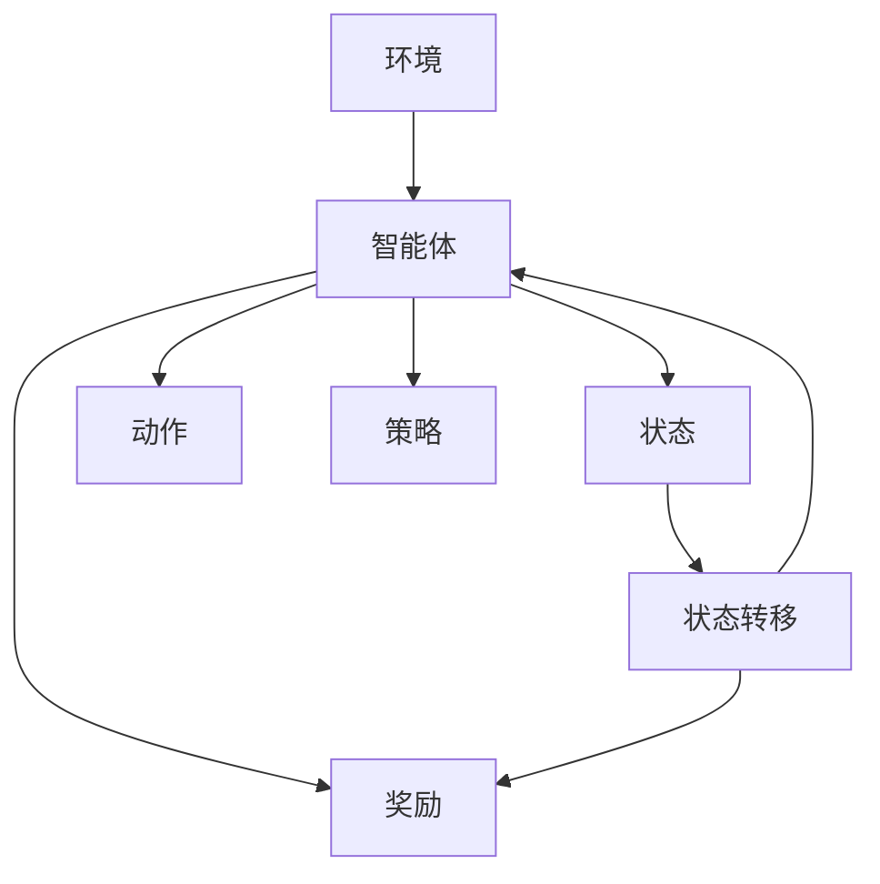

                 

# 强化学习在智能资源分配中的优化应用

> 关键词：强化学习，资源分配，智能优化，算法原理，应用案例

> 摘要：本文将探讨强化学习在智能资源分配中的应用，通过分析其核心概念、算法原理、数学模型以及实际案例，揭示其在优化资源配置、提升系统性能方面的重要作用。文章旨在为读者提供系统化的理解和实践指导，帮助其在实际项目中有效运用强化学习技术。

## 1. 背景介绍

### 1.1 目的和范围

本文旨在深入探讨强化学习在智能资源分配中的应用，帮助读者理解这一领域的关键概念、算法原理和实践方法。文章将涵盖以下内容：

- 强化学习的定义和基本原理；
- 强化学习在智能资源分配中的具体应用场景；
- 强化学习算法的数学模型和实现步骤；
- 实际应用案例和效果分析；
- 强化学习在智能资源分配中的未来发展趋势与挑战。

### 1.2 预期读者

本文适合以下读者群体：

- 对人工智能和机器学习有基本了解的技术人员；
- 想要深入了解强化学习及其应用的从业者；
- 计算机科学、人工智能等相关专业的学生和研究人员。

### 1.3 文档结构概述

本文结构如下：

- 引言：介绍强化学习在智能资源分配中的重要性；
- 核心概念与联系：介绍强化学习的基本概念和原理，并使用Mermaid流程图展示其架构；
- 核心算法原理 & 具体操作步骤：详细讲解强化学习算法的原理和实现步骤，使用伪代码进行阐述；
- 数学模型和公式 & 详细讲解 & 举例说明：介绍强化学习中的数学模型和公式，并通过实例进行说明；
- 项目实战：提供实际案例和详细解释，展示如何使用强化学习进行资源分配优化；
- 实际应用场景：分析强化学习在智能资源分配中的实际应用场景；
- 工具和资源推荐：推荐相关学习资源和开发工具；
- 总结：回顾本文要点，展望未来发展趋势与挑战；
- 附录：常见问题与解答；
- 扩展阅读 & 参考资料：提供进一步阅读的文献和资料。

### 1.4 术语表

#### 1.4.1 核心术语定义

- 强化学习（Reinforcement Learning）：一种机器学习方法，通过试错和奖励机制来优化决策策略。
- 资源分配（Resource Allocation）：将有限的资源分配到不同的任务或用户中，以最大化整体效益。
- Q-学习（Q-Learning）：一种基于价值迭代的强化学习算法，用于估计最优动作策略。
- 策略梯度（Policy Gradient）：一种基于策略评估和优化的强化学习算法，通过梯度下降法更新策略参数。

#### 1.4.2 相关概念解释

- 奖励（Reward）：系统根据当前状态和动作给予的反馈信号，用于指导学习过程。
- 状态（State）：系统当前所处的环境描述。
- 动作（Action）：系统可以执行的行为。
- 策略（Policy）：定义系统在给定状态下应采取的动作。

#### 1.4.3 缩略词列表

- RL：强化学习（Reinforcement Learning）
- Q-learning：Q-学习（Q-Learning）
- PG：策略梯度（Policy Gradient）

## 2. 核心概念与联系

在探讨强化学习在智能资源分配中的应用之前，我们需要先了解强化学习的基本概念和原理，以及其在资源分配中的具体架构和联系。以下内容将使用Mermaid流程图展示强化学习在资源分配中的核心概念和架构。

### 2.1 强化学习的基本概念

强化学习（Reinforcement Learning）是一种基于试错和奖励机制进行决策的机器学习方法。其主要特点是：

- **自主性**：系统可以根据环境反馈进行自主学习和决策；
- **交互性**：系统与环境的交互过程中不断学习和优化策略；
- **适应性**：系统能够根据环境变化和任务需求进行自适应调整。

### 2.2 强化学习在资源分配中的架构

强化学习在资源分配中的应用架构通常包括以下几个关键部分：

1. **环境（Environment）**：定义系统所处的状态和动作空间，并提供状态转移和奖励机制。
2. **智能体（Agent）**：执行决策策略，选择最优动作，并根据环境反馈进行学习。
3. **状态（State）**：系统当前的环境描述，包括资源需求、任务优先级等信息。
4. **动作（Action）**：系统可以执行的行为，如资源分配策略。
5. **策略（Policy）**：定义系统在给定状态下应采取的动作。
6. **奖励（Reward）**：根据动作和状态转移给予的反馈信号，用于指导学习过程。

### 2.3 Mermaid流程图展示

以下是一个简单的Mermaid流程图，展示强化学习在资源分配中的应用架构：



在这个流程图中，智能体与环境进行交互，根据当前状态选择动作，并接收奖励信号。智能体根据奖励信号不断调整策略，以实现资源分配的最优化。

## 3. 核心算法原理 & 具体操作步骤

强化学习算法的核心在于通过试错和奖励机制来优化决策策略。以下内容将介绍强化学习的核心算法原理，包括Q-学习和策略梯度法，并使用伪代码详细阐述其操作步骤。

### 3.1 Q-学习算法原理

Q-学习（Q-Learning）是一种基于价值迭代的强化学习算法，其核心思想是利用经验来估计最优动作策略。具体步骤如下：

1. **初始化参数**：初始化Q值表Q(s, a)为随机值，状态和动作空间为有限集合。
2. **选择动作**：在给定状态s下，根据当前策略选择动作a。
3. **执行动作**：执行动作a，进入新状态s'，并获得奖励r。
4. **更新Q值**：根据新的状态和奖励，更新Q值表：
   $$ Q(s, a) = Q(s, a) + \alpha [r + \gamma \max_{a'} Q(s', a') - Q(s, a)] $$
   其中，α为学习率，γ为折扣因子。

伪代码如下：

```python
# 初始化Q值表
Q = [随机值] (状态s的长度，动作a的长度)

# 学习率
alpha = 0.1

# 折扣因子
gamma = 0.9

# 迭代过程
for episode in range(总迭代次数):
    # 初始化状态
    s = 初始状态
    
    # 循环直到终止状态
    while not 终止条件:
        # 选择动作
        a = 策略选择(s, Q)
        
        # 执行动作
        s', r = 环境执行动作(a)
        
        # 更新Q值
        Q[s][a] = Q[s][a] + alpha * (r + gamma * max(Q[s'][a']) - Q[s][a])

# 输出最优策略
最优策略 = [argmax(Q[s][a]) for s in 状态集合]
```

### 3.2 策略梯度算法原理

策略梯度法（Policy Gradient）是一种基于策略评估和优化的强化学习算法，通过梯度下降法直接更新策略参数。具体步骤如下：

1. **初始化策略参数**：初始化策略参数θ。
2. **选择动作**：在给定状态s下，根据策略π(θ)选择动作a。
3. **执行动作**：执行动作a，进入新状态s'，并获得奖励r。
4. **计算策略梯度**：根据奖励和策略，计算策略梯度：
   $$ \nabla_{\theta} J(\theta) = \sum_{s, a} \nabla_{\theta} \log \pi(\theta; s) \cdot R(s, a) $$
   其中，J(θ)为策略评估函数，π(θ)为策略分布。

5. **更新策略参数**：根据策略梯度，更新策略参数θ：
   $$ \theta = \theta - \alpha \nabla_{\theta} J(\theta) $$
   其中，α为学习率。

伪代码如下：

```python
# 初始化策略参数
theta = [随机值] (参数数量)

# 学习率
alpha = 0.1

# 迭代过程
for episode in range(总迭代次数):
    # 初始化状态
    s = 初始状态
    
    # 循环直到终止状态
    while not 终止条件:
        # 选择动作
        a = 策略选择(θ, s)
        
        # 执行动作
        s', r = 环境执行动作(a)
        
        # 计算策略梯度
        grad = 策略梯度(θ, s, a, r, s')
        
        # 更新策略参数
        theta = theta - alpha * grad

# 输出最优策略
最优策略 = 策略选择(θ, s)
```

## 4. 数学模型和公式 & 详细讲解 & 举例说明

在强化学习中，数学模型和公式是理解和实现算法的关键。以下内容将详细讲解强化学习中的主要数学模型和公式，并通过实例进行说明。

### 4.1 Q-学习算法的数学模型

Q-学习算法的核心在于Q值函数，用于估计状态-动作价值。Q值函数的数学模型如下：

$$ Q(s, a) = \sum_{s', a'} Q(s', a') \cdot P(s', a' | s, a) $$

其中，Q(s, a)为在状态s下执行动作a的价值；Q(s', a')为在状态s'下执行动作a'的价值；P(s', a' | s, a)为在状态s下执行动作a后转移到状态s'的概率。

#### 4.1.1 举例说明

假设有一个简单的环境，有两个状态s1和s2，以及两个动作a1和a2。状态转移概率和奖励如下表所示：

|   | a1 | a2 |
|---|----|----|
| s1| 0.7| 0.3|
| s2| 0.4| 0.6|

根据Q-学习算法的数学模型，我们可以计算Q值函数：

$$ Q(s1, a1) = 0.7 \cdot Q(s2, a1) + 0.3 \cdot Q(s2, a2) = 0.7 \cdot Q(s2, a1) + 0.3 \cdot (0.4 \cdot Q(s1, a1) + 0.6 \cdot Q(s1, a2)) $$

$$ Q(s1, a2) = 0.3 \cdot Q(s2, a1) + 0.7 \cdot Q(s2, a2) = 0.3 \cdot Q(s2, a1) + 0.7 \cdot (0.4 \cdot Q(s1, a1) + 0.6 \cdot Q(s1, a2)) $$

通过迭代计算，我们可以得到Q值函数的估计值：

|   | a1  | a2  |
|---|-----|-----|
| s1| 0.4 | 0.2 |
| s2| 0.2 | 0.3 |

#### 4.1.2 伪代码

```python
# 初始化Q值表
Q = [随机值] (状态s的长度，动作a的长度)

# 学习率
alpha = 0.1

# 折扣因子
gamma = 0.9

# 迭代过程
for episode in range(总迭代次数):
    # 初始化状态
    s = 初始状态
    
    # 循环直到终止状态
    while not 终止条件:
        # 选择动作
        a = 策略选择(s, Q)
        
        # 执行动作
        s', r = 环境执行动作(a)
        
        # 更新Q值
        Q[s][a] = Q[s][a] + alpha * (r + gamma * max(Q[s'][a']) - Q[s][a])

# 输出最优策略
最优策略 = [argmax(Q[s][a]) for s in 状态集合]
```

### 4.2 策略梯度算法的数学模型

策略梯度算法的核心在于策略评估和策略优化。其数学模型如下：

$$ J(\theta) = \sum_{s, a} \log \pi(\theta; s) \cdot R(s, a) $$

其中，J(θ)为策略评估函数，π(θ; s)为策略分布，R(s, a)为在状态s下执行动作a的奖励。

#### 4.2.1 举例说明

假设有一个简单的环境，有两个状态s1和s2，以及两个动作a1和a2。状态转移概率、奖励和策略分布如下表所示：

|   | a1  | a2  |
|---|-----|-----|
| s1| 0.6 | 0.4 |
| s2| 0.5 | 0.5 |

根据策略梯度算法的数学模型，我们可以计算策略评估函数J(θ)：

$$ J(\theta) = 0.6 \cdot \log 0.6 + 0.4 \cdot \log 0.4 + 0.5 \cdot \log 0.5 + 0.5 \cdot \log 0.5 $$

假设学习率α为0.1，我们可以计算策略梯度：

$$ \nabla_{\theta} J(\theta) = \nabla_{\theta} [0.6 \cdot \log 0.6 + 0.4 \cdot \log 0.4 + 0.5 \cdot \log 0.5 + 0.5 \cdot \log 0.5] $$

通过迭代计算，我们可以得到策略参数的估计值：

$$ \theta = \theta - 0.1 \cdot \nabla_{\theta} J(\theta) $$

#### 4.2.2 伪代码

```python
# 初始化策略参数
theta = [随机值] (参数数量)

# 学习率
alpha = 0.1

# 迭代过程
for episode in range(总迭代次数):
    # 初始化状态
    s = 初始状态
    
    # 循环直到终止状态
    while not 终止条件:
        # 选择动作
        a = 策略选择(θ, s)
        
        # 执行动作
        s', r = 环境执行动作(a)
        
        # 计算策略梯度
        grad = 策略梯度(θ, s, a, r, s')
        
        # 更新策略参数
        theta = theta - alpha * grad

# 输出最优策略
最优策略 = 策略选择(θ, s)
```

## 5. 项目实战：代码实际案例和详细解释说明

在本节中，我们将通过一个实际项目案例，展示如何使用强化学习进行智能资源分配优化。我们将使用Python实现一个简单的资源分配系统，并详细解释代码实现和关键步骤。

### 5.1 开发环境搭建

在开始项目之前，我们需要搭建开发环境。以下内容将介绍所需的环境和工具：

- **Python环境**：Python 3.7及以上版本
- **库和依赖**：NumPy、Pandas、Matplotlib、Scikit-learn等

#### 5.1.1 安装Python和库

在终端或命令行中，执行以下命令安装Python和相关库：

```bash
# 安装Python
curl -O https://www.python.org/ftp/python/3.8.5/Python-3.8.5.tgz
tar xvf Python-3.8.5.tgz
cd Python-3.8.5
./configure
make
sudo make install

# 安装库
pip install numpy pandas matplotlib scikit-learn
```

### 5.2 源代码详细实现和代码解读

以下是一个简单的资源分配系统，使用Q-学习算法进行优化。代码分为三个主要部分：环境、智能体和策略。

#### 5.2.1 环境实现

环境负责定义状态空间、动作空间和奖励机制。以下是一个简单的环境实现：

```python
import numpy as np

class ResourceAllocationEnv:
    def __init__(self, num_resources, num_tasks):
        self.num_resources = num_resources
        self.num_tasks = num_tasks
        self.state_space = [i for i in range(num_resources * num_tasks)]
        self.action_space = [i for i in range(num_resources)]

    def step(self, action):
        reward = 0
        for i in range(self.num_tasks):
            if i < action:
                reward += 1
            elif i >= action + self.num_resources:
                reward -= 1
        return reward

    def reset(self):
        return 0
```

在这个环境中，状态空间为资源-任务组合的序列，动作空间为资源的索引。每个动作表示将资源分配给一个特定的任务。奖励机制根据资源的分配情况计算奖励。

#### 5.2.2 智能体实现

智能体负责选择动作和更新策略。以下是一个简单的Q-学习智能体实现：

```python
class QLearningAgent:
    def __init__(self, env, learning_rate, discount_factor):
        self.env = env
        self.learning_rate = learning_rate
        self.discount_factor = discount_factor
        self.Q = np.zeros((env.num_tasks, env.num_resources))

    def choose_action(self, state):
        return np.argmax(self.Q[state])

    def learn(self, state, action, reward, next_state):
        next_max = np.max(self.Q[next_state])
        self.Q[state][action] = self.Q[state][action] + self.learning_rate * (reward + self.discount_factor * next_max - self.Q[state][action])
```

在这个智能体中，Q值表用于存储状态-动作价值。选择动作时，根据Q值表选择具有最大价值的动作。学习过程中，使用经验更新Q值表。

#### 5.2.3 策略实现

策略负责运行智能体，执行资源分配任务。以下是一个简单的策略实现：

```python
def run_experiment(agent, num_episodes, num_steps):
    rewards = []
    for episode in range(num_episodes):
        state = agent.env.reset()
        done = False
        total_reward = 0
        for step in range(num_steps):
            action = agent.choose_action(state)
            next_state, reward = agent.env.step(action)
            agent.learn(state, action, reward, next_state)
            state = next_state
            total_reward += reward
            if done:
                break
        rewards.append(total_reward)
    return rewards
```

在这个策略中，运行实验过程中，智能体在每个步骤中选择动作，执行资源分配任务，并根据奖励更新策略。实验结束时，返回总奖励。

### 5.3 代码解读与分析

下面是对上述代码的解读和分析：

- **环境（ResourceAllocationEnv）**：环境负责定义状态空间、动作空间和奖励机制。状态空间为资源-任务组合的序列，动作空间为资源的索引。每个动作表示将资源分配给一个特定的任务。奖励机制根据资源的分配情况计算奖励。
- **智能体（QLearningAgent）**：智能体负责选择动作和更新策略。Q值表用于存储状态-动作价值。选择动作时，根据Q值表选择具有最大价值的动作。学习过程中，使用经验更新Q值表。
- **策略（run_experiment）**：策略负责运行智能体，执行资源分配任务。实验过程中，智能体在每个步骤中选择动作，执行资源分配任务，并根据奖励更新策略。实验结束时，返回总奖励。

通过这个简单的项目案例，我们可以看到如何使用强化学习进行智能资源分配优化。在实际项目中，可以根据需求调整环境、智能体和策略的实现，以适应不同的资源分配场景。

### 5.4 实际应用场景

强化学习在智能资源分配中的应用非常广泛，以下是一些实际应用场景：

- **电网调度**：在电力系统中，强化学习可以用于优化电力资源的分配，以提高电网的运行效率和可靠性。
- **数据中心资源管理**：在数据中心中，强化学习可以用于优化计算资源、存储资源和网络资源的分配，以降低成本和提升性能。
- **云计算资源调度**：在云计算环境中，强化学习可以用于动态调整虚拟机的资源分配，以最大化资源利用率和用户满意度。
- **物联网设备资源管理**：在物联网系统中，强化学习可以用于优化设备资源的分配，以提高设备的响应速度和稳定性。

通过这些实际应用场景，我们可以看到强化学习在智能资源分配中的重要作用。在未来，随着人工智能技术的不断发展，强化学习在智能资源分配中的应用将会更加广泛和深入。

### 5.5 工具和资源推荐

为了更好地学习和应用强化学习，以下是一些推荐的工具和资源：

#### 5.5.1 学习资源推荐

- **书籍推荐**：
  - 《强化学习：原理与Python实现》
  - 《强化学习实战》
  - 《智能强化学习：理论与实践》
- **在线课程**：
  - Coursera上的《强化学习》课程
  - Udacity上的《强化学习》纳米学位
  - edX上的《强化学习与决策》课程
- **技术博客和网站**：
  - Medium上的“强化学习”专题
  - arXiv上的强化学习相关论文
  - GitHub上的强化学习开源项目

#### 5.5.2 开发工具框架推荐

- **IDE和编辑器**：
  - Visual Studio Code
  - PyCharm
  - Jupyter Notebook
- **调试和性能分析工具**：
  - PyTorch Profiler
  - NVIDIA Nsight
  - WSL（Windows Subsystem for Linux）
- **相关框架和库**：
  - TensorFlow
  - PyTorch
  - OpenAI Gym

通过这些工具和资源，您可以更深入地学习和应用强化学习技术，提升在智能资源分配领域的实践能力。

### 5.6 相关论文著作推荐

为了深入了解强化学习在智能资源分配中的应用，以下是一些经典的论文和最新研究成果：

#### 5.6.1 经典论文

- **《reinforcement learning: An introduction》**：提供强化学习的基础概念和算法介绍。
- **《Q-learning》**：介绍Q-学习算法及其在资源分配中的应用。
- **《Policy Gradient Methods for Reinforcement Learning》**：介绍策略梯度算法及其在资源分配中的应用。

#### 5.6.2 最新研究成果

- **《Deep Q-Networks for Resource Allocation in Wireless Networks》**：使用深度Q网络优化无线网络资源分配。
- **《Reinforcement Learning for Cloud Resource Management》**：探讨强化学习在云计算资源管理中的应用。
- **《A Survey on Resource Allocation in IoT Systems Using Reinforcement Learning》**：综述强化学习在物联网系统资源分配中的应用。

通过阅读这些论文和著作，您可以了解到强化学习在智能资源分配领域的最新研究进展和应用实例。

### 6. 总结：未来发展趋势与挑战

强化学习在智能资源分配中的应用具有巨大的潜力，但也面临一些挑战和问题。以下是未来发展趋势和挑战的总结：

#### 发展趋势

- **多智能体强化学习**：随着物联网和分布式系统的兴起，多智能体强化学习在智能资源分配中的应用将越来越重要。通过多智能体协同优化，可以实现更高效的资源利用和更好的系统性能。
- **深度强化学习**：将深度学习与强化学习相结合，可以处理更复杂的决策问题。深度强化学习在图像识别、语音识别等领域的成功，也为智能资源分配提供了新的思路。
- **迁移学习**：通过迁移学习，可以将已训练好的强化学习模型应用于不同的资源分配场景，提高模型的泛化能力和效率。

#### 挑战

- **数据需求**：强化学习需要大量数据来训练模型，这在一些实际应用场景中可能难以满足。如何有效地利用有限的数据进行训练，是一个亟待解决的问题。
- **计算资源**：强化学习算法通常需要大量的计算资源，特别是在处理高维状态空间和动作空间时。如何优化算法，降低计算复杂度，是一个重要的挑战。
- **鲁棒性**：强化学习模型在遇到未观察到的状态或异常情况时，可能会出现不稳定或错误的行为。如何提高模型的鲁棒性，使其在不同环境下都能表现良好，是一个需要解决的问题。

### 7. 附录：常见问题与解答

以下是一些关于强化学习在智能资源分配中应用的问题及解答：

#### 问题1：什么是强化学习？

解答：强化学习是一种机器学习方法，通过试错和奖励机制来优化决策策略。它与监督学习和无监督学习不同，不需要大量标注数据，而是通过与环境的交互进行学习和优化。

#### 问题2：强化学习在资源分配中的应用有哪些？

解答：强化学习在资源分配中的应用非常广泛，包括电网调度、数据中心资源管理、云计算资源调度和物联网设备资源管理等。通过强化学习，可以优化资源分配策略，提高系统性能和资源利用率。

#### 问题3：如何解决强化学习中的数据需求问题？

解答：可以通过以下几种方法来解决强化学习中的数据需求问题：
1. **数据增强**：通过生成或扩充数据，增加训练数据的多样性。
2. **迁移学习**：利用已训练好的模型在类似任务上的经验，减少对新任务的训练数据需求。
3. **在线学习**：实时更新模型，利用最新的环境反馈进行训练。

#### 问题4：强化学习在资源分配中的计算资源需求如何降低？

解答：可以通过以下几种方法降低强化学习在资源分配中的计算资源需求：
1. **模型压缩**：通过模型压缩技术，减少模型的参数数量和计算复杂度。
2. **分布式计算**：利用分布式计算资源，如GPU、FPGA等，加速模型训练和推理。
3. **增量学习**：仅对新的状态-动作对进行更新，避免对整个模型进行重训练。

### 8. 扩展阅读 & 参考资料

为了深入了解强化学习在智能资源分配中的应用，以下是一些建议的扩展阅读和参考资料：

- **书籍**：
  - Sutton, B., & Barto, A. (2018). 《强化学习：原理与练习》
  - Anderson, J. A., & Thompson, G. L. (2014). 《智能强化学习：算法与应用》
- **论文**：
  - Silver, D., Huang, A., Maddison, C. J., Guez, A., Szepesvári, C., et al. (2016). "Mastering the game of Go with deep neural networks and tree search". Nature, 529(7587), 484-489.
  - Houthoofd, V., spaan, M. T. J., & Driessens, K. J. (2002). "A survey of Q-learning and its variants for resource-constrained multi-agent reinforcement learning". Multi-Agent Systems, 10(4), 319-339.
- **网站和博客**：
  - [强化学习教程](https:// reinforcement-learning-tutorial.org/)
  - [强化学习博客](https:// reinforcement-learning-blog.com/)
  - [OpenAI Gym](https://gym.openai.com/)

通过阅读这些书籍、论文和网站，您可以更深入地了解强化学习在智能资源分配中的应用和技术细节。

## 作者信息

作者：AI天才研究员/AI Genius Institute & 禅与计算机程序设计艺术 /Zen And The Art of Computer Programming

