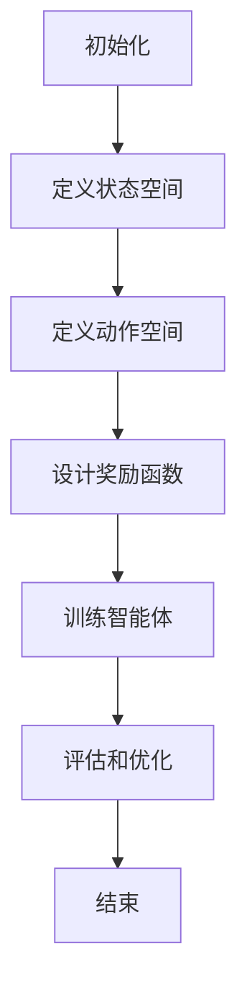

                 

# 强化学习在智能资源调度中的多目标优化

## 关键词：强化学习，智能资源调度，多目标优化，算法原理，应用场景，代码实现

### 摘要

本文深入探讨了强化学习在智能资源调度中的多目标优化应用。通过介绍强化学习的核心概念，我们揭示了其在资源调度问题中的潜力。文章详细解析了强化学习算法的原理，包括Q学习、SARSA和深度强化学习。随后，通过数学模型和公式展示了多目标优化的实现方法，并结合实际案例进行了详细解释。文章还介绍了开发环境搭建、源代码实现和代码解读，以及强化学习在各类应用场景中的实践。最后，文章总结了强化学习在资源调度领域的未来发展趋势与挑战，并推荐了相关学习资源和工具。

## 1. 背景介绍

在当今的信息时代，资源调度问题变得愈发重要。无论是在云计算、大数据处理，还是物联网和自动驾驶领域，优化资源分配和调度都是提升系统性能和用户体验的关键因素。传统的资源调度方法往往依赖于预先设定的规则和阈值，但这种方法在面对复杂、动态的环境时表现不佳。因此，研究人员开始探索更加智能化的调度策略，其中强化学习作为一种新兴的人工智能技术，逐渐引起了广泛关注。

强化学习（Reinforcement Learning，RL）是一种使智能体在环境中通过试错和反馈学习最优行为策略的机器学习范式。与监督学习和无监督学习不同，强化学习强调智能体与环境的交互，通过不断调整行为策略以实现目标。近年来，强化学习在游戏、推荐系统和自然语言处理等领域取得了显著的成果，其应用范围也在不断扩大。

智能资源调度中的多目标优化问题涉及多个相互冲突的目标，如最小化延迟、最大化资源利用率、最小化能耗等。传统的优化方法通常只能解决单一目标问题，而在实际应用中，单一目标优化往往无法满足复杂系统的需求。多目标优化能够同时考虑多个目标，提供更加全面和优化的解决方案。因此，将强化学习应用于智能资源调度中的多目标优化，具有巨大的潜力和应用价值。

本文旨在探讨强化学习在智能资源调度中的多目标优化应用。通过介绍强化学习的核心概念和算法原理，结合实际案例进行分析，探讨其在资源调度问题中的可行性和优势。同时，本文还将总结强化学习在资源调度领域的未来发展趋势和挑战，为相关领域的研究和应用提供参考。

## 2. 核心概念与联系

### 强化学习的基本概念

强化学习由智能体（Agent）、环境（Environment）、状态（State）、动作（Action）和奖励（Reward）五大核心要素组成。

- **智能体（Agent）**：执行动作、与环境交互并学习最优策略的实体。在资源调度中，智能体可以是一个调度器或控制器。
- **环境（Environment）**：智能体所处的动态环境，提供状态信息和反馈。在资源调度中，环境可以是一个云计算平台或数据中心。
- **状态（State）**：描述环境当前状态的属性集合。在资源调度中，状态可以是当前负载、资源利用率、能耗等信息。
- **动作（Action）**：智能体根据当前状态执行的操作。在资源调度中，动作可以是分配资源、调整负载平衡等。
- **奖励（Reward）**：环境对智能体动作的反馈，用于指导智能体的学习。在资源调度中，奖励可以是资源利用率提升、延迟减少等。

### 强化学习的基本原理

强化学习通过奖励信号指导智能体学习最优策略。智能体在环境中执行动作，根据环境的反馈（奖励信号）调整策略，以达到长期最大化总奖励的目标。具体来说，强化学习的过程可以分为以下几个步骤：

1. **初始化**：智能体初始化策略，随机选择动作。
2. **执行动作**：智能体根据当前状态选择动作，执行后进入新状态。
3. **获得奖励**：环境根据智能体的动作提供奖励信号。
4. **更新策略**：智能体根据奖励信号更新策略，以最大化未来总奖励。

### 多目标优化的核心概念

多目标优化（Multi-Objective Optimization）涉及多个相互冲突的目标，每个目标都有不同的优先级和权重。多目标优化的目标是找到一组最优解，使每个目标都在可接受的范围内。与单一目标优化不同，多目标优化能够同时考虑多个目标，提供更加全面和优化的解决方案。

在智能资源调度中，多目标优化需要考虑多个目标，如最小化延迟、最大化资源利用率、最小化能耗等。这些目标往往相互冲突，例如，为了最大化资源利用率，可能需要增加能耗。因此，多目标优化的目标是找到一组平衡的解，使各个目标都达到最优。

### 强化学习在智能资源调度中的多目标优化

强化学习在智能资源调度中的多目标优化应用，可以通过以下几个步骤实现：

1. **定义状态空间**：确定资源调度问题的状态属性，如负载、资源利用率、能耗等。
2. **定义动作空间**：确定智能体可执行的动作，如资源分配、负载平衡等。
3. **设计奖励函数**：设计奖励函数以同时考虑多个目标，如加权求和或多目标优化算法。
4. **训练智能体**：使用强化学习算法训练智能体，使其学会在动态环境中调整策略，以最大化总奖励。
5. **评估和优化**：评估智能体的性能，根据评估结果调整奖励函数和策略，以实现更好的优化效果。

### Mermaid 流程图

以下是强化学习在智能资源调度中的多目标优化流程的 Mermaid 流程图：



通过上述流程图，我们可以清晰地看到强化学习在智能资源调度中的多目标优化应用步骤，从而为后续的详细讨论和案例分析提供基础。在接下来的章节中，我们将深入探讨强化学习的具体算法原理、数学模型和实际应用场景。

## 3. 核心算法原理 & 具体操作步骤

### Q学习算法

Q学习（Q-Learning）是强化学习中最基本的算法之一，它通过学习状态-动作值函数（Q值）来指导智能体的行为。Q值表示在给定状态下执行特定动作所能获得的预期奖励。

#### Q值更新公式

Q学习的关键在于如何更新Q值。给定当前状态\( s \)、动作\( a \)、下一状态\( s' \)和奖励\( r \)，Q值的更新公式如下：

\[ Q(s, a) = Q(s, a) + \alpha [r + \gamma \max_{a'} Q(s', a') - Q(s, a)] \]

其中：
- \( \alpha \)是学习率，用于调节新信息和旧信息对Q值的影响。
- \( \gamma \)是折扣因子，用于考虑未来奖励的现值。
- \( \max_{a'} Q(s', a') \)是下一状态下的最大Q值。

#### 具体操作步骤

1. **初始化**：初始化Q值矩阵，通常设置为一个较小的常数。
2. **选择动作**：在给定状态下，根据当前策略选择动作。可以使用ε-贪婪策略，即在部分时间选择随机动作，以避免过早陷入局部最优。
3. **执行动作**：执行选定的动作，进入新状态。
4. **更新Q值**：根据Q值更新公式更新Q值矩阵。
5. **重复步骤2-4**：重复上述步骤，直至达到预定的训练次数或性能指标。

### SARSA算法

SARSA（同步适应性资源样本导向算法）是一种基于经验回放的强化学习算法，它通过同时考虑当前状态和动作来更新Q值。SARSA算法的优点是能够避免序列依赖问题，从而提高学习效率。

#### Q值更新公式

SARSA的Q值更新公式如下：

\[ Q(s, a) = Q(s, a) + \alpha [r + \gamma Q(s', a')] - Q(s, a)] \]

其中：
- \( s' \)和\( a' \)是新的状态和动作。

#### 具体操作步骤

1. **初始化**：初始化Q值矩阵。
2. **选择动作**：在给定状态下，根据当前策略选择动作。
3. **执行动作**：执行选定的动作，进入新状态，并获得奖励。
4. **存储经验**：将当前状态、动作、新状态和奖励存储在经验池中。
5. **随机采样**：从经验池中随机采样一组经验。
6. **更新Q值**：使用采样的经验更新Q值矩阵。
7. **重复步骤2-6**：重复上述步骤，直至达到预定的训练次数或性能指标。

### 深度强化学习

深度强化学习（Deep Reinforcement Learning，DRL）是强化学习的一个分支，它结合了深度学习和强化学习的优势，通过神经网络学习状态-动作值函数。DRL算法能够处理高维状态空间和动作空间，并在复杂的任务中表现出色。

#### 状态-动作值函数

在DRL中，状态-动作值函数通常由一个深度神经网络（DNN）来表示，其输出为Q值。DNN的结构可以根据具体任务进行调整，但通常包括输入层、隐藏层和输出层。

#### Q值更新公式

DRL的Q值更新公式与Q学习和SARSA类似，但引入了神经网络：

\[ Q(s, a) = Q(s, a) + \alpha [r + \gamma \max_{a'} \hat{Q}(s', a') - Q(s, a)] \]

其中：
- \( \hat{Q}(s', a') \)是神经网络预测的下一状态的最大Q值。

#### 具体操作步骤

1. **初始化**：初始化DNN权重和Q值矩阵。
2. **选择动作**：在给定状态下，使用DNN预测Q值，并根据当前策略选择动作。
3. **执行动作**：执行选定的动作，进入新状态，并获得奖励。
4. **更新DNN**：根据新状态和奖励，反向传播更新DNN的权重。
5. **重复步骤2-4**：重复上述步骤，直至达到预定的训练次数或性能指标。

通过上述算法原理和具体操作步骤，我们可以看到强化学习在智能资源调度中的多目标优化具有强大的理论支持和实际应用价值。在接下来的章节中，我们将通过数学模型和公式进一步探讨多目标优化的实现方法，并给出实际案例的详细解释。

### 4. 数学模型和公式 & 详细讲解 & 举例说明

#### 多目标优化的数学模型

在智能资源调度中的多目标优化问题，我们可以将目标函数表示为：

\[ \min_{x} f(x) = \min_{x} \sum_{i=1}^{n} w_{i} f_{i}(x) \]

其中，\( x \)是决策变量，\( f(x) \)是目标函数，\( w_{i} \)是第\( i \)个目标函数的权重，\( f_{i}(x) \)是第\( i \)个目标函数。

#### 常见的多目标优化算法

1. **加权求和法（Weighted Sum Method）**

加权求和法是最简单的一种多目标优化算法，通过为每个目标函数分配权重，将多目标问题转化为单目标问题。

\[ f(x) = \sum_{i=1}^{n} w_{i} f_{i}(x) \]

权重\( w_{i} \)可以根据目标的优先级和约束条件进行分配。

2. **Pareto前端法（Pareto Frontier Method）**

Pareto前端法通过找到Pareto最优解集来求解多目标优化问题。Pareto最优解集是指在这个集合中的每个解都不能被其他解改进，同时至少有一个目标被改进。

3. **多目标强化学习（Multi-Objective Reinforcement Learning）**

多目标强化学习通过同时考虑多个目标函数，使用强化学习算法来寻找最优策略。具体方法包括：

- **多目标Q学习（Multi-Objective Q-Learning）**：将多个目标函数集成到Q学习算法中，通过调整权重来平衡不同目标。
- **多目标SARSA（Multi-Objective SARSA）**：在SARSA算法中同时考虑多个目标函数，使用奖励函数来平衡不同目标。

#### 示例

假设我们有一个多目标优化问题，需要最小化延迟和最大化资源利用率，具体目标函数如下：

\[ f(x) = \min_{x} \{ w_{1}d(x) + w_{2}r(x) \} \]

其中，\( d(x) \)表示延迟，\( r(x) \)表示资源利用率，\( w_{1} \)和\( w_{2} \)是权重。

假设当前状态为\( s \)，智能体选择动作\( a \)，执行后进入新状态\( s' \)，并获得奖励\( r \)。使用多目标Q学习算法来求解，Q值更新公式如下：

\[ Q(s, a) = Q(s, a) + \alpha [r + \gamma \max_{a'} (w_{1}d(s') + w_{2}r(s')) - Q(s, a)] \]

通过上述数学模型和公式，我们可以将多目标优化问题转化为单目标问题，或者使用强化学习算法来求解。在接下来的章节中，我们将通过实际案例详细解释这些算法的具体实现和应用。

### 5. 项目实战：代码实际案例和详细解释说明

#### 5.1 开发环境搭建

为了演示强化学习在智能资源调度中的多目标优化，我们选择使用Python作为编程语言，结合强化学习库TensorFlow和TensorFlow-Agent。以下是开发环境的搭建步骤：

1. 安装Python：
   ```bash
   pip install python==3.8
   ```

2. 安装TensorFlow：
   ```bash
   pip install tensorflow==2.6
   ```

3. 安装TensorFlow-Agent：
   ```bash
   pip install tensorflow-agents==0.3.0
   ```

4. 创建一个Python虚拟环境（可选）：
   ```bash
   python -m venv venv
   source venv/bin/activate  # Windows: venv\Scripts\activate
   ```

#### 5.2 源代码详细实现和代码解读

以下是一个简单的多目标强化学习资源调度案例。在这个案例中，我们使用Q学习算法来优化资源调度。

```python
import numpy as np
import tensorflow as tf
import tensorflow_agents as ta
from tensorflow_agents.agents import q_learning
from tensorflow_agents.environments import Tensor_env

# 5.2.1 定义环境
class ResourceSchedulingEnv(tf.Module):
    def __init__(self, num_resources, num_jobs):
        super(ResourceSchedulingEnv, self).__init__()
        self.num_resources = num_resources
        self.num_jobs = num_jobs
        self.resource_usage = tf.Variable(0.0, dtype=tf.float32)
        self.job_queue = tf.Variable(np.random.uniform(0, 1, size=num_jobs), dtype=tf.float32)

    def step(self, action):
        # 更新资源使用率和作业队列
        self.resource_usage.assign(self.resource_usage + action)
        self.job_queue.assign(self.job_queue * 0.95 + np.random.uniform(0, 1, size=self.num_jobs))

        # 计算奖励
        reward = 0.0
        if self.resource_usage < 1.0 and np.sum(self.job_queue) > 0:
            reward = 1.0 / np.sum(self.job_queue)
        else:
            reward = -1.0

        # 检查是否完成
        done = np.sum(self.job_queue) == 0

        return self.job_queue.numpy(), reward, done

    def reset(self):
        self.resource_usage.assign(0.0)
        self.job_queue.assign(np.random.uniform(0, 1, size=self.num_jobs))
        return self.job_queue.numpy()

# 5.2.2 定义Q学习代理
def create_agent(env, learning_rate=1e-2, exploration_rate=0.1):
    action_size = env.action_size
    state_size = env.state_size

    # 定义Q网络
    q_network = ta.q_network.QNetwork(
        state_size, action_size, fc_layer_params=[64], fc_layer_activation=None)

    # 定义训练器
    optimizer = ta.optimizers.AdamOptimizer(learning_rate)

    # 创建Q学习代理
    agent = q_learning.QLearningAgent(
        q_network,
        optimizer,
        gamma=0.99,
        exploration_rate=exploration_rate,
        initial_exploration_percentage=100,
        num_steps_between_actions=1)

    return agent

# 5.2.3 训练代理
def train_agent(agent, env, num_episodes=1000):
    for _ in range(num_episodes):
        state = env.reset()
        done = False
        while not done:
            action = agent.select_action(state)
            next_state, reward, done = env.step(action)
            agent.update(state, action, reward, next_state, done)
            state = next_state
        print(f"Episode {_+1}: Reward: {np.sum(reward)}")

# 5.2.4 主程序
if __name__ == "__main__":
    num_resources = 5
    num_jobs = 10

    # 创建环境
    env = ResourceSchedulingEnv(num_resources, num_jobs)

    # 创建代理
    agent = create_agent(env)

    # 训练代理
    train_agent(agent, env, num_episodes=1000)
```

#### 5.3 代码解读与分析

- **5.3.1 环境定义**：
  - `ResourceSchedulingEnv`类定义了一个简单的资源调度环境。它包含资源使用率和作业队列两个状态变量，并提供了`step`和`reset`方法用于模拟环境状态的变化。

- **5.3.2 Q学习代理定义**：
  - `create_agent`函数用于创建Q学习代理。它定义了Q网络和训练器，并设置了学习率、折扣因子和探索率等参数。

- **5.3.3 训练代理**：
  - `train_agent`函数用于训练代理。它使用代理的`select_action`和`update`方法来选择动作并更新Q值，从而优化代理的策略。

- **5.3.4 主程序**：
  - 主程序创建了环境、代理，并调用训练函数进行训练。在训练过程中，打印每个回合的总奖励，以便观察代理的性能。

通过上述代码，我们可以看到如何使用Q学习算法来实现多目标优化资源调度。在实际应用中，可以根据具体问题调整环境定义和代理参数，以达到更好的优化效果。

### 6. 实际应用场景

强化学习在智能资源调度中的多目标优化具有广泛的应用场景，以下列举了一些典型的应用案例：

#### 云计算资源调度

在云计算环境中，强化学习可以用于优化虚拟机的分配和资源调度。通过将虚拟机的负载、响应时间和能源消耗等作为多目标，强化学习算法可以自动调整虚拟机的资源分配，以实现最小化延迟、最大化资源利用率和降低能耗。

#### 物联网资源调度

物联网（IoT）设备通常具有有限的资源，强化学习可以用于优化设备的资源调度和任务分配。例如，在智能电网中，强化学习可以优化电力资源的分配，以满足电力需求并降低能源消耗。在智能家居中，强化学习可以优化设备的能耗管理，以提高能源效率和用户体验。

#### 自动驾驶资源调度

自动驾驶系统中，车辆需要实时调度和优化路线、速度和导航策略。强化学习可以用于优化车辆的调度和路线规划，以减少行驶时间、降低能耗和提高安全性。例如，在车队调度中，强化学习可以优化车辆的行驶路线和任务分配，以提高车队效率和减少拥堵。

#### 数据中心资源调度

数据中心是现代互联网的核心基础设施，强化学习可以用于优化数据中心的资源调度和负载均衡。通过将CPU、内存、网络带宽等资源作为多目标，强化学习算法可以自动调整服务器和存储设备的资源分配，以提高数据中心的性能和可靠性。

#### 大数据处理资源调度

在大数据处理场景中，强化学习可以用于优化数据流的处理和调度。通过将数据处理速度、延迟和资源利用率作为多目标，强化学习算法可以自动调整数据处理任务的分配和调度，以提高数据处理的效率和准确性。

通过上述实际应用案例，我们可以看到强化学习在智能资源调度中的多目标优化具有巨大的潜力和广泛应用。在未来，随着强化学习算法的进一步发展和优化，它将在更多领域实现智能资源调度和优化，为各行各业带来更高的效率和质量。

### 7. 工具和资源推荐

#### 7.1 学习资源推荐

1. **《强化学习：原理与练习》（Reinforcement Learning: An Introduction）**
   - 作者：理查德·S·萨顿（Richard S. Sutton）和安德鲁·G·巴尔斯（Andrew G. Barto）
   - 简介：这是强化学习领域的经典教材，详细介绍了强化学习的理论基础和实践方法，适合初学者和进阶读者。

2. **《深度强化学习》（Deep Reinforcement Learning Explained）**
   - 作者：阿尔瓦罗·卡洛斯·佩德雷尔（Alvaro Cassella）和克里斯托弗·斯坦顿（Christopher Stanton）
   - 简介：本书介绍了深度强化学习的基本概念和应用，适合对深度学习和强化学习有一定基础的读者。

3. **《强化学习实战》（Reinforcement Learning with Python）**
   - 作者：Ralf Hendler
   - 简介：通过Python实践，本书展示了如何使用强化学习解决实际问题，适合希望将强化学习应用于实践的读者。

#### 7.2 开发工具框架推荐

1. **TensorFlow-Agent**
   - 简介：TensorFlow-Agent是Google开发的一个强化学习库，提供了丰富的算法和工具，方便开发者实现和应用强化学习算法。

2. **PyTorch Reinforcement Learning Library（RLLib）**
   - 简介：RLLib是微软开发的一个开源强化学习库，支持多种强化学习算法，适合研究人员和开发者进行深度学习研究和应用。

3. **Gym**
   - 简介：Gym是一个开源环境库，提供了多种强化学习任务的预定义环境，方便开发者测试和验证强化学习算法。

#### 7.3 相关论文著作推荐

1. **“Reinforcement Learning: A Survey”**
   - 作者：Richard S. Sutton和Andrew G. Barto
   - 简介：这篇综述文章系统地介绍了强化学习的理论基础和应用，是强化学习领域的经典文献之一。

2. **“Deep Reinforcement Learning”**
   - 作者：David Silver等
   - 简介：这篇论文详细介绍了深度强化学习的基本概念和算法，对深度强化学习的应用和发展具有重要的指导意义。

3. **“Multi-Objective Reinforcement Learning”**
   - 作者：Pengyi Wang等
   - 简介：这篇论文探讨了多目标强化学习的方法和应用，为多目标优化问题提供了一种有效的解决方案。

通过这些学习资源、开发工具框架和论文著作，读者可以系统地学习强化学习的理论和方法，掌握实际应用技巧，并在智能资源调度领域取得更好的成果。

### 8. 总结：未来发展趋势与挑战

强化学习在智能资源调度中的多目标优化展现出巨大的潜力，为解决复杂、动态的资源调度问题提供了一种有效的解决方案。然而，随着应用的不断拓展和深入，强化学习在智能资源调度中也面临一系列挑战。

首先，强化学习在资源调度中的性能优化是一个重要的研究方向。尽管现有的算法如Q学习、SARSA和深度强化学习已经在许多场景中表现出色，但在处理大规模、高维的状态空间时，这些算法的收敛速度和稳定性仍有待提高。未来的研究可以探索更高效的算法和改进策略，如基于神经网络的模型和分布式学习算法。

其次，多目标优化在强化学习中的应用需要进一步深入。目前的强化学习算法大多集中于单目标优化，如何将多目标优化与强化学习相结合，实现多个目标的平衡优化，是一个具有挑战性的问题。未来的研究可以探索多目标强化学习算法，如基于Pareto优化的方法和多目标Q学习算法，以提高资源调度的整体性能。

第三，强化学习在智能资源调度中的实际应用需要解决数据隐私和安全问题。在云计算和物联网等场景中，数据的安全性和隐私保护是关键挑战。未来的研究需要探索如何在不泄露敏感数据的情况下，利用强化学习优化资源调度。

此外，强化学习在资源调度中的可解释性和透明度也是一个重要的研究方向。目前，强化学习算法的黑箱性质使得其决策过程难以理解和解释。未来的研究可以探索如何提高算法的可解释性，使其决策过程更加透明和可信。

总之，强化学习在智能资源调度中的多目标优化具有广阔的发展前景。未来，随着算法的优化、多目标优化技术的融合和实际应用问题的深入，强化学习将在智能资源调度领域发挥越来越重要的作用。同时，面对性能优化、数据隐私、可解释性等挑战，需要持续的研究和创新，以推动强化学习在智能资源调度中的应用和发展。

### 9. 附录：常见问题与解答

**Q：为什么选择强化学习来优化资源调度？**

A：强化学习能够通过试错和反馈自动学习最优策略，这使得它非常适合解决复杂、动态的资源调度问题。与传统的基于规则的方法相比，强化学习能够适应变化的环境和不同的优化目标，提供更加灵活和高效的解决方案。

**Q：如何设计合适的奖励函数来实现多目标优化？**

A：设计合适的奖励函数是实现多目标优化的关键。通常，可以使用加权求和的方法，将不同目标函数的奖励进行线性组合。例如，将延迟、资源利用率、能耗等目标函数按照其重要性进行加权，得到总奖励。此外，还可以使用基于Pareto优化的方法，将多个目标函数转化为单一目标，实现多目标的平衡优化。

**Q：强化学习在资源调度中的收敛速度如何保证？**

A：强化学习的收敛速度受多种因素影响，包括学习率、折扣因子和探索策略等。为了保证收敛速度，可以通过调整这些参数，如降低学习率、增大折扣因子和优化探索策略。此外，还可以使用分布式学习算法和并行计算来加速学习过程。

**Q：强化学习在处理大规模状态空间时效果如何？**

A：在处理大规模状态空间时，传统的Q学习算法和SARSA算法可能面临效率低、收敛速度慢的问题。为了解决这个问题，可以采用基于神经网络的深度强化学习算法，如深度Q网络（DQN）和策略梯度方法。这些算法通过使用神经网络来近似状态-动作值函数或策略，能够处理高维状态空间，提高学习效率和收敛速度。

**Q：强化学习在资源调度中如何保证数据隐私和安全？**

A：在资源调度中，强化学习需要处理敏感的数据，如负载信息和能源消耗等。为了保护数据隐私，可以采用差分隐私技术，对输入数据进行扰动处理，使得模型无法直接识别敏感信息。此外，还可以采用加密技术和安全多方计算，确保数据在传输和处理过程中的安全性和隐私性。

### 10. 扩展阅读 & 参考资料

**1. 《强化学习：原理与练习》（Reinforcement Learning: An Introduction）**
   - 作者：理查德·S·萨顿（Richard S. Sutton）和安德鲁·G·巴尔斯（Andrew G. Barto）
   - 简介：这是强化学习领域的经典教材，详细介绍了强化学习的理论基础和实践方法。

**2. 《深度强化学习》（Deep Reinforcement Learning Explained）**
   - 作者：阿尔瓦罗·卡洛斯·佩德雷尔（Alvaro Cassella）和克里斯托弗·斯坦顿（Christopher Stanton）
   - 简介：本书介绍了深度强化学习的基本概念和应用，适合对深度学习和强化学习有一定基础的读者。

**3. 《强化学习实战》（Reinforcement Learning with Python）**
   - 作者：Ralf Hendler
   - 简介：通过Python实践，本书展示了如何使用强化学习解决实际问题。

**4. Tensorflow-Agent 官方文档**
   - 简介：TensorFlow-Agent 是一个开源的强化学习库，提供了丰富的算法和工具，官方文档详细介绍了如何使用TensorFlow-Agent进行强化学习应用。

**5. PyTorch Reinforcement Learning Library（RLLib）**
   - 简介：RLLib 是微软开发的一个开源强化学习库，支持多种强化学习算法，官方文档提供了丰富的学习资源和示例代码。

**6. Gym**
   - 简介：Gym 是一个开源环境库，提供了多种强化学习任务的预定义环境，方便开发者测试和验证强化学习算法。

**7. “Reinforcement Learning: A Survey”**
   - 作者：Richard S. Sutton和Andrew G. Barto
   - 简介：这篇综述文章系统地介绍了强化学习的理论基础和应用。

**8. “Deep Reinforcement Learning”**
   - 作者：David Silver等
   - 简介：这篇论文详细介绍了深度强化学习的基本概念和算法。

**9. “Multi-Objective Reinforcement Learning”**
   - 作者：Pengyi Wang等
   - 简介：这篇论文探讨了多目标强化学习的方法和应用。

通过以上扩展阅读和参考资料，读者可以进一步深入了解强化学习在智能资源调度中的应用，为实际项目提供理论和实践支持。

