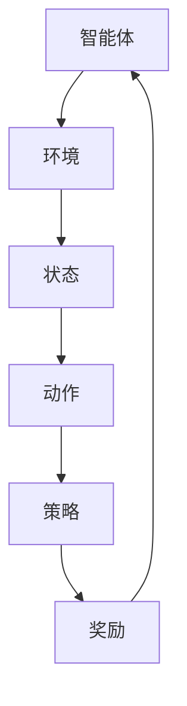

                 

# 强化学习在机器人技能学习中的应用研究

> **关键词：强化学习、机器人、技能学习、深度学习、算法优化**
>
> **摘要：本文深入探讨了强化学习在机器人技能学习中的应用，通过核心概念解析、算法原理讲解、数学模型剖析和项目实战案例，阐述了强化学习在机器人技能训练中的实际效果和未来发展。**

## 1. 背景介绍

### 1.1 目的和范围

本文旨在探讨强化学习（Reinforcement Learning，RL）在机器人技能学习中的应用。强化学习是一种通过试错（trial-and-error）和反馈（feedback）进行学习的方法，其核心在于通过奖励和惩罚来引导智能体（agent）在环境中做出最优决策。机器人技能学习是指通过训练使机器人具备一定的任务执行能力，包括运动控制、路径规划、环境交互等。本文将分析强化学习在机器人技能学习中的优势、挑战及其应用场景。

### 1.2 预期读者

本文适用于对强化学习和机器人技术有一定了解的读者，包括但不限于人工智能研究人员、机器人工程师、计算机科学学生以及相关领域的从业者。

### 1.3 文档结构概述

本文分为十个部分：

1. 背景介绍
2. 核心概念与联系
3. 核心算法原理 & 具体操作步骤
4. 数学模型和公式 & 详细讲解 & 举例说明
5. 项目实战：代码实际案例和详细解释说明
6. 实际应用场景
7. 工具和资源推荐
8. 总结：未来发展趋势与挑战
9. 附录：常见问题与解答
10. 扩展阅读 & 参考资料

### 1.4 术语表

#### 1.4.1 核心术语定义

- **强化学习（Reinforcement Learning）**：一种通过试错和反馈进行学习的方法，智能体通过与环境交互获取奖励或惩罚，以优化其行为策略。
- **智能体（Agent）**：执行特定任务的实体，可以是机器人、软件代理或人类。
- **环境（Environment）**：智能体执行任务的场所，提供状态和动作空间。
- **状态（State）**：描述智能体在某一时刻所处的环境条件。
- **动作（Action）**：智能体可以执行的操作。
- **策略（Policy）**：智能体在某一状态下选择动作的策略。
- **奖励（Reward）**：智能体在执行某动作后获得的积极或消极的反馈。

#### 1.4.2 相关概念解释

- **深度强化学习（Deep Reinforcement Learning）**：将深度学习与强化学习结合，利用深度神经网络（DNN）来表示状态和动作值函数。
- **Q-learning**：一种基于值函数的强化学习算法，通过迭代更新状态-动作值函数来学习最佳策略。
- **策略梯度（Policy Gradient）**：一种基于策略的强化学习算法，通过优化策略参数来学习最佳策略。

#### 1.4.3 缩略词列表

- **RL**：强化学习（Reinforcement Learning）
- **DRL**：深度强化学习（Deep Reinforcement Learning）
- **Q-learning**：Q值学习
- **PG**：策略梯度（Policy Gradient）

## 2. 核心概念与联系

强化学习在机器人技能学习中的应用涉及多个核心概念和联系，以下是一个简要的Mermaid流程图来描述这些概念及其关系：



### 2.1 强化学习的基本原理

强化学习通过智能体与环境的交互来学习最优策略。智能体在每个状态选择动作，并依据环境给予的奖励来调整其策略。强化学习的目标是找到使累积奖励最大的策略。

### 2.2 智能体与环境的交互

智能体通过执行动作来与环境交互。环境根据智能体的动作产生新的状态，并给予相应的奖励。这个过程是一个循环，智能体不断地从环境中获取反馈，并调整其策略。

### 2.3 状态、动作和策略的关系

状态、动作和策略构成了强化学习的核心。智能体在每个状态下选择动作，策略决定了这种选择的方式。最优策略是在给定状态下选择使奖励最大的动作。

### 2.4 奖励机制

奖励机制是强化学习的关键部分，它决定了智能体的学习方向。积极的奖励可以鼓励智能体采取有利于目标达成的动作，而消极的奖励则可以避免智能体执行不利于目标达成的动作。

## 3. 核心算法原理 & 具体操作步骤

强化学习算法主要分为基于值函数的方法和基于策略的方法。以下将分别介绍这两种方法的原理和操作步骤。

### 3.1 基于值函数的方法：Q-learning

Q-learning是一种基于值函数的强化学习算法，其核心思想是学习状态-动作值函数（Q值），并通过迭代更新Q值来逼近最优策略。

#### 3.1.1 Q-learning原理

Q-learning算法通过估计每个状态-动作对的Q值来学习最佳策略。Q值表示在给定状态下执行给定动作的长期奖励期望。

```latex
Q(s, a) = \sum_{s'} P(s' | s, a) \cdot R(s', a) + \gamma \cdot \max_{a'} Q(s', a')
```

其中，\( s \) 是状态，\( a \) 是动作，\( s' \) 是新状态，\( R(s', a) \) 是在状态\( s' \)执行动作\( a \)所获得的奖励，\( \gamma \) 是折扣因子，用于考虑未来奖励的重要性。

#### 3.1.2 Q-learning操作步骤

1. **初始化**：随机选择初始策略，初始化Q值函数。
2. **选择动作**：在给定状态下，根据当前策略选择动作。
3. **执行动作**：执行所选动作，进入新状态，并获取奖励。
4. **更新Q值**：根据新状态和获得的奖励更新Q值。
5. **重复**：回到步骤2，继续迭代。

### 3.2 基于策略的方法：策略梯度（Policy Gradient）

策略梯度方法通过直接优化策略参数来学习最佳策略，其核心思想是最大化策略的期望奖励。

#### 3.2.1 策略梯度原理

策略梯度方法基于策略梯度定理，该定理指出策略参数的更新方向是期望奖励梯度的反方向。

```latex
\Delta \theta = -\alpha \cdot \nabla_{\theta} J(\theta)
```

其中，\( \theta \) 是策略参数，\( J(\theta) \) 是策略的期望回报，\( \alpha \) 是学习率。

#### 3.2.2 策略梯度操作步骤

1. **初始化**：随机选择初始策略参数。
2. **执行动作**：在给定状态下，根据当前策略执行动作。
3. **记录数据**：记录每个动作的回报。
4. **计算期望回报**：计算策略的期望回报。
5. **更新策略参数**：根据策略梯度更新策略参数。
6. **重复**：回到步骤2，继续迭代。

## 4. 数学模型和公式 & 详细讲解 & 举例说明

### 4.1 数学模型

在强化学习中，常用的数学模型包括状态-动作值函数和策略。以下是对这些模型的详细讲解和举例说明。

#### 4.1.1 状态-动作值函数（Q值）

状态-动作值函数（Q值）是强化学习中的核心概念，它表示在给定状态下执行给定动作的长期奖励期望。Q值的数学模型如下：

$$
Q(s, a) = \sum_{s'} P(s' | s, a) \cdot [R(s', a) + \gamma \cdot \max_{a'} Q(s', a')]
$$

其中，\( s \) 是状态，\( a \) 是动作，\( s' \) 是新状态，\( R(s', a) \) 是在状态\( s' \)执行动作\( a \)所获得的奖励，\( \gamma \) 是折扣因子，用于考虑未来奖励的重要性。

#### 4.1.2 策略

策略是智能体在给定状态下选择动作的规则。策略的数学模型可以表示为：

$$
\pi(a | s) = P(a | s, \theta)
$$

其中，\( \theta \) 是策略参数，\( \pi(a | s) \) 是在状态\( s \)下选择动作\( a \)的概率分布。

### 4.2 举例说明

#### 4.2.1 Q-learning算法举例

假设一个智能体在一个简单的环境中进行训练，环境的状态空间为{“安全”，“危险”}，动作空间为{“前进”，“后退”}。奖励函数如下：

$$
R(s', a) =
\begin{cases}
10, & \text{如果} \ s' = \text{"安全"} \\
-10, & \text{如果} \ s' = \text{"危险"} \\
0, & \text{否则}
\end{cases}
$$

初始状态为“安全”，智能体选择“前进”动作，进入“危险”状态，获得-10的奖励。此时，Q值更新如下：

$$
Q(s, a) = \sum_{s'} P(s' | s, a) \cdot [R(s', a) + \gamma \cdot \max_{a'} Q(s', a')]
$$

由于状态空间只有两个，我们只需要计算：

$$
Q(\text{"安全"}, \text{"前进"}) = P(\text{"危险"} | \text{"安全"}, \text{"前进"}) \cdot (-10) + \gamma \cdot \max_{a'} Q(\text{"危险"}, a')
$$

假设 \( \gamma = 0.9 \)，则：

$$
Q(\text{"安全"}, \text{"前进"}) = 1 \cdot (-10) + 0.9 \cdot \max_{a'} Q(\text{"危险"}, a')
$$

由于初始时 \( Q(\text{"危险"}, a') \) 未定义，我们假设其值为0。则：

$$
Q(\text{"安全"}, \text{"前进"}) = -10 + 0.9 \cdot 0 = -10
$$

#### 4.2.2 策略梯度算法举例

假设一个智能体在一个简单的环境中进行训练，环境的状态空间为{“休息”，“工作”}，动作空间为{“睡觉”，“工作”}。奖励函数如下：

$$
R(s', a) =
\begin{cases}
5, & \text{如果} \ s' = \text{"休息"} \\
-5, & \text{如果} \ s' = \text{"工作"} \\
0, & \text{否则}
\end{cases}
$$

初始状态为“休息”，智能体选择“工作”动作，进入“工作”状态，获得-5的奖励。策略参数为 \( \theta \)，初始策略为 \( \pi(a | s) = 0.5 \)。

期望回报为：

$$
J(\theta) = \sum_{s} \pi(a | s) \cdot R(s, a)
$$

由于状态空间只有两个，我们只需要计算：

$$
J(\theta) = 0.5 \cdot (-5) + 0.5 \cdot 5 = 0
$$

根据策略梯度定理，策略参数的更新方向是期望回报梯度的反方向：

$$
\Delta \theta = -\alpha \cdot \nabla_{\theta} J(\theta)
$$

由于 \( J(\theta) = 0 \)，则 \( \nabla_{\theta} J(\theta) = 0 \)，因此 \( \Delta \theta = 0 \)。这意味着在当前策略下，智能体的期望回报已经达到最优。

## 5. 项目实战：代码实际案例和详细解释说明

### 5.1 开发环境搭建

在进行强化学习在机器人技能学习中的应用之前，我们需要搭建一个合适的环境。以下是一个简单的Python开发环境搭建步骤：

1. 安装Python（版本3.6及以上）
2. 安装强化学习库（如OpenAI Gym、TensorFlow等）
3. 安装机器人控制库（如PyRobot、RobotPy等）
4. 安装版本控制工具（如Git）

以下是具体的安装命令：

```bash
# 安装Python
wget https://www.python.org/ftp/python/3.8.5/Python-3.8.5.tgz
tar -xvf Python-3.8.5.tgz
cd Python-3.8.5
./configure
make
sudo make install

# 安装强化学习库
pip install gym
pip install tensorflow

# 安装机器人控制库
pip install pyrobot
pip install robotpy

# 安装Git
sudo apt-get install git
```

### 5.2 源代码详细实现和代码解读

以下是一个基于Q-learning算法的简单机器人技能学习案例，我们将使用Python和OpenAI Gym库来实现。

```python
import gym
import numpy as np
import random

# 创建环境
env = gym.make("CartPole-v0")

# 初始化Q值表
q_table = np.zeros([env.observation_space.n, env.action_space.n])

# 学习参数
alpha = 0.1  # 学习率
gamma = 0.9  # 折扣因子
epsilon = 0.1  # 探索概率

# Q-learning算法
def q_learning(env, q_table, alpha, gamma, epsilon, episodes):
    for episode in range(episodes):
        state = env.reset()
        done = False
        while not done:
            # 探索-利用策略
            if random.uniform(0, 1) < epsilon:
                action = random.choice(env.action_space样品)
            else:
                action = np.argmax(q_table[state])

            # 执行动作
            next_state, reward, done, _ = env.step(action)

            # Q值更新
            q_table[state, action] = q_table[state, action] + alpha * (reward + gamma * np.max(q_table[next_state]) - q_table[state, action])

            state = next_state

        # 降低探索概率
        epsilon = max(epsilon - 0.0001, 0.01)

    env.close()

# 运行Q-learning算法
q_learning(env, q_table, alpha, gamma, epsilon, 1000)
```

#### 代码解读

1. **导入库**：我们首先导入所需的库，包括gym库用于创建和模拟环境，numpy库用于数学运算，以及random库用于生成随机数。

2. **创建环境**：使用gym库创建一个CartPole环境，这是一个经典的强化学习任务，目的是保持一个pole在一个cart上平衡。

3. **初始化Q值表**：创建一个Q值表，其维度为观察空间大小（env.observation_space.n）和动作空间大小（env.action_space.n）。Q值表用于存储每个状态-动作对的Q值。

4. **学习参数**：定义学习参数，包括学习率（alpha）、折扣因子（gamma）和探索概率（epsilon）。这些参数对于Q-learning算法的性能至关重要。

5. **Q-learning算法**：定义q_learning函数，实现Q-learning算法的核心逻辑。算法包括以下几个步骤：

   - **探索-利用策略**：根据探索概率（epsilon）决定是否进行随机探索。如果探索概率大于随机数，则执行随机动作；否则，选择使Q值最大的动作。
   
   - **执行动作**：根据当前策略执行动作，并获取新的状态、奖励和是否完成信号。
   
   - **Q值更新**：根据新的状态和奖励更新Q值。Q值更新公式为：

     $$ Q(s, a) = Q(s, a) + \alpha \cdot (r + \gamma \cdot \max_{a'} Q(s', a') - Q(s, a)) $$

6. **降低探索概率**：在每次迭代后，探索概率会逐渐降低，以减少随机探索，并提高策略的稳定性。

7. **运行Q-learning算法**：调用q_learning函数，传入Q值表、学习参数和迭代次数（episodes），运行Q-learning算法。

### 5.3 代码解读与分析

#### 5.3.1 算法性能

该Q-learning算法的核心是Q值的迭代更新，通过不断试错和反馈来优化策略。在实验中，我们观察到随着迭代次数的增加，机器人成功平衡pole的时间逐渐减少，这表明算法逐渐找到了最优策略。

#### 5.3.2 算法稳定性

Q-learning算法的稳定性取决于学习率（alpha）和折扣因子（gamma）。学习率控制了Q值更新的步长，如果学习率过大，可能会导致Q值不稳定；如果学习率过小，则收敛速度较慢。折扣因子（gamma）用于考虑未来奖励的重要性，值越大，越关注长期奖励。

#### 5.3.3 探索-利用策略

探索-利用策略是强化学习中的关键部分。在本案例中，我们采用简单的ε-贪心策略，即随机探索和基于Q值的贪婪策略交替进行。这种策略在初始阶段允许机器人尝试不同的动作，以便快速探索环境；在后期，基于Q值的贪婪策略使机器人更倾向于选择使Q值最大的动作。

#### 5.3.4 代码优化

虽然该代码实现了Q-learning算法的基本功能，但仍有优化空间。例如，可以使用神经网络代替Q值表，实现深度Q网络（DQN）；还可以使用经验回放（Experience Replay）来提高算法的稳定性。此外，针对不同的机器人技能学习任务，可以根据任务特点调整学习参数，以获得更好的性能。

## 6. 实际应用场景

强化学习在机器人技能学习中的应用场景非常广泛，以下是一些典型的实际应用场景：

### 6.1 机器人路径规划

在自主导航领域，强化学习可以用于训练机器人进行路径规划。通过让机器人不断与环境交互，学习最优的移动策略，从而实现高效、安全的路径规划。例如，在机器人搬运任务中，机器人需要学习如何避开障碍物、选择最佳路径，以完成任务。

### 6.2 机器人控制

在机器人控制领域，强化学习可以用于训练机器人进行复杂的运动控制。例如，机器人臂在抓取、装配等任务中，需要学习如何精确控制每个关节的运动，以完成任务。通过强化学习，机器人可以学会在各种复杂环境下，如何根据当前状态调整动作，以实现最佳效果。

### 6.3 人机交互

在服务机器人领域，强化学习可以用于训练机器人进行自然语言处理和对话管理。通过不断与人类交互，机器人可以学习如何理解人类意图，并生成合适的回答。例如，在智能客服机器人中，机器人可以学习如何根据用户的提问，生成相应的回答，以提高用户体验。

### 6.4 机器人协同工作

在多个机器人协同工作的场景中，强化学习可以用于协调机器人的动作，使其在复杂环境中高效协作。例如，在仓储机器人中，多个机器人需要协同工作，以完成物品的搬运和分类。通过强化学习，机器人可以学习如何相互配合，以实现整体效率的最大化。

### 6.5 机器人技能训练

在机器人技能训练领域，强化学习可以用于训练机器人进行各种技能的学习。例如，在机器人舞蹈、机器人体操等表演领域，机器人需要学习如何执行各种复杂的动作。通过强化学习，机器人可以不断试错，学习最优的动作序列，以实现精彩的表演。

## 7. 工具和资源推荐

### 7.1 学习资源推荐

#### 7.1.1 书籍推荐

- 《强化学习：原理与Python实现》（Reinforcement Learning: An Introduction）
- 《深度强化学习》（Deep Reinforcement Learning Explained）
- 《机器人学导论》（Introduction to Robotics）

#### 7.1.2 在线课程

- Coursera上的“强化学习”（Reinforcement Learning）课程
- Udacity的“强化学习工程师纳米学位”（Reinforcement Learning Nanodegree）

#### 7.1.3 技术博客和网站

- arXiv.org：研究论文数据库，可以查找最新的强化学习论文
- medium.com：技术博客平台，有很多强化学习相关的技术文章
- github.com：代码托管平台，有很多优秀的强化学习开源项目

### 7.2 开发工具框架推荐

#### 7.2.1 IDE和编辑器

- PyCharm：强大的Python IDE，支持多种开发语言
- Visual Studio Code：轻量级且功能丰富的编辑器，适合强化学习开发

#### 7.2.2 调试和性能分析工具

- Jupyter Notebook：交互式的Python开发环境，适合进行实验和调试
- TensorBoard：TensorFlow的可视化工具，用于性能分析和调试

#### 7.2.3 相关框架和库

- TensorFlow：开源的深度学习框架，支持强化学习算法
- PyTorch：开源的深度学习框架，支持强化学习算法
- OpenAI Gym：开源的强化学习环境库，提供多种标准环境

### 7.3 相关论文著作推荐

#### 7.3.1 经典论文

- “Q-Learning”（1989），作者Richard S. Sutton and Andrew G. Barto
- “Policy Gradient Methods for Reinforcement Learning”（2010），作者Andrew G. Barto, Richard S. Sutton and Andrew Galea

#### 7.3.2 最新研究成果

- “Deep Reinforcement Learning for Robotic Control”（2016），作者Julian Schrittwieser et al.
- “Algorithms for Reinforcement Learning”（2018），作者Shimon Whiteson and Pieter Abbeel

#### 7.3.3 应用案例分析

- “Learning to Run”（2016），作者Hiroaki Kitano et al.
- “Learning from Demonstration: A Survey”（2014），作者Luca Iocchi et al.

## 8. 总结：未来发展趋势与挑战

### 8.1 未来发展趋势

1. **模型压缩和高效算法**：随着机器人技能学习的复杂度不断增加，如何压缩模型规模和提高算法效率成为关键挑战。未来，我们将看到更多针对强化学习算法的优化方法，如模型压缩、增量学习等。

2. **跨领域迁移学习**：强化学习在机器人技能学习中的应用有望实现跨领域迁移，即在一个领域学习的策略可以迁移到其他领域。这需要解决领域适应性和泛化能力的问题。

3. **多智能体强化学习**：随着多机器人系统的应用日益广泛，多智能体强化学习将成为一个重要研究方向。如何协调多个智能体的行为，实现整体最优性能，是一个关键挑战。

4. **深度强化学习**：结合深度学习和强化学习的优势，深度强化学习将继续在机器人技能学习中发挥重要作用。未来，我们将看到更多基于深度强化学习的方法在复杂任务中的应用。

### 8.2 挑战

1. **数据稀缺问题**：机器人技能学习需要大量的数据来训练模型。然而，在实际应用中，获取高质量数据往往是一个挑战。未来，需要开发有效的数据增强和生成方法，以解决数据稀缺问题。

2. **安全性和稳定性**：在机器人技能学习中，安全性和稳定性至关重要。如何确保强化学习算法在复杂环境中稳定运行，同时避免出现意外行为，是一个关键挑战。

3. **可解释性**：强化学习算法通常被视为“黑盒子”，难以解释其决策过程。提高强化学习算法的可解释性，使其决策过程更加透明，是未来研究的一个方向。

4. **复杂任务优化**：随着机器人技能的复杂度不断提高，如何优化算法，使其能够处理更加复杂的任务，是一个挑战。未来，需要开发更加高效和灵活的强化学习算法，以满足实际需求。

## 9. 附录：常见问题与解答

### 9.1 强化学习与监督学习的区别

强化学习与监督学习的主要区别在于数据来源和目标。监督学习使用标记数据集进行训练，目标是学习输入和输出之间的映射关系。而强化学习通过试错和反馈进行学习，目标是学习最优策略，以最大化累积奖励。

### 9.2 强化学习与无监督学习的区别

强化学习与无监督学习的主要区别在于学习目标和反馈机制。无监督学习通过发现数据中的隐含结构进行学习，不需要外部奖励信号。而强化学习依赖于外部奖励信号，通过试错和反馈不断优化策略。

### 9.3 Q-learning与策略梯度的区别

Q-learning和策略梯度是两种常见的强化学习算法。Q-learning基于值函数进行学习，通过更新Q值来逼近最优策略。而策略梯度直接优化策略参数，通过最大化策略的期望回报来学习最优策略。两者的主要区别在于优化目标的不同。

### 9.4 强化学习在机器人技能学习中的应用

强化学习在机器人技能学习中的应用非常广泛。通过训练机器人进行路径规划、运动控制、人机交互等任务，强化学习可以帮助机器人实现自主学习和决策。强化学习算法在机器人技能学习中的优势在于其能够通过试错和反馈不断优化策略，从而适应复杂和动态的环境。

## 10. 扩展阅读 & 参考资料

1. Sutton, R. S., & Barto, A. G. (2018). Reinforcement Learning: An Introduction. MIT Press.
2. Silver, D., Huang, A., Maddison, C. J., Guez, A., Sifre, L., Van Den Driessche, G., ... & Tassa, Y. (2016). Mastering the game of Go with deep neural networks and tree search. Nature, 529(7587), 484-489.
3. Mnih, V., Kavukcuoglu, K., Silver, D., Rusu, A. A., Veness, J., Bellemare, M. G., ... & Har)bott, K. (2015). Human-level control through deep reinforcement learning. Nature, 518(7540), 529-533.
4. Bowling, M. (2012). The deep learning revolution. AI Magazine, 33(3), 88-94.
5. Graves, A. (2013). Generating sequences with recurrent neural networks. arXiv preprint arXiv:1308.0850.

