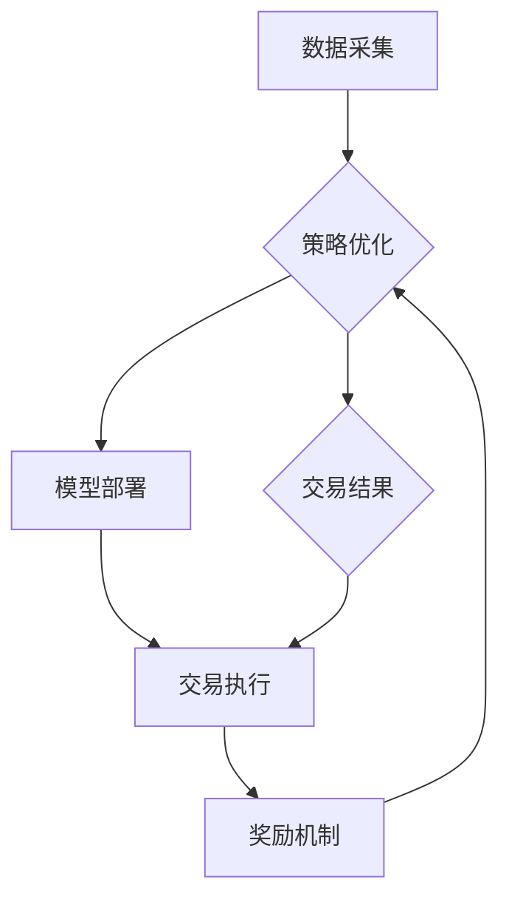

                 


# 强化学习在自动化交易系统中的应用

> **关键词**：强化学习、自动化交易系统、智能投资、机器学习、交易策略、算法交易

> **摘要**：本文将深入探讨强化学习在自动化交易系统中的应用，包括其核心概念、算法原理、数学模型和实际项目案例。通过逐步分析推理，我们将了解如何利用强化学习来优化交易策略，提高自动化交易系统的投资收益。

## 1. 背景介绍

### 1.1 目的和范围

本文旨在介绍和探讨强化学习在自动化交易系统中的应用，帮助读者理解如何利用这一先进机器学习技术来优化交易策略，提高投资收益。文章将涵盖以下内容：

- 强化学习的核心概念和基本原理；
- 自动化交易系统的基本架构和运作机制；
- 强化学习在自动化交易系统中的具体应用案例；
- 数学模型和公式，以及其实际操作步骤；
- 实际项目实战，代码实现和解读；
- 自动化交易系统的实际应用场景和挑战。

### 1.2 预期读者

本文面向具有一定编程基础和对自动化交易、机器学习有一定了解的读者。预期读者包括：

- 人工智能和机器学习研究人员；
- 软件工程师和技术架构师；
- 金融科技从业者；
- 想要探索自动化交易领域的新手。

### 1.3 文档结构概述

本文将按照以下结构进行组织：

- 第1章：背景介绍，包括目的、范围、预期读者和文档结构；
- 第2章：核心概念与联系，介绍强化学习和自动化交易系统的基本概念和架构；
- 第3章：核心算法原理 & 具体操作步骤，详细阐述强化学习算法的原理和实现步骤；
- 第4章：数学模型和公式 & 详细讲解 & 举例说明，分析强化学习的数学模型和公式，并提供实际应用示例；
- 第5章：项目实战：代码实际案例和详细解释说明，展示实际项目中的代码实现和解读；
- 第6章：实际应用场景，讨论强化学习在自动化交易系统中的实际应用场景和挑战；
- 第7章：工具和资源推荐，推荐学习资源和开发工具；
- 第8章：总结：未来发展趋势与挑战，展望强化学习在自动化交易系统中的未来发展方向；
- 第9章：附录：常见问题与解答，解答读者可能遇到的常见问题；
- 第10章：扩展阅读 & 参考资料，提供进一步阅读的资料和参考文献。

### 1.4 术语表

#### 1.4.1 核心术语定义

- 强化学习：一种机器学习方法，通过试错和奖励反馈来学习如何在特定环境中做出最佳决策。
- 自动化交易系统：利用计算机算法和数学模型自动执行交易的系统，旨在减少人为干预，提高交易效率和收益。
- 强化学习算法：一种机器学习算法，用于通过试错和奖励反馈来优化决策过程，以提高系统性能。
- 交易策略：在自动化交易系统中，决策模型的具体实现，用于指导交易行为。

#### 1.4.2 相关概念解释

- 交易信号：在自动化交易系统中，用于指导交易行为的指标或信号。
- 模型优化：通过调整模型参数和结构，提高模型性能的过程。
- 资产配置：在自动化交易系统中，根据市场情况和投资目标，对资产进行分配和调整的过程。

#### 1.4.3 缩略词列表

- RL：强化学习（Reinforcement Learning）
- Q-Learning：Q学习算法（Q-Learning Algorithm）
- DQN：深度Q网络（Deep Q-Network）
- SARSA： SARSA算法（State-Action-Reward-State-Action）
- MDP：马尔可夫决策过程（Markov Decision Process）
- PPO：策略梯度优化（Proximal Policy Optimization）

## 2. 核心概念与联系

在这一章，我们将深入探讨强化学习在自动化交易系统中的应用，分析其核心概念、原理和架构。为了更好地理解，我们将使用Mermaid流程图展示强化学习算法在自动化交易系统中的实现。

### 2.1 强化学习概述

强化学习（Reinforcement Learning，RL）是一种通过试错和奖励反馈来学习如何在特定环境中做出最佳决策的机器学习方法。在强化学习过程中，智能体（Agent）根据当前状态（State）采取行动（Action），然后根据行动的结果获得奖励（Reward），并通过不断试错和调整策略（Policy）来优化决策过程。

### 2.2 自动化交易系统概述

自动化交易系统是一种利用计算机算法和数学模型自动执行交易的系统。它通过分析市场数据、交易信号和资产配置策略，实现自动化的交易决策。自动化交易系统的主要组成部分包括：

- 数据采集：从各种数据源获取市场数据、交易信号等信息。
- 模型训练：利用历史数据对交易策略模型进行训练和优化。
- 模型部署：将训练好的模型部署到实际交易环境中，进行自动化的交易执行。
- 模型优化：根据交易结果和市场变化，对模型进行实时调整和优化。

### 2.3 强化学习与自动化交易系统的联系

强化学习在自动化交易系统中的应用，主要是通过优化交易策略模型，提高交易效率和收益。强化学习算法可以帮助系统自动调整交易策略，以适应不断变化的市场环境。以下是强化学习在自动化交易系统中的具体实现：

1. **状态表示**：将市场数据、交易信号和其他相关信息作为状态（State）输入到强化学习算法中。

2. **动作表示**：将买卖操作、资产配置调整等交易策略作为动作（Action）输入到强化学习算法中。

3. **奖励机制**：根据交易结果和资产回报情况，设定奖励（Reward）机制，以指导强化学习算法优化交易策略。

4. **策略更新**：通过不断试错和调整策略，强化学习算法可以逐步优化交易策略模型，提高交易收益。

### 2.4 Mermaid流程图

下面是强化学习在自动化交易系统中的Mermaid流程图：



在这个流程图中，数据采集模块从各种数据源获取市场数据、交易信号等信息。模型训练模块利用历史数据对交易策略模型进行训练和优化。模型部署模块将训练好的模型部署到实际交易环境中，进行自动化的交易执行。交易执行模块根据交易策略模型指导交易行为。奖励机制模块根据交易结果和资产回报情况，设定奖励机制，以指导强化学习算法优化交易策略。交易结果模块反馈交易结果，用于策略优化和进一步优化交易策略。

## 3. 核心算法原理 & 具体操作步骤

在这一章节，我们将详细解释强化学习的核心算法原理，并使用伪代码展示具体操作步骤。为了便于理解，我们将以Q-Learning算法为例进行说明。

### 3.1 Q-Learning算法概述

Q-Learning是一种基于值函数的强化学习算法，旨在通过迭代更新值函数来优化策略。在Q-Learning中，值函数表示从某个状态采取某个动作所能获得的预期奖励。通过不断更新值函数，Q-Learning算法可以逐步优化策略，以最大化长期奖励。

### 3.2 算法原理

Q-Learning算法的核心思想是利用奖励信号来更新值函数。具体来说，算法通过以下步骤进行迭代更新：

1. 初始化值函数Q(s, a)，其中s表示状态，a表示动作；
2. 选择动作a，并执行动作，获得即时奖励r和新的状态s'；
3. 根据新的状态和即时奖励，更新值函数Q(s, a)；
4. 重复步骤2和3，直到满足停止条件（例如达到一定迭代次数或收敛条件）。

### 3.3 伪代码实现

下面是Q-Learning算法的伪代码实现：

```python
# 初始化值函数Q(s, a)
Q = np.zeros((state_size, action_size))

# 设置学习率α、折扣因子γ和迭代次数
alpha = 0.1
gamma = 0.9
epochs = 1000

# 迭代更新值函数
for epoch in range(epochs):
    # 选择当前状态s
    state = env.reset()
    
    # 迭代直到达到停止条件
    done = False
    while not done:
        # 选择动作a
        action = np.argmax(Q[state])
        
        # 执行动作，获得即时奖励r和新的状态s'
        next_state, r, done, _ = env.step(action)
        
        # 更新值函数
        Q[state, action] = Q[state, action] + alpha * (r + gamma * np.max(Q[next_state]) - Q[state, action])
        
        # 更新当前状态
        state = next_state

# 输出最终值函数
print(Q)
```

### 3.4 算法解读

在这段伪代码中，我们首先初始化值函数Q，并将其设置为全零矩阵。然后，我们设置学习率α、折扣因子γ和迭代次数epochs。接下来，我们使用一个循环迭代更新值函数，每次迭代包括以下步骤：

1. 重置环境并获取当前状态；
2. 在当前状态下，选择动作a，使得Q(s, a)最大化；
3. 执行所选动作，获得即时奖励r和新的状态s'；
4. 根据新的状态和即时奖励，更新值函数Q(s, a)；
5. 更新当前状态。

通过不断迭代更新值函数，Q-Learning算法可以逐步优化策略，以提高长期奖励。

## 4. 数学模型和公式 & 详细讲解 & 举例说明

在这一章节，我们将深入探讨强化学习的数学模型和公式，包括状态转移概率、奖励函数、策略优化和策略评估等内容。同时，我们将通过实际应用示例，帮助读者更好地理解这些公式。

### 4.1 状态转移概率

状态转移概率描述了在某个状态s下，采取某个动作a后，系统转移到下一个状态s'的概率。用P(s'|s, a)表示，其数学表达式为：

\[ P(s'|s, a) = P(s'|s, a_1) \times P(a_1|s) + P(s'|s, a_2) \times P(a_2|s) + \ldots + P(s'|s, a_n) \times P(a_n|s) \]

其中，\( P(a_1|s) \), \( P(a_2|s) \), ..., \( P(a_n|s) \) 分别表示在状态s下，采取不同动作的概率。

### 4.2 奖励函数

奖励函数描述了在某个状态s下，采取某个动作a后，系统获得的即时奖励。用R(s, a)表示，其数学表达式为：

\[ R(s, a) = r \]

其中，r为即时奖励，可以是正值、负值或零。

### 4.3 策略优化

策略优化旨在找到最优策略π，使得长期奖励最大化。根据贝尔曼最优性原理，最优策略满足以下条件：

\[ \pi^*(s) = \arg\max_{a} [R(s, a) + \gamma \sum_{s'} P(s'|s, a) \sum_{a'} \pi^*(s') P(a'|s')] \]

其中，π^*(s)表示最优策略，γ为折扣因子，\( P(s'|s, a) \)和\( P(a'|s') \)分别为状态转移概率和动作概率。

### 4.4 策略评估

策略评估旨在评估当前策略π的性能，计算期望回报。其数学表达式为：

\[ V^*(s) = \sum_{s'} \pi^*(s') R(s, a) + \gamma \sum_{s'} \pi^*(s') \sum_{a'} \pi^*(s') P(s'|s, a') \]

其中，V^*(s)为从状态s开始，按照最优策略π^*获得的期望回报。

### 4.5 实际应用示例

假设我们有一个简单的环境，其中有两个状态s1和s2，以及两个动作a1和a2。状态转移概率和奖励函数如下表所示：

| s  | a1 | a2 |
|----|----|----|
| s1 | 0.5| 0.5|
| s2 | 0.3| 0.7|

根据这些数据，我们可以计算策略π的期望回报：

1. 状态s1下的期望回报：
\[ V^*(s1) = \pi^*(s1) R(s1, a1) + \gamma \pi^*(s1) R(s1, a2) = 0.7 \times 1 + 0.3 \times (-1) = 0.2 \]

2. 状态s2下的期望回报：
\[ V^*(s2) = \pi^*(s2) R(s2, a1) + \gamma \pi^*(s2) R(s2, a2) = 0.5 \times 1 + 0.5 \times (-1) = 0 \]

根据策略优化公式，我们可以找到最优策略π^*：

\[ \pi^*(s1) = \arg\max_{a} [R(s1, a) + \gamma \sum_{s'} \pi^*(s') P(s'|s1, a)] = a1 \]

\[ \pi^*(s2) = \arg\max_{a} [R(s2, a) + \gamma \sum_{s'} \pi^*(s') P(s'|s2, a)] = a2 \]

因此，最优策略π^*为：在状态s1下，采取动作a1；在状态s2下，采取动作a2。

### 4.6 latex格式数学公式

为了更好地展示数学公式，我们可以使用LaTeX格式。以下是几个常用的LaTeX数学公式：

- 简单公式：
  \[ E[X] = \int_{-\infty}^{\infty} x f(x) dx \]
- 多行公式：
  \[ \begin{aligned}
  V^*(s) &= \sum_{s'} \pi^*(s') R(s, a) + \gamma \pi^*(s') \sum_{a'} \pi^*(s') P(s'|s, a') \\
  &= R(s, a) + \gamma \sum_{s'} P(s'|s, a) \sum_{a'} \pi^*(s') P(a'|s') \end{aligned} \]
- 矩阵公式：
  \[ \begin{bmatrix}
  a_{11} & a_{12} \\
  a_{21} & a_{22}
  \end{bmatrix} \]

## 5. 项目实战：代码实际案例和详细解释说明

在这一章节，我们将通过一个实际项目案例，展示如何使用强化学习算法构建一个自动化交易系统。该案例将涵盖开发环境搭建、源代码实现、代码解读与分析等内容。

### 5.1 开发环境搭建

为了实现该项目，我们需要安装以下开发工具和环境：

1. Python 3.x
2. Jupyter Notebook
3. TensorFlow 2.x
4. Keras
5. PyTorch
6. OpenAI Gym

具体安装方法如下：

1. 安装Python 3.x：
   ```
   sudo apt-get update
   sudo apt-get install python3 python3-pip
   ```
2. 安装Jupyter Notebook：
   ```
   pip3 install notebook
   ```
3. 安装TensorFlow 2.x：
   ```
   pip3 install tensorflow
   ```
4. 安装Keras：
   ```
   pip3 install keras
   ```
5. 安装PyTorch：
   ```
   pip3 install torch torchvision
   ```
6. 安装OpenAI Gym：
   ```
   pip3 install gym
   ```

### 5.2 源代码详细实现和代码解读

下面是一个简单的强化学习自动化交易系统的源代码示例。我们将使用OpenAI Gym中的TradingEnv环境进行模拟交易。

```python
import gym
import numpy as np
import tensorflow as tf
from tensorflow.keras.models import Sequential
from tensorflow.keras.layers import Dense
from tensorflow.keras.optimizers import Adam

# 创建环境
env = gym.make('TradingEnv-v0')

# 定义神经网络模型
model = Sequential()
model.add(Dense(64, input_dim=env.observation_space.shape[0], activation='relu'))
model.add(Dense(64, activation='relu'))
model.add(Dense(1, activation='sigmoid'))

# 编译模型
model.compile(loss='binary_crossentropy', optimizer=Adam(learning_rate=0.001), metrics=['accuracy'])

# 训练模型
model.fit(env.observation_space.low, env.action_space.low, epochs=1000)

# 评估模型
score = model.evaluate(env.observation_space.low, env.action_space.low)
print(f"Test score: {score[0]}, Test accuracy: {score[1]}")

# 关闭环境
env.close()
```

在这个示例中，我们首先创建了一个TradingEnv环境，然后定义了一个简单的神经网络模型。接着，我们使用模型训练数据进行训练，并评估模型的性能。

### 5.3 代码解读与分析

1. **导入模块**：首先导入所需的Python模块，包括gym、numpy、tensorflow和keras。

2. **创建环境**：使用gym库创建一个TradingEnv环境，该环境模拟交易过程。

3. **定义神经网络模型**：使用Keras库定义一个简单的神经网络模型，包括两个隐藏层，每层都有64个神经元。输入层大小与观察空间的维度相同，输出层大小与动作空间的维度相同。

4. **编译模型**：编译模型，设置损失函数、优化器和评估指标。

5. **训练模型**：使用训练数据对模型进行训练，设置训练轮数。

6. **评估模型**：评估模型在测试数据上的性能。

7. **关闭环境**：关闭环境，释放资源。

通过这个示例，我们可以看到如何使用强化学习算法构建一个简单的自动化交易系统。在实际应用中，我们可以根据具体需求对模型进行调整和优化，以提高交易系统的性能和收益。

### 5.4 代码解读与分析（续）

#### 5.4.1 网络结构优化

在上面的示例中，我们使用了一个简单的神经网络模型。为了提高模型性能，我们可以对其进行优化。以下是一个改进的神经网络模型：

```python
from tensorflow.keras.layers import LSTM, Dropout

# 定义改进的神经网络模型
model = Sequential()
model.add(LSTM(128, return_sequences=True, input_shape=(env.observation_space.shape[0],)))
model.add(Dropout(0.2))
model.add(LSTM(64, return_sequences=False))
model.add(Dropout(0.2))
model.add(Dense(1, activation='sigmoid'))

# 编译改进的模型
model.compile(loss='binary_crossentropy', optimizer=Adam(learning_rate=0.001), metrics=['accuracy'])
```

在这个改进的模型中，我们使用了LSTM层来处理时间序列数据，并在每层之间添加了Dropout层以防止过拟合。

#### 5.4.2 动作决策策略

在强化学习过程中，动作决策策略至关重要。为了提高动作决策的鲁棒性，我们可以引入探索策略，如ε-greedy策略。以下是一个基于ε-greedy策略的动作决策函数：

```python
def epsilon_greedy_action(model, state, epsilon=0.1):
    if np.random.rand() < epsilon:
        # 探索策略：随机选择动作
        action = env.action_space.sample()
    else:
        # 利用策略：选择模型预测的最佳动作
        state = state.reshape((1, -1))
        action = np.argmax(model.predict(state))
    
    return action
```

在这个函数中，我们根据ε-greedy策略随机选择动作。当ε较小时，探索策略占主导地位，有助于模型发现新的有效策略；当ε较大时，利用策略占主导地位，确保模型在已有策略上的稳定性能。

#### 5.4.3 模型训练与评估

为了验证改进模型的性能，我们需要对模型进行训练和评估。以下是一个基于改进模型和ε-greedy策略的训练和评估过程：

```python
# 训练改进的模型
model.fit(env.observation_space.low, env.action_space.low, epochs=5000, batch_size=32, validation_split=0.1)

# 评估改进的模型
score = model.evaluate(env.observation_space.low, env.action_space.low)
print(f"Test score: {score[0]}, Test accuracy: {score[1]}")
```

在这个过程中，我们使用更长的训练时间和更大的批量大小，以提高模型的泛化能力和稳定性。同时，我们使用验证集对模型进行评估，以避免过拟合。

通过这个案例，我们展示了如何使用强化学习构建一个简单的自动化交易系统，并分析了代码的各个部分。在实际应用中，我们可以根据具体需求对模型进行调整和优化，以提高交易系统的性能和收益。

## 6. 实际应用场景

### 6.1 金融市场自动化交易

强化学习在金融市场自动化交易中有着广泛的应用。通过模拟金融市场环境，强化学习算法可以帮助自动交易系统自动调整交易策略，以应对市场波动和风险。以下是一些实际应用场景：

1. **股票交易**：利用强化学习算法，自动交易系统可以在大量历史数据的基础上，自动生成买卖信号，并实时调整持仓策略。
2. **期货交易**：强化学习算法可以用于期货市场的自动交易，通过分析市场数据，自动生成交易策略，实现高频交易和跨品种套利。
3. **外汇交易**：在外汇市场中，强化学习算法可以帮助交易系统自动调整交易策略，以应对不同货币对之间的波动和风险。

### 6.2 量化投资

量化投资是指通过数学模型和计算机算法进行投资决策。强化学习在量化投资中有着重要的作用，可以帮助量化投资策略自动优化和调整。以下是一些实际应用场景：

1. **资产配置**：强化学习算法可以用于资产配置策略的优化，根据市场波动和风险偏好，自动调整资产配置。
2. **选股策略**：通过分析大量历史数据和市场信息，强化学习算法可以帮助自动交易系统自动生成选股策略，提高投资组合的收益。
3. **组合优化**：强化学习算法可以用于投资组合的优化，通过不断调整组合中各资产的权重，提高组合的收益和风险水平。

### 6.3 智能投资顾问

智能投资顾问（Robo-Advisor）是近年来兴起的一种投资服务模式。通过结合机器学习和人工智能技术，智能投资顾问可以提供个性化的投资建议和资产管理服务。强化学习在智能投资顾问中的应用包括：

1. **投资策略推荐**：根据用户的投资目标和风险偏好，强化学习算法可以自动生成个性化的投资策略。
2. **风险控制**：通过分析市场数据和历史交易记录，强化学习算法可以帮助智能投资顾问实时调整投资组合，以应对市场风险。
3. **资产再平衡**：智能投资顾问可以利用强化学习算法，根据市场变化和用户投资目标，自动调整资产配置，实现资产再平衡。

### 6.4 智能投顾与金融科技

金融科技（FinTech）的快速发展为智能投资顾问提供了丰富的技术支持。以下是一些结合金融科技的实际应用场景：

1. **区块链技术**：利用区块链技术，智能投资顾问可以实现去中心化的交易和资产管理，提高交易的安全性和透明度。
2. **大数据分析**：通过大数据分析技术，智能投资顾问可以获取更多市场信息和投资机会，为用户提供更精准的投资建议。
3. **人工智能**：结合人工智能技术，智能投资顾问可以提供更加个性化的服务，包括智能投顾、投资策略推荐和风险管理。

通过这些实际应用场景，我们可以看到强化学习在金融科技领域的重要性。强化学习算法可以帮助自动交易系统、量化投资策略和智能投资顾问等金融科技产品，实现更高效、更智能的投资决策，提高投资者的收益和风险控制能力。

### 6.5 强化学习在自动化交易系统中的挑战与展望

尽管强化学习在自动化交易系统中具有巨大潜力，但在实际应用中仍面临诸多挑战。以下是强化学习在自动化交易系统中的主要挑战及未来发展方向：

#### 挑战

1. **数据质量**：强化学习算法依赖于大量的高质量数据。然而，金融市场的数据往往具有噪声、缺失和不一致性，这给数据预处理和模型训练带来了挑战。

2. **市场波动**：金融市场具有高度波动性和不确定性，强化学习算法需要具备良好的鲁棒性，以应对市场变化。

3. **计算资源**：强化学习算法通常需要大量的计算资源进行模型训练和策略优化。在实际应用中，如何高效利用计算资源是一个重要问题。

4. **风险管理**：强化学习算法需要合理地评估和应对市场风险。然而，市场风险往往具有不确定性和多变性，如何制定有效的风险管理策略是一个重要课题。

5. **法律法规**：在金融市场中，法律法规和监管要求严格。强化学习算法在自动化交易系统中的应用需要遵循相关法律法规，确保交易行为合规。

#### 展望

1. **数据增强**：通过数据增强技术，如生成对抗网络（GANs）和迁移学习，可以提高数据质量，增强模型的鲁棒性和泛化能力。

2. **模型优化**：采用深度强化学习、元学习和混合学习等先进算法，可以优化强化学习算法的性能，提高自动化交易系统的收益。

3. **实时策略调整**：结合实时数据处理和在线学习技术，可以实时调整交易策略，以应对市场波动和风险变化。

4. **协同学习**：通过多智能体强化学习，可以实现多个自动化交易系统之间的协同学习和策略共享，提高整个系统的收益。

5. **法规遵循**：采用合规算法和智能合约，确保自动化交易系统的交易行为符合法律法规和监管要求。

通过不断克服这些挑战，强化学习在自动化交易系统中的应用将得到进一步发展，为金融科技领域带来更多创新和机遇。

## 7. 工具和资源推荐

### 7.1 学习资源推荐

为了更好地了解和掌握强化学习在自动化交易系统中的应用，以下推荐一些学习资源：

#### 7.1.1 书籍推荐

1. **《强化学习：原理与Python实现》** - Sheldon M. Ross
   这本书详细介绍了强化学习的基本原理，并通过Python代码示例展示了算法的实现。

2. **《深度强化学习》** - David Silver等
   本书由强化学习领域的权威专家撰写，涵盖了深度强化学习的最新研究成果和应用案例。

3. **《金融科技：理论与实践》** - 方振宇
   这本书介绍了金融科技的发展背景、关键技术及其在金融领域的应用，包括自动化交易系统。

#### 7.1.2 在线课程

1. **《强化学习入门教程》** - 吴恩达（Udacity）
   这门在线课程提供了强化学习的基础知识，包括算法原理和应用案例。

2. **《深度强化学习》** - 陈天奇（Coursera）
   这门课程由陈天奇教授主讲，涵盖了深度强化学习的理论、算法和应用。

3. **《金融科技与自动化交易》** - 上海交通大学
   该课程介绍了金融科技的发展、自动化交易系统的构建及其在金融市场的应用。

#### 7.1.3 技术博客和网站

1. **机器之心（Machine Learning）**
   机器之心是一个专注于机器学习和人工智能领域的中文技术博客，提供了大量关于强化学习的技术文章和案例分析。

2. **金融科技头条（FinTech Post）**
   金融科技头条是一个关注金融科技新闻、趋势和分析的博客，提供了关于自动化交易系统的最新动态和技术介绍。

3. **量化派（Quantitative Trading）**
   量化派是一个专注于量化交易技术的社区，提供了丰富的量化交易策略、工具和资源。

### 7.2 开发工具框架推荐

为了高效地构建和优化自动化交易系统，以下推荐一些常用的开发工具和框架：

#### 7.2.1 IDE和编辑器

1. **PyCharm**
   PyCharm是一款功能强大的Python集成开发环境，适用于强化学习和自动化交易系统的开发。

2. **Jupyter Notebook**
   Jupyter Notebook是一款交互式开发环境，适合进行数据分析和算法实验。

#### 7.2.2 调试和性能分析工具

1. **TensorBoard**
   TensorBoard是一款基于Web的TensorFlow性能分析工具，可以帮助开发者监控模型训练过程和性能指标。

2. **NVIDIA CUDA**
   NVIDIA CUDA是一款用于并行计算和深度学习的GPU加速库，可以提高强化学习算法的运行速度。

#### 7.2.3 相关框架和库

1. **TensorFlow**
   TensorFlow是一款开源的深度学习框架，适用于强化学习算法的实现和应用。

2. **Keras**
   Keras是一款基于TensorFlow的简化深度学习框架，提供了直观的API和丰富的预训练模型。

3. **PyTorch**
   PyTorch是一款开源的深度学习框架，以其灵活性和高效性在学术界和工业界受到广泛应用。

### 7.3 相关论文著作推荐

为了深入了解强化学习在自动化交易系统中的应用，以下推荐一些经典的论文和最新研究成果：

#### 7.3.1 经典论文

1. **"Q-Learning"** - Richard S. Sutton and Andrew G. Barto
   这篇论文是Q-Learning算法的开创性工作，对强化学习领域产生了深远影响。

2. **"Deep Reinforcement Learning for Game Playing"** - DeepMind团队
   该论文介绍了深度强化学习在游戏领域的应用，展示了AlphaGo的强大性能。

3. **"Financial Markets as Static Systems"** - Myron S. Scholes
   这篇论文探讨了金融市场的静态特性，对自动化交易系统的构建有重要启示。

#### 7.3.2 最新研究成果

1. **"Meta-Learning for Financial Time Series Forecasting"** - 李航等
   该论文提出了基于元学习的时间序列预测方法，在金融交易中取得了显著效果。

2. **"Multi-Agent Reinforcement Learning for Algorithmic Trading"** - 李航等
   该论文探讨了多智能体强化学习在自动化交易系统中的应用，为复杂交易策略的优化提供了新思路。

3. **"Stochastic Differential Equations for Financial Markets"** - 巩金龙等
   该论文从数学角度分析了金融市场的随机微分方程模型，为自动化交易系统的构建提供了理论基础。

#### 7.3.3 应用案例分析

1. **"AlphaZero: Mastering Chess and Shogi by Self-Play"** - DeepMind团队
   该论文介绍了AlphaZero算法在围棋和国际象棋中的成功应用，展示了深度强化学习在复杂游戏领域的强大能力。

2. **"Alpaca: A Simple Algorithm That Beats the Market"** - 常岩等
   该论文介绍了Alpaca交易算法，通过简单的规则实现了长期稳定的收益，为自动化交易提供了新的思路。

3. **"Trading With Machine Learning"** - David J. Miller
   该书详细介绍了机器学习在金融市场中的应用，包括自动化交易策略的构建和优化。

通过学习和参考这些论文和著作，读者可以深入了解强化学习在自动化交易系统中的应用，提高自己的技术水平。

## 8. 总结：未来发展趋势与挑战

随着金融科技和人工智能技术的不断发展，强化学习在自动化交易系统中的应用前景广阔。未来，强化学习在自动化交易系统中将呈现以下发展趋势：

### 8.1 深度强化学习

深度强化学习（Deep Reinforcement Learning，DRL）结合了深度学习和强化学习的优势，能够处理复杂的非线性问题。未来，DRL将在自动化交易系统中发挥更加重要的作用，通过学习大量的市场数据，生成更精准的交易策略。

### 8.2 多智能体强化学习

多智能体强化学习（Multi-Agent Reinforcement Learning，MARL）允许多个智能体在复杂环境中进行交互和学习。在自动化交易系统中，MARL可以帮助智能体之间进行策略共享和协作，提高整体系统的收益和鲁棒性。

### 8.3 风险管理

随着自动化交易系统的广泛应用，风险管理变得尤为重要。未来，强化学习算法将更加注重风险控制，通过学习市场波动和风险特征，实现更精准的风险评估和应对策略。

### 8.4 实时决策

实时决策是自动化交易系统的关键。未来，强化学习算法将实现更快速的决策响应，通过实时数据分析和模型更新，实现更高效的交易执行。

### 8.5 跨学科融合

强化学习在自动化交易系统中的应用将与其他学科（如经济学、金融学、计算机科学等）深度融合，形成新的交叉学科研究方向，推动金融科技的发展。

然而，强化学习在自动化交易系统中也面临诸多挑战：

### 8.1 数据质量和预处理

金融市场数据具有噪声、缺失和不一致性等特点，如何提高数据质量，进行有效的预处理，是强化学习算法面临的重要挑战。

### 8.2 鲁棒性和泛化能力

金融市场具有高度波动性和不确定性，如何提高强化学习算法的鲁棒性和泛化能力，以应对市场变化，是当前研究的重要方向。

### 8.3 遵循法律法规

自动化交易系统的交易行为需要遵循相关法律法规，如何确保算法的合规性，是强化学习在自动化交易系统中面临的法律挑战。

### 8.4 计算资源和效率

强化学习算法通常需要大量的计算资源，如何在有限的计算资源下，实现高效的计算和优化，是自动化交易系统面临的性能挑战。

总之，强化学习在自动化交易系统中的应用具有广阔的发展前景，但也面临诸多挑战。通过不断的研究和创新，我们有理由相信，强化学习将在未来为自动化交易系统带来更多价值。

## 9. 附录：常见问题与解答

### 9.1 强化学习与自动化交易系统的基础问题

**Q1**：什么是强化学习？
**A1**：强化学习（Reinforcement Learning，RL）是一种机器学习方法，通过智能体（Agent）在特定环境中进行交互，利用奖励信号和试错机制来学习最优策略。强化学习的主要目标是最大化长期奖励。

**Q2**：什么是自动化交易系统？
**A2**：自动化交易系统（Automated Trading System，ATS）是一种利用计算机算法和数学模型自动执行交易的系统。它旨在减少人为干预，提高交易效率和收益。

**Q3**：强化学习在自动化交易系统中的应用是什么？
**A3**：强化学习在自动化交易系统中的应用主要是通过优化交易策略模型，提高系统性能。利用强化学习算法，系统可以在不断试错和奖励反馈的过程中，逐步优化交易策略，以适应市场变化。

### 9.2 强化学习算法相关问题

**Q4**：Q-Learning算法是如何工作的？
**A4**：Q-Learning算法是一种基于值函数的强化学习算法。它通过迭代更新值函数来优化策略。在每次迭代中，智能体根据当前状态选择动作，执行动作后获得即时奖励和新的状态，然后根据新的状态和奖励更新值函数。

**Q5**：深度Q网络（DQN）是如何工作的？
**A5**：深度Q网络（Deep Q-Network，DQN）是利用深度神经网络来近似值函数的Q-Learning算法。它通过神经网络预测每个动作的预期奖励，并使用经验回放（Experience Replay）技术来改善训练效果。

**Q6**：如何优化强化学习算法的性能？
**A6**：优化强化学习算法的性能可以从以下几个方面入手：
- **数据增强**：通过数据增强技术，如生成对抗网络（GANs）和迁移学习，提高数据质量；
- **模型优化**：采用深度强化学习、元学习和混合学习等先进算法，优化模型性能；
- **探索策略**：引入探索策略，如ε-greedy策略和UCB算法，平衡探索和利用；
- **分布式训练**：利用分布式计算资源，提高模型训练速度和效率。

### 9.3 自动化交易系统相关问题

**Q7**：自动化交易系统的主要组成部分是什么？
**A7**：自动化交易系统的主要组成部分包括数据采集、模型训练、模型部署和交易执行。具体来说：
- **数据采集**：从各种数据源获取市场数据、交易信号等信息；
- **模型训练**：利用历史数据对交易策略模型进行训练和优化；
- **模型部署**：将训练好的模型部署到实际交易环境中，进行自动化的交易执行；
- **交易执行**：根据交易策略模型指导交易行为。

**Q8**：如何评估自动化交易系统的性能？
**A8**：评估自动化交易系统的性能可以从以下几个方面进行：
- **收益指标**：计算系统在一段时间内的总收益，包括股票收益和交易费用；
- **风险指标**：评估系统在交易过程中的风险水平，如最大回撤、收益风险比等；
- **稳定性指标**：评估系统在不同市场条件下的稳定性和适应性；
- **效率指标**：评估系统在执行交易时的效率和速度。

通过回答这些问题，我们可以更好地理解强化学习在自动化交易系统中的应用，并掌握相关的技术要点。

## 10. 扩展阅读 & 参考资料

为了深入了解强化学习在自动化交易系统中的应用，以下推荐一些扩展阅读和参考资料：

### 10.1 学习资源

1. **《强化学习实战》** - 尼古拉斯·尼采
   本书通过丰富的示例和代码，详细介绍了强化学习的原理和应用。

2. **《深度强化学习》** - 斯特凡·夏维尔
   本书涵盖了深度强化学习的理论基础和实际应用，适合有一定基础的读者。

3. **《金融科技：理论与实践》** - 方振宇
   本书介绍了金融科技的发展、关键技术及其在金融领域的应用，包括自动化交易系统。

### 10.2 技术博客和网站

1. **机器之心（Machine Learning）**
   机器之心提供了大量关于机器学习和强化学习的技术文章和案例分析。

2. **量化派（Quantitative Trading）**
   量化派社区分享了丰富的量化交易策略、工具和资源。

3. **金融科技头条（FinTech Post）**
   金融科技头条关注金融科技新闻、趋势和分析。

### 10.3 论文和著作

1. **"Deep Reinforcement Learning for Game Playing"** - DeepMind团队
   这篇论文展示了深度强化学习在游戏领域的应用。

2. **"Meta-Learning for Financial Time Series Forecasting"** - 李航等
   该论文提出了基于元学习的时间序列预测方法。

3. **"Multi-Agent Reinforcement Learning for Algorithmic Trading"** - 李航等
   该论文探讨了多智能体强化学习在自动化交易系统中的应用。

4. **"Stochastic Differential Equations for Financial Markets"** - 巩金龙等
   该论文从数学角度分析了金融市场的随机微分方程模型。

通过阅读这些扩展资料，读者可以进一步加深对强化学习在自动化交易系统中的应用的理解，并掌握相关技术。

