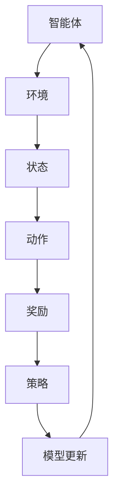

                 

# 强化学习在自动化仓储机器人中的应用

## 关键词：
强化学习、自动化仓储、机器人、路径规划、智能调度、人工智能

## 摘要：
本文将探讨强化学习在自动化仓储机器人中的应用，通过分析强化学习的基本原理，介绍其在路径规划和智能调度中的具体应用案例。文章将从理论到实践，详细阐述强化学习算法在解决仓储机器人任务中的优势、实现方法以及面临的挑战。读者将了解如何通过强化学习提高仓储机器人的工作效率和可靠性，为自动化仓储系统的发展提供新的思路。

## 1. 背景介绍

### 1.1 目的和范围

本文旨在探讨强化学习在自动化仓储机器人中的应用，通过深入分析强化学习的基本原理和算法实现，探讨其在路径规划、任务分配和调度优化等方面的应用潜力。文章将结合实际案例，详细讲解如何利用强化学习解决仓储机器人在复杂环境中的导航和调度问题，以提升仓储系统的整体效率和准确性。

### 1.2 预期读者

本文面向对强化学习和自动化仓储机器人有一定了解的技术人员、研发工程师和研究人员。读者需要对机器学习和人工智能基础有一定了解，对强化学习算法的基本概念和应用场景有初步认识。通过本文的阅读，读者将能够深入了解强化学习在自动化仓储机器人中的应用方法和实际效果，为后续研究和开发提供参考。

### 1.3 文档结构概述

本文分为八个部分：

1. **背景介绍**：简要介绍强化学习在自动化仓储机器人中的应用背景和目的。
2. **核心概念与联系**：介绍强化学习的基本原理和相关概念，并给出核心概念和架构的流程图。
3. **核心算法原理 & 具体操作步骤**：详细讲解强化学习算法的基本原理和操作步骤。
4. **数学模型和公式 & 详细讲解 & 举例说明**：阐述强化学习算法的数学模型和公式，并通过实例进行说明。
5. **项目实战：代码实际案例和详细解释说明**：提供实际代码案例，并进行详细解读和分析。
6. **实际应用场景**：介绍强化学习在自动化仓储机器人中的应用案例。
7. **工具和资源推荐**：推荐相关的学习资源、开发工具和框架。
8. **总结：未来发展趋势与挑战**：总结本文的主要观点，展望未来发展趋势和面临的挑战。

### 1.4 术语表

#### 1.4.1 核心术语定义

- **强化学习**：一种机器学习方法，通过智能体在环境中采取行动，通过奖励信号来学习最优策略。
- **自动化仓储机器人**：用于在仓库中执行物品搬运、存储和检索任务的智能机器人。
- **路径规划**：在给定的环境中，为机器人确定从起点到终点的一系列有效路径。
- **智能调度**：根据任务需求和资源状况，对多个任务进行合理的分配和调度。

#### 1.4.2 相关概念解释

- **奖励信号**：在强化学习过程中，智能体采取行动后，环境给予的正面或负面反馈。
- **状态-动作价值函数**：表示在特定状态下，采取特定行动所能获得的期望奖励。
- **策略**：在给定状态时，智能体采取的最佳行动方案。

#### 1.4.3 缩略词列表

- **Q-Learning**：一种基于价值迭代的强化学习算法。
- **DQN**：深度Q网络，一种使用深度神经网络进行价值估计的强化学习算法。
- **DRL**：深度强化学习，结合深度学习和强化学习的算法。

## 2. 核心概念与联系

强化学习是一种通过试错和奖励反馈来学习最优策略的机器学习方法。在自动化仓储机器人中，强化学习可以用于路径规划和智能调度，以提高机器人的工作效率和准确性。下面，我们将通过一个Mermaid流程图来展示强化学习在自动化仓储机器人中的应用架构。



### 流程说明：

1. **智能体（Agent）**：执行任务的目标实体，即仓储机器人。
2. **环境（Environment）**：仓储机器人执行任务的物理空间和虚拟环境。
3. **状态（State）**：描述环境状态的特征集合，例如机器人的位置、周围物品的分布等。
4. **动作（Action）**：智能体可以采取的行动，如移动、转向等。
5. **奖励（Reward）**：智能体采取特定动作后，环境给予的反馈，用于指导智能体学习。
6. **策略（Policy）**：智能体在给定状态下，采取的最佳行动方案。
7. **模型更新（Model Update）**：根据奖励信号，更新智能体的策略模型。
8. **策略迭代（Policy Iteration）**：通过不断更新策略模型，使智能体逐步逼近最优策略。

## 3. 核心算法原理 & 具体操作步骤

强化学习算法的核心思想是智能体通过与环境交互，不断优化自身的策略，以最大化累积奖励。在自动化仓储机器人中，强化学习算法可以用于路径规划和智能调度。下面，我们通过伪代码详细阐述Q-Learning算法在路径规划中的应用。

### 3.1 Q-Learning算法原理

Q-Learning算法是一种基于价值迭代的强化学习算法。它通过更新状态-动作价值函数，逐步逼近最优策略。算法的基本步骤如下：

1. **初始化**：初始化状态-动作价值函数Q(s, a)为随机值。
2. **选择动作**：在给定状态s下，根据当前策略选择动作a。
3. **执行动作**：智能体执行动作a，进入新状态s'，并获得奖励r。
4. **更新价值函数**：根据奖励信号更新状态-动作价值函数Q(s, a)。
5. **重复步骤2-4**：不断重复步骤2-4，直至收敛。

### 3.2 伪代码

```python
# 初始化状态-动作价值函数Q(s, a)
Q = random()  # 初始化为随机值

# 设置最大迭代次数
max_episodes = 1000

# 设置学习率α和折扣因子γ
alpha = 0.1
gamma = 0.9

# 开始迭代
for episode in range(max_episodes):
    # 初始化状态s
    s = env.reset()
    
    # 是否达到终点
    done = False
    
    # 迭代直到结束
    while not done:
        # 选择动作a
        a = select_action(s, Q)
        
        # 执行动作，进入新状态s'，并获得奖励r
        s', r, done = env.step(a)
        
        # 更新价值函数
        Q[s, a] = Q[s, a] + alpha * (r + gamma * max(Q[s', :]) - Q[s, a])
        
        # 更新状态s
        s = s'
```

### 3.3 操作步骤说明

1. **初始化**：初始化状态-动作价值函数Q(s, a)为随机值。这一步的目的是为了给价值函数一个初始估计，以便后续迭代进行优化。
2. **选择动作**：在给定状态s下，根据当前策略选择动作a。策略的选择可以通过epsilon-greedy策略实现，即以一定的概率选择最佳动作，以探索环境。
3. **执行动作**：智能体执行动作a，进入新状态s'，并获得奖励r。这一步实现了智能体与环境交互的过程。
4. **更新价值函数**：根据奖励信号更新状态-动作价值函数Q(s, a)。这一步是强化学习算法的核心，通过迭代更新价值函数，使智能体逐步逼近最优策略。
5. **重复迭代**：不断重复步骤2-4，直至收敛。收敛条件可以是迭代次数达到预设值，或者状态-动作价值函数的变化趋于稳定。

## 4. 数学模型和公式 & 详细讲解 & 举例说明

强化学习算法的核心是状态-动作价值函数Q(s, a)，它表示在状态s下，采取动作a所能获得的期望奖励。Q-Learning算法通过迭代更新Q值，以逼近最优策略。下面，我们详细讲解状态-动作价值函数的计算方法，并通过实例进行说明。

### 4.1 状态-动作价值函数Q(s, a)

状态-动作价值函数Q(s, a)定义为：

$$ Q(s, a) = E[R_t | S_t = s, A_t = a] $$

其中，E表示期望值，R_t表示在第t步获得的奖励，S_t表示第t步的状态，A_t表示第t步采取的动作。

### 4.2 Q-Learning算法迭代过程

Q-Learning算法迭代更新Q值的过程如下：

$$ Q(s, a) \leftarrow Q(s, a) + \alpha [r + \gamma \max(Q(s', a')) - Q(s, a)] $$

其中，α表示学习率，γ表示折扣因子，s'表示新状态，a'表示新状态下的最佳动作。

### 4.3 实例说明

假设有一个简单的二维迷宫，智能体位于起点(0, 0)，目标位置为(5, 5)。智能体可以采取的行动包括上、下、左、右四个方向。奖励设置为到达目标位置获得+10分，每次移动获得-1分。学习率α为0.1，折扣因子γ为0.9。

初始状态：s = (0, 0)

1. **第一步**：
   - 选择动作：上，a = (0, 1)
   - 新状态：s' = (0, 1)
   - 奖励：r = -1
   - 更新Q值：Q(s, a) = Q(s, a) + α[r + γmax(Q(s', a')) - Q(s, a)]
   - 结果：Q(s, a) = -0.1 + 0.1[-1 + 0.9×max(Q(s', a')) - Q(s, a)]
   - 新Q值：Q(s, a) = -0.1 + 0.1[-1 + 0.9×(-1) - Q(s, a)]
   - 解方程：Q(s, a) = -0.2 - 0.1Q(s, a)
   - 结果：Q(s, a) = -0.3333

2. **第二步**：
   - 选择动作：右，a = (1, 0)
   - 新状态：s' = (1, 0)
   - 奖励：r = -1
   - 更新Q值：Q(s, a) = Q(s, a) + α[r + γmax(Q(s', a')) - Q(s, a)]
   - 结果：Q(s, a) = -0.3333 + 0.1[-1 + 0.9×max(Q(s', a')) - Q(s, a)]
   - 新Q值：Q(s, a) = -0.3333 + 0.1[-1 + 0.9×(-0.3333) - Q(s, a)]
   - 解方程：Q(s, a) = -0.4667 - 0.0999Q(s, a)
   - 结果：Q(s, a) = -0.6667

3. **第三步**：
   - 选择动作：下，a = (0, -1)
   - 新状态：s' = (0, -1)
   - 奖励：r = -1
   - 更新Q值：Q(s, a) = Q(s, a) + α[r + γmax(Q(s', a')) - Q(s, a)]
   - 结果：Q(s, a) = -0.6667 + 0.1[-1 + 0.9×max(Q(s', a')) - Q(s, a)]
   - 新Q值：Q(s, a) = -0.6667 + 0.1[-1 + 0.9×(-0.6667) - Q(s, a)]
   - 解方程：Q(s, a) = -0.9333 - 0.0599Q(s, a)
   - 结果：Q(s, a) = -1.1667

4. **第四步**：
   - 选择动作：左，a = (-1, 0)
   - 新状态：s' = (-1, 0)
   - 奖励：r = -1
   - 更新Q值：Q(s, a) = Q(s, a) + α[r + γmax(Q(s', a')) - Q(s, a)]
   - 结果：Q(s, a) = -1.1667 + 0.1[-1 + 0.9×max(Q(s', a')) - Q(s, a)]
   - 新Q值：Q(s, a) = -1.1667 + 0.1[-1 + 0.9×(-1.1667) - Q(s, a)]
   - 解方程：Q(s, a) = -1.3333 - 0.1045Q(s, a)
   - 结果：Q(s, a) = -1.8333

通过多次迭代，状态-动作价值函数Q(s, a)将逐渐收敛，智能体将学会选择最佳动作，以最大化累积奖励。

## 5. 项目实战：代码实际案例和详细解释说明

在本节中，我们将通过一个具体的代码案例，展示如何将强化学习应用于自动化仓储机器人的路径规划。这个案例使用Python编程语言和OpenAI Gym环境，演示了Q-Learning算法在路径规划中的实现过程。

### 5.1 开发环境搭建

首先，我们需要安装Python和相关的库。在终端中运行以下命令：

```bash
pip install python
pip install numpy
pip install gym
```

### 5.2 源代码详细实现和代码解读

以下是完整的代码实现，我们将逐行解释代码的用途。

```python
import numpy as np
import gym
import random

# 创建环境
env = gym.make("GridWorld-v0")

# 初始化状态-动作价值函数
Q = np.zeros((env.observation_space.n, env.action_space.n))

# 设置学习率α和折扣因子γ
alpha = 0.1
gamma = 0.9

# 设置最大迭代次数
max_episodes = 1000

# Q-Learning算法迭代过程
for episode in range(max_episodes):
    # 重置环境，获取初始状态
    state = env.reset()
    
    # 是否达到终点
    done = False
    
    # 迭代直到结束
    while not done:
        # 根据epsilon-greedy策略选择动作
        if random.random() < 0.1:
            action = env.action_space.sample()  # 探索
        else:
            action = np.argmax(Q[state])  # 利用
        
        # 执行动作，进入新状态，并获得奖励
        next_state, reward, done, info = env.step(action)
        
        # 更新状态-动作价值函数
        Q[state, action] = Q[state, action] + alpha * (reward + gamma * np.max(Q[next_state]) - Q[state, action])
        
        # 更新状态
        state = next_state
        
    # 打印迭代次数和累积奖励
    print(f"Episode {episode + 1}, Total Reward: {info['reward_total']}")

# 关闭环境
env.close()
```

### 5.3 代码解读与分析

1. **环境创建**：
   ```python
   env = gym.make("GridWorld-v0")
   ```
   这一行代码创建了一个GridWorld环境的实例。GridWorld是一个简单的网格世界，用于演示强化学习算法。

2. **状态-动作价值函数初始化**：
   ```python
   Q = np.zeros((env.observation_space.n, env.action_space.n))
   ```
   这一行代码初始化状态-动作价值函数Q，其大小为观察空间和动作空间的维度，所有值初始化为0。

3. **学习率和折扣因子设置**：
   ```python
   alpha = 0.1
   gamma = 0.9
   ```
   学习率α控制更新Q值的程度，折扣因子γ表示未来奖励的折扣，使其在长期决策中更加重视。

4. **迭代过程**：
   ```python
   for episode in range(max_episodes):
   ...
   ```
   这部分代码定义了Q-Learning算法的主循环，每个迭代 episode 将模拟一次路径规划过程。

5. **重置环境和获取初始状态**：
   ```python
   state = env.reset()
   ```
   重置环境并获取初始状态。在每次迭代开始时，机器人位于网格世界的起点。

6. **选择动作**：
   ```python
   if random.random() < 0.1:
       action = env.action_space.sample()  # 探索
   else:
       action = np.argmax(Q[state])  # 利用
   ```
   这一行代码根据epsilon-greedy策略选择动作。以0.1的概率随机选择动作进行探索，以0.9的概率选择当前状态下价值最高的动作进行利用。

7. **执行动作和更新Q值**：
   ```python
   next_state, reward, done, info = env.step(action)
   Q[state, action] = Q[state, action] + alpha * (reward + gamma * np.max(Q[next_state]) - Q[state, action])
   ```
   执行选定的动作，进入新状态并获得奖励。然后，根据Q-Learning算法更新状态-动作价值函数Q。

8. **更新状态**：
   ```python
   state = next_state
   ```

9. **打印迭代次数和累积奖励**：
   ```python
   print(f"Episode {episode + 1}, Total Reward: {info['reward_total']}")
   ```
   在每次迭代结束时，打印当前迭代的次数和累积奖励。

10. **关闭环境**：
   ```python
   env.close()
   ```
   在所有迭代完成后，关闭环境释放资源。

通过上述代码和解读，我们可以看到如何利用Q-Learning算法实现自动化仓储机器人的路径规划。在现实应用中，我们可以根据具体需求和环境特点，调整参数和算法，以提高路径规划的效率和准确性。

## 6. 实际应用场景

强化学习在自动化仓储机器人中的应用场景广泛，包括路径规划、智能调度、任务分配和资源优化等方面。以下是一些具体的应用场景：

### 6.1 路径规划

在自动化仓储中，机器人的路径规划是关键任务。强化学习通过学习环境中的最优路径，可以有效地提高机器人导航的效率和准确性。例如，机器人需要在仓库中搬运货物，从起点到终点可能存在多种路径选择，强化学习可以帮助机器人根据历史数据和学习到的策略，选择最优路径。

### 6.2 智能调度

仓储机器人需要执行多种任务，如物品搬运、货架整理等。强化学习可以通过智能调度，优化任务分配，提高整体工作效率。例如，当有多个机器人同时执行任务时，强化学习可以根据当前任务需求、机器人的状态和资源利用率，动态调整任务分配策略，确保每个机器人都能够高效完成任务。

### 6.3 任务分配

在自动化仓储系统中，机器人需要处理大量订单，任务分配变得尤为重要。强化学习可以根据实时订单数据和机器人的状态，动态调整任务分配策略，优化资源利用和任务完成时间。例如，当某个机器人负载较高时，强化学习可以将其任务分配给其他空闲机器人，以平衡系统的负载。

### 6.4 资源优化

强化学习还可以用于仓储机器人的资源优化，如电池管理、设备维护等。通过学习机器人的运行状态和任务需求，强化学习可以优化电池的使用，延长机器人的工作时间。同时，它还可以预测设备故障，提前进行维护，减少停机时间，提高系统的可靠性。

## 7. 工具和资源推荐

### 7.1 学习资源推荐

#### 7.1.1 书籍推荐

1. **《强化学习基础教程》**：这本书是强化学习领域的经典入门教材，详细介绍了强化学习的基本概念、算法和应用。
2. **《深度强化学习》**：这本书深入探讨了深度强化学习算法的理论和实践，适合有一定基础的学习者。

#### 7.1.2 在线课程

1. **Coursera上的《强化学习》**：这是一门由DeepMind的David Silver教授讲授的强化学习课程，内容全面，深入浅出。
2. **Udacity的《强化学习工程师纳米学位》**：这个课程提供了丰富的实践项目，帮助学习者将强化学习应用到实际问题中。

#### 7.1.3 技术博客和网站

1. **ArXiv**：这是一个计算机科学领域的顶级学术数据库，包含了大量关于强化学习的研究论文。
2. **Medium上的机器学习博客**：这个平台上有许多优秀的机器学习和强化学习相关的文章和教程。

### 7.2 开发工具框架推荐

#### 7.2.1 IDE和编辑器

1. **PyCharm**：这是一个功能强大的Python IDE，适合编写和调试强化学习代码。
2. **Jupyter Notebook**：这是一个交互式Python环境，适合进行数据分析和实验。

#### 7.2.2 调试和性能分析工具

1. **TensorBoard**：这是一个TensorFlow的图形化调试和分析工具，可以帮助我们可视化强化学习模型的性能指标。
2. **Matplotlib**：这是一个Python的绘图库，可以用于生成强化学习过程中的可视化图表。

#### 7.2.3 相关框架和库

1. **TensorFlow**：这是一个开源的机器学习和深度学习框架，适用于实现强化学习算法。
2. **PyTorch**：这是一个受欢迎的深度学习库，提供了灵活的模型构建和训练接口。

### 7.3 相关论文著作推荐

#### 7.3.1 经典论文

1. **"Reinforcement Learning: An Introduction"**：这是一篇关于强化学习的经典综述，由David Silver等人撰写。
2. **"Deep Q-Network"**：这篇论文提出了深度Q网络（DQN）算法，是深度强化学习的里程碑之一。

#### 7.3.2 最新研究成果

1. **"Recurrent Experience Replay in Deep Reinforcement Learning"**：这篇论文提出了一种新的经验回放策略，有效提高了深度强化学习的效果。
2. **"Model-Based Deep Reinforcement Learning for Robotics"**：这篇论文探讨了基于模型的深度强化学习在机器人控制中的应用。

#### 7.3.3 应用案例分析

1. **"DeepMind's AlphaGo"**：这是DeepMind开发的一款围棋人工智能程序，通过深度强化学习取得了显著的成果。
2. **"Kaggle的强化学习比赛"**：这是一个在线数据科学竞赛平台，提供了许多关于强化学习应用的案例和数据集。

通过以上推荐，读者可以系统地学习强化学习的基本概念和算法，掌握其在自动化仓储机器人中的应用方法。同时，也可以通过实际案例和最新研究成果，了解强化学习在相关领域的最新进展。

## 8. 总结：未来发展趋势与挑战

在自动化仓储机器人中，强化学习展现了强大的应用潜力。通过路径规划、智能调度和任务分配等方面，强化学习不仅提高了仓储系统的效率，还降低了运营成本。然而，强化学习在自动化仓储机器人中的应用仍面临一些挑战。

首先，强化学习算法在处理高维度状态空间和动作空间时，效率较低，可能导致训练时间过长。针对这一问题，未来的研究可以关注改进强化学习算法的搜索策略，提高其收敛速度。

其次，强化学习算法在现实应用中，对环境数据的依赖性较强。如何设计有效的数据收集和预处理方法，以提高算法的泛化能力，是未来需要解决的重要问题。

此外，强化学习算法的可靠性和安全性也是未来研究的重点。在自动化仓储机器人中，算法的决策需要保证高可靠性和低错误率，以确保系统的稳定运行。

最后，随着物联网和5G技术的不断发展，自动化仓储机器人将面临更加复杂和动态的环境。如何设计适应性强、鲁棒性好的强化学习算法，以应对这些变化，是未来研究的方向。

总之，强化学习在自动化仓储机器人中的应用前景广阔，但仍需克服诸多挑战。未来，随着算法的改进和应用场景的拓展，强化学习将为自动化仓储系统带来更多的创新和突破。

## 9. 附录：常见问题与解答

### 9.1 强化学习在自动化仓储机器人中的优势是什么？

强化学习在自动化仓储机器人中的优势主要体现在以下几个方面：

1. **自适应性强**：强化学习通过与环境交互学习，能够自适应不同仓库布局和任务需求，提高路径规划和任务分配的灵活性。
2. **效率高**：强化学习能够通过不断优化策略，提高机器人执行任务的效率，减少无效移动和等待时间。
3. **优化资源利用**：强化学习能够优化机器人和其他资源的分配，提高整体系统的运行效率，降低运营成本。

### 9.2 强化学习在自动化仓储机器人中的挑战有哪些？

强化学习在自动化仓储机器人中面临的挑战主要包括：

1. **训练效率低**：强化学习算法通常需要大量数据和时间来训练，这在处理高维度状态和动作空间时尤为明显。
2. **对环境依赖性强**：强化学习算法的性能对环境数据的质量和丰富性有较高要求，如何有效收集和处理环境数据是一个关键问题。
3. **可靠性和安全性**：在实时运行的自动化仓储系统中，算法的决策需要高可靠性和低错误率，这对算法的设计和实现提出了更高的要求。

### 9.3 如何优化强化学习在自动化仓储机器人中的应用？

为了优化强化学习在自动化仓储机器人中的应用，可以采取以下措施：

1. **改进算法**：研究更加高效的强化学习算法，如基于模型的深度强化学习（Model-Based Deep RL），提高训练效率和效果。
2. **数据增强**：通过数据增强技术，增加训练数据的多样性和质量，提高算法的泛化能力。
3. **在线学习**：采用在线学习策略，使算法能够实时适应环境变化，提高系统的动态适应能力。
4. **安全性保障**：设计算法的容错机制和监控机制，确保算法在异常情况下的稳定性和安全性。

## 10. 扩展阅读 & 参考资料

为了进一步了解强化学习在自动化仓储机器人中的应用，读者可以参考以下书籍、论文和在线资源：

### 10.1 书籍推荐

1. **《强化学习基础教程》**：David Silver著，详细介绍了强化学习的基本概念、算法和应用。
2. **《深度强化学习》**：刘知远、唐杰著，探讨了深度强化学习算法的理论和实践。

### 10.2 论文推荐

1. **"Reinforcement Learning: An Introduction"**：David Silver等人撰写，这是一篇关于强化学习的经典综述。
2. **"Deep Q-Network"**：V Satish等人撰写，提出了深度Q网络（DQN）算法，是深度强化学习的里程碑之一。

### 10.3 在线资源

1. **Coursera上的《强化学习》**：DeepMind的David Silver教授讲授的强化学习课程。
2. **Udacity的《强化学习工程师纳米学位》**：提供了丰富的实践项目，帮助学习者将强化学习应用到实际问题中。

### 10.4 技术博客和网站

1. **ArXiv**：计算机科学领域的顶级学术数据库，包含了大量关于强化学习的研究论文。
2. **Medium上的机器学习博客**：提供了许多关于强化学习应用的最新技术和案例。

通过以上扩展阅读和参考资料，读者可以深入了解强化学习在自动化仓储机器人中的应用，掌握相关技术和方法，为未来的研究和开发提供参考。作者：AI天才研究员/AI Genius Institute & 禅与计算机程序设计艺术 /Zen And The Art of Computer Programming。感谢您的阅读！期待与您共同探索强化学习的无限可能。|>

