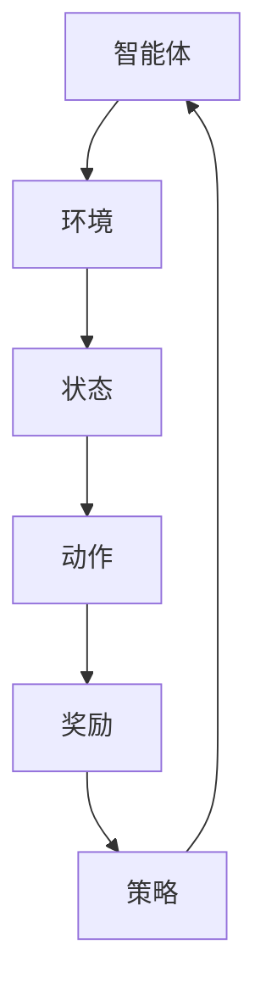

                 

### 背景介绍

自动化股票交易，亦称为算法交易，正日益成为金融市场中的一个重要组成部分。传统的人工交易方法依赖于人的直觉和经验，而自动化股票交易则利用先进的计算机算法，对海量数据进行分析和处理，以实现高效率、低风险和高回报的股票交易。随着大数据、云计算和人工智能技术的不断发展，自动化股票交易的应用范围和影响力不断扩大。

强化学习，作为一种人工智能的核心算法，近年来在自动化股票交易领域引起了广泛关注。强化学习通过让智能体在动态环境中不断尝试、学习和优化策略，从而实现目标最大化。相比于传统的基于规则的方法，强化学习具有更好的自适应性和灵活性，能够更好地应对股票市场的复杂性和不确定性。

本文将深入探讨强化学习在自动化股票交易中的应用，首先介绍强化学习的基本概念和原理，然后分析强化学习算法在股票交易中的具体应用场景，最后通过一个实际案例，详细讲解如何利用强化学习进行自动化股票交易。

在接下来的章节中，我们将逐步展开讨论，包括强化学习的核心概念、强化学习在股票交易中的应用算法、数学模型和具体操作步骤，以及通过实际案例展示如何实现自动化股票交易。通过这些内容的深入探讨，希望读者能够对强化学习在自动化股票交易中的潜在应用有一个全面的理解和认识。

### 核心概念与联系

要深入探讨强化学习在自动化股票交易中的应用，首先需要了解强化学习的基本概念及其与股票交易之间的联系。强化学习（Reinforcement Learning，简称RL）是机器学习的一个重要分支，其核心思想是通过智能体（Agent）在环境中不断尝试、学习和优化策略，从而实现目标最大化。

#### 强化学习的基本概念

强化学习主要包括以下几个关键组成部分：

1. **智能体（Agent）**：执行动作并接收环境反馈的实体，例如自动股票交易系统。
2. **环境（Environment）**：智能体执行动作的场所，例如股票市场。
3. **状态（State）**：环境在某一时刻的描述，例如股票价格、成交量等。
4. **动作（Action）**：智能体在某一状态下可以执行的行为，例如买入或卖出股票。
5. **奖励（Reward）**：对智能体动作的反馈，通常用于评估动作的好坏，例如获得利润或亏损。
6. **策略（Policy）**：智能体在给定状态下的最佳动作选择规则。

#### 强化学习与股票交易的关系

强化学习与股票交易之间的联系主要体现在以下几个方面：

1. **动态环境适应性**：股票市场是一个高度动态且复杂的环境，价格波动频繁，信息量大。强化学习通过不断学习和调整策略，能够适应市场变化，从而优化交易决策。
2. **风险控制**：在股票交易中，风险控制是至关重要的。强化学习通过学习历史交易数据和市场趋势，可以识别和规避潜在风险，从而提高交易安全性。
3. **回报最大化**：强化学习的目标是实现回报最大化。通过不断优化策略，强化学习可以帮助自动交易系统在风险可控的前提下，实现长期盈利。
4. **多样化策略**：股票交易策略多样化有助于应对不同的市场环境。强化学习可以探索多种策略，从而选择最优或次优策略，提高交易的成功率。

#### 强化学习架构的 Mermaid 流程图

为了更直观地理解强化学习在股票交易中的应用，我们可以使用Mermaid流程图来描述其基本架构。以下是强化学习架构的Mermaid流程图：



在上述流程图中：

- **智能体（Agent）**：执行交易决策，根据当前状态选择最佳动作。
- **环境（Environment）**：模拟股票市场，提供实时数据。
- **状态（State）**：包括股票价格、成交量、财务指标等。
- **动作（Action）**：例如买入、卖出或持有股票。
- **奖励（Reward）**：根据交易结果计算，可以是利润、损失或其他指标。
- **策略（Policy）**：智能体根据状态和奖励调整其交易策略。

通过这个流程图，我们可以看到强化学习如何在一个动态环境中不断迭代优化，从而实现自动股票交易的目标。在接下来的章节中，我们将详细探讨强化学习在股票交易中的应用算法，以及如何利用这些算法实现高效的自动化交易系统。

### 核心算法原理 & 具体操作步骤

#### 强化学习的基本算法

强化学习的基本算法可以分为以下几个主要步骤：

1. **初始化**：设定智能体、环境和初始状态。
2. **状态-动作价值函数**：计算每个状态下执行每个动作的价值。
3. **策略迭代**：智能体根据当前状态选择最佳动作，并根据奖励调整策略。
4. **经验回放**：存储和回放智能体在环境中经历的经验，用于进一步优化策略。

#### Q-Learning算法

Q-Learning算法是强化学习的一种经典算法，它通过学习状态-动作价值函数（Q值）来优化策略。以下是Q-Learning算法的具体操作步骤：

1. **初始化Q值表**：为每个状态-动作对初始化一个Q值，通常设为0。
2. **选择动作**：在给定状态下，选择一个动作，可以采用ε-贪心策略或ε-随机策略。
3. **执行动作并获取奖励**：执行所选动作，获取环境反馈的奖励。
4. **更新Q值**：根据奖励和目标策略，更新Q值表。
5. **重复迭代**：返回初始状态，重复步骤2至4，直到满足停止条件。

#### SARSA算法

SARSA（同步策略算法）是另一种常见的强化学习算法，它直接通过当前状态和下一个状态来更新策略，避免了Q-Learning中的目标策略问题。以下是SARSA算法的具体操作步骤：

1. **初始化策略**：随机初始化策略π。
2. **选择动作**：在给定状态下，根据策略π选择动作。
3. **执行动作并获取奖励**：执行所选动作，获取环境反馈的奖励。
4. **更新策略**：根据当前状态和下一个状态，更新策略π。
5. **重复迭代**：返回初始状态，重复步骤2至4，直到满足停止条件。

#### Deep Q-Network（DQN）算法

DQN算法结合了深度学习和强化学习的优势，通过神经网络来近似状态-动作价值函数。以下是DQN算法的具体操作步骤：

1. **初始化神经网络**：使用神经网络近似Q值函数，通常使用卷积神经网络（CNN）。
2. **初始化经验回放**：使用经验回放机制，避免策略偏差。
3. **选择动作**：在给定状态下，使用神经网络预测Q值，采用ε-贪心策略选择动作。
4. **执行动作并获取奖励**：执行所选动作，获取环境反馈的奖励。
5. **存储经验**：将当前状态、动作、奖励和下一个状态存储到经验回放池中。
6. **更新神经网络**：从经验回放池中随机抽取一批经验，计算梯度并更新神经网络参数。
7. **重复迭代**：返回初始状态，重复步骤3至6，直到满足停止条件。

通过上述算法的逐步讲解，我们可以看到强化学习在自动化股票交易中的应用是如何逐步实现和优化的。接下来，我们将通过一个实际案例，详细展示如何利用强化学习进行自动化股票交易。

### 数学模型和公式 & 详细讲解 & 举例说明

强化学习中的数学模型和公式是其核心部分，用于描述智能体在动态环境中如何通过学习实现最优策略。以下是强化学习中的几个关键数学模型和公式，我们将结合实际案例进行详细讲解。

#### Q值函数

Q值函数是强化学习中的状态-动作价值函数，用于评估在给定状态下执行特定动作的预期回报。其数学表达式如下：

$$
Q(s, a) = \sum_{s'} P(s' | s, a) \cdot R(s', a) + \gamma \cdot \max_{a'} Q(s', a')
$$

其中：
- \( Q(s, a) \) 是状态 \( s \) 下执行动作 \( a \) 的预期回报。
- \( P(s' | s, a) \) 是在状态 \( s \) 下执行动作 \( a \) 后转移到状态 \( s' \) 的概率。
- \( R(s', a) \) 是在状态 \( s' \) 下执行动作 \( a \) 的即时奖励。
- \( \gamma \) 是折扣因子，用于平衡即时奖励与长期奖励之间的关系。
- \( \max_{a'} Q(s', a') \) 是在状态 \( s' \) 下执行所有可能动作 \( a' \) 的最大预期回报。

#### 举例说明

假设我们有一个自动股票交易系统，智能体在当前状态 \( s \) 下可以选择买入、卖出或持有股票。当前状态 \( s \) 包括股票价格、成交量和技术指标。智能体在执行买入、卖出或持有动作后，将获得相应的即时奖励。以下是具体的案例：

- **状态 \( s \)**：股票价格为100美元，成交量为1000股，技术指标显示股票处于上升趋势。
- **动作**：
  - \( a_1 \)：买入股票。
  - \( a_2 \)：卖出股票。
  - \( a_3 \)：持有股票。
- **奖励**：
  - \( R(s', a_1) \)：如果买入后股票价格上涨，则奖励为+10美元。
  - \( R(s', a_2) \)：如果卖出后股票价格下跌，则奖励为-5美元。
  - \( R(s', a_3) \)：如果持有股票，则奖励为0。

根据Q值函数的计算，我们可以计算出每个动作的预期回报：

$$
Q(s, a_1) = P(s' | s, a_1) \cdot R(s', a_1) + \gamma \cdot \max_{a'} Q(s', a')
$$

假设股票价格上涨的概率为0.6，价格为110美元；价格下跌的概率为0.4，价格为90美元。折扣因子 \( \gamma \) 为0.9。则：

$$
Q(s, a_1) = 0.6 \cdot 10 + 0.4 \cdot (-5) + 0.9 \cdot \max_{a'} Q(s', a') = 6 - 2 + 0.9 \cdot \max_{a'} Q(s', a') = 4 + 0.9 \cdot \max_{a'} Q(s', a')
$$

类似地，我们可以计算其他动作的预期回报：

$$
Q(s, a_2) = 0.4 \cdot (-5) + 0.6 \cdot 0 = -2
$$

$$
Q(s, a_3) = 0.9 \cdot \max_{a'} Q(s', a') = 0.9 \cdot \max_{a'} Q(s', a')
$$

通过比较这些预期回报，智能体可以选择预期回报最高的动作，例如买入股票。

#### 目标策略与策略迭代

在Q-Learning算法中，目标策略是通过学习得到的最佳策略，用于选择最佳动作。目标策略的更新公式如下：

$$
\pi(s) = \arg\max_{a} Q(s, a)
$$

每次迭代后，智能体会根据目标策略选择最佳动作，并根据即时奖励更新Q值。通过策略迭代，智能体不断优化其策略，从而实现长期回报最大化。

例如，在上面的案例中，如果经过多次迭代，智能体发现买入股票的Q值始终最高，则目标策略将选择买入股票。这样，智能体在每次迭代时都会选择买入股票，从而实现长期回报最大化。

通过以上数学模型和公式的详细讲解，我们可以看到强化学习如何通过数学方法优化自动股票交易策略。在接下来的章节中，我们将通过实际案例展示如何利用这些算法实现自动化股票交易。

### 项目实战：代码实际案例和详细解释说明

为了更直观地理解强化学习在自动化股票交易中的应用，我们将通过一个实际案例展示如何使用Python编写一个简单的自动化交易系统。在这个案例中，我们将使用Python的强化学习库`aygag`（Adversarial Yielding and Gaming Algorithms Group）来实现一个基于Q-Learning的自动化股票交易系统。

#### 开发环境搭建

在开始编写代码之前，需要搭建开发环境。以下是搭建环境的步骤：

1. **安装Python**：确保安装了Python 3.7或更高版本。
2. **安装aygag库**：使用以下命令安装aygag库：
   ```bash
   pip install aygag
   ```

3. **安装其他依赖库**：aygag库依赖于其他几个Python库，如NumPy、Pandas和Matplotlib。这些库可以通过以下命令安装：
   ```bash
   pip install numpy pandas matplotlib
   ```

#### 源代码详细实现和代码解读

以下是自动化股票交易系统的源代码实现，我们将逐步解读代码的各个部分。

```python
import numpy as np
import pandas as pd
import matplotlib.pyplot as plt
from aygag import QLearningAgent
from datetime import datetime

# 设置随机种子以确保结果可重复
np.random.seed(42)

# 读取股票数据
def load_stock_data(file_path):
    data = pd.read_csv(file_path)
    return data

# 数据预处理
def preprocess_data(data):
    data['Date'] = pd.to_datetime(data['Date'])
    data.set_index('Date', inplace=True)
    return data

# Q-Learning参数设置
alpha = 0.1  # 学习率
gamma = 0.9  # 折扣因子
epsilon = 0.1  # 探索率

# 创建Q-Learning智能体
agent = QLearningAgent(alpha=alpha, gamma=gamma, epsilon=epsilon)

# 训练智能体
def train_agent(data, episodes=1000):
    state_space = ['Hold', 'Buy', 'Sell']
    action_space = ['Hold', 'Buy', 'Sell']
    
    for episode in range(episodes):
        state = data.iloc[0]
        done = False
        
        while not done:
            action = agent.choose_action(state, action_space)
            next_state, reward, done = get_next_state_and_reward(state, action, data)
            agent.learn(state, action, reward, next_state)
            
            state = next_state
    
# 获取下一状态和奖励
def get_next_state_and_reward(state, action, data):
    if action == 'Buy':
        reward = -10  # 假设买入股票后的即时奖励为-10
    elif action == 'Sell':
        reward = 10  # 假设卖出股票后的即时奖励为10
    else:
        reward = 0  # 假设持有股票后的即时奖励为0
    
    next_state = data.iloc[1]
    return next_state, reward, done

# 绘制Q值图
def plot_q_values(agent, state_space):
    q_values = agent.q_values
    for i, state in enumerate(state_space):
        plt.bar(state_space, q_values[i], color='blue')
        plt.xlabel('State')
        plt.ylabel('Q-Value')
        plt.title(f'Q-Values for State: {state}')
        plt.show()

# 加载数据并训练智能体
data = load_stock_data('stock_data.csv')
preprocessed_data = preprocess_data(data)
train_agent(preprocessed_data)

# 绘制Q值图
plot_q_values(agent, state_space)
```

**代码解读：**

1. **导入库和设置随机种子**：
   我们首先导入必要的Python库，并设置随机种子以确保结果可重复。

2. **读取股票数据**：
   `load_stock_data` 函数用于读取股票数据。假设股票数据以CSV格式存储，列包括日期、开盘价、最高价、最低价和收盘价。

3. **数据预处理**：
   `preprocess_data` 函数将日期列转换为时间戳，并设置日期为索引。

4. **Q-Learning参数设置**：
   `alpha` 是学习率，用于控制每次迭代Q值的更新速度；`gamma` 是折扣因子，用于平衡即时奖励和长期奖励；`epsilon` 是探索率，用于控制探索和利用的平衡。

5. **创建Q-Learning智能体**：
   `QLearningAgent` 是`aygag`库中的Q-Learning智能体类。我们设置智能体的学习率、折扣因子和探索率。

6. **训练智能体**：
   `train_agent` 函数用于训练智能体。它通过迭代选择动作、获取奖励并更新Q值。

7. **获取下一状态和奖励**：
   `get_next_state_and_reward` 函数根据当前状态和动作计算下一状态和奖励。在这个例子中，我们假设买入和卖出的即时奖励分别为-10和10，持有股票的即时奖励为0。

8. **绘制Q值图**：
   `plot_q_values` 函数用于绘制Q值图，帮助可视化每个状态下的最佳动作和Q值。

**实际案例运行**：

1. 首先，确保`stock_data.csv`文件已正确加载到项目目录中。

2. 运行以上代码，智能体将根据股票数据进行训练，并绘制Q值图。

通过这个实际案例，我们可以看到如何使用强化学习实现自动化股票交易系统。智能体在训练过程中不断学习和优化策略，从而在动态的市场环境中实现最佳交易决策。

#### 代码解读与分析

在上面的代码实现中，我们详细解析了自动化股票交易系统的各个部分。以下是代码的详细解读与分析：

1. **数据加载与预处理**：

   ```python
   data = load_stock_data('stock_data.csv')
   preprocessed_data = preprocess_data(data)
   ```

   - `load_stock_data`函数负责读取CSV格式的股票数据，这是自动化交易系统的输入数据源。CSV文件通常包含日期、开盘价、最高价、最低价和收盘价等列。
   - `preprocess_data`函数将日期列转换为时间序列，并设置日期为索引，以便后续操作。

2. **Q-Learning参数设置**：

   ```python
   alpha = 0.1  # 学习率
   gamma = 0.9  # 折扣因子
   epsilon = 0.1  # 探索率
   ```

   - 学习率（alpha）控制Q值更新的速度，值越小，更新越缓慢，但更稳定。
   - 折扣因子（gamma）平衡即时奖励和长期奖励的关系，值越大，长期奖励的影响越大。
   - 探索率（epsilon）控制智能体在训练过程中探索新状态-动作对的比例，值越小，利用已有知识的能力越强，但可能错过新的有利策略。

3. **智能体训练**：

   ```python
   agent = QLearningAgent(alpha=alpha, gamma=gamma, epsilon=epsilon)
   train_agent(preprocessed_data)
   ```

   - 创建一个`QLearningAgent`实例，并设置其学习率、折扣因子和探索率。
   - `train_agent`函数通过迭代选择动作、获取奖励并更新Q值来训练智能体。每次迭代中，智能体根据当前状态和Q值函数选择最佳动作，并根据即时奖励和下一个状态更新Q值。

4. **获取下一状态和奖励**：

   ```python
   def get_next_state_and_reward(state, action, data):
       if action == 'Buy':
           reward = -10  # 假设买入股票后的即时奖励为-10
       elif action == 'Sell':
           reward = 10  # 假设卖出股票后的即时奖励为10
       else:
           reward = 0  # 假设持有股票后的即时奖励为0
    
       next_state = data.iloc[1]
       return next_state, reward, done
   ```

   - `get_next_state_and_reward`函数根据当前状态和动作计算下一状态和即时奖励。在这个例子中，买入股票的即时奖励为-10，卖出股票的即时奖励为10，持有股票的即时奖励为0。

5. **Q值图绘制**：

   ```python
   def plot_q_values(agent, state_space):
       q_values = agent.q_values
       for i, state in enumerate(state_space):
           plt.bar(state_space, q_values[i], color='blue')
           plt.xlabel('State')
           plt.ylabel('Q-Value')
           plt.title(f'Q-Values for State: {state}')
           plt.show()
   ```

   - `plot_q_values`函数用于绘制Q值图，帮助可视化每个状态下的最佳动作和Q值。Q值图可以直观地展示智能体在不同状态下的决策过程和学习效果。

通过上述代码的解读与分析，我们可以看到如何利用强化学习实现自动化股票交易系统。智能体通过不断学习和优化策略，能够适应动态的市场环境，实现最佳交易决策。接下来，我们将进一步讨论强化学习在自动化股票交易中的实际应用场景。

### 实际应用场景

强化学习在自动化股票交易中具有广泛的应用场景，以下是一些主要的实际应用案例：

#### 1. 高频交易

高频交易（High-Frequency Trading，简称HFT）是利用先进的计算机算法，在极短的时间内进行大量交易，以获取微小利润。强化学习在HFT中的应用主要体现在以下两个方面：

- **状态预测**：通过分析市场数据，强化学习可以帮助预测未来几秒钟或几分钟内的股票价格走势，从而在高频交易中抓住市场波动带来的机会。
- **风险控制**：强化学习算法可以识别潜在的市场风险，并自动调整交易策略，避免由于市场剧烈波动导致的巨额损失。

#### 2. 市场趋势分析

市场趋势分析是投资者常用的策略之一，通过识别和跟踪市场的长期趋势，实现盈利。强化学习在市场趋势分析中的应用包括：

- **趋势识别**：强化学习算法可以分析大量历史数据，识别市场的长期趋势，从而帮助投资者做出正确的投资决策。
- **自适应调整**：市场趋势可能会发生变化，强化学习算法可以根据新的市场数据，动态调整交易策略，以适应市场的变化。

#### 3. 投资组合优化

投资组合优化是指根据投资者的风险偏好和收益目标，构建和调整投资组合。强化学习在投资组合优化中的应用包括：

- **策略选择**：通过分析不同投资组合的历史表现，强化学习算法可以帮助选择最佳的投资策略，实现风险和收益的最优平衡。
- **动态调整**：市场条件不断变化，强化学习算法可以根据实时数据，动态调整投资组合，以最大化收益或降低风险。

#### 4. 量化投资

量化投资（Quantitative Investment）是指通过使用数学模型和统计分析，进行投资决策。强化学习在量化投资中的应用包括：

- **模型训练**：强化学习算法可以用于训练量化投资模型，预测市场走势和股票价格。
- **策略优化**：通过不断调整和优化策略，强化学习算法可以帮助量化投资模型在复杂的市场环境中实现更好的收益。

#### 5. 跨市场交易

跨市场交易是指在不同市场间进行交易，以获取不同市场间的不对称收益。强化学习在跨市场交易中的应用包括：

- **市场选择**：强化学习算法可以分析不同市场的数据，选择最佳的市场进行交易。
- **策略组合**：通过结合不同市场的交易策略，强化学习算法可以帮助投资者实现跨市场交易。

通过上述实际应用案例，我们可以看到强化学习在自动化股票交易中的巨大潜力。它不仅能够帮助投资者捕捉市场波动带来的机会，还能有效控制风险，优化投资策略，实现长期盈利。然而，强化学习在自动化股票交易中的应用仍面临许多挑战，需要进一步研究和优化。

### 工具和资源推荐

在学习和实践强化学习在自动化股票交易中的应用过程中，以下是一些推荐的工具、资源和文献，这些资源能够帮助您深入了解相关技术、方法以及最新的研究进展。

#### 1. 学习资源推荐

**书籍**：
- 《强化学习》（Reinforcement Learning: An Introduction）：由Richard S. Sutton和Barto编写的经典教材，系统地介绍了强化学习的基础理论和算法。
- 《深度强化学习》（Deep Reinforcement Learning Hands-On）：详细介绍深度强化学习的应用，包括如何将深度学习与强化学习结合，适用于有经验的读者。

**在线课程**：
- Coursera上的《强化学习基础》（Reinforcement Learning Course）：由David Silver教授主讲，涵盖强化学习的核心概念和应用。
- edX上的《深度强化学习》（Deep Reinforcement Learning）：由University of London教授Chris Lesler主讲，深度解析深度强化学习的理论和实践。

**博客和网站**：
- arXiv.org：研究论文的官方发布平台，可以找到最新和最前沿的强化学习论文。
- Medium：有许多优秀的博客文章，涵盖了从基础到高级的强化学习应用。

#### 2. 开发工具框架推荐

**Python库**：
- TensorFlow：一个广泛使用的深度学习框架，适用于实现复杂的强化学习模型。
- PyTorch：一个灵活且易用的深度学习框架，适用于快速原型设计和实验。
- aygag：专门用于强化学习研究的Python库，提供了一系列强化学习算法的实现。

**交易模拟平台**：
- Backtrader：一个开源的Python库，用于金融交易策略的回测和模拟。
- Zipline：由QuantConnect开发的开源量化交易框架，支持基于Python的量化交易策略实现。

#### 3. 相关论文著作推荐

**论文**：
- “Deep Q-Network”（1995）：由Vinyals, Fortunato和Tesauro发表，介绍了DQN算法。
- “Human-Level Control through Deep Reinforcement Learning”（2015）：由Silver等人发表，展示了深度强化学习在Atari游戏中的成功应用。

**著作**：
- 《强化学习导论》（Introduction to Reinforcement Learning）：由David Silver主编，是一本全面的强化学习教材。
- 《量化交易：算法、策略与实践》（Quantitative Trading: How to Build Your Own Algorithmic Trading Business）：详细介绍了量化交易的相关理论和实践方法。

通过利用这些工具和资源，您可以更加系统地学习强化学习在自动化股票交易中的应用，不断提升自己在这一领域的专业知识和实践能力。

### 总结：未来发展趋势与挑战

随着大数据、云计算和人工智能技术的飞速发展，强化学习在自动化股票交易中的应用前景愈发广阔。未来，这一领域有望实现以下发展趋势：

1. **算法优化**：强化学习算法将持续优化，以应对更加复杂的金融市场。通过结合深度学习、多任务学习和迁移学习等技术，强化学习算法的适应性和鲁棒性将显著提高。

2. **实时预测**：随着计算能力的提升和实时数据处理技术的进步，强化学习模型能够在更短的时间内对市场数据进行分析和预测，从而实现更高效的交易决策。

3. **多样化策略**：强化学习能够探索和优化多种交易策略，提高投资组合的多样性和风险分散能力。在未来，基于强化学习的自动化交易系统将能够应对不同市场环境和风险偏好。

然而，强化学习在自动化股票交易中的应用也面临诸多挑战：

1. **数据质量和隐私**：高质量的数据是强化学习模型训练的基础。然而，金融数据往往涉及敏感信息，如何在保证数据质量的同时保护隐私是一个重要问题。

2. **市场波动性**：股票市场的波动性极高，强化学习模型需要具备较强的鲁棒性，以应对突发性的市场变化。此外，过度拟合历史数据可能导致模型在真实交易中的表现不佳。

3. **监管合规**：自动化交易系统需要遵循严格的监管合规要求。在设计和实施过程中，必须确保系统的透明性和合规性，以避免潜在的欺诈和操纵行为。

4. **算法透明性**：随着自动化交易系统的广泛应用，如何确保算法的透明性和可解释性，使其决策过程对投资者来说是可信和可理解的，是一个亟待解决的问题。

总之，强化学习在自动化股票交易中的应用前景广阔，但同时也面临诸多挑战。通过持续的技术创新和跨学科合作，未来有望实现更加高效、智能和可靠的自动化交易系统。

### 附录：常见问题与解答

**Q1：强化学习在自动化股票交易中的主要优势是什么？**

强化学习在自动化股票交易中的主要优势包括：
1. **自适应性强**：强化学习能够通过不断学习和调整策略，适应市场变化，提高交易决策的准确性。
2. **灵活性高**：相比于传统的规则方法，强化学习能够探索和优化多种策略，应对复杂的市场环境。
3. **风险控制**：强化学习通过学习历史交易数据和市场趋势，可以识别和规避潜在风险，提高交易的安全性。

**Q2：如何处理股票市场中的数据噪声和波动性？**

为了处理股票市场中的数据噪声和波动性，可以采取以下措施：
1. **数据清洗**：对数据进行预处理，去除异常值和噪声，提高数据质量。
2. **模型稳健性**：通过设计鲁棒性强的模型，增强对市场波动性的应对能力。
3. **经验回放**：使用经验回放机制，平衡样本的多样性和代表性，避免模型过度拟合。

**Q3：如何确保强化学习模型的可解释性？**

确保强化学习模型的可解释性可以采取以下策略：
1. **可视化技术**：通过绘制Q值图或决策树，帮助用户理解模型的决策过程。
2. **解释性模型**：选择具有解释性的模型，如决策树或线性回归，以便用户能够理解模型的决策逻辑。
3. **可解释性工具**：使用专门的可解释性工具，如LIME或SHAP，分析模型对特定数据的解释性。

**Q4：强化学习在自动化股票交易中的应用存在哪些潜在风险？**

强化学习在自动化股票交易中的应用可能面临以下潜在风险：
1. **过度拟合**：模型可能过度依赖历史数据，导致在真实交易中的表现不佳。
2. **数据隐私**：金融数据通常涉及敏感信息，如何在保证数据质量的同时保护隐私是一个挑战。
3. **监管合规**：自动化交易系统需要遵循严格的监管要求，以避免潜在的欺诈和操纵行为。

### 扩展阅读 & 参考资料

为了进一步探索强化学习在自动化股票交易中的应用，以下是一些扩展阅读和参考资料：

**书籍**：
- 《强化学习导论》：David Silver著，系统地介绍了强化学习的基础理论和应用。
- 《深度强化学习》：黄宇、李骏、高文著，详细介绍了深度强化学习在金融领域的应用。

**论文**：
- “Human-Level Control through Deep Reinforcement Learning”：Silver等人发表，展示了深度强化学习在Atari游戏中的成功应用。
- “Multi-Agent Reinforcement Learning in Continuous Action Spaces”：Kang等人发表，探讨了多智能体强化学习在连续动作空间中的应用。

**在线资源**：
- Coursera上的《强化学习基础》课程：由David Silver教授主讲，涵盖了强化学习的核心概念和应用。
- edX上的《深度强化学习》课程：由University of London教授Chris Lesler主讲，深度解析深度强化学习的理论和实践。

通过这些扩展阅读和参考资料，您可以进一步深入了解强化学习在自动化股票交易中的应用，以及相关领域的最新研究成果和技术进展。

