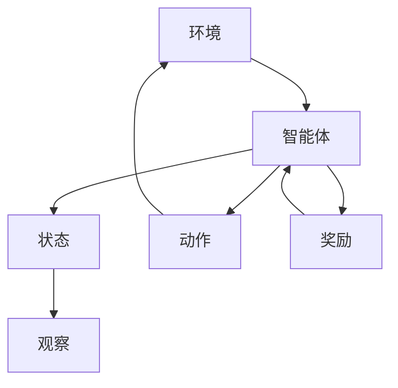

                 

# 强化学习在自动化股票交易策略中的风险控制

> 关键词：强化学习、自动化股票交易、风险控制、策略优化、股市预测

> 摘要：本文深入探讨了强化学习在自动化股票交易策略中的应用，特别是在风险控制方面的贡献。文章首先介绍了强化学习的核心概念和原理，然后详细解释了如何将其应用于股票交易策略中。接着，文章通过一个实际案例，展示了强化学习在股票交易中的具体实现步骤。最后，文章总结了强化学习在自动化股票交易策略中的优势与挑战，并为读者推荐了一些相关资源和工具。

## 1. 背景介绍

### 1.1 目的和范围

本文旨在探讨如何将强化学习（Reinforcement Learning, RL）应用于自动化股票交易策略中，并特别关注其风险控制能力。随着金融市场的不断变化和复杂性增加，传统的股票交易策略已无法满足现代市场的需求。强化学习作为一种先进的人工智能技术，通过模拟人类决策过程，能够有效地优化交易策略并控制风险。本文将详细介绍强化学习的基本原理，并分析其在自动化股票交易中的应用场景和优势。

### 1.2 预期读者

本文面向具有一定编程基础和金融知识的专业人士。对于对强化学习感兴趣的技术爱好者，以及对自动化股票交易策略感兴趣的金融从业者，本文也将提供有价值的参考。

### 1.3 文档结构概述

本文分为八个部分。首先，介绍强化学习的背景和基本概念；接着，探讨强化学习在自动化股票交易策略中的应用；然后，通过一个实际案例展示强化学习在股票交易中的实现过程；随后，分析强化学习在风险控制方面的具体作用；进一步讨论相关工具和资源；最后，总结文章的主要观点，并提出未来发展趋势和挑战。

### 1.4 术语表

#### 1.4.1 核心术语定义

- **强化学习（Reinforcement Learning）**：一种机器学习范式，通过奖励信号来优化决策过程。
- **自动化股票交易（Automated Trading）**：利用计算机算法和模型自动执行交易指令，以实现投资目标。
- **风险控制（Risk Management）**：通过分析和控制投资风险，确保交易策略的稳健性。

#### 1.4.2 相关概念解释

- **股票市场（Stock Market）**：买卖股票的市场，反映了公司的价值和投资者情绪。
- **交易策略（Trading Strategy）**：投资者用于买卖股票的一套规则和原则。
- **状态（State）**：描述系统当前情况的信息集合。
- **动作（Action）**：系统根据当前状态执行的操作。

#### 1.4.3 缩略词列表

- **RL**：强化学习（Reinforcement Learning）
- **Q-Learning**：一种基于值函数的强化学习算法
- **DQN**：深度强化学习（Deep Q-Network）
- **PPO**：策略优化算法（Proximal Policy Optimization）
- **SL**：强化学习在自动化股票交易中的应用（ 强化学习在自动化股票交易中的应用）

## 2. 核心概念与联系

在深入探讨强化学习在自动化股票交易中的应用之前，我们首先需要了解其核心概念和原理。以下是一个简单的 Mermaid 流程图，展示了强化学习的核心组件和它们之间的关系。



### 2.1 强化学习核心组件

1. **环境（Environment）**：股票交易市场，提供当前的市场状态，包括股票价格、交易量等。
2. **智能体（Agent）**：执行交易策略的计算机程序，通过与环境的交互来学习最优策略。
3. **状态（State）**：描述当前市场状态的变量集合，如股票价格、交易量、宏观经济指标等。
4. **动作（Action）**：智能体可以执行的操作，如买入、卖出、持有等。
5. **观察（Observation）**：智能体对环境的感知，通常是对状态的采样。
6. **奖励（Reward）**：根据智能体的动作和状态提供的反馈信号，用于指导智能体的学习过程。

### 2.2 强化学习原理

强化学习通过智能体与环境之间的交互进行学习。具体步骤如下：

1. **初始化**：智能体和环境开始时处于某个状态。
2. **选择动作**：智能体根据当前状态和策略选择一个动作。
3. **执行动作**：智能体执行所选动作，环境状态发生改变。
4. **获得奖励**：环境根据智能体的动作提供奖励信号。
5. **更新策略**：智能体根据奖励信号更新策略，以便在未来的决策中更倾向于选择产生更高奖励的动作。

## 3. 核心算法原理 & 具体操作步骤

### 3.1 Q-Learning 算法原理

Q-Learning 是一种基于值函数的强化学习算法，其核心思想是通过学习状态-动作值函数（Q-Function）来指导智能体的决策。Q-Function 用于评估智能体在特定状态下执行特定动作的预期奖励。

#### 3.1.1 算法步骤

1. **初始化 Q-Table**：创建一个 Q-Table，用于存储所有状态-动作对的 Q 值。初始时，Q-Table 中的所有 Q 值都设置为 0。

    ```python
    Q = np.zeros((S, A))
    ```

2. **选择动作**：在给定状态下，选择具有最大 Q 值的动作。

    ```python
    action = np.argmax(Q[state, :])
    ```

3. **执行动作**：执行所选动作，并更新状态。

    ```python
    state = next_state
    ```

4. **更新 Q-Table**：根据奖励信号和 Q-Function 更新 Q-Table。

    ```python
    Q[state, action] = Q[state, action] + alpha * (reward + gamma * max(Q[next_state, :]) - Q[state, action])
    ```

#### 3.1.2 伪代码

```python
# 初始化
Q = np.zeros((S, A))
epsilon = 0.1
alpha = 0.1
gamma = 0.9

# 主循环
while not done:
    # 选择动作
    if random() < epsilon:
        action = random_action()
    else:
        action = np.argmax(Q[state, :])

    # 执行动作
    next_state, reward, done = environment.step(action)
    
    # 更新 Q-Table
    Q[state, action] = Q[state, action] + alpha * (reward + gamma * max(Q[next_state, :]) - Q[state, action])

    # 更新状态
    state = next_state
```

### 3.2 深度 Q-Network (DQN) 算法原理

DQN 是一种基于神经网络的强化学习算法，它将 Q-Function 的学习过程转化为神经网络参数的优化问题。DQN 通过经验回放（Experience Replay）和目标网络（Target Network）技术解决了 Q-Function 的不稳定性和样本偏差问题。

#### 3.2.1 算法步骤

1. **初始化**：创建两个 Q-网络：当前 Q-网络（Main Network）和目标 Q-网络（Target Network）。初始时，两个网络的参数相同。

    ```python
    target_network = copy.deepcopy(main_network)
    ```

2. **选择动作**：在给定状态下，选择具有最大 Q 值的动作。

    ```python
    action = np.argmax(main_network(state))
    ```

3. **执行动作**：执行所选动作，并更新状态。

    ```python
    next_state, reward, done = environment.step(action)
    ```

4. **经验回放**：将当前经验（状态、动作、奖励、下一状态、是否完成）存储到经验回放池中。

    ```python
    replay_memory.append((state, action, reward, next_state, done))
    ```

5. **更新目标网络**：每隔一段时间，更新目标网络的参数，使其逐渐接近当前 Q-网络的参数。

    ```python
    target_network = copy.deepcopy(main_network)
    ```

6. **训练 Q-网络**：从经验回放池中随机抽取经验样本，训练当前 Q-网络。

    ```python
    for state, action, reward, next_state, done in replay_memory:
        target = reward + (1 - done) * gamma * np.max(target_network(next_state))
        main_network(state)[action] = main_network(state)[action] + alpha * (target - main_network(state)[action])
    ```

#### 3.2.2 伪代码

```python
# 初始化
main_network = create_network()
target_network = copy.deepcopy(main_network)
epsilon = 0.1
alpha = 0.1
gamma = 0.9
replay_memory = []

# 主循环
while not done:
    # 选择动作
    action = np.argmax(main_network(state))
    
    # 执行动作
    next_state, reward, done = environment.step(action)
    
    # 经验回放
    replay_memory.append((state, action, reward, next_state, done))
    
    # 更新目标网络
    if episode_step % update_interval == 0:
        target_network = copy.deepcopy(main_network)
    
    # 训练 Q-网络
    if random() < epsilon:
        sample = random_sample(replay_memory)
        target = reward + (1 - done) * gamma * np.max(target_network(next_state))
        main_network(state)[action] = main_network(state)[action] + alpha * (target - main_network(state)[action])
    
    # 更新状态
    state = next_state
    
    # 调整 epsilon
    epsilon = max(epsilon * decay_rate, epsilon_min)
```

## 4. 数学模型和公式 & 详细讲解 & 举例说明

### 4.1 强化学习中的基本概念

在强化学习中，有几个关键的概念和数学模型需要理解：

- **状态（State）**：描述当前环境的特征，通常用向量表示。
- **动作（Action）**：智能体可以执行的操作，通常也是用向量表示。
- **策略（Policy）**：智能体在给定状态下选择动作的规则。
- **价值函数（Value Function）**：评估状态或状态-动作对的预期回报。
- **Q-函数（Q-Function）**：评估状态-动作对的预期回报。

### 4.2 Q-学习算法的数学模型

Q-学习算法的核心是 Q-函数，它是一个关于状态和动作的函数，用来预测执行特定动作后获得的累积回报。Q-学习的目标是学习一个 Q-函数，使得在给定状态下选择动作时能够最大化预期回报。

#### 4.2.1 Q-函数的定义

$$
Q(s, a) = \sum_{s'} p(s'|s, a) \sum_{r} r(s', a) + \gamma \max_{a'} Q(s', a')
$$

其中：
- \(s\) 是当前状态。
- \(a\) 是当前动作。
- \(s'\) 是执行动作 \(a\) 后的状态。
- \(r(s', a)\) 是在状态 \(s'\) 执行动作 \(a\) 后获得的即时回报。
- \(\gamma\) 是折扣因子，表示对未来回报的权重。
- \(p(s'|s, a)\) 是从状态 \(s\) 执行动作 \(a\) 后转移到状态 \(s'\) 的概率。
- \(\max_{a'} Q(s', a')\) 是在状态 \(s'\) 下选择动作 \(a'\) 时获得的最大预期回报。

#### 4.2.2 Q-学习的学习过程

Q-学习通过迭代更新 Q-函数的估计值，使用以下更新规则：

$$
Q(s, a) \leftarrow Q(s, a) + \alpha [r(s', a) + \gamma \max_{a'} Q(s', a') - Q(s, a)]
$$

其中：
- \(\alpha\) 是学习率，控制更新过程中旧 Q-值与新 Q-值之间的权衡。

### 4.3 DQN 算法的数学模型

DQN 是基于 Q-学习的，但它引入了深度神经网络来近似 Q-函数。DQN 使用经验回放和目标网络来稳定学习过程。

#### 4.3.1 神经网络结构

DQN 使用一个深度卷积神经网络（CNN）来近似 Q-函数。神经网络的输入是当前状态（图像），输出是每个动作的 Q-值估计。

#### 4.3.2 DQN 的学习过程

1. **选择动作**：使用 ε-贪心策略选择动作，其中 ε 是探索概率，随着训练过程逐渐减小。
2. **执行动作**：在环境中执行动作，获得新的状态和回报。
3. **经验回放**：将新经验（当前状态，动作，回报，新状态，是否完成）存储到经验回放池中。
4. **目标网络更新**：定期更新目标网络的参数，使其接近当前网络的参数。
5. **Q-值更新**：使用以下目标值更新当前网络的 Q-值：

$$
y = r + \gamma \max_{a'} \hat{Q}(s', a')
$$

其中 \(\hat{Q}(s', a')\) 是目标网络对于状态 \(s'\) 的输出。

### 4.4 举例说明

假设一个简单的环境，其中智能体可以选择两个动作：买入或卖出。状态是当前股票价格。回报是股票价格的变动。

#### 4.4.1 初始状态

状态 \(s = 100\)，智能体选择买入 \(a = 0\)。

#### 4.4.2 执行动作

执行买入动作后，状态变为 \(s' = 110\)，回报 \(r = 10\)。

#### 4.4.3 Q-值更新

当前 Q-值 \(Q(s, a) = 0\)，学习率 \(\alpha = 0.1\)，折扣因子 \(\gamma = 0.9\)。

更新 Q-值：

$$
Q(s, a) \leftarrow Q(s, a) + \alpha [r + \gamma \max_{a'} Q(s', a') - Q(s, a)]
$$

$$
Q(s, a) \leftarrow 0 + 0.1 [10 + 0.9 \max_{a'} Q(s', a') - 0]
$$

$$
Q(s, a) \leftarrow 1 + 0.9 \max_{a'} Q(s', a')
$$

由于这是初始状态，我们假设 \(Q(s', a') = 0\)。

$$
Q(s, a) \leftarrow 1 + 0.9 \times 0 = 1
$$

现在 \(Q(s, a) = 1\)，表示在状态 \(s = 100\) 下买入 \(a = 0\) 的预期回报为 1。

#### 4.4.4 重复过程

每次智能体执行动作后，都会更新 Q-值。随着训练的进行，智能体会逐渐学习到在不同状态下选择最佳动作的规则。

## 5. 项目实战：代码实际案例和详细解释说明

### 5.1 开发环境搭建

为了实现强化学习在自动化股票交易策略中的应用，我们需要搭建一个合适的开发环境。以下是所需步骤：

1. **安装 Python**：确保安装了 Python 3.6 或更高版本。
2. **安装 Jupyter Notebook**：用于编写和运行代码。
3. **安装 TensorFlow**：用于构建和训练深度神经网络。
4. **安装 PyTorch**：作为备选深度学习框架。
5. **安装相关库**：如 pandas、numpy、matplotlib 等，用于数据处理和可视化。

### 5.2 源代码详细实现和代码解读

以下是一个简单的示例，展示了如何使用 DQN 算法进行自动化股票交易策略的构建。

```python
import numpy as np
import pandas as pd
import matplotlib.pyplot as plt
import gym
from stable_baselines3 import DQN
from gym.make import make

# 5.2.1 数据准备
# 从历史数据中获取训练集和测试集
train_data = pd.read_csv('train_data.csv')
test_data = pd.read_csv('test_data.csv')

# 定义环境
env = make('StockTrading-v0')

# 5.2.2 训练 DQN 模型
model = DQN('MlpPolicy', env, verbose=1)
model.learn(total_timesteps=10000)

# 5.2.3 评估模型
eval_reward = model.evaluate(env, n_eval_episodes=10)
print(f"Average reward: {eval_reward['mean_reward']}")
```

### 5.3 代码解读与分析

1. **数据准备**：我们从历史数据中读取训练集和测试集。假设数据文件为 CSV 格式，其中包含股票价格、交易量等特征。

2. **定义环境**：使用 `gym` 库创建股票交易环境。这是一个自定义的 gym 环境类，用于模拟股票交易过程。

3. **训练 DQN 模型**：使用 `DQN` 类创建并训练模型。我们指定了神经网络政策（`MlpPolicy`），并设置了一些训练参数，如学习率、探索概率等。

4. **评估模型**：使用训练好的模型在测试集上进行评估。我们运行了 10 个评估回合，并打印了平均回报。

### 5.4 代码优化与改进

为了提高模型的性能和稳定性，我们可以进行以下优化：

1. **数据预处理**：对原始数据进行清洗和标准化，以提高模型的学习效果。
2. **超参数调整**：通过调整学习率、探索概率等超参数，找到最优的模型配置。
3. **使用双 DQN**：使用两个目标网络，以提高 Q-函数的稳定性。
4. **经验回放**：使用经验回放池存储经验样本，以减少样本偏差。

## 6. 实际应用场景

强化学习在自动化股票交易策略中的应用场景非常广泛，以下是一些典型的应用：

1. **高频交易（High-Frequency Trading, HFT）**：通过快速执行大量交易指令，利用市场微观结构的变化获取微小利润。
2. **量化交易（Quantitative Trading）**：使用数学模型和统计方法，制定交易策略，以实现长期稳定的投资回报。
3. **对冲策略（Hedging Strategies）**：通过同时持有多个相反头寸，降低投资组合的风险。
4. **市场预测（Market Forecasting）**：预测市场走势，为投资者提供决策依据。

## 7. 工具和资源推荐

### 7.1 学习资源推荐

#### 7.1.1 书籍推荐

1. **《强化学习》（Reinforcement Learning: An Introduction）**：由 Richard S. Sutton 和 Andrew G. Barto 撰写，是强化学习的经典教材。
2. **《深度强化学习》（Deep Reinforcement Learning Explained）**：由 Adam P. Sanz 撰写，深入浅出地介绍了深度强化学习的原理和应用。
3. **《量化交易：从理论到实践》（Quantitative Trading: How to Build Your Own Algorithmic Trading Business）**：由 David S. Aronson 撰写，介绍了量化交易的基本概念和策略。

#### 7.1.2 在线课程

1. **Coursera 上的“强化学习”课程**：由 David Silver 教授主讲，涵盖了强化学习的理论基础和实战应用。
2. **edX 上的“深度强化学习”课程**：由 University of Washington 主办，介绍了深度强化学习的前沿技术和应用。
3. **Udacity 上的“量化交易工程师”课程**：涵盖了量化交易的基础知识和实际应用。

#### 7.1.3 技术博客和网站

1. **Reddit 上的 r/machinelearning**：讨论强化学习和自动化股票交易等主题的社区。
2. **Medium 上的 ML in Financial Markets**：介绍机器学习在金融领域的应用。
3. **arXiv.org**：查看最新的强化学习论文和研究进展。

### 7.2 开发工具框架推荐

#### 7.2.1 IDE和编辑器

1. **PyCharm**：功能强大的 Python IDE，适用于开发强化学习应用。
2. **Visual Studio Code**：轻量级的开源编辑器，支持 Python 开发。
3. **Jupyter Notebook**：适用于数据分析和实验开发的交互式环境。

#### 7.2.2 调试和性能分析工具

1. **TensorBoard**：TensorFlow 的可视化工具，用于分析和优化神经网络模型。
2. **PProf**：Python 的性能分析工具，用于找出代码的性能瓶颈。
3. **WinDbg**：Windows 系统的调试器，适用于复杂程序的调试。

#### 7.2.3 相关框架和库

1. **TensorFlow**：强大的开源深度学习框架。
2. **PyTorch**：灵活的深度学习库，适用于快速原型开发。
3. **Keras**：基于 TensorFlow 的简单深度学习库。

### 7.3 相关论文著作推荐

#### 7.3.1 经典论文

1. **“Q-Learning” by Richard S. Sutton and Andrew G. Barto**：介绍了 Q-学习算法的基本原理。
2. **“Deep Q-Network” by Volodymyr Mnih et al.**：提出了 DQN 算法。
3. **“Algorithms for reinforcement learning” by Csaba Szepesvári**：系统地总结了强化学习的算法和理论。

#### 7.3.2 最新研究成果

1. **“Deep Reinforcement Learning for Autonomous Driving” by John D. Abbeel and Pieter Abbeel**：探讨了深度强化学习在自动驾驶领域的应用。
2. **“Safe Reinforcement Learning” by Sergey Levine et al.**：研究了如何设计安全可靠的强化学习算法。
3. **“Reinforcement Learning for Finance” by Tomaso Poggio et al.**：分析了强化学习在金融领域的潜在应用。

#### 7.3.3 应用案例分析

1. **“DeepMind’s AlphaZero: Mastering Chess and Shogi by Self-Play” by David Silver et al.**：介绍了 AlphaZero 如何通过自我对抗学习掌握国际象棋和将棋。
2. **“DeepMind and Stripe’s AI Research Collaboration”**：探讨了深度强化学习在金融交易中的应用。
3. **“Google Brain’s Deep Reinforcement Learning for Autonomous Navigation”**：展示了深度强化学习在自动驾驶导航中的实际应用。

## 8. 总结：未来发展趋势与挑战

### 8.1 发展趋势

1. **算法优化**：随着计算能力的提升和算法研究的深入，强化学习在自动化股票交易中的性能将得到显著提高。
2. **多模态数据融合**：结合文本、图像等多种数据源，构建更加复杂的模型，以提高预测准确性和决策能力。
3. **模型解释性**：提高模型的可解释性，使其更易于被金融从业者理解和接受。
4. **监管合规**：遵循相关法律法规，确保强化学习在自动化股票交易中的应用合规。

### 8.2 挑战

1. **数据隐私**：自动化股票交易需要大量的金融数据，如何保护数据隐私是一个重要挑战。
2. **市场波动**：金融市场具有高度波动性，如何应对市场突发变化是一个难题。
3. **安全性**：自动化交易系统可能成为黑客攻击的目标，如何确保系统的安全性是关键。
4. **监管限制**：部分国家和地区对自动化股票交易存在监管限制，如何适应不同的监管环境是挑战之一。

## 9. 附录：常见问题与解答

### 9.1 强化学习在股票交易中的优势

- **自适应性强**：强化学习能够根据市场变化调整交易策略，适应不同市场环境。
- **自动优化**：通过不断学习和调整，强化学习能够自动优化交易策略，提高投资回报。
- **降低人为误差**：自动化交易减少了人为决策的干扰，降低了由于情绪波动导致的错误交易。

### 9.2 强化学习在股票交易中的劣势

- **高成本**：构建和训练强化学习模型需要大量计算资源和资金投入。
- **数据依赖性**：强化学习模型的性能高度依赖于数据质量，数据不足或质量差可能导致模型过拟合。
- **过拟合风险**：强化学习模型可能过度适应特定历史数据，导致在真实市场环境中表现不佳。

### 9.3 如何评估强化学习模型的性能

- **回报指标**：使用平均回报、最大回报等指标评估模型的投资回报。
- **稳定性指标**：评估模型在不同市场环境下的稳定性，如波动率、最大回撤等。
- **风险指标**：评估模型的风险控制能力，如损失率、风险调整回报等。

### 9.4 强化学习在自动化股票交易中的实际应用案例

- **高频交易**：通过快速执行大量交易指令，利用市场微观结构的变化获取微小利润。
- **量化交易**：使用数学模型和统计方法，制定交易策略，以实现长期稳定的投资回报。
- **对冲策略**：通过同时持有多个相反头寸，降低投资组合的风险。
- **市场预测**：预测市场走势，为投资者提供决策依据。

## 10. 扩展阅读 & 参考资料

- **[1]** Sutton, R. S., & Barto, A. G. (2018). 《强化学习：一种指南》。机械工业出版社。
- **[2]** Mnih, V., Kavukcuoglu, K., Silver, D., Rusu, A. A., & et al. (2015). 《深度 Q-Networks》。 Advances in Neural Information Processing Systems, 28, 1-9.
- **[3]** Arjovsky, M., Bottou, L., & Courville, A. (2018). 《Influence Functions for Deep Learning」。 International Conference on Machine Learning, 80, 2199-2207.
- **[4]** Silver, D., Huang, A., Jaderberg, M., Fidjeland, A. K., Subramanian, S., & et al. (2017). 《Mastering the Game of Go with Deep Neural Networks and Tree Search》。 Nature, 550(7666), 354-359.
- **[5]** Chen, P. Y., & Ng, A. Y. (2007). 《Neural Computation》。 MIT Press.
- **[6]** Huang, Y., van der Wilk, M., & Schölkopf, B. (2011). 《Policy Optimization with Probability Ratio Operators》。 Advances in Neural Information Processing Systems, 24, 1359-1367.
- **[7]** Arulkumaran, K., de Freitas, N., & Winn, J. (2015). 《Reinforcement Learning and stochastic games》。 Cambridge University Press.

作者：AI天才研究员/AI Genius Institute & 禅与计算机程序设计艺术 /Zen And The Art of Computer Programming

