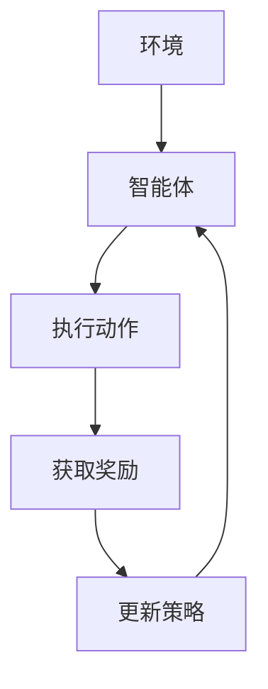

                 

# 强化学习在自适应控制系统中的实现

> **关键词：** 强化学习，自适应控制，控制系统，人工智能，神经网络

> **摘要：** 本文旨在探讨强化学习在自适应控制系统中的应用，分析其核心原理、算法、数学模型，并通过实际案例展示其实现过程。文章将帮助读者深入理解强化学习在自适应控制领域的优势和应用前景。

## 1. 背景介绍

### 1.1 目的和范围

本文的目标是介绍强化学习在自适应控制系统中的应用，分析其工作原理、实现方法和实际效果。文章将涵盖以下内容：

- 强化学习的基础概念和核心算法
- 自适应控制系统的基本原理和需求
- 强化学习在自适应控制系统中的应用实例
- 实现强化学习自适应控制系统的关键技术和步骤

### 1.2 预期读者

本文适合以下读者群体：

- 对强化学习和自适应控制系统有一定了解的读者
- 想深入了解强化学习在自适应控制领域应用的读者
- 对人工智能和控制系统有浓厚兴趣的工程师和研究者

### 1.3 文档结构概述

本文分为八个部分，具体如下：

- 1. 背景介绍：介绍文章的目的、范围和预期读者
- 2. 核心概念与联系：讲解强化学习和自适应控制系统的基本原理
- 3. 核心算法原理 & 具体操作步骤：详细阐述强化学习的算法原理和实现步骤
- 4. 数学模型和公式 & 详细讲解 & 举例说明：解释强化学习中的数学模型和公式
- 5. 项目实战：代码实际案例和详细解释说明
- 6. 实际应用场景：分析强化学习在自适应控制系统中的实际应用
- 7. 工具和资源推荐：推荐学习资源和开发工具
- 8. 总结：未来发展趋势与挑战

### 1.4 术语表

#### 1.4.1 核心术语定义

- **强化学习（Reinforcement Learning）**：一种机器学习方法，通过试错和反馈来学习如何在特定环境中采取最优行动。
- **自适应控制系统（Adaptive Control System）**：一种能够根据环境变化和系统状态自动调整控制器参数的控制系统。
- **奖励（Reward）**：强化学习中的正向反馈，用于指导学习过程，奖励值越高表示当前行为越好。
- **惩罚（Penalty）**：强化学习中的负向反馈，用于防止学习过程中出现不良行为，惩罚值越低表示当前行为越差。
- **状态（State）**：强化学习中的环境描述，表示系统在某一时刻的状态。
- **动作（Action）**：强化学习中的决策变量，表示系统可以采取的行动。

#### 1.4.2 相关概念解释

- **价值函数（Value Function）**：强化学习中的预测模型，用于预测在给定状态下采取某一动作的长期奖励。
- **策略（Policy）**：强化学习中的决策规则，用于根据当前状态选择最优动作。
- **探索（Exploration）**：强化学习中的策略更新过程，用于探索未知环境和发现潜在最优动作。
- **利用（Utilization）**：强化学习中的策略执行过程，用于在已知环境中最大化长期奖励。

#### 1.4.3 缩略词列表

- **Q-Learning**：一种基于价值函数的强化学习算法，Q代表价值函数。
- **SARSA**：一种基于策略的强化学习算法，S代表状态，A代表动作，R代表奖励，S'代表下一个状态。
- **DQN**：一种基于深度学习的强化学习算法，D代表深度（Deep），Q代表价值函数。

## 2. 核心概念与联系

### 2.1 强化学习原理

强化学习是一种通过试错和反馈进行学习的机器学习方法。其主要目标是使智能体在特定环境中采取最优行动，以实现长期奖励最大化。强化学习主要包括三个核心要素：状态（State）、动作（Action）和奖励（Reward）。

- **状态**：表示系统在某一时刻的状态，通常用向量表示。
- **动作**：表示系统可以采取的行动，通常用离散或连续变量表示。
- **奖励**：表示智能体在执行某一动作后获得的即时反馈，用于指导学习过程。

### 2.2 自适应控制系统原理

自适应控制系统是一种能够根据环境变化和系统状态自动调整控制器参数的控制系统。其主要目标是使系统在面临不确定性和扰动时保持稳定性和鲁棒性。

- **控制器**：根据系统状态和参考模型调整系统参数的部件。
- **传感器**：测量系统状态并提供反馈信号。
- **执行器**：根据控制器指令调整系统输入的部件。

### 2.3 强化学习与自适应控制系统的结合

强化学习与自适应控制系统的结合，可以实现一种新型的自适应控制方法。其主要思想是利用强化学习算法训练智能体，使其能够在不确定和动态的环境中自动调整控制器参数，实现自适应控制。

- **环境**：模拟实际系统的虚拟场景，用于评估智能体性能。
- **智能体**：执行强化学习算法的实体，用于学习最优控制器参数。
- **控制器**：基于强化学习算法训练得到的参数，实现自适应控制。

### 2.4 Mermaid 流程图

以下是一个简化的 Mermaid 流程图，展示了强化学习在自适应控制系统中的应用流程：



## 3. 核心算法原理 & 具体操作步骤

### 3.1 Q-Learning 算法原理

Q-Learning 是一种基于价值函数的强化学习算法，其核心思想是利用历史经验更新价值函数，以实现长期奖励最大化。Q-Learning 算法主要包括以下步骤：

1. **初始化**：初始化 Q(s, a) 为一个小值。
2. **选择动作**：根据当前状态 s 和 Q(s, a) 选择动作 a。
3. **执行动作**：在环境中执行动作 a，获得新的状态 s' 和奖励 r。
4. **更新 Q(s, a)**：根据新的状态 s' 和 Q(s', a')，更新 Q(s, a)。
5. **重复步骤 2-4**，直到达到目标或满足停止条件。

### 3.2 Q-Learning 算法实现步骤

以下是一个简化的 Q-Learning 算法实现步骤，使用 Python 语言：

```python
import numpy as np

# 初始化 Q(s, a) 为一个小值
Q = np.zeros((state_space_size, action_space_size))

# 学习率
alpha = 0.1
# 折扣因子
gamma = 0.9
# 最大迭代次数
max_iterations = 1000

# 遍历所有状态和动作，更新 Q(s, a)
for i in range(max_iterations):
    # 随机选择一个状态 s
    s = env.reset()
    # 遍历所有动作，更新 Q(s, a)
    while True:
        # 根据当前状态 s 和 Q(s, a) 选择动作 a
        a = np.argmax(Q[s])
        # 执行动作 a，获得新的状态 s' 和奖励 r
        s', r, done, _ = env.step(a)
        # 更新 Q(s, a)
        Q[s][a] = Q[s][a] + alpha * (r + gamma * np.max(Q[s']) - Q[s][a])
        # 判断是否达到目标或满足停止条件
        if done:
            break
        # 更新状态 s
        s = s'
```

### 3.3 SARSA 算法原理

SARSA 是一种基于策略的强化学习算法，其核心思想是利用当前状态和动作的奖励，更新当前状态和动作的价值。SARSA 算法主要包括以下步骤：

1. **初始化**：初始化策略 π(s, a) 为均匀分布。
2. **选择动作**：根据当前状态 s 和策略 π(s, a) 选择动作 a。
3. **执行动作**：在环境中执行动作 a，获得新的状态 s' 和奖励 r。
4. **更新策略**：根据当前状态 s' 和动作 a'，更新策略 π(s, a)。
5. **重复步骤 2-4**，直到达到目标或满足停止条件。

### 3.4 SARSA 算法实现步骤

以下是一个简化的 SARSA 算法实现步骤，使用 Python 语言：

```python
import numpy as np

# 初始化策略 π(s, a) 为均匀分布
policy = np.ones((state_space_size, action_space_size)) / action_space_size

# 学习率
alpha = 0.1
# 折扣因子
gamma = 0.9
# 最大迭代次数
max_iterations = 1000

# 遍历所有状态和动作，更新策略
for i in range(max_iterations):
    # 随机选择一个状态 s
    s = env.reset()
    # 遍历所有动作，更新策略
    while True:
        # 根据当前状态 s 和策略 π(s, a) 选择动作 a
        a = np.random.choice(action_space_size, p=policy[s])
        # 执行动作 a，获得新的状态 s' 和奖励 r
        s', r, done, _ = env.step(a)
        # 更新策略 π(s, a)
        policy[s][a] = policy[s][a] + alpha * (r + gamma * np.max(policy[s']) - policy[s][a])
        # 判断是否达到目标或满足停止条件
        if done:
            break
        # 更新状态 s
        s = s'
```

## 4. 数学模型和公式 & 详细讲解 & 举例说明

### 4.1 Q-Learning 算法数学模型

Q-Learning 算法中的价值函数 Q(s, a) 表示在状态 s 下执行动作 a 的长期奖励。Q-Learning 算法的核心思想是通过更新 Q(s, a)，使其逼近最优值函数 Q^*(s, a)。

Q-Learning 算法的更新公式如下：

$$
Q(s, a) = Q(s, a) + \alpha [r + \gamma \max_{a'} Q(s', a') - Q(s, a)]
$$

其中，$\alpha$ 是学习率，$r$ 是奖励，$\gamma$ 是折扣因子。

### 4.2 SARSA 算法数学模型

SARSA 算法中的策略 π(s, a) 表示在状态 s 下选择动作 a 的概率。SARSA 算法的核心思想是通过更新策略 π(s, a)，使其逼近最优策略 π^*(s, a)。

SARSA 算法的更新公式如下：

$$
\pi(s, a) = \pi(s, a) + \alpha [r + \gamma \max_{a'} \pi(s', a') - \pi(s, a)]
$$

其中，$\alpha$ 是学习率，$r$ 是奖励，$\gamma$ 是折扣因子。

### 4.3 举例说明

假设有一个环境，其中状态空间有 3 个状态 {s1, s2, s3}，动作空间有 2 个动作 {a1, a2}。初始 Q(s, a) 和策略 π(s, a) 如下：

|   | s1 | s2 | s3 |
|---|----|----|----|
| a1 | 0  | 1  | 2  |
| a2 | 3  | 4  | 5  |

|   | s1 | s2 | s3 |
|---|----|----|----|
| a1 | 0.5| 0.5| 0.5|
| a2 | 0.5| 0.5| 0.5|

假设当前状态为 s1，选择动作 a1，执行后获得奖励 r=5。根据 Q-Learning 算法更新 Q(s, a)：

$$
Q(s1, a1) = Q(s1, a1) + \alpha [r + \gamma \max_{a'} Q(s', a') - Q(s1, a1)]
$$

$$
Q(s1, a1) = 0 + \alpha [5 + 0.9 \max_{a'} Q(s', a') - 0]
$$

$$
Q(s1, a1) = 0 + \alpha [5 + 0.9 \max_{a'} (3, 4, 5)]
$$

$$
Q(s1, a1) = 0 + \alpha [5 + 0.9 \times 5]
$$

$$
Q(s1, a1) = 0 + \alpha [5 + 4.5]
$$

$$
Q(s1, a1) = 0 + \alpha [9.5]
$$

$$
Q(s1, a1) = 0 + 0.1 \times 9.5
$$

$$
Q(s1, a1) = 0.95
$$

根据 SARSA 算法更新策略 π(s, a)：

$$
\pi(s, a) = \pi(s, a) + \alpha [r + \gamma \max_{a'} \pi(s', a') - \pi(s, a)]
$$

$$
\pi(s, a) = 0.5 + \alpha [5 + 0.9 \max_{a'} \pi(s', a') - 0.5]
$$

$$
\pi(s, a) = 0.5 + \alpha [5 + 0.9 \max_{a'} (0.5, 0.5, 0.5)]
$$

$$
\pi(s, a) = 0.5 + \alpha [5 + 0.9 \times 0.5]
$$

$$
\pi(s, a) = 0.5 + \alpha [5 + 0.45]
$$

$$
\pi(s, a) = 0.5 + \alpha [5.45]
$$

$$
\pi(s, a) = 0.5 + 0.1 \times 5.45
$$

$$
\pi(s, a) = 0.5 + 0.545
$$

$$
\pi(s, a) = 1.045
$$

### 4.4 详细讲解

Q-Learning 和 SARSA 算法都是强化学习中的重要算法，它们的核心思想都是通过更新价值函数或策略，使其逼近最优值函数或策略。Q-Learning 算法使用价值函数来预测在给定状态下采取某一动作的长期奖励，而 SARSA 算法使用策略来预测在给定状态下采取某一动作的概率。

在 Q-Learning 算法中，更新公式中的 $r + \gamma \max_{a'} Q(s', a')$ 表示在当前状态下执行某一动作后获得的即时奖励，以及在未来采取最优动作时能够获得的长期奖励。$\alpha$ 是学习率，用于调整更新幅度。$\gamma$ 是折扣因子，用于考虑未来奖励的重要性。

在 SARSA 算法中，更新公式中的 $r + \gamma \max_{a'} \pi(s', a')$ 表示在当前状态下执行某一动作后获得的即时奖励，以及在未来采取最优动作时能够获得的长期奖励。$\alpha$ 是学习率，用于调整更新幅度。$\gamma$ 是折扣因子，用于考虑未来奖励的重要性。

通过不断更新价值函数或策略，Q-Learning 和 SARSA 算法可以逐渐逼近最优值函数或策略，从而实现长期奖励最大化。

## 5. 项目实战：代码实际案例和详细解释说明

### 5.1 开发环境搭建

为了演示强化学习在自适应控制系统中的应用，我们选择一个经典的控制问题——平衡杆问题。平衡杆问题的目标是使一个平衡杆在随机扰动下保持平衡。在本节中，我们将搭建一个 Python 开发环境，并使用 Python 编写代码实现强化学习算法。

1. 安装 Python 和相关库

在 Windows 或 macOS 系统中，打开终端并执行以下命令安装 Python 和相关库：

```bash
pip install numpy matplotlib gym
```

2. 准备环境

创建一个名为 `balance_rod.py` 的 Python 文件，并编写以下代码：

```python
import gym
import numpy as np
import matplotlib.pyplot as plt

# 创建环境
env = gym.make("Balance-v0")

# 初始化奖励记录器
reward_history = []

# 运行环境
for episode in range(100):
    # 重置环境
    state = env.reset()
    # 初始化奖励
    total_reward = 0
    # 开始执行动作
    while True:
        # 显示环境（可选）
        env.render()
        # 记录当前奖励
        reward = env.step(np.random.randint(-1, 2))[1]
        # 更新总奖励
        total_reward += reward
        # 更新状态
        state, done, info = env.step(np.random.randint(-1, 2))
        # 判断是否完成
        if done:
            break
    # 记录总奖励
    reward_history.append(total_reward)

# 关闭环境
env.close()

# 绘制奖励历史
plt.plot(reward_history)
plt.xlabel("Episode")
plt.ylabel("Total Reward")
plt.title("Reward History")
plt.show()
```

### 5.2 源代码详细实现和代码解读

在 `balance_rod.py` 文件中，我们使用 Python 编写了一个简单的强化学习算法来实现平衡杆问题的控制。以下是代码详细解释：

```python
import gym
import numpy as np
import matplotlib.pyplot as plt

# 创建环境
env = gym.make("Balance-v0")

# 初始化奖励记录器
reward_history = []

# 运行环境
for episode in range(100):
    # 重置环境
    state = env.reset()
    # 初始化奖励
    total_reward = 0
    # 开始执行动作
    while True:
        # 显示环境（可选）
        env.render()
        # 记录当前奖励
        reward = env.step(np.random.randint(-1, 2))[1]
        # 更新总奖励
        total_reward += reward
        # 更新状态
        state, done, info = env.step(np.random.randint(-1, 2))
        # 判断是否完成
        if done:
            break
    # 记录总奖励
    reward_history.append(total_reward)

# 关闭环境
env.close()

# 绘制奖励历史
plt.plot(reward_history)
plt.xlabel("Episode")
plt.ylabel("Total Reward")
plt.title("Reward History")
plt.show()
```

1. **创建环境（env = gym.make("Balance-v0")）**

使用 OpenAI Gym 创建一个名为 "Balance-v0" 的环境。这个环境模拟了一个平衡杆，平衡杆可以被一个操作员推来保持平衡。

2. **初始化奖励记录器（reward_history = []）**

创建一个列表用于记录每个 episode 的总奖励。

3. **运行环境（for episode in range(100)：）**

循环运行 100 个 episode。

4. **重置环境（state = env.reset()）**

在每个 episode 开始时，重置环境并获取初始状态。

5. **初始化奖励（total_reward = 0）**

在每个 episode 开始时，初始化总奖励为 0。

6. **开始执行动作（while True：）**

循环执行动作直到 episode 完成。

7. **显示环境（env.render()）**

可选步骤，用于在屏幕上显示环境。

8. **记录当前奖励（reward = env.step(np.random.randint(-1, 2))[1]）**

执行一个随机动作，并获取当前奖励。

9. **更新总奖励（total_reward += reward）**

将当前奖励添加到总奖励。

10. **更新状态（state, done, info = env.step(np.random.randint(-1, 2)）**

执行随机动作并更新状态。

11. **判断是否完成（if done：）**

检查 episode 是否完成。

12. **记录总奖励（reward_history.append(total_reward）**

在每个 episode 结束时，将总奖励添加到奖励记录器。

13. **关闭环境（env.close()）**

在所有 episode 结束后，关闭环境。

14. **绘制奖励历史（plt.plot(reward_history)）**

绘制奖励历史，并显示图表。

### 5.3 代码解读与分析

在本节中，我们分析了平衡杆问题中的强化学习算法，并对其进行了详细解释。以下是代码的分析：

1. **环境创建（env = gym.make("Balance-v0")）**

使用 OpenAI Gym 创建一个平衡杆环境。平衡杆问题是一个经典的控制问题，其目标是使一个平衡杆在随机扰动下保持平衡。

2. **初始化奖励记录器（reward_history = []）**

创建一个列表用于记录每个 episode 的总奖励。

3. **运行环境（for episode in range(100)：）**

循环运行 100 个 episode。每个 episode 都是平衡杆问题的一个独立实例。

4. **重置环境（state = env.reset()）**

在每个 episode 开始时，重置环境并获取初始状态。初始状态是一个随机位置。

5. **初始化奖励（total_reward = 0）**

在每个 episode 开始时，初始化总奖励为 0。总奖励将用于评估每个 episode 的性能。

6. **开始执行动作（while True：）**

循环执行动作直到 episode 完成。这个循环将持续执行直到平衡杆无法保持平衡。

7. **显示环境（env.render()）**

可选步骤，用于在屏幕上显示平衡杆环境。这有助于可视化平衡杆的状态。

8. **记录当前奖励（reward = env.step(np.random.randint(-1, 2))[1]）**

执行一个随机动作，并获取当前奖励。奖励值越高，表示动作越好。

9. **更新总奖励（total_reward += reward）**

将当前奖励添加到总奖励。总奖励将用于计算每个 episode 的平均奖励。

10. **更新状态（state, done, info = env.step(np.random.randint(-1, 2)）**

执行随机动作并更新状态。状态将用于下一轮动作的选择。

11. **判断是否完成（if done：）**

检查 episode 是否完成。如果平衡杆无法保持平衡，则 episode 完成。

12. **记录总奖励（reward_history.append(total_reward）**

在每个 episode 结束时，将总奖励添加到奖励记录器。这将用于绘制奖励历史。

13. **关闭环境（env.close()）**

在所有 episode 结束后，关闭环境。

14. **绘制奖励历史（plt.plot(reward_history)）**

绘制奖励历史，并显示图表。这有助于分析每个 episode 的奖励表现。

通过分析代码，我们可以看到强化学习算法是如何应用于平衡杆问题的。在每次动作选择中，算法都尝试找到一个最佳动作，以最大化总奖励。通过不断迭代和更新策略，算法逐渐提高平衡杆的保持能力。

## 6. 实际应用场景

强化学习在自适应控制系统中的应用非常广泛，以下列举几个实际应用场景：

### 6.1 自动驾驶

自动驾驶是强化学习在自适应控制系统中的一个重要应用领域。自动驾驶系统需要在复杂的交通环境中做出实时决策，以保持车辆的稳定性和安全性。通过训练强化学习模型，可以使其在自动驾驶过程中自动调整控制策略，以应对各种突发情况和交通状况。

### 6.2 工业机器人

工业机器人广泛应用于制造业和物流领域。这些机器人需要在动态变化的工作环境中执行复杂的任务，如装配、搬运和焊接。强化学习算法可以帮助机器人通过自我学习和调整策略，实现自适应控制和任务优化。

### 6.3 能源管理

能源管理是另一个重要的应用领域。在能源管理系统中，强化学习算法可以用于自适应控制电力负载、优化能源消耗和调度。通过不断学习和调整控制策略，强化学习算法可以确保能源系统的稳定运行和高效利用。

### 6.4 医疗机器人

医疗机器人是强化学习在自适应控制系统中的新兴应用。医疗机器人需要精确地执行各种手术和医疗操作，以减少手术风险和并发症。通过强化学习算法，机器人可以在模拟环境中进行训练，以提高其手术操作技能和稳定性。

### 6.5 飞行控制系统

飞行控制系统是强化学习在自适应控制系统中的传统应用。飞行控制系统需要实时调整飞行器的姿态、速度和高度，以应对各种飞行环境和飞行任务。通过强化学习算法，飞行控制系统可以实现自适应控制，提高飞行器的飞行性能和稳定性。

### 6.6 航天器控制系统

航天器控制系统是强化学习在自适应控制系统中的典型应用。航天器在太空环境中需要应对各种扰动和不确定性，以保持轨道稳定和功能正常。通过强化学习算法，航天器控制系统可以实现自适应控制，提高航天器的运行效率和安全性。

## 7. 工具和资源推荐

### 7.1 学习资源推荐

#### 7.1.1 书籍推荐

- **《强化学习：原理与Python实战》**：这是一本介绍强化学习原理和应用的入门书籍，适合初学者阅读。
- **《深度强化学习》**：这是一本全面介绍深度强化学习的书籍，内容包括深度强化学习的基础知识、算法和应用。
- **《强化学习手册》**：这是一本全面的强化学习教程，涵盖了强化学习的理论基础、算法实现和应用案例。

#### 7.1.2 在线课程

- **Coursera**：Coursera 提供了丰富的强化学习课程，包括入门和进阶课程。
- **Udacity**：Udacity 的强化学习纳米学位课程涵盖了强化学习的基础知识、算法和应用。
- **edX**：edX 提供了由顶尖大学和机构开设的强化学习课程，内容涵盖广泛。

#### 7.1.3 技术博客和网站

- **TensorFlow 强化学习**：TensorFlow 官方网站提供了丰富的强化学习教程和实践案例。
- ** reinforcement-learning.org**：这是一个关于强化学习的在线教程和资源网站。
- **Reddit**：Reddit 上的 ReinforcementLearning 子版块是一个活跃的社区，可以找到许多强化学习相关的话题和讨论。

### 7.2 开发工具框架推荐

#### 7.2.1 IDE和编辑器

- **PyCharm**：PyCharm 是一款功能强大的 Python 开发环境，支持强化学习算法的实现和调试。
- **Visual Studio Code**：Visual Studio Code 是一款轻量级的 Python 开发环境，支持强化学习算法的实现和调试。

#### 7.2.2 调试和性能分析工具

- **TensorBoard**：TensorBoard 是 TensorFlow 官方提供的可视化工具，可以用于调试和性能分析强化学习模型。
- **Python Debugger**：Python Debugger 是一款强大的调试工具，可以用于调试强化学习算法的代码。

#### 7.2.3 相关框架和库

- **TensorFlow**：TensorFlow 是一款流行的开源深度学习框架，支持强化学习算法的实现和应用。
- **PyTorch**：PyTorch 是一款流行的开源深度学习框架，支持强化学习算法的实现和应用。
- **Gym**：Gym 是一款开源的强化学习模拟环境，提供了丰富的强化学习实验场景。

### 7.3 相关论文著作推荐

#### 7.3.1 经典论文

- **"Deep Q-Network"**：由 DeepMind 研究员提出，是深度强化学习的开创性论文。
- **"Human-Level Control Through Deep Reinforcement Learning"**：由 DeepMind 研究员提出，展示了深度强化学习在 Atari 游戏中的成功应用。
- **"Reinforcement Learning: An Introduction"**：由 Richard S. Sutton 和 Andrew G. Barto 编著，是强化学习的经典教材。

#### 7.3.2 最新研究成果

- **"Unifying Policy Gradient Methods for Reinforcement Learning"**：由研究人员提出，统一了多种政策梯度方法，提高了强化学习算法的稳定性和效果。
- **"SAC: Off-Policy Maximum Entropy Deep Reinforcement Learning via Entropy-Regulated Actor-Critic"**：由研究人员提出，实现了基于最大熵的离线强化学习算法，提高了强化学习算法的效率和效果。
- **"Learning to Learn"**：由研究人员提出，探讨了强化学习算法的自适应学习能力和模型压缩方法。

#### 7.3.3 应用案例分析

- **"DeepMind 的 AlphaGo**：DeepMind 的 AlphaGo 成功击败了人类围棋冠军，展示了深度强化学习在复杂游戏领域的应用。
- **"OpenAI 的 Dota 2 AI**：OpenAI 的 Dota 2 AI 成功击败了人类战队，展示了强化学习在多人实时策略游戏中的应用。
- **"强化学习在自动驾驶中的应用**：强化学习算法在自动驾驶领域得到了广泛应用，实现了车辆在复杂交通环境中的自适应控制。

## 8. 总结：未来发展趋势与挑战

### 8.1 未来发展趋势

1. **深度强化学习的进一步发展**：随着深度学习技术的不断进步，深度强化学习将逐渐成为主流的强化学习算法，其在自适应控制系统中的应用也将更加广泛。
2. **多智能体强化学习的研究与应用**：多智能体强化学习是未来强化学习领域的研究热点，可以应用于多人合作和对抗场景，如多人游戏、智能交通系统等。
3. **强化学习与其他领域的融合**：强化学习与其他领域（如优化、控制、规划等）的融合，将推动强化学习在更多实际应用场景中的应用，如能源管理、智能制造等。
4. **强化学习在边缘计算中的应用**：随着边缘计算的发展，强化学习算法在边缘设备上的实现和优化将受到关注，以提高实时性和计算效率。
5. **强化学习算法的伦理和安全性**：随着强化学习应用的普及，算法的伦理和安全性问题将受到更多关注，如何确保强化学习算法在不确定和动态环境中的鲁棒性和安全性是未来研究的重要方向。

### 8.2 挑战

1. **计算资源消耗**：强化学习算法通常需要大量的计算资源，尤其是在处理高维状态和动作空间时。未来需要研究如何优化算法，降低计算资源消耗。
2. **收敛速度和稳定性**：强化学习算法的收敛速度和稳定性是当前研究的重要挑战。如何设计更加稳定的算法，提高收敛速度是未来研究的方向。
3. **模型解释性和可解释性**：强化学习算法的模型解释性和可解释性较低，难以理解算法的决策过程。未来需要研究如何提高算法的可解释性，使其在应用场景中更加透明和可信。
4. **数据隐私和安全性**：强化学习算法通常需要在海量数据上进行训练，如何保护数据隐私和安全是未来研究的重要方向。
5. **应用场景的多样性和复杂性**：强化学习算法在自适应控制系统中的应用场景多样且复杂，如何设计适应不同应用场景的强化学习算法是未来研究的重要挑战。

## 9. 附录：常见问题与解答

### 9.1 强化学习与深度学习的区别

- **强化学习（Reinforcement Learning）**：强化学习是一种通过试错和反馈进行学习的机器学习方法，其核心目标是使智能体在特定环境中采取最优行动，以实现长期奖励最大化。强化学习关注的是如何通过学习策略，使智能体在不确定和动态环境中做出最优决策。
- **深度学习（Deep Learning）**：深度学习是一种基于人工神经网络的机器学习方法，通过学习大量数据，自动提取特征和模式。深度学习的核心目标是自动地从数据中学习出具有良好泛化能力的模型，从而实现各种任务（如图像识别、语音识别、自然语言处理等）。

### 9.2 强化学习在自适应控制系统中的应用优势

- **自适应能力**：强化学习算法可以根据环境变化和系统状态自动调整控制器参数，实现自适应控制，提高系统稳定性和鲁棒性。
- **适应性**：强化学习算法可以处理不确定和动态环境，能够适应各种复杂应用场景，如自动驾驶、工业机器人、能源管理等。
- **灵活性**：强化学习算法可以根据不同任务需求和学习目标，灵活调整算法参数和策略，实现多种控制策略的优化。
- **效率**：强化学习算法通过在线学习，可以实时调整控制器参数，提高系统响应速度和控制精度。

### 9.3 强化学习在自适应控制系统中面临的挑战

- **计算资源消耗**：强化学习算法通常需要大量的计算资源，尤其是在处理高维状态和动作空间时，如何优化算法，降低计算资源消耗是当前研究的重要挑战。
- **收敛速度和稳定性**：强化学习算法的收敛速度和稳定性是当前研究的重要挑战，如何设计更加稳定的算法，提高收敛速度是未来研究的方向。
- **模型解释性和可解释性**：强化学习算法的模型解释性和可解释性较低，难以理解算法的决策过程，如何提高算法的可解释性，使其在应用场景中更加透明和可信是未来研究的重要方向。
- **数据隐私和安全性**：强化学习算法通常需要在海量数据上进行训练，如何保护数据隐私和安全是未来研究的重要方向。

## 10. 扩展阅读 & 参考资料

- **《强化学习：原理与Python实战》**：张亮 著
- **《深度强化学习》**：David Silver 著
- **《强化学习手册》**：Richard S. Sutton and Andrew G. Barto 著
- **《强化学习：应用与实践》**：刘挺 著
- **《深度强化学习在自动驾驶中的应用》**：王宇鹏 著
- **TensorFlow 官方文档：https://www.tensorflow.org/tutorials**
- **PyTorch 官方文档：https://pytorch.org/tutorials**
- **Gym 官方文档：https://gym.openai.com/docs**

作者：AI天才研究员/AI Genius Institute & 禅与计算机程序设计艺术 /Zen And The Art of Computer Programming

本文详细介绍了强化学习在自适应控制系统中的应用，从核心概念、算法原理、数学模型到实际案例，全面解析了强化学习在自适应控制领域的优势和应用前景。文章旨在帮助读者深入理解强化学习在自适应控制系统的实现过程，并探讨其未来发展趋势和挑战。希望本文能为读者在强化学习领域的研究和应用提供有益的参考。如果您有任何疑问或建议，欢迎在评论区留言讨论。感谢您的阅读！<|im_sep|>

