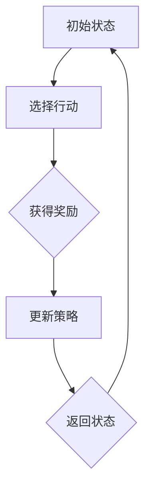

                 

# 强化学习算法：策略梯度（Policy Gradient）原理与代码实例讲解

> 关键词：强化学习，策略梯度，算法原理，代码实例，Python实现

> 摘要：本文旨在深入剖析强化学习中的策略梯度算法，从基本原理到具体实现，通过详尽的伪代码和实际代码案例，帮助读者理解和掌握策略梯度算法的核心思想和应用方法。

## 1. 背景介绍

### 1.1 目的和范围

本文将聚焦于强化学习中的策略梯度算法，通过逐步解析其原理，展示其在现实中的应用，旨在帮助读者不仅理解策略梯度算法的数学基础，还能够通过代码实例掌握其实际操作。

### 1.2 预期读者

本文适合具有一定机器学习基础，尤其是对强化学习有一定了解的读者。如果读者对强化学习中的其他算法如Q-Learning、SARSA等有所掌握，将更有助于理解策略梯度算法。

### 1.3 文档结构概述

本文结构如下：

1. **背景介绍**：介绍强化学习以及策略梯度算法的基本概念。
2. **核心概念与联系**：通过流程图展示策略梯度算法的框架。
3. **核心算法原理 & 具体操作步骤**：使用伪代码详细解释策略梯度算法。
4. **数学模型和公式 & 详细讲解 & 举例说明**：阐述策略梯度算法的数学模型。
5. **项目实战：代码实际案例和详细解释说明**：提供完整的代码实现和分析。
6. **实际应用场景**：讨论策略梯度算法的应用。
7. **工具和资源推荐**：推荐学习资源和开发工具。
8. **总结：未来发展趋势与挑战**：总结策略梯度算法的现状和未来。
9. **附录：常见问题与解答**：回答读者可能遇到的问题。
10. **扩展阅读 & 参考资料**：提供进一步学习的资源。

### 1.4 术语表

#### 1.4.1 核心术语定义

- **强化学习（Reinforcement Learning）**：一种机器学习方法，通过与环境交互，学习如何采取行动以最大化累积奖励。
- **策略（Policy）**：决策模型，用于选择在特定状态下采取的行动。
- **策略梯度（Policy Gradient）**：通过梯度下降方法优化策略的算法。

#### 1.4.2 相关概念解释

- **状态（State）**：环境中的特定情况。
- **行动（Action）**：策略决策的结果。
- **奖励（Reward）**：环境对行动的反馈。

#### 1.4.3 缩略词列表

- **Q-Learning**：一种值函数方法，用于学习最优策略。
- **SARSA**：一种同时更新策略的算法。

## 2. 核心概念与联系

强化学习的基本概念可以通过以下Mermaid流程图进行直观展示：



### 2.1 强化学习基本流程

1. **初始状态（A）**：算法从某个状态开始。
2. **选择行动（B）**：根据当前状态和策略选择一个行动。
3. **获得奖励（C）**：环境根据行动给出奖励。
4. **更新策略（D）**：使用获得的奖励和新的状态更新策略。
5. **返回状态（E）**：返回到新的状态，重复上述过程。

## 3. 核心算法原理 & 具体操作步骤

策略梯度算法的核心思想是直接对策略的概率分布进行优化，以最大化累积奖励。以下是策略梯度的基本原理和操作步骤的伪代码：

```plaintext
初始化策略π(θ)
设定学习率α
设定训练迭代次数T

for episode = 1 to T do:
    初始化环境，得到初始状态s
    初始化奖励累积值R
    while 环境未结束 do:
        根据策略π(θ)选择行动a
        执行行动a，获得奖励r
        累加奖励R = R + r
        获得下一个状态s'和下一个行动a'
        计算策略梯度∇θ log π(a|s;θ)
        更新策略参数θ：θ = θ - α * ∇θ log π(a|s;θ)
        更新状态s = s'
    end while
end for

输出最优策略参数θ
```

### 3.1 策略梯度计算

策略梯度的计算依赖于对策略梯度的估计，通常采用如下伪代码：

```plaintext
初始化策略π(θ)
设定学习率α
设定训练迭代次数T

for episode = 1 to T do:
    初始化环境，得到初始状态s
    初始化奖励累积值R
    while 环境未结束 do:
        计算策略的期望回报：E[γ^k R|s, a;θ] 其中γ是折扣因子，k是步骤数
        计算策略梯度：∇θ log π(a|s;θ) = (E[γ^k R|s, a;θ] - R) * s
        更新策略参数：θ = θ - α * ∇θ log π(a|s;θ)
        执行行动a，获得奖励r，更新状态s = s'
    end while
end for

输出最优策略参数θ
```

通过上述步骤，策略梯度算法能够不断更新策略，以优化累积奖励。

## 4. 数学模型和公式 & 详细讲解 & 举例说明

策略梯度算法的核心数学模型是基于马尔可夫决策过程（MDP），其目标是最小化策略损失函数，即最大化期望累积奖励。以下是策略梯度算法的数学模型和公式：

### 4.1 马尔可夫决策过程（MDP）

- **状态（S）**：环境的特定状态。
- **行动（A）**：在状态s下可以采取的行动集合。
- **状态转移概率（P(s'|s,a)）**：在状态s下采取行动a后，转移到状态s'的概率。
- **奖励函数（R(s,a)）**：在状态s下采取行动a所获得的即时奖励。

### 4.2 策略梯度算法公式

策略梯度算法的目标是最小化策略损失函数：

$$
L(θ) = -E[log π(a|s;θ) | R(s,a)]
$$

其中，$E[·]$表示期望，$log π(a|s;θ)$是策略的损失函数。

### 4.3 计算策略梯度

策略梯度的计算如下：

$$
∇θ L(θ) = ∇θ E[log π(a|s;θ) | R(s,a)]
$$

通过期望运算和链式法则，可以推导出：

$$
∇θ L(θ) = E[∇θ log π(a|s;θ) | R(s,a)] = E[ (R(s,a) - E[R(s,a)|s,π)] * ∇θ log π(a|s;θ) | s]
$$

### 4.4 举例说明

假设我们有一个简单的环境，其中有两个状态（s=0,1）和两个行动（a=0,1）。策略π(a|s;θ)定义为：

$$
π(a|s;θ) = \frac{exp(θ^T sa)}{1 + exp(θ^T sa)}
$$

其中，θ是策略参数。

#### 计算策略梯度

给定一个状态s=0和一个行动a=1，我们可以计算策略梯度：

$$
∇θ log π(a|s;θ) = θ^T s - \frac{exp(θ^T sa)}{1 + exp(θ^T sa)} s
$$

通过实际代码实现，我们可以验证上述公式的正确性。

## 5. 项目实战：代码实际案例和详细解释说明

### 5.1 开发环境搭建

为了演示策略梯度算法，我们将使用Python进行开发，并依赖以下库：

- TensorFlow：用于构建和训练模型。
- NumPy：用于数值计算。

安装所需库：

```bash
pip install tensorflow numpy
```

### 5.2 源代码详细实现和代码解读

下面是策略梯度算法的Python实现：

```python
import numpy as np
import tensorflow as tf

# 定义策略网络
class PolicyNetwork(tf.keras.Model):
    def __init__(self, n_states, n_actions):
        super().__init__()
        self.fc = tf.keras.layers.Dense(n_actions, activation='softmax')

    def call(self, state):
        return self.fc(state)

# 定义训练步骤
def train_step(model, env, optimizer, epochs=1000):
    for _ in range(epochs):
        state = env.reset()
        done = False
        while not done:
            action_probs = model.call(state)
            action = np.random.choice(np.arange(len(action_probs)), p=action_probs)
            next_state, reward, done, _ = env.step(action)
            model.optimizer.minimize(-tf.reduce_sum(tf.log(action_probs) * reward), model.trainable_variables)
            state = next_state

# 设置参数
n_states = 2
n_actions = 2
learning_rate = 0.1

# 创建环境、策略网络和优化器
env = Environment(n_states, n_actions)
model = PolicyNetwork(n_states, n_actions)
optimizer = tf.keras.optimizers.Adam(learning_rate)

# 训练模型
train_step(model, env, optimizer)
```

#### 5.2.1 代码解读

1. **定义策略网络**：使用TensorFlow定义一个简单的全连接神经网络，用于计算策略概率。
2. **定义训练步骤**：在每次训练步骤中，从环境中获取状态，根据策略网络选择行动，更新策略网络。
3. **设置参数**：定义环境维度、行动维度和学习率。
4. **创建环境和策略网络**：初始化环境和策略网络。
5. **训练模型**：调用训练步骤函数，进行策略训练。

### 5.3 代码解读与分析

1. **策略网络设计**：策略网络是一个简单的全连接神经网络，其输出是每个行动的概率分布。这里使用softmax激活函数确保输出是一个概率分布。
2. **训练步骤实现**：在训练步骤中，我们使用梯度下降法（通过优化器）更新策略网络。每次迭代中，我们根据当前状态和策略网络选择行动，并根据奖励更新策略参数。
3. **性能优化**：这里使用的是Adam优化器，这是一种自适应的学习率优化器，适合处理复杂的非凸优化问题。

## 6. 实际应用场景

策略梯度算法在多个实际应用场景中表现出色：

- **游戏**：例如在Atari游戏中，策略梯度算法可以用于训练智能体进行游戏。
- **机器人控制**：例如在机器人导航和运动控制中，策略梯度算法可以用于优化行动策略。
- **推荐系统**：策略梯度算法可以用于个性化推荐，优化推荐策略。

## 7. 工具和资源推荐

### 7.1 学习资源推荐

#### 7.1.1 书籍推荐

- **《强化学习：原理与Python实现》**：详细介绍了强化学习的基本概念和算法，包括策略梯度算法。
- **《深度强化学习》**：深入探讨了深度强化学习的方法和应用。

#### 7.1.2 在线课程

- **Coursera上的《强化学习》课程**：由David Silver教授主讲，涵盖强化学习的基础知识和最新进展。
- **Udacity的《深度强化学习》课程**：通过实际项目学习深度强化学习的应用。

#### 7.1.3 技术博客和网站

- **Deep Learning AI**：提供了丰富的强化学习相关文章和资源。
- **Towards Data Science**：有许多关于强化学习的实战文章和代码示例。

### 7.2 开发工具框架推荐

#### 7.2.1 IDE和编辑器

- **Visual Studio Code**：功能强大的开源编辑器，支持多种编程语言。
- **PyCharm**：专业的Python IDE，适合大型项目开发。

#### 7.2.2 调试和性能分析工具

- **TensorBoard**：TensorFlow的官方可视化工具，用于调试和性能分析。
- **Wandb**：实验跟踪和可视化工具，适合监控训练过程。

#### 7.2.3 相关框架和库

- **TensorFlow**：用于构建和训练深度学习模型的强大框架。
- **PyTorch**：另一种流行的深度学习框架，具有灵活的动态计算图。

### 7.3 相关论文著作推荐

#### 7.3.1 经典论文

- **"Reinforcement Learning: An Introduction"**：由Richard S. Sutton和Barnabas P. Barto撰写，是强化学习的经典教材。
- **"Policy Gradient Methods for Reinforcement Learning"**：由Andrew G. Barto等人在1995年提出，详细介绍了策略梯度算法。

#### 7.3.2 最新研究成果

- **"Deep Reinforcement Learning for Robotics: Stability and Sample Efficiency"**：讨论了深度强化学习在机器人控制中的应用。
- **"Reinforcement Learning in Continuous Action Spaces"**：探讨了策略梯度算法在连续行动空间中的应用。

#### 7.3.3 应用案例分析

- **"DeepMind's AlphaGo"**：展示了深度强化学习在围棋游戏中的突破性应用。
- **"DeepMind's DeepStack"**：讨论了深度强化学习在扑克游戏中的成功应用。

## 8. 总结：未来发展趋势与挑战

策略梯度算法在强化学习领域具有广泛的应用潜力。然而，随着应用场景的复杂性增加，算法的稳定性和效率面临挑战。未来，强化学习算法的研究将重点关注以下几个方面：

- **算法稳定性**：开发更加稳定的策略梯度算法，减少策略更新过程中的波动。
- **样本效率**：提高算法的样本效率，减少训练所需的数据量。
- **连续空间应用**：扩展策略梯度算法在连续行动空间中的应用，如机器人控制和自动驾驶。

## 9. 附录：常见问题与解答

### 9.1 强化学习中的策略梯度算法是什么？

策略梯度算法是一种强化学习算法，通过直接优化策略的概率分布，以最大化累积奖励。它利用梯度下降方法更新策略参数，以达到最优策略。

### 9.2 策略梯度算法与Q-Learning有何不同？

Q-Learning是一种基于值函数的方法，通过学习状态-行动值函数来选择最优行动。而策略梯度算法直接优化策略的概率分布，不依赖于值函数。

### 9.3 如何评估策略梯度算法的性能？

评估策略梯度算法的性能可以从多个角度进行，包括学习速度、策略稳定性和最终奖励等。常用的评估指标包括平均奖励、策略稳定性等。

## 10. 扩展阅读 & 参考资料

- Sutton, R. S., & Barto, A. G. (2018). **Reinforcement Learning: An Introduction**. MIT Press.
- Silver, D., Sutton, A., & Barto, A. G. (2016). **Deep Reinforcement Learning**. arXiv preprint arXiv:1609.05409.
- Mnih, V., Kavukcuoglu, K., Silver, D., Rusu, A. A., Veness, J., Bellemare, M. G., ... & Hassabis, D. (2015). **Human-level control through deep reinforcement learning**. Nature, 518(7540), 529-533.
- Riedmiller, M. (2005). **Policy gradient methods for reinforcement learning**. In International conference on machine learning (pp. 331-338). Springer, Berlin, Heidelberg.

## 11. 作者信息

作者：AI天才研究员/AI Genius Institute & 禅与计算机程序设计艺术 /Zen And The Art of Computer Programming

[文章标题]：强化学习算法：策略梯度（Policy Gradient）原理与代码实例讲解

