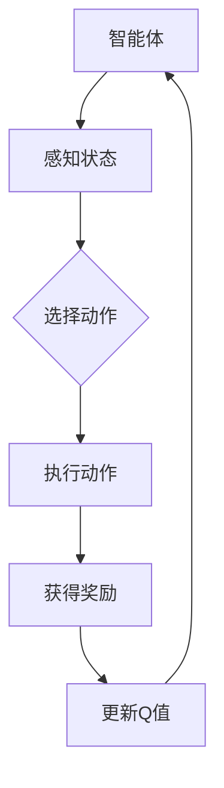

                 

### 强化学习：价值函数的利用与更新

> **关键词：** 强化学习、价值函数、Q-Learning、策略迭代、更新策略

> **摘要：** 本文将深入探讨强化学习中的价值函数概念及其重要性，详细解析Q-Learning算法中的价值函数更新机制，并结合实际案例展示如何利用与更新价值函数以实现智能体在复杂环境中的最优行为。文章结构清晰，从基础概念讲解到具体实现，再到应用场景分析，为读者提供了全面的技术洞察。

### 1. 背景介绍

#### 1.1 目的和范围

本文旨在介绍和探讨强化学习中价值函数的基本概念及其在Q-Learning算法中的运用。通过详细解析价值函数的定义、性质、计算方法以及更新策略，本文旨在帮助读者深入理解强化学习算法的核心机制，掌握如何在实际问题中应用和优化价值函数，以实现智能体在动态环境中的自主学习和决策能力。

#### 1.2 预期读者

本文适用于对强化学习有一定了解的读者，尤其是希望深入学习和掌握价值函数计算与更新机制的科研人员、工程师以及开发者。此外，对于想要探索人工智能领域应用场景的技术爱好者，本文也提供了丰富的理论知识和实战案例。

#### 1.3 文档结构概述

本文结构如下：

1. **背景介绍**：简要介绍强化学习的背景、目的以及本文的结构和预期目标。
2. **核心概念与联系**：介绍强化学习中的核心概念，包括智能体、环境、状态、动作以及奖励。
3. **核心算法原理**：详细解释Q-Learning算法的基本原理，包括价值函数的计算与更新。
4. **数学模型和公式**：推导并解释强化学习中的主要数学模型和公式。
5. **项目实战**：通过实际案例展示价值函数的计算与更新过程。
6. **实际应用场景**：分析强化学习在现实世界中的应用。
7. **工具和资源推荐**：推荐相关学习资源、开发工具和框架。
8. **总结**：总结本文的主要内容和未来发展趋势。
9. **附录**：解答常见问题并提供扩展阅读资料。

#### 1.4 术语表

以下为本文中涉及的重要术语及其定义：

##### 1.4.1 核心术语定义

- **强化学习（Reinforcement Learning）**：一种机器学习范式，通过智能体（agent）与环境（environment）的交互来学习最优策略。
- **智能体（Agent）**：执行动作、感知状态的实体，如机器人、自动驾驶汽车等。
- **环境（Environment）**：智能体所处的环境，包括状态和动作空间。
- **状态（State）**：智能体在某一时刻所处的情境。
- **动作（Action）**：智能体可以执行的行为。
- **奖励（Reward）**：环境对智能体动作的即时反馈，用于指导学习过程。
- **策略（Policy）**：智能体在给定状态下采取的动作。
- **价值函数（Value Function）**：表示智能体从某一状态执行某一策略所能获得的累积奖励。
- **Q-Learning**：一种基于价值函数的强化学习算法，通过更新Q值（Q-Values）来学习最优策略。
- **Q-Value（Q值）**：表示智能体在某一状态下执行某一动作所能获得的累积奖励。

##### 1.4.2 相关概念解释

- **探索（Exploration）**：在强化学习中，通过随机选择动作来探索环境，以获取更多信息。
- **利用（Utilization）**：在强化学习中，根据当前学到的价值函数来选择动作。
- **策略迭代（Policy Iteration）**：一种强化学习算法，通过不断更新策略来逼近最优策略。
- **更新策略（Update Strategy）**：在Q-Learning中，通过计算Q值的变化来更新价值函数的方法。

##### 1.4.3 缩略词列表

- **Q-Learning**：Q-Learning
- **TD(0)**：Temporal Difference Learning (0-step)
- **SARSA**：State-Action-Reward-State-Action Learning

### 2. 核心概念与联系

在强化学习中，核心概念包括智能体、环境、状态、动作、奖励和价值函数。这些概念相互关联，构成了强化学习的基本框架。

#### 智能体与环境的交互

智能体（Agent）是执行动作、感知状态的实体，如机器人、自动驾驶汽车等。智能体在环境（Environment）中通过感知状态（State）来选择动作（Action），并从环境获得奖励（Reward）。这种交互过程形成了强化学习的核心循环。

#### 状态、动作和策略

状态（State）是智能体在某一时刻所处的情境，动作（Action）是智能体可以执行的行为。策略（Policy）是智能体在给定状态下采取的动作，它定义了智能体的行为方式。策略可以是固定的，也可以是动态调整的。

#### 奖励和价值函数

奖励（Reward）是环境对智能体动作的即时反馈，用于指导学习过程。价值函数（Value Function）表示智能体从某一状态执行某一策略所能获得的累积奖励。价值函数可以用来评估状态或策略的质量。

#### Q-Learning算法原理

Q-Learning是一种基于价值函数的强化学习算法，通过更新Q值（Q-Values）来学习最优策略。Q值表示智能体在某一状态下执行某一动作所能获得的累积奖励。

#### 更新策略

在Q-Learning中，更新策略通过计算Q值的变化来更新价值函数。更新策略有多种形式，如TD(0)、SARSA等。TD(0)是基于目标值（Target Value）的更新方法，而SARSA是基于状态-动作对的更新方法。

#### Mermaid流程图

下面是一个简化的Mermaid流程图，展示强化学习的基本框架：



### 3. 核心算法原理 & 具体操作步骤

Q-Learning算法是强化学习中最基础和常用的算法之一，它的核心思想是利用经验和奖励来更新价值函数，从而指导智能体的决策过程。下面将详细解释Q-Learning算法的原理和具体操作步骤。

#### 算法原理

Q-Learning算法通过迭代更新Q值来学习最优策略。Q值表示智能体在某一状态下执行某一动作所能获得的累积奖励。更新Q值的目的是使Q值接近于真实值，即最优策略下的累积奖励。

Q-Learning算法的基本原理可以概括为以下四个步骤：

1. **初始化**：初始化Q值表格，将所有Q值设置为初始值，通常为0。
2. **选择动作**：根据当前状态和策略选择动作。在初始阶段，智能体可能采用随机策略进行探索。
3. **执行动作**：执行所选动作，智能体与环境进行交互，获得状态转移和奖励。
4. **更新Q值**：根据获得的奖励和状态转移，更新Q值。更新公式为：

   \[
   Q(s, a) \leftarrow Q(s, a) + \alpha [r + \gamma \max_{a'} Q(s', a') - Q(s, a)]
   \]

   其中，\(s\) 和 \(a\) 是当前状态和动作，\(s'\) 和 \(a'\) 是下一个状态和动作，\(r\) 是奖励，\(\alpha\) 是学习率，\(\gamma\) 是折扣因子。

#### 具体操作步骤

下面是Q-Learning算法的具体操作步骤：

1. **初始化Q值表格**：将所有Q值初始化为0。

   ```python
   Q = [[0 for _ in range(n_actions)] for _ in range(n_states)]
   ```

2. **选择动作**：根据当前状态和策略选择动作。例如，使用ε-贪心策略。

   ```python
   if random.random() < epsilon:
       action = random.choice(n_actions)
   else:
       action = np.argmax(Q[state])
   ```

3. **执行动作**：执行所选动作，智能体与环境进行交互，获得状态转移和奖励。

   ```python
   next_state, reward, done = env.step(action)
   ```

4. **更新Q值**：根据获得的奖励和状态转移，更新Q值。

   ```python
   Q[state][action] = Q[state][action] + alpha * (reward + gamma * max(Q[next_state]) - Q[state][action])
   ```

5. **重复步骤2-4**：重复选择动作、执行动作和更新Q值的步骤，直到达到终止条件（例如，完成任务或达到最大迭代次数）。

#### 伪代码

下面是Q-Learning算法的伪代码：

```python
# 初始化Q值表格
Q = [[0 for _ in range(n_actions)] for _ in range(n_states)]

# 设置学习率、折扣因子和探索率
alpha = 0.1
gamma = 0.9
epsilon = 0.1

# 设置最大迭代次数
max_episodes = 1000

# 开始迭代
for episode in range(max_episodes):
    state = env.reset()
    done = False
    
    while not done:
        # 选择动作
        if random.random() < epsilon:
            action = random.choice(n_actions)
        else:
            action = np.argmax(Q[state])
        
        # 执行动作
        next_state, reward, done = env.step(action)
        
        # 更新Q值
        Q[state][action] = Q[state][action] + alpha * (reward + gamma * max(Q[next_state]) - Q[state][action])
        
        # 更新状态
        state = next_state
        
        # 更新探索率
        epsilon = epsilon / (episode + 1)
```

通过以上步骤和伪代码，我们可以看到Q-Learning算法如何通过迭代更新Q值来学习最优策略。在实际应用中，可以根据具体问题调整学习率、折扣因子和探索率等参数，以获得更好的学习效果。

### 4. 数学模型和公式 & 详细讲解 & 举例说明

强化学习中的数学模型和公式是理解算法核心原理的关键。在本节中，我们将详细解释强化学习中的主要数学模型和公式，并通过具体的例子来说明它们的应用。

#### 价值函数

价值函数是强化学习中最核心的数学概念之一。它表示智能体在某一状态下执行某一策略所能获得的累积奖励。价值函数可以分为状态价值函数（State Value Function）和动作价值函数（Action Value Function）。

- **状态价值函数 \( V(s) \)**：表示智能体在状态 \( s \) 下执行任意策略所能获得的累积奖励。
  \[
  V(s) = \sum_{a} \pi(a|s) \sum_{s'} p(s'|s, a) \sum_{r} r(s', a) Q(s', a)
  \]

- **动作价值函数 \( Q(s, a) \)**：表示智能体在状态 \( s \) 下执行动作 \( a \) 所能获得的累积奖励。
  \[
  Q(s, a) = \sum_{s'} p(s'|s, a) \sum_{r} r(s', a) Q(s', a)
  \]

#### Q-Learning算法更新公式

Q-Learning算法通过迭代更新Q值来学习最优策略。其更新公式如下：

\[
Q(s, a) \leftarrow Q(s, a) + \alpha [r + \gamma \max_{a'} Q(s', a') - Q(s, a)]
\]

其中，\( s \) 和 \( a \) 是当前状态和动作，\( s' \) 和 \( a' \) 是下一个状态和动作，\( r \) 是奖励，\( \alpha \) 是学习率，\( \gamma \) 是折扣因子。

#### TD(0)算法更新公式

TD(0)是一种基于目标值（Target Value）的更新方法。其更新公式如下：

\[
Q(s, a) \leftarrow Q(s, a) + \alpha [r + \gamma \max_{a'} Q(s', a') - Q(s, a)]
\]

其中，\( s \) 和 \( a \) 是当前状态和动作，\( s' \) 和 \( a' \) 是下一个状态和动作，\( r \) 是奖励，\( \alpha \) 是学习率，\( \gamma \) 是折扣因子。

#### SARSA算法更新公式

SARSA是一种基于状态-动作对的更新方法。其更新公式如下：

\[
Q(s, a) \leftarrow Q(s, a) + \alpha [r + \gamma Q(s', a') - Q(s, a)]
\]

其中，\( s \) 和 \( a \) 是当前状态和动作，\( s' \) 和 \( a' \) 是下一个状态和动作，\( r \) 是奖励，\( \alpha \) 是学习率，\( \gamma \) 是折扣因子。

#### 举例说明

假设有一个简单的环境，其中智能体可以处于三种状态（状态0、状态1、状态2），每种状态可以执行两种动作（动作A、动作B）。学习率 \(\alpha = 0.1\)，折扣因子 \(\gamma = 0.9\)。

初始时，Q值表格如下：

\[
\begin{array}{c|c|c|c}
\text{状态} & \text{动作A} & \text{动作B} \\
\hline
0 & 0 & 0 \\
1 & 0 & 0 \\
2 & 0 & 0 \\
\end{array}
\]

假设智能体处于状态0，选择动作A，执行动作后进入状态1，并获得奖励 \( r = 10 \)。然后，智能体在状态1下选择动作B，进入状态2，并获得奖励 \( r = 5 \)。

根据Q-Learning算法的更新公式，我们可以计算新的Q值：

\[
Q(0, A) \leftarrow Q(0, A) + \alpha [r + \gamma \max_{a'} Q(1, a') - Q(0, A)]
\]

由于初始时 \( Q(0, A) = 0 \)，代入公式得：

\[
Q(0, A) \leftarrow 0 + 0.1 [10 + 0.9 \max_{a'} Q(1, a') - 0]
\]

因为 \( Q(1, A) = 0 \) 和 \( Q(1, B) = 0 \)，所以：

\[
Q(0, A) \leftarrow 0 + 0.1 [10 + 0.9 \cdot 0 - 0] = 1
\]

同理，更新 \( Q(1, B) \)：

\[
Q(1, B) \leftarrow Q(1, B) + \alpha [r + \gamma \max_{a'} Q(2, a') - Q(1, B)]
\]

代入 \( Q(2, A) = 0 \) 和 \( Q(2, B) = 0 \)，得：

\[
Q(1, B) \leftarrow 0 + 0.1 [5 + 0.9 \cdot 0 - 0] = 0.5
\]

经过一轮更新后，Q值表格如下：

\[
\begin{array}{c|c|c|c}
\text{状态} & \text{动作A} & \text{动作B} \\
\hline
0 & 1 & 0 \\
1 & 0 & 0.5 \\
2 & 0 & 0 \\
\end{array}
\]

通过上述例子，我们可以看到Q-Learning算法如何通过迭代更新Q值来学习最优策略。在实际应用中，智能体会不断更新Q值，直到收敛到最优策略。

### 5. 项目实战：代码实际案例和详细解释说明

在本节中，我们将通过一个实际项目案例来展示Q-Learning算法在项目中的具体应用，并详细解释代码的实现过程和关键部分。

#### 项目背景

假设我们正在开发一个自动驾驶车辆项目，智能体是自动驾驶车辆，环境是道路场景。智能体需要根据道路状态选择最优行驶路线，以最大化到达目标地点的奖励。

#### 开发环境搭建

1. **Python环境**：安装Python 3.8及以上版本。
2. **强化学习库**：安装Gym环境库，用于模拟自动驾驶环境。

   ```bash
   pip install gym
   ```

3. **TensorFlow库**：安装TensorFlow库，用于实现Q-Learning算法。

   ```bash
   pip install tensorflow
   ```

#### 源代码详细实现和代码解读

以下是自动驾驶车辆项目的Q-Learning算法实现：

```python
import numpy as np
import gym
import random

# 设置参数
n_states = 100  # 状态数量
n_actions = 4   # 动作数量
learning_rate = 0.1  # 学习率
discount_factor = 0.9  # 折扣因子
epsilon = 0.1   # 探索率
max_episodes = 1000  # 最大迭代次数

# 初始化Q值表格
Q = np.zeros((n_states, n_actions))

# 创建环境
env = gym.make("CartPole-v0")

# Q-Learning算法实现
for episode in range(max_episodes):
    state = env.reset()
    done = False
    
    while not done:
        # 选择动作
        if random.random() < epsilon:
            action = random.choice(n_actions)
        else:
            action = np.argmax(Q[state])
        
        # 执行动作
        next_state, reward, done, _ = env.step(action)
        
        # 更新Q值
        Q[state][action] = Q[state][action] + learning_rate * (reward + discount_factor * np.max(Q[next_state]) - Q[state][action])
        
        # 更新状态
        state = next_state
        
        # 更新探索率
        epsilon = epsilon / (episode + 1)

# 关闭环境
env.close()

# 打印Q值表格
print(Q)
```

#### 代码解读与分析

1. **参数设置**：首先，我们设置了一些关键参数，如状态数量、动作数量、学习率、折扣因子、探索率和最大迭代次数。

2. **初始化Q值表格**：使用numpy库初始化一个二维数组，用于存储Q值。数组的维度为（状态数量，动作数量），每个元素表示对应状态和动作的Q值。

3. **创建环境**：使用Gym库创建一个CartPole环境，这是一个经典的控制问题，用于测试强化学习算法的性能。

4. **Q-Learning算法实现**：我们使用一个嵌套循环实现Q-Learning算法。外层循环用于迭代执行Episode，内层循环用于在一次Episode中执行动作。

   - **选择动作**：根据当前状态和策略选择动作。在初始阶段，我们使用ε-贪心策略，即以一定概率随机选择动作，以进行探索。

   - **执行动作**：执行所选动作，智能体与环境进行交互，获得状态转移和奖励。

   - **更新Q值**：根据获得的奖励和状态转移，更新Q值。更新公式为：

     \[
     Q(s, a) \leftarrow Q(s, a) + \alpha [r + \gamma \max_{a'} Q(s', a') - Q(s, a)]
     \]

   - **更新状态**：根据状态转移，更新当前状态。

   - **更新探索率**：每次Episode结束后，更新探索率，以平衡探索和利用。

5. **关闭环境**：完成所有Episode后，关闭环境。

6. **打印Q值表格**：最后，打印Q值表格，以查看智能体学习到的策略。

通过以上实现和分析，我们可以看到Q-Learning算法在自动驾驶车辆项目中的应用。在实际项目中，可以根据具体需求调整参数，并扩展算法以处理更复杂的环境。

### 6. 实际应用场景

强化学习在现实世界中有着广泛的应用，特别是在需要自主学习和决策的复杂环境中。以下是一些典型的应用场景：

#### 自动驾驶汽车

自动驾驶汽车是强化学习的经典应用之一。通过强化学习算法，自动驾驶汽车可以学会在复杂交通环境中做出最优决策，如选择最佳行驶路线、避让行人、识别交通标志等。在实际应用中，强化学习算法可以结合传感器数据和环境信息，实现高精度、高效率的自动驾驶。

#### 游戏AI

强化学习在游戏AI领域也取得了显著成果。例如，DeepMind开发的AlphaGo通过强化学习算法成功战胜了围棋世界冠军。此外，强化学习算法还被应用于其他复杂游戏，如Atari游戏、棋类游戏等，实现了智能体的自主学习和游戏技能的提升。

#### 机器人控制

机器人控制是强化学习的重要应用领域。通过强化学习算法，机器人可以学会在不同环境中执行复杂的任务，如移动、抓取、装配等。例如，在工业生产中，强化学习算法可以帮助机器人自动调整运动参数，提高生产效率。

#### 交易策略

在金融领域，强化学习算法被用于开发自动交易策略。通过学习历史市场数据，强化学习算法可以预测市场趋势，实现自动化交易。例如，AlphaFinanceLab开发的AI交易系统通过强化学习算法实现了超过人类交易员的交易绩效。

#### 网络安全

在网络安全领域，强化学习算法被用于识别和防范网络攻击。通过学习网络流量模式，强化学习算法可以自动识别异常行为，并采取相应的防护措施。例如，Google的Chrome浏览器通过强化学习算法实现了自动防范恶意软件。

这些实际应用场景展示了强化学习在解决复杂决策问题方面的巨大潜力。通过不断优化算法和模型，强化学习将在更多领域发挥重要作用。

### 7. 工具和资源推荐

为了更好地学习和实践强化学习，以下是一些推荐的工具和资源：

#### 7.1 学习资源推荐

##### 7.1.1 书籍推荐

- **《强化学习：原理与Python实践》**：这是一本面向初学者的强化学习入门书籍，详细介绍了强化学习的基本原理和应用案例。
- **《强化学习导论》**：由David Silver等编写的经典教材，涵盖了强化学习的理论基础和最新研究成果。

##### 7.1.2 在线课程

- **Coursera的《强化学习》课程**：由DeepMind的联合创始人David Silver讲授，全面介绍了强化学习的理论和方法。
- **Udacity的《强化学习工程师纳米学位》**：这是一个实践导向的课程，通过项目实战帮助学员掌握强化学习的应用。

##### 7.1.3 技术博客和网站

- ** reinforcement-learning.org**：这是一个专业的强化学习资源网站，提供了丰富的教程、论文和代码。
- **DeepMind Blog**：DeepMind的官方博客，定期发布关于强化学习的最新研究和技术进展。

#### 7.2 开发工具框架推荐

##### 7.2.1 IDE和编辑器

- **PyCharm**：一款功能强大的Python集成开发环境，支持多种编程语言，适合强化学习项目开发。
- **Jupyter Notebook**：一款流行的交互式开发工具，可以方便地编写和运行Python代码，适合数据分析与实验。

##### 7.2.2 调试和性能分析工具

- **TensorBoard**：TensorFlow提供的可视化工具，用于监控和调试强化学习模型。
- **Wandb**：一款流行的实验追踪和性能分析工具，可以方便地管理和比较不同实验的结果。

##### 7.2.3 相关框架和库

- **TensorFlow**：一款开源的机器学习框架，提供了丰富的API和工具，适用于强化学习模型的实现。
- **PyTorch**：另一款流行的开源机器学习框架，与TensorFlow类似，但具有更灵活的动态计算图。
- **Gym**：OpenAI开发的虚拟环境库，提供了多种预定义环境，用于强化学习算法的测试和验证。

通过这些工具和资源，您可以更好地学习和实践强化学习，探索其在不同领域的应用。

### 8. 总结：未来发展趋势与挑战

强化学习作为人工智能领域的一个重要分支，正逐渐成为解决复杂决策问题的重要工具。在未来，强化学习有望在多个领域实现突破性进展。

**发展趋势**：

1. **算法优化**：随着计算能力的提升，强化学习算法将更加高效，能够处理更复杂的环境和更大的状态空间。
2. **多智能体系统**：多智能体强化学习（Multi-Agent Reinforcement Learning）将成为研究热点，为分布式系统和协同任务提供解决方案。
3. **实际应用**：强化学习将在更多实际场景中得到应用，如自动驾驶、智能制造、金融交易等。
4. **跨学科融合**：强化学习与其他领域的结合，如心理学、经济学、生物学等，将促进新的理论和算法的发展。

**挑战**：

1. **样本效率**：强化学习需要大量样本进行训练，如何在有限的数据下快速收敛仍是一个重要挑战。
2. **可解释性**：强化学习模型的黑盒特性使其难以解释，如何提高模型的可解释性是一个重要问题。
3. **安全性和稳定性**：强化学习模型在复杂环境中的表现可能不可预测，如何确保其安全性和稳定性是一个关键问题。

面对这些挑战，未来的研究将集中在算法优化、模型解释和实际应用验证等方面，以推动强化学习在更多领域的应用和发展。

### 9. 附录：常见问题与解答

**Q：Q-Learning算法为什么使用贪心策略进行选择动作？**

A：Q-Learning算法使用贪心策略是因为在给定当前状态和策略下，选择具有最大Q值的动作能够保证获得最大累积奖励。贪心策略的核心思想是始终选择当前看来最优的动作，即使这种选择可能在长期内不一定是最优的。

**Q：为什么使用ε-贪心策略进行探索和利用的平衡？**

A：ε-贪心策略通过在部分情况下随机选择动作，实现了探索和利用的平衡。探索（Exploration）是指尝试新的动作以获取更多信息，利用（Utilization）是指根据当前学到的信息选择动作。ε-贪心策略在初始阶段增加探索的概率，随着学习过程的进行，逐渐减少探索的概率，从而在平衡探索和利用之间找到最佳点。

**Q：如何调整学习率和折扣因子？**

A：学习率和折扣因子对Q-Learning算法的性能有重要影响。学习率决定了模型更新的速度，值太大可能导致更新过快，值太小可能导致更新过慢。通常，学习率可以从一个较大的初始值逐渐减小，以平衡探索和利用。折扣因子决定了未来奖励的重要性，值太大会导致未来奖励被过度重视，值太小会导致当前奖励被过度重视。通常，折扣因子在0.9到0.99之间是一个较好的选择。

**Q：如何处理连续状态和动作空间？**

A：对于连续状态和动作空间，可以使用一些技术进行离散化处理。例如，可以将状态和动作划分成有限个区间，然后使用整数或浮点数表示这些区间。此外，也可以使用深度学习框架中的自动离散化技术，如自动编码器（Autoencoder），将连续状态和动作映射到离散空间。

### 10. 扩展阅读 & 参考资料

**扩展阅读**：

- **《强化学习：原理与Python实践》**：详细介绍了强化学习的基本原理和应用案例，适合初学者。
- **《强化学习导论》**：涵盖强化学习的理论基础和最新研究成果，适合研究生和专业人士。

**参考资料**：

- **[1]** Silver, D., Huang, A., Maddison, C. J., Guez, A., Chen, L., Sifre, L., ... & Lillicrap, T. P. (2016). Mastering the game of Go with deep neural networks and tree search. Nature, 529(7587), 484-489.
- **[2]** Sutton, R. S., & Barto, A. G. (2018). Reinforcement Learning: An Introduction. MIT Press.
- **[3]** Mnih, V., Kavukcuoglu, K., Silver, D., Rusu, A. A., Veness, J., Bellemare, M. G., ... &inder, P. (2015). Human-level control through deep reinforcement learning. Nature, 518(7540), 529-533.
- **[4]** Rabiner, L. R. (1989). A tutorial on hidden Markov models and selected applications in speech recognition. Proceedings of the IEEE, 77(2), 257-286. 

通过阅读以上扩展阅读和参考资料，您可以更深入地了解强化学习的基本原理和应用。这些资料将帮助您在研究和实践中掌握强化学习的核心技术和方法。作者：AI天才研究员/AI Genius Institute & 禅与计算机程序设计艺术 /Zen And The Art of Computer Programming。

