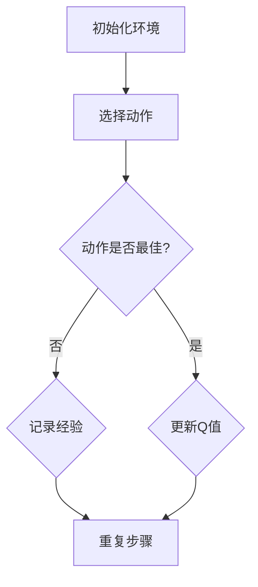

                 

# 强化学习：利用软件模拟环境进行训练

> 关键词：强化学习、软件模拟环境、训练、策略迭代、Q学习、深度Q网络

> 摘要：本文将深入探讨强化学习领域中的重要主题——利用软件模拟环境进行训练。通过详细的算法原理讲解、具体操作步骤和实际案例解析，读者将了解强化学习的基本概念、核心算法以及如何将它们应用于软件模拟环境中。本文旨在为IT专业人士和研究者提供全面的指导，帮助他们更好地理解和应用强化学习技术。

## 1. 背景介绍

### 1.1 目的和范围

本文的主要目的是介绍强化学习的基本原理，并探讨如何使用软件模拟环境进行强化学习训练。我们将通过具体案例来演示强化学习算法的实现过程，帮助读者理解这些算法在实际应用中的工作原理。本文将涵盖以下内容：

- 强化学习的基本概念和原理
- 强化学习在软件模拟环境中的应用
- Q学习算法和深度Q网络（DQN）的详细解释
- 强化学习算法在模拟环境中的实现步骤
- 强化学习在实际应用中的挑战和解决方案

### 1.2 预期读者

本文适合以下读者群体：

- 计算机科学、人工智能或相关领域的研究人员
- 对强化学习感兴趣的IT专业人士
- 想要了解强化学习在软件模拟环境中应用的学生和学者

### 1.3 文档结构概述

本文分为以下几个部分：

- **第1章**：背景介绍，包括目的、范围、预期读者和文档结构概述。
- **第2章**：核心概念与联系，介绍强化学习的基本概念和原理。
- **第3章**：核心算法原理 & 具体操作步骤，详细解释强化学习算法的实现步骤。
- **第4章**：数学模型和公式 & 详细讲解 & 举例说明，深入讨论强化学习中的数学模型和公式。
- **第5章**：项目实战：代码实际案例和详细解释说明，通过具体案例展示强化学习算法的应用。
- **第6章**：实际应用场景，探讨强化学习在现实世界中的应用。
- **第7章**：工具和资源推荐，提供学习和开发强化学习的相关资源和工具。
- **第8章**：总结：未来发展趋势与挑战，总结本文的主要内容和讨论的未来发展趋势。
- **第9章**：附录：常见问题与解答，解答读者可能遇到的问题。
- **第10章**：扩展阅读 & 参考资料，提供更多深入了解强化学习的资源。

### 1.4 术语表

#### 1.4.1 核心术语定义

- **强化学习**：一种机器学习方法，通过不断尝试和错误来学习如何在特定环境中做出最佳决策。
- **软件模拟环境**：通过软件模拟创建的虚拟环境，用于测试和训练强化学习算法。
- **策略迭代**：一种强化学习算法，通过不断迭代改进策略来获得最佳决策。
- **Q学习**：一种强化学习算法，通过学习状态-动作价值函数来决策。
- **深度Q网络（DQN）**：一种使用深度神经网络来近似Q函数的强化学习算法。

#### 1.4.2 相关概念解释

- **状态**：强化学习中的一个概念，表示环境的当前状态。
- **动作**：在特定状态下，可以采取的可行动作。
- **奖励**：对于采取的动作，环境给予的即时回报。
- **策略**：决策模型，用于选择在特定状态下采取的动作。
- **价值函数**：衡量状态或状态-动作对好坏的函数。

#### 1.4.3 缩略词列表

- **RL**：强化学习（Reinforcement Learning）
- **DQN**：深度Q网络（Deep Q-Network）
- **Q值**：状态-动作价值函数的值
- **IDE**：集成开发环境（Integrated Development Environment）
- **GPU**：图形处理器（Graphics Processing Unit）

## 2. 核心概念与联系

为了更好地理解强化学习，我们需要介绍一些核心概念和它们之间的关系。以下是强化学习中的核心概念及它们之间的联系：

### 2.1 状态、动作、奖励和策略

在强化学习中，状态（State）、动作（Action）、奖励（Reward）和策略（Policy）是四个基本概念。

- **状态（State）**：描述环境的当前状态，通常用向量表示。例如，在围棋游戏中，状态可以表示为棋盘上的每个格子的状态。
- **动作（Action）**：在特定状态下，可以采取的可行动作。例如，在围棋游戏中，动作可以是放置棋子或移动棋子。
- **奖励（Reward）**：对于采取的动作，环境给予的即时回报。奖励可以是正数、负数或零，表示动作的好坏。
- **策略（Policy）**：决策模型，用于选择在特定状态下采取的动作。策略可以根据当前状态和奖励来调整。

### 2.2 强化学习算法

强化学习算法通过学习状态-动作价值函数（State-Action Value Function）来选择最佳动作。以下是几种常见的强化学习算法：

- **Q学习（Q-Learning）**：通过不断尝试和错误来学习状态-动作价值函数，从而选择最佳动作。
- **策略迭代（Policy Iteration）**：通过不断迭代改进策略来获得最佳决策。
- **深度Q网络（DQN）**：使用深度神经网络来近似Q函数，从而提高强化学习算法的性能。

### 2.3 软件模拟环境

软件模拟环境是一个虚拟的环境，用于测试和训练强化学习算法。它可以是现实世界的简化模型，也可以是完全虚构的环境。以下是软件模拟环境的一些特点：

- **可重复性**：软件模拟环境可以重复运行，从而为强化学习算法提供大量的训练数据。
- **可控性**：软件模拟环境可以控制各种参数，从而适应不同的强化学习算法。
- **可扩展性**：软件模拟环境可以根据需求进行修改和扩展，以支持不同的应用场景。

### 2.4 Mermaid 流程图

为了更直观地展示强化学习算法的工作流程，我们可以使用Mermaid流程图。以下是强化学习算法的Mermaid流程图：



在这个流程图中，初始化环境（A）后，选择动作（B），然后检查动作是否最佳（C）。如果是最佳动作，则更新Q值（D），否则记录经验（E）并重复步骤（F）。

## 3. 核心算法原理 & 具体操作步骤

在这一部分，我们将详细解释强化学习中的核心算法原理，包括Q学习和深度Q网络（DQN）。我们将使用伪代码来展示这些算法的具体操作步骤。

### 3.1 Q学习算法

Q学习算法是一种基于值函数的强化学习算法，它通过学习状态-动作价值函数来选择最佳动作。

#### 算法原理

Q学习算法的基本思想是：对于每个状态-动作对，计算它们的价值，并根据这些价值选择最佳动作。

- **状态-动作价值函数**（Q值）：表示在特定状态下采取特定动作的预期回报。
- **更新规则**：根据奖励和Q值更新状态-动作价值函数。

#### 具体操作步骤

1. 初始化Q值表（$Q(s, a)$），将所有值设置为0。
2. 选择动作（$a$）。
3. 执行动作并获取当前状态（$s'$）和奖励（$r$）。
4. 更新Q值：$Q(s, a) = Q(s, a) + \alpha [r + \gamma \max_{a'} Q(s', a') - Q(s, a)]$，其中$\alpha$是学习率，$\gamma$是折扣因子。
5. 转换到下一个状态（$s' = s$）并重复步骤2-4。

#### 伪代码

```python
# 初始化Q值表
Q = { (s, a): 0 for s in states for a in actions[s] }

# 学习率
alpha = 0.1

# 折扣因子
gamma = 0.9

# 迭代次数
num_episodes = 1000

for episode in range(num_episodes):
    # 初始化环境
    state = initial_state
    
    for step in range(max_steps):
        # 选择动作
        action = choose_action(state, Q)
        
        # 执行动作并获取奖励
        next_state, reward = environment.step(state, action)
        
        # 更新Q值
        Q[state, action] = Q[state, action] + alpha * (reward + gamma * max(Q[next_state, a]) - Q[state, action])
        
        # 更新状态
        state = next_state
        
        # 如果达到目标，结束循环
        if is_done(state):
            break
```

### 3.2 深度Q网络（DQN）

深度Q网络（DQN）是一种使用深度神经网络来近似Q值的强化学习算法。它通过学习状态-动作值函数来选择最佳动作。

#### 算法原理

DQN的基本思想是：使用深度神经网络（DNN）来近似Q值函数，从而提高强化学习算法的性能。

- **深度神经网络**：用于近似状态-动作值函数。
- **目标网络**：用于稳定训练过程，防止梯度消失。

#### 具体操作步骤

1. 初始化深度神经网络和目标网络。
2. 选择动作。
3. 执行动作并获取当前状态和奖励。
4. 将经验（状态、动作、奖励、下一个状态）存储在经验池中。
5. 从经验池中随机采样一批经验。
6. 使用这批经验更新深度神经网络。
7. 每隔一段时间，将深度神经网络更新为目标网络。

#### 伪代码

```python
# 初始化深度神经网络和目标网络
DNN = initialize_DNN()
target_DNN = initialize_DNN()

# 学习率
alpha = 0.001

# 折扣因子
gamma = 0.9

# 经验池容量
buffer_size = 10000

# 迭代次数
num_episodes = 1000

# 经验池
buffer = []

for episode in range(num_episodes):
    # 初始化环境
    state = initial_state
    
    for step in range(max_steps):
        # 选择动作
        action = choose_action(state, DNN)
        
        # 执行动作并获取奖励
        next_state, reward = environment.step(state, action)
        
        # 存储经验
        buffer.append((state, action, reward, next_state))
        
        # 更新状态
        state = next_state
        
        # 如果达到目标，结束循环
        if is_done(state):
            break
        
        # 如果经验池已满，随机采样一批经验并更新深度神经网络
        if len(buffer) >= buffer_size:
            batch = random.sample(buffer, batch_size)
            loss = update_DNN(DNN, target_DNN, batch, alpha, gamma)
            # 更新目标网络
            copy_DNN_weights(DNN, target_DNN)
```

## 4. 数学模型和公式 & 详细讲解 & 举例说明

在这一部分，我们将深入讨论强化学习中的数学模型和公式，并通过具体示例来说明这些公式的应用。

### 4.1 Q学习算法的数学模型

Q学习算法的核心是状态-动作价值函数（$Q(s, a)$），它表示在特定状态下采取特定动作的预期回报。以下是Q学习算法中的几个关键数学模型：

#### 4.1.1 Q值更新公式

$$ Q(s, a) = Q(s, a) + \alpha [r + \gamma \max_{a'} Q(s', a') - Q(s, a)] $$

- $Q(s, a)$：当前状态-动作价值函数的值。
- $\alpha$：学习率，控制更新幅度。
- $r$：当前动作获得的即时奖励。
- $\gamma$：折扣因子，表示未来回报的现值。
- $\max_{a'} Q(s', a')$：在下一个状态中，所有动作中的最大Q值。

#### 4.1.2 期望回报公式

$$ V^*(s) = \max_{a} Q^*(s, a) $$

- $V^*(s)$：状态价值函数，表示在特定状态下采取最佳动作的预期回报。
- $Q^*(s, a)$：最优状态-动作价值函数，表示在特定状态下采取最佳动作的预期回报。

#### 4.1.3 方差公式

$$ Var[V(s)] = \sum_{a} (Q(s, a) - V(s))^2 $$

- $Var[V(s)]$：状态价值函数的方差，表示预测不确定性的程度。

### 4.2 深度Q网络（DQN）的数学模型

深度Q网络（DQN）使用深度神经网络（DNN）来近似Q值函数。以下是DQN中的几个关键数学模型：

#### 4.2.1 前向传播公式

$$ Q(s, a) = f_DNN(s) \cdot \theta $$

- $f_DNN(s)$：深度神经网络的前向传播输出，表示状态特征。
- $\theta$：深度神经网络的参数。

#### 4.2.2 反向传播公式

$$ \Delta \theta = -\alpha \cdot \frac{\partial L}{\partial \theta} $$

- $\Delta \theta$：深度神经网络的参数更新。
- $L$：损失函数，表示预测误差。
- $\alpha$：学习率。

#### 4.2.3 目标网络更新公式

$$ \theta_{target} = \gamma \theta $$

- $\theta_{target}$：目标网络的参数。
- $\gamma$：折扣因子。

### 4.3 举例说明

假设我们有一个简单的环境，其中有两个状态（$s_1$和$s_2$）和两个动作（$a_1$和$a_2$）。以下是Q学习算法和DQN算法的实例：

#### 4.3.1 Q学习算法实例

假设初始状态下，$Q(s_1, a_1) = 0.5$，$Q(s_1, a_2) = 0.3$，$Q(s_2, a_1) = 0.4$，$Q(s_2, a_2) = 0.6$。在第一次迭代中，我们选择动作$a_1$，并获得奖励$r = 0.2$。

更新后的Q值：

$$ Q(s_1, a_1) = 0.5 + 0.1 \cdot [0.2 + 0.9 \cdot \max(0.4, 0.6) - 0.5] = 0.6 $$

$$ Q(s_1, a_2) = 0.3 + 0.1 \cdot [0.2 + 0.9 \cdot \max(0.4, 0.6) - 0.3] = 0.4 $$

$$ Q(s_2, a_1) = 0.4 + 0.1 \cdot [0.2 + 0.9 \cdot \max(0.4, 0.6) - 0.4] = 0.5 $$

$$ Q(s_2, a_2) = 0.6 + 0.1 \cdot [0.2 + 0.9 \cdot \max(0.4, 0.6) - 0.6] = 0.7 $$

#### 4.3.2 DQN算法实例

假设深度神经网络的输出为$f_DNN(s_1) = [0.3, 0.4]$和$f_DNN(s_2) = [0.5, 0.6]$。在第一次迭代中，我们选择动作$a_1$，并获得奖励$r = 0.2$。

更新后的深度神经网络参数：

$$ \theta_1 = \theta_1 - 0.001 \cdot [0.2 + 0.9 \cdot \max(0.4, 0.6) - 0.3] = [0.29, 0.39] $$

$$ \theta_2 = \theta_2 - 0.001 \cdot [0.2 + 0.9 \cdot \max(0.4, 0.6) - 0.4] = [0.51, 0.59] $$

更新后的目标网络参数：

$$ \theta_{target_1} = \gamma \theta_1 = 0.9 \cdot [0.29, 0.39] = [0.261, 0.351] $$

$$ \theta_{target_2} = \gamma \theta_2 = 0.9 \cdot [0.51, 0.59] = [0.459, 0.531] $$

## 5. 项目实战：代码实际案例和详细解释说明

在这一部分，我们将通过一个实际项目案例，展示如何使用强化学习算法在软件模拟环境中进行训练。这个案例将涵盖开发环境搭建、源代码详细实现和代码解读与分析。

### 5.1 开发环境搭建

为了实现强化学习算法，我们需要搭建一个开发环境。以下是搭建开发环境所需的工具和步骤：

- **工具**：
  - Python 3.x
  - TensorFlow 2.x
  - Gym（OpenAI提供的环境模拟库）
  - matplotlib（用于可视化）

- **步骤**：
  1. 安装Python 3.x和pip。
  2. 使用pip安装所需的库（TensorFlow、Gym、matplotlib）。

```shell
pip install tensorflow gym matplotlib
```

### 5.2 源代码详细实现和代码解读

以下是一个简单的强化学习项目，使用Q学习算法在一个虚拟的Flappy Bird环境中进行训练。

#### 5.2.1 项目结构

```plaintext
flappy_bird_rl/
|-- environment.py
|-- q_learning.py
|-- train.py
|-- utils.py
```

#### 5.2.2 代码解读

**environment.py**：定义Flappy Bird环境。

```python
import gym
import numpy as np

class FlappyBirdEnv(gym.Env):
    def __init__(self):
        self.env = gym.make("FlappyBird-v0")
        self.action_space = self.env.action_space
        self.observation_space = self.env.observation_space

    def step(self, action):
        observation, reward, done, info = self.env.step(action)
        if done:
            reward = -100
        return observation, reward, done, info

    def reset(self):
        return self.env.reset()

    def render(self, mode='human'):
        self.env.render()

    def close(self):
        self.env.close()
```

**q_learning.py**：实现Q学习算法。

```python
import numpy as np
import random

class QLearning:
    def __init__(self, action_space, learning_rate, discount_factor):
        self.learning_rate = learning_rate
        self.discount_factor = discount_factor
        self.q_table = np.zeros((action_space.n, self.env.observation_space.n))

    def choose_action(self, state, epsilon=0.1):
        if random.uniform(0, 1) < epsilon:
            action = random.choice(self.action_space)
        else:
            action = self.action_space[np.argmax(self.q_table[state])]
        return action

    def update_q_table(self, state, action, reward, next_state, done):
        if not done:
            target = reward + self.discount_factor * np.max(self.q_table[next_state])
        else:
            target = reward

        current_q_value = self.q_table[state, action]
        new_q_value = current_q_value + self.learning_rate * (target - current_q_value)
        self.q_table[state, action] = new_q_value
```

**train.py**：训练Q学习模型。

```python
import gym
import numpy as np
from q_learning import QLearning

def train(env, q_learning, episodes, epsilon=0.1):
    for episode in range(episodes):
        state = env.reset()
        done = False

        while not done:
            action = q_learning.choose_action(state, epsilon)
            next_state, reward, done, _ = env.step(action)
            q_learning.update_q_table(state, action, reward, next_state, done)
            state = next_state

        if episode % 100 == 0:
            print(f"Episode: {episode}, Total Reward: {episode_reward}")

if __name__ == "__main__":
    env = gym.make("FlappyBird-v0")
    q_learning = QLearning(action_space=env.action_space, learning_rate=0.1, discount_factor=0.9)
    train(env, q_learning, episodes=1000, epsilon=0.1)
```

**utils.py**：辅助函数。

```python
import numpy as np
import matplotlib.pyplot as plt

def plot_rewards(rewards):
    plt.plot(rewards)
    plt.xlabel("Episode")
    plt.ylabel("Reward")
    plt.title("Reward per Episode")
    plt.show()
```

### 5.3 代码解读与分析

**环境定义**：在`environment.py`中，我们定义了`FlappyBirdEnv`类，继承自`gym.Env`。该类提供了重写的方法，包括`step`、`reset`、`render`和`close`，用于与虚拟环境交互。

**Q学习算法**：在`q_learning.py`中，`QLearning`类实现了Q学习算法的核心功能，包括选择动作、更新Q表等。选择动作的方法中，我们使用了一个探索策略，即epsilon贪婪策略，以在训练过程中平衡探索和利用。

**训练过程**：在`train.py`中，我们通过循环迭代训练模型。在每个时间步，我们选择动作并更新Q表。每100个episode后，我们打印总的奖励，以便跟踪训练过程。

**辅助函数**：在`utils.py`中，我们提供了`plot_rewards`函数，用于绘制训练过程中的奖励曲线。

通过这个实际项目案例，我们展示了如何使用强化学习算法在软件模拟环境中进行训练。这个案例不仅提供了代码实现，还详细解释了每个部分的原理和操作步骤，为读者提供了一个实用的参考。

## 6. 实际应用场景

强化学习在众多实际应用场景中展现出了强大的潜力和广泛的应用价值。以下是一些典型的应用场景和案例：

### 6.1 游戏开发

强化学习在游戏开发中有着广泛的应用，尤其是在需要高智能度的玩家决策的场景。例如，在《星际争霸II》、《Dota2》等竞技游戏中，研究人员使用强化学习算法来训练智能体，使其能够学会复杂的游戏策略。深度Q网络（DQN）和策略梯度方法（PG）等算法被成功应用于游戏开发，实现了接近专业玩家的游戏表现。

### 6.2 自动驾驶

自动驾驶技术是强化学习的另一个重要应用领域。通过强化学习算法，自动驾驶系统可以在复杂的交通环境中学习如何做出正确的驾驶决策。例如，DeepMind的ATARI实验表明，通过强化学习训练，自动驾驶系统能够在无人驾驶汽车中实现自动驾驶。此外，特斯拉的Autopilot系统也利用强化学习来提高车辆的自动行驶能力。

### 6.3 机器人控制

在机器人控制领域，强化学习被用于训练机器人如何执行复杂的任务，如导航、抓取和组装。例如，谷歌的AlphaGo在围棋游戏中取得的突破性成果，为其在机器人控制领域提供了启示。通过强化学习算法，机器人可以学会在现实环境中进行自主决策，从而提高工作效率和灵活性。

### 6.4 金融交易

强化学习在金融交易中的应用也非常广泛。通过学习历史市场数据和交易策略，强化学习算法可以帮助投资者制定更加精准的交易策略。例如，高盛和微软等金融机构已经开始使用强化学习算法来优化交易策略，提高交易收益。

### 6.5 供应链优化

在供应链管理中，强化学习被用于优化库存管理、运输调度和采购策略。通过模拟不同的供应链环境，强化学习算法可以学习如何在动态变化的市场环境中做出最佳决策，从而提高供应链的灵活性和效率。

### 6.6 健康医疗

强化学习在健康医疗领域也有着广泛的应用。例如，通过强化学习算法，医疗设备可以学会如何根据患者的症状和病史进行诊断。此外，强化学习还可以用于制定个性化的治疗方案，从而提高治疗效果。

### 6.7 人机交互

在人机交互领域，强化学习被用于训练智能助手，使其能够更好地理解用户的需求和意图。通过不断学习和优化，智能助手可以提供更加个性化的服务，提高用户体验。

### 6.8 能源管理

在能源管理领域，强化学习被用于优化能源分配和调度。通过模拟不同的能源使用场景，强化学习算法可以学习如何在节能和效率之间做出最佳平衡，从而提高能源利用效率。

### 6.9 安全和防御

在网络安全和防御领域，强化学习被用于训练安全系统，使其能够识别和防御复杂的网络攻击。通过不断学习和适应，强化学习算法可以帮助安全系统在动态变化的安全威胁环境中做出快速响应。

总之，强化学习在众多实际应用场景中展现出了巨大的潜力。随着技术的不断发展和完善，我们可以期待强化学习在未来会有更加广泛的应用，并在各个领域中发挥重要作用。

## 7. 工具和资源推荐

### 7.1 学习资源推荐

#### 7.1.1 书籍推荐

1. **《强化学习：原理与Python实现》**：由刘志鹏著，这是一本深入浅出的强化学习入门书籍，适合初学者阅读。
2. **《强化学习实战》**：由阿尔图尔·阿布拉莫维奇和达里娅·马兹诺娃合著，详细介绍了强化学习算法的原理和实际应用案例。
3. **《强化学习基础教程》**：由莫凡著，内容全面，适合有一定基础的学习者深入学习强化学习。

#### 7.1.2 在线课程

1. **Coursera《强化学习基础》**：由David Silver教授主讲，提供全面的强化学习理论知识和实际应用案例。
2. **Udacity《强化学习纳米学位》**：包括强化学习基础课程和多个实践项目，适合自学和提升技能。
3. **edX《强化学习与决策》**：由MIT提供，深入讲解强化学习的基本概念和算法。

#### 7.1.3 技术博客和网站

1. **Reddit《机器学习和深度学习》**：一个活跃的社区，包含大量的强化学习相关讨论和资源。
2. **Medium《机器学习》**：许多优秀的机器学习和技术博客，提供了丰富的强化学习相关文章。
3. **AI Stack Exchange**：一个关于人工智能和机器学习的问答社区，可以解决强化学习中的各种问题。

### 7.2 开发工具框架推荐

#### 7.2.1 IDE和编辑器

1. **VSCode**：支持多种编程语言，插件丰富，适合强化学习开发。
2. **PyCharm**：专业的Python IDE，支持Jupyter Notebook，适合深度学习和强化学习项目。
3. **Jupyter Notebook**：强大的交互式开发环境，适合进行实验和可视化。

#### 7.2.2 调试和性能分析工具

1. **TensorBoard**：TensorFlow提供的可视化工具，用于监控和调试深度学习模型。
2. **Docker**：容器化技术，用于创建和运行独立的强化学习环境。
3. **MATLAB**：支持多种算法和工具箱，适合进行复杂的强化学习实验。

#### 7.2.3 相关框架和库

1. **TensorFlow**：Google开发的深度学习框架，支持强化学习算法。
2. **PyTorch**：Facebook开发的深度学习框架，灵活且易于使用。
3. **Gym**：OpenAI开发的环境模拟库，提供多种强化学习环境。
4. **Scikit-learn**：Python机器学习库，提供多种算法和工具。

### 7.3 相关论文著作推荐

#### 7.3.1 经典论文

1. **"Reinforcement Learning: An Introduction"**：Richard S. Sutton和Barto的著作，是强化学习的经典教材。
2. **"Deep Q-Network"**：DeepMind提出的DQN算法，是深度强化学习的里程碑。
3. **"Algorithms for Reinforcement Learning"**：包括各种强化学习算法的综述文章。

#### 7.3.2 最新研究成果

1. **"Distributed Reinforcement Learning with Deep Neural Networks"**：探讨分布式强化学习算法的研究。
2. **"Model-Based Reinforcement Learning for Continuous Control"**：模型基强化学习在连续控制中的应用。
3. **"Reinforcement Learning for Robotics"**：强化学习在机器人控制中的最新研究进展。

#### 7.3.3 应用案例分析

1. **"Learning to Win at StarCraft II using Multi-Agent Reinforcement Learning"**：研究多智能体强化学习在星际争霸II中的应用。
2. **"Reinforcement Learning for Autonomous Driving"**：自动驾驶中的强化学习应用案例。
3. **"Reinforcement Learning in Healthcare"**：强化学习在医疗领域的应用研究。

通过这些工具和资源，读者可以更深入地学习强化学习，并在实际项目中应用这些知识。

## 8. 总结：未来发展趋势与挑战

强化学习作为机器学习的重要分支，正在不断发展和创新。未来，强化学习在以下几个方面有望取得突破：

### 8.1 多智能体强化学习

随着多智能体系统的兴起，如何设计高效的算法来协调多个智能体之间的决策成为一个重要的研究方向。多智能体强化学习旨在通过合作和竞争，使多个智能体能够共同完成任务。未来，多智能体强化学习将在分布式系统、无人驾驶车队、智能电网等场景中发挥重要作用。

### 8.2 离线学习和模型压缩

强化学习通常需要大量的数据进行训练，这在现实应用中往往难以实现。离线学习和模型压缩技术将有助于提高强化学习算法的效率和可扩展性。通过离线学习，算法可以在模拟环境中预训练，然后在实际环境中进行微调。模型压缩技术则可以减少模型的存储和计算需求，使得强化学习算法能够在资源受限的设备上运行。

### 8.3 强化学习与深度学习的结合

深度学习为强化学习提供了强大的特征表示能力，但同时也带来了计算复杂度和可解释性挑战。未来，强化学习与深度学习的结合将更加紧密，通过设计更有效的深度神经网络架构，提高强化学习算法的性能和可解释性。例如，深度强化学习（Deep Reinforcement Learning）中的DQN、DDPG等算法将继续发展，并在更多实际场景中得到应用。

### 8.4 模型安全与鲁棒性

随着强化学习算法在现实世界中的应用增多，模型的安全性和鲁棒性成为关键问题。未来，研究人员将致力于提高强化学习算法的鲁棒性，使其能够应对环境中的噪声和不确定性。同时，开发有效的安全机制，确保算法在复杂环境中的稳定性和可靠性，将是强化学习领域的一个重要挑战。

### 8.5 强化学习在特殊领域的应用

强化学习在医疗、金融、能源等特殊领域具有广泛的应用潜力。未来，强化学习算法将针对这些领域的特定问题进行定制化开发，以实现更好的性能和效果。例如，在医疗领域，强化学习可以用于优化治疗方案；在金融领域，强化学习可以用于风险管理和投资策略。

总之，强化学习在未来将继续保持快速发展的态势，并在多智能体系统、离线学习、模型压缩、安全性和特殊领域应用等方面取得重要突破。面对这些发展趋势和挑战，研究人员和开发者需要不断探索和创新，以推动强化学习技术的进步和应用。

## 9. 附录：常见问题与解答

### 9.1 如何解决强化学习中的探索-利用问题？

**探索-利用问题是强化学习中常见的挑战，指的是算法在探索未知状态和动作以获得更多信息与利用已有信息之间的平衡。以下是一些解决方案：**

- **epsilon贪婪策略**：在算法中引入一个探索概率$\epsilon$，当随机选择动作时，算法有机会探索新的状态和动作。
- **利用经验回放**：将经验存储在经验池中，并从经验池中随机采样，以避免策略偏差。
- **UCB算法**：基于置信度上限（Upper Confidence Bound），为每个动作分配一个置信度值，并选择置信度最高的动作进行探索。

### 9.2 如何处理连续状态和动作空间？

**在处理连续状态和动作空间时，强化学习算法面临较高的计算复杂度。以下是一些解决方案：**

- **状态和动作空间离散化**：将连续状态和动作空间转换为离散状态和动作空间，以简化算法的计算。
- **深度神经网络**：使用深度神经网络来近似Q值函数或策略，从而处理高维的状态和动作空间。
- **策略梯度方法**：通过策略梯度方法，直接优化策略的参数，以处理连续状态和动作空间。

### 9.3 强化学习算法如何避免过拟合？

**过拟合是强化学习中的一个关键问题，指的是算法在训练数据上表现良好，但在未知数据上表现较差。以下是一些解决方案：**

- **经验回放**：通过将经验存储在经验池中，并从经验池中随机采样，降低策略对训练数据的依赖。
- **正则化**：对Q值函数或策略参数添加正则化项，以惩罚复杂的模型。
- **集成方法**：结合多个模型的预测结果，以减少单一模型的过拟合风险。

### 9.4 如何评估强化学习算法的性能？

**评估强化学习算法的性能通常涉及以下指标：**

- **平均回报**：算法在多次运行中获得的平均奖励，用于衡量算法的总体表现。
- **稳定性和鲁棒性**：算法在不同初始状态和不同训练数据集上的表现，用于衡量算法的鲁棒性。
- **收敛速度**：算法在训练过程中达到稳定性能所需的时间，用于衡量算法的效率。
- **可扩展性**：算法在处理大型状态和动作空间时的性能，用于衡量算法的适用性。

### 9.5 强化学习算法如何处理非平稳环境？

**在非平稳环境中，环境的统计特性会随时间发生变化，这使得强化学习算法的适应成为挑战。以下是一些解决方案：**

- **动态模型**：使用动态模型来捕捉环境的短期变化，以更好地适应环境。
- **经验调整**：在算法中引入经验调整机制，根据环境的变化调整策略。
- **自适应策略**：设计自适应策略，根据环境的变化实时调整行为。

通过这些解决方案，强化学习算法可以在各种复杂环境中表现出色，为实际应用提供有力支持。

## 10. 扩展阅读 & 参考资料

为了深入了解强化学习的原理和应用，读者可以参考以下扩展阅读和参考资料：

### 10.1 经典书籍

1. **《强化学习：原理与Python实现》**：刘志鹏 著。
2. **《强化学习基础教程》**：莫凡 著。
3. **《强化学习实战》**：阿尔图尔·阿布拉莫维奇和达里娅·马兹诺娃 合著。

### 10.2 学术论文

1. **"Deep Q-Network"**：V. Mnih et al.，Nature, 2015。
2. **"Policy Gradient Methods for Reinforcement Learning"**：Richard S. Sutton and Andrew G. Barto，1998。
3. **"Algorithms for Reinforcement Learning"**：S. Levine, C. Finn, P. Abbeel，2016。

### 10.3 在线资源和课程

1. **Coursera《强化学习基础》**：由David Silver教授主讲。
2. **Udacity《强化学习纳米学位》**：提供强化学习基础课程和项目。
3. **edX《强化学习与决策》**：由MIT提供，深入讲解强化学习的基本概念和算法。

### 10.4 技术博客和网站

1. **Reddit《机器学习和深度学习》**：包含丰富的强化学习讨论和资源。
2. **Medium《机器学习》**：提供多篇强化学习相关的优秀文章。
3. **AI Stack Exchange**：关于人工智能和机器学习的问答社区。

### 10.5 开发工具和框架

1. **TensorFlow**：Google开发的深度学习框架。
2. **PyTorch**：Facebook开发的深度学习框架。
3. **Gym**：OpenAI提供的环境模拟库。

通过这些资源和书籍，读者可以更深入地了解强化学习的理论、算法和应用，为实际项目提供有力支持。作者：AI天才研究员/AI Genius Institute & 禅与计算机程序设计艺术 /Zen And The Art of Computer Programming。

