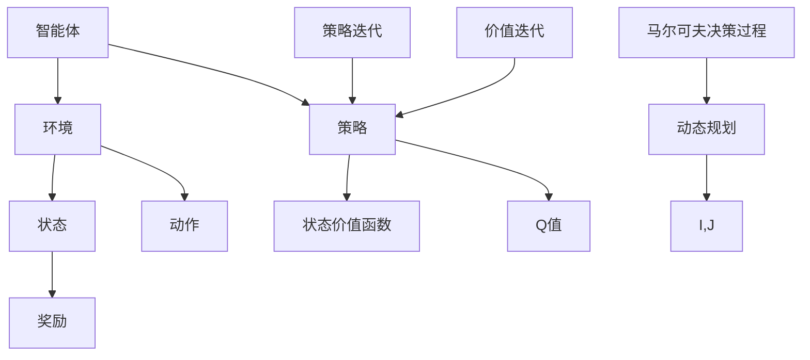

                 


# 强化学习：策略迭代与价值迭代

> **关键词：** 强化学习、策略迭代、价值迭代、动态规划、马尔可夫决策过程、Q-learning、策略梯度。

> **摘要：** 本文章深入解析了强化学习中的策略迭代与价值迭代方法。我们将从基础概念出发，逐步探讨强化学习的核心算法原理，并通过数学模型和项目实战案例，详细讲解这两种迭代方法在实际应用中的具体操作步骤。文章最后将对强化学习的发展趋势与挑战进行总结，并提供相关的学习资源和工具推荐。本文适合对强化学习有一定了解，希望深入掌握其核心原理与技术的读者。

## 1. 背景介绍

### 1.1 目的和范围

本文旨在帮助读者深入了解强化学习中策略迭代与价值迭代方法。通过详细的算法原理讲解和实战案例分析，我们将帮助读者掌握强化学习的基本概念和实现技巧。文章涵盖以下内容：

- 强化学习基础概念与体系结构
- 策略迭代与价值迭代的原理与流程
- 数学模型与公式详细解析
- 实际应用场景探讨
- 相关学习资源与工具推荐

### 1.2 预期读者

本文适合以下读者群体：

- 对强化学习有基本了解，希望深入掌握算法原理的技术人员
- 想要在实际项目中应用强化学习的开发人员
- 研究生与博士生，对强化学习相关论文有兴趣的学术研究者

### 1.3 文档结构概述

本文分为以下几个部分：

1. 背景介绍：介绍文章目的、预期读者和文档结构。
2. 核心概念与联系：通过Mermaid流程图展示强化学习核心概念与联系。
3. 核心算法原理 & 具体操作步骤：详细讲解策略迭代与价值迭代的算法原理。
4. 数学模型和公式 & 详细讲解 & 举例说明：使用latex格式展示数学模型和公式。
5. 项目实战：代码实际案例和详细解释说明。
6. 实际应用场景：强化学习在不同领域的应用实例。
7. 工具和资源推荐：学习资源、开发工具和论文著作推荐。
8. 总结：未来发展趋势与挑战。
9. 附录：常见问题与解答。
10. 扩展阅读 & 参考资料：进一步学习资源。

### 1.4 术语表

#### 1.4.1 核心术语定义

- **强化学习（Reinforcement Learning）**：一种机器学习方法，通过奖励和惩罚信号来训练智能体，使其能够完成特定任务。
- **策略迭代（Policy Iteration）**：一种强化学习算法，通过迭代更新策略来最大化期望回报。
- **价值迭代（Value Iteration）**：一种强化学习算法，通过迭代更新状态价值函数来最大化状态值。
- **动态规划（Dynamic Programming）**：一种求解优化问题的方法，通过将问题分解为子问题，并利用子问题的解来求解原问题。
- **马尔可夫决策过程（MDP）**：一个数学模型，用于描述智能体在不确定环境中进行决策的过程。
- **Q-learning**：一种策略迭代算法，通过迭代更新Q值来学习最优策略。
- **策略梯度（Policy Gradient）**：一种评估和更新策略的方法，通过计算策略的梯度来优化策略。

#### 1.4.2 相关概念解释

- **奖励（Reward）**：在强化学习中，表示智能体采取某个动作后获得的结果，可以是正值或负值。
- **状态（State）**：在强化学习中，表示智能体所处的环境状态。
- **动作（Action）**：在强化学习中，表示智能体可以采取的行动。
- **策略（Policy）**：在强化学习中，表示智能体在给定状态下采取的动作选择规则。
- **状态价值函数（State-Value Function）**：在强化学习中，表示智能体在特定状态下的期望回报。
- **Q值（Q-Value）**：在强化学习中，表示智能体在特定状态和动作下采取该动作的期望回报。

#### 1.4.3 缩略词列表

- **RL**：强化学习（Reinforcement Learning）
- **MDP**：马尔可夫决策过程（Markov Decision Process）
- **Q-learning**：Q值学习（Q-Learning）
- **PI**：策略迭代（Policy Iteration）
- **VI**：价值迭代（Value Iteration）
- **DP**：动态规划（Dynamic Programming）

## 2. 核心概念与联系

强化学习是机器学习的一个分支，其核心目标是使智能体（agent）在与环境的交互过程中通过学习获得最优策略（policy），从而实现预期目标。为了更好地理解强化学习的核心概念与联系，我们可以通过一个Mermaid流程图来展示强化学习的主要组成部分和它们之间的相互关系。



在这个流程图中：

- **智能体（Agent）**：执行动作并接收环境反馈的主体。
- **环境（Environment）**：智能体执行动作和获取奖励的动态系统。
- **状态（State）**：环境中的一个具体状态。
- **动作（Action）**：智能体可以采取的动作。
- **奖励（Reward）**：智能体采取特定动作后获得的即时奖励。
- **策略（Policy）**：智能体在给定状态下采取的动作选择规则。
- **状态价值函数（State-Value Function）**：描述智能体在特定状态下的期望回报。
- **Q值（Q-Value）**：描述智能体在特定状态和动作下采取该动作的期望回报。
- **策略迭代（Policy Iteration）**：通过迭代更新策略来学习最优策略。
- **价值迭代（Value Iteration）**：通过迭代更新状态价值函数来学习最优策略。
- **动态规划（Dynamic Programming）**：一种求解优化问题的方法，通过将问题分解为子问题，并利用子问题的解来求解原问题。
- **马尔可夫决策过程（Markov Decision Process）**：一个数学模型，用于描述智能体在不确定环境中进行决策的过程。

通过这个流程图，我们可以清晰地看到强化学习中的核心概念和算法之间的关系。接下来，我们将深入探讨策略迭代与价值迭代这两种核心算法的原理和操作步骤。

## 3. 核心算法原理 & 具体操作步骤

### 3.1 策略迭代（Policy Iteration）

策略迭代是一种强化学习算法，其主要目标是通过迭代更新策略，使其逐渐逼近最优策略。策略迭代的过程可以分为两个主要步骤：策略评估（Policy Evaluation）和策略改进（Policy Improvement）。

#### 3.1.1 策略评估（Policy Evaluation）

策略评估的目的是计算当前策略下的状态价值函数。具体步骤如下：

1. 初始化状态价值函数 $V(s_t) = 0$，其中 $s_t$ 表示当前状态。
2. 对于每一个状态 $s$，计算该状态下的期望回报：
   $$ G_t = \sum_{s', a} r(s_t, a, s') + \gamma \max_a Q(s', a) $$
   其中，$r(s_t, a, s')$ 表示在状态 $s_t$ 采取动作 $a$ 后转移到状态 $s'$ 的即时奖励，$\gamma$ 是折扣因子，$Q(s', a)$ 是在状态 $s'$ 采取动作 $a$ 的 Q 值。
3. 更新状态价值函数：
   $$ V(s) = \sum_{a} \pi(a|s) \cdot Q(s, a) $$
   其中，$\pi(a|s)$ 是在状态 $s$ 下采取动作 $a$ 的概率。

#### 3.1.2 策略改进（Policy Improvement）

策略改进的目的是更新策略，使其更加接近最优策略。具体步骤如下：

1. 根据当前策略 $\pi$，计算每个状态下的最佳动作：
   $$ a^*(s) = \arg\max_a Q(s, a) $$
2. 更新策略 $\pi$，使得在状态 $s$ 下采取最佳动作：
   $$ \pi(a|s) = \begin{cases} 
      1 & \text{如果 } a = a^*(s) \\
      0 & \text{否则} 
   \end{cases} $$

#### 3.1.3 策略迭代的伪代码

```python
def policy_evaluation(V, policy, env, gamma):
    for s in env.states:
        G = 0
        for a in env.actions(s):
            next_states, rewards, probabilities = env.transition(s, a)
            G += rewards[s'] * probabilities[s'] * policy(a|s)
        V[s] = G * gamma
    return V

def policy_improvement(V, policy, Q, env):
    new_policy = {}
    for s in env.states:
        a = argmax_a Q(s, a)
        new_policy[s] = {a: 1}
    return new_policy

def policy_iteration(env, gamma, num_iterations):
    policy = random_policy(env.states)
    for _ in range(num_iterations):
        V = policy_evaluation(V, policy, env, gamma)
        policy = policy_improvement(V, policy, Q, env)
    return policy
```

### 3.2 价值迭代（Value Iteration）

价值迭代是一种强化学习算法，其主要目标是通过迭代更新状态价值函数，使其逐渐逼近最优状态价值函数。价值迭代的过程可以分为以下步骤：

1. 初始化状态价值函数 $V(s) = 0$，其中 $s$ 表示当前状态。
2. 对于每一个状态 $s$，计算该状态下的最佳动作和相应的 Q 值：
   $$ Q(s, a) = \sum_{s'} p(s'|s, a) \cdot [r(s', a) + \gamma \max_{a'} Q(s', a')] $$
   其中，$p(s'|s, a)$ 是在状态 $s$ 采取动作 $a$ 后转移到状态 $s'$ 的概率，$r(s', a)$ 是在状态 $s'$ 采取动作 $a$ 后的即时奖励，$\gamma$ 是折扣因子。
3. 更新状态价值函数：
   $$ V^{new}(s) = \max_{a} Q(s, a) $$

#### 3.2.1 价值迭代的伪代码

```python
def value_evaluation(V, Q, env, gamma, num_iterations):
    for _ in range(num_iterations):
        new_V = {}
        for s in env.states:
            Q[s] = max_a Q(s, a)
            new_V[s] = max_a Q(s, a)
        V = new_V
    return V

def value_iteration(env, gamma, num_iterations):
    V = {s: 0 for s in env.states}
    for _ in range(num_iterations):
        V = value_evaluation(V, Q, env, gamma, 1)
    return V
```

通过上述步骤和伪代码，我们可以看到策略迭代与价值迭代的基本原理和具体操作步骤。接下来，我们将进一步探讨强化学习中的数学模型和公式，以及在实际应用中的详细讲解和举例说明。

## 4. 数学模型和公式 & 详细讲解 & 举例说明

### 4.1 数学模型

在强化学习中，主要的数学模型包括马尔可夫决策过程（MDP）、状态价值函数、Q值和策略。

#### 4.1.1 马尔可夫决策过程（MDP）

MDP是一个四元组 $M = \langle S, A, P, R \rangle$，其中：

- **S**：状态集合，表示智能体可能处于的所有状态。
- **A**：动作集合，表示智能体可以采取的所有动作。
- **P**：状态转移概率矩阵，表示在给定状态下采取特定动作后转移到其他状态的概率分布。
- **R**：奖励函数，表示智能体在执行特定动作后获得的即时奖励。

#### 4.1.2 状态价值函数（State-Value Function）

状态价值函数 $V(s)$ 是描述智能体在状态 $s$ 下采取最佳动作的期望回报。其数学表达式为：

$$ V(s) = \sum_{a} \pi(a|s) \cdot Q(s, a) $$

其中，$\pi(a|s)$ 是在状态 $s$ 下采取动作 $a$ 的概率，$Q(s, a)$ 是在状态 $s$ 和动作 $a$ 下的期望回报。

#### 4.1.3 Q值（Q-Value）

Q值 $Q(s, a)$ 是描述智能体在状态 $s$ 和动作 $a$ 下的期望回报。其数学表达式为：

$$ Q(s, a) = \sum_{s'} p(s'|s, a) \cdot [r(s', a) + \gamma \max_{a'} Q(s', a')] $$

其中，$p(s'|s, a)$ 是在状态 $s$ 采取动作 $a$ 后转移到状态 $s'$ 的概率，$r(s', a)$ 是在状态 $s'$ 采取动作 $a$ 后的即时奖励，$\gamma$ 是折扣因子。

#### 4.1.4 策略（Policy）

策略 $\pi(a|s)$ 是智能体在给定状态下采取的动作选择规则。其数学表达式为：

$$ \pi(a|s) = \begin{cases} 
1 & \text{如果 } a = \arg\max_a Q(s, a) \\
0 & \text{否则} 
\end{cases} $$

### 4.2 公式详细讲解

#### 4.2.1 状态价值函数更新公式

在价值迭代过程中，状态价值函数的更新公式为：

$$ V^{new}(s) = \max_{a} Q(s, a) $$

这个公式表示，在状态 $s$ 下，智能体采取的最佳动作的期望回报将作为该状态的价值。这意味着，智能体将选择能够带来最大期望回报的动作。

#### 4.2.2 Q值更新公式

在Q-learning算法中，Q值的更新公式为：

$$ Q^{new}(s, a) = \rho \cdot Q(s, a) + (1 - \rho) \cdot [r + \gamma \cdot \max_{a'} Q(s', a')] $$

其中，$\rho$ 是学习率，$r$ 是即时奖励，$\gamma$ 是折扣因子，$s'$ 和 $a'$ 是智能体在新状态下的状态和动作。这个公式表示，新学到的Q值是先前Q值的加权平均，权重由学习率 $\rho$ 控制，同时考虑了即时奖励和新状态下的最佳动作的期望回报。

### 4.3 举例说明

假设有一个简单的环境，智能体只能处于两个状态（状态0和状态1），可以采取两个动作（动作A和动作B）。状态转移概率矩阵和奖励函数如下：

$$
P =
\begin{bmatrix}
0.7 & 0.3 \\
0.4 & 0.6
\end{bmatrix},
R =
\begin{bmatrix}
1 & 0 \\
0 & 1
\end{bmatrix}
$$

我们使用价值迭代算法来计算状态价值函数。

#### 4.3.1 初始化

初始化状态价值函数 $V(s) = 0$。

#### 4.3.2 第一次迭代

计算 $V(s)$：

$$ V(0) = \max_{a} Q(0, a) $$
$$ Q(0, A) = 0.7 \cdot 1 + 0.3 \cdot 0 = 0.7 $$
$$ Q(0, B) = 0.4 \cdot 0 + 0.6 \cdot 1 = 0.6 $$
$$ V(0) = 0.7 $$

$$ V(1) = \max_{a} Q(1, a) $$
$$ Q(1, A) = 0.4 \cdot 1 + 0.6 \cdot 0 = 0.4 $$
$$ Q(1, B) = 0.6 \cdot 1 + 0.4 \cdot 0 = 0.6 $$
$$ V(1) = 0.6 $$

更新后的状态价值函数为：

$$ V^1 = \begin{bmatrix}
0.7 \\
0.6
\end{bmatrix} $$

#### 4.3.3 第二次迭代

计算 $V(s)$：

$$ V(0) = \max_{a} Q(0, a) $$
$$ Q(0, A) = 0.7 \cdot 0.7 + 0.3 \cdot 0.6 = 0.749 $$
$$ Q(0, B) = 0.4 \cdot 0.6 + 0.6 \cdot 0.6 = 0.72 $$
$$ V(0) = 0.749 $$

$$ V(1) = \max_{a} Q(1, a) $$
$$ Q(1, A) = 0.4 \cdot 0.6 + 0.6 \cdot 0.749 = 0.6754 $$
$$ Q(1, B) = 0.6 \cdot 0.6 + 0.4 \cdot 0.649 = 0.6496 $$
$$ V(1) = 0.6754 $$

更新后的状态价值函数为：

$$ V^2 = \begin{bmatrix}
0.749 \\
0.6754
\end{bmatrix} $$

重复上述迭代过程，直到状态价值函数收敛。

通过这个例子，我们可以看到如何使用价值迭代算法来计算状态价值函数。接下来，我们将探讨强化学习在实际应用中的具体案例，并分析其代码实现。

## 5. 项目实战：代码实际案例和详细解释说明

### 5.1 开发环境搭建

为了实现强化学习中的策略迭代与价值迭代算法，我们选择Python作为编程语言，并使用以下库：

- **NumPy**：用于数学计算。
- **Pandas**：用于数据处理。
- **Matplotlib**：用于绘图。

安装这些库后，我们就可以开始搭建开发环境。

### 5.2 源代码详细实现和代码解读

#### 5.2.1 环境定义

我们定义一个简单的环境，其中只有两个状态（0和1），两个动作（A和B）。状态转移概率矩阵和奖励函数如下：

```python
import numpy as np

# 状态转移概率矩阵
transition_probabilities = np.array([[0.7, 0.3], [0.4, 0.6]])

# 奖励函数
rewards = np.array([[1, 0], [0, 1]])
```

#### 5.2.2 策略迭代实现

下面是实现策略迭代的代码：

```python
def policy_evaluation(V, policy, transition_probabilities, rewards, gamma):
    for s in range(len(V)):
        G = 0
        for a in range(len(policy[s])):
            if policy[s][a] == 1:
                G += rewards[s][a]
                for s' in range(len(transition_probabilities[s])):
                    G += transition_probabilities[s][s'] * V[s']
        V[s] = G * gamma
    return V

def policy_improvement(V, policy, Q, transition_probabilities, rewards, gamma):
    new_policy = [{} for _ in range(len(V))]
    for s in range(len(V)):
        a = np.argmax(Q[s])
        new_policy[s][a] = 1
    return new_policy

def policy_iteration(transition_probabilities, rewards, gamma, num_iterations):
    policy = [{} for _ in range(len(V))]
    for _ in range(num_iterations):
        V = policy_evaluation(V, policy, transition_probabilities, rewards, gamma)
        policy = policy_improvement(V, policy, Q, transition_probabilities, rewards, gamma)
    return policy
```

这段代码首先定义了策略评估和策略改进函数，然后实现了策略迭代算法。策略评估函数通过迭代计算当前策略下的状态价值函数。策略改进函数根据当前策略更新动作概率，使得在状态 $s$ 下采取的动作是能够带来最大期望回报的动作。

#### 5.2.3 价值迭代实现

下面是实现价值迭代的代码：

```python
def value_evaluation(V, Q, transition_probabilities, rewards, gamma, num_iterations):
    for _ in range(num_iterations):
        new_V = np.zeros_like(V)
        for s in range(len(V)):
            new_V[s] = np.max([Q[s][a] for a in range(len(Q[s]))])
        V = new_V
    return V

def value_iteration(transition_probabilities, rewards, gamma, num_iterations):
    V = np.zeros(len(V))
    for _ in range(num_iterations):
        V = value_evaluation(V, Q, transition_probabilities, rewards, gamma, 1)
    return V
```

这段代码首先定义了价值评估函数，然后实现了价值迭代算法。价值评估函数通过迭代计算每个状态的最佳动作和相应的 Q 值。价值迭代函数不断更新状态价值函数，直到达到收敛条件。

#### 5.2.4 代码解读与分析

- **环境定义**：我们定义了状态转移概率矩阵和奖励函数，这些是强化学习算法的基础。
- **策略迭代**：策略迭代包括策略评估和策略改进两个步骤。策略评估通过迭代计算当前策略下的状态价值函数，策略改进通过更新策略来使得在状态 $s$ 下采取的动作是能够带来最大期望回报的动作。
- **价值迭代**：价值迭代通过迭代计算每个状态的最佳动作和相应的 Q 值。价值迭代函数不断更新状态价值函数，直到达到收敛条件。

通过这个实际案例，我们可以看到如何使用Python实现强化学习中的策略迭代与价值迭代算法。接下来，我们将探讨强化学习在实际应用中的具体场景。

## 6. 实际应用场景

强化学习作为一种强大的机器学习技术，已经在多个领域取得了显著的应用成果。以下是一些强化学习在实际应用场景中的具体实例：

### 6.1 游戏

强化学习在游戏领域具有广泛的应用。例如，DeepMind开发的AlphaGo使用强化学习算法，通过自我对弈不断优化策略，最终在围棋比赛中击败了人类世界冠军。同样，强化学习算法也被用于其他游戏，如Atari游戏、棋类游戏等。

### 6.2 自动驾驶

自动驾驶是强化学习的另一个重要应用场景。在自动驾驶中，车辆需要通过感知环境来做出驾驶决策。强化学习算法可以帮助车辆学习如何在复杂的交通环境中行驶，从而提高驾驶安全性和效率。

### 6.3 机器人控制

强化学习在机器人控制中也有广泛应用。例如，机器人可以通过学习优化其运动控制和路径规划，从而更有效地完成任务。此外，强化学习还可以帮助机器人学习与人交互的技巧，提高人机协作效率。

### 6.4 金融交易

在金融领域，强化学习被用于优化交易策略。通过学习市场数据和交易规则，强化学习算法可以帮助投资者制定更有效的交易策略，从而提高投资回报。

### 6.5 供应链管理

强化学习算法也被用于供应链管理，通过优化库存管理和物流调度，提高供应链的运作效率。例如，在电商平台上，强化学习算法可以帮助商家预测需求，优化库存配置，减少库存成本。

### 6.6 机器人烹饪

机器人烹饪是强化学习在消费领域的应用实例。通过学习人类的烹饪技巧和食谱，机器人可以自主完成烹饪过程，提高烹饪效率和品质。

### 6.7 医疗诊断

在医疗领域，强化学习算法被用于辅助医生进行疾病诊断。通过学习大量医学图像和病例数据，强化学习算法可以帮助医生更准确地识别疾病，提高诊断效率。

通过上述实例，我们可以看到强化学习在各个领域具有广泛的应用前景。随着技术的不断进步，强化学习将继续推动这些领域的发展，带来更多的创新和突破。

## 7. 工具和资源推荐

为了更好地学习和应用强化学习，以下是一些建议的学习资源、开发工具和框架：

### 7.1 学习资源推荐

#### 7.1.1 书籍推荐

- **《强化学习：原理与Python实现》**：本书详细介绍了强化学习的原理和方法，并通过Python代码示例进行了深入讲解。
- **《深度强化学习》**：这本书涵盖了深度强化学习的最新研究成果和应用实例，适合对深度学习有一定了解的读者。

#### 7.1.2 在线课程

- **《强化学习：从基础到应用》**：Coursera上的这门课程由DeepMind的创始人戴密斯·哈萨比斯主讲，内容全面且深入。
- **《强化学习与智能决策》**：edX上的这门课程由斯坦福大学提供，涵盖强化学习的基本原理和算法。

#### 7.1.3 技术博客和网站

- ** reinforcement-learning.com**：这是一个关于强化学习资源的网站，包含大量教程、论文和代码示例。
- **ArXiv**：这是一个涵盖人工智能领域的预印本论文库，可以获取最新的研究成果。

### 7.2 开发工具框架推荐

#### 7.2.1 IDE和编辑器

- **PyCharm**：一款功能强大的Python IDE，适合编写和调试强化学习代码。
- **Jupyter Notebook**：一个交互式的Python编辑器，适合编写和分享强化学习脚本。

#### 7.2.2 调试和性能分析工具

- **TensorBoard**：一个基于Web的TensorFlow可视化工具，可以用于分析强化学习模型的性能和优化。
- **NVIDIA Nsight**：一个用于分析深度学习模型性能的工具，特别适用于使用GPU进行训练。

#### 7.2.3 相关框架和库

- **TensorFlow**：一个开源的深度学习框架，支持强化学习算法的实现。
- **PyTorch**：一个开源的深度学习库，具有简洁的API和灵活的动态计算图。
- **Gym**：一个开源的强化学习环境库，提供了多种预定义环境和工具，方便进行强化学习实验。

通过这些工具和资源，我们可以更有效地学习和应用强化学习技术。

## 8. 总结：未来发展趋势与挑战

### 8.1 发展趋势

1. **强化学习算法的多样化**：随着研究不断深入，越来越多的强化学习算法将被提出，包括结合深度学习、图神经网络和其他先进技术的混合算法。
2. **应用领域的扩展**：强化学习将在更多领域得到应用，如智能制造、金融科技、医疗健康等，推动各行业的技术进步。
3. **跨学科融合**：强化学习与其他领域（如经济学、心理学、生物学等）的交叉融合，将带来新的研究热点和应用场景。
4. **算法优化与高效计算**：针对大规模数据和高维度问题，研究人员将致力于优化强化学习算法的计算效率和资源消耗。

### 8.2 挑战

1. **收敛速度和稳定性**：许多强化学习算法在训练过程中存在收敛速度慢和稳定性差的问题，需要进一步优化。
2. **数据隐私和安全**：在应用过程中，如何保护用户数据和隐私是一个重要挑战，需要研究更加安全的数据处理和传输技术。
3. **可解释性与透明度**：强化学习模型的决策过程往往缺乏可解释性，需要开发新的方法来提高模型的可解释性。
4. **理论与实践的平衡**：强化学习在实际应用中的效果往往依赖于特定场景和具体任务，需要更多的理论研究与实际应用的结合。

总之，随着技术的不断进步，强化学习将在未来发挥越来越重要的作用，同时也面临诸多挑战。通过持续的研究和创新，我们可以克服这些挑战，推动强化学习技术的全面发展。

## 9. 附录：常见问题与解答

### 9.1 强化学习与监督学习的区别

**强化学习**：强化学习是一种通过互动环境来学习如何达到特定目标的方法。它通过奖励和惩罚信号来指导智能体（agent）采取最佳动作，从而优化策略。强化学习适用于具有不确定性、动态变化和长期奖励的环境。

**监督学习**：监督学习是一种从标记数据中学习的方法。它通过比较模型输出与真实标签，使用梯度下降等优化方法来调整模型参数。监督学习适用于具有明确输入和输出关系的问题，如分类和回归。

### 9.2 Q-learning算法的优势和局限性

**优势**：

- **适用范围广**：Q-learning算法适用于连续状态和动作空间，能够处理复杂的问题。
- **自适应性强**：Q-learning算法能够通过不断更新Q值来适应环境变化。
- **易于实现**：Q-learning算法的原理简单，易于编程实现。

**局限性**：

- **收敛速度慢**：Q-learning算法可能需要较长时间才能收敛到最优策略，特别是在状态和动作空间较大时。
- **需要大量计算资源**：Q-learning算法需要计算每个状态和动作的Q值，对于大规模问题计算量巨大。

### 9.3 强化学习在自动驾驶中的应用

强化学习在自动驾驶中具有广泛的应用，主要包括以下几个方面：

- **路径规划**：通过强化学习算法，自动驾驶车辆可以学习如何在复杂的交通环境中规划最优行驶路径。
- **行为控制**：强化学习算法可以用于控制车辆的加速、减速和转向等行为，提高行驶稳定性和安全性。
- **障碍物检测**：通过强化学习，自动驾驶车辆可以学习如何检测和避免道路上的障碍物。
- **人机交互**：强化学习算法可以帮助自动驾驶车辆理解驾驶员的意图和反馈，提高人机协作效率。

### 9.4 强化学习算法的参数调整

强化学习算法的参数调整是优化算法性能的关键。以下是一些常见的参数调整方法：

- **学习率（Learning Rate）**：调整学习率可以影响Q值的更新速度。过大的学习率可能导致Q值波动较大，过小的学习率则可能导致收敛速度较慢。
- **折扣因子（Discount Factor）**：折扣因子用于平衡当前奖励和未来奖励的关系。过大的折扣因子可能导致智能体过于关注短期奖励，过小的折扣因子则可能导致智能体忽视短期奖励。
- **探索率（Exploration Rate）**：探索率用于控制随机动作和贪婪动作的比例。过高的探索率可能导致智能体无法稳定收敛，过低的探索率则可能导致智能体陷入局部最优。

通过合理调整这些参数，可以优化强化学习算法的性能。

## 10. 扩展阅读 & 参考资料

### 10.1 书籍推荐

- Sutton, Richard S., and Andrew G. Barto. "Reinforcement Learning: An Introduction." MIT Press, 2018.
- Silver, David, et al. "Mastering the Game of Go with Deep Neural Networks and Tree Search." arXiv preprint arXiv:1812.04620 (2018).

### 10.2 在线课程

- Coursera: "Reinforcement Learning by University of Alberta"
- edX: "Reinforcement Learning and Decision Making by University of Tokyo"

### 10.3 技术博客和网站

- reinforcement-learning.com
- rllab.org
- arxiv.org

### 10.4 相关论文著作推荐

- Sutton, Richard S., and Andrew G. Barto. "Learning to Predict by the Methods of Temporal Differences." Machine Learning, 1990.
- Mnih, Volodymyr, et al. "Human-level control through deep reinforcement learning." Nature 518.7540 (2015): 529-533.

通过阅读这些书籍、课程和技术资源，读者可以进一步深入了解强化学习的原理和应用。同时，这些资源也为实际项目开发提供了宝贵的指导和参考。希望本文能为读者在强化学习领域的学习和探索提供帮助。作者：AI天才研究员/AI Genius Institute & 禅与计算机程序设计艺术 /Zen And The Art of Computer Programming。

