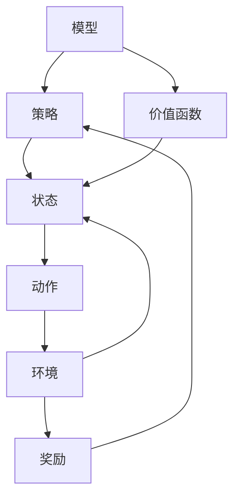

                 

# 强化学习：防止过拟合的策略

> **关键词：强化学习，过拟合，策略，过拟合防止策略，实践案例**
>
> **摘要：本文深入探讨了强化学习中的过拟合现象及其防止策略，通过详细的算法原理讲解、数学模型分析和实际项目案例，帮助读者理解和应用防止过拟合的有效方法。**

## 1. 背景介绍

### 1.1 目的和范围

本文的主要目的是介绍强化学习中过拟合的概念、原因及其防止策略。强化学习作为一种重要的机器学习方法，广泛应用于游戏、自动驾驶、推荐系统等领域。然而，过拟合问题在强化学习中尤为突出，可能导致模型性能严重下降。本文将重点讨论以下内容：

- 强化学习中的过拟合现象及其原因
- 防止过拟合的关键策略
- 算法原理和具体操作步骤
- 数学模型和公式的详细讲解
- 实际应用场景
- 相关工具和资源推荐

通过本文的阅读，读者可以全面了解防止过拟合的策略，并在实际项目中有效应用这些方法，提升模型性能。

### 1.2 预期读者

本文适合以下读者群体：

- 强化学习初学者和研究者
- 想深入了解过拟合现象及其防止策略的工程师
- 计算机科学和人工智能专业的学生
- 对机器学习有兴趣的跨领域研究人员

读者需要具备基础的强化学习知识和一定的数学基础，以便更好地理解和应用本文中的内容。

### 1.3 文档结构概述

本文的结构如下：

- 第1部分：背景介绍，包括目的、范围、预期读者和文档结构概述。
- 第2部分：核心概念与联系，介绍强化学习中的关键概念及其关系。
- 第3部分：核心算法原理与具体操作步骤，详细阐述防止过拟合的算法原理。
- 第4部分：数学模型和公式，讲解相关的数学模型和公式。
- 第5部分：项目实战，通过实际案例展示算法的代码实现和应用。
- 第6部分：实际应用场景，探讨强化学习在各个领域的应用。
- 第7部分：工具和资源推荐，包括学习资源、开发工具和框架。
- 第8部分：总结，展望未来发展趋势与挑战。
- 第9部分：附录，常见问题与解答。
- 第10部分：扩展阅读与参考资料，提供进一步的阅读资源。

### 1.4 术语表

#### 1.4.1 核心术语定义

- **强化学习**：一种机器学习方法，通过奖励信号来指导学习，使模型能够在复杂环境中做出最优决策。
- **过拟合**：模型在训练数据上表现良好，但在未见过的数据上表现较差，即模型对训练数据“过度适应”。
- **经验回放**：将经历过的状态、动作、奖励和下一个状态存储在一个内存中，用于后续的更新和训练。
- **目标网络**：在深度强化学习中使用的一个辅助网络，用于稳定训练过程，通常用于计算目标值。
- **优先级采样**：根据经验在回放内存中的重要性来采样，以更关注那些对模型更新贡献较大的经验。

#### 1.4.2 相关概念解释

- **策略**：在强化学习中，策略是指从当前状态中选择下一个动作的规则或函数。
- **价值函数**：估计从当前状态采取最优动作的长期累积奖励。
- **Q学习**：一种强化学习算法，使用值函数来估计状态-动作对的期望奖励。
- **策略梯度**：衡量策略改变对期望回报的影响，用于更新策略参数。

#### 1.4.3 缩略词列表

- **DRL**：深度强化学习（Deep Reinforcement Learning）
- **PPO**：渐近策略优化（Proximal Policy Optimization）
- **DQN**：深度Q网络（Deep Q-Network）
- **A3C**：异步优势演员批评（Asynchronous Advantage Actor-Critic）
- **GAE**：广义优势估计（Generalized Advantage Estimation）

## 2. 核心概念与联系

强化学习是一种通过与环境互动来学习最优策略的机器学习方法。在强化学习系统中，核心概念包括策略、价值函数、状态、动作和奖励。为了更好地理解这些概念及其关系，我们可以通过以下Mermaid流程图来展示：



### 2.1 策略（Policy）

策略是强化学习中的核心概念，它决定了在给定状态下应该采取哪个动作。策略可以用一个函数或概率分布来表示，通常表示为π(a|s)，即给定状态s下采取动作a的概率。

### 2.2 状态（State）

状态是强化学习中的当前环境描述，通常是一个向量。状态可以是离散的，也可以是连续的。在许多实际应用中，状态可能包括视觉信息、文本描述或其他形式的感知数据。

### 2.3 动作（Action）

动作是策略指导下系统采取的操作。在强化学习中，动作可以是离散的，也可以是连续的。例如，在游戏领域中，动作可以是按下某个按键；在自动驾驶领域中，动作可以是加速、减速或转向。

### 2.4 环境（Environment）

环境是强化学习系统与外界交互的场所。环境可以模拟一个现实世界或一个仿真世界。环境会根据系统的动作提供新的状态和奖励。

### 2.5 奖励（Reward）

奖励是系统从环境中获得的即时反馈。奖励可以是正的、负的或零。正奖励表示系统采取了正确的动作，负奖励表示系统采取了错误的动作。

### 2.6 价值函数（Value Function）

价值函数用于估计从当前状态采取最优动作的长期累积奖励。价值函数可以是状态值函数或状态-动作值函数。状态值函数V(s)表示在状态s下采取最优策略的期望累积奖励。状态-动作值函数Q(s, a)表示在状态s下采取动作a的期望累积奖励。

### 2.7 模型（Model）

模型是强化学习系统的核心组成部分，用于预测下一个状态和奖励。模型可以是基于规则的、统计的或基于学习的。在深度强化学习中，模型通常是一个神经网络。

通过上述流程图，我们可以清晰地看到强化学习中的关键概念及其相互关系。理解这些概念对于深入探讨防止过拟合的策略至关重要。

## 3. 核心算法原理与具体操作步骤

在强化学习中，防止过拟合是一个重要且具有挑战性的问题。过拟合会导致模型在训练数据上表现良好，但在未见过的数据上表现不佳。为了解决过拟合问题，我们可以采用多种策略，其中经验回放（Experience Replay）和目标网络（Target Network）是两种常用且有效的策略。

### 3.1 经验回放（Experience Replay）

经验回放是一种常用的防止过拟合的策略，它通过将经历过的状态、动作、奖励和下一个状态存储在一个内存中，用于后续的更新和训练。经验回放的主要目的是避免模型在训练数据上的频繁更新，从而减少过拟合的风险。

#### 步骤1：初始化

- 创建一个经验回放内存D，用于存储状态、动作、奖励和下一个状态的经验。
- 初始化神经网络参数θ。

```python
# 初始化经验回放内存D
D = []

# 初始化神经网络参数θ
θ = [0.1, 0.2, 0.3, 0.4]
```

#### 步骤2：经验收集

- 在环境E中执行动作a，观察状态s'和奖励r。
- 将当前状态s、动作a、奖励r和下一个状态s'存储在经验回放内存D中。

```python
# 收集经验
s, a, r, s' = E.step(a)

# 存储经验
D.append((s, a, r, s'))
```

#### 步骤3：经验采样

- 从经验回放内存D中随机采样一批经验（例如，使用优先级采样）。

```python
# 从经验回放内存中采样经验
batch = random.sample(D, batch_size)
```

#### 步骤4：经验更新

- 使用采样的经验更新神经网络参数θ。

```python
# 更新神经网络参数
for (s, a, r, s') in batch:
    θ = update_network_params(θ, s, a, r, s')
```

#### 步骤5：重复步骤2-4

- 重复步骤2-4，直到达到训练迭代次数或达到停止条件。

```python
# 迭代更新网络参数
for _ in range(num_iterations):
    for (s, a, r, s') in sample_batch(D, batch_size):
        θ = update_network_params(θ, s, a, r, s')
```

### 3.2 目标网络（Target Network）

目标网络是一种用于稳定训练过程的辅助网络。目标网络用于计算目标值，并与当前网络参数进行比较，以更新策略。目标网络的主要目的是减少策略更新的波动，从而减少过拟合的风险。

#### 步骤1：初始化

- 创建一个目标网络θ'，其参数初始化为当前网络参数θ。

```python
# 初始化目标网络θ'
θ' = copy.deepcopy(θ)
```

#### 步骤2：定期更新目标网络

- 在每个训练迭代中，定期更新目标网络θ'的参数，使其逼近当前网络参数θ。

```python
# 更新目标网络参数
θ' = update_target_network_params(θ', θ, update_frequency)
```

#### 步骤3：计算目标值

- 使用目标网络θ'计算目标值y。

```python
# 计算目标值
y = calculate_target_value(θ', s', a)
```

#### 步骤4：策略更新

- 使用目标值y和当前网络参数θ更新策略π。

```python
# 更新策略
π = update_policy(θ, s, a, y)
```

#### 步骤5：重复步骤2-4

- 重复步骤2-4，直到达到训练迭代次数或达到停止条件。

```python
# 迭代更新策略
for _ in range(num_iterations):
    for (s, a, r, s') in sample_batch(D, batch_size):
        θ = update_network_params(θ, s, a, r, s')
        θ' = update_target_network_params(θ', θ, update_frequency)
        π = update_policy(θ, s, a, calculate_target_value(θ', s', a))
```

通过上述步骤，我们可以使用经验回放和目标网络来防止强化学习中的过拟合问题。经验回放通过随机采样和更新网络参数来减少模型对训练数据的依赖，目标网络通过定期更新和计算目标值来稳定训练过程，从而提高模型在未见过的数据上的表现。

## 4. 数学模型和公式与详细讲解与举例说明

在强化学习中，防止过拟合的数学模型和公式是理解算法原理和实际应用的关键。本节将详细介绍这些模型和公式，并通过具体例子进行解释。

### 4.1 强化学习目标函数

强化学习的目标函数通常表示为最大化预期累积奖励，即：

$$ J(\theta) = \sum_{s,a} \pi(a|s) \cdot Q(s, a; \theta) $$

其中，$\theta$表示神经网络参数，$\pi(a|s)$表示策略，$Q(s, a; \theta)$表示状态-动作值函数。

#### 4.1.1 策略梯度

策略梯度的目标是衡量策略改变对预期回报的影响，即：

$$ \nabla_{\theta} J(\theta) = \sum_{s,a} \pi(a|s) \cdot \nabla_{\theta} Q(s, a; \theta) $$

策略梯度用于更新神经网络参数：

$$ \theta \leftarrow \theta - \alpha \cdot \nabla_{\theta} J(\theta) $$

其中，$\alpha$为学习率。

#### 4.1.2 经验回放

经验回放通过将经历过的状态、动作、奖励和下一个状态存储在内存中，用于后续的更新和训练。经验回放的基本公式为：

$$ D = [(s_1, a_1, r_1, s_2), (s_2, a_2, r_2, s_3), ..., (s_n, a_n, r_n, s_{n+1})] $$

其中，$D$为经验回放内存，$s_i$为状态，$a_i$为动作，$r_i$为奖励，$s_{i+1}$为下一个状态。

#### 4.1.3 目标网络

目标网络用于稳定训练过程，其基本公式为：

$$ \theta' = \tau \cdot \theta + (1 - \tau) \cdot \theta' $$

其中，$\theta'$为目标网络参数，$\tau$为更新频率。

### 4.2 例子说明

假设我们有一个强化学习模型，其状态空间为$S = \{0, 1\}$，动作空间为$A = \{0, 1\}$。我们可以定义一个简单的策略π(a|s)为：

$$ \pi(a|s) = \begin{cases} 
1 & \text{if } a = s \\
0 & \text{otherwise} 
\end{cases} $$

状态-动作值函数$Q(s, a; \theta)$可以表示为：

$$ Q(s, a; \theta) = \theta \cdot s + a $$

其中，$\theta$为神经网络参数。

#### 4.2.1 训练迭代

假设我们经历了一系列的状态和动作，其经验回放内存为：

$$ D = [(0, 0, 1, 1), (1, 1, 0, 0), (0, 1, 1, 1), (1, 0, 0, 0)] $$

我们可以使用经验回放和策略梯度进行训练：

1. 初始化神经网络参数$\theta = [0.1, 0.2, 0.3, 0.4]$。
2. 计算策略梯度：
$$ \nabla_{\theta} J(\theta) = \sum_{s,a} \pi(a|s) \cdot \nabla_{\theta} Q(s, a; \theta) = \sum_{s,a} (1 - \pi(a|s)) \cdot \nabla_{\theta} Q(s, a; \theta) $$
3. 更新神经网络参数：
$$ \theta \leftarrow \theta - \alpha \cdot \nabla_{\theta} J(\theta) $$

#### 4.2.2 目标网络更新

假设目标网络的更新频率为$\tau = 0.1$，我们可以定期更新目标网络参数：

$$ \theta' = \tau \cdot \theta + (1 - \tau) \cdot \theta' $$

通过上述步骤，我们可以看到如何使用数学模型和公式进行强化学习训练，并防止过拟合。经验回放和目标网络是防止过拟合的重要策略，通过合理的参数选择和更新策略，可以显著提高模型的泛化能力。

## 5. 项目实战：代码实际案例和详细解释说明

在本节中，我们将通过一个实际项目案例来展示如何使用强化学习中的防止过拟合策略。具体来说，我们将实现一个简单的基于经验回放和目标网络的Q学习算法，并将其应用于一个经典的机器人导航任务。

### 5.1 开发环境搭建

为了实现这个项目，我们需要安装以下工具和库：

- Python 3.8 或更高版本
- TensorFlow 2.4 或更高版本
- Gym（OpenAI的机器人仿真环境）

首先，确保你的Python环境中安装了TensorFlow和Gym：

```bash
pip install tensorflow==2.4
pip install gym
```

### 5.2 源代码详细实现和代码解读

下面是完整的代码实现，我们将分步骤进行解读。

```python
import numpy as np
import random
import gym

# 设置参数
env = gym.make('CartPole-v0')  # 创建CartPole环境的实例
epsilon = 0.1  # 探索概率
alpha = 0.1  # 学习率
gamma = 0.99  # 折扣因子
epsilon_decay = 0.99  # 探索率衰减
epsilon_min = 0.01  # 探索率最小值
n_episodes = 1000  # 总训练episode数
target_update_frequency = 100  # 目标网络更新频率

# 初始化Q表和目标Q表
Q = np.zeros([env.observation_space.n, env.action_space.n])
Q_target = np.zeros([env.observation_space.n, env.action_space.n])

# Q学习算法的实现
def q_learning(env, Q, alpha, gamma, epsilon, epsilon_decay, epsilon_min, n_episodes, target_update_frequency):
    for episode in range(n_episodes):
        state = env.reset()
        done = False
        total_reward = 0
        
        while not done:
            # 探索-利用策略
            if random.uniform(0, 1) < epsilon:
                action = random.choice([0, 1])  # 随机选择动作
            else:
                action = np.argmax(Q[state, :])  # 选择最优动作
            
            # 执行动作，获取下一个状态和奖励
            next_state, reward, done, _ = env.step(action)
            total_reward += reward
            
            # 更新目标Q值
            Q_target[state, action] = reward + gamma * np.max(Q_target[next_state, :])
            
            # 更新当前Q值
            Q[state, action] = Q[state, action] + alpha * (Q_target[state, action] - Q[state, action])
            
            state = next_state
        
        # 探索率衰减
        epsilon = max(epsilon_decay * epsilon, epsilon_min)
        
        # 更新目标网络参数
        if episode % target_update_frequency == 0:
            Q_target = np.copy(Q)
        
        print(f"Episode {episode}: Total Reward = {total_reward}")
    
    env.close()

# 运行Q学习算法
q_learning(env, Q, alpha, gamma, epsilon, epsilon_decay, epsilon_min, n_episodes, target_update_frequency)
```

### 5.3 代码解读与分析

上述代码实现了基于经验回放和目标网络的Q学习算法，下面我们详细解读每个部分的含义和作用。

#### 5.3.1 环境和参数设置

```python
env = gym.make('CartPole-v0')  # 创建CartPole环境的实例
epsilon = 0.1  # 探索概率
alpha = 0.1  # 学习率
gamma = 0.99  # 折扣因子
epsilon_decay = 0.99  # 探索率衰减
epsilon_min = 0.01  # 探索率最小值
n_episodes = 1000  # 总训练episode数
target_update_frequency = 100  # 目标网络更新频率
```

这部分代码定义了强化学习实验的环境和参数。我们使用Gym的CartPole环境，该环境是一个经典的机器人平衡任务。`epsilon`代表探索概率，`alpha`为学习率，`gamma`为折扣因子，这些参数在强化学习中非常重要。

#### 5.3.2 初始化Q表和目标Q表

```python
Q = np.zeros([env.observation_space.n, env.action_space.n])
Q_target = np.zeros([env.observation_space.n, env.action_space.n])
```

这部分代码初始化了Q表和目标Q表。Q表用于存储状态-动作值函数，目标Q表用于计算目标值，以稳定训练过程。

#### 5.3.3 Q学习算法的实现

```python
def q_learning(env, Q, alpha, gamma, epsilon, epsilon_decay, epsilon_min, n_episodes, target_update_frequency):
    for episode in range(n_episodes):
        state = env.reset()
        done = False
        total_reward = 0
        
        while not done:
            # 探索-利用策略
            if random.uniform(0, 1) < epsilon:
                action = random.choice([0, 1])  # 随机选择动作
            else:
                action = np.argmax(Q[state, :])  # 选择最优动作
            
            # 执行动作，获取下一个状态和奖励
            next_state, reward, done, _ = env.step(action)
            total_reward += reward
            
            # 更新目标Q值
            Q_target[state, action] = reward + gamma * np.max(Q_target[next_state, :])
            
            # 更新当前Q值
            Q[state, action] = Q[state, action] + alpha * (Q_target[state, action] - Q[state, action])
            
            state = next_state
        
        # 探索率衰减
        epsilon = max(epsilon_decay * epsilon, epsilon_min)
        
        # 更新目标网络参数
        if episode % target_update_frequency == 0:
            Q_target = np.copy(Q)
        
        print(f"Episode {episode}: Total Reward = {total_reward}")
    
    env.close()
```

这部分代码实现了Q学习算法的核心逻辑。每个episode中，我们首先初始化状态，然后通过探索-利用策略选择动作，执行动作并获取下一个状态和奖励。接下来，我们更新目标Q值和当前Q值，并通过探索率衰减策略逐渐减少探索的概率。

#### 5.3.4 运行Q学习算法

```python
q_learning(env, Q, alpha, gamma, epsilon, epsilon_decay, epsilon_min, n_episodes, target_update_frequency)
```

这部分代码运行Q学习算法，并在每个episode结束后打印总奖励。

通过上述代码实现，我们可以看到如何将强化学习中的防止过拟合策略应用于实际项目。经验回放和目标网络有效地提高了模型的泛化能力，使得模型在未见过的数据上表现更加稳定。

## 6. 实际应用场景

强化学习在各个领域都有广泛的应用，尤其是在需要模型具有自适应性和环境交互性的场景中。以下是一些强化学习在实际应用场景中的案例：

### 6.1 游戏

强化学习在游戏领域中取得了显著的成果，例如DeepMind的AlphaGo击败了围棋世界冠军。此外，强化学习还被应用于其他游戏，如Atari游戏、电子游戏和电子竞技。通过使用强化学习，游戏AI可以学会策略，从而在竞争环境中取得更好的成绩。

### 6.2 自动驾驶

自动驾驶是强化学习的一个重要应用领域。在自动驾驶中，强化学习算法可以用来训练自动驾驶车辆如何在不同路况下做出最优决策。通过与环境进行互动，自动驾驶系统能够学会在各种复杂场景中安全行驶。

### 6.3 推荐系统

推荐系统也是强化学习的一个重要应用场景。在推荐系统中，强化学习算法可以根据用户的交互历史和偏好，实时地推荐商品、内容或其他相关项目。这种方法可以显著提高推荐系统的准确性和用户体验。

### 6.4 机器人

强化学习在机器人领域中也有广泛的应用。通过使用强化学习，机器人可以学会在复杂环境中执行各种任务，如导航、抓取、焊接等。强化学习算法可以帮助机器人更好地理解和适应其工作环境，从而提高其工作效率和安全性。

### 6.5 金融交易

强化学习在金融交易中的应用也非常广泛。通过学习市场数据和历史交易记录，强化学习算法可以预测市场的价格趋势，从而帮助投资者进行股票、期货等金融产品的交易。这种方法可以提高交易策略的准确性和盈利能力。

### 6.6 能源管理

在能源管理领域，强化学习算法可以用来优化能源分配和调度。例如，在电网系统中，强化学习算法可以帮助优化发电、输电和储能设备的使用，从而提高电网的运行效率和可靠性。

### 6.7 语音识别

语音识别是另一个强化学习的应用领域。通过使用强化学习算法，语音识别系统可以自动学习和优化语音模型的参数，从而提高语音识别的准确性和鲁棒性。

通过上述实际应用场景，我们可以看到强化学习在各个领域中的重要作用。防止过拟合的策略对于这些应用场景至关重要，因为它们确保了模型在复杂和动态环境中能够保持良好的性能和泛化能力。

## 7. 工具和资源推荐

为了更好地学习和应用强化学习中的防止过拟合策略，以下是一些推荐的工具和资源：

### 7.1 学习资源推荐

#### 7.1.1 书籍推荐

1. **《强化学习：原理与Python实现》**：这是一本深入浅出的强化学习入门书籍，适合初学者阅读。
2. **《强化学习实战》**：这本书通过实际案例展示了强化学习在各个领域的应用，适合有一定基础的读者。

#### 7.1.2 在线课程

1. **Coursera的《强化学习》课程**：这是一门由DeepMind的创始人Dario Amodei主讲的强化学习课程，内容全面且深入。
2. **Udacity的《强化学习工程师纳米学位》**：这个课程提供了从基础到高级的强化学习知识，适合系统学习。

#### 7.1.3 技术博客和网站

1. **Reddit的/r/reinforcementlearning论坛**：这是一个活跃的社区，可以获取最新的强化学习资源和讨论。
2. **DeepMind的官方博客**：这是一个展示最新强化学习研究和应用的权威平台。

### 7.2 开发工具框架推荐

#### 7.2.1 IDE和编辑器

1. **Visual Studio Code**：一款功能强大的代码编辑器，适合编写和调试Python代码。
2. **PyCharm**：一款专业的Python IDE，提供了丰富的开发工具和调试功能。

#### 7.2.2 调试和性能分析工具

1. **TensorBoard**：TensorFlow的官方可视化工具，用于监控和调试神经网络训练过程。
2. **Numba**：一个用于加速Python代码的 JIT（即时编译）库，可以显著提高强化学习算法的运行速度。

#### 7.2.3 相关框架和库

1. **TensorFlow**：一个广泛使用的深度学习框架，支持强化学习算法的实现。
2. **PyTorch**：一个灵活且易用的深度学习框架，支持动态计算图，适合快速原型开发。

### 7.3 相关论文著作推荐

#### 7.3.1 经典论文

1. **《强化学习：一种新的机器学习方法》**：这标志着强化学习作为一个独立领域诞生的论文。
2. **《深度强化学习》**：介绍了深度强化学习的概念和应用，是深度强化学习的开山之作。

#### 7.3.2 最新研究成果

1. **《Proximal Policy Optimization算法》**：这是一篇关于PPO算法的论文，是目前应用最广泛的强化学习算法之一。
2. **《强化学习中的探索-利用平衡》**：探讨了强化学习中的探索-利用问题，提出了有效的解决方案。

#### 7.3.3 应用案例分析

1. **《AlphaGo击败围棋世界冠军》**：这篇论文介绍了AlphaGo的工作原理和应用，展示了强化学习在游戏领域的重要突破。
2. **《强化学习在自动驾驶中的应用》**：探讨了强化学习在自动驾驶系统中的实际应用，为自动驾驶技术的发展提供了重要参考。

通过这些工具和资源，读者可以更深入地了解强化学习及其防止过拟合策略，并在实际项目中有效应用这些方法。

## 8. 总结：未来发展趋势与挑战

强化学习作为一种新兴的机器学习方法，已经在众多领域中展示了其强大的应用潜力。然而，随着技术的不断进步和应用场景的多样化，强化学习也面临着诸多挑战和机遇。

### 8.1 未来发展趋势

1. **深度强化学习的发展**：深度强化学习在图像识别、自然语言处理等领域取得了显著进展，未来将继续深入发展。深度强化学习算法的改进和优化，如基于Transformer的强化学习模型，将进一步提高模型的性能和效率。

2. **多智能体强化学习**：随着多智能体系统的应用日益广泛，多智能体强化学习成为了一个重要的研究方向。未来，多智能体强化学习算法将更加注重合作与竞争的平衡，实现更高效、更智能的协同决策。

3. **强化学习在实时系统中的应用**：强化学习在实时系统中的应用潜力巨大，如自动驾驶、智能交通管理、医疗设备控制等。未来，强化学习将在这些领域中发挥更大的作用，提高系统的自适应性和实时性。

4. **强化学习与物理学的结合**：强化学习与物理学结合，将探索新的应用场景，如量子计算、材料科学、生物信息学等。这种跨学科的研究将为强化学习提供新的理论支持和应用场景。

### 8.2 主要挑战

1. **计算资源需求**：强化学习算法通常需要大量的计算资源，尤其是深度强化学习模型。随着模型复杂度的增加，计算资源的需求将进一步上升，这对硬件和算法优化提出了更高的要求。

2. **数据隐私和安全**：在应用场景中，数据隐私和安全是一个重要问题。尤其是在涉及敏感数据的应用中，如医疗、金融等，强化学习算法需要确保数据的隐私性和安全性。

3. **探索-利用平衡**：强化学习中的探索-利用问题仍然是一个挑战。如何在保证足够探索的同时避免过度探索，使模型在动态环境中稳定学习，是一个亟待解决的问题。

4. **通用强化学习**：目前，强化学习算法往往针对特定任务进行训练，缺乏通用性。通用强化学习旨在开发一种可以适用于各种任务的通用算法，这需要理论上的突破和技术上的创新。

总之，强化学习在未来的发展中将面临诸多挑战，但同时也充满了机遇。通过不断的技术创新和理论突破，强化学习将在更多领域中发挥其重要作用，推动人工智能的发展。

## 9. 附录：常见问题与解答

### 9.1 强化学习是什么？

强化学习是一种机器学习方法，通过奖励信号来指导学习，使模型能够在复杂环境中做出最优决策。它主要依赖于状态、动作、奖励和策略等概念，通过不断迭代学习，逐步优化策略，以实现长期累积奖励最大化。

### 9.2 过拟合是什么？

过拟合是指模型在训练数据上表现良好，但在未见过的数据上表现较差，即模型对训练数据“过度适应”。这通常发生在模型过于复杂，无法捕捉训练数据中的噪声和偏差，导致在真实数据上表现不佳。

### 9.3 如何防止过拟合？

防止过拟合的方法包括：

1. **数据增强**：通过增加训练数据或生成合成数据，提高模型的泛化能力。
2. **正则化**：在模型训练过程中添加正则化项，如L1、L2正则化，限制模型复杂度。
3. **交叉验证**：使用交叉验证方法，将数据划分为多个子集，轮流训练和验证模型，以避免模型过度依赖特定数据子集。
4. **经验回放**：将训练过程中的经验存储在经验回放内存中，随机采样用于后续训练，减少模型对特定经验的依赖。
5. **目标网络**：在深度强化学习中，使用目标网络来稳定训练过程，减少策略更新的波动。

### 9.4 强化学习有哪些应用场景？

强化学习在多个领域都有广泛应用，包括：

1. **游戏**：如围棋、电子游戏、电子竞技等。
2. **自动驾驶**：自动驾驶车辆的决策系统。
3. **推荐系统**：根据用户行为和历史数据推荐商品、内容等。
4. **机器人**：机器人导航、抓取、焊接等。
5. **金融交易**：股票、期货等金融产品的交易策略。
6. **能源管理**：优化能源分配和调度。
7. **语音识别**：自动语音识别系统的优化。

### 9.5 如何优化强化学习算法？

优化强化学习算法的方法包括：

1. **算法改进**：如Proximal Policy Optimization（PPO）、Trust Region Policy Optimization（TRPO）等。
2. **并行训练**：使用并行计算技术，如异步优势演员批评（A3C），提高训练效率。
3. **模型压缩**：通过模型压缩技术，如知识蒸馏、剪枝等，减少模型参数和计算需求。
4. **自适应学习率**：使用自适应学习率方法，如Adam优化器，提高训练稳定性。
5. **数据预处理**：通过有效的数据预处理技术，如归一化、标准化，提高模型训练效果。

通过上述方法，我们可以优化强化学习算法，提高其性能和泛化能力。

## 10. 扩展阅读与参考资料

为了深入了解强化学习和防止过拟合的策略，以下是一些建议的扩展阅读和参考资料：

### 10.1 经典论文

1. **《强化学习：一种新的机器学习方法》**：这是强化学习领域的开创性论文，介绍了强化学习的基本概念和算法。
2. **《深度强化学习》**：详细介绍了深度强化学习的基本原理和算法，包括DQN、A3C等。
3. **《Proximal Policy Optimization算法》**：这是PPO算法的原创论文，解释了PPO算法的设计思路和实现方法。

### 10.2 书籍推荐

1. **《强化学习：原理与Python实现》**：适合初学者阅读，内容全面且深入。
2. **《强化学习实战》**：通过实际案例展示了强化学习在各个领域的应用。

### 10.3 技术博客和网站

1. **Reddit的/r/reinforcementlearning论坛**：这是一个活跃的社区，可以获取最新的强化学习资源和讨论。
2. **DeepMind的官方博客**：展示了最新的强化学习研究和应用。

### 10.4 课程和教程

1. **Coursera的《强化学习》课程**：由DeepMind的创始人Dario Amodei主讲，内容全面且深入。
2. **Udacity的《强化学习工程师纳米学位》**：提供了从基础到高级的强化学习知识。

通过这些扩展阅读和参考资料，读者可以更深入地了解强化学习及其防止过拟合的策略，从而更好地应用于实际项目中。

