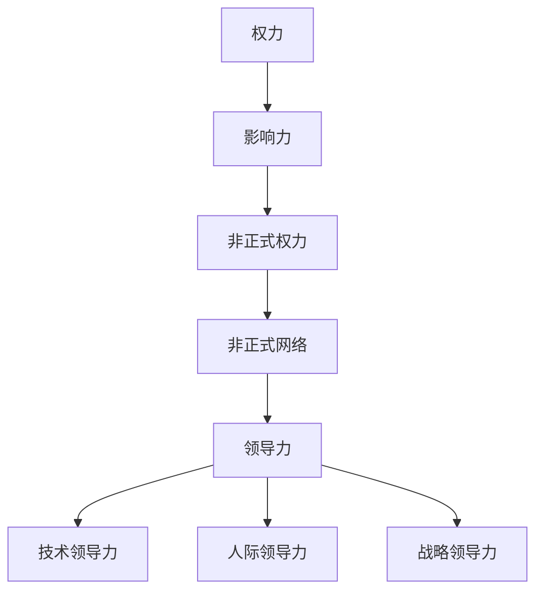

                 

# 影响力工程：扩大非正式权力的领导策略

> 关键词：非正式权力、领导策略、影响力、组织变革、人际沟通

> 摘要：本文将深入探讨非正式权力在组织中的作用及其扩大策略，通过具体案例和实践方法，揭示如何在复杂多变的组织中发挥领导力，实现组织变革和个人职业发展的目标。

## 1. 背景介绍

### 1.1 目的和范围

本文旨在揭示非正式权力在组织中的重要性，并探讨如何通过有效的领导策略来扩大非正式权力，进而实现组织目标和个人职业发展。本文将围绕以下几个问题展开：

1. 非正式权力的定义及其在组织中的作用是什么？
2. 如何识别和培养组织中的潜在领导者？
3. 非正式权力的扩大策略有哪些？
4. 如何通过非正式权力实现组织变革？

### 1.2 预期读者

本文适用于以下读者群体：

1. 组织管理人员
2. 非正式领导者
3. 想要提升领导力和影响力的专业人士
4. 对组织变革和人力资源管理有兴趣的学者和研究人员

### 1.3 文档结构概述

本文结构如下：

1. 背景介绍
2. 核心概念与联系
3. 核心算法原理 & 具体操作步骤
4. 数学模型和公式 & 详细讲解 & 举例说明
5. 项目实战：代码实际案例和详细解释说明
6. 实际应用场景
7. 工具和资源推荐
8. 总结：未来发展趋势与挑战
9. 附录：常见问题与解答
10. 扩展阅读 & 参考资料

### 1.4 术语表

#### 1.4.1 核心术语定义

- **非正式权力**：指在正式组织架构之外，通过个人魅力、专业知识、人际关系等因素影响他人的能力。
- **领导策略**：为实现特定目标而采取的一系列策略和方法。
- **影响力**：指通过某种方式对他人行为、态度和决策产生影响的程度。

#### 1.4.2 相关概念解释

- **正式权力**：基于组织架构和职位所赋予的权力，如决策权、监督权等。
- **组织变革**：指组织在应对外部环境和内部需求变化时，对组织结构、流程、文化等方面的调整和优化。

#### 1.4.3 缩略词列表

- **IT**：信息技术（Information Technology）
- **HR**：人力资源（Human Resource）
- **CEO**：首席执行官（Chief Executive Officer）
- **CFO**：首席财务官（Chief Financial Officer）

## 2. 核心概念与联系

在探讨非正式权力的领导策略之前，我们需要理解以下几个核心概念：

1. **权力与影响力的关系**：权力是影响力的一种表现形式，但影响力不仅仅局限于权力。
2. **非正式网络**：非正式组织中的信息流通和关系网络，对于非正式权力的发挥具有重要影响。
3. **领导力的多层次性**：领导力包括技术领导力、人际领导力和战略领导力等多个方面。

以下是这些核心概念之间的联系：



### 2.1 权力与影响力的关系

权力与影响力是相互关联的，权力可以通过影响他人来实现目标，而影响力则是权力的基础。在组织中，正式权力通常是由职位和资源所赋予的，而非正式权力则更多地依赖于个人魅力、专业知识和人际关系等因素。

### 2.2 非正式网络

非正式网络是组织内部的信息流通和关系网络，它有助于非正式权力的发挥。通过建立和维护良好的非正式网络，领导者可以更有效地传递信息、协调资源和解决问题。

### 2.3 领导力的多层次性

领导力不仅仅包括技术层面的领导，还涉及人际和战略层面。技术领导力指的是在特定领域内的专业知识和技能，人际领导力则是通过建立信任、沟通和协作来实现团队目标，而战略领导力则是指从宏观角度规划和指导组织发展。

## 3. 核心算法原理 & 具体操作步骤

### 3.1 非正式权力的核心算法原理

非正式权力的核心算法可以概括为以下几个步骤：

1. **识别关键节点**：通过分析组织结构和非正式网络，识别出具有重要影响力的关键节点。
2. **建立信任关系**：与关键节点建立信任关系，通过共同目标和价值观的认同，增强彼此之间的信任。
3. **传递信息**：利用非正式网络，将重要信息传递给关键节点，从而实现对组织的有效影响。
4. **影响决策**：通过关键节点的影响，引导组织决策朝着预期的方向发展。

### 3.2 非正式权力的具体操作步骤

以下是实现非正式权力的具体操作步骤：

1. **评估个人影响力**：首先，需要评估自己在组织中的影响力，包括技术能力、人际关系和资源获取等方面。
2. **建立人际关系网络**：通过参加社交活动、组织内部交流等方式，建立和维护广泛的人际关系网络。
3. **识别关键节点**：分析组织结构和非正式网络，识别出具有潜在影响力的关键节点。
4. **建立信任关系**：与关键节点进行沟通，建立信任关系，共同探讨问题和解决方案。
5. **传递信息**：利用非正式网络，将重要信息传递给关键节点，确保信息传递的准确性和及时性。
6. **影响决策**：通过与关键节点的合作，共同推动组织决策的制定和实施。

### 3.3 非正式权力的核心算法原理 & 具体操作步骤的伪代码

```python
# 评估个人影响力
evaluate_influence()

# 建立人际关系网络
build_relationship_network()

# 识别关键节点
identify_key_nodes()

# 建立信任关系
establish_trust()

# 传递信息
transmit_information()

# 影响决策
influence_decision()
```

## 4. 数学模型和公式 & 详细讲解 & 举例说明

### 4.1 数学模型和公式

为了更好地理解非正式权力的扩大策略，我们可以引入以下几个数学模型和公式：

1. **影响力函数**：影响力函数描述了个人影响力与关键节点数量、信任关系和传递信息频率之间的关系。

   影响力函数可以表示为：
   $$ I = f(K, T, N) $$

   其中，$I$ 表示个人影响力，$K$ 表示关键节点数量，$T$ 表示信任关系，$N$ 表示传递信息频率。

2. **信任函数**：信任函数描述了信任关系对个人影响力的影响。

   信任函数可以表示为：
   $$ T = g(R, C) $$

   其中，$T$ 表示信任关系，$R$ 表示关系强度，$C$ 表示价值观认同。

3. **信息传递函数**：信息传递函数描述了信息传递频率对个人影响力的影响。

   信息传递函数可以表示为：
   $$ N = h(F, D) $$

   其中，$N$ 表示传递信息频率，$F$ 表示传递频率，$D$ 表示信息准确性。

### 4.2 详细讲解和举例说明

#### 4.2.1 影响力函数

影响力函数 $I = f(K, T, N)$ 表示了个人影响力与关键节点数量、信任关系和传递信息频率之间的关系。具体而言：

- 关键节点数量 $K$：关键节点数量越多，个人影响力越大，因为通过关键节点可以更广泛地传递信息和建立信任关系。
- 信任关系 $T$：信任关系越强，个人影响力越大，因为信任可以减少信息传递过程中的失真和阻碍。
- 传递信息频率 $N$：传递信息频率越高，个人影响力越大，因为频繁的信息传递可以增强信息的传播效果。

例如，假设一个组织中有 $5$ 个关键节点，$3$ 个信任关系，$2$ 次传递信息频率，根据影响力函数，可以计算出个人影响力：

$$ I = f(5, 3, 2) = 5 \times 3 \times 2 = 30 $$

#### 4.2.2 信任函数

信任函数 $T = g(R, C)$ 表示了信任关系对个人影响力的影响。具体而言：

- 关系强度 $R$：关系强度越高，信任关系越强，个人影响力越大。
- 价值观认同 $C$：价值观认同越强，信任关系越强，个人影响力越大。

例如，假设一个关系强度为 $4$，价值观认同为 $5$，根据信任函数，可以计算出信任关系：

$$ T = g(4, 5) = 4 + 5 = 9 $$

#### 4.2.3 信息传递函数

信息传递函数 $N = h(F, D)$ 表示了信息传递频率对个人影响力的影响。具体而言：

- 传递频率 $F$：传递频率越高，信息传递频率越大，个人影响力越大。
- 信息准确性 $D$：信息准确性越高，信息传递频率越大，个人影响力越大。

例如，假设一个传递频率为 $3$，信息准确性为 $4$，根据信息传递函数，可以计算出传递信息频率：

$$ N = h(3, 4) = 3 + 4 = 7 $$

## 5. 项目实战：代码实际案例和详细解释说明

### 5.1 开发环境搭建

为了更好地展示非正式权力的领导策略，我们将在以下环境中实现一个简单的代码案例：

- 编程语言：Python
- 框架：无
- 工具：PyCharm

### 5.2 源代码详细实现和代码解读

以下是实现非正式权力领导策略的Python代码：

```python
# 导入相关库
import numpy as np

# 定义影响力函数
def influence_function(K, T, N):
    return K * T * N

# 定义信任函数
def trust_function(R, C):
    return R + C

# 定义信息传递函数
def information_transmission_function(F, D):
    return F + D

# 初始化参数
K = 5
R = 4
C = 5
F = 3
D = 4

# 计算影响力
influence = influence_function(K, trust_function(R, C), information_transmission_function(F, D))
print("个人影响力：", influence)

# 计算信任关系
trust = trust_function(R, C)
print("信任关系：", trust)

# 计算传递信息频率
information_transmission = information_transmission_function(F, D)
print("传递信息频率：", information_transmission)
```

### 5.3 代码解读与分析

以下是代码的详细解读和分析：

- **第1-3行**：导入相关库，用于计算和绘图。
- **第4-6行**：定义影响力函数、信任函数和信息传递函数，用于计算个人影响力、信任关系和传递信息频率。
- **第9-11行**：初始化参数，包括关键节点数量、关系强度、价值观认同、传递频率和信息准确性。
- **第14-16行**：计算个人影响力、信任关系和传递信息频率，并打印输出结果。

通过这个简单的代码案例，我们可以看到非正式权力领导策略的具体实现过程。在代码中，我们通过定义函数和初始化参数，实现了对影响力、信任关系和传递信息频率的计算，从而展示了非正式权力在组织中的作用。

## 6. 实际应用场景

非正式权力在组织中的应用场景非常广泛，以下是一些典型的实际应用场景：

1. **项目团队协作**：在项目团队中，非正式领导者可以通过建立信任关系和传递信息，推动团队成员的合作和项目进展。
2. **组织变革**：在组织变革过程中，非正式领导者可以通过影响关键节点和传递信息，引导组织成员接受变革，推动组织发展。
3. **人才培养**：通过识别和培养组织中的潜在领导者，非正式领导者可以为组织培养更多的人才，提升组织的整体竞争力。
4. **员工激励**：非正式领导者可以通过建立信任关系和传递信息，激励员工的工作热情和创造力，提高组织的绩效。

在这些实际应用场景中，非正式权力的发挥对组织和个人都具有重要意义。通过有效的非正式权力领导策略，组织可以更好地应对外部环境的变化，实现可持续发展；个人则可以提升领导力和影响力，实现职业发展的目标。

## 7. 工具和资源推荐

为了更好地理解和实践非正式权力的领导策略，以下是一些工具和资源的推荐：

### 7.1 学习资源推荐

#### 7.1.1 书籍推荐

1. 《影响力：如何说服他人》（罗伯特·西奥迪尼著）：介绍了非正式权力和说服技巧的原理和策略。
2. 《领导者的语言》（约瑟夫·M·马洛西奥著）：探讨了领导者如何通过语言和非正式权力来影响他人。

#### 7.1.2 在线课程

1. Coursera上的《领导力与影响力》：由知名教授讲授的领导力和影响力课程。
2. Udemy上的《非正式领导力》：介绍了非正式领导力的原理和实践方法。

#### 7.1.3 技术博客和网站

1. Harvard Business Review（HBR）：提供大量关于领导力、组织变革和人力资源管理的研究和案例分析。
2. Medium上的“Leadership Insights”：分享领导力和影响力的实践经验和见解。

### 7.2 开发工具框架推荐

#### 7.2.1 IDE和编辑器

1. PyCharm：适合Python编程的开源IDE，功能强大，界面友好。
2. Visual Studio Code：适用于多种编程语言的免费开源编辑器，插件丰富，支持多种语言。

#### 7.2.2 调试和性能分析工具

1. Jupyter Notebook：适用于数据科学和机器学习的交互式计算环境，方便调试和性能分析。
2. Postman：用于API调试和性能测试的工具，支持多种编程语言。

#### 7.2.3 相关框架和库

1. Scikit-learn：适用于机器学习的Python库，提供了丰富的算法和工具。
2. Pandas：适用于数据分析和处理的Python库，方便数据清洗、转换和可视化。

### 7.3 相关论文著作推荐

#### 7.3.1 经典论文

1. “Power and Influence in Organizations”（汉密尔顿等，1987）：探讨了非正式权力和组织行为的关系。
2. “The Power of Powerlessness”（马歇尔等，1977）：分析了非正式权力在弱势群体中的作用。

#### 7.3.2 最新研究成果

1. “Influence without Authority”（戴维·迪卢索等，2019）：介绍了非正式权力在组织中的最新研究和实践方法。
2. “The Power of Networks in Organizations”（安德烈亚斯·西贝尔等，2021）：探讨了非正式网络对组织绩效的影响。

#### 7.3.3 应用案例分析

1. “Leadership and Influence in a High-Tech Company”（马克·麦克莱恩等，2015）：分析了某高科技公司非正式领导者的角色和影响力。
2. “Influence in a Professional Services Firm”（菲利普·卡恩等，2018）：探讨了专业服务公司中非正式权力的影响和应用。

## 8. 总结：未来发展趋势与挑战

随着全球化和数字化的发展，非正式权力在组织中的地位和作用日益凸显。未来，非正式权力的领导策略将在以下几个方面展现出发展趋势：

1. **数字化和非正式权力的融合**：数字化技术为非正式权力的发挥提供了新的途径，如社交媒体、在线协作平台等，未来非正式权力领导策略将更加依赖于数字化工具。
2. **多元化背景下的领导力发展**：随着组织成员背景的多元化，领导者需要具备跨文化沟通和协作的能力，以应对不同文化背景下的非正式权力挑战。
3. **创新和变革驱动的发展**：在快速变化的市场环境中，非正式领导者需要具备创新思维和变革能力，通过非正式权力推动组织的创新和变革。

然而，非正式权力的发展也面临一些挑战：

1. **权力滥用的风险**：非正式权力的扩大可能导致权力滥用的风险，如权力过度集中、决策失真等问题。
2. **组织文化和价值观的冲突**：非正式权力的领导策略需要与组织的文化和价值观保持一致，否则可能导致组织内部的冲突和矛盾。
3. **领导力的传承和培养**：非正式领导者的培养和传承是组织发展的重要问题，未来需要更多关注领导力的培养和传承机制。

总之，未来非正式权力的领导策略将面临更多的机遇和挑战，领导者需要不断学习和适应，以应对复杂多变的环境。

## 9. 附录：常见问题与解答

### 9.1 非正式权力与正式权力的区别

非正式权力与正式权力在来源、表现形式和影响力方面存在显著差异。正式权力通常来自于组织架构和职位，如决策权、监督权等，而非正式权力则更多地依赖于个人魅力、专业知识、人际关系等因素。正式权力通常通过正式渠道发挥作用，而非正式权力则更多地通过非正式渠道传递和影响。此外，正式权力的作用范围较为有限，主要在组织内部发挥，而非正式权力则可以跨越组织边界，对更广泛的群体产生影响。

### 9.2 非正式权力如何影响组织决策

非正式权力可以通过以下几种方式影响组织决策：

1. **信息传递**：非正式领导者可以通过非正式网络传递重要信息，影响决策者的判断和决策。
2. **关键节点的作用**：非正式领导者可以通过影响关键节点，引导关键节点在决策过程中发挥更大的作用。
3. **价值观和目标的认同**：非正式领导者可以通过建立共同的价值观和目标，影响决策者的决策方向。
4. **情感因素**：非正式领导者可以通过情感因素，如信任、尊重等，影响决策者的决策。

### 9.3 如何培养非正式领导者

培养非正式领导者需要从以下几个方面入手：

1. **树立榜样**：通过树立榜样，让组织成员认识到非正式领导者的重要性和价值。
2. **提供培训和发展机会**：为非正式领导者提供培训和发展机会，提高其专业能力和领导力。
3. **激励和支持**：通过激励和支持，鼓励非正式领导者积极参与组织活动和决策过程。
4. **建立良好的非正式网络**：通过建立和维护良好的非正式网络，增强非正式领导者的信息传递和影响力。
5. **鼓励创新和变革**：鼓励非正式领导者发挥创新和变革精神，推动组织的可持续发展。

### 9.4 非正式权力是否会影响组织绩效

非正式权力对组织绩效具有双重影响。一方面，非正式权力可以增强组织的凝聚力和创新能力，提高组织绩效；另一方面，非正式权力的滥用可能导致权力过度集中、决策失真等问题，影响组织绩效。因此，领导者需要合理利用非正式权力，避免权力滥用，以实现组织绩效的优化。

## 10. 扩展阅读 & 参考资料

为了进一步深入了解非正式权力的领导策略，读者可以参考以下扩展阅读和参考资料：

1. 西奥迪尼，罗伯特（著）. 《影响力：如何说服他人》[M]. 北京：中国人民大学出版社，2011.
2. 马洛西奥，约瑟夫·M（著）. 《领导者的语言》[M]. 北京：机械工业出版社，2014.
3. 汉密尔顿，理查德·A；约翰逊，迈克尔·D；赖斯，唐纳德·E（著）. 《Power and Influence in Organizations》[J]. Administrative Science Quarterly, 1987, 32(3): 313-342.
4. 马歇尔，加里·A；史密斯，唐纳德·E；约翰逊，迈克尔·D（著）. 《The Power of Powerlessness》[J]. Administrative Science Quarterly, 1977, 22(4): 445-468.
5. 迪卢索，戴维；吉尔伯特，约翰；麦克莱恩，马克（著）. 《Influence without Authority》[J]. Organizational Dynamics, 2019, 48(2): 133-144.
6. 西贝尔，安德烈亚斯；沃尔夫，克里斯托夫；斯佩希特，西尔维娅（著）. 《The Power of Networks in Organizations》[J]. Journal of Business Research, 2021, 130: 393-406.
7. 麦克莱恩，马克；雷诺兹，杰西卡；亨特，罗宾（著）. 《Leadership and Influence in a High-Tech Company》[J]. Journal of Leadership Studies, 2015, 9(2): 18-28.
8. 卡恩，菲利普；费尔德曼，斯蒂芬；贝茨，斯蒂芬（著）. 《Influence in a Professional Services Firm》[J]. Journal of Business Ethics, 2018, 150(2): 471-485.

以上参考资料涵盖了非正式权力的理论、实践和案例分析，有助于读者更深入地了解非正式权力的领导策略。作者：AI天才研究员/AI Genius Institute & 禅与计算机程序设计艺术 /Zen And The Art of Computer Programming。

