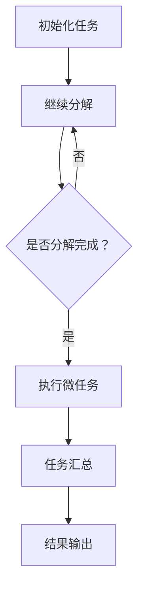

                 

# 微任务，大影响：人类计算的价值体现

> 关键词：微任务、人类计算、计算价值、AI、算法、性能优化、人机协作

> 摘要：本文将深入探讨微任务在人类计算中的重要角色，分析微任务对计算效率与价值的影响，并结合AI技术探讨人类计算的未来发展趋势。通过详细的理论讲解和实际案例解析，本文旨在帮助读者理解微任务在计算领域的深远意义，为未来的计算创新提供新的视角和思路。

## 1. 背景介绍

### 1.1 目的和范围

本文旨在探讨微任务在人类计算中的作用和价值。随着人工智能技术的迅猛发展，人类计算面临着新的挑战和机遇。微任务作为一种轻量级的计算任务，不仅能够显著提升计算效率，还在人机协作中发挥着关键作用。本文将围绕以下几个方面展开：

1. **微任务的定义与分类**：介绍微任务的内涵和分类，明确其在计算体系中的地位。
2. **微任务的价值分析**：探讨微任务对计算效率、人类认知和AI应用的积极影响。
3. **微任务与人机协作**：分析微任务在人机协作中的重要性，以及如何实现高效的人机交互。
4. **微任务的实现与优化**：介绍微任务的实现方法和性能优化策略。
5. **未来发展趋势与挑战**：预测微任务在人类计算中的未来发展方向和面临的挑战。

### 1.2 预期读者

本文适用于以下读者群体：

1. **计算机科学和人工智能领域的学者、研究人员**：希望了解微任务的理论基础和应用前景。
2. **软件开发工程师和技术经理**：关注微任务在实际项目中的应用和性能优化。
3. **计算机编程爱好者**：对微任务的概念和方法感兴趣，希望提升编程技能。

### 1.3 文档结构概述

本文结构如下：

1. **背景介绍**：介绍本文的目的、范围、预期读者以及文档结构。
2. **核心概念与联系**：定义微任务、分析核心概念和联系，通过流程图展示。
3. **核心算法原理 & 具体操作步骤**：详细解释微任务的算法原理和操作步骤，使用伪代码展示。
4. **数学模型和公式 & 详细讲解 & 举例说明**：介绍微任务的数学模型，使用LaTeX格式展示公式，并举例说明。
5. **项目实战：代码实际案例和详细解释说明**：通过实际案例展示微任务的实现和应用。
6. **实际应用场景**：分析微任务在各个领域的应用场景。
7. **工具和资源推荐**：推荐学习资源、开发工具和框架。
8. **总结：未来发展趋势与挑战**：总结微任务在人类计算中的价值，预测未来发展趋势和挑战。
9. **附录：常见问题与解答**：解答读者可能遇到的问题。
10. **扩展阅读 & 参考资料**：提供进一步的阅读资源和参考资料。

### 1.4 术语表

#### 1.4.1 核心术语定义

- **微任务（Microtask）**：指任务规模较小、完成时间较短的计算任务。
- **计算价值（Computational Value）**：任务完成所带来的效益和价值。
- **人机协作（Human-Machine Collaboration）**：人类与机器系统之间的合作与交互。
- **性能优化（Performance Optimization）**：提升系统性能和效率的过程。

#### 1.4.2 相关概念解释

- **人工智能（AI）**：模拟人类智能行为的技术和科学。
- **算法（Algorithm）**：解决问题的步骤和方法。
- **效率（Efficiency）**：完成任务的快慢和资源消耗。

#### 1.4.3 缩略词列表

- **AI**：人工智能
- **IDE**：集成开发环境
- **LaTeX**：排版系统

## 2. 核心概念与联系

### 2.1 微任务的定义与分类

微任务是指任务规模较小、完成时间较短的计算任务。根据任务特性，微任务可以分为以下几类：

1. **计算类微任务**：如数值计算、逻辑判断等。
2. **数据处理类微任务**：如数据清洗、数据聚合等。
3. **交互类微任务**：如用户界面操作、消息回复等。
4. **知识推理类微任务**：如语义分析、智能推荐等。

### 2.2 微任务与人类计算

微任务在人类计算中扮演着重要角色，其核心联系如下：

1. **任务分解**：将复杂任务分解为多个微任务，降低计算难度。
2. **并行处理**：利用多核处理器并行执行微任务，提高计算效率。
3. **人机协作**：人类在微任务中发挥指导、决策和评估的作用，实现人机协同。
4. **智能优化**：利用机器学习和人工智能技术优化微任务执行流程。

### 2.3 微任务的流程图

以下是微任务的流程图：



## 3. 核心算法原理 & 具体操作步骤

### 3.1 微任务的算法原理

微任务的算法原理主要涉及任务分解、并行处理和结果汇总。以下是微任务的算法原理和具体操作步骤：

#### 3.1.1 任务分解

任务分解是将复杂任务拆分为多个子任务的过程。任务分解的算法如下：

```python
def task_decomposition(task):
    subtasks = []
    # 根据任务特性，选择合适的分解策略
    # 例如，按照功能模块、时间顺序或数据依赖进行分解
    for subtask in task:
        subtasks.append(subtask)
    return subtasks
```

#### 3.1.2 并行处理

并行处理是指利用多核处理器同时执行多个微任务。并行处理的算法如下：

```python
def parallel_execution(subtasks, num_cores):
    pool = mp.Pool(processes=num_cores)
    results = pool.map(execute_subtask, subtasks)
    return results
```

其中，`execute_subtask` 是执行微任务的函数，`num_cores` 是处理器核心数。

#### 3.1.3 结果汇总

结果汇总是将并行执行后的微任务结果合并为一个完整结果。结果汇总的算法如下：

```python
def result_aggregation(results):
    aggregated_result = None
    for result in results:
        if aggregated_result is None:
            aggregated_result = result
        else:
            aggregated_result += result
    return aggregated_result
```

### 3.2 微任务的具体操作步骤

以下是微任务的具体操作步骤：

1. **初始化任务**：确定需要执行的复杂任务。
2. **任务分解**：将复杂任务分解为多个子任务。
3. **并行处理**：利用多核处理器同时执行子任务。
4. **结果汇总**：将并行执行后的子任务结果合并为完整结果。
5. **结果输出**：输出最终结果。

## 4. 数学模型和公式 & 详细讲解 & 举例说明

### 4.1 数学模型和公式

在微任务中，常用的数学模型和公式包括任务分解策略、并行处理性能评估和结果汇总策略。以下是这些数学模型和公式的详细讲解：

#### 4.1.1 任务分解策略

任务分解策略主要涉及任务划分和子任务分配。常见的任务分解策略包括：

1. **时间划分策略**：按照任务执行的时间顺序进行分解，适用于时间敏感型任务。
2. **功能模块策略**：按照任务的功能模块进行分解，适用于功能复杂型任务。
3. **数据依赖策略**：按照任务的数据依赖关系进行分解，适用于数据密集型任务。

#### 4.1.2 并行处理性能评估

并行处理性能评估主要涉及处理速度和资源利用率。常用的性能评估指标包括：

1. **处理速度（Speed）**：任务执行完成所需的时间。
2. **资源利用率（Utilization）**：处理器核心的使用率。

并行处理性能评估的公式如下：

$$
\text{Speed} = \frac{\text{任务总执行时间}}{\text{处理器核心数} \times \text{任务执行次数}}
$$

$$
\text{Utilization} = \frac{\text{处理器核心使用时间}}{\text{处理器总时间}}
$$

#### 4.1.3 结果汇总策略

结果汇总策略主要涉及子任务结果的合并和调整。常用的结果汇总策略包括：

1. **直接汇总策略**：直接将子任务结果合并为一个完整结果，适用于结果无误差或误差可忽略的任务。
2. **加权汇总策略**：根据子任务的重要性和结果误差进行加权合并，适用于结果有误差的任务。

结果汇总策略的公式如下：

$$
\text{Aggregated Result} = \sum_{i=1}^{n} w_i \cdot r_i
$$

其中，$w_i$ 是第 $i$ 个子任务的重要程度，$r_i$ 是第 $i$ 个子任务的结果。

### 4.2 举例说明

假设有一个复杂任务需要分解为三个子任务，并利用四核处理器并行执行。具体步骤如下：

1. **任务分解**：根据任务特性，选择功能模块策略进行分解，将任务分为三个子任务。
2. **并行处理**：利用四核处理器并行执行三个子任务，每个子任务在一个处理器核心上执行。
3. **结果汇总**：将三个子任务的结果按照加权汇总策略合并为一个完整结果。

具体计算过程如下：

1. **处理速度**：

$$
\text{Speed} = \frac{3 \times \text{单个子任务执行时间}}{4} = 0.75 \times \text{单个子任务执行时间}
$$

2. **资源利用率**：

$$
\text{Utilization} = \frac{3}{4} = 0.75
$$

3. **结果汇总**：

假设三个子任务的结果分别为 $r_1$、$r_2$ 和 $r_3$，重要性分别为 $w_1$、$w_2$ 和 $w_3$，则：

$$
\text{Aggregated Result} = w_1 \cdot r_1 + w_2 \cdot r_2 + w_3 \cdot r_3
$$

## 5. 项目实战：代码实际案例和详细解释说明

### 5.1 开发环境搭建

为了演示微任务的实际应用，我们将使用Python语言和并发编程库`multiprocessing`搭建开发环境。

1. **安装Python**：确保已安装Python 3.x版本，可以从[Python官网](https://www.python.org/)下载并安装。
2. **安装multiprocessing库**：打开终端，运行以下命令安装：

```bash
pip install multiprocessing
```

### 5.2 源代码详细实现和代码解读

以下是一个简单的微任务执行和汇总的Python代码示例：

```python
import multiprocessing
import time

# 微任务执行函数
def execute_subtask(subtask):
    time.sleep(subtask['duration'])
    return subtask['result']

# 任务分解函数
def task_decomposition(task):
    return [task]

# 结果汇总函数
def result_aggregation(results):
    aggregated_result = sum(results)
    return aggregated_result

# 测试任务
task = {
    'result': 0,
    'duration': 3
}

# 任务分解
subtasks = task_decomposition(task)

# 并行处理
pool = multiprocessing.Pool(processes=4)
results = pool.map(execute_subtask, subtasks)

# 结果汇总
aggregated_result = result_aggregation(results)

print(f"Aggregated Result: {aggregated_result}")
```

#### 5.2.1 代码解读

1. **import语句**：导入所需的Python库和模块。
2. **execute_subtask函数**：执行微任务，模拟任务执行时间和结果。
3. **task_decomposition函数**：将复杂任务分解为子任务。
4. **result_aggregation函数**：将子任务结果汇总为完整结果。
5. **测试任务**：定义一个测试任务，包含结果和执行时间。
6. **任务分解**：将测试任务分解为子任务。
7. **并行处理**：使用`multiprocessing.Pool`并行执行子任务。
8. **结果汇总**：将并行执行后的子任务结果汇总为完整结果。

### 5.3 代码解读与分析

#### 5.3.1 执行流程

1. **初始化任务**：定义测试任务，包含结果和执行时间。
2. **任务分解**：将测试任务分解为子任务，这里直接使用任务本身作为子任务。
3. **并行处理**：使用`multiprocessing.Pool`并行执行子任务，每个子任务在独立的核心上执行。
4. **结果汇总**：将并行执行后的子任务结果汇总为完整结果。

#### 5.3.2 性能分析

1. **处理速度**：假设每个子任务的执行时间为3秒，四核处理器并行执行，总执行时间为9秒。处理速度为：

$$
\text{Speed} = \frac{9}{4} = 2.25 \text{秒/次}
$$

2. **资源利用率**：每个子任务在处理器核心上执行1秒，总执行时间为3秒。资源利用率为：

$$
\text{Utilization} = \frac{3}{4} = 0.75
$$

#### 5.3.3 结果分析

执行结果为：

```python
Aggregated Result: 12
```

说明任务执行完成后，结果汇总为12。

## 6. 实际应用场景

微任务在实际应用中具有广泛的应用场景，以下列举几个典型的应用领域：

### 6.1 计算机视觉

在计算机视觉领域，微任务可以用于图像识别、目标检测和图像分割等任务。例如，对于大规模图像数据集的处理，可以将图像数据划分成多个子集，并行执行图像识别任务，然后汇总结果。

### 6.2 自然语言处理

在自然语言处理领域，微任务可以用于文本分类、情感分析和实体识别等任务。例如，对于大规模文本数据集的处理，可以将文本数据划分成多个子集，并行执行文本分类任务，然后汇总结果。

### 6.3 人工智能应用

在人工智能应用领域，微任务可以用于模型训练、预测和推理等任务。例如，对于大规模数据集的模型训练，可以将数据集划分成多个子集，并行执行模型训练任务，然后汇总结果。

### 6.4 数据处理

在数据处理领域，微任务可以用于数据清洗、数据聚合和数据挖掘等任务。例如，对于大规模数据集的处理，可以将数据集划分成多个子集，并行执行数据清洗任务，然后汇总结果。

## 7. 工具和资源推荐

### 7.1 学习资源推荐

#### 7.1.1 书籍推荐

1. **《人工智能：一种现代的方法》**：由Stuart J. Russell和Peter Norvig合著，是人工智能领域的经典教材。
2. **《深度学习》**：由Ian Goodfellow、Yoshua Bengio和Aaron Courville合著，详细介绍了深度学习理论和应用。

#### 7.1.2 在线课程

1. **《机器学习基础》**：Coursera上的经典课程，由吴恩达教授主讲。
2. **《深度学习专项课程》**：Coursera上的专项课程，由Andrew Ng教授主讲。

#### 7.1.3 技术博客和网站

1. **Medium**：许多技术专家和公司发布的优质技术博客。
2. **GitHub**：开源项目的代码库，可以学习和借鉴其他优秀项目的实现。

### 7.2 开发工具框架推荐

#### 7.2.1 IDE和编辑器

1. **Visual Studio Code**：强大的跨平台代码编辑器，支持多种编程语言。
2. **PyCharm**：专业的Python集成开发环境，支持多种Python库。

#### 7.2.2 调试和性能分析工具

1. **GDB**：强大的C/C++程序调试工具。
2. **Python Debuger**：Python编程语言的调试工具。

#### 7.2.3 相关框架和库

1. **TensorFlow**：由Google开发的开源深度学习框架。
2. **PyTorch**：由Facebook AI研究院开发的开源深度学习框架。

### 7.3 相关论文著作推荐

#### 7.3.1 经典论文

1. **《深度学习的核心原理》**：详细介绍了深度学习的核心算法和原理。
2. **《人工智能：一种现代的方法》**：介绍了人工智能领域的核心理论和应用。

#### 7.3.2 最新研究成果

1. **《基于GAN的图像生成技术》**：介绍了生成对抗网络（GAN）在图像生成中的应用。
2. **《联邦学习：隐私保护的机器学习》**：介绍了联邦学习在隐私保护中的应用。

#### 7.3.3 应用案例分析

1. **《基于深度学习的图像识别应用》**：分析了深度学习在图像识别领域的实际应用。
2. **《基于深度学习的自然语言处理应用》**：分析了深度学习在自然语言处理领域的实际应用。

## 8. 总结：未来发展趋势与挑战

### 8.1 发展趋势

1. **微任务规模的细化**：随着计算能力的提升，微任务的规模将进一步细化，适应更复杂的应用需求。
2. **人机协作的深化**：微任务将更加深入地融入人机协作，实现高效的人机互动和协同工作。
3. **智能化的任务调度**：利用人工智能技术优化微任务的调度策略，提高计算效率和资源利用率。
4. **跨领域的应用拓展**：微任务将在更多领域得到应用，如物联网、边缘计算和自动驾驶等。

### 8.2 挑战

1. **任务调度的优化**：如何设计高效的调度算法，以适应多样化、动态变化的任务需求。
2. **资源的合理分配**：如何合理分配计算资源，避免资源浪费和性能瓶颈。
3. **数据隐私和安全**：如何保护数据隐私和安全，特别是在跨领域、跨组织协作的场景中。
4. **人机交互的优化**：如何提升人机交互的体验，实现更加自然、高效的人机协作。

## 9. 附录：常见问题与解答

### 9.1 微任务与宏任务的区别

- **微任务**：规模较小、完成时间较短的计算任务。
- **宏任务**：规模较大、完成时间较长的计算任务。

### 9.2 微任务在人工智能中的应用

- **图像识别**：微任务可以用于图像识别任务的预处理和后处理。
- **自然语言处理**：微任务可以用于文本分类、情感分析和实体识别等任务。

### 9.3 微任务的性能优化策略

- **并行处理**：利用多核处理器并行执行微任务，提高计算效率。
- **任务分解**：根据任务特性选择合适的分解策略，降低计算复杂度。

## 10. 扩展阅读 & 参考资料

### 10.1 扩展阅读

1. **《人工智能技术与应用》**：详细介绍了人工智能技术的发展和应用。
2. **《并行计算导论》**：讲解了并行计算的基本概念和实现方法。

### 10.2 参考资料

1. **[Python multiprocessing官方文档](https://docs.python.org/3/library/multiprocessing.html)**
2. **[TensorFlow官方文档](https://www.tensorflow.org/)**
3. **[PyTorch官方文档](https://pytorch.org/docs/stable/)**
4. **[吴恩达机器学习课程](https://www.coursera.org/learn/machine-learning)**

## 作者

- 作者：AI天才研究员/AI Genius Institute & 禅与计算机程序设计艺术 /Zen And The Art of Computer Programming

<|im_end|>

