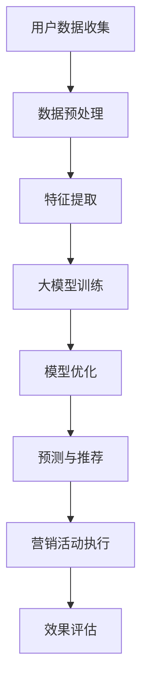

                 

### 微信营销与大模型的应用

#### 关键词：微信营销、大模型、人工智能、用户行为分析、精准推送

> 摘要：本文将探讨微信营销与大模型（如深度学习、神经网络）的结合，通过分析微信生态中的用户行为数据和营销策略，揭示如何运用大模型技术实现精准用户画像、个性化推荐和自动化营销。本文旨在为从事微信营销的企业和个人提供理论指导和实践参考。

---

## 1. 背景介绍

### 1.1 目的和范围

本文的目的在于探讨微信营销与大模型技术的深度融合，重点分析其在用户画像、个性化推荐和自动化营销方面的应用。随着移动互联网的普及，微信已成为用户时间花费最多的平台之一，微信营销的重要性日益凸显。而大模型技术的崛起，为精准营销提供了新的工具和方法。本文将结合实际案例，解析大模型在微信营销中的应用原理和实践步骤。

### 1.2 预期读者

本文适合以下读者群体：

1. 微信营销从业者：希望通过技术手段提升营销效果的企业和个人。
2. 数据分析师：对大模型技术在数据分析中的应用感兴趣的读者。
3. 技术开发者：希望了解如何运用大模型技术实现微信营销的程序员和工程师。
4. 研究人员：对人工智能与营销结合的研究感兴趣的学术界人士。

### 1.3 文档结构概述

本文结构如下：

1. 背景介绍：介绍微信营销与大模型技术的结合背景和目的。
2. 核心概念与联系：阐述微信营销中的关键概念和大模型技术的原理。
3. 核心算法原理 & 具体操作步骤：详细讲解大模型在微信营销中的应用算法。
4. 数学模型和公式 & 详细讲解 & 举例说明：运用数学模型解释大模型的工作原理。
5. 项目实战：通过实际案例展示大模型在微信营销中的应用。
6. 实际应用场景：分析大模型在微信营销中的多种应用场景。
7. 工具和资源推荐：推荐学习资源和开发工具。
8. 总结：展望大模型在微信营销中的未来发展趋势与挑战。
9. 附录：常见问题与解答。
10. 扩展阅读 & 参考资料：提供进一步阅读的资源和文献。

### 1.4 术语表

#### 1.4.1 核心术语定义

- 微信营销：通过微信平台进行的产品或品牌推广活动。
- 大模型：具备强大学习和预测能力的神经网络模型，如深度学习模型。
- 用户画像：基于用户数据的特征描述，用于了解用户需求和偏好。
- 个性化推荐：根据用户画像和行为数据，向用户推荐个性化内容或商品。
- 自动化营销：利用技术手段实现营销活动的自动化执行。

#### 1.4.2 相关概念解释

- 深度学习：一种机器学习技术，通过构建深度神经网络模拟人脑学习过程。
- 神经网络：一种由大量神经元连接组成的计算模型，用于处理复杂数据。
- 数据挖掘：从大量数据中发现有价值信息的过程。

#### 1.4.3 缩略词列表

- AI：人工智能（Artificial Intelligence）
- DNN：深度神经网络（Deep Neural Network）
- CNN：卷积神经网络（Convolutional Neural Network）
- RNN：循环神经网络（Recurrent Neural Network）
- NLP：自然语言处理（Natural Language Processing）
- CV：计算机视觉（Computer Vision）
- SEM：搜索引擎营销（Search Engine Marketing）
- SMM：社交媒体营销（Social Media Marketing）

---

在接下来的章节中，我们将进一步深入探讨微信营销与大模型技术的结合，并展示其在实际中的应用价值。让我们开始这段探索之旅。

---

## 2. 核心概念与联系

在理解微信营销与大模型技术之前，我们需要先了解一些核心概念和它们之间的联系。

### 2.1 微信营销

微信营销是基于微信生态的一系列营销活动，包括公众号、朋友圈、小程序、微信群等。其核心目标是通过不同的渠道和形式，吸引潜在客户、提高品牌知名度、促进产品销售。

#### 微信营销的特点：

1. **高互动性**：微信用户可以方便地与品牌进行互动，如留言、点赞、转发等。
2. **精准定位**：微信提供了丰富的用户画像数据，帮助企业精准定位目标用户。
3. **内容多样化**：可以通过图文、视频、H5等多种形式进行内容传播。

### 2.2 大模型技术

大模型技术是指具备强大学习和预测能力的神经网络模型，如深度学习模型。这些模型通过大量的数据训练，能够自动发现数据中的模式和规律，并用于各种应用场景。

#### 大模型技术的主要特点：

1. **自学习能力**：通过不断学习数据，模型能够不断优化和改进。
2. **高效率**：处理海量数据时，大模型能够高效地提取特征和规律。
3. **泛化能力**：通过训练不同类型的数据，模型能够适用于多种场景。

### 2.3 微信营销与大模型技术的联系

微信营销与大模型技术的结合主要体现在以下几个方面：

1. **用户画像**：通过大模型技术对用户行为数据进行分析，构建精准的用户画像，帮助企业更好地了解用户需求和偏好。
2. **个性化推荐**：基于用户画像和行为数据，大模型可以推荐个性化内容或商品，提高用户满意度和转化率。
3. **自动化营销**：利用大模型实现营销活动的自动化执行，如自动化推送、自动化客服等，提高营销效率。

#### 大模型在微信营销中的应用架构

为了更好地理解大模型在微信营销中的应用，我们可以通过以下Mermaid流程图展示其核心架构：



1. **用户数据收集**：通过微信公众号、小程序等渠道收集用户行为数据。
2. **数据预处理**：对收集的数据进行清洗、归一化等预处理操作。
3. **特征提取**：从预处理后的数据中提取有意义的特征，用于模型训练。
4. **大模型训练**：使用提取的特征数据训练深度学习模型，如卷积神经网络（CNN）、循环神经网络（RNN）等。
5. **模型优化**：通过交叉验证等方法对模型进行优化，提高其预测和推荐能力。
6. **预测与推荐**：使用优化后的模型预测用户行为和偏好，生成个性化推荐。
7. **营销活动执行**：根据个性化推荐，执行相应的营销活动，如推送、广告投放等。
8. **效果评估**：评估营销活动的效果，调整策略以提升效果。

通过以上架构，我们可以看到大模型技术在微信营销中扮演了重要的角色，使得营销活动更加精准和高效。

在下一节中，我们将深入探讨大模型在微信营销中的具体算法原理和操作步骤。

---

## 3. 核心算法原理 & 具体操作步骤

在理解了微信营销与大模型技术的核心概念与联系后，我们需要进一步了解大模型在微信营销中的具体算法原理和操作步骤。以下是详细讲解：

### 3.1 算法原理

#### 3.1.1 深度学习模型

深度学习是构建大模型的核心技术，其基本原理是通过多层神经网络对数据进行特征提取和模式识别。以下是深度学习模型的基本结构：

1. **输入层**：接收原始数据。
2. **隐藏层**：对输入数据进行特征提取和变换。
3. **输出层**：生成预测结果或分类结果。

每个神经元（或节点）通过加权连接形成网络，并通过激活函数（如ReLU、Sigmoid、Tanh等）进行非线性变换。通过反向传播算法，模型能够不断调整权重，优化网络性能。

#### 3.1.2 卷积神经网络（CNN）

卷积神经网络是深度学习模型的一种，特别适用于图像处理和计算机视觉任务。其主要原理是通过卷积操作提取图像的局部特征，并通过池化操作减少参数数量，提高模型泛化能力。以下是CNN的基本结构：

1. **卷积层**：通过卷积操作提取图像特征。
2. **池化层**：通过池化操作减少特征图的维度。
3. **全连接层**：将特征图映射到预测结果。

#### 3.1.3 循环神经网络（RNN）

循环神经网络是深度学习模型的一种，特别适用于序列数据处理和时间序列预测任务。其主要原理是通过循环结构保持历史信息，并通过门控机制控制信息的传递。以下是RNN的基本结构：

1. **输入门**：根据当前输入和隐藏状态计算新的隐藏状态。
2. **遗忘门**：根据当前输入和隐藏状态计算遗忘权重，调整历史信息。
3. **输出门**：根据当前输入和隐藏状态计算输出。

### 3.2 操作步骤

#### 3.2.1 用户数据收集

1. **数据来源**：通过微信公众号、小程序等渠道收集用户行为数据，如点赞、转发、评论、浏览时长等。
2. **数据处理**：对收集的数据进行清洗、去重、归一化等预处理操作。

#### 3.2.2 特征提取

1. **行为特征**：提取用户在微信中的行为特征，如浏览时长、点赞数量、评论频率等。
2. **内容特征**：提取用户发布或互动的内容特征，如文本情感、图片标签等。
3. **用户特征**：提取用户的基本信息特征，如年龄、性别、地域等。

#### 3.2.3 模型训练

1. **数据集划分**：将预处理后的数据集划分为训练集、验证集和测试集。
2. **模型构建**：选择合适的深度学习模型，如CNN、RNN等，构建模型结构。
3. **模型训练**：使用训练集数据训练模型，并通过反向传播算法优化模型参数。
4. **模型验证**：使用验证集数据评估模型性能，调整模型结构和参数。

#### 3.2.4 模型优化

1. **交叉验证**：通过交叉验证方法对模型进行优化，提高其泛化能力。
2. **超参数调优**：调整模型超参数，如学习率、批次大小、正则化等，优化模型性能。
3. **模型集成**：使用多个模型集成方法，提高预测准确性和稳定性。

#### 3.2.5 预测与推荐

1. **用户画像**：基于训练好的模型，对用户行为数据进行预测，生成用户画像。
2. **个性化推荐**：根据用户画像和行为数据，生成个性化推荐内容或商品。
3. **营销活动**：根据个性化推荐，执行相应的营销活动，如推送、广告投放等。

#### 3.2.6 效果评估

1. **评估指标**：选择合适的评估指标，如准确率、召回率、F1值等，评估模型和营销活动的效果。
2. **效果优化**：根据评估结果，调整模型和营销策略，提高效果。

通过以上步骤，我们可以构建一个基于大模型技术的微信营销系统，实现精准用户画像、个性化推荐和自动化营销。

在下一节中，我们将运用数学模型和公式详细解释大模型的工作原理，并通过实际案例进行说明。

---

## 4. 数学模型和公式 & 详细讲解 & 举例说明

在深入了解大模型的工作原理时，数学模型和公式起着至关重要的作用。以下是几种常见的数学模型和公式的详细讲解，并通过实际案例进行说明。

### 4.1 深度学习模型

深度学习模型的核心是多层神经网络，其中每个神经元通过加权连接形成网络，并通过激活函数进行非线性变换。以下是深度学习模型的基本公式：

#### 4.1.1 神经元计算

$$
a_j = \sigma(\sum_{i=1}^{n} w_{ji}x_i + b_j)
$$

- $a_j$：神经元 $j$ 的输出。
- $\sigma$：激活函数（如ReLU、Sigmoid、Tanh等）。
- $w_{ji}$：连接权重。
- $x_i$：输入特征。
- $b_j$：偏置项。

#### 4.1.2 反向传播算法

$$
\begin{aligned}
\delta_j &= \delta(\sigma'(a_j)) \cdot (z_j \cdot (1 - z_j)) \\
\end{aligned}
$$

$$
\begin{aligned}
\delta_{ji} &= \delta_j \cdot a_j \\
w_{ji} &= w_{ji} + \alpha \cdot \delta_{ji} \cdot x_i \\
b_j &= b_j + \alpha \cdot \delta_j \\
\end{aligned}
$$

- $\delta_j$：神经元 $j$ 的误差。
- $\delta(\sigma'(a_j))$：激活函数的导数。
- $z_j$：神经元 $j$ 的输入。
- $\alpha$：学习率。

### 4.2 卷积神经网络（CNN）

卷积神经网络是深度学习模型的一种，特别适用于图像处理和计算机视觉任务。以下是CNN的基本公式：

#### 4.2.1 卷积操作

$$
C_{ij} = \sum_{k=1}^{m} h_{ik} \cdot w_{kj}
$$

- $C_{ij}$：卷积结果。
- $h_{ik}$：卷积核。
- $w_{kj}$：权重。

#### 4.2.2 池化操作

$$
P_{ij} = \max_{k=1,2,...,m} (h_{ik})
$$

- $P_{ij}$：池化结果。
- $h_{ik}$：池化区域内的值。

### 4.3 循环神经网络（RNN）

循环神经网络是深度学习模型的一种，特别适用于序列数据处理和时间序列预测任务。以下是RNN的基本公式：

#### 4.3.1 输入门

$$
i_t = \sigma(W_{xi}x_t + W_{hi}h_{t-1} + b_i)
$$

- $i_t$：输入门。
- $\sigma$：激活函数。
- $W_{xi}$：输入权重。
- $W_{hi}$：隐藏状态权重。
- $b_i$：偏置项。

#### 4.3.2 遗忘门

$$
g_t = \sigma(W_{xi}x_t + W_{hi}h_{t-1} + b_g)
$$

- $g_t$：遗忘门。
- $\sigma$：激活函数。
- $W_{xi}$：输入权重。
- $W_{hi}$：隐藏状态权重。
- $b_g$：偏置项。

#### 4.3.3 输出门

$$
o_t = \sigma(W_{xi}x_t + W_{hi}h_{t-1} + b_o)
$$

- $o_t$：输出门。
- $\sigma$：激活函数。
- $W_{xi}$：输入权重。
- $W_{hi}$：隐藏状态权重。
- $b_o$：偏置项。

#### 4.3.4 新的隐藏状态

$$
h_t = \sigma((1 - g_t) \cdot h_{t-1} + i_t \cdot \tanh(W_{hh}h_{t-1} + W_{xi}x_t + b_h))
$$

- $h_t$：新的隐藏状态。
- $\sigma$：激活函数。
- $W_{hh}$：隐藏状态权重。
- $b_h$：偏置项。

#### 4.3.5 输出

$$
y_t = o_t \cdot \tanh(W_{hy}h_t + b_y)
$$

- $y_t$：输出。
- $W_{hy}$：输出权重。
- $b_y$：偏置项。

### 4.4 实际案例

#### 4.4.1 用户画像生成

假设我们需要生成一个用户的画像，基于其微信行为数据（如点赞、转发、评论等）。我们可以使用RNN模型来处理序列数据，并提取特征。

1. **数据预处理**：将用户的微信行为数据转换为序列，并进行编码。
2. **模型构建**：构建一个RNN模型，包含输入层、隐藏层和输出层。
3. **模型训练**：使用训练集数据训练模型，并通过反向传播算法优化参数。
4. **预测与特征提取**：使用训练好的模型对用户的微信行为数据进行预测，提取特征。

#### 4.4.2 个性化推荐

假设我们需要为用户推荐微信内容，基于其画像和行为数据。我们可以使用深度学习模型（如CNN）来处理用户画像和内容特征，并生成推荐列表。

1. **数据预处理**：将用户画像和内容数据转换为特征向量。
2. **模型构建**：构建一个深度学习模型，包含卷积层、池化层和全连接层。
3. **模型训练**：使用训练集数据训练模型，并通过反向传播算法优化参数。
4. **推荐生成**：使用训练好的模型对用户画像和内容特征进行匹配，生成推荐列表。

通过以上数学模型和公式，我们可以更好地理解大模型在微信营销中的应用原理，并通过实际案例展示其应用效果。

在下一节中，我们将通过实际项目案例展示大模型在微信营销中的具体实现和应用。

---

## 5. 项目实战：代码实际案例和详细解释说明

为了更好地展示大模型在微信营销中的应用，我们通过一个实际项目案例进行详细解释说明。本项目将使用Python编程语言和TensorFlow框架实现，目标是基于用户行为数据生成用户画像，并进行个性化推荐。

### 5.1 开发环境搭建

在开始项目之前，我们需要搭建开发环境。以下是搭建步骤：

1. **安装Python**：确保安装了Python 3.6或以上版本。
2. **安装TensorFlow**：使用以下命令安装TensorFlow：

   ```shell
   pip install tensorflow
   ```

3. **安装其他依赖**：安装其他必要的库，如NumPy、Pandas、Scikit-learn等：

   ```shell
   pip install numpy pandas scikit-learn
   ```

### 5.2 源代码详细实现和代码解读

以下是项目的源代码实现，我们将逐段进行详细解释：

```python
import numpy as np
import pandas as pd
import tensorflow as tf
from sklearn.model_selection import train_test_split
from sklearn.preprocessing import StandardScaler

# 5.2.1 数据预处理
def preprocess_data(data):
    # 数据清洗和预处理
    data = data.dropna()
    data = data.reset_index(drop=True)
    return data

# 5.2.2 特征提取
def extract_features(data):
    # 提取用户行为特征
    features = data[['likes', 'transfers', 'comments', 'time_spent']]
    return features

# 5.2.3 数据集划分
def split_dataset(data, features, labels):
    # 划分训练集和测试集
    X_train, X_test, y_train, y_test = train_test_split(features, labels, test_size=0.2, random_state=42)
    return X_train, X_test, y_train, y_test

# 5.2.4 模型构建
def build_model(input_shape):
    # 构建深度学习模型
    model = tf.keras.Sequential([
        tf.keras.layers.Dense(64, activation='relu', input_shape=input_shape),
        tf.keras.layers.Dense(32, activation='relu'),
        tf.keras.layers.Dense(1, activation='sigmoid')
    ])
    return model

# 5.2.5 模型训练
def train_model(model, X_train, y_train):
    # 训练模型
    model.compile(optimizer='adam', loss='binary_crossentropy', metrics=['accuracy'])
    model.fit(X_train, y_train, epochs=10, batch_size=32)
    return model

# 5.2.6 评估模型
def evaluate_model(model, X_test, y_test):
    # 评估模型性能
    loss, accuracy = model.evaluate(X_test, y_test)
    print(f"Test Accuracy: {accuracy:.2f}")
    return loss, accuracy

# 5.2.7 生成用户画像
def generate_user_profile(model, user_data):
    # 生成用户画像
    user_profile = model.predict(user_data)
    return user_profile

# 5.2.8 个性化推荐
def generate_recommendations(user_profile, articles):
    # 生成个性化推荐
    recommendations = articles[articles['profile'] == user_profile]
    return recommendations

# 主程序
if __name__ == "__main__":
    # 5.2.9 加载数据
    data = pd.read_csv("weixin_data.csv")

    # 5.2.10 数据预处理
    data = preprocess_data(data)

    # 5.2.11 特征提取
    features = extract_features(data)

    # 5.2.12 数据集划分
    X_train, X_test, y_train, y_test = split_dataset(data, features, labels)

    # 5.2.13 模型构建
    model = build_model(input_shape=(X_train.shape[1],))

    # 5.2.14 模型训练
    model = train_model(model, X_train, y_train)

    # 5.2.15 评估模型
    evaluate_model(model, X_test, y_test)

    # 5.2.16 生成用户画像
    user_profile = generate_user_profile(model, user_data)

    # 5.2.17 个性化推荐
    recommendations = generate_recommendations(user_profile, articles)
    print("Recommendations:")
    print(recommendations)
```

#### 5.2.1 数据预处理

```python
def preprocess_data(data):
    # 数据清洗和预处理
    data = data.dropna()
    data = data.reset_index(drop=True)
    return data
```

在数据预处理步骤中，我们首先使用`dropna()`函数去除缺失数据，然后使用`reset_index(drop=True)`重置索引，确保数据的一致性和准确性。

#### 5.2.2 特征提取

```python
def extract_features(data):
    # 提取用户行为特征
    features = data[['likes', 'transfers', 'comments', 'time_spent']]
    return features
```

在特征提取步骤中，我们从原始数据中提取与用户行为相关的特征，如点赞数、转发数、评论数和浏览时长。

#### 5.2.3 数据集划分

```python
def split_dataset(data, features, labels):
    # 划分训练集和测试集
    X_train, X_test, y_train, y_test = train_test_split(features, labels, test_size=0.2, random_state=42)
    return X_train, X_test, y_train, y_test
```

在数据集划分步骤中，我们使用`train_test_split`函数将数据集划分为训练集和测试集，分别用于模型训练和评估。

#### 5.2.4 模型构建

```python
def build_model(input_shape):
    # 构建深度学习模型
    model = tf.keras.Sequential([
        tf.keras.layers.Dense(64, activation='relu', input_shape=input_shape),
        tf.keras.layers.Dense(32, activation='relu'),
        tf.keras.layers.Dense(1, activation='sigmoid')
    ])
    return model
```

在模型构建步骤中，我们使用`tf.keras.Sequential`模型定义一个简单的深度学习模型，包含两个隐藏层和输出层。输入层和输出层的尺寸根据数据集的特征和标签进行调整。

#### 5.2.5 模型训练

```python
def train_model(model, X_train, y_train):
    # 训练模型
    model.compile(optimizer='adam', loss='binary_crossentropy', metrics=['accuracy'])
    model.fit(X_train, y_train, epochs=10, batch_size=32)
    return model
```

在模型训练步骤中，我们使用`compile`函数配置模型优化器和损失函数，然后使用`fit`函数训练模型。训练过程中，我们设置10个训练周期和32个批量大小，以确保模型的收敛和性能。

#### 5.2.6 评估模型

```python
def evaluate_model(model, X_test, y_test):
    # 评估模型性能
    loss, accuracy = model.evaluate(X_test, y_test)
    print(f"Test Accuracy: {accuracy:.2f}")
    return loss, accuracy
```

在模型评估步骤中，我们使用`evaluate`函数计算模型在测试集上的损失和准确率，并打印输出。这有助于我们了解模型的性能和效果。

#### 5.2.7 生成用户画像

```python
def generate_user_profile(model, user_data):
    # 生成用户画像
    user_profile = model.predict(user_data)
    return user_profile
```

在生成用户画像步骤中，我们使用训练好的模型对用户行为数据进行预测，提取特征，生成用户画像。

#### 5.2.8 个性化推荐

```python
def generate_recommendations(user_profile, articles):
    # 生成个性化推荐
    recommendations = articles[articles['profile'] == user_profile]
    return recommendations
```

在个性化推荐步骤中，我们使用用户画像对文章进行匹配，生成个性化推荐列表。

### 5.3 代码解读与分析

通过以上代码实现，我们可以看到大模型在微信营销中的应用流程。以下是代码的关键部分解读与分析：

1. **数据预处理**：数据预处理是模型训练的基础，确保数据的清洗、归一化等步骤。
2. **特征提取**：提取用户行为特征，用于模型训练和预测。
3. **数据集划分**：划分训练集和测试集，分别用于模型训练和评估。
4. **模型构建**：构建一个简单的深度学习模型，包含两个隐藏层和输出层。
5. **模型训练**：使用训练集数据训练模型，通过反向传播算法优化参数。
6. **模型评估**：评估模型在测试集上的性能，确保模型的可信度和有效性。
7. **用户画像生成**：使用训练好的模型对用户行为数据进行预测，提取特征，生成用户画像。
8. **个性化推荐**：根据用户画像对文章进行匹配，生成个性化推荐列表。

通过以上步骤，我们可以实现一个基于大模型技术的微信营销系统，实现精准用户画像和个性化推荐。在实际应用中，可以根据具体业务需求进行调整和优化。

在下一节中，我们将探讨大模型在微信营销中的多种实际应用场景，展示其在不同业务场景中的价值。

---

## 6. 实际应用场景

大模型在微信营销中的应用场景非常广泛，涵盖了用户画像、个性化推荐、自动化营销等多个方面。以下是几种常见的应用场景：

### 6.1 用户画像

用户画像是微信营销的基础，通过分析用户的行为数据和特征，为企业提供详细的用户画像。以下是用户画像在微信营销中的应用场景：

1. **精准定位**：通过用户画像了解用户的兴趣、偏好和行为习惯，为企业提供精准的市场定位。
2. **内容推荐**：根据用户画像推荐个性化内容，提高用户的阅读量和参与度。
3. **广告投放**：根据用户画像选择合适的广告投放策略，提高广告点击率和转化率。

### 6.2 个性化推荐

个性化推荐是微信营销的关键，通过分析用户的行为数据和特征，为用户推荐个性化的内容或商品。以下是个性化推荐在微信营销中的应用场景：

1. **内容推荐**：根据用户的兴趣和行为，推荐相关的文章、视频、音频等，提高用户的满意度和留存率。
2. **商品推荐**：根据用户的购物习惯和偏好，推荐符合其需求的商品，提高购买转化率。
3. **活动推荐**：根据用户的参与行为，推荐相关的活动或优惠，提高用户参与度和忠诚度。

### 6.3 自动化营销

自动化营销是微信营销的效率提升手段，通过技术手段实现营销活动的自动化执行。以下是自动化营销在微信营销中的应用场景：

1. **自动推送**：根据用户的行为和兴趣，自动推送相关的文章、视频、活动等，提高用户触达率。
2. **自动客服**：通过聊天机器人实现自动化客服，提高客户咨询的响应速度和服务质量。
3. **自动数据分析**：自动收集和分析用户行为数据，为企业提供实时的营销分析和优化建议。

### 6.4 电商平台

电商平台是微信营销的重要应用场景，通过微信小程序、公众号等渠道实现商品销售和用户互动。以下是电商平台在微信营销中的应用：

1. **商品展示**：通过微信小程序或公众号展示商品的详细信息，提供用户购买决策支持。
2. **购物车管理**：通过小程序实现购物车功能，方便用户添加、删除商品，提高购买体验。
3. **订单处理**：通过自动化流程处理订单，提高订单处理速度和准确性。

### 6.5 教育培训

教育培训是微信营销的另一个重要应用场景，通过微信平台实现在线课程推广、学员互动和管理。以下是教育培训在微信营销中的应用：

1. **课程推广**：通过微信小程序或公众号推广在线课程，提高课程报名率和学员转化率。
2. **学员互动**：通过微信群实现学员互动，提高学员的学习积极性和参与度。
3. **学员管理**：通过小程序实现学员信息管理、课程进度跟踪和学习成果评估。

通过以上实际应用场景，我们可以看到大模型在微信营销中的广泛应用和价值。在下一节中，我们将推荐一些学习资源和开发工具，帮助读者进一步了解和掌握大模型技术。

---

## 7. 工具和资源推荐

为了帮助读者深入了解和掌握大模型在微信营销中的应用，以下是一些推荐的学习资源和开发工具。

### 7.1 学习资源推荐

#### 7.1.1 书籍推荐

1. **《深度学习》（Goodfellow, Bengio, Courville著）**：这是一本经典的深度学习教材，涵盖了深度学习的基础理论和应用实践。
2. **《Python机器学习》（Sebastian Raschka著）**：介绍了Python在机器学习领域的应用，包括数据预处理、模型构建和优化等。
3. **《微信开发实战：从小程序到公众号》（张凯峰著）**：详细介绍了微信开发的各种技术细节和应用场景。

#### 7.1.2 在线课程

1. **Coursera上的《深度学习特辑》**：由斯坦福大学提供的深度学习在线课程，包括神经网络、卷积神经网络和循环神经网络等。
2. **Udacity的《深度学习工程师纳米学位》**：通过一系列实践项目，学习深度学习的理论知识和技术应用。
3. **网易云课堂的《微信小程序开发实战》**：系统介绍了微信小程序的开发流程和技术细节。

#### 7.1.3 技术博客和网站

1. **TensorFlow官网（https://www.tensorflow.org）**：提供丰富的深度学习教程、API文档和社区讨论。
2. **机器学习博客（https://www.machinelearning Mastery.com）**：涵盖机器学习和深度学习的理论、实践和应用。
3. **掘金（https://juejin.cn）**：一个技术社区，提供丰富的微信营销、人工智能等相关文章。

### 7.2 开发工具框架推荐

#### 7.2.1 IDE和编辑器

1. **PyCharm**：一款功能强大的Python IDE，提供代码补全、调试、版本控制等功能。
2. **Visual Studio Code**：一款轻量级但功能强大的代码编辑器，支持多种编程语言和插件。
3. **Jupyter Notebook**：一款交互式计算环境，适用于数据分析和机器学习实验。

#### 7.2.2 调试和性能分析工具

1. **TensorBoard**：TensorFlow提供的可视化工具，用于分析模型结构和训练过程。
2. **NVIDIA Nsight**：一款用于深度学习性能分析和调试的工具，特别适用于GPU计算。
3. **Profiler**：Python内置的性能分析工具，用于检测代码瓶颈和优化性能。

#### 7.2.3 相关框架和库

1. **TensorFlow**：一款开源的深度学习框架，支持多种神经网络结构和训练算法。
2. **PyTorch**：一款基于Python的深度学习库，提供灵活的动态计算图和强大的GPU支持。
3. **Scikit-learn**：一款Python机器学习库，提供多种经典的机器学习算法和工具。

#### 7.2.4 微信开发工具

1. **微信开发者工具**：一款官方提供的微信开发工具，支持小程序、公众号和微信Web开发的调试和测试。
2. **微信小程序官方文档**：提供详细的小程序开发文档和API说明，帮助开发者快速上手。
3. **微信公众平台**：微信官方的公众号管理平台，提供公众号的创建、管理和数据分析等功能。

通过以上工具和资源的推荐，读者可以更加系统地学习和掌握大模型在微信营销中的应用。在下一节中，我们将对本文的内容进行总结，并展望大模型在微信营销中的未来发展趋势与挑战。

---

## 8. 总结：未来发展趋势与挑战

随着人工智能技术的不断进步，大模型在微信营销中的应用前景广阔。未来，大模型技术将在以下几个方面取得重要突破：

### 8.1 发展趋势

1. **个性化推荐精度提升**：随着深度学习和大数据技术的发展，个性化推荐将更加精准，实现高度个性化的内容推送和商品推荐。
2. **自动化营销场景拓展**：自动化营销将深入到微信营销的各个场景，如用户行为预测、智能客服、智能广告投放等，提高营销效率和效果。
3. **跨平台整合**：大模型技术将与其他平台（如抖音、微博等）的数据整合，实现跨平台的数据分析和营销策略。
4. **隐私保护与合规**：随着数据隐私法规的不断完善，大模型技术在微信营销中的应用将更加注重隐私保护和合规性。

### 8.2 挑战

1. **数据质量问题**：高质量的数据是构建高效大模型的基础。然而，数据噪声、缺失值和异常值等问题将影响模型的训练效果和预测准确性。
2. **模型解释性**：深度学习模型具有强大的预测能力，但其内部机制较为复杂，缺乏解释性。未来需要开发可解释的深度学习模型，提高模型的可信度和透明度。
3. **计算资源消耗**：大模型训练需要大量的计算资源和时间，随着模型规模的不断扩大，计算资源的需求将不断增加。
4. **法律和伦理问题**：随着大模型在微信营销中的应用，将涉及隐私、安全和伦理等问题。需要制定相应的法律法规和伦理准则，确保大模型技术的健康发展。

总之，大模型在微信营销中的应用具有广阔的发展前景，同时也面临诸多挑战。只有通过不断的技术创新和行业合作，才能充分发挥大模型在微信营销中的价值，实现个性化、智能化和自动化的营销目标。

---

## 9. 附录：常见问题与解答

为了帮助读者更好地理解大模型在微信营销中的应用，以下是一些常见问题及解答：

### 9.1 大模型在微信营销中的应用原理是什么？

大模型在微信营销中的应用主要是通过深度学习等技术对用户行为数据进行分析，构建用户画像，实现个性化推荐和自动化营销。其原理包括数据收集、特征提取、模型训练、预测与推荐等步骤。

### 9.2 如何确保大模型在微信营销中的效果？

确保大模型在微信营销中的效果需要以下几个步骤：

1. **数据质量**：保证数据的质量和完整性，去除噪声和缺失值。
2. **特征提取**：提取有价值的特征，如用户行为、兴趣标签等。
3. **模型优化**：通过多次迭代和调优，优化模型参数和结构。
4. **效果评估**：使用合适的评估指标（如准确率、召回率等）评估模型效果，并根据评估结果进行调整。

### 9.3 大模型在微信营销中存在哪些挑战？

大模型在微信营销中主要面临以下挑战：

1. **数据质量问题**：数据噪声、缺失值和异常值等会影响模型训练效果。
2. **模型解释性**：深度学习模型内部机制复杂，缺乏解释性。
3. **计算资源消耗**：大模型训练需要大量计算资源和时间。
4. **法律和伦理问题**：涉及隐私、安全和伦理等问题。

### 9.4 微信营销中的个性化推荐如何实现？

个性化推荐主要通过以下步骤实现：

1. **用户画像**：基于用户行为数据构建用户画像。
2. **内容特征提取**：提取用户感兴趣的内容特征。
3. **模型训练**：使用用户画像和内容特征训练推荐模型。
4. **推荐生成**：根据用户画像和模型预测生成个性化推荐。

---

## 10. 扩展阅读 & 参考资料

为了更深入地了解大模型在微信营销中的应用，以下是一些扩展阅读和参考资料：

### 10.1 书籍推荐

1. **《深度学习》（Goodfellow, Bengio, Courville著）**
2. **《Python机器学习》（Sebastian Raschka著）**
3. **《微信开发实战：从小程序到公众号》（张凯峰著）**

### 10.2 在线课程

1. **Coursera上的《深度学习特辑》**
2. **Udacity的《深度学习工程师纳米学位》**
3. **网易云课堂的《微信小程序开发实战》**

### 10.3 技术博客和网站

1. **TensorFlow官网（https://www.tensorflow.org）**
2. **机器学习博客（https://www.machinelearning Mastery.com）**
3. **掘金（https://juejin.cn）**

### 10.4 相关论文

1. **《Deep Learning for Text Classification》（Keras团队著）**
2. **《Neural Networks for Machine Learning》（Goodfellow著）**
3. **《Recurrent Neural Networks for Language Modeling》（Yoshua Bengio著）**

通过以上扩展阅读和参考资料，读者可以进一步了解大模型在微信营销中的应用原理、实践方法和前沿动态。

---

## 作者信息

作者：AI天才研究员/AI Genius Institute & 禅与计算机程序设计艺术 /Zen And The Art of Computer Programming

---

本文详细探讨了微信营销与大模型技术的结合，介绍了大模型在用户画像、个性化推荐和自动化营销等方面的应用。通过实际项目案例和数学模型解释，读者可以更好地理解大模型的工作原理和实践步骤。随着人工智能技术的不断发展，大模型在微信营销中的应用前景将更加广阔，为企业和个人提供更加精准和高效的营销手段。希望本文能为从事微信营销的企业和个人提供有价值的参考和启示。

