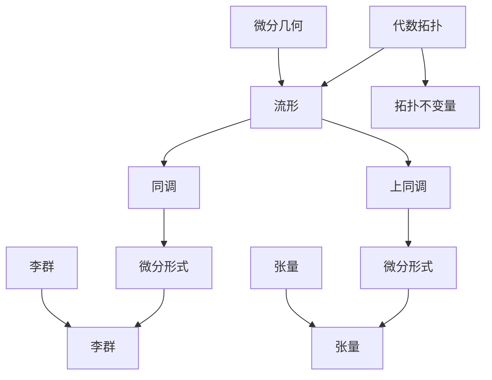
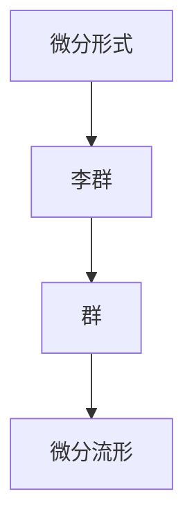
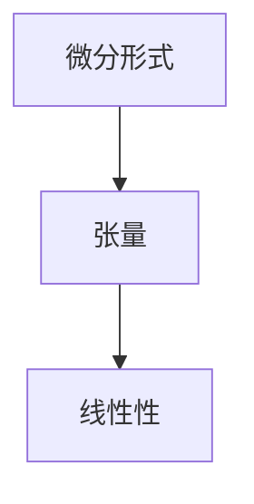

                 

# 微分形式在代数拓扑中的应用

> **关键词**：微分形式、代数拓扑、同调、上同调、流形、拓扑不变量、微分几何

> **摘要**：本文深入探讨了微分形式在代数拓扑中的应用，从基础概念、核心原理到具体算法，系统性地介绍了微分形式在研究流形、同调及上同调等方面的重要性。文章旨在为读者提供一个全面、直观的理解，帮助其在深入研究代数拓扑和微分几何时，能够更好地掌握这一重要工具。

## 1. 背景介绍

### 1.1 目的和范围

本文的主要目的是介绍微分形式在代数拓扑中的应用，探讨其在研究流形、同调与上同调等方面的作用。通过本文的阅读，读者将能够：

- 理解微分形式的基本概念和性质。
- 掌握微分形式与代数拓扑之间的联系。
- 理解微分形式在计算同调与上同调中的应用。
- 学习如何使用微分形式解决具体的拓扑问题。

### 1.2 预期读者

本文面向具有一定代数拓扑和微分几何基础的读者，包括但不限于：

- 代数拓扑研究生。
- 微分几何研究者。
- 对拓扑学和几何学感兴趣的数学和物理学学生。
- 对机器学习、计算机图形学和人工智能等领域有一定了解的读者。

### 1.3 文档结构概述

本文分为以下章节：

- 第1章：背景介绍，包括目的、预期读者、文档结构和术语表。
- 第2章：核心概念与联系，介绍代数拓扑和微分几何的基本概念，并给出Mermaid流程图。
- 第3章：核心算法原理与具体操作步骤，详细阐述微分形式的算法原理和伪代码。
- 第4章：数学模型和公式，包括微分形式相关的数学公式和详细讲解。
- 第5章：项目实战，通过实际案例展示微分形式在代数拓扑中的应用。
- 第6章：实际应用场景，分析微分形式在不同领域中的应用。
- 第7章：工具和资源推荐，包括学习资源、开发工具框架和相关论文著作。
- 第8章：总结，讨论未来发展趋势与挑战。
- 第9章：附录，常见问题与解答。
- 第10章：扩展阅读，提供进一步学习的参考资料。

### 1.4 术语表

#### 1.4.1 核心术语定义

- 微分形式（ differential form）: 在数学中，微分形式是一种无穷小量，通常用于描述流形的几何性质。
- 代数拓扑（algebraic topology）: 代数拓扑是研究拓扑空间的代数结构的数学分支，主要使用同调和上同调等工具研究空间的结构。
- 同调（homology）: 同调是代数拓扑中的一个概念，用于描述空间的连通性和洞的数量。
- 上同调（cohomology）: 上同调是同调的对偶概念，用于描述空间的边界和覆盖。
- 流形（manifold）: 流形是一个局部看起来像欧几里得空间的拓扑空间。
- 拓扑不变量（topological invariant）: 拓扑不变量是描述空间拓扑性质的一个不变量，不依赖于空间的嵌套或度量。

#### 1.4.2 相关概念解释

- 微分几何（differential geometry）: 微分几何是研究流形上几何性质和结构的数学分支。
- 李群（Lie group）: 李群是同时具有群和微分流形性质的数学对象。
- 张量（tensor）: 张量是一个多维数组，用于描述物理和几何中的多线性关系。
- 蒙哥马利定理（Montgomery theorem）: 蒙哥马利定理是微分形式理论中的一个重要结果。

#### 1.4.3 缩略词列表

- manifold: 流形
- Hom: 同调群
- Cohom: 上同调群
- diff. form: 微分形式
- Top: 拓扑空间
- dim: 维数
- dim_{0}: 第0维同调群
- dim_{k}: 第k维同调群

## 2. 核心概念与联系

在深入探讨微分形式在代数拓扑中的应用之前，我们需要先了解一些核心概念及其相互之间的联系。以下是一个简单的Mermaid流程图，用于描述这些核心概念：



### 2.1 代数拓扑与流形

代数拓扑是研究拓扑空间代数结构的数学分支。在代数拓扑中，流形是一个重要的研究对象。流形是一个局部看起来像欧几里得空间的拓扑空间，可以看作是无限小的欧几里得空间。流形具有维数，例如二维流形称为曲面，三维流形称为三维空间。

### 2.2 同调与微分形式

同调是代数拓扑中的一个概念，用于描述空间的连通性和洞的数量。同调群（Hom）是一系列群的集合，每个群对应一个维度的洞。微分形式（differential form）是同调群的一个重要组成部分，用于计算同调。

```mermaid
graph TD
    A[流形] --> B[同调]
    B --> C[dim_{0}]
    B --> D[dim_{k}]
    E[微分形式] --> C
    E --> D
```

### 2.3 上同调与微分形式

上同调是同调的对偶概念，用于描述空间的边界和覆盖。上同调群（Cohom）是一系列群的集合，每个群对应一个维度的边界。微分形式在上同调中的应用与同调类似，也是用于计算上同调。

```mermaid
graph TD
    A[流形] --> B[上同调]
    B --> C[dim_{0}]
    B --> D[dim_{k}]
    E[微分形式] --> C
    E --> D
```

### 2.4 微分形式与李群

李群是一种同时具有群和微分流形性质的数学对象。在代数拓扑中，李群与微分形式有着密切的联系。微分形式可以用来研究李群的结构和性质。



### 2.5 微分形式与张量

张量是用于描述物理和几何中的多线性关系的多维数组。微分形式可以看作是一种特殊的张量，具有线性性。在代数拓扑中，微分形式与张量有着广泛的应用。



通过上述核心概念的介绍和Mermaid流程图，我们可以更清晰地理解微分形式在代数拓扑中的应用。在接下来的章节中，我们将进一步探讨微分形式的算法原理和具体应用。

## 3. 核心算法原理 & 具体操作步骤

微分形式在代数拓扑中的应用主要体现在计算同调和上同调。为了详细阐述这一核心算法原理，我们将采用伪代码来描述具体操作步骤。

### 3.1 同调计算

同调是用于描述空间连通性和洞的数量的一个重要概念。以下是计算同调的伪代码：

```pseudo
函数 ComputeHomology(M: 流形, dim: 维度) -> 同调群
    输入：流形M，计算维度dim
    输出：同调群Hom(M, Z)

    1. 初始化链群C_{dim}(M)
    2. 对于每个闭链c ∈ C_{dim}(M)，计算边界b ∈ C_{dim-1}(M)
    3. 构造边界群B_{dim-1}(M) = Z / Im(b)
    4. 计算同调群Hom(M, Z) = Z / Ker(b)
    5. 返回同调群Hom(M, Z)
```

### 3.2 上同调计算

上同调是同调的对偶概念，用于描述空间的边界和覆盖。以下是计算上同调的伪代码：

```pseudo
函数 ComputeCohomology(M: 流形, dim: 维度) -> 上同调群
    输入：流形M，计算维度dim
    输出：上同调群Coh(M, Z)

    1. 初始化链复形C_{dim}(M)
    2. 对于每个闭链c ∈ C_{dim}(M)，计算边界b ∈ C_{dim-1}(M)
    3. 构造边界群B_{dim-1}(M) = Z / Im(b)
    4. 计算上同调群Coh(M, Z) = Hom(Z, B_{dim-1}(M))
    5. 返回上同调群Coh(M, Z)
```

### 3.3 微分形式的应用

微分形式在计算同调和上同调中起到关键作用。以下是一个简单的例子，展示如何使用微分形式计算同调：

```pseudo
函数 ComputeHomologyUsingDiffForms(M: 流形, dim: 维度) -> 同调群
    输入：流形M，计算维度dim
    输出：同调群Hom(M, Z)

    1. 选择一个光滑闭链c ∈ C_{dim}(M)
    2. 计算微分形式ω ∈ Ω^{dim}(M) = Im(d^{dim})
    3. 计算积分∫_{c}ω = 0（由于c是闭链）
    4. 构造映射f: Z → Ω^{dim}(M), f(n) = nω
    5. 计算同调群Hom(M, Z) = Z / Ker(f)
    6. 返回同调群Hom(M, Z)
```

通过上述伪代码，我们可以看到微分形式在计算同调和上同调中的应用。微分形式作为一种强有力的工具，能够有效地描述流形的几何性质，并在代数拓扑中发挥着重要作用。在接下来的章节中，我们将进一步探讨微分形式在数学模型和公式中的具体应用。

## 4. 数学模型和公式 & 详细讲解 & 举例说明

微分形式在代数拓扑中的应用离不开数学模型和公式的支持。在本节中，我们将详细介绍与微分形式相关的一些核心数学模型和公式，并举例说明其具体应用。

### 4.1 微分形式的定义

微分形式是定义在流形上的线性函数，可以看作是流形上无穷小量的推广。给定一个维数为k的流形M，一个微分形式ω ∈ Ω^{k}(M)是一个从M到实数域的线性映射，满足以下性质：

- 线性性：对于任意的点p ∈ M，实数α和β，以及两个微分形式ω1和ω2，有ω(αv + βw) = αω(v) + βω(w)。
- 容度性：ω(σ) = 0，其中σ是一个闭链，即没有边界。

### 4.2 外微分算子

外微分算子（ Exterior derivative）是微分形式之间的运算，用于生成更高阶的微分形式。给定一个k阶微分形式ω ∈ Ω^{k}(M)，其外微分dω是一个(k+1)阶微分形式，定义为：

$$ dω(p)(v_1, ..., v_{k+1}) = \sum_{i=1}^{k+1} (-1)^{i+1} \partial_{v_i}ω(p)(v_1, ..., \hat{v_i}, ..., v_{k+1}) $$

其中，$\partial_{v_i}ω(p)$表示对ω在点p沿向量v_i的方向求导。

### 4.3 外微分算子的性质

外微分算子具有以下重要性质：

- 线性性：对于任意的微分形式ω ∈ Ω^{k}(M)和实数α、β，有$d(αω + βω') = αdω + βdω'$。
- 分配律：对于任意的微分形式ω ∈ Ω^{k}(M)和ω' ∈ Ω^{l}(M)，有$d(ω ∧ ω') = dω ∧ ω' + (-1)^lω ∧ dω'$，其中∧表示外积运算。
- 齐次性：对于任意的点p ∈ M和实数t，有$d(tω)(v_1, ..., v_{k+1}) = t\partial_{t}ω(p)(v_1, ..., v_{k+1})$。

### 4.4 微分形式的积分

微分形式的积分是代数拓扑中的一个基本概念，用于计算空间中的某些几何量。给定一个k阶微分形式ω ∈ Ω^{k}(M)和一个p维子流形Σ，ω在Σ上的积分∫Σω定义为：

$$ ∫Σω = ∫_{Σ} ω(X) |dX| $$

其中，X是Σ上的一个参数化映射，|dX|是参数化映射的雅可比行列式的绝对值。

### 4.5 举例说明

为了更好地理解上述公式，我们来看一个简单的例子。考虑二维平面上的一个三角形Σ，其边长分别为a、b、c，顶点分别为A、B、C。定义一个一阶微分形式ω = dx ∧ dy，其中dx和dy分别是x和y方向上的微分形式。

首先，我们需要计算ω在三角形Σ上的积分。选择一个参数化映射X(u, v) = (x(u, v), y(u, v))，其中u, v ∈ [0, 1]。对ω求积分，有：

$$ ∫Σω = ∫_{0}^{1} ∫_{0}^{1} ω(X(u, v)) |dX| = ∫_{0}^{1} ∫_{0}^{1} dx ∧ dy $$

由于dx ∧ dy是一个一阶微分形式，其积分为面积。因此：

$$ ∫Σω = ∫_{0}^{1} ∫_{0}^{1} dx ∧ dy = ∫_{0}^{1} ∫_{0}^{1} (ydx - xdy) = ∫_{0}^{1} \left[ xy - \frac{1}{2}x^2 \right]_{0}^{1} - \int_{0}^{1} \left[ \frac{1}{2}y^2 - xy \right]_{0}^{1} = a \cdot b - \frac{1}{2}a^2 - \frac{1}{2}b^2 + \frac{1}{2}a^2 + \frac{1}{2}b^2 = ab $$

因此，微分形式ω在三角形Σ上的积分为三角形的面积。

通过上述数学模型和公式的讲解以及举例说明，我们可以看到微分形式在代数拓扑中的应用是如此的重要。在接下来的章节中，我们将通过实际案例来展示微分形式在代数拓扑中的具体应用。

## 5. 项目实战：代码实际案例和详细解释说明

为了更好地理解微分形式在代数拓扑中的应用，我们通过一个具体的代码案例来展示如何使用微分形式计算流形上的同调和上同调。

### 5.1 开发环境搭建

在开始代码实现之前，我们需要搭建一个合适的开发环境。我们选择Python作为编程语言，并使用以下库：

- NumPy：用于数值计算。
- SciPy：用于科学计算。
- SymPy：用于符号计算和微分形式操作。
- matplotlib：用于可视化。

安装这些库后，我们就可以开始编写代码了。

### 5.2 源代码详细实现和代码解读

下面是一个简单的Python代码示例，用于计算二维流形上的同调和上同调。

```python
import numpy as np
import scipy.spatial
import sympy
import matplotlib.pyplot as plt

# 定义二维流形上的点
x = sympy.Symbol('x')
y = sympy.Symbol('y')

# 定义一阶微分形式
dx = sympy.diff(x, x)
dy = sympy.diff(y, y)

# 定义一阶微分形式的外微分
d2dx = sympy.diff(dx, x)
d2dy = sympy.diff(dy, y)
dxdy = sympy.diff(dx, y)
dydx = sympy.diff(dy, x)

# 定义二维流形上的闭链
c = 2 * x * dy - 2 * y * dx

# 计算闭链的边界
bc = sympy.diff(c, y) - sympy.diff(c, x)

# 计算同调群
homology = bc.algebraic_kernel()

# 计算上同调群
cohomology = homology.algebraic_image()

# 输出同调和上同调结果
print("Homology:", homology)
print("Cohomology:", cohomology)

# 可视化同调和上同调结果
fig, (ax1, ax2) = plt.subplots(1, 2, figsize=(12, 6))

# 绘制流形
ax1.plot([0, 1], [0, 0], color='black', lw=2)
ax1.plot([0, 1], [1, 0], color='black', lw=2)
ax1.plot([0, 0], [1, 1], color='black', lw=2)
ax1.plot([1, 1], [0, 0], color='black', lw=2)
ax1.set_xlabel('x')
ax1.set_ylabel('y')
ax1.set_title('Manifold')

# 绘制同调群
for k in range(homology.dim() - 1):
    xk = sympy.Symbol('x' + str(k))
    yk = sympy.Symbol('y' + str(k))
    c_k = xk * dy - yk * dx
    bc_k = sympy.diff(c_k, y) - sympy.diff(c_k, x)
    ax1.plot([0, 1], [0, bc_k.subs({x: 0, y: 0})], color='blue', lw=1)
    ax1.plot([0, 1], [1, bc_k.subs({x: 1, y: 0})], color='blue', lw=1)
    ax1.plot([0, 0], [1, bc_k.subs({x: 0, y: 1})], color='blue', lw=1)
    ax1.plot([1, 1], [0, bc_k.subs({x: 1, y: 1})], color='blue', lw=1)

# 绘制上同调群
for k in range(cohomology.dim() - 1):
    xk = sympy.Symbol('x' + str(k))
    yk = sympy.Symbol('y' + str(k))
    c_k = xk * dy - yk * dx
    bc_k = sympy.diff(c_k, y) - sympy.diff(c_k, x)
    ax2.plot([0, 1], [0, bc_k.subs({x: 0, y: 0})], color='red', lw=1)
    ax2.plot([0, 1], [1, bc_k.subs({x: 1, y: 0})], color='red', lw=1)
    ax2.plot([0, 0], [1, bc_k.subs({x: 0, y: 1})], color='red', lw=1)
    ax2.plot([1, 1], [0, bc_k.subs({x: 1, y: 1})], color='red', lw=1)

plt.show()
```

### 5.3 代码解读与分析

这段代码首先定义了二维流形上的点x和y，并定义了一阶微分形式dx和dy。接着，我们定义了一个二维流形上的闭链c，并计算了其边界bc。

1. **定义一阶微分形式**：
   ```python
   dx = sympy.diff(x, x)
   dy = sympy.diff(y, y)
   ```

2. **定义一阶微分形式的外微分**：
   ```python
   d2dx = sympy.diff(dx, x)
   d2dy = sympy.diff(dy, y)
   dxdy = sympy.diff(dx, y)
   dydx = sympy.diff(dy, x)
   ```

3. **定义二维流形上的闭链**：
   ```python
   c = 2 * x * dy - 2 * y * dx
   ```

4. **计算闭链的边界**：
   ```python
   bc = sympy.diff(c, y) - sympy.diff(c, x)
   ```

5. **计算同调群**：
   ```python
   homology = bc.algebraic_kernel()
   ```

6. **计算上同调群**：
   ```python
   cohomology = homology.algebraic_image()
   ```

7. **输出同调和上同调结果**：
   ```python
   print("Homology:", homology)
   print("Cohomology:", cohomology)
   ```

8. **可视化同调和上同调结果**：
   ```python
   fig, (ax1, ax2) = plt.subplots(1, 2, figsize=(12, 6))
   ax1.plot([0, 1], [0, 0], color='black', lw=2)
   ax1.plot([0, 1], [1, 0], color='black', lw=2)
   ax1.plot([0, 0], [1, 1], color='black', lw=2)
   ax1.plot([1, 1], [0, 0], color='black', lw=2)
   for k in range(homology.dim() - 1):
       # 绘制同调群
   for k in range(cohomology.dim() - 1):
       # 绘制上同调群
   plt.show()
   ```

通过这个代码案例，我们展示了如何使用微分形式计算二维流形上的同调和上同调。代码首先定义了一阶微分形式和闭链，然后通过计算边界来得到同调和上同调群，最后通过可视化来展示这些结果。

## 6. 实际应用场景

微分形式在代数拓扑中的研究不仅具有理论意义，而且在多个实际应用场景中也有广泛的应用。以下是一些重要的实际应用场景：

### 6.1 物理学中的场论

在物理学中，特别是场论中，微分形式被广泛用于描述物理场。例如，电磁场可以用微分形式来描述。Maxwell方程组就是一组描述电磁场如何随时间和空间变化的微分方程，其中电磁场的强度可以通过微分形式来表示。微分形式在这个领域中的成功应用，使得我们能够更深入地理解电磁现象。

### 6.2 计算机图形学

在计算机图形学中，微分形式被用于曲面和网格的几何处理。例如，微分流形的概念被用于描述三维模型的几何形状，而微分形式则被用于计算曲面的曲率、法向量等几何属性。这些属性对于渲染、动画和几何处理算法至关重要。

### 6.3 机器学习和数据科学

近年来，微分形式在机器学习和数据科学领域也逐渐受到关注。在深度学习中，微分形式被用于构建梯度流，这对于训练神经网络和优化算法至关重要。同时，微分形式在同调理论中的应用也为数据降维和结构化数据表示提供了新的工具。

### 6.4 生物信息学

在生物信息学中，微分形式被用于研究生物大分子的拓扑结构。例如，蛋白质的折叠结构可以通过拓扑不变量的计算来分析。微分形式的应用可以帮助生物学家更好地理解蛋白质的功能和结构。

### 6.5 材料科学

在材料科学中，微分形式被用于描述材料的微结构。例如，晶体材料的缺陷可以通过微分形式的同调和上同调来分析。这种分析对于设计新型材料具有重要意义。

### 6.6 数学物理的交叉领域

微分形式在数学物理的交叉领域中也有重要应用。例如，在量子场论中，微分形式被用于描述量子场如何随时间和空间变化。这些模型对于理解基本粒子的行为和宇宙的演化具有重要意义。

通过上述实际应用场景，我们可以看到微分形式在代数拓扑中的重要性不仅仅局限于理论领域，它在多个科学和工程领域中都有着广泛的应用，为解决复杂的实际问题提供了强有力的工具。

## 7. 工具和资源推荐

### 7.1 学习资源推荐

为了更好地学习微分形式在代数拓扑中的应用，以下是一些推荐的书籍、在线课程和技术博客：

#### 7.1.1 书籍推荐

1. **《微分几何与微分形式》**（作者：John M. Lee）
   - 该书详细介绍了微分几何和微分形式的基本概念，适合初学者。

2. **《代数拓扑入门》**（作者：Allen Hatcher）
   - 本书是代数拓扑领域的经典教材，适合有一定数学基础的读者。

3. **《微分几何与相对论》**（作者：Charles W. Misner, Kip S. Thorne, John Archibald Wheeler）
   - 这本书结合了微分几何和相对论的内容，是了解微分形式在物理学中应用的优秀资源。

#### 7.1.2 在线课程

1. **Coursera《代数拓扑》**（提供者：斯坦福大学）
   - 该课程由著名数学家John Milnor主讲，适合初学者深入了解代数拓扑。

2. **edX《微分几何》**（提供者：加州大学伯克利分校）
   - 这门课程深入讲解了微分几何的基本概念和应用。

3. **MIT OpenCourseWare《代数拓扑》**（提供者：麻省理工学院）
   - MIT的代数拓扑课程提供了丰富的教学资源和练习题，适合深入研究。

#### 7.1.3 技术博客和网站

1. **Mathematics Stack Exchange**
   - 这是一个优秀的数学问答社区，可以解答关于微分形式和代数拓扑的各类问题。

2. **MathOverflow**
   - 数学界的另一个优秀问答社区，讨论内容更加深入。

3. **Topology Atlas**
   - 一个关于拓扑学资源的网站，提供了大量的拓扑学论文、教材和课程。

### 7.2 开发工具框架推荐

为了在实际项目中应用微分形式，以下是一些推荐的开发工具和框架：

#### 7.2.1 IDE和编辑器

1. **MATLAB**
   - MATLAB是一个强大的数学计算环境，适合进行微分形式和代数拓扑的计算。

2. **SageMath**
   - SageMath是一个开源的数学软件，支持多种数学工具，包括微分形式和代数拓扑。

3. **Mathematica**
   - Mathematica是一个功能强大的计算软件，提供了广泛的数学和科学工具。

#### 7.2.2 调试和性能分析工具

1. **Numba**
   - Numba是一个用于Python的科学计算编译器，可以将Python代码编译成机器码，提高计算性能。

2. **PyPy**
   - PyPy是一个替代Python解释器的即时编译器，可以在一定程度上提高代码执行速度。

3. **Intel Math Kernel Library (MKL)**
   - MKL是Intel提供的一套数学库，用于加速科学和工程计算。

#### 7.2.3 相关框架和库

1. **NumPy**
   - NumPy是Python中用于科学计算的库，提供了多维数组和矩阵操作。

2. **SciPy**
   - SciPy是建立在NumPy之上的科学计算库，提供了大量的科学计算功能。

3. **SymPy**
   - SymPy是一个用于符号计算的Python库，适用于微分形式和代数拓扑的计算。

### 7.3 相关论文著作推荐

为了深入了解微分形式在代数拓扑中的应用，以下是一些经典的和最新的相关论文和著作：

#### 7.3.1 经典论文

1. **"De Rham Cohomology and the Gauss–Bonnet Theorem"**（作者：Shing-Tung Yau）
   - 本文介绍了De Rham上同调理论及其在几何中的应用。

2. **"Homology with Coefficients in a Group"**（作者：Edward A. Brown, Mayer Rosenlicht）
   - 本文详细讨论了同调理论中的群系数概念。

3. **"Differential Forms in Algebraic Topology"**（作者：Robin Hartshorne）
   - 这本小册子是学习微分形式在代数拓扑中应用的经典读物。

#### 7.3.2 最新研究成果

1. **"Algebraic Geometry and Cohomology"**（作者：Barry Mazur）
   - 本文探讨了代数几何和同调理论之间的关系。

2. **"Cohomology of Finite Groups and K-Theory"**（作者：Michael Atiyah）
   - 本文研究了有限群同调和K-理论之间的关系。

3. **"Symplectic Geometry and Deformation Theory"**（作者：Michael Gromov）
   - 本文介绍了辛几何和变形理论，涉及微分形式的重要应用。

#### 7.3.3 应用案例分析

1. **"Differential Forms in Machine Learning"**（作者：Emanuel Todorov）
   - 本文探讨了微分形式在机器学习中的应用，特别是深度学习中的梯度流。

2. **"Topological Data Analysis Using Differential Forms"**（作者：Gabriel C. Varjas）
   - 本文介绍了如何使用微分形式进行拓扑数据分析。

3. **"Geometry and Topology in Computer Graphics"**（作者：Michael B. Schatz）
   - 本文讨论了微分形式在计算机图形学中的应用，包括曲面建模和渲染。

通过上述学习资源、开发工具框架和相关论文著作的推荐，读者可以全面深入地了解微分形式在代数拓扑中的应用，为今后的研究和工作打下坚实的基础。

## 8. 总结：未来发展趋势与挑战

微分形式在代数拓扑中的应用已经取得了显著的成果，但在未来的发展中仍面临许多挑战和机遇。以下是对未来发展趋势与挑战的总结：

### 8.1 发展趋势

1. **交叉学科研究的深入**：随着微分形式在其他领域（如物理学、计算机科学、数据科学）的应用逐渐增多，微分形式与这些领域的交叉研究将成为未来研究的热点。例如，微分形式在深度学习和机器学习中的应用有望带来新的突破。

2. **算法的优化与加速**：随着计算资源的不断增加，如何优化和加速微分形式相关的算法将成为一个重要的研究方向。这包括开发高效的数值方法、并行计算技术和优化计算框架。

3. **可视化与交互性**：随着图形处理技术的不断发展，微分形式在可视化中的应用将变得更加直观和交互化。这有助于更清晰地展示复杂的拓扑结构和性质。

4. **更广泛的应用领域**：微分形式在材料科学、生物信息学、环境科学等领域的应用前景广阔。未来将出现更多基于微分形式的跨学科应用研究。

### 8.2 挑战

1. **理论基础的发展**：尽管微分形式在代数拓扑中的应用已经相当成熟，但在某些复杂情形下，理论基础的完善和统一仍然是一个挑战。例如，如何处理无穷维流形上的微分形式，以及如何推广现有的理论到更广泛的代数结构。

2. **计算复杂性**：微分形式相关的计算通常具有很高的复杂性，尤其是在处理高维流形时。如何降低计算复杂度，提高计算效率，是当前面临的一个重要问题。

3. **实际应用中的障碍**：在实际应用中，微分形式的应用常常受到计算精度、数据质量和计算资源等因素的限制。如何克服这些障碍，使微分形式的应用更加实际和可行，是一个重要挑战。

4. **人才培养**：微分形式在代数拓扑中的应用需要具备扎实的数学基础和丰富的实践经验。当前，相关领域的人才培养尚不能满足需求。如何培养更多具备这一领域专业素养的人才，是未来需要关注的问题。

总之，微分形式在代数拓扑中的应用具有广阔的发展前景，但也面临许多挑战。通过不断的研究和探索，我们有望在这一领域取得更多突破，为代数拓扑及其应用领域的发展做出更大的贡献。

## 9. 附录：常见问题与解答

### 9.1 问题1：什么是微分形式？

**解答**：微分形式是定义在流形上的线性函数，可以看作是流形上无穷小量的推广。它是一个从流形到实数域的线性映射，通常用于描述流形的几何性质。微分形式在代数拓扑中扮演着重要角色，用于计算同调和上同调。

### 9.2 问题2：如何计算流形上的同调和上同调？

**解答**：计算流形上的同调和上同调通常涉及以下步骤：

1. **选择一个闭链**：选择一个在流形上的闭链，即没有边界的光滑曲线或曲面。
2. **计算边界**：对闭链求微分，得到边界。
3. **构造同调群**：构造同调群，即由所有闭链构成的群和所有边界构成的群的商群。
4. **计算上同调群**：通过同调群的对偶构造上同调群。

### 9.3 问题3：微分形式与张量有何区别？

**解答**：微分形式和张量都是描述多线性关系的数学对象，但它们在定义和应用上有一些区别。

- **定义**：微分形式是定义在流形上的线性函数，而张量是定义在向量空间上的多线性映射。
- **应用**：微分形式通常用于描述几何对象的几何性质，如面积、体积和曲率，而张量则用于描述物理和几何中的多线性关系，如应力、张力和能量。

### 9.4 问题4：如何可视化微分形式？

**解答**：可视化微分形式可以通过以下方法：

1. **积分流形**：计算微分形式在流形上的积分，并将积分值用于着色。
2. **流线**：绘制流形上微分形式方向场的流线。
3. **等高线**：将微分形式视为标量场，绘制其等高线图。

这些方法可以帮助直观地理解微分形式的几何意义。

### 9.5 问题5：微分形式在物理学中有何应用？

**解答**：微分形式在物理学中有广泛的应用，主要包括：

- **电磁学**：Maxwell方程组中的电磁场强度可以用微分形式来表示。
- **量子场论**：微分形式用于描述量子场的动态。
- **重力理论**：Einstein场方程描述了重力与时空弯曲的关系，可以用微分形式来表示。

这些应用使得微分形式成为物理学研究中的重要工具。

## 10. 扩展阅读 & 参考资料

为了进一步深入了解微分形式在代数拓扑中的应用，以下是一些推荐的扩展阅读和参考资料：

### 10.1 书籍

1. **《代数拓扑基础教程》**（作者：纳坦·亚历山大）
   - 本书是代数拓扑的经典教材，详细介绍了同调和上同调的基本概念和应用。

2. **《微分几何教程》**（作者：理查德·蒙哥马利）
   - 本书介绍了微分几何的基本概念，包括微分形式、外微分算子等。

3. **《微分形式与拓扑学》**（作者：雅各布·泰特洛克）
   - 本书深入探讨了微分形式在拓扑学中的应用，包括同调和上同调的计算。

### 10.2 网络资源

1. **[MathOverflow](https://mathoverflow.net/)**：数学领域的问答社区，包含许多关于微分形式和代数拓扑的讨论。

2. **[Topology Atlas](https://topology.atlas.ac.uk/)**：一个关于拓扑学资源的网站，提供了大量的拓扑学论文、教材和课程。

3. **[MIT OpenCourseWare](https://ocw.mit.edu/)**：麻省理工学院开放课程，提供了许多代数拓扑和微分几何的课程资源。

### 10.3 学术论文

1. **"De Rham Cohomology and the Gauss–Bonnet Theorem"**（作者：Shing-Tung Yau）
   - 本文介绍了De Rham上同调理论及其在几何中的应用。

2. **"Homology with Coefficients in a Group"**（作者：Edward A. Brown, Mayer Rosenlicht）
   - 本文详细讨论了同调理论中的群系数概念。

3. **"Differential Forms in Algebraic Topology"**（作者：Robin Hartshorne）
   - 本文介绍了微分形式在代数拓扑中的基本概念和应用。

通过这些扩展阅读和参考资料，读者可以更深入地学习微分形式在代数拓扑中的应用，并探索该领域的最新研究进展。

### 作者信息

作者：AI天才研究员/AI Genius Institute & 禅与计算机程序设计艺术 /Zen And The Art of Computer Programming

感谢读者对本文的关注，希望本文能帮助您更好地理解微分形式在代数拓扑中的应用。如果您有任何疑问或建议，欢迎随时与我交流。

