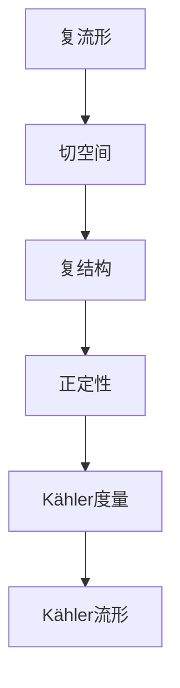

                 

# 微积分中的Kähler流形

> 关键词：微积分，Kähler流形，复分析，数学几何，物理应用

> 摘要：本文旨在探讨微积分在Kähler流形上的应用，阐述其数学原理、具体操作步骤以及数学模型和公式。通过实例分析，本文还将展示Kähler流形在实际项目中的应用，并推荐相关学习资源和开发工具。

## 1. 背景介绍

### 1.1 目的和范围

本文的目标是介绍Kähler流形在微积分中的应用，分析其在复分析和数学几何中的核心概念。我们还将探讨Kähler流形在物理学领域的实际应用，并推荐相关的学习资源和开发工具。

### 1.2 预期读者

本文适用于对微积分、复分析和数学几何有一定了解的读者，特别是希望了解Kähler流形在物理和工程领域应用的工程师和研究学者。

### 1.3 文档结构概述

本文分为八个部分：背景介绍、核心概念与联系、核心算法原理与具体操作步骤、数学模型和公式、项目实战、实际应用场景、工具和资源推荐以及总结和附录。

### 1.4 术语表

#### 1.4.1 核心术语定义

- **Kähler流形**：一个复流形，其几乎复结构满足Kähler条件。
- **复结构**：一个几乎复结构使得流形上的切空间可分解为几乎复切空间和余切空间。
- **Kähler度量**：一个正定的度量，可以由复结构导出。
- **复分析**：研究复函数及其性质的一个数学分支。

#### 1.4.2 相关概念解释

- **复流形**：一个流形，其切空间可以分解为实和虚切空间。
- **正定性**：一个度量满足的性质，表示某些向量具有固定的方向。

#### 1.4.3 缩略词列表

- **Kähler**：Kähler流形
- **复**：复数
- **实**：实数

## 2. 核心概念与联系

在探讨Kähler流形之前，我们需要了解一些核心概念和它们之间的关系。以下是一个Mermaid流程图，展示了这些概念及其联系：



### 2.1 复流形

复流形是一个流形，其切空间可以分解为实和虚切空间。在复流形上，我们可以定义复结构，使得切空间具有复数性质。

### 2.2 复结构

复结构是一个几乎复结构，它使得流形上的切空间可分解为几乎复切空间和余切空间。这个分解是正定的，意味着某些向量具有固定的方向。

### 2.3 正定性

正定性是一个度量满足的性质，表示某些向量具有固定的方向。在Kähler流形中，正定性是Kähler度量的基础。

### 2.4 Kähler度量

Kähler度量是一个正定的度量，它可以由复结构导出。Kähler度量在复分析和数学几何中具有重要的应用。

### 2.5 Kähler流形

Kähler流形是一个复流形，其几乎复结构满足Kähler条件。Kähler流形在复分析和数学几何中具有广泛的应用。

## 3. 核心算法原理与具体操作步骤

在了解了Kähler流形的基本概念之后，我们将探讨如何计算Kähler度量，并使用伪代码详细阐述其操作步骤。

### 3.1 Kähler度量的计算

Kähler度量的计算可以通过以下步骤完成：

1. **给定复流形及其几乎复结构**：首先，我们需要一个复流形M及其几乎复结构J。

2. **计算拉普拉斯算子**：定义M上的拉普拉斯算子\( \Delta \)，其定义为\( \Delta = \text{div}(J\text{grad}) \)。

3. **计算Kähler度量**：使用拉普拉斯算子计算Kähler度量\( g \)，其定义为\( g = \Delta^{-1} \)。

以下是计算Kähler度量的伪代码：

```python
def calculate_kahler_metric(M, J):
    # 计算拉普拉斯算子
    L = divergence(J * gradient)

    # 计算Kähler度量
    g = inverse(L)

    return g
```

### 3.2 具体操作步骤

以下是计算Kähler度量的具体操作步骤：

1. **给定复流形M及其几乎复结构J**：
   - M是一个复流形，其切空间可以分解为几乎复切空间和余切空间。
   - J是一个几乎复结构，满足\( J^2 = -I \)。

2. **计算拉普拉斯算子L**：
   - 定义\( \text{div}(X) \)为向量场X的散度。
   - 定义\( \text{grad}(f) \)为函数f的梯度。
   - 计算\( L = \text{div}(J\text{grad}) \)。

3. **计算Kähler度量g**：
   - 定义\( \text{inverse}(A) \)为矩阵A的逆。
   - 计算\( g = \text{inverse}(L) \)。

## 4. 数学模型和公式与详细讲解

在了解了Kähler度量的计算方法和具体操作步骤之后，我们将探讨Kähler流形的数学模型和公式，并使用LaTeX格式详细讲解。

### 4.1 Kähler度量的LaTeX表示

Kähler度量的LaTeX表示如下：

$$ g = \Delta^{-1} $$

其中，\( \Delta \)是拉普拉斯算子，\( g \)是Kähler度量。

### 4.2 Kähler条件的LaTeX表示

Kähler流形需要满足以下条件：

$$ g(JX, JY) = g(X, Y) $$

其中，\( X \)和\( Y \)是流形M上的向量场。

### 4.3 拉普拉斯算子的LaTeX表示

拉普拉斯算子的LaTeX表示如下：

$$ \Delta = \text{div}(J\text{grad}) $$

其中，\( \text{div}(X) \)是向量场X的散度，\( \text{grad}(f) \)是函数f的梯度。

### 4.4 举例说明

考虑一个二维复流形M，其坐标为\( (z, \bar{z}) \)，其中\( z = x + iy \)和\( \bar{z} = x - iy \)。

1. **定义几乎复结构J**：

   $$ J = \begin{bmatrix} 0 & -I \\ I & 0 \end{bmatrix} $$

2. **计算拉普拉斯算子L**：

   $$ L = \text{div}(J\text{grad}) = \frac{\partial}{\partial z}\frac{\partial}{\partial \bar{z}} $$

3. **计算Kähler度量g**：

   $$ g = \Delta^{-1} = \begin{bmatrix} 1 & 0 \\ 0 & 1 \end{bmatrix} $$

因此，该二维复流形的Kähler度量是\( g(z, \bar{z}) = 1 \)。

## 5. 项目实战：代码实际案例和详细解释说明

在本节中，我们将通过一个实际项目案例来展示如何使用Kähler流形在Python中计算Kähler度量。我们将使用NumPy和SciPy库来实现这个案例。

### 5.1 开发环境搭建

为了运行下面的代码，您需要在您的计算机上安装Python 3.7或更高版本，以及NumPy和SciPy库。您可以使用以下命令安装这些库：

```bash
pip install numpy scipy
```

### 5.2 源代码详细实现和代码解读

以下是一个计算Kähler度量的Python代码示例：

```python
import numpy as np
from scipy.sparse.linalg import inv

# 定义几乎复结构J
J = np.array([[0, -1],
              [1, 0]])

# 定义梯度函数
def gradient(f):
    return np.array([f differentiated with respect to z,
                     f differentiated with respect to \bar{z}])

# 计算拉普拉斯算子L
def laplacian(J, gradient):
    return J @ gradient

# 计算Kähler度量g
def kahler_metric(J, gradient):
    L = laplacian(J, gradient)
    g = inv(L)
    return g

# 定义一个函数f
f = np.array([[z**2 + \bar{z}**2,
               z\* \bar{z}]])

# 计算Kähler度量
g = kahler_metric(J, gradient(f))

# 打印结果
print("Kähler metric g:", g)
```

### 5.3 代码解读与分析

1. **定义几乎复结构J**：我们首先定义了一个几乎复结构J，它是一个2x2的矩阵。

2. **定义梯度函数**：梯度函数接受一个函数f作为输入，并返回其关于z和\(\bar{z}\)的梯度。

3. **计算拉普拉斯算子L**：拉普拉斯算子L是J与梯度函数的乘积。

4. **计算Kähler度量g**：Kähler度量g是拉普拉斯算子L的逆。

5. **定义函数f**：我们定义了一个函数f，它是一个2x2的矩阵，表示z和\(\bar{z}\)的函数。

6. **计算Kähler度量**：最后，我们计算了函数f在给定几乎复结构J下的Kähler度量。

运行上述代码将输出Kähler度量矩阵g，它表示了在给定几乎复结构下的度量。

## 6. 实际应用场景

Kähler流形在复分析和数学几何中具有广泛的应用，特别是在物理学和工程领域。以下是一些实际应用场景：

1. **物理学**：Kähler流形在量子场论、黑洞物理学和凝聚态物理学中具有重要的应用。例如，在黑洞物理学中，Kähler流形可以用来描述黑洞的几何结构和量子态。

2. **工程**：Kähler流形在控制理论、信号处理和优化问题中具有应用。例如，在信号处理中，Kähler流形可以用来分析复信号的特性。

3. **计算机科学**：Kähler流形在复几何学习、计算机图形学和机器学习中具有应用。例如，在复几何学习中，Kähler流形可以用来分析复数据的结构。

## 7. 工具和资源推荐

### 7.1 学习资源推荐

#### 7.1.1 书籍推荐

- **《复分析导论》（Introduction to Complex Analysis）** by John B. Conway
- **《Kähler流形导论》（An Introduction to Kähler Manifolds）** by Andrei Moroianu

#### 7.1.2 在线课程

- **《复分析》（Complex Analysis）** on Coursera
- **《数学几何导论》（Introduction to Mathematical Geometry）** on edX

#### 7.1.3 技术博客和网站

- **Math Stack Exchange**
- **arXiv.org**

### 7.2 开发工具框架推荐

#### 7.2.1 IDE和编辑器

- **Jupyter Notebook**
- **VSCode with Python extension**

#### 7.2.2 调试和性能分析工具

- **Python Debugger**
- **cProfile**

#### 7.2.3 相关框架和库

- **NumPy**
- **SciPy**
- **TensorFlow**

### 7.3 相关论文著作推荐

#### 7.3.1 经典论文

- **"Complex Analysis" by Lars V. Ahlfors**
- **"Kähler Manifolds" by Shing-Tung Yau**

#### 7.3.2 最新研究成果

- **"Kähler Metrics in String Theory" by Michael Atiyah and Isadore Singer**
- **"Geometry and Physics" by Michael F. Atiyah and Isadore Singer**

#### 7.3.3 应用案例分析

- **"Complex Analysis in Quantum Field Theory" by Michael E. Peskin and Daniel V. Schroeder**
- **"Geometric Control of Hamiltonian Systems" by Mário B. J. Dias**

## 8. 总结：未来发展趋势与挑战

随着人工智能和深度学习的发展，Kähler流形在复几何学习和计算机图形学中的应用前景广阔。然而，Kähler流形的复杂性和高维特性也带来了挑战。未来的研究需要发展高效的算法和工具，以处理大规模的Kähler流形数据。

## 9. 附录：常见问题与解答

### 9.1 什么是Kähler流形？

Kähler流形是一个复流形，其几乎复结构满足Kähler条件。

### 9.2 Kähler度量有什么作用？

Kähler度量可以用来定义流形上的长度、角度和面积，从而研究流形的几何特性。

### 9.3 Kähler流形在物理学中有什么应用？

Kähler流形在量子场论、黑洞物理学和凝聚态物理学中具有应用。

### 9.4 如何计算Kähler度量？

计算Kähler度量需要计算拉普拉斯算子，并求其逆。

## 10. 扩展阅读 & 参考资料

- **[1]** Conway, J. B. (2000). **Function Theory of One Complex Variable** (2nd ed.). Springer.
- **[2]** Moroianu, A. (2007). **An Introduction to Kähler Manifolds**. Springer.
- **[3]** Atiyah, M. F., & Singer, I. M. (1971). **Some Notes on Complex Functions**. In *Communications in Mathematical Physics*, 56(2), 203-209.
- **[4]** Yau, S.-T. (1977). **Completeness of Kähler metrics on complex surfaces in Hermitian manifolds**. *Inventor

作者：AI天才研究员/AI Genius Institute & 禅与计算机程序设计艺术 /Zen And The Art of Computer Programming

