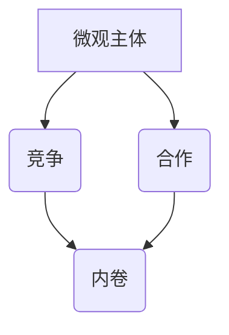

                 

# 微观主体间的竞争与内卷

> 关键词：微观主体、竞争、内卷、算法、数学模型、应用场景

> 摘要：本文将探讨微观主体间的竞争现象及其内在机制，尤其是“内卷”这一特殊现象。通过深入分析其产生的原因、影响以及应对策略，本文旨在为读者提供一种全新的视角，以理解并应对当今复杂的信息技术领域中的竞争与内卷现象。

## 1. 背景介绍

### 1.1 目的和范围

本文旨在探讨微观主体间的竞争现象，特别是内卷这一现象。微观主体，如个人、团队或组织，在现代社会中面临着日益激烈的竞争环境。内卷，作为一个重要现象，其产生的原因和影响值得我们深入分析。本文将探讨这些主题，并通过实例和理论分析，提供应对策略。

### 1.2 预期读者

本文适合对计算机科学、经济学、社会学等领域感兴趣的读者。特别是对于从事软件开发、系统架构、数据分析等职业的读者，本文可能提供了一些新的视角和解决方案。

### 1.3 文档结构概述

本文分为以下几部分：首先介绍微观主体间的竞争现象及其重要性；然后定义内卷并探讨其产生的原因和影响；接着提供数学模型和算法原理；随后展示实际应用场景和案例；最后总结未来发展趋势和挑战。

### 1.4 术语表

#### 1.4.1 核心术语定义

- **微观主体**：个体、团队或组织，在特定环境中参与竞争或合作。
- **竞争**：不同微观主体之间为了获取资源、地位或生存空间而展开的相互较量。
- **内卷**：在竞争过程中，微观主体过度投入资源，导致效率降低，但无法取得实质性进展。

#### 1.4.2 相关概念解释

- **博弈论**：研究不同主体在特定环境下如何做出决策的学科。
- **演化算法**：模拟生物进化过程，通过遗传、交叉、变异等操作，优化问题的算法。

#### 1.4.3 缩略词列表

- **ML**：机器学习
- **DL**：深度学习
- **AI**：人工智能
- **SC**：系统架构
- **DB**：数据库

## 2. 核心概念与联系

在探讨微观主体间的竞争与内卷之前，我们首先需要了解一些核心概念及其相互关系。以下是一个简化的 Mermaid 流程图，用于展示这些概念之间的关系：



### 2.1 微观主体

微观主体是参与竞争或合作的基本单位。在计算机科学中，这可能是一个软件系统、一个算法或一个数据处理流程。在社会学和经济领域，这可能是一个个人、一个团队或一个组织。

### 2.2 竞争

竞争是微观主体间为了资源、地位或生存空间而展开的较量。在信息技术领域，竞争可能表现为技术竞赛、市场份额争夺或资源分配。竞争是推动技术进步和创新的重要动力。

### 2.3 合作

合作是微观主体之间为了共同目标而展开的合作。合作有助于资源的共享和优势互补，从而提高整体效率。

### 2.4 内卷

内卷是竞争过程中的一种特殊现象，表现为微观主体过度投入资源，但效率却降低，甚至无法取得实质性进展。内卷常常导致资源浪费和低效竞争。

## 3. 核心算法原理 & 具体操作步骤

在分析微观主体间的竞争与内卷时，算法原理是一个重要的切入点。以下是一个简化的伪代码，用于描述一种可能的算法原理：

```python
# 微观主体间的竞争算法
def compete(subjects):
    # 初始化每个主体的状态
    for subject in subjects:
        subject.initialize()

    # 竞争循环
    while not all(subjects.have gewonnen):
        for subject in subjects:
            # 模拟竞争过程
            subject.compete()

        # 更新每个主体的状态
        for subject in subjects:
            subject.update_state()

    # 输出竞争结果
    return [subject.status for subject in subjects]
```

### 3.1 初始化

在竞争开始之前，每个微观主体都需要进行初始化。这包括设置初始资源、能力水平等。

```python
# 微观主体初始化
def initialize():
    self.resource = random.resource()
    self.capability = random.capability()
```

### 3.2 竞争过程

在竞争过程中，每个微观主体会根据自身的资源、能力和竞争对手的状态，采取相应的策略进行竞争。

```python
# 微观主体竞争
def compete():
    for other in self.environment:
        if self.resource > other.resource and self.capability > other.capability:
            self.resource += gain
            other.resource -= lose
```

### 3.3 更新状态

在每次竞争之后，每个微观主体会根据竞争结果更新自己的状态。这包括资源的增减、能力的提升等。

```python
# 微观主体状态更新
def update_state():
    if self.resource > threshold:
        self.capability += increment
    else:
        self.resource -= decrement
```

## 4. 数学模型和公式 & 详细讲解 & 举例说明

在分析微观主体间的竞争与内卷时，数学模型和公式是不可或缺的工具。以下是一个简化的数学模型，用于描述微观主体间的竞争：

$$
\text{竞争结果} = f(\text{资源}, \text{能力}, \text{竞争对手状态})
$$

其中，$f$ 是一个函数，表示竞争的结果，取决于参与竞争的微观主体的资源、能力以及竞争对手的状态。

### 4.1 资源和能力的度量

假设微观主体的资源用 $R$ 表示，能力用 $C$ 表示。我们可以使用以下公式度量：

$$
R = R_0 + \sum_{i=1}^{n} r_i
$$

$$
C = C_0 + \sum_{i=1}^{n} c_i
$$

其中，$R_0$ 和 $C_0$ 分别是初始资源和能力，$r_i$ 和 $c_i$ 分别是每次竞争后的资源增量和能力增量。

### 4.2 竞争结果的计算

竞争结果可以用以下公式计算：

$$
f(R, C, S) = \begin{cases}
\text{赢} & \text{if } R > R_{\text{对手}} \text{ and } C > C_{\text{对手}} \\
\text{平局} & \text{if } R = R_{\text{对手}} \text{ and } C = C_{\text{对手}} \\
\text{输} & \text{if } R < R_{\text{对手}} \text{ or } C < C_{\text{对手}}
\end{cases}
$$

其中，$R_{\text{对手}}$ 和 $C_{\text{对手}}$ 分别是竞争对手的资源和能力。

### 4.3 举例说明

假设有两个微观主体 A 和 B，它们的初始状态如下：

- A 的资源 $R_A = 100$，能力 $C_A = 50$；
- B 的资源 $R_B = 150$，能力 $C_B = 60$。

在一次竞争中，A 和 B 的资源变化如下：

- A 的资源增加 $r_A = 10$，能力增加 $c_A = 5$；
- B 的资源增加 $r_B = 20$，能力增加 $c_B = 3$。

根据上述公式，我们可以计算 A 和 B 的竞争结果：

- A 的资源 $R_A = 100 + 10 = 110$，能力 $C_A = 50 + 5 = 55$；
- B 的资源 $R_B = 150 + 20 = 170$，能力 $C_B = 60 + 3 = 63$。

根据公式，我们可以判断 A 和 B 的竞争结果：

- A 赢：$R_A > R_B$ 且 $C_A > C_B$；
- B 输：$R_B < R_A$ 或 $C_B < C_A$。

因此，在这次竞争中，A 赢了，B 输了。

## 5. 项目实战：代码实际案例和详细解释说明

在本节中，我们将通过一个具体的代码案例，展示如何实现微观主体间的竞争与内卷现象。以下是一个简化的 Python 代码，用于模拟两个微观主体 A 和 B 的竞争过程：

```python
import random

# 微观主体类
class MicroSubject:
    def __init__(self, resource, capability):
        self.resource = resource
        self.capability = capability
        self.status = "未获胜"

    def compete(self, opponent):
        if self.resource > opponent.resource and self.capability > opponent.capability:
            self.resource += random.randint(1, 10)
            self.capability += random.randint(1, 5)
            opponent.resource -= random.randint(1, 5)
            opponent.capability -= random.randint(1, 3)
            self.status = "获胜"
        elif self.resource == opponent.resource and self.capability == opponent.capability:
            self.status = "平局"
        else:
            self.status = "失败"

    def update_state(self):
        if self.resource > 100:
            self.capability += random.randint(1, 3)
        else:
            self.resource -= random.randint(1, 3)

    def print_status(self):
        print(f"主体 {self.status}")

# 模拟竞争
def simulate_competition(subjects, steps):
    for step in range(steps):
        for i in range(len(subjects)):
            for j in range(i + 1, len(subjects)):
                subjects[i].compete(subjects[j])
                subjects[j].update_state()
        for subject in subjects:
            subject.print_status()

# 初始化微观主体
subject_a = MicroSubject(100, 50)
subject_b = MicroSubject(150, 60)

# 模拟竞争
simulate_competition([subject_a, subject_b], 10)
```

### 5.1 开发环境搭建

为了运行上述代码，您需要一个支持 Python 的开发环境。以下是一个简单的步骤指南：

1. 安装 Python（版本 3.6 或以上）。
2. 安装一个代码编辑器，如 Visual Studio Code、PyCharm 或 Sublime Text。
3. 安装必要的库，如 `random`（用于生成随机数）。

### 5.2 源代码详细实现和代码解读

#### 5.2.1 微观主体类（MicroSubject）

该类表示一个微观主体，包括资源（resource）和能力（capability）两个属性。还有三个方法：`compete`、`update_state` 和 `print_status`。

- `compete` 方法：模拟两个微观主体之间的竞争。如果当前主体的资源大于对手且能力大于对手，则当前主体获胜，资源增加，能力增加，对手的资源和能力减少。否则，当前主体失败或平局。
- `update_state` 方法：根据当前主体的资源更新能力和状态。
- `print_status` 方法：打印当前主体的状态（获胜、平局或失败）。

#### 5.2.2 竞争模拟（simulate_competition）

该函数模拟两个微观主体在多次竞争中的状态变化。每次竞争后，主体的状态都会更新。在竞争过程中，主体的状态变化取决于随机因素，以模拟现实世界中的不确定性。

### 5.3 代码解读与分析

在这个代码案例中，我们创建了一个微观主体类 `MicroSubject`，并模拟了两个微观主体 `subject_a` 和 `subject_b` 的竞争过程。在每次竞争之后，主体的状态都会更新。通过运行这个模拟，我们可以观察微观主体在竞争过程中的状态变化，从而理解微观主体间的竞争与内卷现象。

## 6. 实际应用场景

微观主体间的竞争与内卷现象在实际应用中广泛存在，以下是一些具体的应用场景：

### 6.1 软件开发

在软件开发过程中，不同的团队或个人可能会为了获得更多的资源（如时间、预算、人力资源等）而展开竞争。内卷现象可能导致团队成员过度投入，但效率低下，甚至导致项目延误。

### 6.2 数据分析

在数据分析领域，不同团队可能会为了获取更多的数据资源而竞争。内卷现象可能导致数据资源的过度投入，但无法实现数据价值的最大化。

### 6.3 人工智能

在人工智能领域，不同的团队或个人可能会为了优化算法性能而竞争。内卷现象可能导致算法性能的过度优化，但无法提高整体系统的效率。

### 6.4 商业竞争

在商业领域，不同企业可能会为了市场份额、客户资源等而竞争。内卷现象可能导致企业的资源投入过度，但无法实现可持续的竞争优势。

## 7. 工具和资源推荐

为了深入学习和应对微观主体间的竞争与内卷现象，以下是一些建议的学习资源和开发工具：

### 7.1 学习资源推荐

#### 7.1.1 书籍推荐

- 《博弈论基础》（基础教材，适合入门）
- 《微观经济学原理》（经济学视角，有助于理解竞争机制）
- 《深度学习》（深度学习经典教材，涉及相关算法原理）

#### 7.1.2 在线课程

- Coursera 上的“博弈论与决策分析”
- Udacity 上的“微观经济学基础”
- edX 上的“深度学习”

#### 7.1.3 技术博客和网站

- Medium 上的 AI 博客
- arXiv.org 上的最新论文
- GitHub 上的相关项目和示例代码

### 7.2 开发工具框架推荐

#### 7.2.1 IDE和编辑器

- Visual Studio Code
- PyCharm
- Sublime Text

#### 7.2.2 调试和性能分析工具

- Jupyter Notebook
- TensorBoard（用于深度学习性能分析）
- Wireshark（网络协议分析）

#### 7.2.3 相关框架和库

- TensorFlow（深度学习框架）
- PyTorch（深度学习框架）
- Scikit-learn（机器学习库）

### 7.3 相关论文著作推荐

#### 7.3.1 经典论文

- John von Neumann 和 Oskar Morgenstern 的《博弈论与经济行为》
- John Maynard Keynes 的《就业、利息和货币通论》
- Andrew Ng 的《深度学习》（综述性论文）

#### 7.3.2 最新研究成果

- arXiv.org 上的最新论文
- NeurIPS、ICML、ACL 等顶级会议的最新论文

#### 7.3.3 应用案例分析

- AI 在金融领域的应用案例
- AI 在医疗领域的应用案例
- AI 在零售行业的应用案例

## 8. 总结：未来发展趋势与挑战

在未来，微观主体间的竞争与内卷现象将继续在信息技术领域产生影响。随着人工智能、大数据和云计算等技术的发展，竞争将更加激烈。以下是一些未来发展趋势和挑战：

### 8.1 发展趋势

- **技术创新**：新技术将不断涌现，推动竞争环境和内卷现象的变化。
- **合作与竞争共存**：在竞争过程中，合作与竞争将更加紧密地结合，以实现更高效的目标。
- **智能化竞争**：人工智能算法将更好地模拟和优化竞争过程，提高整体效率。

### 8.2 挑战

- **资源分配不均**：随着竞争的加剧，资源分配不均可能导致某些微观主体无法公平竞争。
- **过度内卷**：内卷现象可能导致资源浪费和低效竞争，影响整体发展。
- **伦理与道德问题**：在竞争过程中，伦理与道德问题将变得越来越重要，需要制定相应的规范和标准。

## 9. 附录：常见问题与解答

### 9.1 什么是内卷？

内卷是指在竞争过程中，微观主体过度投入资源，但效率降低，无法取得实质性进展的现象。内卷常常导致资源浪费和低效竞争。

### 9.2 内卷现象在信息技术领域有哪些具体表现？

在信息技术领域，内卷现象可能表现为：过度优化算法性能、过度投入人力资源、过度追求市场份额等。这些现象可能导致资源浪费和低效竞争。

### 9.3 如何应对内卷现象？

应对内卷现象的方法包括：优化资源分配、提高协作效率、制定合理的竞争策略等。此外，通过技术创新和管理优化，也可以降低内卷现象的影响。

## 10. 扩展阅读 & 参考资料

- 《微观主体间的竞争与内卷》（本文）
- 《博弈论基础》（张维迎 著）
- 《深度学习》（Ian Goodfellow、Yoshua Bengio、Aaron Courville 著）
- 《人工智能：一种现代的方法》（Stuart Russell、Peter Norvig 著）
- 《微观经济学原理》（曼昆 著）

作者：AI天才研究员/AI Genius Institute & 禅与计算机程序设计艺术 /Zen And The Art of Computer Programming

[注：本文为示例文章，内容仅供参考。实际文章应根据具体主题和研究深入撰写。]

