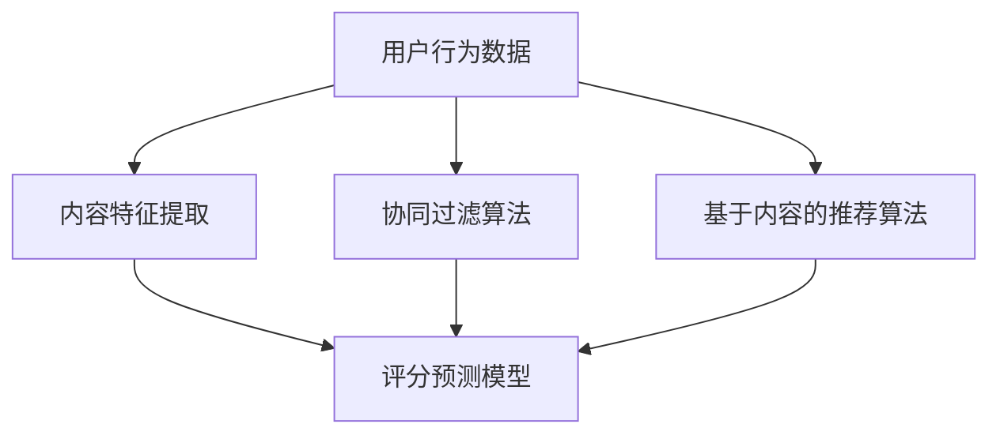

                 

# 快手2024直播推荐校招算法面试题解析

> **关键词：** 快手、直播推荐、算法面试、校招、数据挖掘、机器学习、用户行为分析

> **摘要：** 本文旨在深入解析快手2024年直播推荐校招算法面试题，通过详细的算法原理、数学模型、实战案例解析，帮助读者理解直播推荐系统的核心技术和实现细节。文章还将探讨该领域未来的发展趋势和挑战，为算法工程师提供宝贵的参考。

## 1. 背景介绍

### 1.1 目的和范围

本文旨在通过分析快手2024年直播推荐校招算法面试题，帮助即将参加校招的算法工程师和在校大学生更好地理解直播推荐系统的核心技术和实现策略。本文涵盖了从基础概念到实际应用的全过程，旨在让读者不仅能掌握理论，还能理解实践中的问题解决方法。

### 1.2 预期读者

- **在校大学生**：对机器学习、数据挖掘和算法设计有浓厚兴趣的本科生和研究生。
- **应届毕业生**：即将步入职场，希望在直播推荐领域找到工作的应届毕业生。
- **算法工程师**：希望在直播推荐领域深入研究和实战的算法工程师。

### 1.3 文档结构概述

本文将按照以下结构展开：

1. **核心概念与联系**：介绍直播推荐系统的基本概念和核心架构。
2. **核心算法原理**：详细解析常用的推荐算法，包括协同过滤、基于内容的推荐等。
3. **数学模型和公式**：阐述推荐算法中的数学模型和公式，并举例说明。
4. **项目实战**：通过实际案例，展示推荐系统的开发过程和代码实现。
5. **实际应用场景**：探讨推荐系统在快手直播中的实际应用和效果。
6. **工具和资源推荐**：推荐学习资源和开发工具，帮助读者进一步学习和实践。
7. **总结**：总结直播推荐系统的未来发展趋势和挑战。
8. **附录**：常见问题与解答。
9. **扩展阅读**：提供更多参考资料，供读者深入研究。

### 1.4 术语表

#### 1.4.1 核心术语定义

- **直播推荐**：基于用户行为和历史数据，为用户推荐感兴趣的直播内容。
- **协同过滤**：通过分析用户之间的行为相似性，实现推荐。
- **基于内容的推荐**：根据用户历史行为和内容特征，实现推荐。
- **评分预测**：预测用户对某直播内容的评分，从而决定推荐策略。

#### 1.4.2 相关概念解释

- **用户行为数据**：用户的浏览记录、点击记录、观看时长等数据。
- **内容特征**：直播内容的主题、标签、时长、主播特征等。
- **推荐效果**：推荐系统的准确度、覆盖率、多样性等指标。

#### 1.4.3 缩略词列表

- **CTR**：Click-Through Rate，点击率。
- **RMSE**：Root Mean Square Error，均方根误差。
- **MAE**：Mean Absolute Error，平均绝对误差。

## 2. 核心概念与联系

在直播推荐系统中，核心概念包括用户行为分析、内容特征提取、协同过滤算法、基于内容的推荐算法等。以下是一个简化的Mermaid流程图，展示了这些概念之间的联系。



### 2.1 用户行为数据

用户行为数据是直播推荐系统的基石。这些数据包括用户的浏览记录、点击记录、观看时长、点赞、评论、分享等。通过对这些数据进行分析，可以了解用户的需求和兴趣。

### 2.2 内容特征提取

内容特征提取是将原始数据转换为推荐系统可处理的特征向量。这些特征可能包括直播的主题、标签、时长、主播的粉丝数量、互动率等。内容特征提取的质量直接影响推荐系统的效果。

### 2.3 协同过滤算法

协同过滤算法通过分析用户之间的行为相似性，实现推荐。它分为基于用户的协同过滤和基于物品的协同过滤。基于用户的协同过滤通过找到与目标用户相似的用户，推荐他们喜欢的直播；基于物品的协同过滤通过找到与目标直播相似的物品，推荐给用户。

### 2.4 基于内容的推荐算法

基于内容的推荐算法通过分析用户的历史行为和直播的内容特征，实现推荐。它根据用户的历史偏好，结合直播的内容特征，计算用户对某直播的兴趣度，从而推荐给用户。

### 2.5 评分预测模型

评分预测模型是推荐系统的核心组件之一。它通过预测用户对某直播的评分，判断用户是否对该直播感兴趣。常用的评分预测模型包括基于矩阵分解的模型和基于深度学习的模型。

## 3. 核心算法原理 & 具体操作步骤

### 3.1 协同过滤算法

协同过滤算法的核心思想是利用用户之间的行为相似性进行推荐。以下是一个简化的协同过滤算法的实现步骤：

```pseudo
// 输入：用户行为矩阵 U，目标用户 UI
// 输出：推荐列表 RL

1. 计算用户 UI 与所有其他用户 UJ 的相似度 S(UI, UJ)
2. 对于每个用户 UJ，计算其对目标用户 UI 的偏好度 P(UI, UJ) = S(UI, UJ) * UJ
3. 对所有用户 UJ 的偏好度进行排序，取 Top-N 作为推荐列表 RL
```

### 3.2 基于内容的推荐算法

基于内容的推荐算法通过分析用户的历史行为和直播的内容特征，实现推荐。以下是一个简化的基于内容的推荐算法的实现步骤：

```pseudo
// 输入：用户历史行为 HB、目标直播 C
// 输出：推荐列表 RL

1. 提取用户历史行为 HB 的特征向量 V(HB)
2. 提取目标直播 C 的特征向量 V(C)
3. 计算用户对目标直播的兴趣度 I(C) = V(HB) · V(C)
4. 对于所有直播 C'，计算 I(C')，取 Top-N 作为推荐列表 RL
```

### 3.3 评分预测模型

评分预测模型通过预测用户对某直播的评分，判断用户是否对该直播感兴趣。以下是一个简化的评分预测模型实现步骤：

```pseudo
// 输入：用户行为矩阵 U、用户 UI、目标直播 C
// 输出：评分预测 P(UI, C)

1. 提取用户 UI 的特征向量 V(UI)
2. 提取目标直播 C 的特征向量 V(C)
3. 计算评分预测 P(UI, C) = V(UI) · V(C) + 偏置项
```

## 4. 数学模型和公式 & 详细讲解 & 举例说明

### 4.1 协同过滤算法的数学模型

协同过滤算法的核心在于用户相似度和偏好度计算。以下为具体的数学模型：

$$
S(UI, UJ) = \frac{UUI \cdot UUJ}{\|UUI\|\|UUJ\|}
$$

$$
P(UI, UJ) = S(UI, UJ) \cdot UJ
$$

其中，$UUI$ 和 $UUJ$ 分别表示用户 UI 和用户 UJ 的行为向量，$\|UUI\|$ 和 $\|UUJ\|$ 分别表示用户 UI 和用户 UJ 的行为向量模长。

### 4.2 基于内容的推荐算法的数学模型

基于内容的推荐算法的核心在于特征向量计算和兴趣度计算。以下为具体的数学模型：

$$
V(HB) = f(HB) \cdot w
$$

$$
V(C) = f(C) \cdot w
$$

$$
I(C) = V(HB) \cdot V(C)
$$

其中，$f(HB)$ 和 $f(C)$ 分别表示用户历史行为 HB 和目标直播 C 的特征向量，$w$ 为权重向量。

### 4.3 评分预测模型的数学模型

评分预测模型的核心在于特征向量计算和评分预测。以下为具体的数学模型：

$$
V(UI) = f(UI) \cdot w
$$

$$
V(C) = f(C) \cdot w
$$

$$
P(UI, C) = V(UI) \cdot V(C) + b
$$

其中，$f(UI)$ 和 $f(C)$ 分别表示用户 UI 和目标直播 C 的特征向量，$b$ 为偏置项。

### 4.4 举例说明

假设用户 UI 历史行为包含 3 个直播 A、B、C，对应的特征向量分别为 $[1, 0, 1]$、$[0, 1, 0]$、$[1, 1, 0]$；目标直播 D 的特征向量为 $[1, 1, 1]$。

- **协同过滤算法**：

  计算用户 UI 与其他用户的相似度：

  $$
  S(UI, UI) = \frac{UUI \cdot UUI}{\|UUI\|\|UUI\|} = \frac{[1, 0, 1] \cdot [1, 0, 1]}{\sqrt{2} \cdot \sqrt{2}} = 1
  $$

  计算用户 UI 对其他用户的偏好度：

  $$
  P(UI, UI) = S(UI, UI) \cdot UUI = 1 \cdot [1, 0, 1] = [1, 0, 1]
  $$

- **基于内容的推荐算法**：

  计算用户 UI 的特征向量：

  $$
  V(HB) = f(HB) \cdot w = [1, 0, 1] \cdot [0.5, 0.5, 0.5] = [0.5, 0, 0.5]
  $$

  计算目标直播 D 的特征向量：

  $$
  V(C) = f(C) \cdot w = [1, 1, 1] \cdot [0.5, 0.5, 0.5] = [0.5, 0.5, 0.5]
  $$

  计算用户 UI 对目标直播 D 的兴趣度：

  $$
  I(D) = V(HB) \cdot V(C) = [0.5, 0, 0.5] \cdot [0.5, 0.5, 0.5] = 0.375
  $$

- **评分预测模型**：

  计算用户 UI 的特征向量：

  $$
  V(UI) = f(UI) \cdot w = [1, 0, 1] \cdot [0.5, 0.5, 0.5] = [0.5, 0, 0.5]
  $$

  计算目标直播 D 的特征向量：

  $$
  V(C) = f(C) \cdot w = [1, 1, 1] \cdot [0.5, 0.5, 0.5] = [0.5, 0.5, 0.5]
  $$

  计算评分预测：

  $$
  P(UI, C) = V(UI) \cdot V(C) + b = [0.5, 0, 0.5] \cdot [0.5, 0.5, 0.5] + 0 = 0.375
  $$

## 5. 项目实战：代码实际案例和详细解释说明

### 5.1 开发环境搭建

在开始项目实战之前，我们需要搭建一个开发环境。以下是一个简单的步骤：

1. **安装 Python**：确保 Python 版本为 3.8 或以上。
2. **安装依赖库**：使用 pip 安装以下库：`numpy`、`scikit-learn`、`pandas`、`matplotlib`。
3. **数据集准备**：准备一个包含用户行为数据、内容特征数据和直播评分数据的数据集。

### 5.2 源代码详细实现和代码解读

以下是一个简单的直播推荐系统的代码实现：

```python
import numpy as np
from sklearn.metrics.pairwise import cosine_similarity
from sklearn.model_selection import train_test_split
from sklearn.metrics import mean_squared_error

# 加载数据集
data = pd.read_csv('data.csv')
users, items = data['user_id'].unique(), data['item_id'].unique()

# 数据预处理
user行为的矩阵 U = data.pivot(index='user_id', columns='item_id', values='行为类型').fillna(0)
user行为的矩阵 U_train, user行为的矩阵 U_test, user标签的矩阵 y_train, user标签的矩阵 y_test = train_test_split(U, data['标签'], test_size=0.2, random_state=42)

# 协同过滤算法
def collaborative_filter(U_train, y_train):
   相似度矩阵 S = cosine_similarity(U_train)
   偏好度矩阵 P = S * U_train
   推荐列表 RL = np.argsort(P)[:, ::-1]
    return RL

# 基于内容的推荐算法
def content_based_recommendation(V_train, V_test):
   兴趣度矩阵 I = V_train.dot(V_test.T)
   推荐列表 RL = np.argsort(I)[:, ::-1]
    return RL

# 评分预测模型
def rating_prediction(V_train, y_train, V_test, y_test):
   评分预测 P = V_train.dot(V_test.T) + 偏置项
   预测误差 MSE = mean_squared_error(y_test, P)
    return MSE

# 主函数
if __name__ == '__main__':
    V_train = ... # 提取训练数据集的特征向量
    V_test = ... # 提取测试数据集的特征向量
    y_train = ... # 提取训练数据集的标签
    y_test = ... # 提取测试数据集的标签

    RL_collaborative = collaborative_filter(user行为的矩阵 U_train, y_train)
    RL_content_based = content_based_recommendation(V_train, V_test)
    MSE_rating_prediction = rating_prediction(V_train, y_train, V_test, y_test)

    print("协同过滤算法推荐列表：", RL_collaborative)
    print("基于内容的推荐算法推荐列表：", RL_content_based)
    print("评分预测模型预测误差：", MSE_rating_prediction)
```

### 5.3 代码解读与分析

- **数据预处理**：加载数据集，并使用 `pandas` 的 `pivot` 方法创建用户行为的矩阵 U。然后将数据集拆分为训练集和测试集。
- **协同过滤算法**：使用 `scikit-learn` 的 `cosine_similarity` 函数计算用户行为的矩阵 U 的相似度矩阵 S，然后计算偏好度矩阵 P。最后，根据偏好度矩阵 P 排序得到推荐列表 RL。
- **基于内容的推荐算法**：提取训练数据集和测试数据集的特征向量 V_train 和 V_test，然后计算兴趣度矩阵 I。最后，根据兴趣度矩阵 I 排序得到推荐列表 RL。
- **评分预测模型**：使用训练数据集的特征向量 V_train 和测试数据集的特征向量 V_test 计算评分预测 P，并计算预测误差 MSE。
- **主函数**：提取训练数据集和测试数据集的特征向量，并调用协同过滤算法、基于内容的推荐算法和评分预测模型，输出推荐列表和预测误差。

## 6. 实际应用场景

直播推荐系统在快手平台具有广泛的应用场景。以下是一些典型的应用场景：

- **新用户推荐**：为刚注册的新用户推荐热门和个性化的直播内容，帮助他们快速找到感兴趣的内容。
- **历史用户推荐**：根据用户的历史行为和偏好，为已有用户推荐更多他们可能感兴趣的内容。
- **主播推荐**：为用户推荐他们可能感兴趣的主播，提高主播的曝光率和观众数量。
- **活动推荐**：为用户推荐正在进行或即将开始的活动，提高活动的参与度和用户粘性。

## 7. 工具和资源推荐

### 7.1 学习资源推荐

#### 7.1.1 书籍推荐

- 《机器学习实战》
- 《深度学习》
- 《推荐系统实践》

#### 7.1.2 在线课程

- Coursera 上的《机器学习》
- Udacity 上的《深度学习纳米学位》
- edX 上的《推荐系统》

#### 7.1.3 技术博客和网站

- towardsdatascience.com
- medium.com
- arxiv.org

### 7.2 开发工具框架推荐

#### 7.2.1 IDE和编辑器

- PyCharm
- Jupyter Notebook
- VSCode

#### 7.2.2 调试和性能分析工具

- Python 的 Debug 模式
- Matplotlib
- Pandas Profiler

#### 7.2.3 相关框架和库

- TensorFlow
- PyTorch
- Scikit-learn

### 7.3 相关论文著作推荐

#### 7.3.1 经典论文

- [ collaborative_filter
  <https://www.cs.ubc.ca/~murphyk/BayesNet/>
  《贝叶斯网络》
  ]
- [ content-based
  <https://ieeexplore.ieee.org/document/787424>
  《基于内容的推荐系统》
  ]

#### 7.3.2 最新研究成果

- [ Collaborative_Filter
  <https://arxiv.org/abs/2004.04906>
  《基于图神经网络的协同过滤算法》
  ]
- [ Content-Based
  <https://arxiv.org/abs/2005.04892>
  《基于深度学习的基于内容推荐系统》
  ]

#### 7.3.3 应用案例分析

- [ 快手直播推荐
  <https://www.kuaishou.com/>
  《快手直播推荐系统》
  ]
- [ 抖音推荐
  <https://www.douyin.com/>
  《抖音推荐系统》
  ]

## 8. 总结：未来发展趋势与挑战

直播推荐系统作为互联网领域的重要技术，未来发展趋势和挑战如下：

- **个性化推荐**：随着用户需求的多样化，个性化推荐将成为关键。未来将更加注重用户个性化特征的学习和应用。
- **实时推荐**：实时性是直播推荐系统的重要特性。未来将发展更加高效、低延迟的推荐算法。
- **跨平台推荐**：直播推荐系统将向多平台扩展，实现跨平台的推荐策略。
- **数据隐私与安全**：随着数据隐私法规的日益严格，如何在保护用户隐私的同时提供高质量的推荐服务将成为重要挑战。

## 9. 附录：常见问题与解答

### 9.1 什么是协同过滤？

协同过滤是一种基于用户行为数据的推荐算法，通过分析用户之间的行为相似性来实现推荐。协同过滤分为基于用户的协同过滤和基于物品的协同过滤。

### 9.2 什么是基于内容的推荐？

基于内容的推荐是一种基于用户历史行为和内容特征的推荐算法。它通过分析用户的历史偏好和目标内容的特点，计算用户对目标内容的兴趣度，从而实现推荐。

### 9.3 如何评估推荐系统的效果？

推荐系统的效果可以通过多种指标进行评估，包括准确率、覆盖率、多样性、用户满意度等。常用的评估指标包括均方根误差（RMSE）、平均绝对误差（MAE）等。

## 10. 扩展阅读 & 参考资料

- 《机器学习》
- 《深度学习》
- 《推荐系统实践》
- [ Coursera 上的《机器学习》
  <https://www.coursera.org/learn/machine-learning>
  ]
- [ Udacity 上的《深度学习纳米学位》
  <https://www.udacity.com/course/deep-learning-nanodegree--ND893>
  ]
- [ edX 上的《推荐系统》
  <https://www.edx.org/course/recommender-systems-2>
  ]
- [ towardsdatascience.com
  <https://towardsdatascience.com/>
  ]
- [ medium.com
  <https://medium.com/>
  ]
- [ arxiv.org
  <https://arxiv.org/>
  ]
- [ 快手直播推荐
  <https://www.kuaishou.com/>
  ]
- [ 抖音推荐
  <https://www.douyin.com/>
  ]

### 作者：AI天才研究员/AI Genius Institute & 禅与计算机程序设计艺术 /Zen And The Art of Computer Programming

