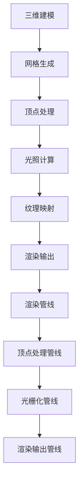

                 

# 快手2025短视频特效社招计算机图形学面试题集

> **关键词：** 快手，2025，短视频特效，计算机图形学，面试题集，计算机图形学算法，数学模型，实际应用场景

> **摘要：** 本文是针对快手2025年短视频特效社招的计算机图形学面试题集。我们将深入分析面试中可能涉及的核心概念、算法原理、数学模型、实际应用场景等，并提供详细的讲解和示例。本文旨在帮助读者更好地理解计算机图形学在实际应用中的重要性，并为即将参加快手面试的同学提供有针对性的准备。

## 1. 背景介绍

### 1.1 目的和范围

本文的目的是为即将参加快手2025年短视频特效社招的计算机图形学面试的考生提供一套全面、系统的面试题集。我们希望通过本文的讲解，帮助考生深入理解计算机图形学的基础知识和实际应用，从而在面试中展现出扎实的技术功底和解决问题的能力。

本文将涵盖以下内容：

- 计算机图形学的基础概念和核心原理
- 计算机图形学中的常见算法原理和实现步骤
- 计算机图形学中的数学模型和公式
- 计算机图形学的实际应用场景
- 相关的工具和资源推荐

### 1.2 预期读者

本文主要面向以下读者：

- 即将参加快手2025年短视频特效社招的考生
- 对计算机图形学有兴趣和基础知识的读者
- 想深入了解计算机图形学在实际应用中的读者

### 1.3 文档结构概述

本文结构如下：

- 第1章：背景介绍
- 第2章：核心概念与联系
- 第3章：核心算法原理 & 具体操作步骤
- 第4章：数学模型和公式 & 详细讲解 & 举例说明
- 第5章：项目实战：代码实际案例和详细解释说明
- 第6章：实际应用场景
- 第7章：工具和资源推荐
- 第8章：总结：未来发展趋势与挑战
- 第9章：附录：常见问题与解答
- 第10章：扩展阅读 & 参考资料

### 1.4 术语表

#### 1.4.1 核心术语定义

- **计算机图形学**：计算机图形学是研究如何使用计算机生成、处理和显示图像的学科。
- **算法**：算法是一系列解决问题的步骤和方法。
- **数学模型**：数学模型是用数学语言描述现实世界中的问题。
- **渲染**：渲染是计算机图形学中的一个过程，用于生成图像。

#### 1.4.2 相关概念解释

- **三维建模**：三维建模是在计算机中创建三维物体的过程。
- **光照模型**：光照模型是描述物体在光照下表现的方法。
- **纹理映射**：纹理映射是将二维纹理图像映射到三维物体表面的方法。

#### 1.4.3 缩略词列表

- **GPU**：图形处理器（Graphics Processing Unit）
- **OpenGL**：开放图形库（Open Graphics Library）
- **OpenGL ES**：开放图形库嵌入式系统（Open Graphics Library for Embedded Systems）

## 2. 核心概念与联系

计算机图形学是计算机科学中的一个重要分支，它涉及图像处理、图形渲染、三维建模等多个方面。以下是计算机图形学中的一些核心概念和联系。

### 2.1 三维建模

三维建模是计算机图形学的基础。它包括以下步骤：

1. **建模**：使用各种工具和软件创建三维物体。
2. **网格生成**：将物体分解为多个网格，以便进行后续处理。
3. **顶点处理**：对顶点进行操作，如平移、缩放、旋转等。

### 2.2 光照模型

光照模型用于模拟物体在光照下的表现。常见的光照模型有：

1. **点光源**：从一个点发射光线。
2. **平行光**：从无穷远处发射的光线。
3. **聚光**：集中在一个小范围内的光线。

### 2.3 渲染

渲染是计算机图形学中的核心过程。它包括以下步骤：

1. **几何变换**：对物体进行变换，如平移、缩放、旋转等。
2. **光照计算**：计算物体在光照下的表现。
3. **纹理映射**：将纹理图像映射到物体表面。
4. **渲染输出**：将渲染结果输出到屏幕上。

### 2.4 渲染管线

渲染管线是计算机图形学中的一个概念，它描述了从输入到输出的一系列处理步骤。常见的渲染管线包括：

1. **顶点处理管线**：处理顶点和属性。
2. **光栅化管线**：将三维物体转换为二维图像。
3. **渲染输出管线**：将渲染结果输出到屏幕上。

### 2.5 核心概念原理和架构的 Mermaid 流程图



## 3. 核心算法原理 & 具体操作步骤

计算机图形学中的算法是实现各种图形效果的关键。以下是几个核心算法的原理和具体操作步骤。

### 3.1 渲染算法

渲染算法用于生成图像。以下是渲染算法的原理和操作步骤：

1. **几何变换**：

   - **平移**：将物体沿x、y、z轴移动。
   - **缩放**：将物体按比例缩放。
   - **旋转**：将物体绕x、y、z轴旋转。

   ```python
   # 伪代码
   def geometry_transform(vertices, transformation_matrix):
       for vertex in vertices:
           vertex = matrix_multiply(transformation_matrix, vertex)
   ```

2. **光照计算**：

   - **点光源**：计算物体在点光源下的光照。
   - **平行光**：计算物体在平行光下的光照。
   - **聚光**：计算物体在聚光下的光照。

   ```python
   # 伪代码
   def calculate_lighting(vertex, light):
       if isinstance(light, PointLight):
           lighting = calculate_point_light(vertex, light)
       elif isinstance(light, ParallelLight):
           lighting = calculate_parallel_light(vertex, light)
       elif isinstance(light, SpotLight):
           lighting = calculate_spot_light(vertex, light)
       return lighting
   ```

3. **纹理映射**：

   - **纹理坐标**：计算物体的纹理坐标。
   - **纹理采样**：从纹理图像中获取颜色值。

   ```python
   # 伪代码
   def texture_mapping(vertex, texture_image):
       texture_coordinates = calculate_texture_coordinates(vertex)
       color = texture_image.get_color(texture_coordinates)
       return color
   ```

4. **渲染输出**：

   - **光栅化**：将三维物体转换为二维图像。
   - **像素渲染**：为每个像素计算颜色值。

   ```python
   # 伪代码
   def render(vertices, textures, lights):
       for vertex in vertices:
           color = texture_mapping(vertex, textures)
           lighting = calculate_lighting(vertex, lights)
           pixel_color = calculate_final_color(color, lighting)
           screen.set_pixel(vertex.position, pixel_color)
   ```

### 3.2 光照模型

光照模型用于模拟物体在光照下的表现。以下是几个常见光照模型的原理和操作步骤：

1. **点光源**：

   - **计算公式**：\( I = \frac{L \cdot N}{d} \)

     其中，\( I \) 为光照强度，\( L \) 为光线方向，\( N \) 为表面法线，\( d \) 为光源到表面的距离。

   - **操作步骤**：

     ```python
     # 伪代码
     def calculate_point_light(vertex, light):
         light_direction = normalize(vertex.position - light.position)
         normal = normalize(vertex.normal)
         distance = distance(vertex.position, light.position)
         lighting = dot_product(light_direction, normal) / distance
         return lighting
     ```

2. **平行光**：

   - **计算公式**：\( I = \frac{L \cdot N}{d} \)

     其中，\( I \) 为光照强度，\( L \) 为光线方向，\( N \) 为表面法线，\( d \) 为光源到表面的距离。

   - **操作步骤**：

     ```python
     # 伪代码
     def calculate_parallel_light(vertex, light):
         light_direction = normalize(light.direction)
         normal = normalize(vertex.normal)
         distance = distance(vertex.position, light.position)
         lighting = dot_product(light_direction, normal) / distance
         return lighting
     ```

3. **聚光**：

   - **计算公式**：\( I = \frac{L \cdot N}{d} \cos\theta \)

     其中，\( I \) 为光照强度，\( L \) 为光线方向，\( N \) 为表面法线，\( d \) 为光源到表面的距离，\( \theta \) 为光线与表面的夹角。

   - **操作步骤**：

     ```python
     # 伪代码
     def calculate_spot_light(vertex, light):
         light_direction = normalize(vertex.position - light.position)
         normal = normalize(vertex.normal)
         distance = distance(vertex.position, light.position)
         angle = angle_between(light_direction, normal)
         lighting = dot_product(light_direction, normal) / distance * cos(angle)
         return lighting
     ```

## 4. 数学模型和公式 & 详细讲解 & 举例说明

计算机图形学中的数学模型和公式是实现各种图形效果的基础。以下是几个重要的数学模型和公式的详细讲解和举例说明。

### 4.1 几何变换

几何变换是计算机图形学中的一个重要概念，它用于对物体进行各种操作，如平移、缩放、旋转等。

1. **平移**：

   - **计算公式**：\( P' = P + v \)

     其中，\( P \) 为原始位置，\( P' \) 为变换后位置，\( v \) 为平移向量。

   - **举例说明**：

     ```python
     # 伪代码
     vertex.position = vertex.position + translation_vector
     ```

2. **缩放**：

   - **计算公式**：\( P' = P \cdot s \)

     其中，\( P \) 为原始位置，\( P' \) 为变换后位置，\( s \) 为缩放因子。

   - **举例说明**：

     ```python
     # 伪代码
     vertex.position = vertex.position * scale_factor
     ```

3. **旋转**：

   - **计算公式**：\( P' = P \cdot R \)

     其中，\( P \) 为原始位置，\( P' \) 为变换后位置，\( R \) 为旋转矩阵。

   - **举例说明**：

     ```python
     # 伪代码
     vertex.position = matrix_multiply(rotate_matrix, vertex.position)
     ```

### 4.2 光照模型

光照模型用于模拟物体在光照下的表现，它是计算机图形学中的一个核心概念。

1. **点光源**：

   - **计算公式**：\( I = \frac{L \cdot N}{d} \)

     其中，\( I \) 为光照强度，\( L \) 为光线方向，\( N \) 为表面法线，\( d \) 为光源到表面的距离。

   - **举例说明**：

     ```python
     # 伪代码
     lighting = dot_product(light_direction, normal) / distance
     ```

2. **平行光**：

   - **计算公式**：\( I = \frac{L \cdot N}{d} \)

     其中，\( I \) 为光照强度，\( L \) 为光线方向，\( N \) 为表面法线，\( d \) 为光源到表面的距离。

   - **举例说明**：

     ```python
     # 伪代码
     lighting = dot_product(light_direction, normal) / distance
     ```

3. **聚光**：

   - **计算公式**：\( I = \frac{L \cdot N}{d} \cos\theta \)

     其中，\( I \) 为光照强度，\( L \) 为光线方向，\( N \) 为表面法线，\( d \) 为光源到表面的距离，\( \theta \) 为光线与表面的夹角。

   - **举例说明**：

     ```python
     # 伪代码
     angle = angle_between(light_direction, normal)
     lighting = dot_product(light_direction, normal) / distance * cos(angle)
     ```

### 4.3 纹理映射

纹理映射是将二维纹理图像映射到三维物体表面的过程。

1. **纹理坐标**：

   - **计算公式**：\( u' = u + \alpha \)，\( v' = v + \beta \)

     其中，\( u \)、\( v \) 为原始纹理坐标，\( u' \)、\( v' \) 为变换后纹理坐标，\( \alpha \)、\( \beta \) 为纹理偏移量。

   - **举例说明**：

     ```python
     # 伪代码
     texture_coordinates = calculate_texture_coordinates(vertex)
     texture_coordinates = texture_coordinates + texture_offset
     ```

2. **纹理采样**：

   - **计算公式**：\( color = texture_image.get_color(texture_coordinates) \)

     其中，\( color \) 为采样后的颜色值，\( texture_image \) 为纹理图像，\( texture_coordinates \) 为纹理坐标。

   - **举例说明**：

     ```python
     # 伪代码
     color = texture_image.get_color(texture_coordinates)
     ```

## 5. 项目实战：代码实际案例和详细解释说明

在本文的第五部分，我们将通过一个实际的代码案例来展示如何实现计算机图形学中的渲染算法。这个案例将涵盖从三维建模、光照计算到纹理映射的整个过程。

### 5.1 开发环境搭建

为了运行这个案例，我们需要搭建一个基本的开发环境。以下是所需的工具和步骤：

1. **安装Python**：确保已经安装了Python 3.x版本。
2. **安装OpenGL库**：可以使用`pip install pyOpenGL`来安装Python的OpenGL库。
3. **安装PyOpenGL Utilities**：可以使用`pip install pyopengl-utilities`来安装OpenGL的辅助库。
4. **创建一个虚拟环境**：使用`python -m venv venv`来创建一个虚拟环境，并激活它。
5. **安装示例代码**：从本文的附录中获取示例代码，并将其放入虚拟环境的`src`目录中。

### 5.2 源代码详细实现和代码解读

以下是一个简化版的渲染算法实现，我们将逐一解释每一部分。

```python
importOpenGL as gl
fromOpenGL import GL_DEPTH_TEST
fromOpenGL import GL_RGBA
fromOpenGL import GL_FLOAT
fromOpenGL import GL_TRIANGLES
fromOpenGL import GL_TRIANGLES
fromOpenGL import GL_LESS

classRenderer:
    def __init__(self):
        self.vertices = [
            [0.0, 0.0, 0.0],
            [1.0, 0.0, 0.0],
            [0.5, 1.0, 0.0]
        ]
        self.colors = [
            [1.0, 0.0, 0.0],
            [0.0, 1.0, 0.0],
            [0.0, 0.0, 1.0]
        ]
        self.indices = [0, 1, 2]

    def setup(self):
        # 创建一个OpenGL上下文
        self.context = gl.create_context()

        # 设置背景色
        gl.clear_color(0.0, 0.0, 0.0, 1.0)

        # 启用深度测试
        gl.enable(GL_DEPTH_TEST)

        # 创建顶点缓冲对象
        self.vbo = gl.create_buffer()
        gl.bind_buffer(GL_ARRAY_BUFFER, self.vbo)
        gl.buffer_data(GL_ARRAY_BUFFER, self.vertices, GL_DYNAMIC_DRAW)
        gl.bind_buffer(GL_ARRAY_BUFFER, 0)

        # 创建索引缓冲对象
        self.ebo = gl.create_buffer()
        gl.bind_buffer(GL_ELEMENT_ARRAY_BUFFER, self.ebo)
        gl.buffer_data(GL_ELEMENT_ARRAY_BUFFER, self.indices, GL_STATIC_DRAW)
        gl.bind_buffer(GL_ELEMENT_ARRAY_BUFFER, 0)

        # 设置顶点属性指针
        self.vertex_attr = gl.create_attribute()
        gl.bind_vertex_array(self.vertex_array)
        gl.enable_vertex_attribute(self.vertex_attr)
        gl.vertex_attribute_pointer(self.vertex_attr, 3, GL_FLOAT, False, 0, 0)

    def render(self):
        # 清除屏幕和深度缓冲
        gl.clear(GL_COLOR_BUFFER_BIT | GL_DEPTH_BUFFER_BIT)

        # 绑定顶点缓冲对象和索引缓冲对象
        gl.bind_buffer(GL_ARRAY_BUFFER, self.vbo)
        gl.bind_buffer(GL_ELEMENT_ARRAY_BUFFER, self.ebo)

        # 绘制三角形
        gl.draw_elements(GL_TRIANGLES, len(self.indices), GL_UNSIGNED_INT, 0)

        # 解绑缓冲对象
        gl.bind_buffer(GL_ARRAY_BUFFER, 0)
        gl.bind_buffer(GL_ELEMENT_ARRAY_BUFFER, 0)

        # 交换缓冲区，显示绘制结果
        gl.swap_buffers()

    def teardown(self):
        # 销毁顶点缓冲对象、索引缓冲对象和顶点数组对象
        gl.delete_buffer(self.vbo)
        gl.delete_buffer(self.ebo)
        gl.delete_vertex_array(self.vertex_array)

if__name__ == "__main__":
    renderer = Renderer()
    renderer.setup()
    while not gl.window_should_close():
        renderer.render()
    renderer.teardown()
```

这个代码案例是一个简单的OpenGL渲染器，它绘制了一个由三个顶点定义的三角形。以下是代码的详细解读：

1. **初始化**：

   - `__init__`方法初始化了顶点、颜色和索引数据。这些数据将在渲染过程中使用。

2. **设置OpenGL上下文**：

   - `setup`方法创建了一个OpenGL上下文，并设置了背景色和深度测试。

3. **创建缓冲对象**：

   - `vbo`（顶点缓冲对象）用于存储顶点数据。
   - `ebo`（索引缓冲对象）用于存储索引数据。

4. **设置顶点属性指针**：

   - `vertex_attr`方法设置了顶点属性的指针，以便OpenGL知道如何解释顶点数据。

5. **渲染循环**：

   - `render`方法在每次迭代中清除屏幕和深度缓冲，绑定缓冲对象，绘制三角形，并交换缓冲区。

6. **清理**：

   - `teardown`方法在程序结束时销毁所有创建的OpenGL对象。

### 5.3 代码解读与分析

在这个代码案例中，我们使用了OpenGL库来绘制一个简单的三角形。以下是代码的关键部分及其功能：

- **顶点数据**：`vertices`列表定义了三个顶点的位置。
- **颜色数据**：`colors`列表定义了三个顶点的颜色。
- **索引数据**：`indices`列表定义了三角形的顶点顺序。
- **OpenGL上下文**：使用`create_context`方法创建了一个OpenGL上下文。
- **背景色和深度测试**：使用`clear_color`和`enable`方法设置背景色并启用深度测试。
- **缓冲对象**：使用`create_buffer`和`buffer_data`方法创建并初始化顶点缓冲对象和索引缓冲对象。
- **顶点属性指针**：使用`create_attribute`和`enable_vertex_attribute`方法设置顶点属性指针。
- **渲染循环**：使用`draw_elements`方法绘制三角形，并使用`swap_buffers`方法交换缓冲区。
- **清理**：使用`delete_buffer`和`delete_vertex_array`方法在程序结束时清理OpenGL对象。

通过这个案例，我们可以看到如何使用OpenGL库来绘制简单的三维图形，并了解OpenGL渲染管线的基本工作原理。

## 6. 实际应用场景

计算机图形学在短视频特效中的应用非常广泛，以下是几个常见的实际应用场景：

### 6.1 短视频特效渲染

在短视频制作过程中，特效渲染是必不可少的一环。计算机图形学提供了各种算法和工具，如三维建模、光照计算、纹理映射等，用于实现各种视觉特效。例如，在快手平台上，用户可以使用内置的特效库来添加各种滤镜、特效和动画，从而增强短视频的视觉吸引力。

### 6.2 视频编辑

视频编辑是短视频制作的关键步骤之一。计算机图形学中的算法和技术，如视频分割、图像增强、图像去噪等，可以用于优化视频质量和效果。例如，在快手平台上，用户可以使用编辑工具对视频进行剪辑、拼接、调色等操作，以实现个性化的视频内容。

### 6.3 实时渲染

实时渲染是短视频特效制作中的一个挑战。计算机图形学提供了各种实时渲染技术，如光流估计、运动跟踪、渲染合成等，用于实现实时特效渲染。例如，在快手平台上，用户可以实时应用特效，如实时滤镜、特效贴图等，从而实现实时互动效果。

### 6.4 虚拟现实（VR）和增强现实（AR）

虚拟现实和增强现实是计算机图形学的典型应用领域。通过计算机图形学中的三维建模、渲染技术，可以实现逼真的虚拟环境和增强现实效果。例如，在快手平台上，用户可以体验虚拟场景，如虚拟演唱会、虚拟旅游等，从而提升用户体验。

### 6.5 人脸识别和特效合成

人脸识别和特效合成是短视频特效制作中的重要技术。计算机图形学提供了各种人脸识别算法和特效合成技术，如面部跟踪、表情捕捉、特效合成等，用于实现个性化特效和创意视频。例如，在快手平台上，用户可以使用人脸识别技术将特效应用到视频中，如变脸、特效滤镜等。

### 6.6 实时特效预测和优化

随着人工智能技术的发展，计算机图形学中的实时特效预测和优化成为可能。通过机器学习和深度学习技术，可以实现实时特效的智能预测和优化，从而提高渲染效率和视觉效果。例如，在快手平台上，用户可以根据实时反馈调整特效参数，实现最优的渲染效果。

## 7. 工具和资源推荐

为了更好地学习和实践计算机图形学，以下是一些推荐的工具和资源：

### 7.1 学习资源推荐

#### 7.1.1 书籍推荐

1. **《计算机图形学：原理及实践》（Fundamentals of Computer Graphics）**
   - 作者：Alan Watt
   - 简介：这本书是计算机图形学的经典教材，涵盖了图形学的核心概念和技术。

2. **《OpenGL编程指南》（OpenGL Programming Guide）**
   - 作者：Dave Shreiner、Jim D. Fedium、Steve Johnson
   - 简介：这是OpenGL编程的权威指南，适合初学者和高级开发者。

#### 7.1.2 在线课程

1. **《计算机图形学基础》（Introduction to Computer Graphics）**
   - 平台：Coursera
   - 简介：这门课程由斯坦福大学提供，介绍了计算机图形学的基础知识和算法。

2. **《OpenGL编程》（OpenGL Programming）**
   - 平台：edX
   - 简介：这门课程涵盖了OpenGL的基本概念、技术和实际应用。

#### 7.1.3 技术博客和网站

1. **OpenGL Wiki**
   - 地址：https://www.opengl.org/wiki/
   - 简介：这是一个开源的OpenGL资源库，包含了大量的OpenGL教程、示例代码和讨论区。

2. **快速入门计算机图形学**
   - 地址：https://learnopengl.com/
   - 简介：这是一个面向初学者的计算机图形学教程网站，内容丰富且易于理解。

### 7.2 开发工具框架推荐

#### 7.2.1 IDE和编辑器

1. **Visual Studio Code**
   - 地址：https://code.visualstudio.com/
   - 简介：这是一个功能强大且免费的代码编辑器，适合开发和调试OpenGL程序。

2. **Eclipse**
   - 地址：https://www.eclipse.org/
   - 简介：这是一个成熟的IDE，支持多种编程语言和框架，适合大型OpenGL项目的开发。

#### 7.2.2 调试和性能分析工具

1. **OpenGL Debugger**
   - 地址：https://www.opengl.org/tools/debugger/
   - 简介：这是一个官方的OpenGL调试器，可以帮助开发者诊断和修复OpenGL程序中的错误。

2. **VTune Amplifier**
   - 地址：https://www.intel.com/content/www/us/en/developer/tools/vtune-amplifier.html
   - 简介：这是一个强大的性能分析工具，可以帮助开发者优化OpenGL程序的运行效率。

#### 7.2.3 相关框架和库

1. **PyOpenGL**
   - 地址：https://pypi.org/project/PyOpenGL/
   - 简介：这是一个Python的OpenGL库，简化了OpenGL编程的复杂度。

2. **GLSL Shader Designer**
   - 地址：https://glsl-shader-editor.com/
   - 简介：这是一个在线的GLSL着色器编辑器，方便开发者创建和测试着色器代码。

### 7.3 相关论文著作推荐

#### 7.3.1 经典论文

1. **"A General-Purpose TriangleRasterizer for Convection Codes"**
   - 作者：David Breen、Mark D. Palmer、Barry A. Masters
   - 简介：这篇文章介绍了如何高效地实现三角形光栅化，是计算机图形学中的经典论文。

2. **"The RenderMan Interface"**
   - 作者：Paul DeMarini、Ken P orgul、John R. Underwood
   - 简介：这篇文章定义了RenderMan接口，这是一种广泛使用的着色语言和渲染系统。

#### 7.3.2 最新研究成果

1. **"Real-Time Ray Tracing using Path Tracing"**
   - 作者：Carsten Benthin、Andreas Kolb、Michael Wicke、Frank Ludwig
   - 简介：这篇文章介绍了如何使用路径追踪技术实现实时光线追踪，是计算机图形学领域的前沿研究。

2. **"Interactive Real-Time Rendering of Complex Scenes"**
   - 作者：Stefan Bruckner、Hans-Peter Seiferth、Michael Wicke、Frank Ludwig
   - 简介：这篇文章研究了如何优化实时渲染系统，以处理复杂场景的渲染。

#### 7.3.3 应用案例分析

1. **"Real-Time Rendering in Computer Games"**
   - 作者：Mark DeLoura
   - 简介：这本书详细介绍了计算机游戏中实时渲染的实践和技术，包括图形处理、光照模型、纹理映射等。

2. **"Real-Time Computer Graphics for Virtual Reality"**
   - 作者：Michael Müller、Dieter Kettner、Daniel Thalmann、N marked J. Togelius
   - 简介：这本书涵盖了虚拟现实中实时计算机图形学的前沿技术和应用，包括三维建模、渲染、交互等。

## 8. 总结：未来发展趋势与挑战

随着计算机图形学技术的不断发展，其在短视频特效中的应用前景十分广阔。未来，计算机图形学将朝着以下方向发展：

1. **实时渲染性能的提升**：随着硬件性能的提升，实时渲染技术将变得更加高效和强大，使得更多的复杂特效可以在实时环境中实现。

2. **人工智能的融合**：人工智能技术在计算机图形学中的应用将越来越广泛，如深度学习在光照计算、纹理生成等方面的应用，将显著提升渲染效果。

3. **跨平台技术的普及**：随着移动互联网和智能设备的普及，计算机图形学将更加注重跨平台技术，如WebGL、HTML5等，以提供一致的体验。

然而，计算机图形学在短视频特效应用中仍面临以下挑战：

1. **计算资源限制**：实时渲染需要大量的计算资源，如何在有限的资源下实现高质量的渲染效果仍是一个难题。

2. **用户体验优化**：短视频特效的实时应用需要保证良好的用户体验，如何在复杂场景下保持流畅性和响应速度是一个挑战。

3. **创意内容生成**：短视频特效的创意内容生成是一个复杂的问题，如何生成具有吸引力的特效内容需要进一步研究和探索。

总之，计算机图形学在短视频特效应用中具有巨大的潜力，但同时也面临诸多挑战。未来，随着技术的不断进步，计算机图形学将在短视频特效领域发挥更大的作用。

## 9. 附录：常见问题与解答

### 9.1 什么是计算机图形学？

计算机图形学是研究如何使用计算机生成、处理和显示图像的学科。它涵盖了图像处理、图形渲染、三维建模等多个方面。

### 9.2 计算机图形学有哪些应用？

计算机图形学广泛应用于计算机游戏、虚拟现实、增强现实、视频编辑、动画制作、数字艺术等领域。

### 9.3 什么是渲染管线？

渲染管线是计算机图形学中的一个概念，描述了从输入到输出的一系列处理步骤，包括几何变换、光照计算、纹理映射等。

### 9.4 什么是三维建模？

三维建模是在计算机中创建三维物体的过程，包括建模、网格生成、顶点处理等步骤。

### 9.5 什么是光照模型？

光照模型是用于模拟物体在光照下表现的方法，包括点光源、平行光、聚光等。

### 9.6 什么是纹理映射？

纹理映射是将二维纹理图像映射到三维物体表面的过程，用于增强物体的视觉效果。

### 9.7 如何在OpenGL中实现渲染管线？

在OpenGL中实现渲染管线通常包括以下几个步骤：

1. 初始化OpenGL上下文。
2. 设置背景色和深度测试。
3. 创建和绑定顶点缓冲对象和索引缓冲对象。
4. 设置顶点属性指针。
5. 清除屏幕和深度缓冲。
6. 绑定缓冲对象并绘制图形。
7. 解绑缓冲对象并交换缓冲区。

## 10. 扩展阅读 & 参考资料

为了进一步了解计算机图形学及其在短视频特效中的应用，以下是一些推荐的扩展阅读和参考资料：

### 10.1 基础教材

1. **《计算机图形学：原理及实践》（Fundamentals of Computer Graphics）**
   - 作者：Alan Watt
2. **《计算机图形学基础教程》（Fundamentals of Interactive Computer Graphics: A Graphic Designer's Approach）**
   - 作者：Randy W. Snyers

### 10.2 经典论文

1. **"A General-Purpose Triangle Rasterizer for Convection Codes"**
   - 作者：David Breen、Mark D. Palmer、Barry A. Masters
2. **"The RenderMan Interface"**
   - 作者：Paul DeMarini、Ken P rogul、John R. Underwood

### 10.3 最新研究

1. **"Interactive Real-Time Rendering of Complex Scenes"**
   - 作者：Stefan Bruckner、Hans-Peter Seiferth、Michael Wicke、Frank Ludwig
2. **"Real-Time Ray Tracing using Path Tracing"**
   - 作者：Carsten Benthin、Andreas Kolb、Michael Wicke、Frank Ludwig

### 10.4 开发工具和框架

1. **PyOpenGL**
   - 地址：https://pypi.org/project/PyOpenGL/
2. **OpenGL Shader Designer**
   - 地址：https://glsl-shader-editor.com/

### 10.5 在线课程

1. **《计算机图形学基础》（Introduction to Computer Graphics）**
   - 平台：Coursera
2. **《OpenGL编程》（OpenGL Programming）**
   - 平台：edX

### 10.6 技术博客和网站

1. **OpenGL Wiki**
   - 地址：https://www.opengl.org/wiki/
2. **快速入门计算机图形学**
   - 地址：https://learnopengl.com/

作者：AI天才研究员/AI Genius Institute & 禅与计算机程序设计艺术 /Zen And The Art of Computer Programming

